# PDF任务模型

<cite>
**本文引用的文件**
- [PdfTaskModel.php](file://process/src/models/PdfTaskModel.php)
- [PdfBatchModel.php](file://process/src/models/PdfBatchModel.php)
- [PdfPrint.php](file://process/src/services/pdf/PdfPrint.php)
- [PdfMerge.php](file://process/src/services/pdf/PdfMerge.php)
- [PdfWaterMarker.php](file://process/src/services/pdf/PdfWaterMarker.php)
- [PdfHelper.php](file://process/src/helpers/PdfHelper.php)
- [ChromePrintTask.php](file://process/src/services/task/ChromePrintTask.php)
- [BatchPdfTask.php](file://process/src/services/task/BatchPdfTask.php)
- [BatchPdfTaskNew.php](file://process_envs/cugb/product/task/BatchPdfTaskNew.php)
- [PdfSealTask.php](file://process/src/services/task/PdfSealTask.php)
- [Queue.php](file://process/src/components/Queue.php)
- [AbstractTask.php](file://process/src/services/task/AbstractTask.php)
- [Pdf.php（命令）](file://process/src/commands/Pdf.php)
- [Pdf.php（API）](file://process/src/http/api/Pdf.php)
- [queue.php（配置）](file://process/src/config/queue.php)
</cite>

## 目录
1. [简介](#简介)
2. [项目结构](#项目结构)
3. [核心组件](#核心组件)
4. [架构总览](#架构总览)
5. [详细组件分析](#详细组件分析)
6. [依赖关系分析](#依赖关系分析)
7. [性能与内存优化](#性能与内存优化)
8. [故障排查指南](#故障排查指南)
9. [结论](#结论)
10. [附录：功能与流程图](#附录功能与流程图)

## 简介
本文件围绕PDF任务模型展开，系统性梳理PdfTaskModel在PDF处理体系中的角色定位、数据结构设计与生命周期；深入解析PDF生成（云打印与套打）、合并、拆分与转换的实现流程；阐述批处理任务的调度机制（队列、优先级、并发控制）；说明质量控制、格式标准化与兼容性策略；并给出水印添加、加密解密与签名验证的实现思路与示例路径。最后总结性能优化、内存管理与大文件处理的技术方案。

## 项目结构
该PDF处理子系统主要由以下层次构成：
- 模型层：负责任务与批次的状态持久化与缓存键管理
- 服务层：PDF生成、合并、水印等核心能力封装
- 辅助层：浏览器打印助手、命令与API入口
- 任务层：抽象任务基类、具体任务（云打印、批处理、签章）
- 队列层：消息队列封装与消费者配置

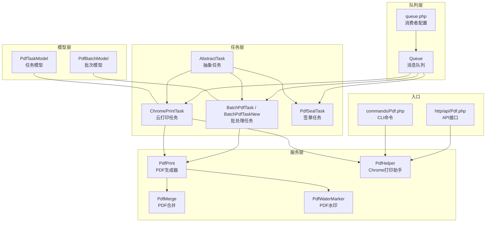

图表来源
- [PdfTaskModel.php](file://process/src/models/PdfTaskModel.php#L1-L52)
- [PdfBatchModel.php](file://process/src/models/PdfBatchModel.php#L1-L47)
- [PdfPrint.php](file://process/src/services/pdf/PdfPrint.php#L1-L756)
- [PdfMerge.php](file://process/src/services/pdf/PdfMerge.php#L1-L42)
- [PdfWaterMarker.php](file://process/src/services/pdf/PdfWaterMarker.php#L1-L160)
- [PdfHelper.php](file://process/src/helpers/PdfHelper.php#L1-L326)
- [ChromePrintTask.php](file://process/src/services/task/ChromePrintTask.php#L1-L95)
- [BatchPdfTask.php](file://process/src/services/task/BatchPdfTask.php#L1-L38)
- [BatchPdfTaskNew.php](file://process_envs/cugb/product/task/BatchPdfTaskNew.php#L1-L43)
- [PdfSealTask.php](file://process/src/services/task/PdfSealTask.php#L1-L148)
- [Queue.php](file://process/src/components/Queue.php#L1-L173)
- [queue.php（配置）](file://process/src/config/queue.php#L1-L13)

章节来源
- [PdfTaskModel.php](file://process/src/models/PdfTaskModel.php#L1-L52)
- [PdfBatchModel.php](file://process/src/models/PdfBatchModel.php#L1-L47)
- [PdfPrint.php](file://process/src/services/pdf/PdfPrint.php#L1-L756)
- [PdfHelper.php](file://process/src/helpers/PdfHelper.php#L1-L326)
- [ChromePrintTask.php](file://process/src/services/task/ChromePrintTask.php#L1-L95)
- [BatchPdfTask.php](file://process/src/services/task/BatchPdfTask.php#L1-L38)
- [BatchPdfTaskNew.php](file://process_envs/cugb/product/task/BatchPdfTaskNew.php#L1-L43)
- [PdfSealTask.php](file://process/src/services/task/PdfSealTask.php#L1-L148)
- [Queue.php](file://process/src/components/Queue.php#L1-L173)
- [queue.php（配置）](file://process/src/config/queue.php#L1-L13)

## 核心组件
- PdfTaskModel：描述单个PDF任务的元数据、状态与持久化字段，提供状态写入Redis缓存与数据库更新的能力。
- PdfBatchModel：描述批量打印任务的集合、条件与输出文件集合，支撑批处理场景。
- PdfPrint：统一的PDF生成入口，支持“云打印”（基于Chrome远程调试协议）与“套打”（Word模板转PDF），并内置日志套打合并、水印配置与签章事件派发。
- PdfHelper：封装Chrome打印端点创建、请求发送、DOM就绪检测、打印参数格式化与PDF落盘。
- ChromePrintTask：消费队列的任务，执行云打印并回写任务结果。
- BatchPdfTask / BatchPdfTaskNew：批处理任务，遍历参数列表逐项生成PDF并汇总文件路径。
- PdfMerge：基于FPDI对多个PDF进行顺序合并。
- PdfWaterMarker：基于FPDI对PDF添加文本或图片水印，支持旋转、平铺与页面尺寸适配。
- Queue：任务序列化入队、反序列化执行、消费者数量动态配置与主题长度查询。
- PdfSealTask：面向签章的复合任务，生成基础PDF并等待签章后返回结果。

章节来源
- [PdfTaskModel.php](file://process/src/models/PdfTaskModel.php#L1-L52)
- [PdfBatchModel.php](file://process/src/models/PdfBatchModel.php#L1-L47)
- [PdfPrint.php](file://process/src/services/pdf/PdfPrint.php#L1-L756)
- [PdfHelper.php](file://process/src/helpers/PdfHelper.php#L1-L326)
- [ChromePrintTask.php](file://process/src/services/task/ChromePrintTask.php#L1-L95)
- [BatchPdfTask.php](file://process/src/services/task/BatchPdfTask.php#L1-L38)
- [BatchPdfTaskNew.php](file://process_envs/cugb/product/task/BatchPdfTaskNew.php#L1-L43)
- [PdfMerge.php](file://process/src/services/pdf/PdfMerge.php#L1-L42)
- [PdfWaterMarker.php](file://process/src/services/pdf/PdfWaterMarker.php#L1-L160)
- [Queue.php](file://process/src/components/Queue.php#L1-L173)
- [PdfSealTask.php](file://process/src/services/task/PdfSealTask.php#L1-L148)

## 架构总览
PDF任务模型贯穿“任务建模—队列调度—生成执行—结果回写—后处理（合并/水印/签章）”的完整链路。下图展示典型云打印路径：

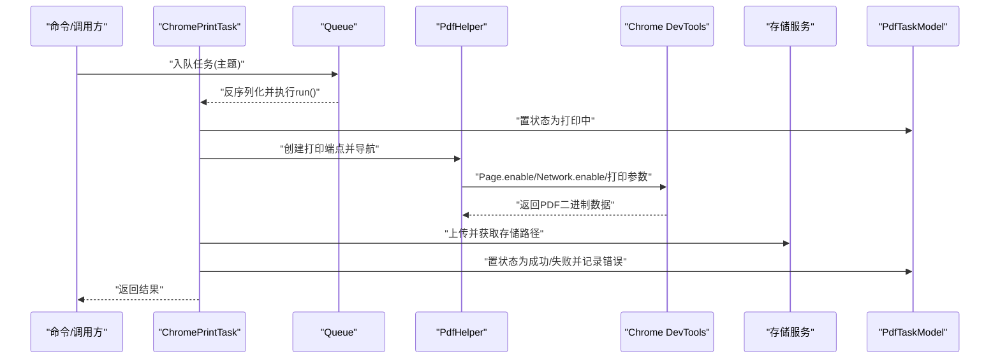

图表来源
- [ChromePrintTask.php](file://process/src/services/task/ChromePrintTask.php#L1-L95)
- [PdfHelper.php](file://process/src/helpers/PdfHelper.php#L1-L326)
- [Queue.php](file://process/src/components/Queue.php#L1-L173)
- [PdfTaskModel.php](file://process/src/models/PdfTaskModel.php#L1-L52)

## 详细组件分析

### 组件A：PdfTaskModel（任务模型）
- 数据结构要点
  - 字段：主键、任务token、参数JSON、创建者、创建时间、状态、文件路径、Cookie JSON、样式JSON、错误信息
  - 状态常量：待处理、打印中、成功、失败
- 生命周期与缓存
  - setStatus会同时写入Redis缓存与数据库，便于任务轮询与状态查询
- 作用
  - 单任务的生命周期管理与结果回写
  - 作为队列任务执行后的结果载体

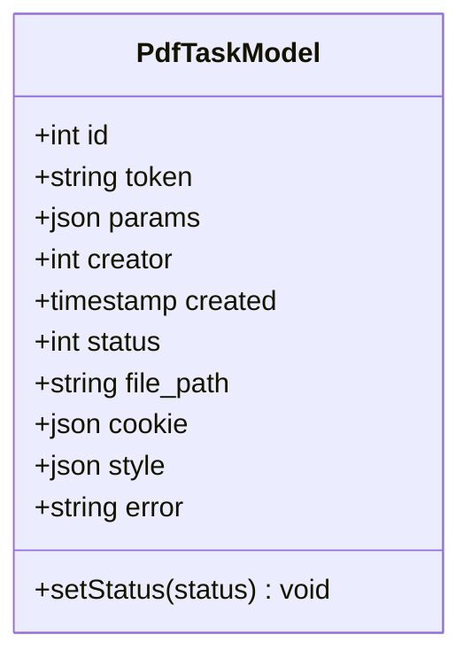

图表来源
- [PdfTaskModel.php](file://process/src/models/PdfTaskModel.php#L1-L52)

章节来源
- [PdfTaskModel.php](file://process/src/models/PdfTaskModel.php#L1-L52)

### 组件B：PdfPrint（PDF生成器）
- 功能特性
  - 云打印：通过PdfHelper驱动Chrome打印，支持样式覆盖、DOM就绪检测、落盘
  - 套打：根据模板ID选择Word模板，组装表单数据，生成PDF或DOCX
  - 日志套打：可选合并流程日志模板PDF
  - 水印配置：从表单配置中提取水印规则，供后续水印组件使用
  - 事件派发：在下载与签章阶段派发事件，便于扩展
- 关键流程
  - run()根据类型选择chromePrint或wordPrint
  - chromePrint()调用PdfHelper并落盘，随后可追加日志套打
  - wordPrint()构造上下文、渲染模板、生成PDF并返回路径

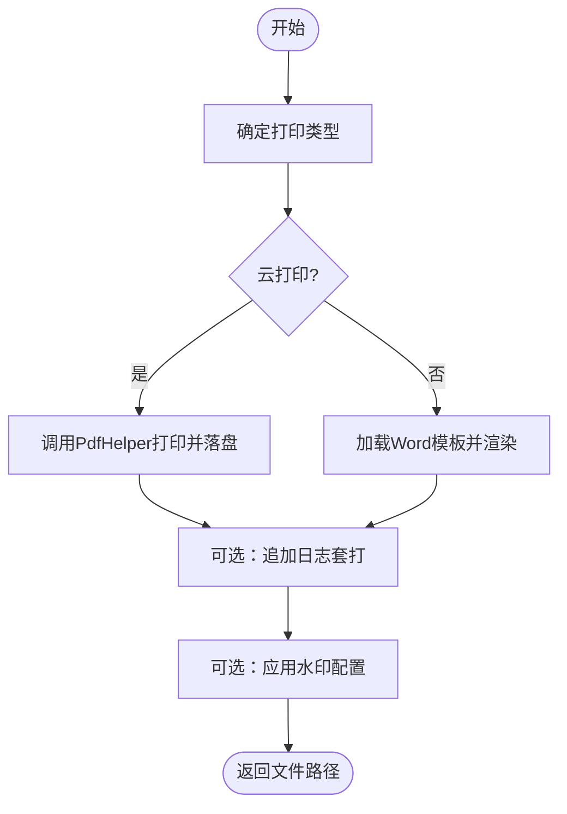

图表来源
- [PdfPrint.php](file://process/src/services/pdf/PdfPrint.php#L1-L756)

章节来源
- [PdfPrint.php](file://process/src/services/pdf/PdfPrint.php#L1-L756)

### 组件C：PdfHelper（Chrome打印助手）
- 能力
  - 创建/关闭Chrome调试端点
  - 发送Page.enable、Network.enable、设置额外HTTP头
  - DOM就绪检测与强制打印策略
  - 参数格式化（纸张、方向、边距、背景等）
  - PDF数据接收与落盘
- 性能与稳定性
  - 支持超时重试与错误处理
  - 可按环境替换域名以适配CDN/反向代理

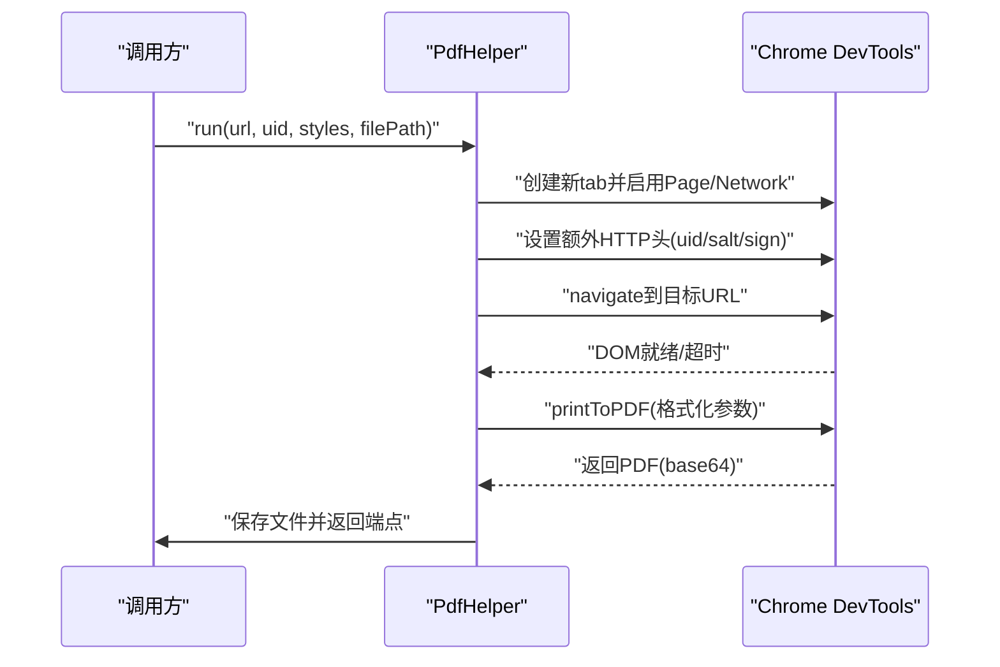

图表来源
- [PdfHelper.php](file://process/src/helpers/PdfHelper.php#L1-L326)

章节来源
- [PdfHelper.php](file://process/src/helpers/PdfHelper.php#L1-L326)

### 组件D：ChromePrintTask（云打印任务）
- 职责
  - 从数据库加载任务，置状态为“打印中”
  - 调用PdfHelper执行打印，上传至存储
  - 回写成功/失败状态与错误信息
- 并发与可靠性
  - 使用协程与延迟从库策略避免读写冲突
  - 异常捕获并回写失败状态

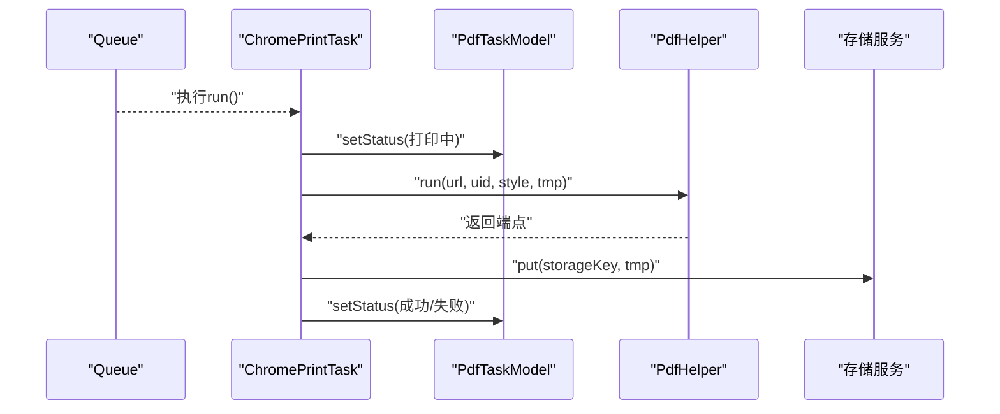

图表来源
- [ChromePrintTask.php](file://process/src/services/task/ChromePrintTask.php#L1-L95)
- [PdfHelper.php](file://process/src/helpers/PdfHelper.php#L1-L326)
- [PdfTaskModel.php](file://process/src/models/PdfTaskModel.php#L1-L52)

章节来源
- [ChromePrintTask.php](file://process/src/services/task/ChromePrintTask.php#L1-L95)
- [PdfTaskModel.php](file://process/src/models/PdfTaskModel.php#L1-L52)

### 组件E：批处理任务（BatchPdfTask / BatchPdfTaskNew）
- 职责
  - 读取批次条件，遍历参数列表逐个生成PDF
  - 维护批次状态与文件清单
  - 通过任务参数控制是否Word/是否PDF
- 适用场景
  - 多表单/多模板批量打印
  - 与PdfPrint协同完成批量生成与汇总

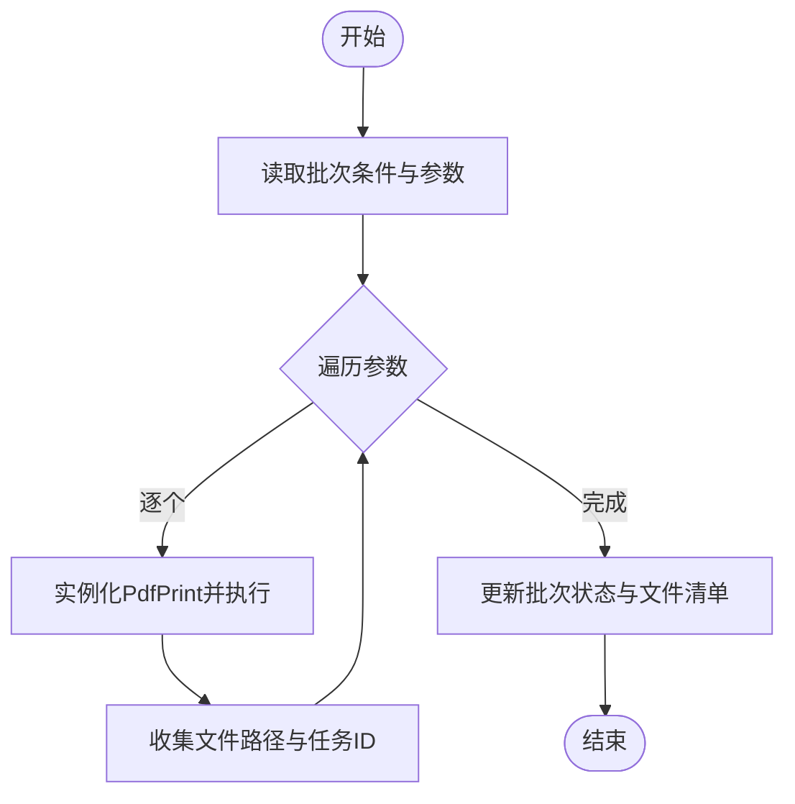

图表来源
- [BatchPdfTask.php](file://process/src/services/task/BatchPdfTask.php#L1-L38)
- [BatchPdfTaskNew.php](file://process_envs/cugb/product/task/BatchPdfTaskNew.php#L1-L43)
- [PdfPrint.php](file://process/src/services/pdf/PdfPrint.php#L1-L756)

章节来源
- [BatchPdfTask.php](file://process/src/services/task/BatchPdfTask.php#L1-L38)
- [BatchPdfTaskNew.php](file://process_envs/cugb/product/task/BatchPdfTaskNew.php#L1-L43)

### 组件F：PDF合并与水印
- PdfMerge：基于FPDI将多个PDF顺序拼接为一个文件
- PdfWaterMarker：基于FPDI对每页添加水印（文本/图片），支持旋转、平铺与页面尺寸适配

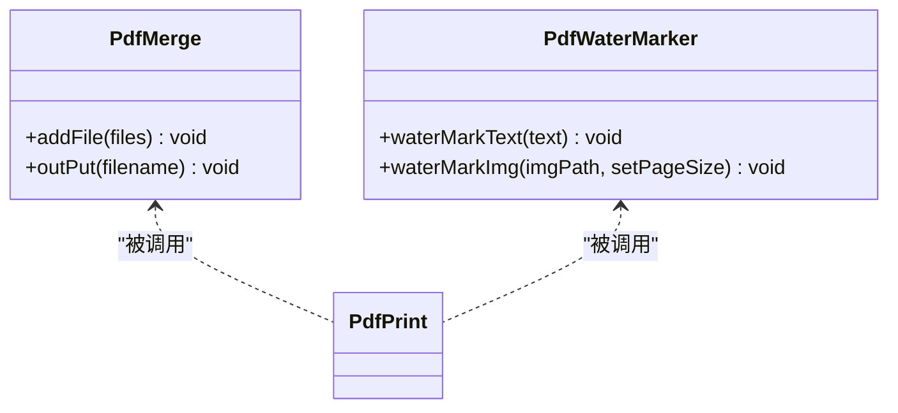

图表来源
- [PdfMerge.php](file://process/src/services/pdf/PdfMerge.php#L1-L42)
- [PdfWaterMarker.php](file://process/src/services/pdf/PdfWaterMarker.php#L1-L160)
- [PdfPrint.php](file://process/src/services/pdf/PdfPrint.php#L1-L756)

章节来源
- [PdfMerge.php](file://process/src/services/pdf/PdfMerge.php#L1-L42)
- [PdfWaterMarker.php](file://process/src/services/pdf/PdfWaterMarker.php#L1-L160)
- [PdfPrint.php](file://process/src/services/pdf/PdfPrint.php#L1-L756)

### 组件G：队列与任务调度（Queue / AbstractTask）
- 队列
  - 主题：低优先级、普通、高优先级
  - 入队：序列化任务对象并写入Stream
  - 出队：反序列化并调用run()
  - 消费者数量：支持YAML默认值与Redis缓存覆盖
- 抽象任务
  - 提供run()约定与安全序列化接口

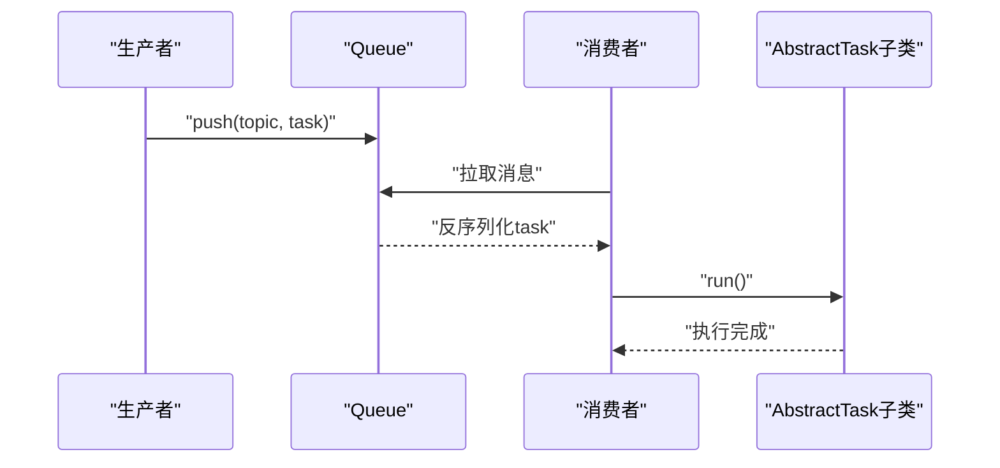

图表来源
- [Queue.php](file://process/src/components/Queue.php#L1-L173)
- [AbstractTask.php](file://process/src/services/task/AbstractTask.php#L1-L30)

章节来源
- [Queue.php](file://process/src/components/Queue.php#L1-L173)
- [AbstractTask.php](file://process/src/services/task/AbstractTask.php#L1-L30)
- [queue.php（配置）](file://process/src/config/queue.php#L1-L13)

### 组件H：签章任务（PdfSealTask）
- 职责
  - 生成基础PDF（云打印/套打）
  - 并发生成多个文件（协程+屏障）
  - 轮询任务状态直至完成
  - 返回最终文件路径数组
- 与事件/存储集成
  - 通过事件派发与存储服务配合，满足签章前置条件

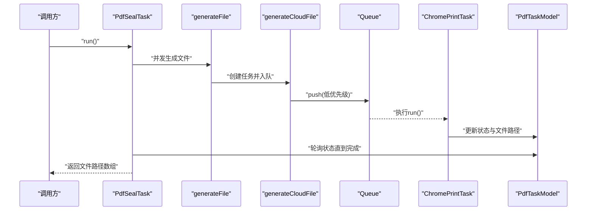

图表来源
- [PdfSealTask.php](file://process/src/services/task/PdfSealTask.php#L1-L148)
- [ChromePrintTask.php](file://process/src/services/task/ChromePrintTask.php#L1-L95)
- [PdfTaskModel.php](file://process/src/models/PdfTaskModel.php#L1-L52)
- [Queue.php](file://process/src/components/Queue.php#L1-L173)

章节来源
- [PdfSealTask.php](file://process/src/services/task/PdfSealTask.php#L1-L148)

### 组件I：入口与示例
- 命令入口（CLI）
  - commands/Pdf.php：提供调试、关闭端点、登录测试与Word模板演示
- API入口
  - http/api/Pdf.php：直接输出PDF字节流，便于快速验证

章节来源
- [Pdf.php（命令）](file://process/src/commands/Pdf.php#L1-L71)
- [Pdf.php（API）](file://process/src/http/api/Pdf.php#L1-L32)

## 依赖关系分析
- 模型依赖
  - PdfTaskModel依赖Redis缓存键工具与数据库ORM
  - PdfBatchModel依赖任务ID数组与JSON条件
- 服务依赖
  - PdfPrint依赖Word模板、表单数据、存储服务、事件派发器
  - PdfHelper依赖Chrome DevTools端点、网络头注入、打印参数
  - PdfMerge/PdfWaterMarker依赖FPDI与图像处理
- 任务依赖
  - ChromePrintTask依赖PdfHelper与存储服务
  - BatchPdfTask依赖PdfPrint与批次模型
  - PdfSealTask依赖队列、存储与任务模型轮询
- 队列依赖
  - Queue依赖Redis Stream、YAML配置与任务序列化

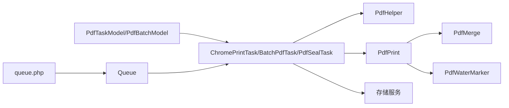

图表来源
- [PdfTaskModel.php](file://process/src/models/PdfTaskModel.php#L1-L52)
- [PdfBatchModel.php](file://process/src/models/PdfBatchModel.php#L1-L47)
- [ChromePrintTask.php](file://process/src/services/task/ChromePrintTask.php#L1-L95)
- [BatchPdfTask.php](file://process/src/services/task/BatchPdfTask.php#L1-L38)
- [PdfSealTask.php](file://process/src/services/task/PdfSealTask.php#L1-L148)
- [PdfPrint.php](file://process/src/services/pdf/PdfPrint.php#L1-L756)
- [PdfMerge.php](file://process/src/services/pdf/PdfMerge.php#L1-L42)
- [PdfWaterMarker.php](file://process/src/services/pdf/PdfWaterMarker.php#L1-L160)
- [Queue.php](file://process/src/components/Queue.php#L1-L173)
- [queue.php（配置）](file://process/src/config/queue.php#L1-L13)

章节来源
- [Queue.php](file://process/src/components/Queue.php#L1-L173)
- [PdfHelper.php](file://process/src/helpers/PdfHelper.php#L1-L326)

## 性能与内存优化
- 并发与限流
  - 使用协程并发生成多个PDF，结合屏障同步确保完成
  - 通过队列主题区分优先级，保障高优任务及时处理
- 内存与IO
  - 生成临时文件后及时清理，避免磁盘与内存泄漏
  - Chrome打印采用base64接收PDF，注意大文件传输开销
- 缓存与状态
  - 任务状态同时写入Redis与数据库，降低查询压力
  - 批次任务集中维护文件清单，减少多次查询
- 兼容性与降级
  - DOM就绪检测失败时采用强制打印策略，提升成功率
  - 按环境替换域名以适配不同部署形态

[本节为通用建议，不直接分析具体文件]

## 故障排查指南
- 云打印失败
  - 检查Chrome服务连通性与端口配置
  - 查看PdfHelper的DOM就绪检测与打印参数
  - 关注异常捕获与错误回写
- 任务状态不一致
  - 核对Redis缓存键与数据库状态是否同步
  - 确认任务执行前后状态变更逻辑
- 存储路径异常
  - 确认存储服务可用性与权限
  - 校验存储路径与相对路径映射
- 批处理文件缺失
  - 核对参数列表与生成流程
  - 检查批次模型文件清单更新逻辑

章节来源
- [ChromePrintTask.php](file://process/src/services/task/ChromePrintTask.php#L1-L95)
- [PdfHelper.php](file://process/src/helpers/PdfHelper.php#L1-L326)
- [PdfTaskModel.php](file://process/src/models/PdfTaskModel.php#L1-L52)

## 结论
PdfTaskModel作为PDF任务的核心数据载体，配合队列与任务执行器，实现了从参数建模、并发调度到生成回写的全链路闭环。通过PdfPrint统一生成入口、PdfMerge与PdfWaterMarker的后处理能力，以及批处理与签章任务的扩展，系统在复杂业务场景下具备良好的可维护性与可扩展性。建议在生产环境中完善监控与告警、优化大文件传输与存储策略，并持续评估Chrome打印稳定性与资源占用。

[本节为总结性内容，不直接分析具体文件]

## 附录：功能与流程图

### PDF生成流程（云打印）
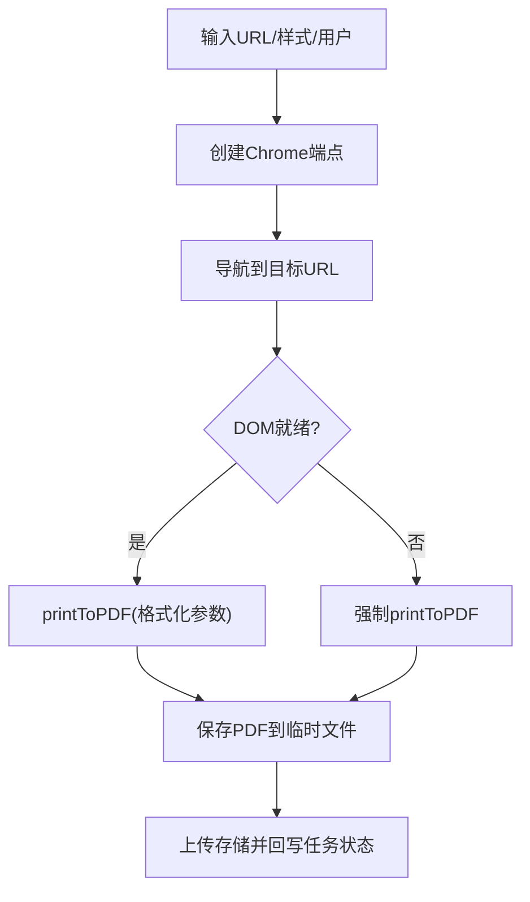

图表来源
- [PdfHelper.php](file://process/src/helpers/PdfHelper.php#L1-L326)
- [ChromePrintTask.php](file://process/src/services/task/ChromePrintTask.php#L1-L95)

### PDF生成流程（套打）
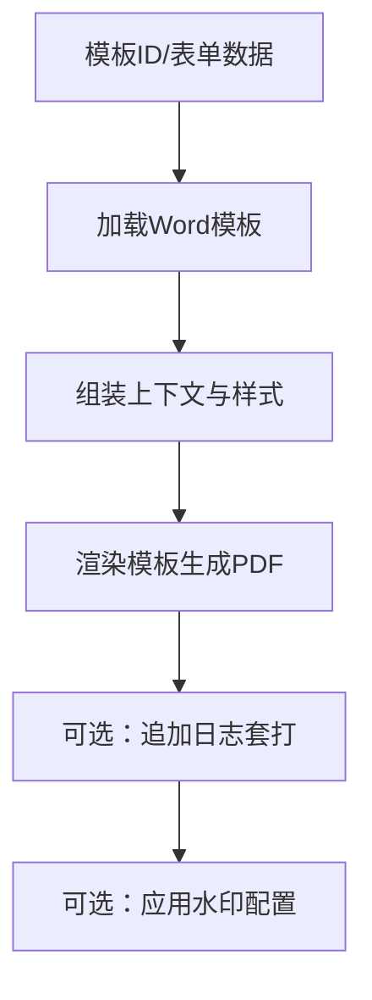

图表来源
- [PdfPrint.php](file://process/src/services/pdf/PdfPrint.php#L1-L756)

### 批处理流程
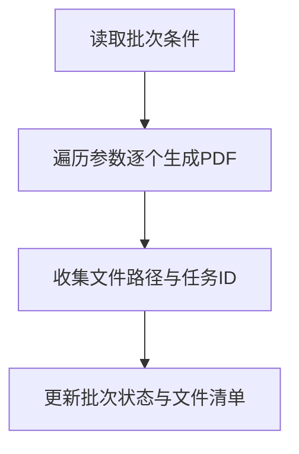

图表来源
- [BatchPdfTask.php](file://process/src/services/task/BatchPdfTask.php#L1-L38)
- [BatchPdfTaskNew.php](file://process_envs/cugb/product/task/BatchPdfTaskNew.php#L1-L43)

### 队列与消费者
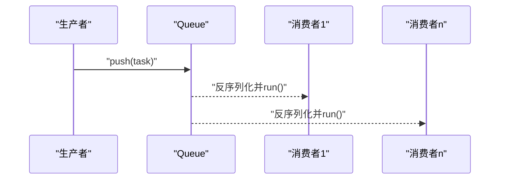

图表来源
- [Queue.php](file://process/src/components/Queue.php#L1-L173)
- [queue.php（配置）](file://process/src/config/queue.php#L1-L13)