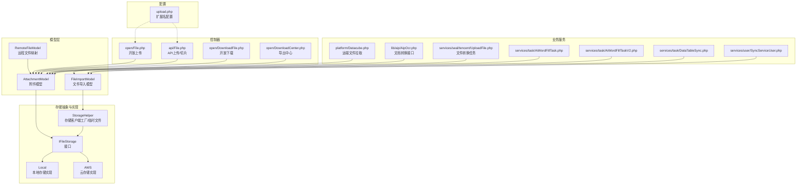
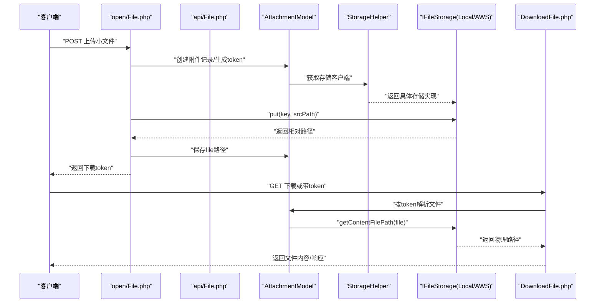
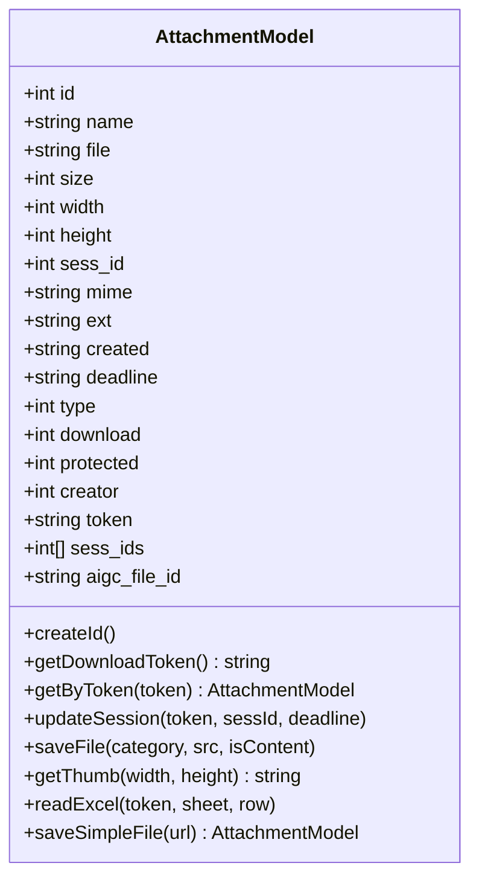
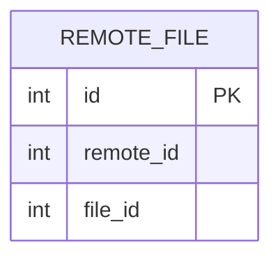
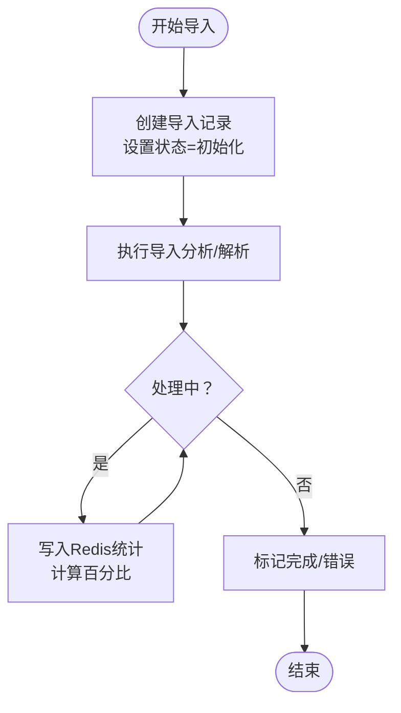
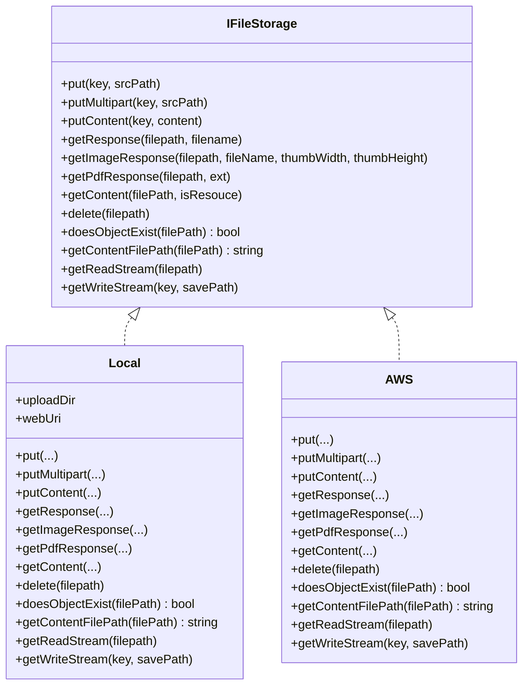
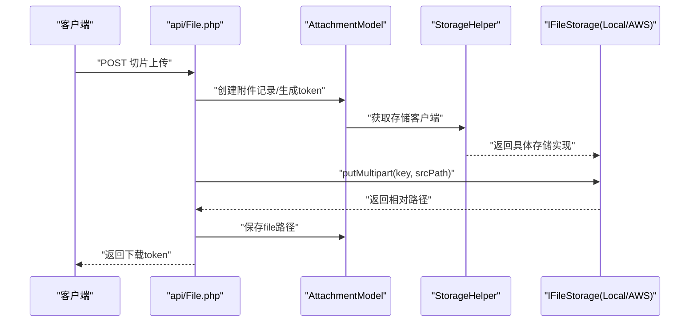
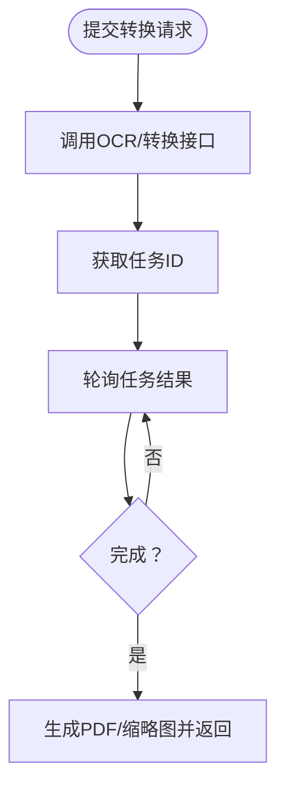
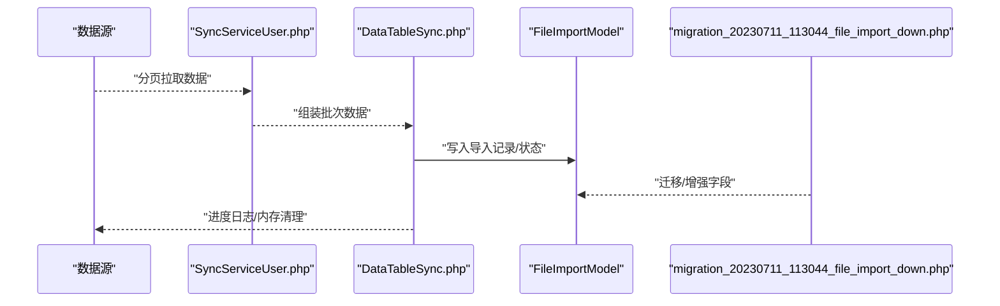
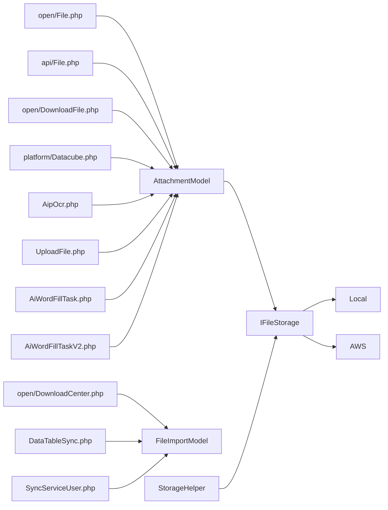

# 存储文件模型

<cite>
**本文引用的文件**
- [AttachmentModel.php](file://process/src/models/AttachmentModel.php)
- [RemoteFileModel.php](file://process/src/models/RemoteFileModel.php)
- [FileImportModel.php](file://process/src/models/FileImportModel.php)
- [StorageHelper.php](file://process/src/helpers/StorageHelper.php)
- [IFileStorage.php](file://process/src/services/storage/IFileStorage.php)
- [Local.php](file://process/src/services/storage/Local.php)
- [AWS.php](file://process/src/services/storage/AWS.php)
- [upload.php](file://process/src/config/upload.php)
- [migration_20240906_085546_remote_file.php](file://process/src/migrations/migration_20240906_085546_remote_file.php)
- [migration_20230711_113044_file_import_down.php](file://process/src/migrations/migration_20230711_113044_file_import_down.php)
- [File.php（open）](file://process/src/http/open/File.php)
- [DownloadFile.php](file://process/src/http/open/DownloadFile.php)
- [File.php（api）](file://process/src/http/api/File.php)
- [DownloadCenter.php](file://process/src/http/open/DownloadCenter.php)
- [Datacube.php](file://process/src/services/platform/Datacube.php)
- [migration_20250714_234817_ai_intelligent_agents_nzsc.php](file://process/src/migrations/migration_20250714_234817_ai_intelligent_agents_nzsc.php)
- [AipOcr.php](file://process/src/lib/aip/AipOcr.php)
- [UploadFile.php](file://process/src/services/seal/tencent/UploadFile.php)
- [AiWordFillTask.php](file://process/src/services/task/AiWordFillTask.php)
- [AiWordFillTaskV2.php](file://process/src/services/task/AiWordFillTaskV2.php)
- [DataTableSync.php](file://process/src/services/task/DataTableSync.php)
- [SyncServiceUser.php](file://process/src/services/user/SyncServiceUser.php)
- [database.sql](file://process/docs/sql/database.sql)
</cite>

## 目录
1. [简介](#简介)
2. [项目结构](#项目结构)
3. [核心组件](#核心组件)
4. [架构总览](#架构总览)
5. [详细组件分析](#详细组件分析)
6. [依赖关系分析](#依赖关系分析)
7. [性能考量](#性能考量)
8. [故障排查指南](#故障排查指南)
9. [结论](#结论)
10. [附录](#附录)

## 简介
本文件围绕存储文件相关数据模型与实现展开，系统性梳理附件模型、文件导入模型、远程文件模型在文件管理系统中的职责与协作关系；深入解析文件元数据管理、存储路径组织、访问权限控制、上传下载流程、格式转换与预览、导入导出与批量处理、数据迁移策略、查询与版本管理、安全与审计以及存储优化策略。文档面向不同技术背景读者，既提供高层架构视图，也给出代码级关系与流程图示。

## 项目结构
文件与存储相关的核心代码分布在以下模块：
- 模型层：附件、远程文件、文件导入等模型定义与行为
- 存储抽象与实现：IFileStorage 接口及本地/云存储实现
- 辅助工具：StorageHelper 提供存储客户端获取与临时文件管理
- 配置：上传扩展名白名单等
- 控制器：开放与API接口的上传、下载、导出中心等
- 业务服务：平台数据立方体拉取远端文件、AI文档填充、数据同步与迁移等
- 迁移脚本：远程文件表、导入模型字段等数据库演进

图表来源
- [AttachmentModel.php](file://process/src/models/AttachmentModel.php#L1-L253)
- [RemoteFileModel.php](file://process/src/models/RemoteFileModel.php#L1-L21)
- [FileImportModel.php](file://process/src/models/FileImportModel.php#L1-L95)
- [StorageHelper.php](file://process/src/helpers/StorageHelper.php#L1-L49)
- [IFileStorage.php](file://process/src/services/storage/IFileStorage.php#L1-L54)
- [Local.php](file://process/src/services/storage/Local.php#L1-L143)
- [AWS.php](file://process/src/services/storage/AWS.php#L130-L165)
- [upload.php](file://process/src/config/upload.php#L1-L15)
- [File.php（open）](file://process/src/http/open/File.php#L1-L47)
- [DownloadFile.php](file://process/src/http/open/DownloadFile.php#L1-L43)
- [File.php（api）](file://process/src/http/api/File.php#L1-L50)
- [DownloadCenter.php](file://process/src/http/open/DownloadCenter.php#L1-L48)
- [Datacube.php](file://process/src/services/platform/Datacube.php#L233-L255)
- [AipOcr.php](file://process/src/lib/aip/AipOcr.php#L2783-L2826)
- [UploadFile.php](file://process/src/services/seal/tencent/UploadFile.php#L207-L239)
- [AiWordFillTask.php](file://process/src/services/task/AiWordFillTask.php#L229-L258)
- [AiWordFillTaskV2.php](file://process/src/services/task/AiWordFillTaskV2.php#L229-L258)
- [DataTableSync.php](file://process/src/services/task/DataTableSync.php#L782-L815)
- [SyncServiceUser.php](file://process/src/services/user/SyncServiceUser.php#L162-L189)

章节来源
- [AttachmentModel.php](file://process/src/models/AttachmentModel.php#L1-L253)
- [StorageHelper.php](file://process/src/helpers/StorageHelper.php#L1-L49)
- [IFileStorage.php](file://process/src/services/storage/IFileStorage.php#L1-L54)
- [Local.php](file://process/src/services/storage/Local.php#L1-L143)
- [AWS.php](file://process/src/services/storage/AWS.php#L130-L165)
- [upload.php](file://process/src/config/upload.php#L1-L15)
- [File.php（open）](file://process/src/http/open/File.php#L1-L47)
- [DownloadFile.php](file://process/src/http/open/DownloadFile.php#L1-L43)
- [File.php（api）](file://process/src/http/api/File.php#L1-L50)
- [DownloadCenter.php](file://process/src/http/open/DownloadCenter.php#L1-L48)
- [Datacube.php](file://process/src/services/platform/Datacube.php#L233-L255)
- [AipOcr.php](file://process/src/lib/aip/AipOcr.php#L2783-L2826)
- [UploadFile.php](file://process/src/services/seal/tencent/UploadFile.php#L207-L239)
- [AiWordFillTask.php](file://process/src/services/task/AiWordFillTask.php#L229-L258)
- [AiWordFillTaskV2.php](file://process/src/services/task/AiWordFillTaskV2.php#L229-L258)
- [DataTableSync.php](file://process/src/services/task/DataTableSync.php#L782-L815)
- [SyncServiceUser.php](file://process/src/services/user/SyncServiceUser.php#L162-L189)

## 核心组件
- 附件模型（AttachmentModel）
  - 职责：统一管理文件元数据（名称、大小、扩展名、MIME、宽高、创建者、创建时间、下载次数、保护级别、有效期、会话关联等），生成下载令牌，提供缩略图生成、Excel读取、按token检索与会话绑定等能力。
  - 关键点：采用“token + id”组合的下载令牌；通过存储抽象写入真实文件路径；支持基于会话ID与有效期的访问控制。
- 远程文件模型（RemoteFileModel）
  - 职责：建立远端系统文件与本地附件的映射关系，便于跨系统复用与追踪。
  - 关键点：包含远端ID与本地文件ID索引，便于查询与统计。
- 文件导入模型（FileImportModel）
  - 职责：记录导入任务的状态、条件、结果路径与结果token，并提供导入进度查询。
  - 关键点：通过Redis队列统计成功/失败数量，计算百分比；提供按结果token检索的能力。
- 存储抽象与实现（IFileStorage、Local、AWS）
  - 职责：屏蔽本地与云存储差异，提供统一的put/putContent/getResponse/getContent/delete/缩略图/PDF转换等能力。
  - 关键点：Local负责本地目录组织与Web URI映射；AWS负责对象桶与临时文件处理；StorageHelper负责按环境配置选择具体实现。
- 配置（upload.php）
  - 职责：定义允许的文件扩展名分类，用于上传校验与预览策略。
  - 关键点：图像、文档、媒体、Excel、Word等分类，影响上传与预览行为。

章节来源
- [AttachmentModel.php](file://process/src/models/AttachmentModel.php#L1-L253)
- [RemoteFileModel.php](file://process/src/models/RemoteFileModel.php#L1-L21)
- [FileImportModel.php](file://process/src/models/FileImportModel.php#L1-L95)
- [IFileStorage.php](file://process/src/services/storage/IFileStorage.php#L1-L54)
- [Local.php](file://process/src/services/storage/Local.php#L1-L143)
- [AWS.php](file://process/src/services/storage/AWS.php#L130-L165)
- [upload.php](file://process/src/config/upload.php#L1-L15)

## 架构总览
下图展示从上传入口到存储落盘、再到下载与预览的整体流程，以及与导入、远端拉取、AI转换等业务环节的交互。

图表来源
- [File.php（open）](file://process/src/http/open/File.php#L1-L47)
- [File.php（api）](file://process/src/http/api/File.php#L1-L50)
- [AttachmentModel.php](file://process/src/models/AttachmentModel.php#L1-L253)
- [StorageHelper.php](file://process/src/helpers/StorageHelper.php#L1-L49)
- [IFileStorage.php](file://process/src/services/storage/IFileStorage.php#L1-L54)
- [Local.php](file://process/src/services/storage/Local.php#L1-L143)
- [DownloadFile.php](file://process/src/http/open/DownloadFile.php#L1-L43)

## 详细组件分析

### 附件模型（AttachmentModel）
- 数据结构与字段
  - 主键、名称、文件路径、大小、宽高、会话ID、MIME、扩展名、创建时间、类型、下载次数、保护级别、创建者、下载token、会话ID数组、有效期、AI文件ID等。
- 关键行为
  - 生成唯一ID与token，提供按token解析与校验的方法。
  - 保存文件至指定目录，支持内容直存与文件移动两种方式。
  - 缩略图生成：按目标尺寸生成并缓存缩略图。
  - Excel读取：通过存储临时文件后交由Excel组件迭代读取。
  - 会话绑定：将文件与会话ID、有效期关联，支持多实例共享。
- 安全与权限
  - 保护级别常量：无保护、用户受保护、系统受保护。
  - 下载token：token+id组合，防止直接枚举ID访问。
- 性能与优化
  - 目录分片：按ID分桶降低单目录文件数。
  - 缩略图缓存：避免重复生成。
  - 临时文件：通过存储层获取临时路径，减少内存占用。

图表来源
- [AttachmentModel.php](file://process/src/models/AttachmentModel.php#L1-L253)

章节来源
- [AttachmentModel.php](file://process/src/models/AttachmentModel.php#L1-L253)

### 远程文件模型（RemoteFileModel）
- 用途：记录远端系统文件ID与本地附件ID的映射，便于跨系统复用与审计。
- 表结构：包含自增主键、远端ID、本地文件ID，分别建立索引以提升查询效率。
- 使用场景：平台从远端拉取文件时，先下载到临时文件，再创建本地附件并插入该映射表。

图表来源
- [RemoteFileModel.php](file://process/src/models/RemoteFileModel.php#L1-L21)
- [migration_20240906_085546_remote_file.php](file://process/src/migrations/migration_20240906_085546_remote_file.php#L1-L29)

章节来源
- [RemoteFileModel.php](file://process/src/models/RemoteFileModel.php#L1-L21)
- [migration_20240906_085546_remote_file.php](file://process/src/migrations/migration_20240906_085546_remote_file.php#L1-L29)
- [Datacube.php](file://process/src/services/platform/Datacube.php#L233-L255)

### 文件导入模型（FileImportModel）
- 用途：记录导入任务的类型、条件、状态、结果路径与结果token，提供导入进度查询。
- 关键点：通过Redis队列统计成功/失败条目，计算完成百分比；提供按结果token解析导入记录的能力。
- 状态：初始化、分析中、完成、错误。

图表来源
- [FileImportModel.php](file://process/src/models/FileImportModel.php#L1-L95)
- [DataTableSync.php](file://process/src/services/task/DataTableSync.php#L782-L815)
- [SyncServiceUser.php](file://process/src/services/user/SyncServiceUser.php#L162-L189)

章节来源
- [FileImportModel.php](file://process/src/models/FileImportModel.php#L1-L95)
- [DataTableSync.php](file://process/src/services/task/DataTableSync.php#L782-L815)
- [SyncServiceUser.php](file://process/src/services/user/SyncServiceUser.php#L162-L189)

### 存储抽象与实现（IFileStorage、Local、AWS）
- IFileStorage接口定义了统一的存储能力：上传、分片上传、内容写入、响应返回、内容读取、删除、存在性检查、临时文件路径、流式读写等。
- Local实现
  - 组织目录：按年月分层，进一步按ID分桶。
  - Web URI映射：对外暴露受控访问路径。
  - 缩略图与PDF转换：按需生成并缓存。
  - 临时文件：根据环境特殊逻辑解析token对应的物理路径。
- AWS实现
  - 支持对象桶与键的读写，按需生成缩略图并缓存。
  - 通过临时文件下载对象内容，保障大文件处理。

图表来源
- [IFileStorage.php](file://process/src/services/storage/IFileStorage.php#L1-L54)
- [Local.php](file://process/src/services/storage/Local.php#L1-L143)
- [AWS.php](file://process/src/services/storage/AWS.php#L130-L165)

章节来源
- [IFileStorage.php](file://process/src/services/storage/IFileStorage.php#L1-L54)
- [Local.php](file://process/src/services/storage/Local.php#L1-L143)
- [AWS.php](file://process/src/services/storage/AWS.php#L130-L165)

### 上传与下载流程
- 小文件上传（open/File.php）
  - 校验上传文件合法性，创建附件记录并生成token，调用存储实现写入文件，返回下载token。
- 大文件切片上传（api/File.php）
  - 支持切片上传，结合存储实现的大文件分片能力，最终合并或持久化。
- 下载（open/DownloadFile.php）
  - 支持URL直返或按file_id解析，通过存储层获取物理路径并返回内容或响应对象。
- 导出中心（open/DownloadCenter.php）
  - 触发导出任务，将导出状态入队，异步生成结果文件并更新记录。

图表来源
- [File.php（api）](file://process/src/http/api/File.php#L1-L50)
- [AttachmentModel.php](file://process/src/models/AttachmentModel.php#L1-L253)
- [StorageHelper.php](file://process/src/helpers/StorageHelper.php#L1-L49)
- [IFileStorage.php](file://process/src/services/storage/IFileStorage.php#L1-L54)

章节来源
- [File.php（open）](file://process/src/http/open/File.php#L1-L47)
- [File.php（api）](file://process/src/http/api/File.php#L1-L50)
- [DownloadFile.php](file://process/src/http/open/DownloadFile.php#L1-L43)
- [DownloadCenter.php](file://process/src/http/open/DownloadCenter.php#L1-L48)

### 格式转换与预览
- 文档转换接口（AipOcr.php）
  - 提供图片/URL/PDF转请求与结果查询接口，可用于OCR与文档转换。
- 腾讯电子签文件转换（UploadFile.php）
  - 创建转换任务、查询进度，支持异步转换与状态反馈。
- PDF预览（Local/AWS）
  - 若无PDF缓存则通过工具链生成PDF并返回对应响应。

图表来源
- [AipOcr.php](file://process/src/lib/aip/AipOcr.php#L2783-L2826)
- [UploadFile.php](file://process/src/services/seal/tencent/UploadFile.php#L207-L239)
- [Local.php](file://process/src/services/storage/Local.php#L92-L101)
- [AWS.php](file://process/src/services/storage/AWS.php#L151-L165)

章节来源
- [AipOcr.php](file://process/src/lib/aip/AipOcr.php#L2783-L2826)
- [UploadFile.php](file://process/src/services/seal/tencent/UploadFile.php#L207-L239)
- [Local.php](file://process/src/services/storage/Local.php#L92-L101)
- [AWS.php](file://process/src/services/storage/AWS.php#L151-L165)

### 导入导出、批量处理与数据迁移
- 批量处理（DataTableSync.php）
  - 将大数据集按批次处理，预取旧记录、内存监控与清理、周期性日志输出，确保稳定与可观测。
- 用户数据源同步（SyncServiceUser.php）
  - 支持API与SQL两种数据源，分页拉取并去重，避免无限循环。
- 导入模型迁移（migration_20230711_113044_file_import_down.php）
  - 为导入表增加token字段，便于结果文件的安全访问与追踪。
- 远端文件导入（Datacube.php + migration_20250714_234817_ai_intelligent_agents_nzsc.php）
  - 从远端系统下载文件，创建本地附件并建立映射，支持AI文件ID等扩展字段。

图表来源
- [SyncServiceUser.php](file://process/src/services/user/SyncServiceUser.php#L162-L189)
- [DataTableSync.php](file://process/src/services/task/DataTableSync.php#L782-L815)
- [FileImportModel.php](file://process/src/models/FileImportModel.php#L1-L95)
- [migration_20230711_113044_file_import_down.php](file://process/src/migrations/migration_20230711_113044_file_import_down.php#L1-L34)
- [Datacube.php](file://process/src/services/platform/Datacube.php#L233-L255)
- [migration_20250714_234817_ai_intelligent_agents_nzsc.php](file://process/src/migrations/migration_20250714_234817_ai_intelligent_agents_nzsc.php#L34-L72)

章节来源
- [SyncServiceUser.php](file://process/src/services/user/SyncServiceUser.php#L162-L189)
- [DataTableSync.php](file://process/src/services/task/DataTableSync.php#L782-L815)
- [FileImportModel.php](file://process/src/models/FileImportModel.php#L1-L95)
- [migration_20230711_113044_file_import_down.php](file://process/src/migrations/migration_20230711_113044_file_import_down.php#L1-L34)
- [Datacube.php](file://process/src/services/platform/Datacube.php#L233-L255)
- [migration_20250714_234817_ai_intelligent_agents_nzsc.php](file://process/src/migrations/migration_20250714_234817_ai_intelligent_agents_nzsc.php#L34-L72)

### 查询、搜索与版本管理
- 附件查询
  - 基于token解析与校验，支持按会话ID与有效期关联查询。
  - 通过目录分片与索引字段（如file_id）快速定位。
- 搜索与限制
  - 用户搜索频率限制与每日配额通过Redis计数与事件分发机制实现，避免滥用。
- 版本管理
  - 通过会话ID数组与有效期字段实现多版本/多实例共享与过期控制。

章节来源
- [AttachmentModel.php](file://process/src/models/AttachmentModel.php#L1-L253)
- [database.sql](file://process/docs/sql/database.sql#L843-L883)

### 安全机制、访问审计与存储优化
- 安全机制
  - 下载token：token+id组合，防止ID枚举。
  - 保护级别：用户/系统受保护，配合权限控制。
  - 上传扩展名校验：依据配置限制可上传类型。
- 访问审计
  - 通过搜索与导出中心等接口记录访问轨迹，结合Redis计数与事件派发实现限流与告警。
- 存储优化
  - 目录分片：按ID分桶降低单目录压力。
  - 缩略图缓存：避免重复生成。
  - 临时文件：统一管理生命周期，防止磁盘碎片与泄漏。

章节来源
- [AttachmentModel.php](file://process/src/models/AttachmentModel.php#L1-L253)
- [upload.php](file://process/src/config/upload.php#L1-L15)
- [Local.php](file://process/src/services/storage/Local.php#L1-L143)
- [AWS.php](file://process/src/services/storage/AWS.php#L130-L165)
- [database.sql](file://process/docs/sql/database.sql#L843-L883)

## 依赖关系分析
- 组件耦合
  - 模型层依赖存储抽象，控制器依赖模型与存储辅助，业务服务依赖模型与存储实现。
- 外部依赖
  - 云存储SDK（AWS）、图像处理库、Excel读取组件、Redis与事件派发器。
- 循环依赖
  - 通过接口与辅助类解耦，未见明显循环依赖迹象。

图表来源
- [File.php（open）](file://process/src/http/open/File.php#L1-L47)
- [File.php（api）](file://process/src/http/api/File.php#L1-L50)
- [DownloadFile.php](file://process/src/http/open/DownloadFile.php#L1-L43)
- [DownloadCenter.php](file://process/src/http/open/DownloadCenter.php#L1-L48)
- [AttachmentModel.php](file://process/src/models/AttachmentModel.php#L1-L253)
- [IFileStorage.php](file://process/src/services/storage/IFileStorage.php#L1-L54)
- [Local.php](file://process/src/services/storage/Local.php#L1-L143)
- [AWS.php](file://process/src/services/storage/AWS.php#L130-L165)
- [StorageHelper.php](file://process/src/helpers/StorageHelper.php#L1-L49)
- [Datacube.php](file://process/src/services/platform/Datacube.php#L233-L255)
- [AipOcr.php](file://process/src/lib/aip/AipOcr.php#L2783-L2826)
- [UploadFile.php](file://process/src/services/seal/tencent/UploadFile.php#L207-L239)
- [AiWordFillTask.php](file://process/src/services/task/AiWordFillTask.php#L229-L258)
- [AiWordFillTaskV2.php](file://process/src/services/task/AiWordFillTaskV2.php#L229-L258)
- [DataTableSync.php](file://process/src/services/task/DataTableSync.php#L782-L815)
- [SyncServiceUser.php](file://process/src/services/user/SyncServiceUser.php#L162-L189)

## 性能考量
- 目录分片与哈希分布：按ID分桶降低热点目录压力。
- 流式读写：通过流式接口减少内存占用，适合大文件处理。
- 缓存策略：缩略图与PDF缓存避免重复生成；Redis统计导入进度。
- 批处理与内存监控：分批处理与周期性清理，防止内存膨胀。
- 临时文件生命周期：协程延迟清理，避免资源泄漏。

## 故障排查指南
- 上传失败
  - 检查上传文件合法性与扩展名白名单；确认存储目录权限与磁盘空间。
  - 查看存储实现的返回与异常日志。
- 下载失败
  - 校验下载token是否正确；确认文件路径解析与存在性检查。
  - 若使用云存储，检查桶与键是否正确。
- 导入进度异常
  - 检查Redis队列键是否正确；核对统计项与总数一致性。
- 远端文件拉取失败
  - 校验远端地址与鉴权；查看下载响应与错误信息。

章节来源
- [File.php（open）](file://process/src/http/open/File.php#L1-L47)
- [File.php（api）](file://process/src/http/api/File.php#L1-L50)
- [DownloadFile.php](file://process/src/http/open/DownloadFile.php#L1-L43)
- [FileImportModel.php](file://process/src/models/FileImportModel.php#L1-L95)
- [Datacube.php](file://process/src/services/platform/Datacube.php#L233-L255)

## 结论
本文系统梳理了附件、远程文件与文件导入三类核心模型及其与存储抽象、控制器与业务服务的协作关系，覆盖了文件元数据管理、存储路径组织、访问控制、上传下载、格式转换与预览、导入导出与批量处理、数据迁移、查询与版本管理、安全与审计以及存储优化策略。通过接口化与分层设计，系统在保证扩展性的同时兼顾性能与稳定性。

## 附录
- 数据库结构参考：敏感数据日志、搜索名称等表结构，体现审计与检索能力。

章节来源
- [database.sql](file://process/docs/sql/database.sql#L843-L883)