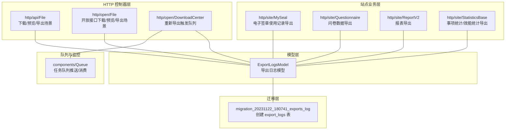
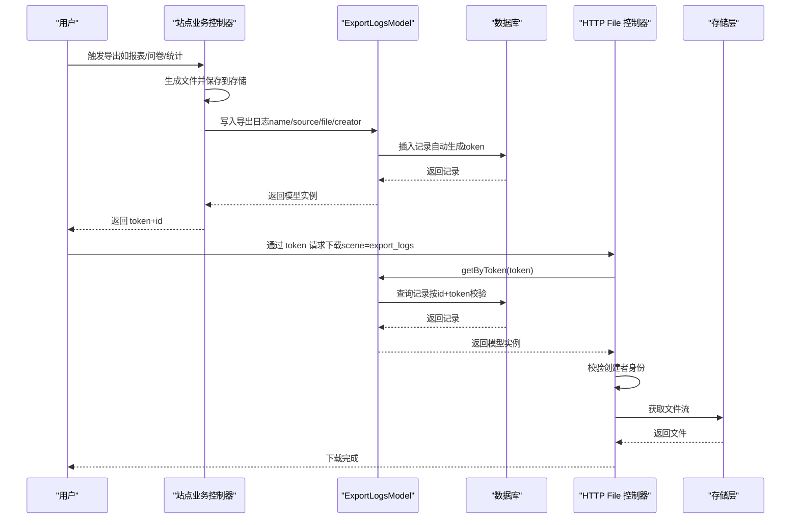
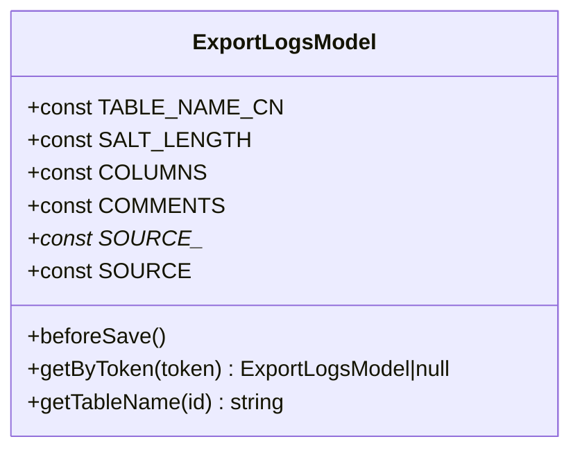
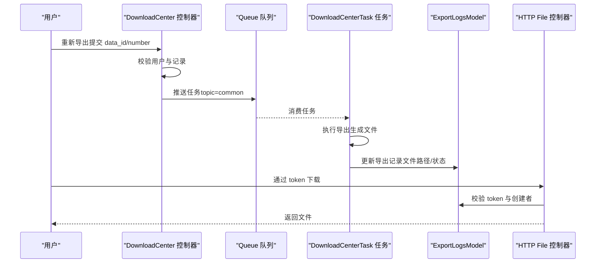
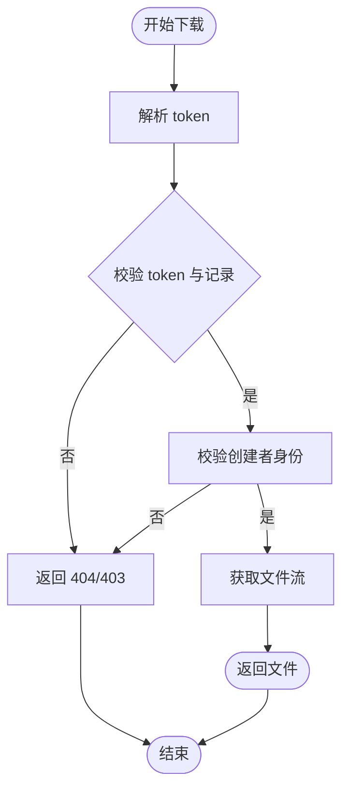

# 导出日志模型

<cite>
**本文引用的文件**
- [ExportLogsModel.php](file://process/src/models/ExportLogsModel.php)
- [migration_20231122_180741_exports_log.php](file://process/src/migrations/migration_20231122_180741_exports_log.php)
- [File.php](file://process/src/http/api/File.php)
- [File.php](file://process/src/http/open/File.php)
- [DownloadCenter.php](file://process/src/http/open/DownloadCenter.php)
- [MySeal.php](file://process/src/http/site/MySeal.php)
- [Questionnaire.php](file://process/src/http/site/Questionnaire.php)
- [ReportV2.php](file://process/src/http/site/ReportV2.php)
- [StatisticsBase.php](file://process/src/http/site/StatisticsBase.php)
- [Queue.php](file://process/src/components/Queue.php)
</cite>

## 目录
1. [简介](#简介)
2. [项目结构](#项目结构)
3. [核心组件](#核心组件)
4. [架构总览](#架构总览)
5. [详细组件分析](#详细组件分析)
6. [依赖关系分析](#依赖关系分析)
7. [性能考量](#性能考量)
8. [故障排查指南](#故障排查指南)
9. [结论](#结论)
10. [附录](#附录)

## 简介
本文件围绕导出日志模型 ExportLogsModel 展开，系统性梳理其在文件导出系统中的日志记录与追踪机制，覆盖导出任务生命周期（创建、执行状态跟踪、完成通知）、数据结构设计（导出类型、文件格式、数据量统计与耗时分析）、权限控制与访问审计、安全日志记录、导出任务监控与异常告警、性能分析，以及归档策略、存储优化与查询检索能力。本文旨在帮助开发者与运维人员快速理解并高效使用导出日志模型。

## 项目结构
导出日志模型位于 models 层，配套数据库迁移脚本定义了 export_logs 表结构；HTTP 控制器层通过场景化导出入口调用模型并生成导出记录；队列组件用于异步导出任务的调度与监控。



图示来源
- [ExportLogsModel.php](file://process/src/models/ExportLogsModel.php#L1-L114)
- [migration_20231122_180741_exports_log.php](file://process/src/migrations/migration_20231122_180741_exports_log.php#L1-L28)
- [File.php](file://process/src/http/api/File.php#L287-L403)
- [File.php](file://process/src/http/open/File.php#L119-L181)
- [DownloadCenter.php](file://process/src/http/open/DownloadCenter.php#L21-L46)
- [MySeal.php](file://process/src/http/site/MySeal.php#L220-L234)
- [Questionnaire.php](file://process/src/http/site/Questionnaire.php#L900-L918)
- [ReportV2.php](file://process/src/http/site/ReportV2.php#L80-L93)
- [StatisticsBase.php](file://process/src/http/site/StatisticsBase.php#L500-L509)
- [Queue.php](file://process/src/components/Queue.php#L1-L52)

章节来源
- [ExportLogsModel.php](file://process/src/models/ExportLogsModel.php#L1-L114)
- [migration_20231122_180741_exports_log.php](file://process/src/migrations/migration_20231122_180741_exports_log.php#L1-L28)

## 核心组件
- 导出日志模型 ExportLogsModel
  - 职责：定义导出日志表结构、字段注释、导出来源枚举、导出来源中文映射、保存前生成 token、按 token 查询导出记录、指定表名。
  - 关键点：
    - 字段包含：主键、文件名、来源、文件路径、创建者、token、创建时间。
    - 来源常量覆盖多类导出场景（如用户中心签章导出、问卷导出、报表导出、事项统计、效能统计等）。
    - token 生成规则：保存前为新记录且存在文件路径时生成固定长度的十六进制 token。
    - 查询方法：根据 token 分离 id 与 token 值，校验记录存在性与 token 匹配，返回模型实例或空。
    - 表名：统一返回 export_logs。

- 数据库迁移 migration_20231122_180741_exports_log
  - 职责：创建 export_logs 表，包含 id、name、source、file、creator、token、created 字段及默认值与约束。

- HTTP 控制器 File（API 与开放接口）
  - 职责：统一处理下载/显示/预览场景，其中“导出文件下载”场景通过 ExportLogsModel::getByToken 校验导出记录与权限，再返回文件响应。
  - 关键点：
    - 场景参数 scene 支持 normal、download_center、file_import、export_logs。
    - 对 export_logs 场景：仅允许创建者下载，否则返回 403；若 token 无效返回 404。
    - 下载成功后由存储层返回文件流或预览响应。

- 站点业务控制器
  - MySeal：导出电子签章使用记录后写入导出日志并返回 token+id 组合。
  - Questionnaire：导出问卷数据（Excel 或 Word 压缩包）后写入导出日志并返回 token+id 组合。
  - ReportV2：导出报表后写入导出日志并返回 token+id 组合。
  - StatisticsBase：导出事项统计与效能统计后写入导出日志并返回 token+id 组合。

- 队列组件 Queue
  - 职责：提供任务队列推送与消费能力，支持异步导出任务的调度与监控。

章节来源
- [ExportLogsModel.php](file://process/src/models/ExportLogsModel.php#L1-L114)
- [migration_20231122_180741_exports_log.php](file://process/src/migrations/migration_20231122_180741_exports_log.php#L1-L28)
- [File.php](file://process/src/http/api/File.php#L287-L403)
- [File.php](file://process/src/http/open/File.php#L119-L181)
- [MySeal.php](file://process/src/http/site/MySeal.php#L220-L234)
- [Questionnaire.php](file://process/src/http/site/Questionnaire.php#L900-L918)
- [ReportV2.php](file://process/src/http/site/ReportV2.php#L80-L93)
- [StatisticsBase.php](file://process/src/http/site/StatisticsBase.php#L500-L509)
- [Queue.php](file://process/src/components/Queue.php#L1-L52)

## 架构总览
导出日志模型贯穿“业务导出—日志记录—权限校验—文件下载”的完整链路，形成闭环的日志追踪与审计能力。



图示来源
- [ExportLogsModel.php](file://process/src/models/ExportLogsModel.php#L84-L113)
- [File.php](file://process/src/http/api/File.php#L287-L403)
- [File.php](file://process/src/http/open/File.php#L119-L181)
- [ReportV2.php](file://process/src/http/site/ReportV2.php#L80-L93)
- [Questionnaire.php](file://process/src/http/site/Questionnaire.php#L900-L918)
- [StatisticsBase.php](file://process/src/http/site/StatisticsBase.php#L500-L509)
- [MySeal.php](file://process/src/http/site/MySeal.php#L220-L234)

## 详细组件分析

### 导出日志模型 ExportLogsModel
- 数据结构与字段
  - 主键：自增 id
  - 名称：导出文件名
  - 来源：整型来源标识，对应多类导出场景
  - 文件：存储层文件路径
  - 创建者：导出发起用户 id
  - Token：导出访问令牌（保存前生成）
  - 创建时间：记录创建时间戳
- 导出来源枚举与中文映射
  - 覆盖用户中心签章导出、运维中心日志导出、订单/事项/评价/部门/岗位用户/反馈/退款/公章使用记录、快速填报、事项统计、效能统计、报表导出、表单字段导出、节点审批人信息导出等。
- 保存前钩子
  - 当记录为新记录且存在文件路径时，生成固定长度的十六进制 token，确保唯一性与安全性。
- 查询方法
  - getByToken：从 token 中分离 id 与 token 值，按 id 查询记录，校验 token 一致性，返回模型实例或空。
- 表名
  - 固定返回 export_logs。



图示来源
- [ExportLogsModel.php](file://process/src/models/ExportLogsModel.php#L1-L114)

章节来源
- [ExportLogsModel.php](file://process/src/models/ExportLogsModel.php#L1-L114)

### 导出任务生命周期管理
- 任务创建
  - 站点业务控制器在导出完成后，构造 ExportLogsModel 实例，填充 name、source、file、creator 字段并保存，生成 token+id。
- 执行状态跟踪
  - 对于耗时较长的导出，可通过队列组件异步执行，DownloadCenter 提供“重新导出”入口，将任务推送到队列，消费端执行实际导出逻辑并更新进度。
- 完成通知
  - 导出完成后，前端通过 token 访问下载接口，控制器校验 token 与创建者身份后返回文件，形成完成通知。



图示来源
- [DownloadCenter.php](file://process/src/http/open/DownloadCenter.php#L21-L46)
- [Queue.php](file://process/src/components/Queue.php#L1-L52)
- [File.php](file://process/src/http/api/File.php#L287-L403)

章节来源
- [DownloadCenter.php](file://process/src/http/open/DownloadCenter.php#L21-L46)
- [Queue.php](file://process/src/components/Queue.php#L1-L52)
- [File.php](file://process/src/http/api/File.php#L287-L403)

### 导出日志的数据结构设计
- 字段设计
  - id：主键，自增
  - name：导出文件名
  - source：导出来源标识（整型），对应枚举常量
  - file：文件存储路径
  - creator：导出创建者用户 id
  - token：导出访问令牌
  - created：创建时间
- 导出类型与来源
  - 通过 SOURCE_* 常量与 SOURCE 映射，明确不同业务模块的导出来源，便于审计与统计。
- 文件格式与数据量统计
  - 文件格式由业务侧决定（Excel、Word、压缩包等），导出日志记录 file 路径，便于后续查询与归档。
  - 数据量统计可在业务层计算后写入日志（例如导出条目数、文件大小等，建议扩展字段以满足需求）。
- 耗时分析
  - 可在业务导出前后记录时间戳，结合队列任务进度，形成耗时统计（建议扩展字段以记录开始/结束时间与耗时）。

章节来源
- [ExportLogsModel.php](file://process/src/models/ExportLogsModel.php#L1-L114)
- [ReportV2.php](file://process/src/http/site/ReportV2.php#L80-L93)
- [Questionnaire.php](file://process/src/http/site/Questionnaire.php#L900-L918)
- [StatisticsBase.php](file://process/src/http/site/StatisticsBase.php#L500-L509)
- [MySeal.php](file://process/src/http/site/MySeal.php#L220-L234)

### 权限控制、访问审计与安全日志记录
- 权限控制
  - HTTP File 控制器在 scene=export_logs 场景下，严格校验 token 与创建者身份，非创建者直接返回 403。
- 访问审计
  - 导出日志记录包含 creator、source、file、created 等关键信息，可用于审计导出行为与溯源。
- 安全日志
  - 下载过程中捕获存储异常并记录日志，保证问题可追溯。



图示来源
- [File.php](file://process/src/http/api/File.php#L372-L382)
- [File.php](file://process/src/http/open/File.php#L159-L167)

章节来源
- [File.php](file://process/src/http/api/File.php#L287-L403)
- [File.php](file://process/src/http/open/File.php#L119-L181)

### 导出任务监控、异常告警与性能分析
- 监控与队列
  - 通过队列组件推送与消费导出任务，支持异步执行与进度更新，便于监控任务状态与吞吐。
- 异常告警
  - 下载阶段捕获存储异常并记录日志，便于定位问题与触发告警。
- 性能分析
  - 建议在业务导出前后记录时间戳，结合队列任务进度，形成耗时统计与性能分析报告。

章节来源
- [Queue.php](file://process/src/components/Queue.php#L1-L52)
- [File.php](file://process/src/http/api/File.php#L395-L402)

### 归档策略、存储优化与查询检索
- 归档策略
  - 建议基于 created 时间与 source 进行分层归档（热/温/冷），并定期清理过期导出记录。
- 存储优化
  - 导出文件采用对象存储路径记录，避免重复存储；导出日志表字段精简，索引可考虑按 creator/source/created 建立。
- 查询检索
  - 支持按 token 快速定位导出记录；按 creator/source/created 进行范围查询与统计分析。

章节来源
- [ExportLogsModel.php](file://process/src/models/ExportLogsModel.php#L84-L113)
- [migration_20231122_180741_exports_log.php](file://process/src/migrations/migration_20231122_180741_exports_log.php#L1-L28)

## 依赖关系分析
- 模型与迁移
  - ExportLogsModel 依赖 export_logs 表结构，迁移脚本负责建表与字段定义。
- 控制器与模型
  - HTTP File 控制器在导出下载场景中直接依赖 ExportLogsModel 的 token 校验与权限校验。
- 业务控制器与模型
  - 多个站点业务控制器在导出完成后写入导出日志，形成统一的审计入口。
- 队列与导出
  - DownloadCenter 通过队列组件触发异步导出任务，提升系统吞吐与稳定性。

```mermaid
graph LR
M["ExportLogsModel"] <- --> D["migration_20231122_180741_exports_log"]
C1["http/api/File"] --> M
C2["http/open/File"] --> M
B1["http/site/MySeal"] --> M
B2["http/site/Questionnaire"] --> M
B3["http/site/ReportV2"] --> M
B4["http/site/StatisticsBase"] --> M
C3["http/open/DownloadCenter"] --> Q["components/Queue"]
```

图示来源
- [ExportLogsModel.php](file://process/src/models/ExportLogsModel.php#L1-L114)
- [migration_20231122_180741_exports_log.php](file://process/src/migrations/migration_20231122_180741_exports_log.php#L1-L28)
- [File.php](file://process/src/http/api/File.php#L287-L403)
- [File.php](file://process/src/http/open/File.php#L119-L181)
- [MySeal.php](file://process/src/http/site/MySeal.php#L220-L234)
- [Questionnaire.php](file://process/src/http/site/Questionnaire.php#L900-L918)
- [ReportV2.php](file://process/src/http/site/ReportV2.php#L80-L93)
- [StatisticsBase.php](file://process/src/http/site/StatisticsBase.php#L500-L509)
- [DownloadCenter.php](file://process/src/http/open/DownloadCenter.php#L21-L46)
- [Queue.php](file://process/src/components/Queue.php#L1-L52)

章节来源
- [ExportLogsModel.php](file://process/src/models/ExportLogsModel.php#L1-L114)
- [migration_20231122_180741_exports_log.php](file://process/src/migrations/migration_20231122_180741_exports_log.php#L1-L28)
- [File.php](file://process/src/http/api/File.php#L287-L403)
- [File.php](file://process/src/http/open/File.php#L119-L181)
- [MySeal.php](file://process/src/http/site/MySeal.php#L220-L234)
- [Questionnaire.php](file://process/src/http/site/Questionnaire.php#L900-L918)
- [ReportV2.php](file://process/src/http/site/ReportV2.php#L80-L93)
- [StatisticsBase.php](file://process/src/http/site/StatisticsBase.php#L500-L509)
- [DownloadCenter.php](file://process/src/http/open/DownloadCenter.php#L21-L46)
- [Queue.php](file://process/src/components/Queue.php#L1-L52)

## 性能考量
- 异步导出：通过队列组件异步执行耗时导出，降低请求延迟，提高并发能力。
- 存储访问：导出文件路径记录在数据库，下载时直接从存储层获取，减少内存占用。
- 日志查询：按 creator/source/created 建立索引，提升审计与统计查询效率。
- 耗时统计：建议扩展字段记录开始/结束时间与耗时，便于性能分析与容量规划。

## 故障排查指南
- token 校验失败
  - 现象：返回 404 或 403。
  - 排查：确认 token 结构（前半段 token，后半段 id），检查记录是否存在且 token 匹配。
- 权限不足
  - 现象：非创建者访问导出文件返回 403。
  - 排查：确认导出记录的 creator 与当前用户一致。
- 存储异常
  - 现象：下载阶段抛出存储异常并记录日志。
  - 排查：检查存储连接、权限与文件路径有效性。

章节来源
- [File.php](file://process/src/http/api/File.php#L372-L382)
- [File.php](file://process/src/http/open/File.php#L159-L167)
- [File.php](file://process/src/http/api/File.php#L395-L402)

## 结论
ExportLogsModel 为导出系统提供了统一的日志记录与追踪能力，配合 HTTP 控制器的权限校验与队列组件的异步执行，形成了完整的导出生命周期管理方案。通过来源枚举、token 校验与审计字段，系统具备良好的可审计性与可追溯性。建议在现有基础上扩展耗时统计与数据量字段，进一步完善性能分析与容量管理能力。

## 附录
- 常用字段说明
  - id：导出记录主键
  - name：导出文件名
  - source：导出来源标识
  - file：文件存储路径
  - creator：导出创建者用户 id
  - token：导出访问令牌
  - created：创建时间
- 建议扩展字段
  - 开始时间、结束时间、耗时、导出条目数、文件大小等，便于性能分析与容量规划。