# 文件导入模型

<cite>
**本文引用的文件**
- [models/FileImportModel.php](file://process/src/models/FileImportModel.php)
- [services/task/ExcelImportTask.php](file://process/src/services/task/ExcelImportTask.php)
- [services/desktopManage/ExcelImportExportService.php](file://process/src/services/desktopManage/ExcelImportExportService.php)
- [services/excel/ExcelProcessorService.php](file://process/src/services/excel/ExcelProcessorService.php)
- [services/FileTemplate.php](file://process/src/services/FileTemplate.php)
- [http/site/FileImport.php](file://process/src/http/site/FileImport.php)
- [http/open/File.php](file://process/src/http/open/File.php)
- [http/api/File.php](file://process/src/http/api/File.php)
- [http/system/FileImport.php](file://process/src/http/system/FileImport.php)
- [http/open/DownloadCenter.php](file://process/src/http/open/DownloadCenter.php)
- [http/site/DataManage.php](file://process/src/http/site/DataManage.php)
- [http/site/Batch.php](file://process/src/http/site/Batch.php)
</cite>

## 目录
1. [简介](#简介)
2. [项目结构](#项目结构)
3. [核心组件](#核心组件)
4. [架构总览](#架构总览)
5. [详细组件分析](#详细组件分析)
6. [依赖关系分析](#依赖关系分析)
7. [性能考量](#性能考量)
8. [故障排查指南](#故障排查指南)
9. [结论](#结论)
10. [附录](#附录)

## 简介
本文件围绕“文件导入模型”展开，系统性阐述 FileImportModel 在文件导入体系中的角色定位、数据结构设计与状态管理；深入解析 Excel 文件导入流程（含多工作表处理、表头识别、模板映射、数据清洗与格式转换）；说明批量导入的实现策略（数据验证、错误处理、事务管理建议）；解释导入进度跟踪、状态管理与结果反馈机制；给出导入模板设计、字段映射与数据清洗的实现要点；最后总结性能优化、内存管理与大文件处理的最佳实践。

## 项目结构
文件导入相关的核心代码分布在以下模块：
- 模型层：FileImportModel 定义导入任务的持久化结构与状态机
- 任务层：ExcelImportTask 负责导入流程编排、分块读取、缓存与结果导出
- 服务层：ExcelImportExportService 提供模板解析、表头提取、字段映射与数据验证
- 工具层：ExcelProcessorService 提供基于 Spout 的流式读取与基于 PhpSpreadsheet 的轻量读取
- 模板层：FileTemplate 维护各类导入模板的元数据与错误列规则
- 控制器层：多个 HTTP 控制器负责调用模型与任务，提供进度查询、结果下载等接口

图示来源
- [models/FileImportModel.php](file://process/src/models/FileImportModel.php#L1-L95)
- [services/task/ExcelImportTask.php](file://process/src/services/task/ExcelImportTask.php#L1-L200)
- [services/desktopManage/ExcelImportExportService.php](file://process/src/services/desktopManage/ExcelImportExportService.php#L1-L200)
- [services/excel/ExcelProcessorService.php](file://process/src/services/excel/ExcelProcessorService.php#L1-L200)
- [services/FileTemplate.php](file://process/src/services/FileTemplate.php#L44-L152)
- [http/site/FileImport.php](file://process/src/http/site/FileImport.php#L1-L80)
- [http/open/File.php](file://process/src/http/open/File.php#L1-L160)
- [http/api/File.php](file://process/src/http/api/File.php#L1-L40)
- [http/system/FileImport.php](file://process/src/http/system/FileImport.php#L1-L80)
- [http/open/DownloadCenter.php](file://process/src/http/open/DownloadCenter.php#L1-L20)
- [http/site/DataManage.php](file://process/src/http/site/DataManage.php#L1-L40)

章节来源
- [models/FileImportModel.php](file://process/src/models/FileImportModel.php#L1-L95)
- [services/task/ExcelImportTask.php](file://process/src/services/task/ExcelImportTask.php#L1-L200)
- [services/desktopManage/ExcelImportExportService.php](file://process/src/services/desktopManage/ExcelImportExportService.php#L1-L200)
- [services/excel/ExcelProcessorService.php](file://process/src/services/excel/ExcelProcessorService.php#L1-L200)
- [services/FileTemplate.php](file://process/src/services/FileTemplate.php#L44-L152)
- [http/site/FileImport.php](file://process/src/http/site/FileImport.php#L1-L80)
- [http/open/File.php](file://process/src/http/open/File.php#L1-L160)
- [http/api/File.php](file://process/src/http/api/File.php#L1-L40)
- [http/system/FileImport.php](file://process/src/http/system/FileImport.php#L1-L80)
- [http/open/DownloadCenter.php](file://process/src/http/open/DownloadCenter.php#L1-L20)
- [http/site/DataManage.php](file://process/src/http/site/DataManage.php#L1-L40)

## 核心组件
- FileImportModel：定义导入任务的数据库结构、状态常量与状态查询方法，提供基于 token 的安全查询与导入进度聚合统计
- ExcelImportTask：导入流程编排器，负责初始化、分块读取、模板解析、数据转换、缓存落盘、结果导出与日志记录
- ExcelImportExportService：模板解析与数据验证的核心服务，负责表头提取、模板映射、字段清洗、必填校验、唯一性校验、子表合计校验等
- ExcelProcessorService：提供基于 Spout 的流式读取与基于 PhpSpreadsheet 的轻量读取能力，支持按列过滤、日期转换、RichText 清洗
- FileTemplate：维护各类导入模板的静态清单、模板路径、名称与错误列规则，支撑异常结果回写

章节来源
- [models/FileImportModel.php](file://process/src/models/FileImportModel.php#L1-L95)
- [services/task/ExcelImportTask.php](file://process/src/services/task/ExcelImportTask.php#L1-L200)
- [services/desktopManage/ExcelImportExportService.php](file://process/src/services/desktopManage/ExcelImportExportService.php#L2175-L2439)
- [services/excel/ExcelProcessorService.php](file://process/src/services/excel/ExcelProcessorService.php#L838-L1000)
- [services/FileTemplate.php](file://process/src/services/FileTemplate.php#L44-L152)

## 架构总览
整体导入流程由“控制器 → 模型 → 任务 → 服务 → 工具”的链路构成。控制器通过 FileImportModel 获取导入任务上下文，任务层驱动 ExcelImportExportService 与 ExcelProcessorService 完成模板解析与数据读取，期间将数据分批转换后写入 Redis 缓存，最终根据错误数据生成异常结果 Excel 并更新模型状态。

```mermaid
sequenceDiagram
participant U as "用户/前端"
participant Ctrl as "HTTP控制器"
participant Model as "FileImportModel"
participant Task as "ExcelImportTask"
participant Svc as "ExcelImportExportService"
participant Proc as "ExcelProcessorService"
U->>Ctrl : "提交导入请求"
Ctrl->>Model : "按token查询导入任务"
Ctrl->>Task : "启动导入任务"
Task->>Svc : "提取表头与模板结构"
Task->>Proc : "流式读取Excel数据块"
Proc-->>Task : "回调返回数据块"
Task->>Svc : "按模板映射转换数据"
Task->>Task : "写入Redis缓存(成功/错误)"
Task->>Model : "更新状态与统计"
Task-->>Ctrl : "返回进度/结果"
Ctrl-->>U : "进度轮询/异常结果下载"
```

图示来源
- [http/site/FileImport.php](file://process/src/http/site/FileImport.php#L1-L80)
- [models/FileImportModel.php](file://process/src/models/FileImportModel.php#L54-L91)
- [services/task/ExcelImportTask.php](file://process/src/services/task/ExcelImportTask.php#L219-L363)
- [services/desktopManage/ExcelImportExportService.php](file://process/src/services/desktopManage/ExcelImportExportService.php#L2175-L2439)
- [services/excel/ExcelProcessorService.php](file://process/src/services/excel/ExcelProcessorService.php#L937-L1000)

## 详细组件分析

### FileImportModel 数据结构与状态管理
- 数据结构
  - 关键字段：id、type、condition、status、creator、up_token、res_path、res_token、created、result
  - 字段注释：清晰标注各字段含义，便于前端展示与审计
- 状态机
  - 初始态、解析态、完成态、错误态
  - 通过状态字段控制导入生命周期
- 进度查询
  - 通过 Redis 集合统计成功/错误数量与总量，计算百分比
  - 支持按 token 安全反查导入任务，防止越权访问

图示来源
- [models/FileImportModel.php](file://process/src/models/FileImportModel.php#L1-L95)

章节来源
- [models/FileImportModel.php](file://process/src/models/FileImportModel.php#L1-L95)

### ExcelImportTask 导入流程编排
- 初始化与参数校验
  - 校验导入类型与必要参数（如 identity、table_id、id）
- 分块读取与转换
  - 使用 ExcelProcessorService 的流式读取回调，按块读取并交由服务层进行模板映射与转换
  - 将转换后的数据写入 loadData['pass']，仅做转换不做验证
- 缓存与状态
  - 将成功/错误数据写入 Redis 列表，记录总数，更新模型状态为“解析完成”
- 保存阶段
  - 从 Redis 逐条取出“通过”数据，调用具体导入方法执行业务保存，错误则回写到错误队列
- 结果导出
  - 对错误数据生成异常 Excel，回写到模型 res_path/res_token，并更新状态为“完成”
- 日志与清理
  - 记录导入动作日志；定期清理过期缓存

图示来源
- [services/task/ExcelImportTask.php](file://process/src/services/task/ExcelImportTask.php#L219-L363)
- [services/task/ExcelImportTask.php](file://process/src/services/task/ExcelImportTask.php#L365-L485)
- [services/excel/ExcelProcessorService.php](file://process/src/services/excel/ExcelProcessorService.php#L937-L1000)

章节来源
- [services/task/ExcelImportTask.php](file://process/src/services/task/ExcelImportTask.php#L1-L200)
- [services/task/ExcelImportTask.php](file://process/src/services/task/ExcelImportTask.php#L219-L363)
- [services/task/ExcelImportTask.php](file://process/src/services/task/ExcelImportTask.php#L365-L485)

### ExcelImportExportService 模板解析与数据验证
- 表头提取与模板映射
  - 支持主表与子表双层表头（合并单元格推断子表名），将第二/三行组合为“子表名.字段名”
  - 通过模板 index 查找字段映射，校验模板匹配与字段合法性
- 唯一性与必填校验
  - 校验导入文件必须包含 ID 或至少一个唯一字段
  - 对必填字段进行严格校验
- 数据清洗与格式转换
  - RichText 清洗、日期转换、数字格式标准化
  - 标签字段名称转 ID 缓存与缺失校验
- 子表合计校验
  - 对子表字段按规则进行合计校验，确保数据一致性
- 批量验证与统计
  - 统计插入/更新/错误/总数，返回结构化统计对象

图示来源
- [services/desktopManage/ExcelImportExportService.php](file://process/src/services/desktopManage/ExcelImportExportService.php#L2175-L2439)
- [services/desktopManage/ExcelImportExportService.php](file://process/src/services/desktopManage/ExcelImportExportService.php#L2800-L3000)

章节来源
- [services/desktopManage/ExcelImportExportService.php](file://process/src/services/desktopManage/ExcelImportExportService.php#L2175-L2439)
- [services/desktopManage/ExcelImportExportService.php](file://process/src/services/desktopManage/ExcelImportExportService.php#L2800-L3000)

### ExcelProcessorService 流式读取与数据块处理
- 流式读取
  - 基于 Spout 的 readExcelWithSpout 回调，按块读取，降低内存占用
  - 支持仅读取数据、关闭样式与数据验证，提升性能
- 数据块处理
  - 通过 ChunkReadFilter 限制列范围，减少 IO 与解析成本
  - RichText 清洗、日期转换、空值处理，保证下游清洗效率
  - 按“主表.子表.字段”结构组织数据，便于后续模板映射

图示来源
- [services/excel/ExcelProcessorService.php](file://process/src/services/excel/ExcelProcessorService.php#L1097-L1165)
- [services/desktopManage/ExcelImportExportService.php](file://process/src/services/desktopManage/ExcelImportExportService.php#L2461-L2520)
- [services/task/ExcelImportTask.php](file://process/src/services/task/ExcelImportTask.php#L687-L708)

章节来源
- [services/excel/ExcelProcessorService.php](file://process/src/services/excel/ExcelProcessorService.php#L838-L1000)
- [services/excel/ExcelProcessorService.php](file://process/src/services/excel/ExcelProcessorService.php#L1097-L1165)
- [services/desktopManage/ExcelImportExportService.php](file://process/src/services/desktopManage/ExcelImportExportService.php#L2461-L2520)
- [services/task/ExcelImportTask.php](file://process/src/services/task/ExcelImportTask.php#L687-L708)

### 导入模板设计与字段映射
- 模板清单
  - FileTemplate 维护多类模板（用户、岗位、字典、数据集、微系统-数据表、个人数据表等），包含模板路径、名称与错误列规则
- 字段映射
  - ExcelImportExportService 依据模板 index 将 Excel 表头映射到主表/子表字段，支持“子表名.字段名”复合键
- 错误列回写
  - 下载异常 Excel 时，自动在指定列写入错误原因，便于用户修复

章节来源
- [services/FileTemplate.php](file://process/src/services/FileTemplate.php#L44-L152)
- [services/desktopManage/ExcelImportExportService.php](file://process/src/services/desktopManage/ExcelImportExportService.php#L2175-L2439)
- [services/task/ExcelImportTask.php](file://process/src/services/task/ExcelImportTask.php#L306-L363)

### 数据清洗与格式转换
- 清洗策略
  - 去除富文本格式、统一日期格式、去除多余空白
  - 标签字段名称转 ID，缺失即报错
- 转换策略
  - 数字格式标准化，支持括号内别名提取
  - 附件/图片字段过滤，避免导入不支持类型

章节来源
- [services/desktopManage/ExcelImportExportService.php](file://process/src/services/desktopManage/ExcelImportExportService.php#L2800-L3000)
- [services/excel/ExcelProcessorService.php](file://process/src/services/excel/ExcelProcessorService.php#L848-L935)

### 批量导入策略与事务管理
- 策略说明
  - 采用“转换-缓存-保存”三层分离：转换阶段不做持久化，保存阶段逐条执行业务保存
  - 成功/错误分别入队，便于后续异常 Excel 生成与重试
- 事务建议
  - 保存阶段建议使用数据库事务包裹，失败回滚并记录错误原因
  - 对子表数据采用批量插入/更新，减少往返次数

章节来源
- [services/task/ExcelImportTask.php](file://process/src/services/task/ExcelImportTask.php#L264-L289)
- [services/desktopManage/ExcelImportExportService.php](file://process/src/services/desktopManage/ExcelImportExportService.php#L2778-L2812)

### 进度跟踪、状态管理与结果反馈
- 进度跟踪
  - Redis 中维护 total、success、error 三类计数，实时计算百分比
- 状态管理
  - 初始/解析完成/完成/错误四态流转，控制器据此判断是否可下载异常结果
- 结果反馈
  - 异常 Excel 下载链接与 token，支持多端访问

章节来源
- [models/FileImportModel.php](file://process/src/models/FileImportModel.php#L54-L91)
- [http/site/FileImport.php](file://process/src/http/site/FileImport.php#L1-L80)
- [http/open/File.php](file://process/src/http/open/File.php#L1-L160)
- [http/api/File.php](file://process/src/http/api/File.php#L1-L40)
- [http/system/FileImport.php](file://process/src/http/system/FileImport.php#L1-L80)
- [http/open/DownloadCenter.php](file://process/src/http/open/DownloadCenter.php#L1-L20)

## 依赖关系分析
- 控制器依赖模型：通过 FileImportModel 查询任务与进度
- 任务依赖服务与工具：ExcelImportTask 依赖 ExcelImportExportService 与 ExcelProcessorService 完成模板解析与数据读取
- 服务依赖工具：ExcelImportExportService 依赖 ExcelProcessorService 的流式读取能力
- 模板依赖：ExcelImportTask 与 ExcelImportExportService 依赖 FileTemplate 的模板元数据

图示来源
- [http/site/FileImport.php](file://process/src/http/site/FileImport.php#L1-L80)
- [models/FileImportModel.php](file://process/src/models/FileImportModel.php#L54-L91)
- [services/task/ExcelImportTask.php](file://process/src/services/task/ExcelImportTask.php#L1-L200)
- [services/desktopManage/ExcelImportExportService.php](file://process/src/services/desktopManage/ExcelImportExportService.php#L1-L200)
- [services/excel/ExcelProcessorService.php](file://process/src/services/excel/ExcelProcessorService.php#L1-L200)
- [services/FileTemplate.php](file://process/src/services/FileTemplate.php#L44-L152)

章节来源
- [http/site/FileImport.php](file://process/src/http/site/FileImport.php#L1-L80)
- [models/FileImportModel.php](file://process/src/models/FileImportModel.php#L54-L91)
- [services/task/ExcelImportTask.php](file://process/src/services/task/ExcelImportTask.php#L1-L200)
- [services/desktopManage/ExcelImportExportService.php](file://process/src/services/desktopManage/ExcelImportExportService.php#L1-L200)
- [services/excel/ExcelProcessorService.php](file://process/src/services/excel/ExcelProcessorService.php#L1-L200)
- [services/FileTemplate.php](file://process/src/services/FileTemplate.php#L44-L152)

## 性能考量
- 内存优化
  - 使用 Spout 流式读取，按块处理，避免一次性加载整表
  - 仅读取数据，关闭样式与数据验证，降低内存与 CPU 开销
- I/O 优化
  - 通过列过滤仅读取表头对应列，减少解析与拷贝
  - 仅在必要时读取前两行以判定表头布局
- 缓存策略
  - Redis 列表存储成功/错误数据，避免频繁落库
  - 按日期维度清理过期缓存，防止缓存膨胀
- 大文件处理
  - 合理设置 chunkSize（与服务层保持一致），平衡吞吐与内存占用
  - 对富文本与日期字段进行预处理，减少后续清洗成本

章节来源
- [services/excel/ExcelProcessorService.php](file://process/src/services/excel/ExcelProcessorService.php#L838-L1000)
- [services/task/ExcelImportTask.php](file://process/src/services/task/ExcelImportTask.php#L687-L708)
- [services/desktopManage/ExcelImportExportService.php](file://process/src/services/desktopManage/ExcelImportExportService.php#L2175-L2439)

## 故障排查指南
- 常见问题
  - 表头不匹配：模板映射校验失败，提示包含模板未定义的字段
  - 缺少唯一字段：导入文件必须包含 ID 或至少一个唯一字段
  - 文件不存在/记录不存在：检查上传 token 与存储路径
  - 异常 Excel 未生成：确认错误队列是否存在数据，检查导出逻辑
- 排查步骤
  - 通过控制器接口查询导入任务状态与进度
  - 检查 Redis 中 total/success/error 计数是否一致
  - 下载异常 Excel，核对错误列内容
  - 核对模板路径与错误列配置

章节来源
- [services/desktopManage/ExcelImportExportService.php](file://process/src/services/desktopManage/ExcelImportExportService.php#L2339-L2400)
- [services/desktopManage/ExcelImportExportService.php](file://process/src/services/desktopManage/ExcelImportExportService.php#L2300-L2333)
- [services/task/ExcelImportTask.php](file://process/src/services/task/ExcelImportTask.php#L219-L260)
- [http/site/FileImport.php](file://process/src/http/site/FileImport.php#L1-L80)
- [http/open/File.php](file://process/src/http/open/File.php#L1-L160)

## 结论
FileImportModel 作为导入任务的中枢模型，结合 ExcelImportTask 的流程编排与 ExcelImportExportService 的模板解析能力，形成了稳定高效的文件导入体系。通过流式读取、列过滤与 Redis 缓存，系统在保证正确性的同时兼顾了性能与可扩展性。建议在生产环境中进一步完善事务封装与重试机制，并持续优化模板与字段映射以提升用户体验。

## 附录
- 模板设计要点
  - 明确主表与子表字段命名规范，避免歧义
  - 为关键字段添加必填标识，便于前端与后端统一校验
- 字段映射最佳实践
  - 使用“子表名.字段名”复合键，确保子表字段映射准确
  - 对易混字段提供别名或注释，减少人工错误
- 数据清洗建议
  - 在读取阶段完成富文本与日期清洗，降低后续处理复杂度
  - 对标签字段建立缓存与缺失校验，避免重复查询与错误传播