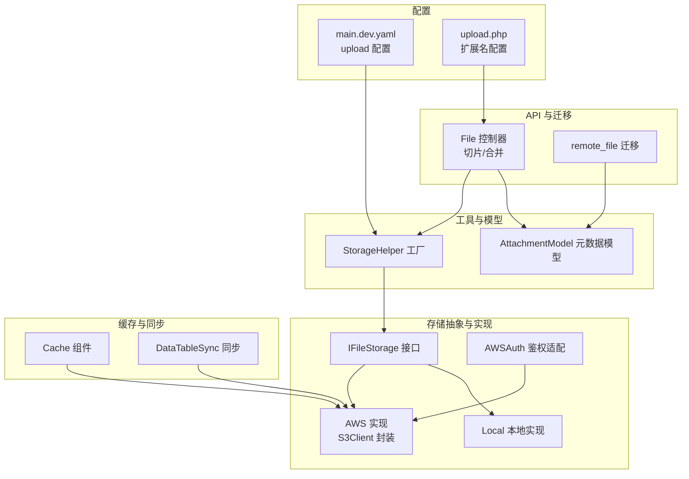
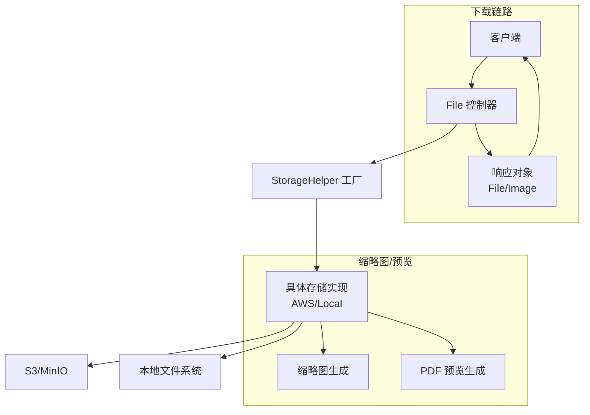
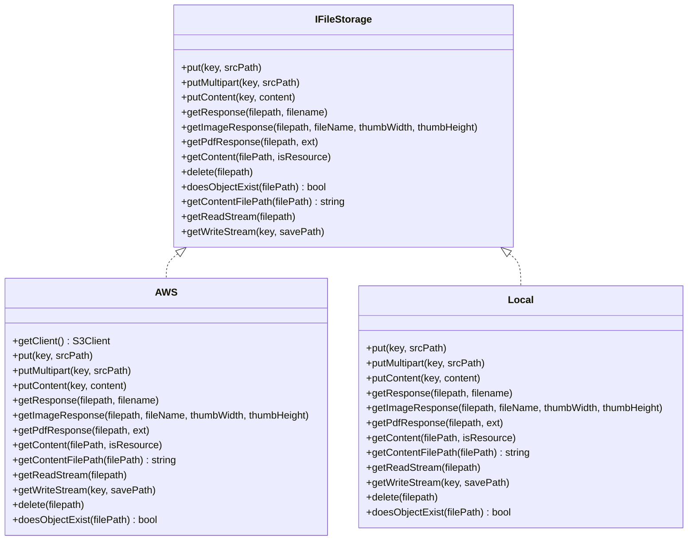
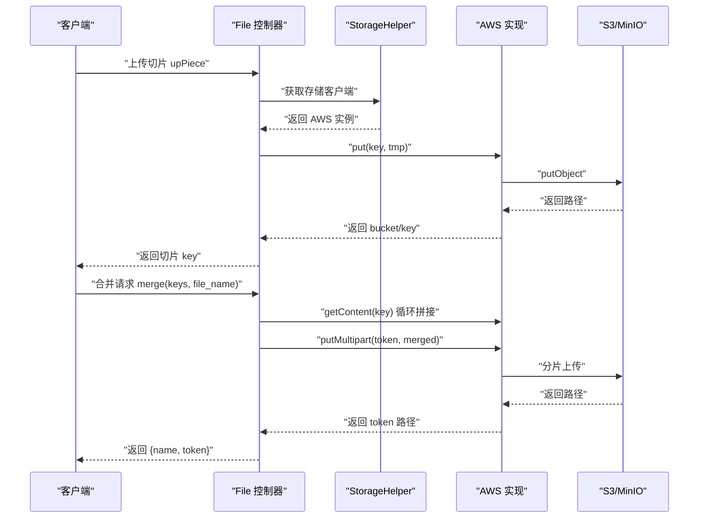
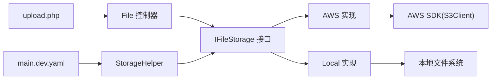

# 远程文件模型

<cite>
**本文引用的文件**
- [AWS.php](file://process/src/services/storage/AWS.php)
- [AWSAuth.php](file://process/src/services/storage/AWSAuth.php)
- [IFileStorage.php](file://process/src/services/storage/IFileStorage.php)
- [Local.php](file://process/src/services/storage/Local.php)
- [StorageHelper.php](file://process/src/helpers/StorageHelper.php)
- [AttachmentModel.php](file://process/src/models/AttachmentModel.php)
- [File.php](file://process/src/http/api/File.php)
- [migration_20240906_085546_remote_file.php](file://process/src/migrations/migration_20240906_085546_remote_file.php)
- [main.dev.yaml](file://process/src/config/main.dev.yaml)
- [upload.php](file://process/src/config/upload.php)
- [Cache.php](file://process/src/components/Cache.php)
- [DataTableSync.php](file://process/src/services/task/DataTableSync.php)
</cite>

## 目录
1. [引言](#引言)
2. [项目结构](#项目结构)
3. [核心组件](#核心组件)
4. [架构总览](#架构总览)
5. [详细组件分析](#详细组件分析)
6. [依赖关系分析](#依赖关系分析)
7. [性能考虑](#性能考虑)
8. [故障排查指南](#故障排查指南)
9. [结论](#结论)
10. [附录](#附录)

## 引言
本文件围绕“远程文件模型”展开，系统性梳理分布式文件存储体系在本项目中的设计与实现，重点覆盖以下方面：
- 远程文件存储架构与 MinIO、AWS S3 的集成方案
- 远程文件上传下载流程（含断点续传、并发处理、网络异常恢复）
- 远程文件元数据管理、访问权限控制与安全传输策略
- 远程文件同步、缓存策略与性能优化实践
- 文件版本管理、生命周期管理与成本优化思路

## 项目结构
围绕远程文件模型的关键代码分布在如下模块：
- 存储抽象与实现：IFileStorage 接口、AWS 与 Local 实现、AWSAuth 鉴权适配
- 辅助工具：StorageHelper 工厂、YamlHelper 配置读取
- 模型层：AttachmentModel 文件元数据模型
- API 层：File 控制器的大文件切片与合并流程
- 配置：main.dev.yaml 中的 upload 配置；upload.php 中的扩展名白名单
- 迁移：remote_file 表结构迁移
- 缓存与同步：Cache 组件与 DataTableSync 的内存与批次控制

图表来源
- [main.dev.yaml](file://process/src/config/main.dev.yaml#L50-L57)
- [upload.php](file://process/src/config/upload.php#L1-L15)
- [IFileStorage.php](file://process/src/services/storage/IFileStorage.php#L1-L54)
- [AWS.php](file://process/src/services/storage/AWS.php#L1-L214)
- [AWSAuth.php](file://process/src/services/storage/AWSAuth.php#L1-L37)
- [Local.php](file://process/src/services/storage/Local.php#L1-L143)
- [StorageHelper.php](file://process/src/helpers/StorageHelper.php#L1-L49)
- [AttachmentModel.php](file://process/src/models/AttachmentModel.php#L1-L253)
- [File.php](file://process/src/http/api/File.php#L1-L95)
- [migration_20240906_085546_remote_file.php](file://process/src/migrations/migration_20240906_085546_remote_file.php#L1-L29)
- [Cache.php](file://process/src/components/Cache.php#L91-L135)
- [DataTableSync.php](file://process/src/services/task/DataTableSync.php#L844-L887)

章节来源
- [main.dev.yaml](file://process/src/config/main.dev.yaml#L50-L57)
- [upload.php](file://process/src/config/upload.php#L1-L15)
- [IFileStorage.php](file://process/src/services/storage/IFileStorage.php#L1-L54)
- [AWS.php](file://process/src/services/storage/AWS.php#L1-L214)
- [AWSAuth.php](file://process/src/services/storage/AWSAuth.php#L1-L37)
- [Local.php](file://process/src/services/storage/Local.php#L1-L143)
- [StorageHelper.php](file://process/src/helpers/StorageHelper.php#L1-L49)
- [AttachmentModel.php](file://process/src/models/AttachmentModel.php#L1-L253)
- [File.php](file://process/src/http/api/File.php#L1-L95)
- [migration_20240906_085546_remote_file.php](file://process/src/migrations/migration_20240906_085546_remote_file.php#L1-L29)
- [Cache.php](file://process/src/components/Cache.php#L91-L135)
- [DataTableSync.php](file://process/src/services/task/DataTableSync.php#L844-L887)

## 核心组件
- IFileStorage 接口：定义统一的文件存储能力，包括 put、putMultipart、putContent、getResponse、getImageResponse、getPdfResponse、getContent、delete、doesObjectExist、getContentFilePath、getReadStream、getWriteStream。
- AWS 实现：基于 AWS SDK 的 S3Client 封装，支持分片上传、流式读写、缩略图与 PDF 预览生成、对象存在性检测与删除。
- AWSAuth 鉴权适配：针对特定场景（如中山大学 MinIO）的响应封装，支持带鉴权的文件下载。
- Local 实现：本地文件系统存储，用于对比与测试，提供相似的接口能力。
- StorageHelper 工厂：按协程上下文缓存存储客户端实例，依据 YAML 配置选择具体实现。
- AttachmentModel：文件元数据模型，包含文件路径、大小、扩展名、mime、创建者、会话绑定、受保护状态等，并提供切片保存与读取 Excel 的能力。
- File 控制器：提供 upPiece（切片）、merge（合并）等接口，结合 StorageHelper 完成远程存储的大文件上传。
- 配置：main.dev.yaml 中 upload 节点指定存储实现类、endpoint、key、secret、bucket；upload.php 提供扩展名白名单。

章节来源
- [IFileStorage.php](file://process/src/services/storage/IFileStorage.php#L1-L54)
- [AWS.php](file://process/src/services/storage/AWS.php#L1-L214)
- [AWSAuth.php](file://process/src/services/storage/AWSAuth.php#L1-L37)
- [Local.php](file://process/src/services/storage/Local.php#L1-L143)
- [StorageHelper.php](file://process/src/helpers/StorageHelper.php#L1-L49)
- [AttachmentModel.php](file://process/src/models/AttachmentModel.php#L1-L253)
- [File.php](file://process/src/http/api/File.php#L1-L95)
- [main.dev.yaml](file://process/src/config/main.dev.yaml#L50-L57)
- [upload.php](file://process/src/config/upload.php#L1-L15)

## 架构总览
远程文件模型采用“接口抽象 + 多实现 + 工厂选择 + 配置驱动”的架构，支持本地与 S3 兼容对象存储（如 MinIO）。上传流程通过 API 控制器切分为多个切片，合并后再写入远端存储；下载通过响应对象直接返回或生成带鉴权的响应；缩略图与 PDF 预览在需要时按需生成并缓存。

图表来源
- [File.php](file://process/src/http/api/File.php#L1-L95)
- [StorageHelper.php](file://process/src/helpers/StorageHelper.php#L1-L49)
- [AWS.php](file://process/src/services/storage/AWS.php#L1-L214)
- [Local.php](file://process/src/services/storage/Local.php#L1-L143)

## 详细组件分析

### 组件 A：IFileStorage 接口与实现
- 设计要点
  - 统一的文件操作契约，便于替换底层存储实现。
  - 支持分片上传、流式读写、内容获取与临时文件路径获取，满足大文件与预览场景。
- 关键方法与职责
  - put/putMultipart：写入文件或进行分片上传
  - putContent：写入内容
  - getResponse/getImageResponse/getPdfResponse：返回响应对象，支持缩略图与 PDF 预览
  - getContent/getContentFilePath：获取内容或临时文件路径
  - getReadStream/getWriteStream：流式读写
  - delete/doesObjectExist：删除与存在性检测

图表来源
- [IFileStorage.php](file://process/src/services/storage/IFileStorage.php#L1-L54)
- [AWS.php](file://process/src/services/storage/AWS.php#L1-L214)
- [Local.php](file://process/src/services/storage/Local.php#L1-L143)

章节来源
- [IFileStorage.php](file://process/src/services/storage/IFileStorage.php#L1-L54)
- [AWS.php](file://process/src/services/storage/AWS.php#L1-L214)
- [Local.php](file://process/src/services/storage/Local.php#L1-L143)

### 组件 B：AWS 实现与 MinIO 集成
- MinIO 集成要点
  - 通过 S3Client 初始化，使用 path-style endpoint 与自定义 endpoint，关闭 SSL 校验（开发环境）。
  - 支持分片上传、流式读写、对象存在性检测、删除与内容获取。
- 缩略图与 PDF 预览
  - 按需生成缩略图与 PDF 预览，并将结果写回远端存储，后续直接返回响应。
- 下载加速
  - 通过响应对象指向本地加速目录，减少直连 S3 的延迟。

图表来源
- [File.php](file://process/src/http/api/File.php#L1-L95)
- [StorageHelper.php](file://process/src/helpers/StorageHelper.php#L1-L49)
- [AWS.php](file://process/src/services/storage/AWS.php#L1-L214)

章节来源
- [AWS.php](file://process/src/services/storage/AWS.php#L1-L214)
- [File.php](file://process/src/http/api/File.php#L1-L95)

### 组件 C：AWSAuth 鉴权适配
- 场景说明
  - 某些 MinIO 环境无法直接通过 Nginx 重定向，需要服务端鉴权后返回文件内容。
- 实现要点
  - 解析 bucket/key，调用 getObject 获取内容，包装为 File 响应对象返回。

章节来源
- [AWSAuth.php](file://process/src/services/storage/AWSAuth.php#L1-L37)

### 组件 D：StorageHelper 工厂与配置驱动
- 工厂模式
  - 基于协程上下文缓存存储客户端实例，避免重复创建。
  - 从 YAML 配置读取存储类与参数，动态创建对象。
- 配置来源
  - main.dev.yaml 的 upload 节点决定使用的存储实现与连接参数。

章节来源
- [StorageHelper.php](file://process/src/helpers/StorageHelper.php#L1-L49)
- [main.dev.yaml](file://process/src/config/main.dev.yaml#L50-L57)

### 组件 E：AttachmentModel 元数据模型
- 元数据字段
  - 包含文件路径、大小、扩展名、mime、创建者、会话绑定、受保护状态等。
- 切片与保存
  - 提供切片保存与读取 Excel 的能力，结合 StorageHelper 使用远端存储。
- Token 与访问控制
  - 通过 token 与 id 组合形成下载令牌，配合控制器的权限校验逻辑使用。

章节来源
- [AttachmentModel.php](file://process/src/models/AttachmentModel.php#L1-L253)

### 组件 F：File 控制器上传流程
- 切片上传 upPiece
  - 生成唯一 token 与 id，将切片临时写入远端存储，返回 key。
- 合并 merge
  - 校验 key 合法性，循环拉取各切片内容并写入临时文件，再进行分片上传，最后入库保存。

章节来源
- [File.php](file://process/src/http/api/File.php#L1-L95)

### 组件 G：remote_file 迁移与同步
- 迁移表结构
  - remote_file 表包含 remote_id 与 file_id 字段，索引分别建立在 remote_id 与 file_id 上。
- 同步与缓存
  - Cache 组件通过共享内存与 Redis 协调对象版本，实现跨进程缓存一致性。
  - DataTableSync 在大批量处理时按固定批次大小与内存阈值进行清理，保障稳定性。

章节来源
- [migration_20240906_085546_remote_file.php](file://process/src/migrations/migration_20240906_085546_remote_file.php#L1-L29)
- [Cache.php](file://process/src/components/Cache.php#L91-L135)
- [DataTableSync.php](file://process/src/services/task/DataTableSync.php#L844-L887)

## 依赖关系分析
- 松耦合设计
  - API 层仅依赖 IFileStorage 接口，具体实现由配置驱动切换。
- 外部依赖
  - AWS SDK 用于 S3/MinIO 交互；Swoole 协程用于异步与资源回收。
- 配置驱动
  - main.dev.yaml 的 upload 节点决定存储实现与连接参数；upload.php 的扩展名配置影响文件类型处理。

图表来源
- [File.php](file://process/src/http/api/File.php#L1-L95)
- [IFileStorage.php](file://process/src/services/storage/IFileStorage.php#L1-L54)
- [AWS.php](file://process/src/services/storage/AWS.php#L1-L214)
- [Local.php](file://process/src/services/storage/Local.php#L1-L143)
- [StorageHelper.php](file://process/src/helpers/StorageHelper.php#L1-L49)
- [main.dev.yaml](file://process/src/config/main.dev.yaml#L50-L57)
- [upload.php](file://process/src/config/upload.php#L1-L15)

章节来源
- [File.php](file://process/src/http/api/File.php#L1-L95)
- [IFileStorage.php](file://process/src/services/storage/IFileStorage.php#L1-L54)
- [AWS.php](file://process/src/services/storage/AWS.php#L1-L214)
- [Local.php](file://process/src/services/storage/Local.php#L1-L143)
- [StorageHelper.php](file://process/src/helpers/StorageHelper.php#L1-L49)
- [main.dev.yaml](file://process/src/config/main.dev.yaml#L50-L57)
- [upload.php](file://process/src/config/upload.php#L1-L15)

## 性能考虑
- 分片上传与流式处理
  - 大文件采用分片上传与流式读写，降低内存峰值与网络阻塞风险。
- 缩略图与预览缓存
  - 首次生成后写回远端存储，后续直接返回，显著降低重复计算与转换开销。
- 协程与资源回收
  - 使用协程 defer 机制及时释放临时文件与资源，避免内存泄漏。
- 批次与内存控制
  - 同步任务按固定批次大小处理，并在内存阈值或周期性触发时强制垃圾回收，保障长时间运行稳定性。

章节来源
- [AWS.php](file://process/src/services/storage/AWS.php#L1-L214)
- [File.php](file://process/src/http/api/File.php#L1-L95)
- [Cache.php](file://process/src/components/Cache.php#L91-L135)
- [DataTableSync.php](file://process/src/services/task/DataTableSync.php#L844-L887)

## 故障排查指南
- 上传失败
  - 检查 main.dev.yaml 中的 endpoint、key、secret、bucket 是否正确；确认 S3/MinIO 可达且桶存在。
  - 若使用本地开发环境，注意 SSL 校验关闭设置。
- 下载鉴权问题
  - 某些 MinIO 环境需使用 AWSAuth 返回带鉴权的内容，而非直接重定向。
- 缩略图/预览缺失
  - 确认缩略图与 PDF 生成逻辑已触发，且生成结果已写回远端存储；检查临时目录权限与磁盘空间。
- 合并异常
  - 校验 keys 格式合法性；确保临时文件写入成功且分片上传完成。
- 内存与性能问题
  - 观察同步任务的批次大小与内存阈值设置，必要时调整；启用垃圾回收清理。

章节来源
- [AWSAuth.php](file://process/src/services/storage/AWSAuth.php#L1-L37)
- [AWS.php](file://process/src/services/storage/AWS.php#L1-L214)
- [File.php](file://process/src/http/api/File.php#L1-L95)
- [DataTableSync.php](file://process/src/services/task/DataTableSync.php#L844-L887)

## 结论
本项目的远程文件模型通过接口抽象与工厂模式实现了对多种存储后端的无缝切换，结合分片上传、按需缩略图与 PDF 预览、协程资源回收与同步任务的批次控制，形成了稳定高效的分布式文件存储方案。在 MinIO/S3 环境下，可通过配置快速启用；在需要鉴权的场景下，可使用 AWSAuth 适配。建议在生产环境中开启 SSL 校验与严格的访问控制策略，并结合缓存与生命周期管理进一步优化成本与性能。

## 附录
- 配置参考
  - main.dev.yaml 的 upload 节点用于指定存储实现与连接参数
  - upload.php 的扩展名配置用于限制允许的文件类型
- 远程文件表结构
  - remote_file 表包含 remote_id 与 file_id 字段，便于远程文件与本地业务实体的关联

章节来源
- [main.dev.yaml](file://process/src/config/main.dev.yaml#L50-L57)
- [upload.php](file://process/src/config/upload.php#L1-L15)
- [migration_20240906_085546_remote_file.php](file://process/src/migrations/migration_20240906_085546_remote_file.php#L1-L29)