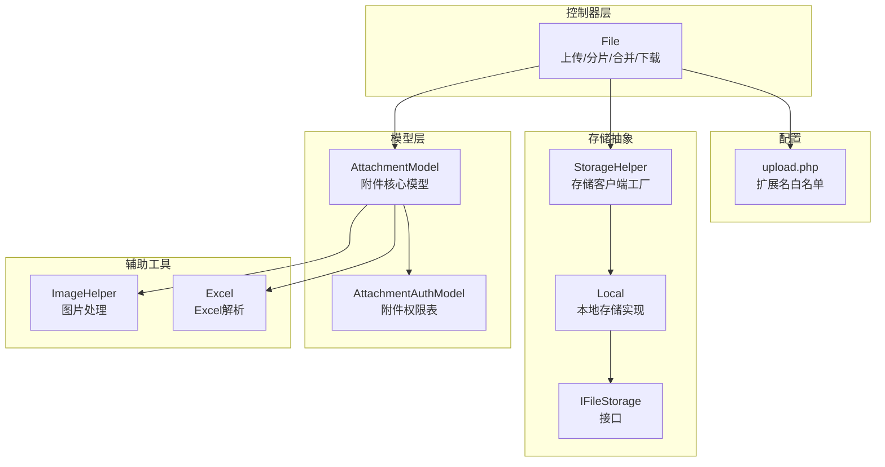
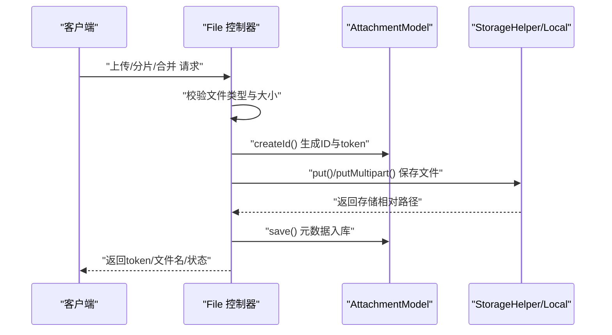
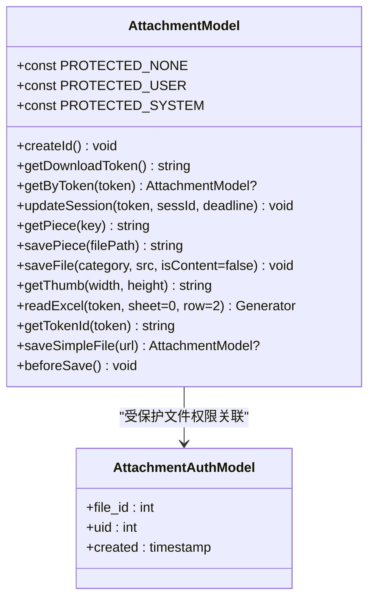
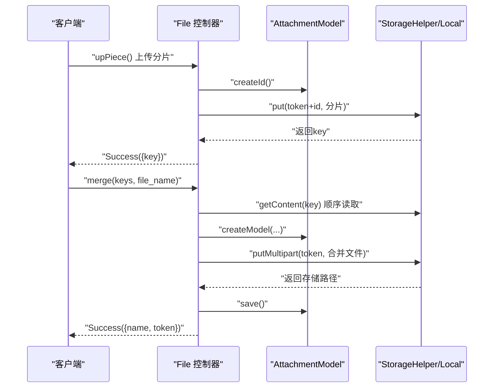
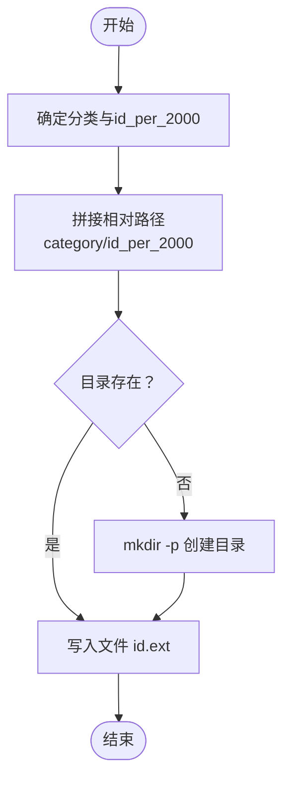
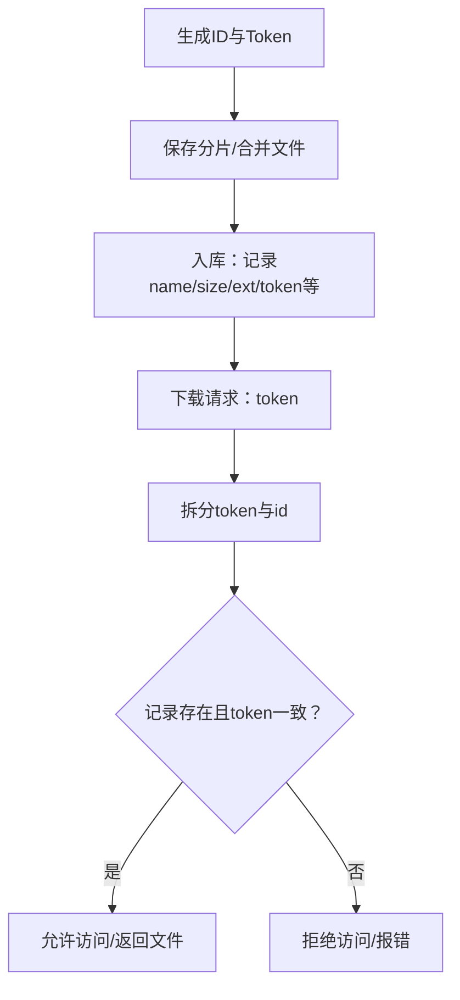
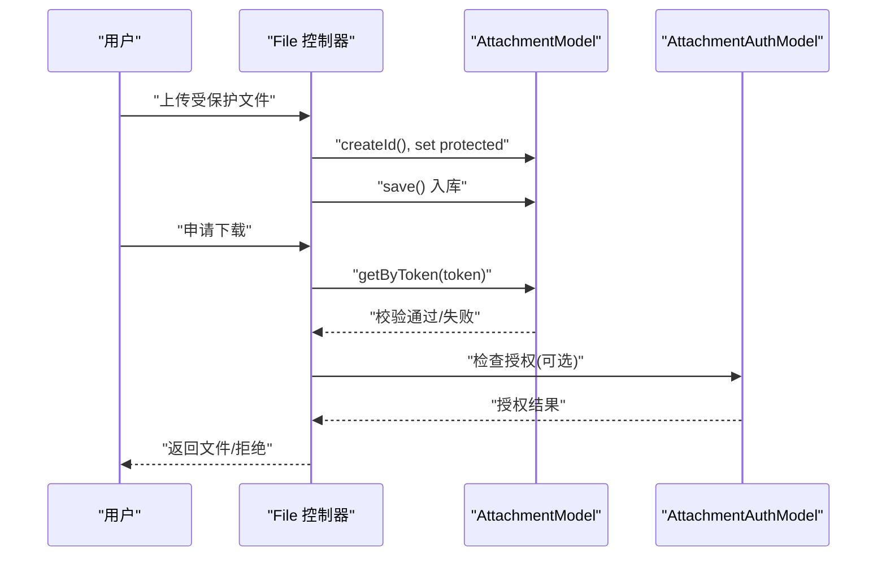
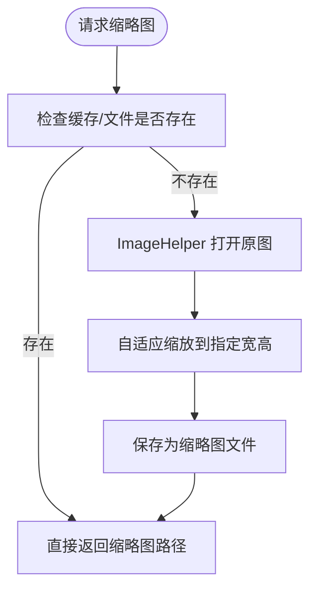
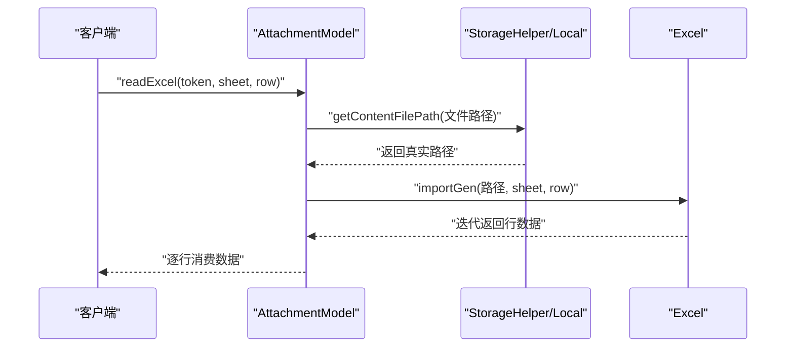
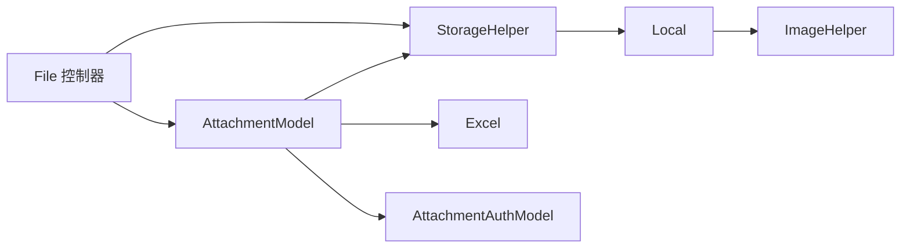

# 附件模型

<cite>
**本文引用的文件**
- [AttachmentModel.php](file://process/src/models/AttachmentModel.php)
- [AttachmentAuthModel.php](file://process/src/models/AttachmentAuthModel.php)
- [File.php](file://process/src/http/api/File.php)
- [StorageHelper.php](file://process/src/helpers/StorageHelper.php)
- [Local.php](file://process/src/services/storage/Local.php)
- [IFileStorage.php](file://process/src/services/storage/IFileStorage.php)
- [ImageHelper.php](file://process/src/helpers/ImageHelper.php)
- [upload.php](file://process/src/config/upload.php)
- [migration_20241130_193521_attachment_auth.php](file://process/src/migrations/migration_20241130_193521_attachment_auth.php)
- [migration_20250714_234817_ai_intelligent_agents_nzsc.php](file://process/src/migrations/migration_20250714_234817_ai_intelligent_agents_nzsc.php)
- [Excel.php](file://process/src/services/excel/Excel.php)
</cite>

## 目录
1. [简介](#简介)
2. [项目结构](#项目结构)
3. [核心组件](#核心组件)
4. [架构总览](#架构总览)
5. [详细组件分析](#详细组件分析)
6. [依赖关系分析](#依赖关系分析)
7. [性能考量](#性能考量)
8. [故障排查指南](#故障排查指南)
9. [结论](#结论)
10. [附录](#附录)

## 简介
本文件系统性梳理附件模型的设计理念与实现细节，围绕以下主题展开：
- 文件元数据管理：文件名、大小、类型、扩展名、宽高、会话关联等
- 存储路径生成算法与目录结构组织
- 文件ID生成机制与下载token安全机制
- 文件上传流程：单文件、分片上传、合并、保存策略
- 访问控制：受保护文件的权限管理、下载token验证、会话关联
- 缩略图生成、图片尺寸处理与内容存储
- 文件导入导出、Excel解析与远程文件处理

## 项目结构
围绕附件模型的关键文件分布如下：
- 模型层：AttachmentModel（附件核心模型）、AttachmentAuthModel（附件权限表）
- 控制器层：File（上传、分片、合并、下载响应）
- 存储抽象：IFileStorage 接口、Local 实现（本地存储）、StorageHelper 工具
- 辅助工具：ImageHelper（图片处理）、Excel（Excel解析）
- 配置：upload.php（扩展名白名单）
- 迁移：attachment_auth 表结构、AI智能体导入迁移中对附件的使用

图表来源
- [AttachmentModel.php](file://process/src/models/AttachmentModel.php#L1-L253)
- [AttachmentAuthModel.php](file://process/src/models/AttachmentAuthModel.php#L1-L22)
- [File.php](file://process/src/http/api/File.php#L1-L200)
- [StorageHelper.php](file://process/src/helpers/StorageHelper.php#L1-L48)
- [Local.php](file://process/src/services/storage/Local.php#L1-L143)
- [IFileStorage.php](file://process/src/services/storage/IFileStorage.php#L1-L54)
- [ImageHelper.php](file://process/src/helpers/ImageHelper.php#L104-L156)
- [Excel.php](file://process/src/services/excel/Excel.php#L1-L200)
- [upload.php](file://process/src/config/upload.php#L1-L15)

章节来源
- [AttachmentModel.php](file://process/src/models/AttachmentModel.php#L1-L253)
- [File.php](file://process/src/http/api/File.php#L1-L200)
- [StorageHelper.php](file://process/src/helpers/StorageHelper.php#L1-L48)
- [Local.php](file://process/src/services/storage/Local.php#L1-L143)
- [IFileStorage.php](file://process/src/services/storage/IFileStorage.php#L1-L54)
- [ImageHelper.php](file://process/src/helpers/ImageHelper.php#L104-L156)
- [Excel.php](file://process/src/services/excel/Excel.php#L1-L200)
- [upload.php](file://process/src/config/upload.php#L1-L15)

## 核心组件
- AttachmentModel：负责附件元数据、ID与token生成、分片路径解析、文件保存策略、缩略图生成、Excel导入、远程URL转存等
- AttachmentAuthModel：记录附件与用户之间的授权关系
- File 控制器：对外提供上传、分片、合并接口，并调用模型完成入库与存储
- StorageHelper：统一获取存储客户端（默认本地存储）
- Local：实现 IFileStorage，负责文件落盘、目录组织、缩略图生成、PDF转换、流式读写等
- ImageHelper：图片打开、旋转、自适应缩放、水印等
- Excel：Excel 导入生成器（迭代器）

章节来源
- [AttachmentModel.php](file://process/src/models/AttachmentModel.php#L1-L253)
- [AttachmentAuthModel.php](file://process/src/models/AttachmentAuthModel.php#L1-L22)
- [File.php](file://process/src/http/api/File.php#L1-L200)
- [StorageHelper.php](file://process/src/helpers/StorageHelper.php#L1-L48)
- [Local.php](file://process/src/services/storage/Local.php#L1-L143)
- [IFileStorage.php](file://process/src/services/storage/IFileStorage.php#L1-L54)
- [ImageHelper.php](file://process/src/helpers/ImageHelper.php#L104-L156)
- [Excel.php](file://process/src/services/excel/Excel.php#L1-L200)

## 架构总览
附件系统采用“模型-控制器-存储”三层协作：
- 控制器接收请求，校验参数与扩展名，执行图片压缩与安全检测
- 模型生成ID与token，决定保存路径与目录结构
- 存储层负责实际落盘、缩略图生成、PDF转换、流式读写

图表来源
- [File.php](file://process/src/http/api/File.php#L43-L121)
- [AttachmentModel.php](file://process/src/models/AttachmentModel.php#L73-L124)
- [StorageHelper.php](file://process/src/helpers/StorageHelper.php#L1-L48)
- [Local.php](file://process/src/services/storage/Local.php#L25-L43)

## 详细组件分析

### AttachmentModel 类设计与实现
- 元数据字段：id、name、file、size、width、height、sess_id、mime、ext、created、deadline、type、download、protected、creator、token、sess_ids、aigc_file_id
- 权限常量：无保护、用户级保护、系统级保护
- ID与token生成：通过序列号生成id，并生成固定长度随机token；下载token由token+id拼接
- 下载token解析：按固定长度拆分token与id，校验一致性
- 会话关联：支持将当前会话加入sess_ids，设置deadline与主会话id
- 分片路径解析：按“日期前缀+随机片段”的规则解析临时分片路径
- 分片保存：按日期子目录生成随机文件名，移动上传文件到目标位置
- 文件保存策略：按id/2000进行两级目录组织，文件名为id.ext
- 缩略图生成：若请求宽高有效则生成宽×高命名的缩略图，否则返回原图路径
- Excel导入：通过存储层获取真实路径，委托Excel模块进行迭代导入
- URL转存：从远程URL抓取内容，生成临时文件并写入存储，返回模型对象
- 保存前置逻辑：去重合并sess_ids，保证主会话id存在时更新

图表来源
- [AttachmentModel.php](file://process/src/models/AttachmentModel.php#L66-L253)
- [AttachmentAuthModel.php](file://process/src/models/AttachmentAuthModel.php#L1-L22)

章节来源
- [AttachmentModel.php](file://process/src/models/AttachmentModel.php#L66-L253)
- [AttachmentAuthModel.php](file://process/src/models/AttachmentAuthModel.php#L1-L22)

### 文件上传流程（单文件/分片/合并）
- 单文件上传：控制器校验扩展名与大小，必要时对图片进行压缩，随后创建模型、生成ID与token，调用存储客户端保存，最后入库
- 分片上传：仅分配ID与token，将分片保存到存储，返回分片key
- 合并流程：按序读取各分片内容写入临时文件，调用模型保存方法写入最终存储，返回文件名与token

图表来源
- [File.php](file://process/src/http/api/File.php#L43-L121)
- [AttachmentModel.php](file://process/src/models/AttachmentModel.php#L125-L179)
- [StorageHelper.php](file://process/src/helpers/StorageHelper.php#L1-L48)
- [Local.php](file://process/src/services/storage/Local.php#L40-L43)

章节来源
- [File.php](file://process/src/http/api/File.php#L43-L121)
- [AttachmentModel.php](file://process/src/models/AttachmentModel.php#L125-L179)
- [StorageHelper.php](file://process/src/helpers/StorageHelper.php#L1-L48)
- [Local.php](file://process/src/services/storage/Local.php#L40-L43)

### 存储路径生成与目录结构
- 本地存储相对目录：按年月组织，例如“process50/Ym”
- 物理绝对路径：uploadDir + 相对目录
- 附件文件目录：category/id_per_2000，文件名为id.ext
- 分片临时目录：uploadDir/日期，文件名为随机十六进制字符串
- 缩略图目录：与原图同目录，文件名为id_w_h.ext

图表来源
- [AttachmentModel.php](file://process/src/models/AttachmentModel.php#L155-L179)
- [Local.php](file://process/src/services/storage/Local.php#L25-L38)
- [StorageHelper.php](file://process/src/helpers/StorageHelper.php#L1-L48)

章节来源
- [AttachmentModel.php](file://process/src/models/AttachmentModel.php#L155-L179)
- [Local.php](file://process/src/services/storage/Local.php#L25-L38)
- [StorageHelper.php](file://process/src/helpers/StorageHelper.php#L1-L48)

### 文件ID与下载token安全机制
- ID生成：使用数据库序列号生成唯一递增id
- token生成：固定长度随机字节，保证不可预测性
- 下载token：token + id 的拼接形式
- 解析与校验：按固定长度拆分token与id，查询对应记录并比对token一致性
- 会话绑定：将当前会话id写入sess_ids，支持deadline设置

图表来源
- [AttachmentModel.php](file://process/src/models/AttachmentModel.php#L73-L124)

章节来源
- [AttachmentModel.php](file://process/src/models/AttachmentModel.php#L73-L124)

### 文件访问控制与权限管理
- 受保护文件：支持三种保护级别，登录态下才可上传受保护文件
- 附件权限表：attachment_auth 记录file_id与uid的授权关系
- 会话关联：updateSession 支持将当前会话id写入附件，便于后续审计与访问控制
- 下载token：作为一次性访问凭证，结合模型校验与会话信息共同保障安全

图表来源
- [File.php](file://process/src/http/api/File.php#L131-L200)
- [AttachmentModel.php](file://process/src/models/AttachmentModel.php#L84-L124)
- [AttachmentAuthModel.php](file://process/src/models/AttachmentAuthModel.php#L1-L22)
- [migration_20241130_193521_attachment_auth.php](file://process/src/migrations/migration_20241130_193521_attachment_auth.php#L1-L26)

章节来源
- [File.php](file://process/src/http/api/File.php#L131-L200)
- [AttachmentModel.php](file://process/src/models/AttachmentModel.php#L84-L124)
- [AttachmentAuthModel.php](file://process/src/models/AttachmentAuthModel.php#L1-L22)
- [migration_20241130_193521_attachment_auth.php](file://process/src/migrations/migration_20241130_193521_attachment_auth.php#L1-L26)

### 缩略图生成、图片尺寸处理与内容存储
- 缩略图生成：在原图同目录生成 id_w_h.ext，若已存在则直接复用
- 图片处理：ImageHelper 提供打开、自适应缩放、旋转、水印等能力
- 内容存储：支持将字符串内容写入存储，用于URL转存等场景
- PDF转换：本地存储实现提供PDF转换入口，返回PDF响应

图表来源
- [AttachmentModel.php](file://process/src/models/AttachmentModel.php#L184-L199)
- [ImageHelper.php](file://process/src/helpers/ImageHelper.php#L104-L156)
- [Local.php](file://process/src/services/storage/Local.php#L74-L101)

章节来源
- [AttachmentModel.php](file://process/src/models/AttachmentModel.php#L184-L199)
- [ImageHelper.php](file://process/src/helpers/ImageHelper.php#L104-L156)
- [Local.php](file://process/src/services/storage/Local.php#L74-L101)

### 文件导入导出、Excel解析与远程文件处理
- Excel导入：通过模型的readExcel方法，基于存储层的真实路径，委托Excel模块进行迭代导入
- 远程文件处理：saveSimpleFile从URL抓取内容，生成临时文件并写入存储，返回模型对象
- AI集成：迁移脚本中展示如何创建附件并写入存储，体现与AI助手的集成点

图表来源
- [AttachmentModel.php](file://process/src/models/AttachmentModel.php#L206-L211)
- [Excel.php](file://process/src/services/excel/Excel.php#L1-L200)
- [StorageHelper.php](file://process/src/helpers/StorageHelper.php#L1-L48)
- [Local.php](file://process/src/services/storage/Local.php#L122-L131)

章节来源
- [AttachmentModel.php](file://process/src/models/AttachmentModel.php#L206-L211)
- [Excel.php](file://process/src/services/excel/Excel.php#L1-L200)
- [StorageHelper.php](file://process/src/helpers/StorageHelper.php#L1-L48)
- [Local.php](file://process/src/services/storage/Local.php#L122-L131)
- [migration_20250714_234817_ai_intelligent_agents_nzsc.php](file://process/src/migrations/migration_20250714_234817_ai_intelligent_agents_nzsc.php#L46-L66)

## 依赖关系分析
- 控制器依赖模型与存储助手
- 模型依赖存储助手与Excel模块
- 存储实现依赖本地文件系统与图片处理工具
- 权限模型独立存在，与附件模型通过外键关联

图表来源
- [File.php](file://process/src/http/api/File.php#L1-L200)
- [AttachmentModel.php](file://process/src/models/AttachmentModel.php#L1-L253)
- [StorageHelper.php](file://process/src/helpers/StorageHelper.php#L1-L48)
- [Local.php](file://process/src/services/storage/Local.php#L1-L143)
- [ImageHelper.php](file://process/src/helpers/ImageHelper.php#L104-L156)
- [Excel.php](file://process/src/services/excel/Excel.php#L1-L200)
- [AttachmentAuthModel.php](file://process/src/models/AttachmentAuthModel.php#L1-L22)

章节来源
- [File.php](file://process/src/http/api/File.php#L1-L200)
- [AttachmentModel.php](file://process/src/models/AttachmentModel.php#L1-L253)
- [StorageHelper.php](file://process/src/helpers/StorageHelper.php#L1-L48)
- [Local.php](file://process/src/services/storage/Local.php#L1-L143)
- [ImageHelper.php](file://process/src/helpers/ImageHelper.php#L104-L156)
- [Excel.php](file://process/src/services/excel/Excel.php#L1-L200)
- [AttachmentAuthModel.php](file://process/src/models/AttachmentAuthModel.php#L1-L22)

## 性能考量
- 目录层级：按id/2000分桶，降低单目录文件数量，提升文件系统性能
- 缩略图缓存：命中则直接返回，避免重复图像处理
- 流式读写：存储层提供流式读写接口，减少内存占用
- 分片合并：在服务端聚合分片，避免客户端多次IO
- 安全检测：对PDF进行JS风险扫描，降低恶意文件带来的性能与安全风险

## 故障排查指南
- 上传失败：检查存储客户端put/putMultipart返回与chmod权限
- 分片合并异常：确认分片key格式与顺序，核对临时文件清理
- 缩略图未生成：确认目标目录可写与图片格式支持
- 下载token无效：核对token长度、id合法性与记录一致性
- 权限不足：确认attachment_auth授权或受保护文件的登录态

章节来源
- [Local.php](file://process/src/services/storage/Local.php#L25-L43)
- [AttachmentModel.php](file://process/src/models/AttachmentModel.php#L125-L179)
- [AttachmentModel.php](file://process/src/models/AttachmentModel.php#L84-L124)
- [AttachmentAuthModel.php](file://process/src/models/AttachmentAuthModel.php#L1-L22)

## 结论
AttachmentModel 以清晰的元数据建模、稳健的ID与token安全机制、灵活的存储抽象与完善的访问控制，构建了完整的附件管理体系。配合分片上传、缩略图生成、Excel解析与远程文件处理能力，满足多场景下的文件管理需求。

## 附录
- 扩展名白名单：通过配置文件定义图片、文档、媒体、Excel、Word等类别扩展名集合
- 迁移脚本示例：展示如何在迁移中创建附件并写入存储，体现与AI助手的集成

章节来源
- [upload.php](file://process/src/config/upload.php#L1-L15)
- [migration_20250714_234817_ai_intelligent_agents_nzsc.php](file://process/src/migrations/migration_20250714_234817_ai_intelligent_agents_nzsc.php#L46-L66)