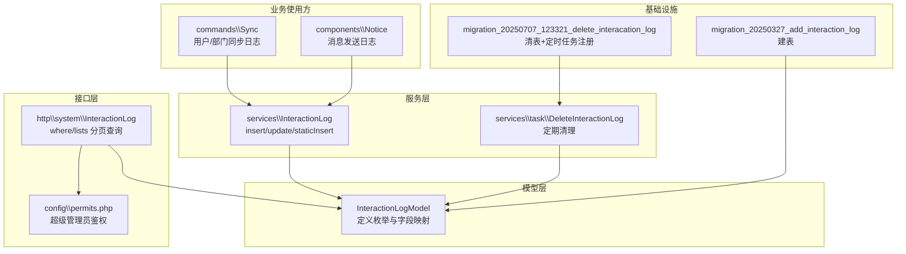
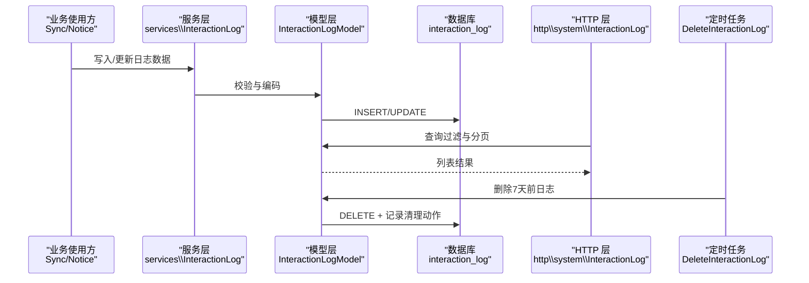
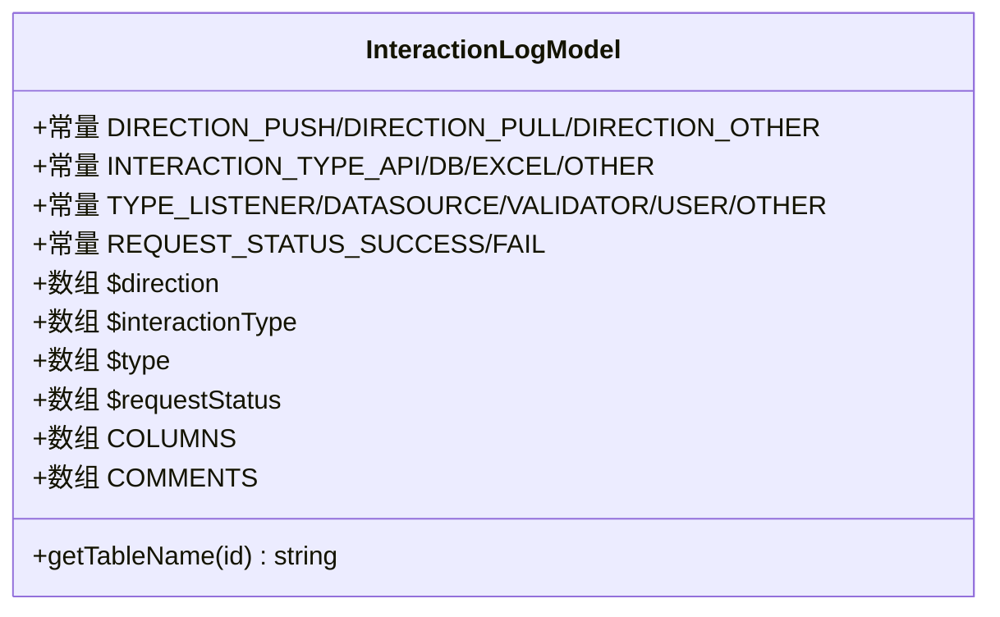
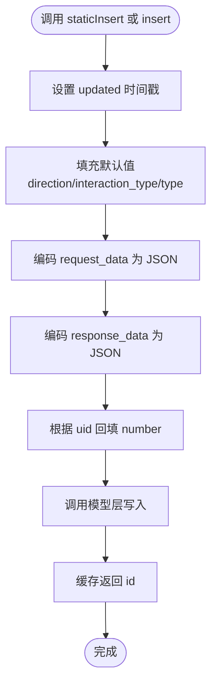
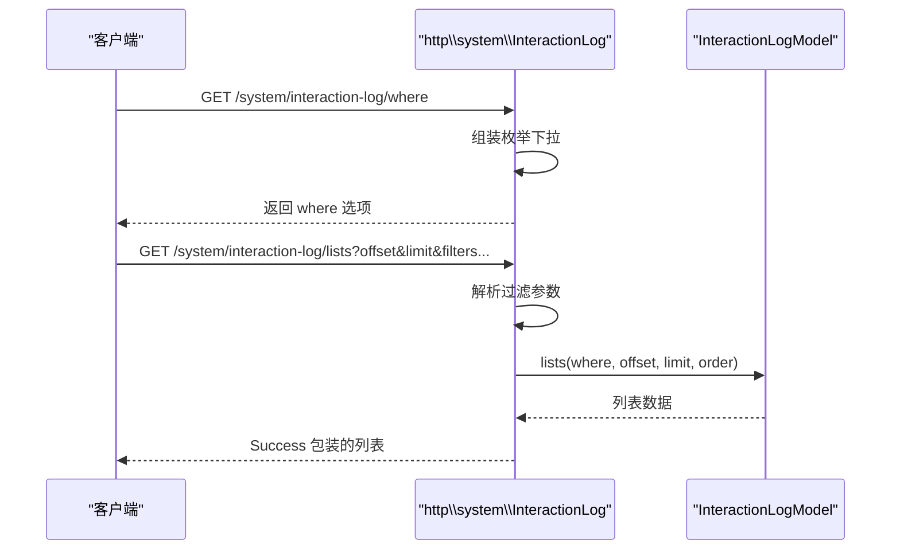
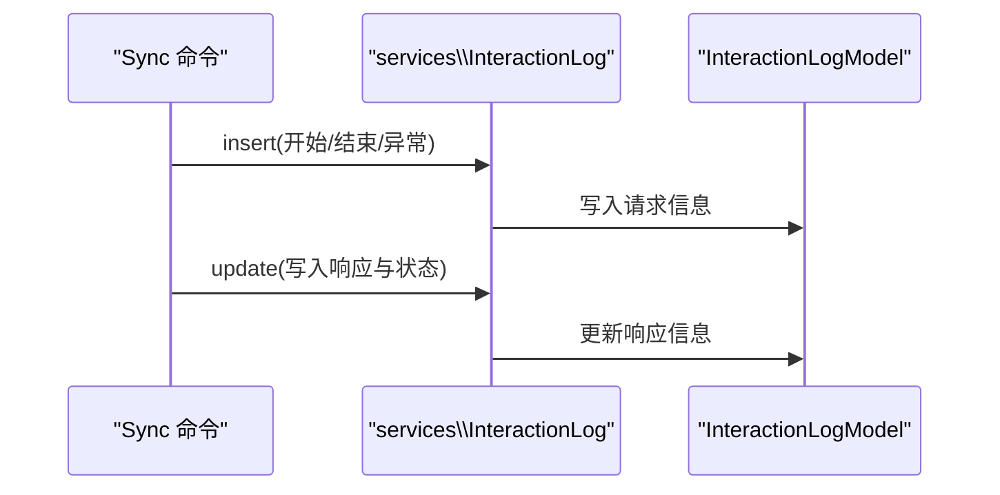
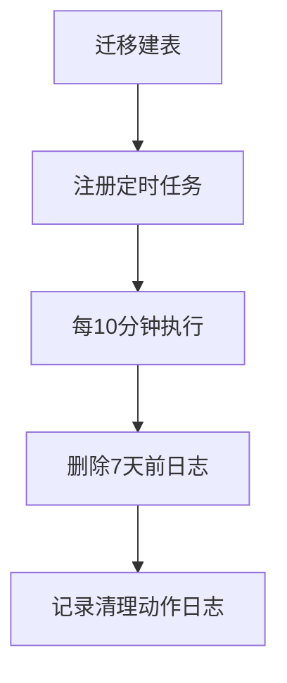
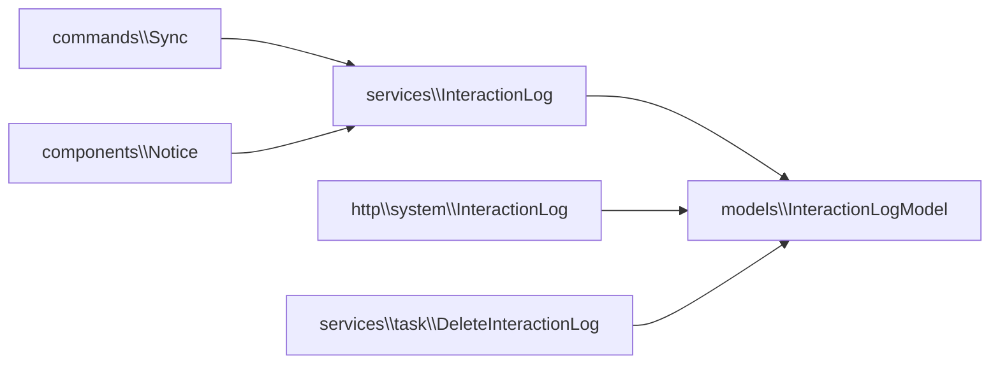
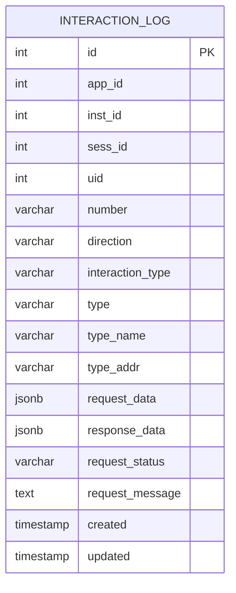

# 交互日志模型

<cite>
**本文引用的文件**
- [InteractionLogModel.php](file://process/src/models/InteractionLogModel.php)
- [InteractionLog.php（HTTP 控制器）](file://process/src/http/system/InteractionLog.php)
- [InteractionLog.php（服务类）](file://process/src/services/InteractionLog.php)
- [migration_20250327_add_interaction_log.php](file://process/src/migrations/migration_20250327_add_interaction_log.php)
- [DeleteInteractionLog.php](file://process/src/services/task/DeleteInteractionLog.php)
- [Sync.php](file://process/src/commands/Sync.php)
- [Notice.php](file://process/src/components/Notice.php)
- [permits.php](file://process/src/config/permits.php)
- [migration_20250707_123321_delete_interacation_log.php](file://process/src/migrations/migration_20250707_123321_delete_interacation_log.php)
</cite>

## 目录
1. [引言](#引言)
2. [项目结构](#项目结构)
3. [核心组件](#核心组件)
4. [架构总览](#架构总览)
5. [详细组件分析](#详细组件分析)
6. [依赖关系分析](#依赖关系分析)
7. [性能与存储特性](#性能与存储特性)
8. [查询、分析与报告](#查询分析与报告)
9. [故障排查指南](#故障排查指南)
10. [结论](#结论)
11. [附录](#附录)

## 引言
本文件围绕交互日志模型展开，系统性梳理其数据结构、交互类型与记录策略，阐明用户操作轨迹追踪、界面交互监控与系统响应记录机制，并给出查询、分析与报告生成的实践路径。同时结合迁移脚本、定时清理任务与权限配置，说明该模型在产品分析、用户体验改进与功能优化中的价值。

## 项目结构
交互日志相关代码分布于以下模块：
- 数据模型层：定义常量、字段映射与注释
- 服务层：封装插入、更新与静态一次性写入
- HTTP 层：提供筛选条件与分页查询接口
- 迁移层：创建交互日志表
- 定时任务：定期清理历史日志
- 使用方：命令行同步、通知组件等业务场景

图表来源
- [InteractionLogModel.php](file://process/src/models/InteractionLogModel.php#L1-L92)
- [InteractionLog.php（HTTP 控制器）](file://process/src/http/system/InteractionLog.php#L1-L78)
- [InteractionLog.php（服务类）](file://process/src/services/InteractionLog.php#L1-L65)
- [DeleteInteractionLog.php](file://process/src/services/task/DeleteInteractionLog.php#L1-L24)
- [Sync.php](file://process/src/commands/Sync.php#L150-L349)
- [Notice.php](file://process/src/components/Notice.php#L390-L406)
- [permits.php](file://process/src/config/permits.php#L130-L146)
- [migration_20250327_add_interaction_log.php](file://process/src/migrations/migration_20250327_add_interaction_log.php#L1-L41)
- [migration_20250707_123321_delete_interacation_log.php](file://process/src/migrations/migration_20250707_123321_delete_interacation_log.php#L1-L37)

章节来源
- [InteractionLogModel.php](file://process/src/models/InteractionLogModel.php#L1-L92)
- [InteractionLog.php（HTTP 控制器）](file://process/src/http/system/InteractionLog.php#L1-L78)
- [InteractionLog.php（服务类）](file://process/src/services/InteractionLog.php#L1-L65)
- [migration_20250327_add_interaction_log.php](file://process/src/migrations/migration_20250327_add_interaction_log.php#L1-L41)
- [DeleteInteractionLog.php](file://process/src/services/task/DeleteInteractionLog.php#L1-L24)
- [Sync.php](file://process/src/commands/Sync.php#L150-L349)
- [Notice.php](file://process/src/components/Notice.php#L390-L406)
- [permits.php](file://process/src/config/permits.php#L130-L146)
- [migration_20250707_123321_delete_interacation_log.php](file://process/src/migrations/migration_20250707_123321_delete_interacation_log.php#L1-L37)

## 核心组件
- 数据模型 InteractionLogModel
  - 定义交互方向、交互类型、日志类型三组枚举及其本地化映射
  - 明确字段类型与注释，统一表名
- 服务类 services\InteractionLog
  - 提供 insert/update 两阶段写入能力，支持静态一次性写入
  - 自动填充默认值、JSON 编码、用户工号回填
- HTTP 控制器 http\system\InteractionLog
  - 提供筛选条件 where 接口与分页列表 lists 接口
  - 仅超级管理员可访问
- 迁移脚本
  - 创建 interaction_log 表
  - 清表并注册定时清理任务
- 定时清理任务 services\task\DeleteInteractionLog
  - 删除7天前日志并记录清理动作
- 使用方
  - 命令行同步 Sync：用户/部门同步过程中的关键节点日志
  - 通知组件 Notice：消息发送前置校验与无效发送日志

章节来源
- [InteractionLogModel.php](file://process/src/models/InteractionLogModel.php#L1-L92)
- [InteractionLog.php（服务类）](file://process/src/services/InteractionLog.php#L1-L65)
- [InteractionLog.php（HTTP 控制器）](file://process/src/http/system/InteractionLog.php#L1-L78)
- [migration_20250327_add_interaction_log.php](file://process/src/migrations/migration_20250327_add_interaction_log.php#L1-L41)
- [DeleteInteractionLog.php](file://process/src/services/task/DeleteInteractionLog.php#L1-L24)
- [Sync.php](file://process/src/commands/Sync.php#L150-L349)
- [Notice.php](file://process/src/components/Notice.php#L390-L406)

## 架构总览
交互日志从“业务侧产生 -> 服务层落库 -> HTTP 层检索 -> 定时任务维护”的闭环如下：

图表来源
- [Sync.php](file://process/src/commands/Sync.php#L150-L349)
- [Notice.php](file://process/src/components/Notice.php#L390-L406)
- [InteractionLog.php（服务类）](file://process/src/services/InteractionLog.php#L1-L65)
- [InteractionLogModel.php](file://process/src/models/InteractionLogModel.php#L1-L92)
- [InteractionLog.php（HTTP 控制器）](file://process/src/http/system/InteractionLog.php#L1-L78)
- [DeleteInteractionLog.php](file://process/src/services/task/DeleteInteractionLog.php#L1-L24)

## 详细组件分析

### 数据模型：InteractionLogModel
- 交互方向（direction）
  - push：推送
  - pull：拉取
  - other：其他
- 交互类型（interaction_type）
  - api：接口
  - db：数据库
  - excel：Excel
  - other：其他
- 日志类型（type）
  - listener：监听器
  - datasource：数据源
  - validator：验证器
  - user：用户同步
  - other：其他
- 请求状态（request_status）
  - success：成功
  - fail：失败
- 字段与注释
  - 包含 app_id、inst_id、sess_id、uid、number、direction、interaction_type、type、type_name、type_addr、request_data、response_data、request_status、request_message、created、updated
  - request_data/response_data 采用 JSONB 存储，便于检索与分析

图表来源
- [InteractionLogModel.php](file://process/src/models/InteractionLogModel.php#L1-L92)

章节来源
- [InteractionLogModel.php](file://process/src/models/InteractionLogModel.php#L1-L92)

### 服务层：services\InteractionLog
- insert(data)
  - 自动设置 updated 时间戳
  - 将数组类型的 request_data/response_data 编码为 JSON（保留中文）
  - 回填用户工号 number（若提供 uid）
  - 返回持久化对象 id 并缓存到实例属性
- update(data)
  - 基于已缓存 id 执行更新
- staticInsert(data)
  - 一次性写入，适合无复杂流程的简单日志

图表来源
- [InteractionLog.php（服务类）](file://process/src/services/InteractionLog.php#L1-L65)

章节来源
- [InteractionLog.php（服务类）](file://process/src/services/InteractionLog.php#L1-L65)

### HTTP 层：http\system\InteractionLog
- 权限控制
  - 仅超级管理员可访问 where 与 lists
- where 接口
  - 返回方向、交互类型、日志类型、请求状态的下拉选项
- lists 接口
  - 支持按 app_id、inst_id、sess_id、number、direction、interaction_type、type、request_status、起止时间、type_name/type_addr、request_data/response_data、request_message 等多维过滤
  - 分页参数 offset/limit，按 id 倒序

图表来源
- [InteractionLog.php（HTTP 控制器）](file://process/src/http/system/InteractionLog.php#L1-L78)
- [permits.php](file://process/src/config/permits.php#L130-L146)

章节来源
- [InteractionLog.php（HTTP 控制器）](file://process/src/http/system/InteractionLog.php#L1-L78)
- [permits.php](file://process/src/config/permits.php#L130-L146)

### 使用方：命令行同步与通知组件
- 命令行同步 Sync
  - 在部门/用户同步开始、结束、异常时记录交互日志
  - 用户分页拉取时先 insert 记录请求，再 update 写入响应与状态
- 通知组件 Notice
  - 在无效发送或前置校验失败时记录日志，标注推送方向与交互类型

图表来源
- [Sync.php](file://process/src/commands/Sync.php#L150-L349)
- [Notice.php](file://process/src/components/Notice.php#L390-L406)
- [InteractionLog.php（服务类）](file://process/src/services/InteractionLog.php#L1-L65)

章节来源
- [Sync.php](file://process/src/commands/Sync.php#L150-L349)
- [Notice.php](file://process/src/components/Notice.php#L390-L406)
- [InteractionLog.php（服务类）](file://process/src/services/InteractionLog.php#L1-L65)

### 定时清理与迁移
- 迁移脚本 migration_20250327_add_interaction_log
  - 创建 interaction_log 表，包含 JSONB 字段与时间戳
- 迁移脚本 migration_20250707_123321_delete_interacation_log
  - 清空表并注册定时任务 DeleteInteractionLog
- 定时任务 DeleteInteractionLog
  - 删除7天前日志，并记录一次清理动作日志

图表来源
- [migration_20250327_add_interaction_log.php](file://process/src/migrations/migration_20250327_add_interaction_log.php#L1-L41)
- [migration_20250707_123321_delete_interacation_log.php](file://process/src/migrations/migration_20250707_123321_delete_interacation_log.php#L1-L37)
- [DeleteInteractionLog.php](file://process/src/services/task/DeleteInteractionLog.php#L1-L24)

章节来源
- [migration_20250327_add_interaction_log.php](file://process/src/migrations/migration_20250327_add_interaction_log.php#L1-L41)
- [migration_20250707_123321_delete_interacation_log.php](file://process/src/migrations/migration_20250707_123321_delete_interacation_log.php#L1-L37)
- [DeleteInteractionLog.php](file://process/src/services/task/DeleteInteractionLog.php#L1-L24)

## 依赖关系分析
- 模块内聚与耦合
  - 模型层提供稳定的枚举与字段定义，服务层与控制器均依赖模型层
  - 服务层与业务使用方松耦合，通过统一的 insert/update 接口
- 外部依赖
  - 数据库：PostgreSQL JSONB 字段
  - 定时任务框架：AbstractTask 与计划任务注册
- 可能的循环依赖
  - 当前未见循环导入；服务层依赖模型层，控制器依赖模型层，使用方依赖服务层

图表来源
- [Sync.php](file://process/src/commands/Sync.php#L150-L349)
- [Notice.php](file://process/src/components/Notice.php#L390-L406)
- [InteractionLog.php（服务类）](file://process/src/services/InteractionLog.php#L1-L65)
- [InteractionLog.php（HTTP 控制器）](file://process/src/http/system/InteractionLog.php#L1-L78)
- [DeleteInteractionLog.php](file://process/src/services/task/DeleteInteractionLog.php#L1-L24)
- [InteractionLogModel.php](file://process/src/models/InteractionLogModel.php#L1-L92)

章节来源
- [Sync.php](file://process/src/commands/Sync.php#L150-L349)
- [Notice.php](file://process/src/components/Notice.php#L390-L406)
- [InteractionLog.php（服务类）](file://process/src/services/InteractionLog.php#L1-L65)
- [InteractionLog.php（HTTP 控制器）](file://process/src/http/system/InteractionLog.php#L1-L78)
- [DeleteInteractionLog.php](file://process/src/services/task/DeleteInteractionLog.php#L1-L24)
- [InteractionLogModel.php](file://process/src/models/InteractionLogModel.php#L1-L92)

## 性能与存储特性
- JSONB 字段
  - request_data/response_data 采用 JSONB，便于全文检索与灵活扩展
  - 注意：大体量 JSONB 可能影响索引与查询性能，建议配合 where 条件与分页使用
- 时间戳
  - created/updated 为 timestamp(0)，便于按时间范围过滤
- 分页与排序
  - lists 默认按 id 倒序，结合 offset/limit 实现高效分页
- 清理策略
  - 定期删除7天前日志，避免表膨胀；同时记录清理动作，便于审计

章节来源
- [InteractionLogModel.php](file://process/src/models/InteractionLogModel.php#L1-L92)
- [InteractionLog.php（HTTP 控制器）](file://process/src/http/system/InteractionLog.php#L1-L78)
- [DeleteInteractionLog.php](file://process/src/services/task/DeleteInteractionLog.php#L1-L24)

## 查询、分析与报告

### 查询与筛选
- 可用过滤维度
  - 基础标识：app_id、inst_id、sess_id、number
  - 交互属性：direction、interaction_type、type、request_status
  - 时间范围：start_time、end_time
  - 文本匹配：type_name、type_addr、request_data、response_data、request_message
- 分页参数
  - offset、limit，按 id 倒序

章节来源
- [InteractionLog.php（HTTP 控制器）](file://process/src/http/system/InteractionLog.php#L1-L78)

### 分析统计思路
- 成功/失败趋势
  - 按日期聚合 request_status 分布，观察成功率变化
- 交互类型分布
  - 统计 interaction_type 的占比，识别主要交互通道（如 API/DB/EXCEL）
- 方向分布
  - 对比 push/pull 的比例，评估系统对外输出与对内拉取情况
- 用户/会话追踪
  - 结合 sess_id/number，定位特定用户或会话的行为轨迹
- 关键路径观测
  - 在 Sync 等长耗时流程中，利用 insert/update 记录关键节点，形成端到端链路图

### 报告生成
- 建议指标
  - 日活/周活交互数、平均响应时长、失败率、Top N 类型与来源
- 输出形式
  - 导出 CSV/Excel，或集成到现有报表系统
- 自动化
  - 可通过定时任务周期性生成报告并归档

（本节为通用实践建议，不直接分析具体文件）

## 故障排查指南
- 权限问题
  - where/lists 仅超级管理员可访问，确认当前用户是否具备相应权限
- JSON 编码异常
  - 若 request_data/response_data 为数组，服务层会进行 JSON 编码；检查输入数据格式
- 数据缺失
  - 未提供 uid 时不会回填 number；确保必要字段完整
- 日志清理
  - 若发现数据缺失，检查 DeleteInteractionLog 是否按计划执行

章节来源
- [permits.php](file://process/src/config/permits.php#L130-L146)
- [InteractionLog.php（服务类）](file://process/src/services/InteractionLog.php#L1-L65)
- [DeleteInteractionLog.php](file://process/src/services/task/DeleteInteractionLog.php#L1-L24)

## 结论
交互日志模型以清晰的枚举体系、稳健的服务层封装与完善的 HTTP 接口，实现了对用户与系统交互行为的全链路记录。通过 JSONB 字段与多维过滤，既能满足细粒度追踪，也能支撑宏观分析与报告生成。配合定期清理策略，可在保证可观测性的同时控制存储成本。

## 附录

### 数据模型 ER 图

图表来源
- [InteractionLogModel.php](file://process/src/models/InteractionLogModel.php#L1-L92)
- [migration_20250327_add_interaction_log.php](file://process/src/migrations/migration_20250327_add_interaction_log.php#L1-L41)