# 审计安全模型

<cite>
**本文引用的文件**
- [process/src/models/ActionLogModel.php](file://process/src/models/ActionLogModel.php)
- [process/src/models/LoginConfigLoginLogModel.php](file://process/src/models/LoginConfigLoginLogModel.php)
- [process/src/models/LoginConfigChangeLogModel.php](file://process/src/models/LoginConfigChangeLogModel.php)
- [process/src/models/NoticeConfigSendLogModel.php](file://process/src/models/NoticeConfigSendLogModel.php)
- [process/src/models/NoticeConfigChangeLogModel.php](file://process/src/models/NoticeConfigChangeLogModel.php)
- [process/src/models/InteractionLogModel.php](file://process/src/models/InteractionLogModel.php)
- [process/src/models/AliveCheckLogModel.php](file://process/src/models/AliveCheckLogModel.php)
- [process/src/models/ComplianceModel.php](file://process/src/models/ComplianceModel.php)
- [process/src/migrations/migration_20250904_112321_login_config.php](file://process/src/migrations/migration_20250904_112321_login_config.php)
- [process/src/migrations/migration_20250805_add_proc_log_comment.php](file://process/src/migrations/migration_20250805_add_proc_log_comment.php)
- [process/src/migrations/migration_20251205_120000_personal_batch_update_log.php](file://process/src/migrations/migration_20251205_120000_personal_batch_update_log.php)
- [process/src/migrations/migration_20240805_123142_create_compliance.php](file://process/src/migrations/migration_20240805_123142_create_compliance.php)
- [process/docker/services/postgres/postgresql.conf](file://process/docker/services/postgres/postgresql.conf)
- [process/src/helpers/SecurityHelper.php](file://process/src/helpers/SecurityHelper.php)
- [process/src/services/task/PushToEcnuTaskCenter.php](file://process/src/services/task/PushToEcnuTaskCenter.php)
</cite>

## 目录
1. [引言](#引言)
2. [项目结构](#项目结构)
3. [核心组件](#核心组件)
4. [架构总览](#架构总览)
5. [组件详解](#组件详解)
6. [依赖关系分析](#依赖关系分析)
7. [性能与可维护性](#性能与可维护性)
8. [故障排查指南](#故障排查指南)
9. [结论](#结论)
10. [附录](#附录)

## 引言
本文件聚焦于审计安全相关数据模型，系统化梳理操作日志、登录日志、通知发送日志、交互日志、存活检测日志以及合规配置等在安全审计中的设计与实现。文档从数据模型结构、字段语义、索引策略、迁移脚本、日志存储与保留、查询分析到安全合规与风险监控进行深入剖析，并给出可视化图示与实践建议，帮助读者快速理解并落地审计能力。

## 项目结构
围绕审计安全的关键文件主要分布在以下位置：
- 模型层：process/src/models 下的各类日志与合规模型
- 迁移层：process/src/migrations 下的建表与索引增强脚本
- 配置层：process/docker/services/postgres/postgresql.conf 中的数据库日志与 WAL 设置
- 辅助与服务：process/src/helpers/SecurityHelper.php 提供安全辅助能力；任务服务中包含日志推送示例

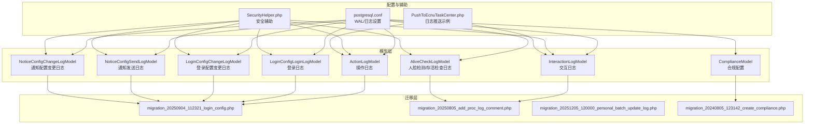

图表来源
- [process/src/models/ActionLogModel.php](file://process/src/models/ActionLogModel.php#L1-L90)
- [process/src/models/LoginConfigLoginLogModel.php](file://process/src/models/LoginConfigLoginLogModel.php#L1-L68)
- [process/src/models/LoginConfigChangeLogModel.php](file://process/src/models/LoginConfigChangeLogModel.php#L1-L33)
- [process/src/models/NoticeConfigSendLogModel.php](file://process/src/models/NoticeConfigSendLogModel.php#L1-L55)
- [process/src/models/NoticeConfigChangeLogModel.php](file://process/src/models/NoticeConfigChangeLogModel.php#L1-L40)
- [process/src/models/InteractionLogModel.php](file://process/src/models/InteractionLogModel.php#L1-L92)
- [process/src/models/AliveCheckLogModel.php](file://process/src/models/AliveCheckLogModel.php#L1-L41)
- [process/src/models/ComplianceModel.php](file://process/src/models/ComplianceModel.php#L1-L32)
- [process/src/migrations/migration_20250904_112321_login_config.php](file://process/src/migrations/migration_20250904_112321_login_config.php#L1-L34)
- [process/src/migrations/migration_20250805_add_proc_log_comment.php](file://process/src/migrations/migration_20250805_add_proc_log_comment.php#L1-L28)
- [process/src/migrations/migration_20251205_120000_personal_batch_update_log.php](file://process/src/migrations/migration_20251205_120000_personal_batch_update_log.php#L29-L47)
- [process/src/migrations/migration_20240805_123142_create_compliance.php](file://process/src/migrations/migration_20240805_123142_create_compliance.php#L1-L28)
- [process/docker/services/postgres/postgresql.conf](file://process/docker/services/postgres/postgresql.conf#L160-L185)
- [process/src/helpers/SecurityHelper.php](file://process/src/helpers/SecurityHelper.php)
- [process/src/services/task/PushToEcnuTaskCenter.php](file://process/src/services/task/PushToEcnuTaskCenter.php#L48-L91)

章节来源
- [process/src/models/ActionLogModel.php](file://process/src/models/ActionLogModel.php#L1-L90)
- [process/src/migrations/migration_20250904_112321_login_config.php](file://process/src/migrations/migration_20250904_112321_login_config.php#L1-L34)
- [process/docker/services/postgres/postgresql.conf](file://process/docker/services/postgres/postgresql.conf#L160-L185)

## 核心组件
本节对审计安全相关的核心数据模型进行逐项解析，包括字段定义、业务含义、典型查询与分析场景，以及与迁移脚本的对应关系。

- 操作日志模型（ActionLogModel）
  - 用途：记录用户在系统内的关键操作，便于追踪行为轨迹与审计回溯。
  - 关键字段：创建者、数据ID、模型标识、操作类型、详情（JSON）、创建时间。
  - 典型场景：用户增删改查、应用/报表/用户/部门/岗位/标签/系统/字典/数据集/应用中心/平台/微应用/流程监控/问卷通/个人数据管理/OA等模块的操作审计。
  - 查询分析：按创建者、模型、操作类型、时间范围过滤；聚合统计各模块操作频次。
  - 索引建议：按 creator、model、created 建立复合索引以优化审计查询。

- 登录配置登录日志模型（LoginConfigLoginLogModel）
  - 用途：记录第三方登录（OAuth）过程的状态、错误信息与详情，支撑登录安全审计。
  - 关键字段：工号、状态（成功/失败）、错误信息、平台ID、OAuth类型、详情（JSON）、创建时间。
  - 典型场景：登录失败定位、异常登录行为检测、登录成功率统计。
  - 查询分析：按平台ID、OAuth类型、状态、时间区间统计登录质量与异常率。

- 登录配置变更日志模型（LoginConfigChangeLogModel）
  - 用途：记录登录配置的变更历史，支持变更审计与回滚追溯。
  - 关键字段：创建人、内容、配置（JSON）、创建时间。
  - 典型场景：权限变更、登录策略调整的审计留痕。

- 通知发送日志模型（NoticeConfigSendLogModel）
  - 用途：记录通知发送的状态、错误信息、发送对象、代理名称、重试数据与方法等。
  - 关键字段：状态（成功/失败）、错误信息、数据数量（JSON）、平台ID、消息代理名称、内容、消息对象、创建时间、重试数据（JSON）、重试方法。
  - 典型场景：通知失败重试、发送质量评估、渠道效果分析。

- 通知配置变更日志模型（NoticeConfigChangeLogModel）
  - 用途：记录通知配置的变更历史，支持变更审计。
  - 关键字段：创建人、内容、配置（JSON）、创建时间。
  - 典型场景：通知模板/通道/阈值变更的审计留痕。

- 交互日志模型（InteractionLogModel）
  - 用途：记录系统与外部组件之间的交互（推送/拉取/数据库/接口/Excel等），支撑跨系统行为追踪。
  - 关键字段：事项ID、实例ID、会话ID、用户ID、工号、交互方向、交互类型、监听类型、请求/响应数据（JSON）、请求状态、请求消息、创建/更新时间。
  - 典型场景：接口调用链路审计、数据源同步异常定位、用户同步行为追踪。
  - 索引建议：按 sess_id、app_id、created 建立索引以提升查询效率。

- 人脸检测/存活检查日志模型（AliveCheckLogModel）
  - 用途：记录人脸检测或存活检查的结果，用于身份核验与异常行为识别。
  - 关键字段：用户ID、姓名、身份证、状态（成功/失败）、结果（文本）、创建时间。
  - 典型场景：活体检测通过率统计、异常失败模式分析。

- 合规配置模型（ComplianceModel）
  - 用途：存储合规控件配置，支撑合规性检查与审计。
  - 关键字段：事项ID、配置（JSON）、创建时间。
  - 典型场景：合规规则变更审计、合规性指标统计。

章节来源
- [process/src/models/ActionLogModel.php](file://process/src/models/ActionLogModel.php#L1-L90)
- [process/src/models/LoginConfigLoginLogModel.php](file://process/src/models/LoginConfigLoginLogModel.php#L1-L68)
- [process/src/models/LoginConfigChangeLogModel.php](file://process/src/models/LoginConfigChangeLogModel.php#L1-L33)
- [process/src/models/NoticeConfigSendLogModel.php](file://process/src/models/NoticeConfigSendLogModel.php#L1-L55)
- [process/src/models/NoticeConfigChangeLogModel.php](file://process/src/models/NoticeConfigChangeLogModel.php#L1-L40)
- [process/src/models/InteractionLogModel.php](file://process/src/models/InteractionLogModel.php#L1-L92)
- [process/src/models/AliveCheckLogModel.php](file://process/src/models/AliveCheckLogModel.php#L1-L41)
- [process/src/models/ComplianceModel.php](file://process/src/models/ComplianceModel.php#L1-L32)

## 架构总览
下图展示审计相关模型与数据库配置、迁移脚本的关系，以及日志写入与查询的典型路径。

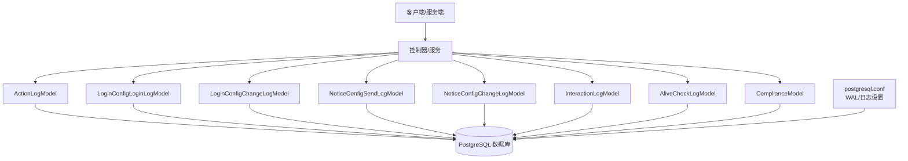

图表来源
- [process/src/models/ActionLogModel.php](file://process/src/models/ActionLogModel.php#L1-L90)
- [process/src/models/LoginConfigLoginLogModel.php](file://process/src/models/LoginConfigLoginLogModel.php#L1-L68)
- [process/src/models/LoginConfigChangeLogModel.php](file://process/src/models/LoginConfigChangeLogModel.php#L1-L33)
- [process/src/models/NoticeConfigSendLogModel.php](file://process/src/models/NoticeConfigSendLogModel.php#L1-L55)
- [process/src/models/NoticeConfigChangeLogModel.php](file://process/src/models/NoticeConfigChangeLogModel.php#L1-L40)
- [process/src/models/InteractionLogModel.php](file://process/src/models/InteractionLogModel.php#L1-L92)
- [process/src/models/AliveCheckLogModel.php](file://process/src/models/AliveCheckLogModel.php#L1-L41)
- [process/src/models/ComplianceModel.php](file://process/src/models/ComplianceModel.php#L1-L32)
- [process/docker/services/postgres/postgresql.conf](file://process/docker/services/postgres/postgresql.conf#L160-L185)

## 组件详解

### 操作日志模型（ActionLogModel）
- 设计要点
  - 使用 JSON 字段保存操作详情，便于扩展不同模块的审计载荷。
  - 模型枚举覆盖多类业务模块，统一了审计口径。
- 典型使用
  - 在业务关键操作处调用新增方法，记录 creator、data_id、model、type、detail。
- 查询与分析
  - 按时间窗口统计各模块操作次数，识别异常高频操作。
  - 结合用户维度分析是否存在越权或批量操作。

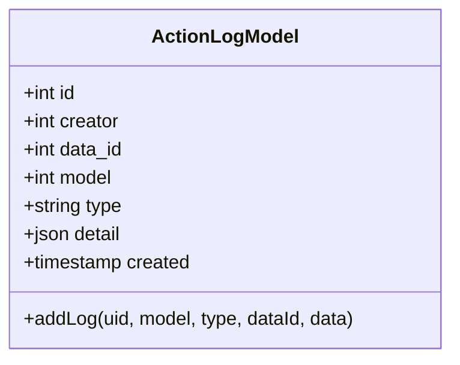

图表来源
- [process/src/models/ActionLogModel.php](file://process/src/models/ActionLogModel.php#L1-L90)

章节来源
- [process/src/models/ActionLogModel.php](file://process/src/models/ActionLogModel.php#L1-L90)

### 登录日志与配置变更模型
- 登录日志（LoginConfigLoginLogModel）
  - 记录每次登录尝试的状态、错误信息、平台与OAuth类型，支持失败率与异常模式分析。
- 登录配置变更（LoginConfigChangeLogModel）
  - 记录配置变更人与变更内容，便于策略调整的审计留痕。

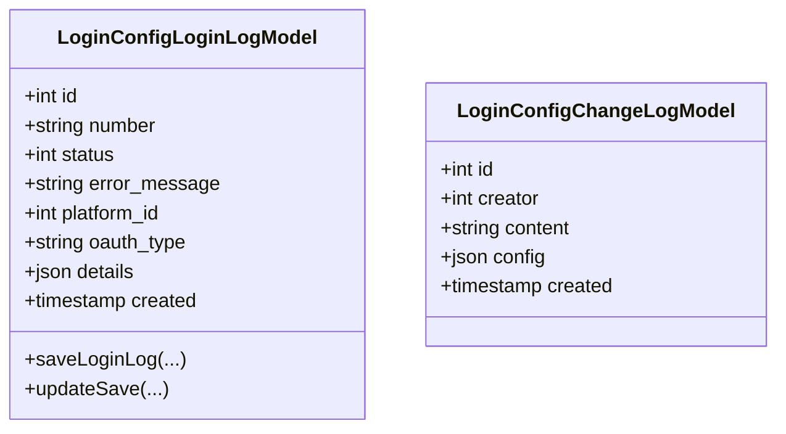

图表来源
- [process/src/models/LoginConfigLoginLogModel.php](file://process/src/models/LoginConfigLoginLogModel.php#L1-L68)
- [process/src/models/LoginConfigChangeLogModel.php](file://process/src/models/LoginConfigChangeLogModel.php#L1-L33)

章节来源
- [process/src/models/LoginConfigLoginLogModel.php](file://process/src/models/LoginConfigLoginLogModel.php#L1-L68)
- [process/src/models/LoginConfigChangeLogModel.php](file://process/src/models/LoginConfigChangeLogModel.php#L1-L33)

### 通知日志与配置变更模型
- 通知发送日志（NoticeConfigSendLogModel）
  - 记录发送状态、错误信息、数据量、平台ID、消息代理名称、消息对象、重试数据与方法。
- 通知配置变更（NoticeConfigChangeLogModel）
  - 记录变更人、内容与配置，支持变更审计。

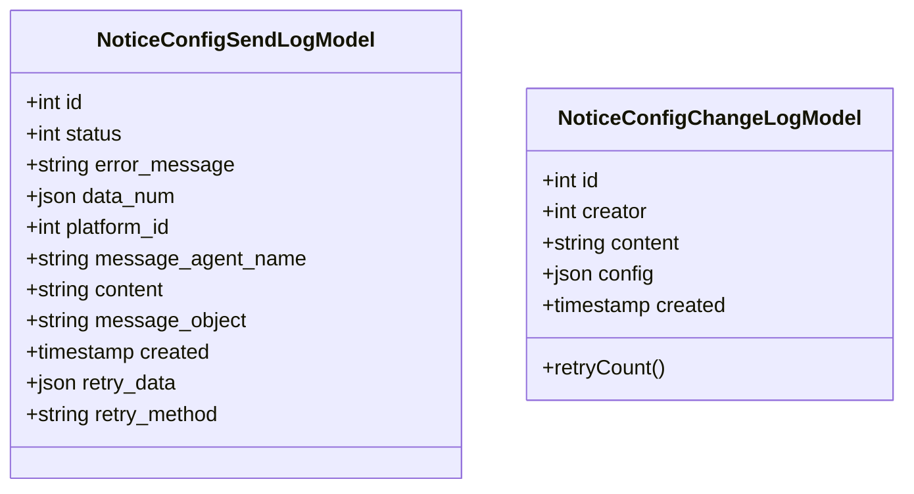

图表来源
- [process/src/models/NoticeConfigSendLogModel.php](file://process/src/models/NoticeConfigSendLogModel.php#L1-L55)
- [process/src/models/NoticeConfigChangeLogModel.php](file://process/src/models/NoticeConfigChangeLogModel.php#L1-L40)

章节来源
- [process/src/models/NoticeConfigSendLogModel.php](file://process/src/models/NoticeConfigSendLogModel.php#L1-L55)
- [process/src/models/NoticeConfigChangeLogModel.php](file://process/src/models/NoticeConfigChangeLogModel.php#L1-L40)

### 交互日志模型（InteractionLogModel）
- 设计要点
  - 支持多种交互方向与类型，请求/响应数据采用 JSON 存储，便于跨系统行为追踪。
  - 提供请求状态与消息字段，便于异常定位。
- 典型使用
  - 在监听器、数据源、验证器、用户同步等环节记录交互详情。

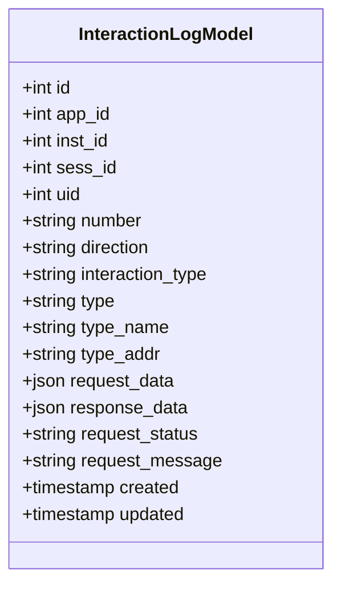

图表来源
- [process/src/models/InteractionLogModel.php](file://process/src/models/InteractionLogModel.php#L1-L92)

章节来源
- [process/src/models/InteractionLogModel.php](file://process/src/models/InteractionLogModel.php#L1-L92)

### 人脸检测/存活检查日志模型（AliveCheckLogModel）
- 设计要点
  - 记录用户身份核验结果与状态，支持异常失败模式分析。
- 典型使用
  - 在活体检测或定期存活检查后写入日志，支持后续风控策略。

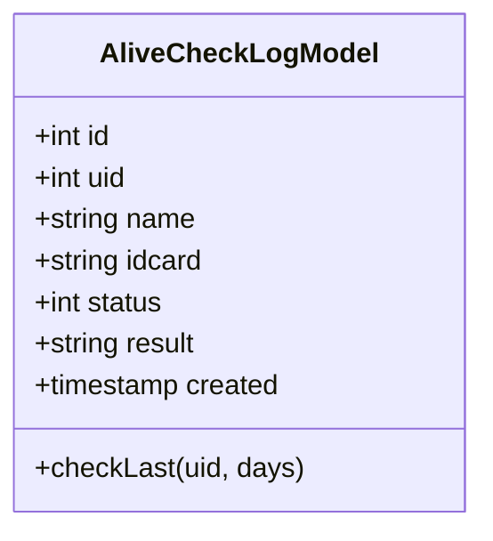

图表来源
- [process/src/models/AliveCheckLogModel.php](file://process/src/models/AliveCheckLogModel.php#L1-L41)

章节来源
- [process/src/models/AliveCheckLogModel.php](file://process/src/models/AliveCheckLogModel.php#L1-L41)

### 合规配置模型（ComplianceModel）
- 设计要点
  - 存储合规控件配置，支持合规性检查与审计。
- 典型使用
  - 在合规页面或流程中保存配置，配合迁移脚本建立表结构。

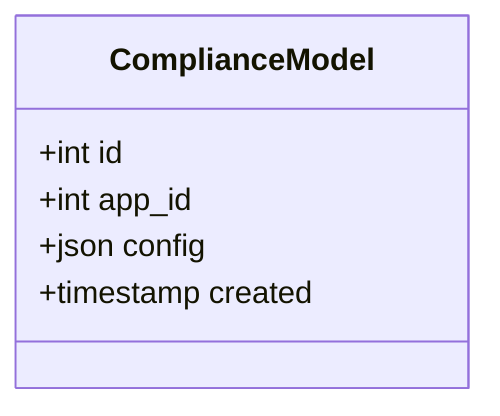

图表来源
- [process/src/models/ComplianceModel.php](file://process/src/models/ComplianceModel.php#L1-L32)

章节来源
- [process/src/models/ComplianceModel.php](file://process/src/models/ComplianceModel.php#L1-L32)

### 日志写入与推送序列
以下序列图展示一次典型交互日志写入与日志推送的过程（以任务服务为例）：

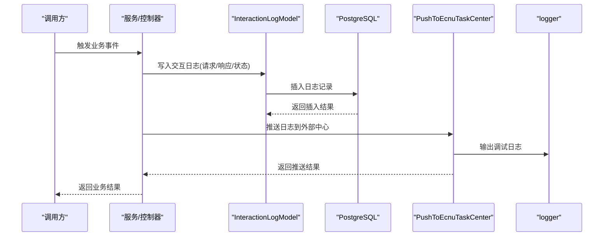

图表来源
- [process/src/models/InteractionLogModel.php](file://process/src/models/InteractionLogModel.php#L1-L92)
- [process/src/services/task/PushToEcnuTaskCenter.php](file://process/src/services/task/PushToEcnuTaskCenter.php#L48-L91)

章节来源
- [process/src/models/InteractionLogModel.php](file://process/src/models/InteractionLogModel.php#L1-L92)
- [process/src/services/task/PushToEcnuTaskCenter.php](file://process/src/services/task/PushToEcnuTaskCenter.php#L48-L91)

### 日志算法与流程（示例：登录失败检测）
以下流程图展示基于登录日志的异常检测思路（概念示意）：

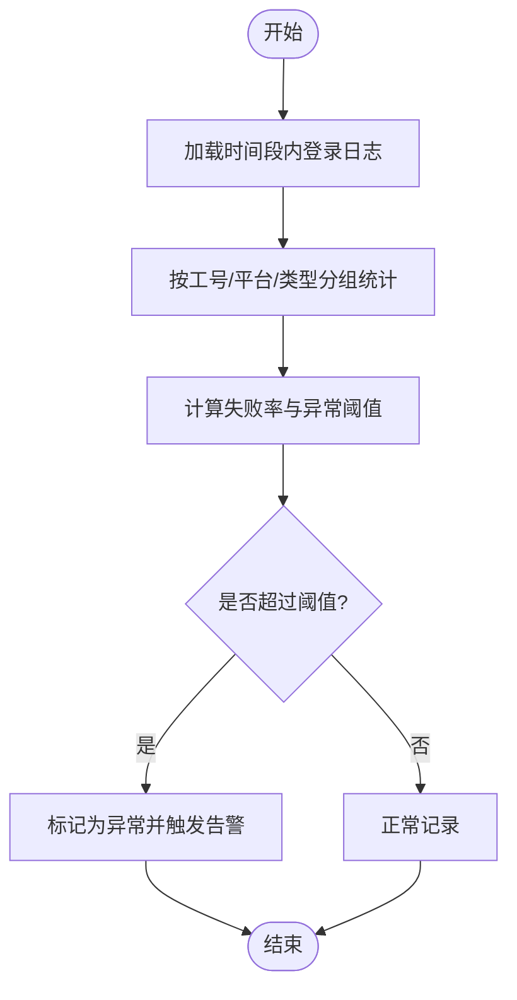

图表来源
- [process/src/models/LoginConfigLoginLogModel.php](file://process/src/models/LoginConfigLoginLogModel.php#L1-L68)

章节来源
- [process/src/models/LoginConfigLoginLogModel.php](file://process/src/models/LoginConfigLoginLogModel.php#L1-L68)

## 依赖关系分析
- 模型与数据库
  - 所有日志模型均依赖 PostgreSQL 的 JSON/JSONB 字段存储结构化与半结构化数据，便于审计扩展。
- 迁移脚本与模型
  - 迁移脚本负责建表、索引与列扩展，确保审计数据的完整性与可查询性。
- 数据库配置
  - WAL 与同步提交设置影响日志持久性与一致性，需结合业务需求进行调优。

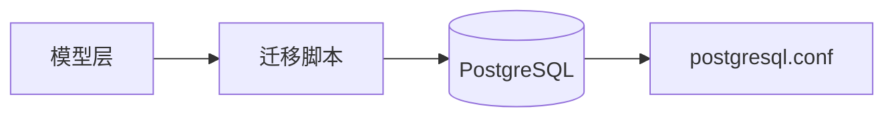

图表来源
- [process/src/migrations/migration_20250904_112321_login_config.php](file://process/src/migrations/migration_20250904_112321_login_config.php#L1-L34)
- [process/src/migrations/migration_20250805_add_proc_log_comment.php](file://process/src/migrations/migration_20250805_add_proc_log_comment.php#L1-L28)
- [process/src/migrations/migration_20251205_120000_personal_batch_update_log.php](file://process/src/migrations/migration_20251205_120000_personal_batch_update_log.php#L29-L47)
- [process/src/migrations/migration_20240805_123142_create_compliance.php](file://process/src/migrations/migration_20240805_123142_create_compliance.php#L1-L28)
- [process/docker/services/postgres/postgresql.conf](file://process/docker/services/postgres/postgresql.conf#L160-L185)

章节来源
- [process/src/migrations/migration_20250904_112321_login_config.php](file://process/src/migrations/migration_20250904_112321_login_config.php#L1-L34)
- [process/src/migrations/migration_20250805_add_proc_log_comment.php](file://process/src/migrations/migration_20250805_add_proc_log_comment.php#L1-L28)
- [process/src/migrations/migration_20251205_120000_personal_batch_update_log.php](file://process/src/migrations/migration_20251205_120000_personal_batch_update_log.php#L29-L47)
- [process/src/migrations/migration_20240805_123142_create_compliance.php](file://process/src/migrations/migration_20240805_123142_create_compliance.php#L1-L28)
- [process/docker/services/postgres/postgresql.conf](file://process/docker/services/postgres/postgresql.conf#L160-L185)

## 性能与可维护性
- 索引策略
  - 交互日志：按 sess_id、app_id、created 建立索引，提升查询效率。
  - 批量更新日志：按 operator、desktop_id、data_table_id、start_time 建立索引，支持批量操作审计与统计。
  - 登录日志：按 platform_id、oauth_type、status、created 建立索引，支持登录质量分析。
- 数据保留与归档
  - 建议按月/季度归档旧日志，保留期根据法规要求设定（如 90/180/365 天）。
- WAL 与一致性
  - 结合 postgresql.conf 的 WAL 与同步提交设置，平衡性能与数据安全。

章节来源
- [process/src/migrations/migration_20250805_add_proc_log_comment.php](file://process/src/migrations/migration_20250805_add_proc_log_comment.php#L1-L28)
- [process/src/migrations/migration_20251205_120000_personal_batch_update_log.php](file://process/src/migrations/migration_20251205_120000_personal_batch_update_log.php#L29-L47)
- [process/docker/services/postgres/postgresql.conf](file://process/docker/services/postgres/postgresql.conf#L160-L185)

## 故障排查指南
- 登录失败定位
  - 通过登录日志模型按平台ID、OAuth类型、状态筛选，结合错误信息字段定位问题。
- 通知发送异常
  - 查看通知发送日志的状态与错误信息，结合重试数据与重试方法进行修复。
- 交互异常排查
  - 通过交互日志的请求/响应数据与请求状态，定位接口或数据源异常。
- 存活检测失败
  - 使用存活检查日志模型的 last 成功记录判断最近是否通过，辅助风控策略。

章节来源
- [process/src/models/LoginConfigLoginLogModel.php](file://process/src/models/LoginConfigLoginLogModel.php#L1-L68)
- [process/src/models/NoticeConfigSendLogModel.php](file://process/src/models/NoticeConfigSendLogModel.php#L1-L55)
- [process/src/models/InteractionLogModel.php](file://process/src/models/InteractionLogModel.php#L1-L92)
- [process/src/models/AliveCheckLogModel.php](file://process/src/models/AliveCheckLogModel.php#L1-L41)

## 结论
本审计安全模型以多类日志模型为核心，配合迁移脚本与数据库配置，构建了覆盖用户行为追踪、系统事件记录与安全监控的完整闭环。通过合理的索引策略、数据保留与归档机制，以及基于日志的异常检测与报表分析，能够有效支撑合规审计与风险管控目标。

## 附录
- 安全辅助与访问控制
  - 可结合安全辅助工具进行敏感字段脱敏、访问鉴权与操作授权控制，确保日志采集与查询过程的安全性。
- 日志加密与完整性校验
  - 建议在传输与存储层面引入加密与完整性校验（如哈希签名），防止篡改与泄露。
- 报表与统计
  - 基于各日志模型的字段组合，可生成登录质量报表、通知发送报表、交互成功率报表与合规达标报表。

章节来源
- [process/src/helpers/SecurityHelper.php](file://process/src/helpers/SecurityHelper.php)