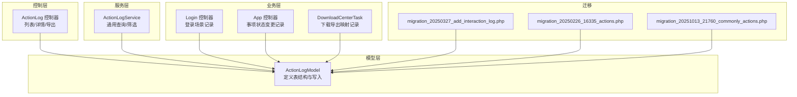
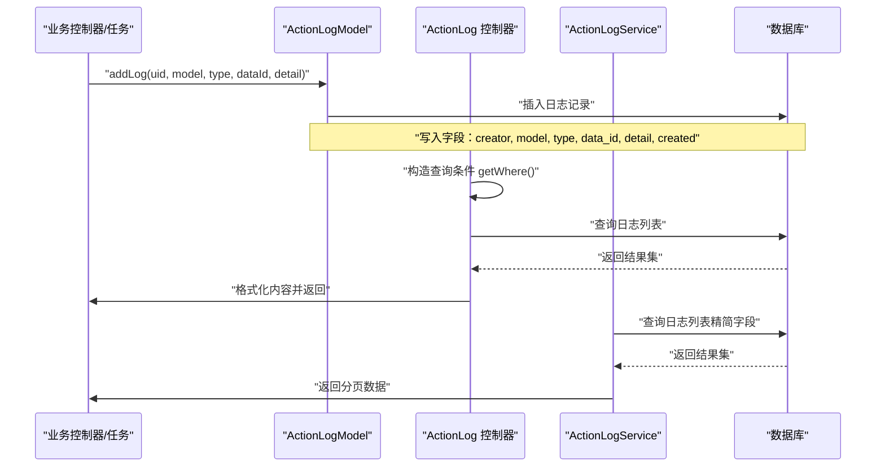
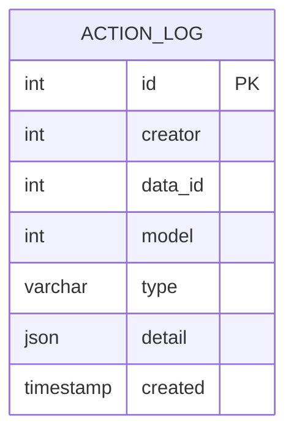
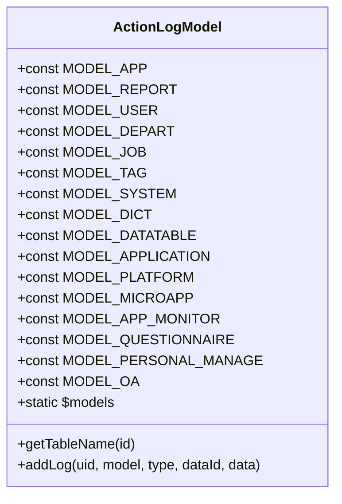
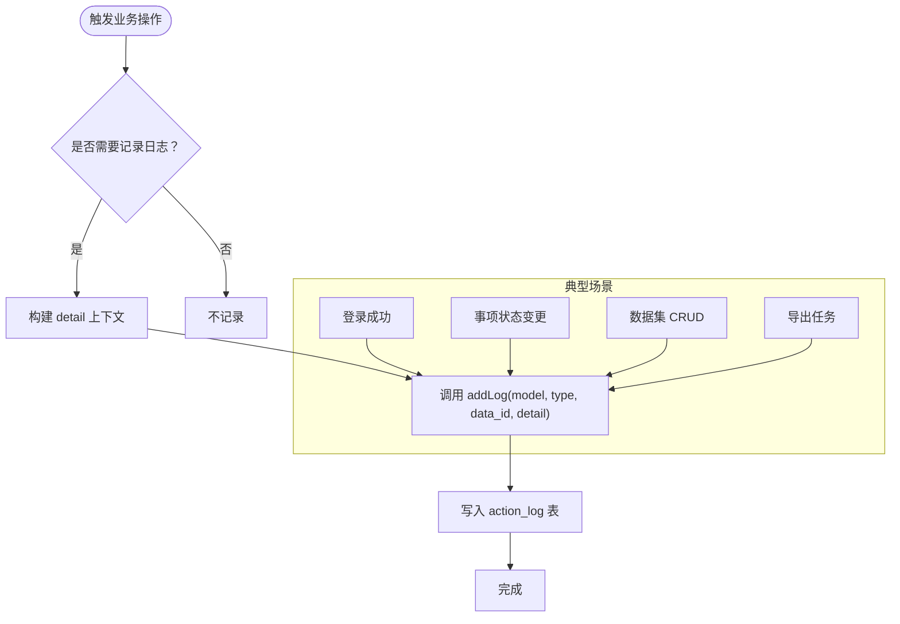
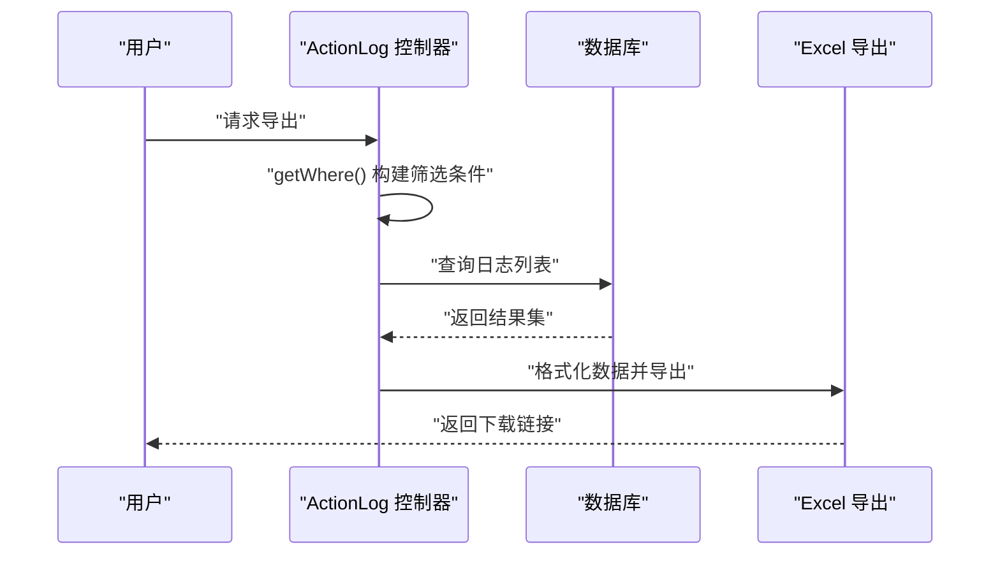
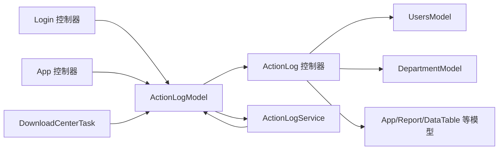

# 操作日志模型

<cite>
**本文引用的文件**
- [ActionLogModel.php](file://process/src/models/ActionLogModel.php)
- [ActionLog.php](file://process/src/http/system/ActionLog.php)
- [ActionLogService.php](file://process/src/services/ActionLogService.php)
- [Login.php](file://process/src/http/api/Login.php)
- [App.php](file://process/src/http/system/App.php)
- [DownloadCenterTask.php](file://process/src/services/task/DownloadCenterTask.php)
- [migration_20250327_add_interaction_log.php](file://process/src/migrations/migration_20250327_add_interaction_log.php)
- [migration_20250226_16335_actions.php](file://process/src/migrations/migration_20250226_16335_actions.php)
- [migration_20251013_21760_commonly_actions.php](file://process/src/migrations/migration_20251013_21760_commonly_actions.php)
</cite>

## 目录
1. [引言](#引言)
2. [项目结构](#项目结构)
3. [核心组件](#核心组件)
4. [架构总览](#架构总览)
5. [组件详解](#组件详解)
6. [依赖关系分析](#依赖关系分析)
7. [性能与查询优化](#性能与查询优化)
8. [故障排查指南](#故障排查指南)
9. [结论](#结论)
10. [附录](#附录)

## 引言
本文件围绕“操作日志模型”展开，系统化梳理 ActionLogModel 的设计与实现，涵盖数据结构、字段语义、操作类型分类体系、日志记录机制、存储策略、查询与导出能力、性能优化建议，以及在审计、行为追踪与合规中的作用。同时提供关键调用路径与使用示例，帮助读者快速理解并正确使用该模型。

## 项目结构
操作日志相关的核心代码分布于以下模块：
- 模型层：ActionLogModel 定义日志表结构与写入入口
- 控制器层：ActionLog 控制器提供列表、详情、导出等接口
- 服务层：ActionLogService 提供通用查询与筛选逻辑
- 业务控制器：多处业务控制器在关键操作点调用 addLog 记录
- 迁移脚本：数据库结构演进与索引优化

图表来源
- [ActionLogModel.php](file://process/src/models/ActionLogModel.php#L1-L90)
- [ActionLog.php](file://process/src/http/system/ActionLog.php#L1-L229)
- [ActionLogService.php](file://process/src/services/ActionLogService.php#L1-L170)
- [Login.php](file://process/src/http/api/Login.php#L200-L225)
- [App.php](file://process/src/http/system/App.php#L190-L201)
- [DownloadCenterTask.php](file://process/src/services/task/DownloadCenterTask.php#L121-L151)
- [migration_20250327_add_interaction_log.php](file://process/src/migrations/migration_20250327_add_interaction_log.php#L1-L41)
- [migration_20250226_16335_actions.php](file://process/src/migrations/migration_20250226_16335_actions.php#L1-L19)
- [migration_20251013_21760_commonly_actions.php](file://process/src/migrations/migration_20251013_21760_commonly_actions.php#L1-L32)

章节来源
- [ActionLogModel.php](file://process/src/models/ActionLogModel.php#L1-L90)
- [ActionLog.php](file://process/src/http/system/ActionLog.php#L1-L229)
- [ActionLogService.php](file://process/src/services/ActionLogService.php#L1-L170)
- [Login.php](file://process/src/http/api/Login.php#L200-L225)
- [App.php](file://process/src/http/system/App.php#L190-L201)
- [DownloadCenterTask.php](file://process/src/services/task/DownloadCenterTask.php#L121-L151)
- [migration_20250327_add_interaction_log.php](file://process/src/migrations/migration_20250327_add_interaction_log.php#L1-L41)
- [migration_20250226_16335_actions.php](file://process/src/migrations/migration_20250226_16335_actions.php#L1-L19)
- [migration_20251013_21760_commonly_actions.php](file://process/src/migrations/migration_20251013_21760_commonly_actions.php#L1-L32)

## 核心组件
- ActionLogModel：定义日志表字段、模型分类常量、中文注释、表名与写入方法
- ActionLog 控制器：提供分页列表、详情、按条件筛选、导出 Excel 等能力
- ActionLogService：封装通用查询、筛选条件构建与用户/部门关联信息组装
- 业务控制器与任务：在登录、事项状态变更、数据集操作、导出等关键节点调用 addLog

章节来源
- [ActionLogModel.php](file://process/src/models/ActionLogModel.php#L1-L90)
- [ActionLog.php](file://process/src/http/system/ActionLog.php#L1-L229)
- [ActionLogService.php](file://process/src/services/ActionLogService.php#L1-L170)

## 架构总览
操作日志的调用链路通常为：业务控制器/任务触发 → 调用 ActionLogModel::addLog 写入 → 控制器/服务层查询与格式化 → 前端展示或导出。

图表来源
- [ActionLogModel.php](file://process/src/models/ActionLogModel.php#L80-L90)
- [ActionLog.php](file://process/src/http/system/ActionLog.php#L23-L57)
- [ActionLog.php](file://process/src/http/system/ActionLog.php#L136-L189)
- [ActionLogService.php](file://process/src/services/ActionLogService.php#L79-L110)

## 组件详解

### 数据结构与字段定义
- 表名：action_log
- 字段与类型：
  - id：整型，主键
  - creator：整型，创建人
  - data_id：整型，关联数据标识
  - model：整型，模块分类编号
  - type：字符串，操作类型描述
  - detail：JSON，详细上下文（如登录 IP、浏览器、字段变更明细等）
  - created：时间戳，默认当前时间
- 字段注释：用于生成文档与前端展示提示

图表来源
- [ActionLogModel.php](file://process/src/models/ActionLogModel.php#L16-L34)

章节来源
- [ActionLogModel.php](file://process/src/models/ActionLogModel.php#L16-L34)

### 模型分类体系（模块类型）
ActionLogModel 定义了丰富的模块分类常量与中文映射，覆盖事项中心、报表管理、用户数据、部门管理、岗位管理、标签管理、系统、码表、数据集、应用中心、第三方平台、微系统、流程监控、问卷通、个人数据管理、OA 等模块。这些常量作为 model 字段值使用，并在控制器/服务层转换为中文描述。

图表来源
- [ActionLogModel.php](file://process/src/models/ActionLogModel.php#L36-L78)
- [ActionLogModel.php](file://process/src/models/ActionLogModel.php#L80-L90)

章节来源
- [ActionLogModel.php](file://process/src/models/ActionLogModel.php#L36-L78)

### 操作类型与记录机制
- 登录场景：在登录成功后记录登录方式、IP、UA、跳转地址等 detail
- 事项状态变更：在发布/取消发布/删除等状态切换时记录
- 数据集操作：对数据集的新增、编辑、删除、清空等操作，detail 中包含字段键名、类型与值
- 导出场景：根据导出类型映射到不同 model 与 data_id，便于审计导出行为

图表来源
- [Login.php](file://process/src/http/api/Login.php#L200-L225)
- [App.php](file://process/src/http/system/App.php#L190-L201)
- [ActionLogService.php](file://process/src/services/ActionLogService.php#L17-L76)
- [DownloadCenterTask.php](file://process/src/services/task/DownloadCenterTask.php#L121-L151)

章节来源
- [Login.php](file://process/src/http/api/Login.php#L200-L225)
- [App.php](file://process/src/http/system/App.php#L190-L201)
- [ActionLogService.php](file://process/src/services/ActionLogService.php#L17-L76)
- [DownloadCenterTask.php](file://process/src/services/task/DownloadCenterTask.php#L121-L151)

### 查询与导出机制
- 列表查询：支持按用户名（工号/姓名）、模块、起止时间、类型关键词、关键字+模块组合、ID 精确过滤
- 详情查询：按主键获取原始日志记录
- 导出 Excel：将日志与用户、部门信息合并，生成可下载文件，并记录导出日志

图表来源
- [ActionLog.php](file://process/src/http/system/ActionLog.php#L136-L189)
- [ActionLog.php](file://process/src/http/system/ActionLog.php#L196-L226)

章节来源
- [ActionLog.php](file://process/src/http/system/ActionLog.php#L23-L57)
- [ActionLog.php](file://process/src/http/system/ActionLog.php#L136-L189)
- [ActionLog.php](file://process/src/http/system/ActionLog.php#L196-L226)

### 使用示例与调用路径
- 登录成功后记录：参考登录控制器中对 addLog 的调用
- 事项状态变更记录：参考系统控制器中对 addLog 的调用
- 数据集 CRUD 日志：通过 ActionLogService 封装的工具方法统一记录
- 导出类型映射：根据任务类型映射到不同 model 与 data_id

章节来源
- [Login.php](file://process/src/http/api/Login.php#L200-L225)
- [App.php](file://process/src/http/system/App.php#L190-L201)
- [ActionLogService.php](file://process/src/services/ActionLogService.php#L17-L76)
- [DownloadCenterTask.php](file://process/src/services/task/DownloadCenterTask.php#L121-L151)

## 依赖关系分析
- ActionLogModel 依赖 ORM 基类，提供 insert 与 find 等基础能力
- ActionLog 控制器依赖用户、部门、报表、数据集、应用等模型以格式化内容
- ActionLogService 复用 ActionLogModel 的查询能力，提供更通用的筛选与分页
- 业务控制器与任务通过常量与工具方法统一调用 addLog，降低重复与耦合

图表来源
- [ActionLogModel.php](file://process/src/models/ActionLogModel.php#L80-L90)
- [ActionLog.php](file://process/src/http/system/ActionLog.php#L1-L57)
- [ActionLogService.php](file://process/src/services/ActionLogService.php#L79-L110)
- [Login.php](file://process/src/http/api/Login.php#L200-L225)
- [App.php](file://process/src/http/system/App.php#L190-L201)
- [DownloadCenterTask.php](file://process/src/services/task/DownloadCenterTask.php#L121-L151)

章节来源
- [ActionLog.php](file://process/src/http/system/ActionLog.php#L1-L57)
- [ActionLogService.php](file://process/src/services/ActionLogService.php#L79-L110)
- [Login.php](file://process/src/http/api/Login.php#L200-L225)
- [App.php](file://process/src/http/system/App.php#L190-L201)
- [DownloadCenterTask.php](file://process/src/services/task/DownloadCenterTask.php#L121-L151)

## 性能与查询优化
- 索引建议
  - 对 creator、model、created 建立复合索引，提升按人、模块、时间的筛选性能
  - 对 data_id 建立索引，加速关键字+模块组合查询
- 查询优化
  - 列表接口默认按 id 倒序，结合分页参数 limit/offset，避免全表扫描
  - 导出接口可限制时间范围与模块，减少数据量
- 存储策略
  - detail 字段为 JSON，建议控制单条 detail 的大小，避免超大 JSON 影响 IO
  - 对高频导出场景，可在任务侧先做预聚合或缓存热点数据
- 迁移与扩展
  - interaction_log、commonly_actions 等迁移脚本展示了针对不同场景的索引与列扩展思路，可借鉴到 action_log 的优化中

章节来源
- [migration_20250327_add_interaction_log.php](file://process/src/migrations/migration_20250327_add_interaction_log.php#L1-L41)
- [migration_20250226_16335_actions.php](file://process/src/migrations/migration_20250226_16335_actions.php#L1-L19)
- [migration_20251013_21760_commonly_actions.php](file://process/src/migrations/migration_20251013_21760_commonly_actions.php#L1-L32)

## 故障排查指南
- 无法查询到日志
  - 检查筛选条件是否正确（用户名、模块、时间、类型、关键字、ID）
  - 确认 data_id 与模块类型匹配，避免跨模块误查
- 导出异常
  - 确认导出接口传参完整且合法（时间范围、模块、类型等）
  - 检查导出文件是否生成成功并记录导出日志
- detail 内容异常
  - 确认 detail 结构符合预期（字段键名、类型、值）
  - 对大数据量 detail，建议拆分或压缩后再入库

章节来源
- [ActionLog.php](file://process/src/http/system/ActionLog.php#L136-L189)
- [ActionLog.php](file://process/src/http/system/ActionLog.php#L196-L226)
- [ActionLogService.php](file://process/src/services/ActionLogService.php#L112-L168)

## 结论
ActionLogModel 通过标准化的字段设计与清晰的模块分类，为系统提供了统一的操作审计能力。配合控制器与服务层的查询与导出功能，能够满足审计、行为追踪与合规检查的需求。建议在生产环境中完善索引、控制 detail 规模，并通过迁移脚本持续优化表结构与查询性能。

## 附录

### 字段与业务含义对照
- id：日志唯一标识
- creator：操作人 ID
- data_id：关联数据 ID（如事项 ID、报表 ID、用户 ID、数据集 ID 等）
- model：模块分类编号（对应 ActionLogModel::$models 映射）
- type：操作类型描述（如“发布事项”、“登录”、“编辑数据”等）
- detail：操作上下文详情（JSON 格式，包含字段、值、条件等）
- created：操作时间

章节来源
- [ActionLogModel.php](file://process/src/models/ActionLogModel.php#L16-L34)
- [ActionLogModel.php](file://process/src/models/ActionLogModel.php#L55-L73)