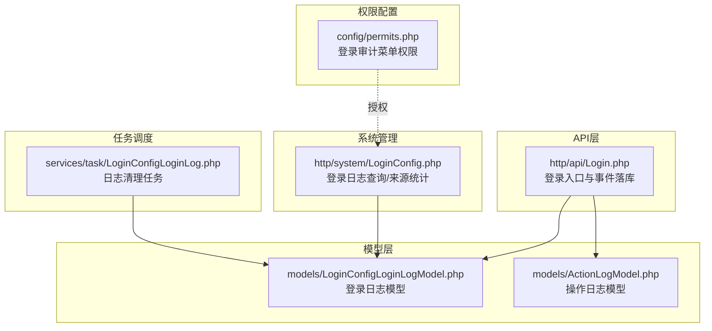
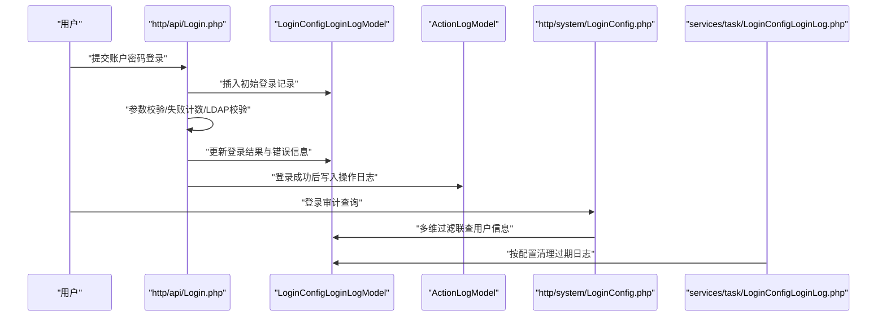
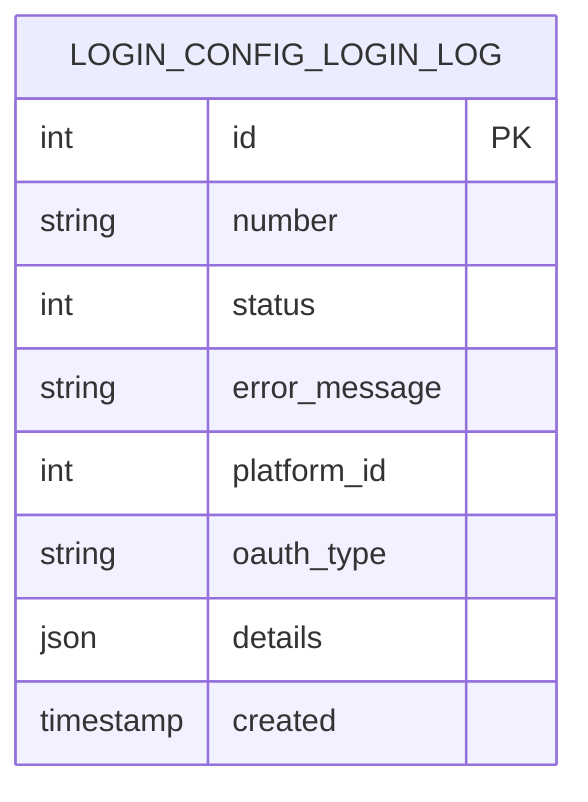
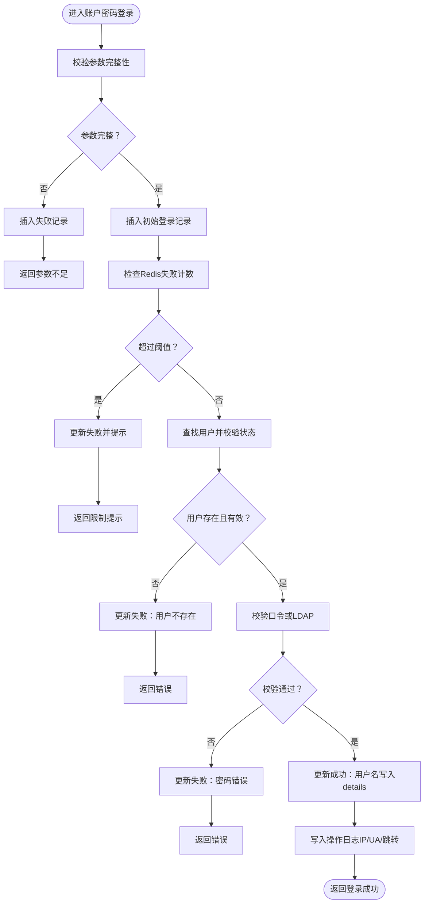
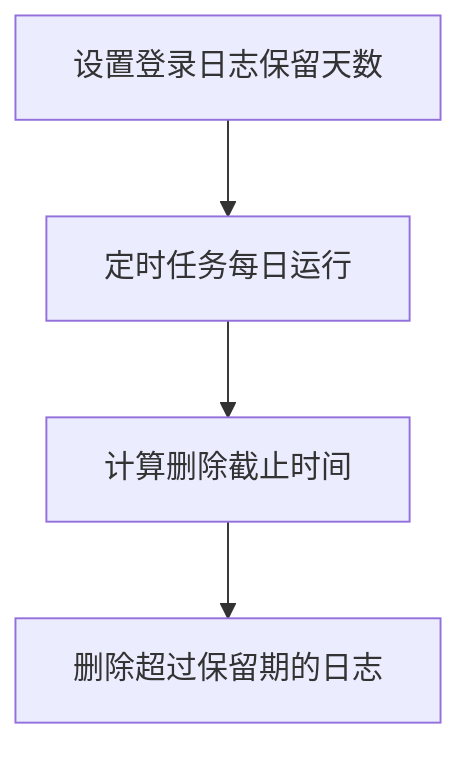
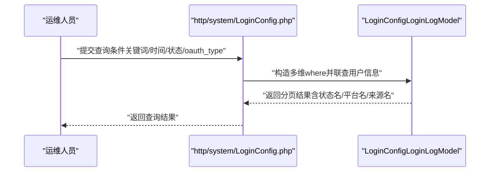
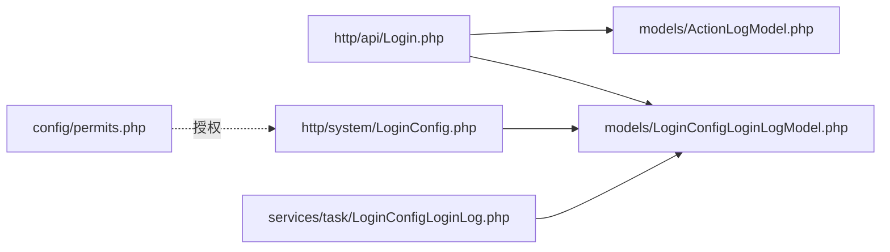

# 登录日志模型

<cite>
**本文引用的文件**
- [LoginConfigLoginLogModel.php](file://process/src/models/LoginConfigLoginLogModel.php)
- [Login.php](file://process/src/http/api/Login.php)
- [LoginConfig.php](file://process/src/http/system/LoginConfig.php)
- [LoginConfigLoginLog.php](file://process/src/services/task/LoginConfigLoginLog.php)
- [ActionLogModel.php](file://process/src/models/ActionLogModel.php)
- [permits.php](file://process/src/config/permits.php)
</cite>

## 目录
1. [简介](#简介)
2. [项目结构](#项目结构)
3. [核心组件](#核心组件)
4. [架构总览](#架构总览)
5. [组件详解](#组件详解)
6. [依赖关系分析](#依赖关系分析)
7. [性能与容量建议](#性能与容量建议)
8. [故障排查指南](#故障排查指南)
9. [结论](#结论)
10. [附录：查询与分析示例](#附录查询与分析示例)

## 简介
本文件围绕登录日志模型 LoginConfigLoginLogModel，系统化梳理其在用户认证与安全审计中的角色定位、数据结构与存储策略、登录事件记录机制、失败尝试监控与异常检测、查询分析与统计报表能力，以及与身份验证、访问控制和安全防护的关系，并提供可落地的查询与分析实践示例。

## 项目结构
登录日志模型位于 models 层，业务入口在 http/api/Login.php 中触发登录流程并落库；系统后台在 http/system/LoginConfig.php 提供登录日志查询与来源统计；定时任务 services/task/LoginConfigLoginLog.php 负责按配置清理过期日志；同时，账户密码登录成功后还会写入操作日志 ActionLogModel.php 作为补充审计证据。

图示来源
- [Login.php](file://process/src/http/api/Login.php#L130-L225)
- [LoginConfigLoginLogModel.php](file://process/src/models/LoginConfigLoginLogModel.php#L1-L68)
- [LoginConfig.php](file://process/src/http/system/LoginConfig.php#L260-L320)
- [LoginConfigLoginLog.php](file://process/src/services/task/LoginConfigLoginLog.php#L1-L18)
- [ActionLogModel.php](file://process/src/models/ActionLogModel.php#L1-L90)
- [permits.php](file://process/src/config/permits.php#L370-L385)

章节来源
- [Login.php](file://process/src/http/api/Login.php#L130-L225)
- [LoginConfigLoginLogModel.php](file://process/src/models/LoginConfigLoginLogModel.php#L1-L68)
- [LoginConfig.php](file://process/src/http/system/LoginConfig.php#L260-L320)
- [LoginConfigLoginLog.php](file://process/src/services/task/LoginConfigLoginLog.php#L1-L18)
- [ActionLogModel.php](file://process/src/models/ActionLogModel.php#L1-L90)
- [permits.php](file://process/src/config/permits.php#L370-L385)

## 核心组件
- 登录日志模型 LoginConfigLoginLogModel：定义登录日志表结构、状态常量、插入与更新方法，提供按平台与第三方登录类型的聚合查询。
- 登录入口 Login.php：在账户密码登录流程中，对参数校验、失败计数、用户存在性与口令校验、LDAP 校验、登录成功后的审计等关键节点进行日志落库。
- 系统登录日志查询 LoginConfig.php：提供关键字、起止时间、状态、第三方登录类型等多维过滤，支持与用户表联查展示真实姓名。
- 日志清理任务 LoginConfigLoginLog.php：根据系统配置的保留时长定期删除过期登录日志。
- 操作日志 ActionLogModel.php：在账户密码登录成功后记录登录 IP、UA、跳转地址等上下文，作为登录审计的补充证据。

章节来源
- [LoginConfigLoginLogModel.php](file://process/src/models/LoginConfigLoginLogModel.php#L1-L68)
- [Login.php](file://process/src/http/api/Login.php#L130-L225)
- [LoginConfig.php](file://process/src/http/system/LoginConfig.php#L260-L320)
- [LoginConfigLoginLog.php](file://process/src/services/task/LoginConfigLoginLog.php#L1-L18)
- [ActionLogModel.php](file://process/src/models/ActionLogModel.php#L1-L90)

## 架构总览
登录日志贯穿“认证入口 -> 事件落库 -> 查询审计 -> 清理归档”的闭环，既服务于安全运营，也支撑合规审计与风控策略。

图示来源
- [Login.php](file://process/src/http/api/Login.php#L130-L225)
- [LoginConfigLoginLogModel.php](file://process/src/models/LoginConfigLoginLogModel.php#L46-L68)
- [ActionLogModel.php](file://process/src/models/ActionLogModel.php#L80-L90)
- [LoginConfig.php](file://process/src/http/system/LoginConfig.php#L260-L320)
- [LoginConfigLoginLog.php](file://process/src/services/task/LoginConfigLoginLog.php#L1-L18)

## 组件详解

### 数据模型与字段定义
- 表名与主键：表名为 login_config_login_log，主键为 id。
- 字段说明（来自模型注释与列定义）：
  - id：主键
  - number：工号/学号/统一身份标识
  - status：登录状态（成功/失败）
  - error_message：错误信息
  - platform_id：平台ID（自有登录为0或未设置）
  - oauth_type：第三方登录类型（如微信、企业微信、小程序等）
  - details：JSON格式的扩展详情（如用户名等）
  - created：创建时间
- 状态映射：成功/失败两态，便于前端与报表展示。

图示来源
- [LoginConfigLoginLogModel.php](file://process/src/models/LoginConfigLoginLogModel.php#L12-L31)

章节来源
- [LoginConfigLoginLogModel.php](file://process/src/models/LoginConfigLoginLogModel.php#L12-L31)

### 登录事件记录机制
- 入口控制器 Login.php 在账户密码登录路径中：
  - 参数校验阶段：若用户名存在但缺少密码/验证码，直接落库标记失败。
  - 初始化阶段：无论是否通过校验，先插入一条初始记录用于后续更新。
  - 失败计数阶段：基于 Redis 的小时级失败计数阈值（默认5次），超过阈值直接返回失败并更新日志。
  - 校验阶段：用户存在性、口令校验或 LDAP 校验，失败则更新错误信息。
  - 成功阶段：登录成功后更新状态为成功，并将用户名写入 details。
- 成功后补充写入操作日志 ActionLogModel.php，记录登录 IP、User-Agent、跳转地址等。

图示来源
- [Login.php](file://process/src/http/api/Login.php#L130-L225)
- [ActionLogModel.php](file://process/src/models/ActionLogModel.php#L80-L90)

章节来源
- [Login.php](file://process/src/http/api/Login.php#L130-L225)
- [ActionLogModel.php](file://process/src/models/ActionLogModel.php#L80-L90)

### 失败尝试监控与异常检测
- 失败尝试监控：以 Redis 键 login_failed_{md5(username)_YmdH} 记录每小时失败次数，超过阈值（默认5次）阻断本次登录并记录失败原因。
- 异常检测思路：
  - 同一账号短时间多次失败，结合 error_message 与 oauth_type 进行聚合分析。
  - 不同设备/来源（oauth_type）的异常登录模式识别。
  - 平台维度（platform_id）与用户维度（number）的异常登录画像。

章节来源
- [Login.php](file://process/src/http/api/Login.php#L148-L154)

### 存储策略与生命周期
- 存储位置：PostgreSQL 表 login_config_login_log。
- 生命周期管理：系统配置项决定日志保留天数，定时任务按天执行清理，删除早于保留期限的日志记录。

图示来源
- [LoginConfig.php](file://process/src/http/system/LoginConfig.php#L160-L189)
- [LoginConfigLoginLog.php](file://process/src/services/task/LoginConfigLoginLog.php#L1-L18)

章节来源
- [LoginConfig.php](file://process/src/http/system/LoginConfig.php#L160-L189)
- [LoginConfigLoginLog.php](file://process/src/services/task/LoginConfigLoginLog.php#L1-L18)

### 查询分析、统计报表与安全告警
- 查询入口：系统控制器 LoginConfig.php 提供登录日志查询接口，支持关键字（工号/姓名）、起止时间、状态、第三方登录类型过滤，并与用户表联查显示真实姓名。
- 统计维度：可按 oauth_type、platform_id、status、时间窗口进行交叉统计，生成登录趋势、来源分布、失败原因分布等报表。
- 安全告警：结合失败计数阈值、异常来源与设备、同一账号异地登录等规则，可在系统侧或外部 SIEM 平台对接实现告警联动。

图示来源
- [LoginConfig.php](file://process/src/http/system/LoginConfig.php#L260-L320)

章节来源
- [LoginConfig.php](file://process/src/http/system/LoginConfig.php#L260-L320)

### 权限与访问控制
- 登录审计相关菜单权限由配置文件 permits.php 定义，仅具备相应权限的用户可访问系统后台的登录审计页面与导出功能。

章节来源
- [permits.php](file://process/src/config/permits.php#L370-L385)

## 依赖关系分析
- Login.php 依赖 LoginConfigLoginLogModel 进行登录事件落库；成功后依赖 ActionLogModel 写入操作日志。
- LoginConfig.php 依赖 LoginConfigLoginLogModel 进行登录日志查询与来源统计。
- LoginConfigLoginLog.php 依赖 LoginConfigLoginLogModel 进行过期日志清理。
- 权限控制通过 permits.php 对系统菜单进行授权约束。

图示来源
- [Login.php](file://process/src/http/api/Login.php#L130-L225)
- [LoginConfigLoginLogModel.php](file://process/src/models/LoginConfigLoginLogModel.php#L46-L68)
- [ActionLogModel.php](file://process/src/models/ActionLogModel.php#L80-L90)
- [LoginConfig.php](file://process/src/http/system/LoginConfig.php#L260-L320)
- [LoginConfigLoginLog.php](file://process/src/services/task/LoginConfigLoginLog.php#L1-L18)
- [permits.php](file://process/src/config/permits.php#L370-L385)

章节来源
- [Login.php](file://process/src/http/api/Login.php#L130-L225)
- [LoginConfigLoginLogModel.php](file://process/src/models/LoginConfigLoginLogModel.php#L46-L68)
- [ActionLogModel.php](file://process/src/models/ActionLogModel.php#L80-L90)
- [LoginConfig.php](file://process/src/http/system/LoginConfig.php#L260-L320)
- [LoginConfigLoginLog.php](file://process/src/services/task/LoginConfigLoginLog.php#L1-L18)
- [permits.php](file://process/src/config/permits.php#L370-L385)

## 性能与容量建议
- 索引优化：建议在 number、created、status、oauth_type、platform_id 上建立合适索引，以提升查询与聚合效率。
- 分表分桶：当数据量达到千万级时，可考虑按时间分表或按平台/来源分桶。
- 缓存策略：对高频查询（如来源分布、近7日趋势）增加缓存层，降低数据库压力。
- 清理策略：结合业务峰值与合规要求动态调整保留天数，避免无界增长。

## 故障排查指南
- 登录失败频繁但未见日志：确认 Login.php 是否正确调用插入/更新方法，检查 Redis 失败计数键是否存在与过期时间。
- 查询不到用户姓名：确认系统查询接口是否正确联查用户表，以及用户是否存在真实姓名。
- 日志未清理：核对系统配置的保留天数与定时任务计划，检查任务执行日志。

章节来源
- [Login.php](file://process/src/http/api/Login.php#L130-L225)
- [LoginConfig.php](file://process/src/http/system/LoginConfig.php#L260-L320)
- [LoginConfigLoginLog.php](file://process/src/services/task/LoginConfigLoginLog.php#L1-L18)

## 结论
LoginConfigLoginLogModel 作为统一的登录事件载体，串联了认证入口、失败监控、成功审计与生命周期管理，是构建身份认证体系与安全审计闭环的关键基础。通过多维查询与统计，可有效支撑风险识别与合规审计；配合权限控制与自动化清理，可持续保障系统性能与数据治理质量。

## 附录：查询与分析示例
以下示例描述如何使用系统提供的查询能力进行登录日志分析（不展示具体代码，仅给出调用路径与参数说明）：

- 示例1：按时间段与状态筛选
  - 路径参考：[LoginConfig.php](file://process/src/http/system/LoginConfig.php#L260-L320)
  - 参数要点：start_time、end_time、status（0/1）
  - 输出：登录记录列表，包含状态名称、平台名称、来源名称

- 示例2：按关键字（工号/姓名）与来源类型筛选
  - 路径参考：[LoginConfig.php](file://process/src/http/system/LoginConfig.php#L260-L320)
  - 参数要点：keyword、oauth_type
  - 输出：登录记录列表，支持导出

- 示例3：查看登录来源枚举
  - 路径参考：[LoginConfig.php](file://process/src/http/system/LoginConfig.php#L304-L319)
  - 参数要点：无
  - 输出：来源类型列表（如微信、企业微信、小程序等）

- 示例4：登录成功后审计补充
  - 路径参考：[Login.php](file://process/src/http/api/Login.php#L205-L225)、[ActionLogModel.php](file://process/src/models/ActionLogModel.php#L80-L90)
  - 触发点：账户密码登录成功
  - 输出：操作日志记录（IP、UA、跳转地址等）

章节来源
- [LoginConfig.php](file://process/src/http/system/LoginConfig.php#L260-L320)
- [Login.php](file://process/src/http/api/Login.php#L205-L225)
- [ActionLogModel.php](file://process/src/models/ActionLogModel.php#L80-L90)