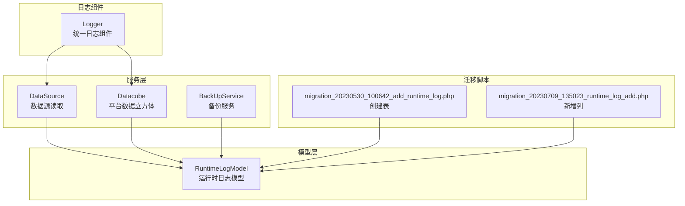
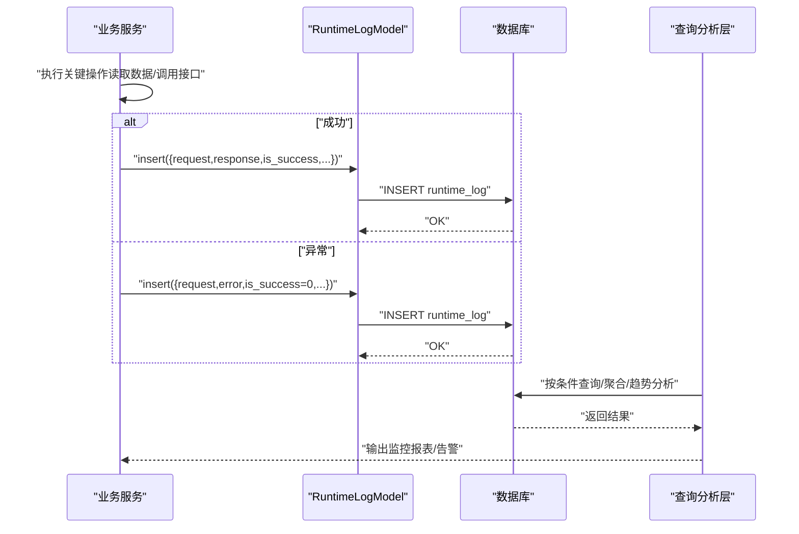
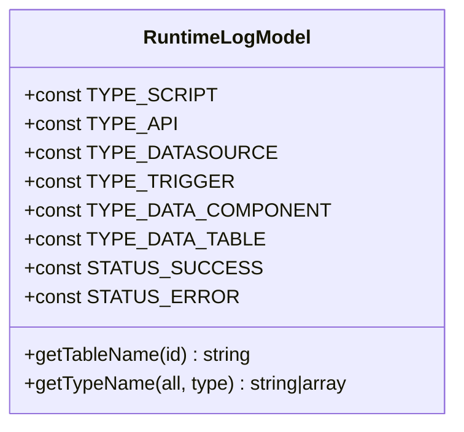
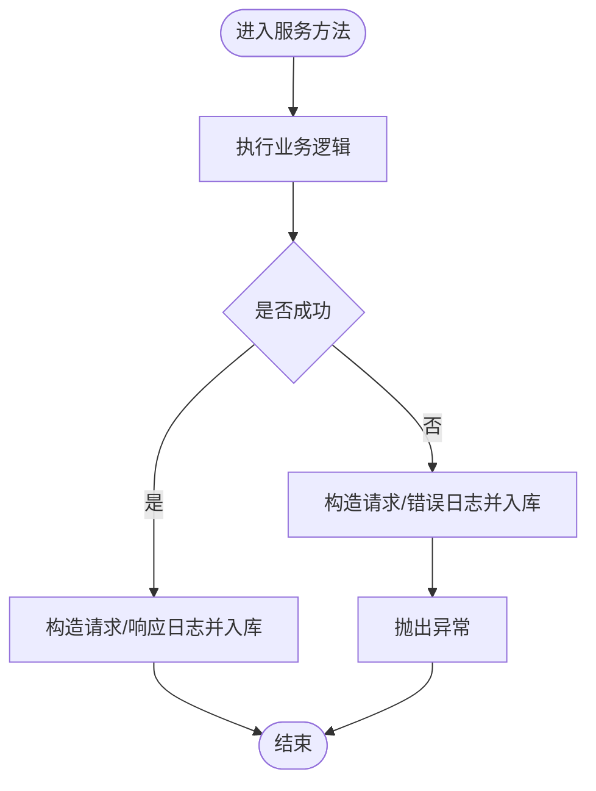
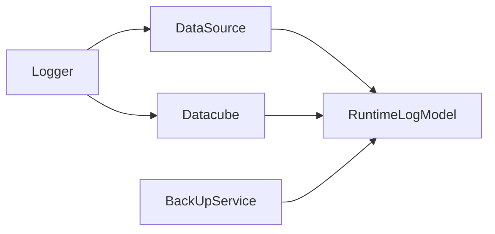

# 运行时日志模型

<cite>
**本文引用的文件**
- [RuntimeLogModel.php](file://process/src/models/RuntimeLogModel.php)
- [migration_20230530_100642_add_runtime_log.php](file://process/src/migrations/migration_20230530_100642_add_runtime_log.php)
- [migration_20230709_135023_runtime_log_add.php](file://process/src/migrations/migration_20230709_135023_runtime_log_add.php)
- [DataSource.php](file://process/src/services/DataSource.php)
- [Datacube.php](file://process/src/services/platform/Datacube.php)
- [BackUpService.php](file://process/src/services/BackUpService.php)
- [Logger.php](file://process/vendor/lifei/zl/src/component/Logger.php)
</cite>

## 目录
1. [简介](#简介)
2. [项目结构](#项目结构)
3. [核心组件](#核心组件)
4. [架构总览](#架构总览)
5. [组件详解](#组件详解)
6. [依赖关系分析](#依赖关系分析)
7. [性能考量](#性能考量)
8. [故障排查指南](#故障排查指南)
9. [结论](#结论)
10. [附录](#附录)

## 简介
本文件围绕运行时日志模型 RuntimeLogModel 展开，系统性阐述其在系统运行监控与性能审计中的设计原理与实践价值。内容涵盖：
- 日志数据结构与字段语义
- 日志级别与分类体系
- 性能指标采集、异常事件记录与运行状态追踪机制
- 查询过滤、聚合分析与趋势预测能力
- 在监控、故障诊断与性能优化中的关键作用
- 实际应用示例与最佳实践

## 项目结构
运行时日志模型位于 models 层，数据库表结构由迁移脚本定义，业务服务在执行关键路径时通过模型进行日志落盘。日志输出还依赖统一的日志组件。



**图表来源**
- [RuntimeLogModel.php](file://process/src/models/RuntimeLogModel.php#L1-L70)
- [migration_20230530_100642_add_runtime_log.php](file://process/src/migrations/migration_20230530_100642_add_runtime_log.php#L1-L36)
- [migration_20230709_135023_runtime_log_add.php](file://process/src/migrations/migration_20230709_135023_runtime_log_add.php#L1-L18)
- [DataSource.php](file://process/src/services/DataSource.php#L110-L136)
- [Datacube.php](file://process/src/services/platform/Datacube.php#L120-L139)
- [BackUpService.php](file://process/src/services/BackUpService.php#L52-L52)
- [Logger.php](file://process/vendor/lifei/zl/src/component/Logger.php#L1-L35)

**章节来源**
- [RuntimeLogModel.php](file://process/src/models/RuntimeLogModel.php#L1-L70)
- [migration_20230530_100642_add_runtime_log.php](file://process/src/migrations/migration_20230530_100642_add_runtime_log.php#L1-L36)
- [migration_20230709_135023_runtime_log_add.php](file://process/src/migrations/migration_20230709_135023_runtime_log_add.php#L1-L18)

## 核心组件
- 运行时日志模型 RuntimeLogModel
  - 定义日志类型常量（脚本、第三方接口、数据源、触发器、数据组件、数据集）
  - 定义状态常量（成功/失败）
  - 定义字段映射与注释，明确各字段含义
  - 提供类型名称映射方法，支持按类型获取中文名
- 数据库表结构
  - 字段覆盖：主键、应用/版本、对象、创建者、会话、任务、类型、主键、请求/响应、是否成功、错误、创建时间
  - 新增列：任务 ID
- 服务侧落日志
  - 数据源读取：成功与异常分别构造日志并入库
  - 平台数据立方体：调用外部接口后记录请求/响应与错误信息
  - 备份服务：将运行时日志表纳入备份关系配置

**章节来源**
- [RuntimeLogModel.php](file://process/src/models/RuntimeLogModel.php#L1-L70)
- [migration_20230530_100642_add_runtime_log.php](file://process/src/migrations/migration_20230530_100642_add_runtime_log.php#L1-L36)
- [migration_20230709_135023_runtime_log_add.php](file://process/src/migrations/migration_20230709_135023_runtime_log_add.php#L1-L18)
- [DataSource.php](file://process/src/services/DataSource.php#L110-L136)
- [Datacube.php](file://process/src/services/platform/Datacube.php#L120-L139)
- [BackUpService.php](file://process/src/services/BackUpService.php#L52-L52)

## 架构总览
运行时日志贯穿“服务执行—日志落库—查询分析—监控告警”的闭环链路。服务在关键路径捕获请求/响应与异常，并通过模型写入数据库；上层可基于该数据进行过滤、聚合与趋势分析，支撑监控与性能优化。



**图表来源**
- [DataSource.php](file://process/src/services/DataSource.php#L110-L136)
- [Datacube.php](file://process/src/services/platform/Datacube.php#L120-L139)
- [RuntimeLogModel.php](file://process/src/models/RuntimeLogModel.php#L1-L70)

## 组件详解

### 数据模型与字段语义
- 主键与关联标识
  - id：自增主键
  - app_id/app_version_id：应用与版本标识
  - obj_id：运行对象 ID（根据 type 判断具体对象）
  - creator/sess_id/task_id：创建者、会话、任务 ID
- 执行上下文
  - type：运行类型（脚本/接口/数据源/触发器/数据组件/数据集）
  - pk：目标主键（如数据表主键）
- 请求与响应
  - request/response：JSONB 记录请求参数与响应体
- 结果与错误
  - is_success：1 表示成功，0 表示失败
  - error：JSONB 记录错误信息（如异常消息）
- 时间戳
  - created：记录创建时间

```mermaid
erDiagram
RUNTIME_LOG {
int id PK
int app_id
int app_version_id
int obj_id
bigint creator
bigint sess_id
bigint task_id
smallint type
int pk
jsonb request
jsonb response
smallint is_success
jsonb error
timestamp created
}
```

**图表来源**
- [migration_20230530_100642_add_runtime_log.php](file://process/src/migrations/migration_20230530_100642_add_runtime_log.php#L1-L36)
- [RuntimeLogModel.php](file://process/src/models/RuntimeLogModel.php#L20-L52)

**章节来源**
- [RuntimeLogModel.php](file://process/src/models/RuntimeLogModel.php#L20-L52)
- [migration_20230530_100642_add_runtime_log.php](file://process/src/migrations/migration_20230530_100642_add_runtime_log.php#L1-L36)

### 日志类型与分类体系
- 类型常量
  - 脚本、第三方接口、数据源、触发器、数据组件、数据集
- 状态常量
  - 成功/失败
- 类型名称映射
  - 支持按类型返回中文名称，便于展示与统计



**图表来源**
- [RuntimeLogModel.php](file://process/src/models/RuntimeLogModel.php#L1-L70)

**章节来源**
- [RuntimeLogModel.php](file://process/src/models/RuntimeLogModel.php#L1-L70)

### 性能指标采集与异常记录
- 成功路径
  - 记录请求参数与响应体，is_success=1
- 异常路径
  - 记录请求参数与错误信息，is_success=0
- 任务维度
  - 通过 task_id 关联任务，便于按任务追踪性能与异常



**图表来源**
- [DataSource.php](file://process/src/services/DataSource.php#L110-L136)
- [Datacube.php](file://process/src/services/platform/Datacube.php#L120-L139)

**章节来源**
- [DataSource.php](file://process/src/services/DataSource.php#L110-L136)
- [Datacube.php](file://process/src/services/platform/Datacube.php#L120-L139)

### 运行状态追踪机制
- 会话与任务关联
  - sess_id 与 task_id 用于串联一次会话内的多次运行
- 对象标识
  - obj_id 与 type 共同定位具体运行对象，便于回溯
- 时间序列
  - created 字段形成时间序列，支持趋势分析

**章节来源**
- [RuntimeLogModel.php](file://process/src/models/RuntimeLogModel.php#L20-L52)
- [BackUpService.php](file://process/src/services/BackUpService.php#L52-L52)

### 查询过滤、聚合分析与趋势预测
- 查询过滤
  - 基于 app_id/app_version_id、obj_id、type、is_success、sess_id、task_id、时间范围等条件过滤
- 聚合分析
  - 按类型/对象/时间窗口统计成功率、平均耗时、异常分布
- 趋势预测
  - 基于历史时间序列计算移动均值、异常阈值，识别波动与潜在风险

[本节为概念性说明，不直接分析具体文件，故无“章节来源”]

### 在监控、诊断与优化中的作用
- 监控
  - 实时展示各类型运行成功率与错误率，异常告警联动
- 故障诊断
  - 通过 sess_id/obj_id 快速定位问题请求与响应，结合错误信息复现
- 性能优化
  - 分析任务维度耗时分布，识别慢调用与热点对象，指导资源与缓存策略

[本节为概念性说明，不直接分析具体文件，故无“章节来源”]

### 实际应用示例
- 数据源读取
  - 成功：记录请求与响应
  - 异常：记录请求与错误信息
- 平台数据立方体
  - 调用外部接口后，记录请求、响应与错误信息，is_success 基于返回码判定
- 备份服务
  - 将运行时日志表纳入备份关系，确保审计数据持久化

**章节来源**
- [DataSource.php](file://process/src/services/DataSource.php#L110-L136)
- [Datacube.php](file://process/src/services/platform/Datacube.php#L120-L139)
- [BackUpService.php](file://process/src/services/BackUpService.php#L52-L52)

## 依赖关系分析
- 模型依赖
  - RuntimeLogModel 依赖底层 ORM 基类与数据库 Schema 定义
- 服务依赖
  - DataSource、Datacube、BackUpService 等服务在关键路径中调用模型写日志
- 日志组件
  - 统一日志组件用于调试与辅助输出，与运行时日志模型互补



**图表来源**
- [RuntimeLogModel.php](file://process/src/models/RuntimeLogModel.php#L1-L70)
- [DataSource.php](file://process/src/services/DataSource.php#L110-L136)
- [Datacube.php](file://process/src/services/platform/Datacube.php#L120-L139)
- [BackUpService.php](file://process/src/services/BackUpService.php#L52-L52)
- [Logger.php](file://process/vendor/lifei/zl/src/component/Logger.php#L1-L35)

**章节来源**
- [Logger.php](file://process/vendor/lifei/zl/src/component/Logger.php#L1-L35)

## 性能考量
- 写入性能
  - 使用 JSONB 存储请求/响应/错误，减少字段拆分带来的 IO
  - 采用批量写入与异步队列（如 Redis 队列）可进一步降低阻塞
- 查询性能
  - 建议在 app_id、type、is_success、created 等常用过滤字段建立索引
  - 对大字段（JSONB）尽量延迟加载或分页处理
- 存储成本
  - 对历史日志进行归档与清理，控制表规模
  - 通过任务维度聚合统计，减少明细存储需求

[本节为通用性能建议，不直接分析具体文件，故无“章节来源”]

## 故障排查指南
- 常见问题
  - 日志未入库：检查服务是否在成功/异常分支均构造并写入日志
  - 字段为空：确认请求/响应/错误是否正确序列化
  - 查询无结果：核对过滤条件与索引是否匹配
- 排查步骤
  - 通过 sess_id/obj_id 快速定位问题
  - 对比 request/response 与 error 字段，复现异常场景
  - 结合 Logger 输出与业务日志交叉验证

**章节来源**
- [DataSource.php](file://process/src/services/DataSource.php#L110-L136)
- [Datacube.php](file://process/src/services/platform/Datacube.php#L120-L139)
- [Logger.php](file://process/vendor/lifei/zl/src/component/Logger.php#L1-L35)

## 结论
RuntimeLogModel 以简洁而完备的数据结构，覆盖了运行时监控与性能审计的关键要素。通过在服务关键路径中记录请求/响应与异常，配合统一的日志组件与合理的查询/聚合策略，能够有效支撑系统监控、故障诊断与性能优化工作。建议在生产环境中完善索引、归档与告警联动，持续提升可观测性与运维效率。

## 附录
- 关键字段速览
  - 应用与版本：app_id、app_version_id
  - 运行对象：obj_id、type、pk
  - 上下文：creator、sess_id、task_id
  - 执行结果：request、response、is_success、error
  - 时间：created

[本节为概览性说明，不直接分析具体文件，故无“章节来源”]