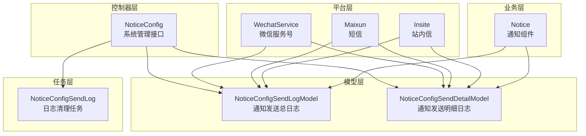
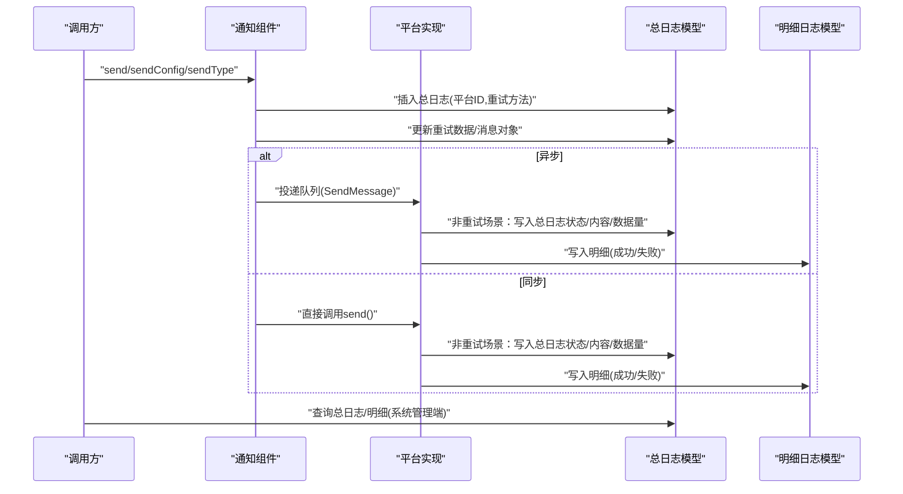
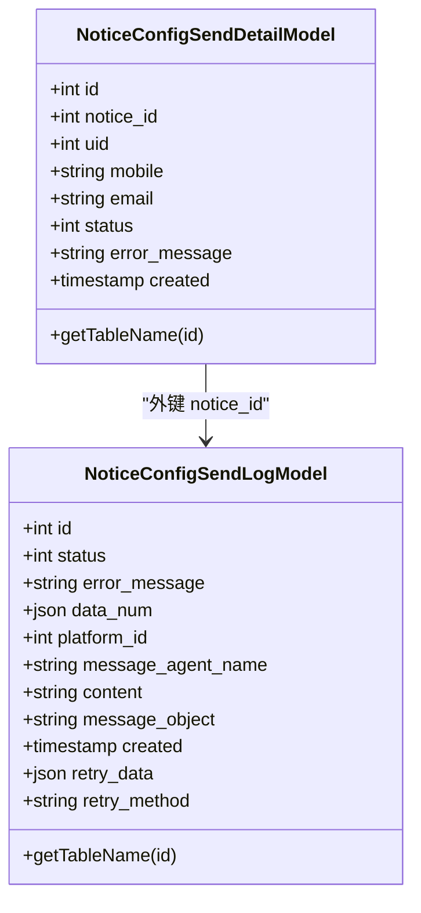
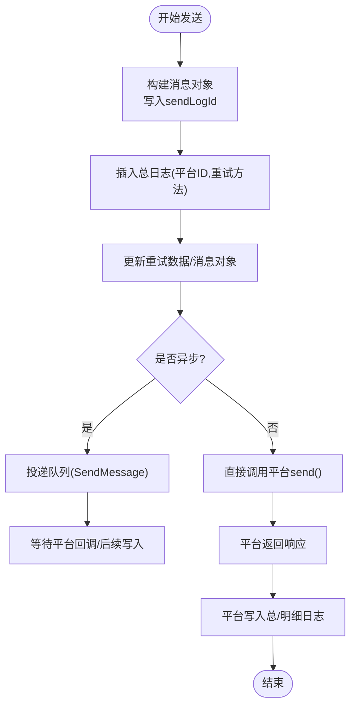
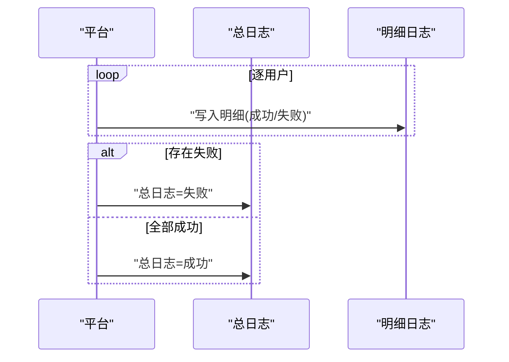
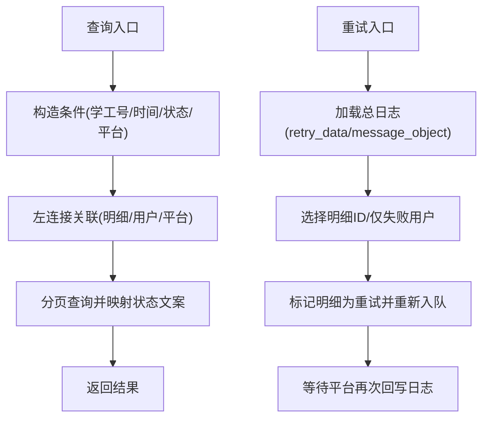
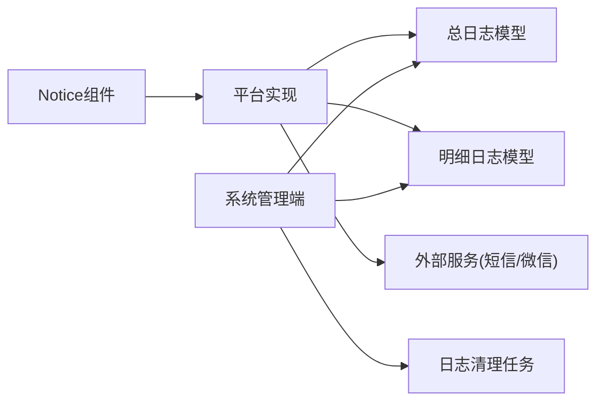

# 通知日志模型

<cite>
**本文引用的文件**
- [NoticeConfigSendLogModel.php](file://process/src/models/NoticeConfigSendLogModel.php)
- [NoticeConfigSendDetailModel.php](file://process/src/models/NoticeConfigSendDetailModel.php)
- [Notice.php](file://process/src/components/Notice.php)
- [NoticeConfig.php](file://process/src/http/system/NoticeConfig.php)
- [NoticeConfigSendLog.php](file://process/src/services/task/NoticeConfigSendLog.php)
- [Insite.php](file://process/src/services/platform/Insite.php)
- [Maixun.php](file://process/src/services/platform/Maixun.php)
- [WechatService.php](file://process/src/services/platform/WechatService.php)
- [ThirdpartyPlatformModel.php](file://process/src/models/ThirdpartyPlatformModel.php)
- [database.sql](file://process/docs/sql/database.sql)
- [migration_20250904_112321_login_config.php](file://process/src/migrations/migration_20250904_112321_login_config.php)
</cite>

## 目录
1. [引言](#引言)
2. [项目结构](#项目结构)
3. [核心组件](#核心组件)
4. [架构总览](#架构总览)
5. [详细组件分析](#详细组件分析)
6. [依赖关系分析](#依赖关系分析)
7. [性能与可靠性考量](#性能与可靠性考量)
8. [故障排查指南](#故障排查指南)
9. [结论](#结论)
10. [附录：查询与分析示例](#附录查询与分析示例)

## 引言
本文件围绕“通知日志模型”展开，系统性解析 NoticeConfigSendLogModel 在消息通知与通信审计中的设计与实现，覆盖以下主题：
- 日志模型的数据结构、字段定义与业务语义
- 不同类型通知（短信、邮件、站内信、微信服务号等）的日志记录机制
- 发送状态追踪、失败重试监控与送达率统计
- 在服务质量监控、合规性审计与用户体验优化中的作用
- 实际可操作的查询与分析路径示例

## 项目结构
通知日志相关的核心代码分布在以下模块：
- 模型层：通知发送总日志与明细日志模型
- 业务层：通知组件负责发起发送并写入日志
- 平台层：各通知平台在发送完成后回写状态与明细
- 控制器层：系统管理端提供日志查询、重试与清理策略配置
- 任务层：定时清理过期日志
- 数据库：DDL 定义与迁移脚本

图表来源
- [Notice.php](file://process/src/components/Notice.php#L150-L218)
- [Insite.php](file://process/src/services/platform/Insite.php#L73-L128)
- [Maixun.php](file://process/src/services/platform/Maixun.php#L69-L112)
- [WechatService.php](file://process/src/services/platform/WechatService.php#L244-L291)
- [NoticeConfig.php](file://process/src/http/system/NoticeConfig.php#L260-L377)
- [NoticeConfigSendLog.php](file://process/src/services/task/NoticeConfigSendLog.php#L1-L25)

章节来源
- [NoticeConfigSendLogModel.php](file://process/src/models/NoticeConfigSendLogModel.php#L1-L55)
- [NoticeConfigSendDetailModel.php](file://process/src/models/NoticeConfigSendDetailModel.php#L1-L46)
- [Notice.php](file://process/src/components/Notice.php#L150-L218)
- [Insite.php](file://process/src/services/platform/Insite.php#L73-L128)
- [Maixun.php](file://process/src/services/platform/Maixun.php#L69-L112)
- [WechatService.php](file://process/src/services/platform/WechatService.php#L244-L291)
- [NoticeConfig.php](file://process/src/http/system/NoticeConfig.php#L260-L377)
- [NoticeConfigSendLog.php](file://process/src/services/task/NoticeConfigSendLog.php#L1-L25)

## 核心组件
- 通知发送总日志模型 NoticeConfigSendLogModel
  - 记录一次发送任务的总体状态、平台来源、消息摘要、重试元数据与序列化的消息对象
  - 关键字段：状态、错误信息、数据数量（含总数、成功数、失败数）、平台ID、消息应用名称、内容、消息对象、重试数据、重试方法
- 通知发送明细日志模型 NoticeConfigSendDetailModel
  - 记录每个接收人的发送结果与错误信息，支持按用户维度追踪
  - 关键字段：所属总日志ID、用户ID、手机号/邮箱、状态、错误信息
- 通知组件 Notice
  - 发起发送流程，生成总日志并写入重试数据与消息对象；异步通过队列执行发送
- 平台实现
  - 站内信 Insite：直接写入总日志成功态与明细成功记录
  - 短信 Maixun：批量发送后写入总日志成功态与明细成功记录
  - 微信服务号 WechatService：逐用户发送，明细记录成功/失败，并汇总写入总日志状态
- 系统管理接口 NoticeConfig
  - 提供通知日志查询、明细查询、重试发送、全局配置与日志保留策略设置
- 日志清理任务 NoticeConfigSendLog
  - 基于全局配置的保留天数，定期删除过期总日志及对应明细

章节来源
- [NoticeConfigSendLogModel.php](file://process/src/models/NoticeConfigSendLogModel.php#L1-L55)
- [NoticeConfigSendDetailModel.php](file://process/src/models/NoticeConfigSendDetailModel.php#L1-L46)
- [Notice.php](file://process/src/components/Notice.php#L150-L218)
- [Insite.php](file://process/src/services/platform/Insite.php#L73-L128)
- [Maixun.php](file://process/src/services/platform/Maixun.php#L69-L112)
- [WechatService.php](file://process/src/services/platform/WechatService.php#L244-L291)
- [NoticeConfig.php](file://process/src/http/system/NoticeConfig.php#L260-L377)
- [NoticeConfigSendLog.php](file://process/src/services/task/NoticeConfigSendLog.php#L1-L25)

## 架构总览
下图展示从“发起发送”到“日志落库与查询”的完整链路。

图表来源
- [Notice.php](file://process/src/components/Notice.php#L150-L218)
- [Insite.php](file://process/src/services/platform/Insite.php#L73-L128)
- [Maixun.php](file://process/src/services/platform/Maixun.php#L69-L112)
- [WechatService.php](file://process/src/services/platform/WechatService.php#L244-L291)
- [NoticeConfig.php](file://process/src/http/system/NoticeConfig.php#L260-L377)

## 详细组件分析

### 总日志模型 NoticeConfigSendLogModel
- 字段与含义
  - 状态：成功/失败
  - 错误信息：异常或平台返回的错误文本
  - 数据数量：包含总条数、成功数、失败数
  - 平台ID：来源平台标识
  - 消息应用名称：消息应用名
  - 内容：发送内容摘要
  - 消息对象：序列化后的消息对象，用于重试
  - 重试数据：包含配置、上下文、是否异步、表单收件人等
  - 重试方法：当前支持的重试策略标识
- 业务语义
  - 作为一次发送任务的聚合视图，承载最终状态与统计信息
  - 与明细日志通过 notice_id 关联，便于按用户粒度追踪

图表来源
- [NoticeConfigSendLogModel.php](file://process/src/models/NoticeConfigSendLogModel.php#L1-L55)
- [NoticeConfigSendDetailModel.php](file://process/src/models/NoticeConfigSendDetailModel.php#L1-L46)

章节来源
- [NoticeConfigSendLogModel.php](file://process/src/models/NoticeConfigSendLogModel.php#L1-L55)

### 明细日志模型 NoticeConfigSendDetailModel
- 字段与含义
  - notice_id：归属的总日志ID
  - uid：用户ID
  - mobile/email：目标联系方式（短信/邮件平台）
  - status：成功/失败/已重试
  - error_message：失败原因
- 业务语义
  - 作为“用户级”观测点，支撑失败重试、重发与统计分析

章节来源
- [NoticeConfigSendDetailModel.php](file://process/src/models/NoticeConfigSendDetailModel.php#L1-L46)

### 通知组件 Notice 的发送与日志写入
- 流程要点
  - 解析配置、过滤用户、生成消息对象
  - 插入总日志并写入重试数据与消息对象
  - 异步通过队列投递；同步直接调用平台 send
  - 平台侧在非重试场景写入总日志状态与明细

图表来源
- [Notice.php](file://process/src/components/Notice.php#L150-L218)

章节来源
- [Notice.php](file://process/src/components/Notice.php#L150-L218)

### 平台实现与日志回写
- 站内信 Insite
  - 直接写入总日志为成功态，明细全部为成功
- 短信 Maixun
  - 批量发送后写入总日志为成功态，明细全部为成功
- 微信服务号 WechatService
  - 逐用户发送，明细记录成功/失败；汇总后写入总日志状态（若有失败则为失败）

图表来源
- [Insite.php](file://process/src/services/platform/Insite.php#L73-L128)
- [Maixun.php](file://process/src/services/platform/Maixun.php#L69-L112)
- [WechatService.php](file://process/src/services/platform/WechatService.php#L244-L291)

章节来源
- [Insite.php](file://process/src/services/platform/Insite.php#L73-L128)
- [Maixun.php](file://process/src/services/platform/Maixun.php#L69-L112)
- [WechatService.php](file://process/src/services/platform/WechatService.php#L244-L291)

### 系统管理端：日志查询、重试与清理
- 日志查询
  - 支持按学工号/姓名关联查询、时间范围、状态、平台ID筛选
  - 返回总日志并附加平台名称与状态文案
- 明细查询
  - 支持按关键字（学工号/姓名）与状态筛选
- 重试发送
  - 支持选择明细ID或仅失败用户进行重发
  - 依据总日志中的重试数据与消息对象重建发送上下文
- 清理策略
  - 通过全局配置设置日志保留天数
  - 定时任务删除过期总日志及其明细

图表来源
- [NoticeConfig.php](file://process/src/http/system/NoticeConfig.php#L260-L377)
- [NoticeConfigSendLog.php](file://process/src/services/task/NoticeConfigSendLog.php#L1-L25)

章节来源
- [NoticeConfig.php](file://process/src/http/system/NoticeConfig.php#L260-L377)
- [NoticeConfigSendLog.php](file://process/src/services/task/NoticeConfigSendLog.php#L1-L25)

### 数据库与迁移
- DDL 与索引
  - 总日志表与明细表结构定义
  - 全局消息配置表与消息日志表（用于对比）
- 迁移脚本
  - 新增重试相关字段（retry_data、retry_method）
  - 创建明细表与变更日志表

章节来源
- [database.sql](file://process/docs/sql/database.sql#L502-L539)
- [migration_20250904_112321_login_config.php](file://process/src/migrations/migration_20250904_112321_login_config.php#L33-L71)

## 依赖关系分析
- 组件耦合
  - 通知组件依赖平台抽象与消息对象工厂
  - 平台实现依赖模型层写入总/明细日志
  - 系统管理端依赖模型层查询与任务层清理
- 外部依赖
  - 平台实现依赖外部服务（短信网关、微信接口），并在交互过程中记录审计日志

图表来源
- [Notice.php](file://process/src/components/Notice.php#L150-L218)
- [Insite.php](file://process/src/services/platform/Insite.php#L73-L128)
- [Maixun.php](file://process/src/services/platform/Maixun.php#L69-L112)
- [WechatService.php](file://process/src/services/platform/WechatService.php#L244-L291)
- [NoticeConfig.php](file://process/src/http/system/NoticeConfig.php#L260-L377)
- [NoticeConfigSendLog.php](file://process/src/services/task/NoticeConfigSendLog.php#L1-L25)

章节来源
- [Notice.php](file://process/src/components/Notice.php#L150-L218)
- [Insite.php](file://process/src/services/platform/Insite.php#L73-L128)
- [Maixun.php](file://process/src/services/platform/Maixun.php#L69-L112)
- [WechatService.php](file://process/src/services/platform/WechatService.php#L244-L291)
- [NoticeConfig.php](file://process/src/http/system/NoticeConfig.php#L260-L377)
- [NoticeConfigSendLog.php](file://process/src/services/task/NoticeConfigSendLog.php#L1-L25)

## 性能与可靠性考量
- 异步发送
  - 通过队列降低主流程阻塞，提升吞吐
- 批量发送
  - 短信平台支持批量发送，减少网络往返
- 重试机制
  - 保存重试数据与消息对象，支持按明细重发
- 清理策略
  - 基于配置的保留天数，避免历史数据膨胀

章节来源
- [Notice.php](file://process/src/components/Notice.php#L199-L218)
- [Maixun.php](file://process/src/services/platform/Maixun.php#L152-L168)
- [NoticeConfig.php](file://process/src/http/system/NoticeConfig.php#L171-L187)
- [NoticeConfigSendLog.php](file://process/src/services/task/NoticeConfigSendLog.php#L1-L25)

## 故障排查指南
- 常见问题定位
  - 总日志状态为失败：检查平台返回与明细错误信息
  - 明细全部失败：核对用户联系方式、平台凭据与限额
  - 重试无效：确认重试数据与消息对象是否正确重建
- 排查步骤
  - 通过系统管理端查询总日志与明细，定位失败用户
  - 触发重试发送，观察平台返回
  - 检查平台实现中的错误处理与日志记录

章节来源
- [NoticeConfig.php](file://process/src/http/system/NoticeConfig.php#L303-L377)
- [WechatService.php](file://process/src/services/platform/WechatService.php#L244-L291)
- [Maixun.php](file://process/src/services/platform/Maixun.php#L69-L112)

## 结论
通知日志模型通过“总日志+明细日志”的双层设计，实现了对通知发送过程的可观测与可追溯。结合平台侧的状态回写、系统管理端的查询与重试、以及定时清理策略，形成了完整的质量保障闭环。该模型在服务质量监控、合规性审计与用户体验优化方面具有明确价值。

## 附录：查询与分析示例
以下示例基于系统管理端接口与模型查询能力，提供可落地的操作路径（以路径代替具体代码）：
- 查询总日志
  - 路径参考：[getNoticeLog](file://process/src/http/system/NoticeConfig.php#L260-L301)
  - 支持条件：学工号、起止时间、状态、平台ID
  - 输出：总日志列表与平台名称、状态文案
- 查询明细
  - 路径参考：[getNoticeLogDetail](file://process/src/http/system/NoticeConfig.php#L303-L334)
  - 支持条件：总日志ID、关键字（学工号/姓名）、状态
  - 输出：明细列表与状态文案
- 重试发送
  - 路径参考：[retrySend](file://process/src/http/system/NoticeConfig.php#L336-L377)
  - 支持方式：按明细ID或仅失败用户重发
  - 依赖：总日志中的重试数据与消息对象
- 清理过期日志
  - 路径参考：[NoticeConfigSendLog](file://process/src/services/task/NoticeConfigSendLog.php#L1-L25)
  - 触发：系统配置保留天数后由定时任务执行

章节来源
- [NoticeConfig.php](file://process/src/http/system/NoticeConfig.php#L260-L377)
- [NoticeConfigSendLog.php](file://process/src/services/task/NoticeConfigSendLog.php#L1-L25)