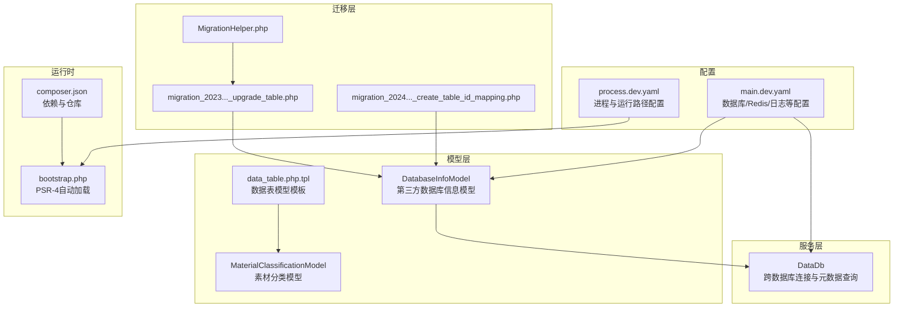
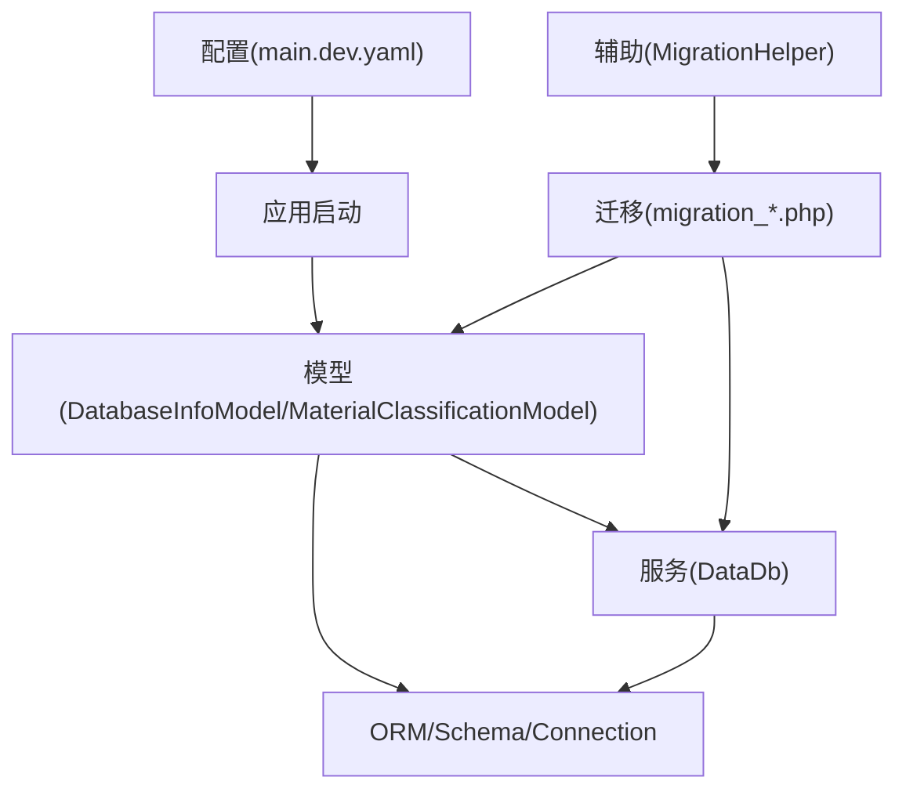
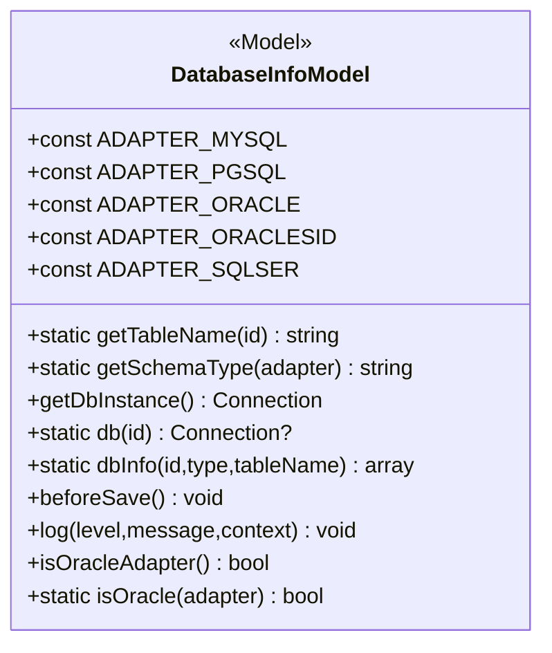
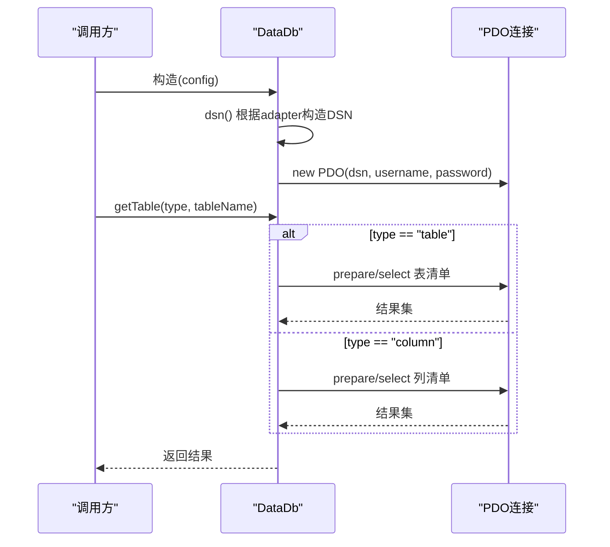
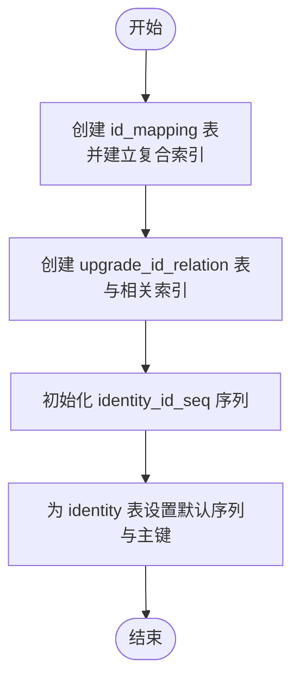
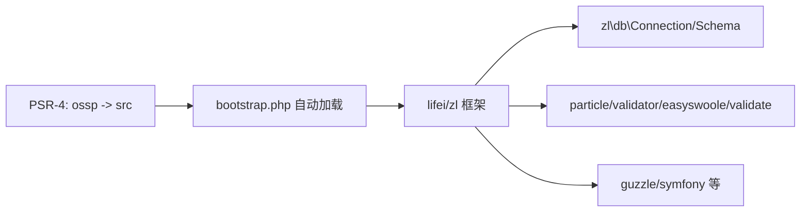

# 数据模型层

<cite>
**本文引用的文件**
- [bootstrap.php](file://process/src/bootstrap.php)
- [composer.json](file://process/composer.json)
- [main.dev.yaml](file://process/src/config/main.dev.yaml)
- [process.dev.yaml](file://process/src/config/process.dev.yaml)
- [DatabaseInfoModel.php](file://process/src/models/DatabaseInfoModel.php)
- [DataDb.php](file://process/src/services/DataDb.php)
- [migration_20240417_create_table_id_mapping.php](file://process/src/migrations/migration_20240417_create_table_id_mapping.php)
- [migration_20231007_093123_upgrade_table.php](file://process/src/migrations/migration_20231007_093123_upgrade_table.php)
- [MigrationHelper.php](file://process/src/helpers/MigrationHelper.php)
- [data_table.php.tpl](file://process/src/commands/data_table.php.tpl)
- [MaterialClassificationModel.php](file://process/src/models/MaterialClassificationModel.php)
</cite>

## 目录
1. [简介](#简介)
2. [项目结构](#项目结构)
3. [核心组件](#核心组件)
4. [架构总览](#架构总览)
5. [详细组件分析](#详细组件分析)
6. [依赖分析](#依赖分析)
7. [性能考虑](#性能考虑)
8. [故障排查指南](#故障排查指南)
9. [结论](#结论)
10. [附录](#附录)

## 简介
本文件聚焦 htdNew 项目的“数据模型层”，系统梳理 ORM 映射关系、数据库连接管理、数据访问层设计、数据验证与事务、并发控制、数据迁移与版本管理、索引与查询优化等主题，并提供可操作的使用示例与扩展建议。内容基于仓库中实际存在的模型、服务、迁移与配置文件进行归纳总结。

## 项目结构
数据模型层主要由以下部分构成：
- 模型层：以 ZL 框架提供的 ORM 基类为基础，定义实体字段、注释、表名与校验逻辑。
- 服务层：封装跨数据库的连接与元数据查询能力，支持 MySQL、PostgreSQL、Oracle、SQL Server 等适配器。
- 迁移层：通过迁移脚本管理数据库结构演进与索引维护。
- 配置层：集中管理数据库连接参数、Redis、队列、日志等运行时配置。
- 自动加载与依赖：Composer PSR-4 自动加载与第三方库集成。

图表来源
- [main.dev.yaml](file://process/src/config/main.dev.yaml#L23-L37)
- [process.dev.yaml](file://process/src/config/process.dev.yaml#L1-L20)
- [DatabaseInfoModel.php](file://process/src/models/DatabaseInfoModel.php#L1-L120)
- [DataDb.php](file://process/src/services/DataDb.php#L1-L60)
- [migration_20240417_create_table_id_mapping.php](file://process/src/migrations/migration_20240417_create_table_id_mapping.php#L1-L26)
- [migration_20231007_093123_upgrade_table.php](file://process/src/migrations/migration_20231007_093123_upgrade_table.php#L1-L30)
- [MigrationHelper.php](file://process/src/helpers/MigrationHelper.php#L1-L38)
- [data_table.php.tpl](file://process/src/commands/data_table.php.tpl#L1-L23)
- [MaterialClassificationModel.php](file://process/src/models/MaterialClassificationModel.php#L1-L26)
- [bootstrap.php](file://process/src/bootstrap.php#L1-L40)
- [composer.json](file://process/composer.json#L1-L20)

章节来源
- [bootstrap.php](file://process/src/bootstrap.php#L1-L40)
- [composer.json](file://process/composer.json#L1-L20)
- [main.dev.yaml](file://process/src/config/main.dev.yaml#L23-L37)
- [process.dev.yaml](file://process/src/config/process.dev.yaml#L1-L20)

## 核心组件
- 数据库连接与适配器
  - 通过配置文件指定数据库连接类与模式类，支持 PostgreSQL、MySQL、Oracle、SQL Server 等。
  - 提供统一的连接实例获取与缓存，避免重复创建。
- 数据模型与 ORM 映射
  - 使用 Schema 类型常量定义字段类型，通过 COLUMNS 与 COMMENTS 描述实体映射与注释。
  - 支持 JSON、字符串数组、时间戳等复杂类型映射。
- 跨数据库服务
  - DataDb 封装 PDO 连接与不同数据库的 DSN 构造，提供统一的查询接口与元数据读取。
- 迁移与版本管理
  - 迁移脚本负责建表、索引创建与序列初始化；辅助工具遍历组件并更新配置。
- 自动加载与依赖
  - Composer PSR-4 与自定义 bootstrap 自动加载结合，确保模型与服务可被正确解析。

章节来源
- [DatabaseInfoModel.php](file://process/src/models/DatabaseInfoModel.php#L1-L120)
- [DataDb.php](file://process/src/services/DataDb.php#L1-L60)
- [migration_20240417_create_table_id_mapping.php](file://process/src/migrations/migration_20240417_create_table_id_mapping.php#L1-L26)
- [migration_20231007_093123_upgrade_table.php](file://process/src/migrations/migration_20231007_093123_upgrade_table.php#L1-L30)
- [MigrationHelper.php](file://process/src/helpers/MigrationHelper.php#L1-L38)
- [bootstrap.php](file://process/src/bootstrap.php#L1-L40)
- [composer.json](file://process/composer.json#L1-L20)

## 架构总览
数据模型层围绕“配置—模型—服务—迁移”四条主线协同工作：
- 配置驱动：main.dev.yaml 定义数据库连接参数与 schemaClass，process.dev.yaml 定义运行路径与进程数量。
- 模型驱动：DatabaseInfoModel 作为第三方数据库信息的入口，MaterialClassificationModel 等具体业务模型描述字段与注释。
- 服务驱动：DataDb 在运行期根据适配器构造 DSN 并执行查询，同时复用 ORM 的查询构建器生成条件。
- 迁移驱动：迁移脚本与辅助工具保障结构演进与配置更新。

图表来源
- [main.dev.yaml](file://process/src/config/main.dev.yaml#L23-L37)
- [DatabaseInfoModel.php](file://process/src/models/DatabaseInfoModel.php#L1-L120)
- [DataDb.php](file://process/src/services/DataDb.php#L1-L60)
- [migration_20240417_create_table_id_mapping.php](file://process/src/migrations/migration_20240417_create_table_id_mapping.php#L1-L26)
- [migration_20231007_093123_upgrade_table.php](file://process/src/migrations/migration_20231007_093123_upgrade_table.php#L1-L30)
- [MigrationHelper.php](file://process/src/helpers/MigrationHelper.php#L1-L38)

## 详细组件分析

### DatabaseInfoModel：第三方数据库信息模型
- 角色定位
  - 统一管理第三方数据库连接配置与适配器类型。
  - 提供 ORM Schema 类型映射、字段注释、保存前校验与连接实例缓存。
- 关键特性
  - 字段定义：包含 id、name、adapter(host/port/username/password/db_name)、可见范围、域、创建者、时间戳等。
  - 适配器映射：将 adapter 值映射到对应 Schema 类，用于 ORM 行为。
  - 连接实例：按需创建并缓存 Connection 实例，支持设置字符集等细节。
  - 元数据查询：根据不同适配器拼装 SQL，查询表与列元数据，兼容 PostgreSQL、MySQL、Oracle、SQL Server。
  - 日志记录：实现 LoggerInterface，在数据库执行日志中记录成功或失败上下文，支持事务后监听写入日志。
- 使用建议
  - 通过静态方法 db() 获取连接，支持默认库与指定 ID 库切换。
  - 使用 dbInfo() 查询远程库的表/列信息，注意不同数据库的命名空间差异（如 Oracle 的 OWNER 前缀）。

图表来源
- [DatabaseInfoModel.php](file://process/src/models/DatabaseInfoModel.php#L1-L120)
- [DatabaseInfoModel.php](file://process/src/models/DatabaseInfoModel.php#L132-L150)
- [DatabaseInfoModel.php](file://process/src/models/DatabaseInfoModel.php#L152-L237)
- [DatabaseInfoModel.php](file://process/src/models/DatabaseInfoModel.php#L258-L321)

章节来源
- [DatabaseInfoModel.php](file://process/src/models/DatabaseInfoModel.php#L1-L120)
- [DatabaseInfoModel.php](file://process/src/models/DatabaseInfoModel.php#L132-L150)
- [DatabaseInfoModel.php](file://process/src/models/DatabaseInfoModel.php#L152-L237)
- [DatabaseInfoModel.php](file://process/src/models/DatabaseInfoModel.php#L258-L321)

### DataDb：跨数据库连接与元数据查询服务
- 角色定位
  - 在运行期根据配置构造不同数据库的 DSN，使用 PDO 执行查询。
  - 提供统一的 all、queryAll、getTable 接口，屏蔽底层差异。
- 关键特性
  - DSN 构造：支持 MySQL、PostgreSQL、Oracle(SID/SERVICE_NAME)、SQL Server 等。
  - 元数据查询：按适配器拼装 SQL，查询表清单与列清单，处理命名空间与注释。
- 使用建议
  - 优先使用 ORM 的 Connection 与 QueryBuilder；DataDb 更适合一次性直连查询或临时迁移场景。
  - 注意参数绑定与 SQL 注入防护，尽量使用预处理语句。

图表来源
- [DataDb.php](file://process/src/services/DataDb.php#L1-L60)
- [DataDb.php](file://process/src/services/DataDb.php#L71-L142)

章节来源
- [DataDb.php](file://process/src/services/DataDb.php#L1-L60)
- [DataDb.php](file://process/src/services/DataDb.php#L71-L142)

### 迁移与版本管理
- 迁移脚本
  - migration_20240417_create_table_id_mapping：创建 id_mapping 表并建立复合索引，支撑本地/远程 ID 映射。
  - migration_20231007_093123_upgrade_table：创建升级关系表、索引与序列，重置主键默认值并添加主键约束。
- 辅助工具
  - MigrationHelper.walkComponents：遍历组件插件配置，按回调修改并回写数据库，便于版本升级时批量调整。

图表来源
- [migration_20240417_create_table_id_mapping.php](file://process/src/migrations/migration_20240417_create_table_id_mapping.php#L1-L26)
- [migration_20231007_093123_upgrade_table.php](file://process/src/migrations/migration_20231007_093123_upgrade_table.php#L1-L30)
- [MigrationHelper.php](file://process/src/helpers/MigrationHelper.php#L1-L38)

章节来源
- [migration_20240417_create_table_id_mapping.php](file://process/src/migrations/migration_20240417_create_table_id_mapping.php#L1-L26)
- [migration_20231007_093123_upgrade_table.php](file://process/src/migrations/migration_20231007_093123_upgrade_table.php#L1-L30)
- [MigrationHelper.php](file://process/src/helpers/MigrationHelper.php#L1-L38)

### 数据模型模板与实体示例
- 模板
  - data_table.php.tpl：用于生成继承 AbstractDataTableModel 的数据表模型，定义主键、列定义与表名。
- 示例
  - MaterialClassificationModel：展示标准模型的 COLUMNS 与 COMMENTS 定义，以及 getTableName 的实现。

章节来源
- [data_table.php.tpl](file://process/src/commands/data_table.php.tpl#L1-L23)
- [MaterialClassificationModel.php](file://process/src/models/MaterialClassificationModel.php#L1-L26)

## 依赖分析
- 自动加载
  - Composer PSR-4 将 ossp 命名空间映射至 src 目录，bootstrap.php 提供额外的命名空间与目录扫描自动加载。
- 外部依赖
  - lifei/zl、lifei/engine：框架与 ORM 基础。
  - doctrine/cache、particle/validator、easyswoole/validate：缓存、验证与工具。
  - guzzlehttp/guzzle、symfony/dom-crawler 等：网络与爬虫工具。
- 数据库相关
  - main.dev.yaml 中 db.class 与 db.schemaClass 指向 zl\db\Connection 与 zl\db\pgsql\Schema，表明 ORM 层以 ZL 框架为核心。

图表来源
- [composer.json](file://process/composer.json#L1-L20)
- [bootstrap.php](file://process/src/bootstrap.php#L1-L40)
- [main.dev.yaml](file://process/src/config/main.dev.yaml#L23-L31)

章节来源
- [composer.json](file://process/composer.json#L1-L20)
- [bootstrap.php](file://process/src/bootstrap.php#L1-L40)
- [main.dev.yaml](file://process/src/config/main.dev.yaml#L23-L31)

## 性能考虑
- 连接与实例
  - DatabaseInfoModel 对连接实例进行缓存，减少重复创建开销；建议在长生命周期进程中复用连接。
- 查询与索引
  - 迁移脚本已为 id_mapping 建立复合索引，建议对高频过滤字段建立合适索引（如 upgrade_id_relation 的 old_id/new_id）。
- ORM 使用
  - 优先使用 ORM 的 QueryBuilder 与分页查询，避免一次性拉取大结果集。
- 日志与事务
  - 数据库执行日志仅记录少量结果，避免日志膨胀；事务完成后异步落盘日志，降低阻塞风险。
- 并发与锁
  - 未见显式行级锁或分布式锁实现；对于高并发写入场景，建议引入悲观锁或乐观锁策略，或在业务层加幂等与重试。

[本节为通用指导，不直接分析具体文件]

## 故障排查指南
- 连接失败
  - 检查 main.dev.yaml 中 db.config 的 host/port/user/password/dbname 是否正确。
  - 确认 schemaClass 与 adapter 匹配，避免类型不一致导致的连接异常。
- 适配器不匹配
  - 若 adapter 与 schemaClass 不一致，ORM 行为可能异常；可通过 DatabaseInfoModel::getSchemaType 获取正确映射。
- 元数据查询异常
  - 不同数据库的命名空间差异（如 Oracle 的 OWNER 前缀），需在查询时拼接 schema 前缀。
- 日志定位
  - DatabaseInfoModel 实现了日志接口，错误上下文会写入调用日志表；可在事务结束后监听事件确保日志落盘。
- 迁移失败
  - 检查迁移脚本是否已在目标环境中执行；必要时回滚并重新执行；使用 MigrationHelper 批量更新配置时注意备份。

章节来源
- [main.dev.yaml](file://process/src/config/main.dev.yaml#L23-L37)
- [DatabaseInfoModel.php](file://process/src/models/DatabaseInfoModel.php#L258-L321)
- [migration_20231007_093123_upgrade_table.php](file://process/src/migrations/migration_20231007_093123_upgrade_table.php#L1-L30)

## 结论
htdNew 的数据模型层以 ZL 框架为核心，结合配置驱动的连接管理、ORM 字段映射与日志记录，提供了对多数据库的良好支持。通过迁移脚本与辅助工具，能够有序地推进结构演进与配置更新。建议在生产环境中进一步完善并发控制、索引策略与监控告警，以提升稳定性与性能。

[本节为总结性内容，不直接分析具体文件]

## 附录

### 数据模型使用示例（步骤指引）
- 获取连接
  - 使用 DatabaseInfoModel::db($id) 获取指定第三方库连接，或使用默认库连接。
- 查询表/列元数据
  - 使用 DatabaseInfoModel::dbInfo($id, 'table'|'column', $tableName) 获取表清单或列清单。
- ORM 写入与校验
  - 在保存前触发 beforeSave，内部进行参数校验；若涉及可见范围，可格式化为角色列表后再入库。
- 迁移与索引
  - 新增表或字段时编写迁移脚本，确保索引与约束同步更新；使用 MigrationHelper 批量更新组件配置。

章节来源
- [DatabaseInfoModel.php](file://process/src/models/DatabaseInfoModel.php#L132-L150)
- [DatabaseInfoModel.php](file://process/src/models/DatabaseInfoModel.php#L152-L237)
- [migration_20240417_create_table_id_mapping.php](file://process/src/migrations/migration_20240417_create_table_id_mapping.php#L1-L26)
- [MigrationHelper.php](file://process/src/helpers/MigrationHelper.php#L1-L38)