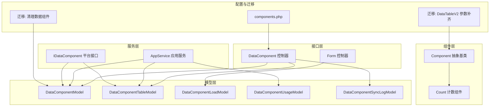
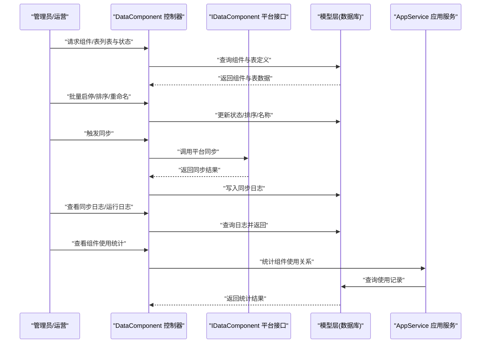
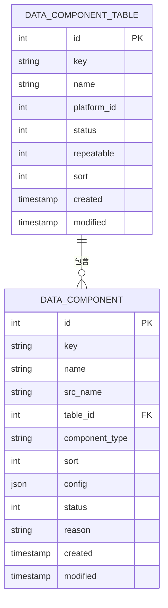
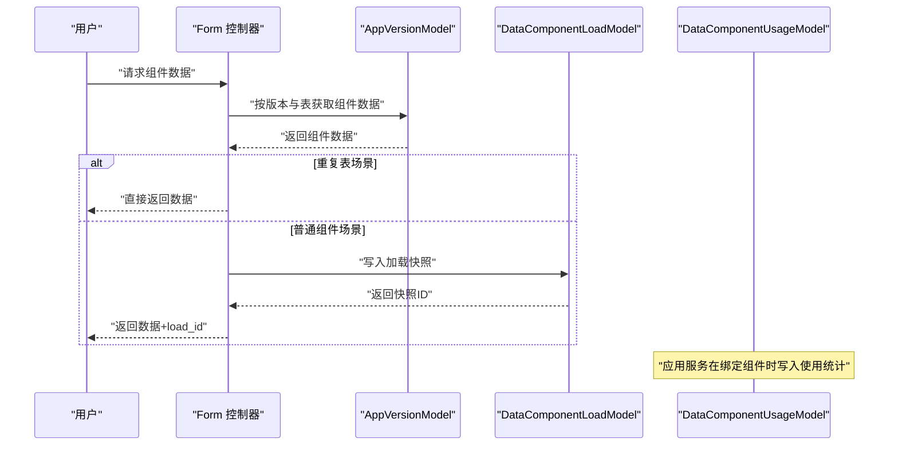
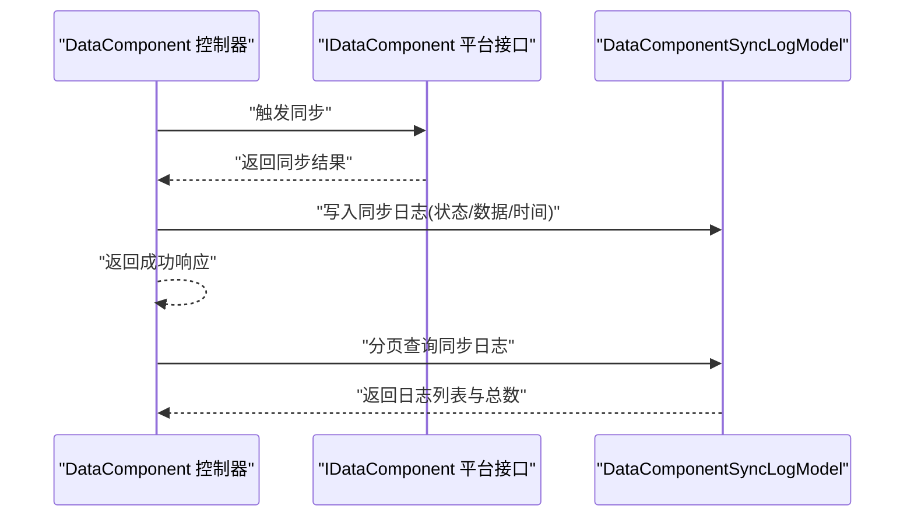
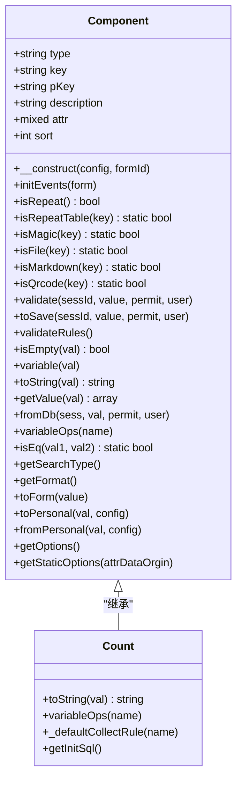
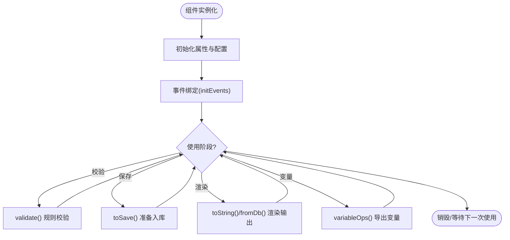
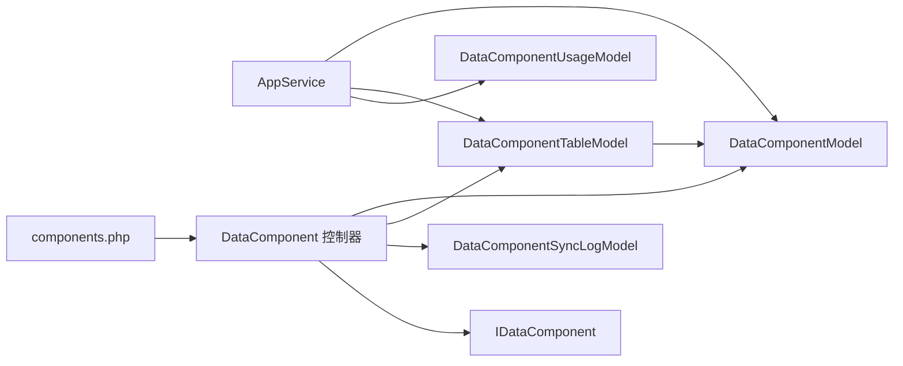

# 数据组件系统

<cite>
**本文引用的文件**
- [DataComponent.php](file://process/src/http/system/DataComponent.php)
- [IDataComponent.php](file://process/src/services/platform/IDataComponent.php)
- [DataComponentModel.php](file://process/src/models/DataComponentModel.php)
- [DataComponentTableModel.php](file://process/src/models/DataComponentTableModel.php)
- [DataComponentLoadModel.php](file://process/src/models/DataComponentLoadModel.php)
- [DataComponentUsageModel.php](file://process/src/models/DataComponentUsageModel.php)
- [DataComponentSyncLogModel.php](file://process/src/models/DataComponentSyncLogModel.php)
- [Form.php](file://process/src/http/site/Form.php)
- [Component.php](file://process/src/modules/form/components/Component.php)
- [Count.php](file://process/src/modules/form/components/Count.php)
- [AppService.php](file://process/src/services/AppService.php)
- [components.php](file://process/src/config/components.php)
- [migration_20240428_173053_clear_data_component_ncut.php](file://process/src/migrations/migration_20240428_173053_clear_data_component_ncut.php)
- [migration_20250710_122240_data_table_api_sync.php](file://process/src/migrations/migration_20250710_122240_data_table_api_sync.php)
- [AppVersion.php](file://process/src/http/system/AppVersion.php)
- [AppVersionModel.php](file://process/src/models/AppVersionModel.php)
</cite>

## 目录
1. [引言](#引言)
2. [项目结构](#项目结构)
3. [核心组件](#核心组件)
4. [架构总览](#架构总览)
5. [详细组件分析](#详细组件分析)
6. [依赖分析](#依赖分析)
7. [性能考虑](#性能考虑)
8. [故障排查指南](#故障排查指南)
9. [结论](#结论)
10. [附录](#附录)

## 引言
本文件面向“数据组件系统”的架构与实现，围绕 DataComponentModel 的组件模型、组件加载机制与使用统计进行深入解析，并扩展到数据组件的分类体系、渲染与交互、生命周期管理、依赖关系、性能优化、自定义开发、模板与样式定制、权限控制、版本管理与兼容性、缓存与懒加载策略以及用户体验优化等主题。文档旨在帮助开发者与产品人员快速理解并高效使用该系统。

## 项目结构
数据组件系统主要由以下层次构成：
- 接口层：系统后台控制器负责组件与表的列表、排序、启停、同步、日志查看等管理操作。
- 服务层：平台接口抽象 IDataComponent，定义组件列表、数据获取与回写能力；应用服务负责组件与应用模块的绑定与使用统计。
- 模型层：数据组件表、数据组件表定义表、组件加载记录表、组件使用统计表、同步日志表等。
- 组件层：表单组件基类与具体组件（如计数组件），提供渲染、校验、变量导出、格式化等能力。
- 配置与迁移：组件运行所需的基础组件配置与数据库迁移脚本。

**图表来源**
- [DataComponent.php](file://process/src/http/system/DataComponent.php#L1-L285)
- [IDataComponent.php](file://process/src/services/platform/IDataComponent.php#L1-L15)
- [DataComponentModel.php](file://process/src/models/DataComponentModel.php#L1-L48)
- [DataComponentTableModel.php](file://process/src/models/DataComponentTableModel.php#L1-L42)
- [DataComponentLoadModel.php](file://process/src/models/DataComponentLoadModel.php#L1-L29)
- [DataComponentUsageModel.php](file://process/src/models/DataComponentUsageModel.php#L1-L31)
- [DataComponentSyncLogModel.php](file://process/src/models/DataComponentSyncLogModel.php#L1-L50)
- [Form.php](file://process/src/http/site/Form.php#L1158-L1226)
- [Component.php](file://process/src/modules/form/components/Component.php#L1-L291)
- [Count.php](file://process/src/modules/form/components/Count.php#L1-L41)
- [components.php](file://process/src/config/components.php#L1-L34)
- [migration_20240428_173053_clear_data_component_ncut.php](file://process/src/migrations/migration_20240428_173053_clear_data_component_ncut.php#L1-L24)
- [migration_20250710_122240_data_table_api_sync.php](file://process/src/migrations/migration_20250710_122240_data_table_api_sync.php#L28-L62)

**章节来源**
- [DataComponent.php](file://process/src/http/system/DataComponent.php#L1-L285)
- [components.php](file://process/src/config/components.php#L1-L34)

## 核心组件
- 数据组件模型 DataComponentModel：描述组件的元信息、类型、配置、状态与时间戳，支持启用/禁用与排序。
- 数据组件表模型 DataComponentTableModel：描述数据表维度的组件集合，支持启用/禁用、排序、可重复性标记。
- 组件加载模型 DataComponentLoadModel：记录用户访问时的组件数据加载快照，便于后续复用或调试。
- 组件使用统计模型 DataComponentUsageModel：记录组件在应用模块中的使用关系，支撑统计与合规审计。
- 同步日志模型 DataComponentSyncLogModel：记录第三方平台同步过程的状态与变更详情。
- 平台接口 IDataComponent：统一平台侧组件清单、数据拉取与回写能力。
- 表单组件基类 Component 与具体组件 Count：提供渲染、校验、变量导出、格式化等通用与特化能力。

**章节来源**
- [DataComponentModel.php](file://process/src/models/DataComponentModel.php#L1-L48)
- [DataComponentTableModel.php](file://process/src/models/DataComponentTableModel.php#L1-L42)
- [DataComponentLoadModel.php](file://process/src/models/DataComponentLoadModel.php#L1-L29)
- [DataComponentUsageModel.php](file://process/src/models/DataComponentUsageModel.php#L1-L31)
- [DataComponentSyncLogModel.php](file://process/src/models/DataComponentSyncLogModel.php#L1-L50)
- [IDataComponent.php](file://process/src/services/platform/IDataComponent.php#L1-L15)
- [Component.php](file://process/src/modules/form/components/Component.php#L1-L291)
- [Count.php](file://process/src/modules/form/components/Count.php#L1-L41)

## 架构总览
数据组件系统采用“模型-服务-接口-组件”分层架构，通过控制器对外暴露管理与数据接口，服务层协调平台与应用模块，模型层持久化数据，组件层负责渲染与交互。

**图表来源**
- [DataComponent.php](file://process/src/http/system/DataComponent.php#L1-L285)
- [IDataComponent.php](file://process/src/services/platform/IDataComponent.php#L1-L15)
- [DataComponentSyncLogModel.php](file://process/src/models/DataComponentSyncLogModel.php#L1-L50)
- [AppService.php](file://process/src/services/AppService.php#L231-L254)

## 详细组件分析

### 数据组件模型与表模型
- DataComponentModel：维护组件的键、名称、来源名称、所属表、类型、排序、配置、状态与时间戳；提供启用/禁用常量与表名。
- DataComponentTableModel：维护表级组件集合的键、名称、平台、状态、可重复性与排序；提供启用/禁用常量与表名。
- 两者通过 table_id 关联，形成“表维度组件集合”的数据结构。

**图表来源**
- [DataComponentModel.php](file://process/src/models/DataComponentModel.php#L1-L48)
- [DataComponentTableModel.php](file://process/src/models/DataComponentTableModel.php#L1-L42)

**章节来源**
- [DataComponentModel.php](file://process/src/models/DataComponentModel.php#L1-L48)
- [DataComponentTableModel.php](file://process/src/models/DataComponentTableModel.php#L1-L42)

### 组件加载与使用统计
- 组件加载记录 DataComponentLoadModel：在用户访问组件数据时写入一次加载快照，便于后续复用与调试。
- 组件使用统计 DataComponentUsageModel：记录组件在应用模块中的使用关系，支撑统计与合规审计。

**图表来源**
- [Form.php](file://process/src/http/site/Form.php#L1158-L1226)
- [DataComponentLoadModel.php](file://process/src/models/DataComponentLoadModel.php#L1-L29)
- [AppService.php](file://process/src/services/AppService.php#L231-L254)

**章节来源**
- [Form.php](file://process/src/http/site/Form.php#L1158-L1226)
- [DataComponentLoadModel.php](file://process/src/models/DataComponentLoadModel.php#L1-L29)
- [AppService.php](file://process/src/services/AppService.php#L231-L254)

### 平台接口与同步流程
- IDataComponent：定义平台侧组件清单、数据获取与回写接口，供系统控制器统一调度。
- DataComponent 控制器提供同步入口与日志查询，配合同步日志模型记录状态与变更。

**图表来源**
- [DataComponent.php](file://process/src/http/system/DataComponent.php#L240-L283)
- [IDataComponent.php](file://process/src/services/platform/IDataComponent.php#L1-L15)
- [DataComponentSyncLogModel.php](file://process/src/models/DataComponentSyncLogModel.php#L1-L50)

**章节来源**
- [DataComponent.php](file://process/src/http/system/DataComponent.php#L240-L283)
- [IDataComponent.php](file://process/src/services/platform/IDataComponent.php#L1-L15)
- [DataComponentSyncLogModel.php](file://process/src/models/DataComponentSyncLogModel.php#L1-L50)

### 表单组件基类与渲染逻辑
- Component 抽象基类：提供组件通用能力，包括构造、事件初始化、类型判定（重复表、魔术控件、文件/图片/二维码/Markdown）、校验、空值判断、变量导出、格式化、选项获取等。
- Count 计数组件：示例组件，提供字符串化、变量导出规则与默认采集规则等。

**图表来源**
- [Component.php](file://process/src/modules/form/components/Component.php#L1-L291)
- [Count.php](file://process/src/modules/form/components/Count.php#L1-L41)

**章节来源**
- [Component.php](file://process/src/modules/form/components/Component.php#L1-L291)
- [Count.php](file://process/src/modules/form/components/Count.php#L1-L41)

### 组件分类体系与交互行为
- 分类依据：
  - 重复表类：RepeatTable、RepeatTablePlus、DataTable、DataTableV2、DetailSharing、ApprovalLinkage、Collaboration 等，支持多行重复输入。
  - 魔术控件类：ShowHide、Alert、DataSource、Validate、Conversion、Variate、OcrV2 等，提供特殊交互与联动能力。
  - 文件/图片/二维码/Markdown 类：File_*、Image_*、Avatar_*、Qrcode*、Markdown* 等，提供媒体与富文本能力。
- 交互行为：
  - 校验：必填、规则校验、空值判断。
  - 渲染：toString、fromDb、toForm、toPersonal/fromPersonal。
  - 变量导出：variableOps 提供表达式与变量映射，便于流程引擎使用。
  - 选项来源：支持静态 options 或字典映射 mapId。

**章节来源**
- [Component.php](file://process/src/modules/form/components/Component.php#L35-L117)
- [Component.php](file://process/src/modules/form/components/Component.php#L196-L204)
- [Component.php](file://process/src/modules/form/components/Component.php#L229-L248)
- [Component.php](file://process/src/modules/form/components/Component.php#L250-L288)

### 生命周期管理与依赖关系
- 生命周期：
  - 初始化：构造函数注入 key/pKey/type/attr/sort。
  - 事件绑定：initEvents 在表单构建阶段注册事件。
  - 使用期：validate/校验、toSave/保存、toString/渲染、variableOps/变量导出。
- 依赖关系：
  - 组件依赖 Attr 配置（含 options/mapId 等）。
  - 应用服务在绑定组件时检查重复表与非重复表的约束，并写入使用统计。
  - 控制器依赖模型与平台接口完成管理与同步。

**图表来源**
- [Component.php](file://process/src/modules/form/components/Component.php#L1-L291)
- [AppService.php](file://process/src/services/AppService.php#L231-L254)

**章节来源**
- [Component.php](file://process/src/modules/form/components/Component.php#L1-L291)
- [AppService.php](file://process/src/services/AppService.php#L231-L254)

### 权限控制、版本管理与兼容性
- 权限控制：
  - 管理端接口使用注解鉴权（如超级管理员），限制对组件/表启停、排序、重命名、同步、日志查看等操作。
- 版本管理：
  - 应用版本模型 AppVersionModel 负责版本缓存与组件对象获取；应用服务在绑定组件时记录使用统计。
- 兼容性处理：
  - 迁移脚本对历史数据进行补全与修正，例如为 DataTableV2 组件补齐安全参数结构，确保新旧版本兼容。

**章节来源**
- [DataComponent.php](file://process/src/http/system/DataComponent.php#L170-L206)
- [AppVersionModel.php](file://process/src/models/AppVersionModel.php#L1-L48)
- [AppService.php](file://process/src/services/AppService.php#L231-L254)
- [migration_20250710_122240_data_table_api_sync.php](file://process/src/migrations/migration_20250710_122240_data_table_api_sync.php#L28-L62)

### 缓存机制、懒加载与用户体验优化
- 缓存机制：
  - 应用版本与部分配置通过缓存键工具进行缓存，减少重复查询开销。
- 懒加载策略：
  - 组件数据按需加载，普通组件场景写入加载快照以便后续复用；重复表场景可直接返回数据。
- 用户体验优化：
  - 控制器提供分页查询日志接口，便于定位问题。
  - 组件渲染与变量导出遵循统一规范，降低前端适配成本。

**章节来源**
- [Form.php](file://process/src/http/site/Form.php#L1158-L1226)
- [DataComponent.php](file://process/src/http/system/DataComponent.php#L266-L283)
- [AppVersionModel.php](file://process/src/models/AppVersionModel.php#L1-L48)

### 自定义开发、模板系统与样式定制
- 自定义开发：
  - 新增组件：继承 Component 抽象类，实现必要的渲染、校验、变量导出方法；在构造函数中读取 Attr 配置。
  - 选项来源：支持静态 options 或字典映射 mapId，便于统一管理。
- 模板系统与样式定制：
  - 组件通过 toString/fromDb/toForm 等方法输出结构化数据，前端可基于这些数据进行模板渲染与样式定制。
  - 组件基类提供 getOptions/getStaticOptions，便于在不同上下文（后端/前端）共享选项数据。

**章节来源**
- [Component.php](file://process/src/modules/form/components/Component.php#L1-L291)
- [Count.php](file://process/src/modules/form/components/Count.php#L1-L41)

## 依赖分析
- 组件与表的依赖：DataComponentModel 依赖 DataComponentTableModel 的 table_id。
- 应用与组件的依赖：AppService 在绑定组件时检查重复表约束，并写入 DataComponentUsageModel。
- 控制器与平台的依赖：DataComponent 控制器依赖 IDataComponent 执行同步与日志查询。
- 配置与组件：components.php 提供基础组件（缓存、队列、通知、Redis 等）配置，供系统运行时使用。

**图表来源**
- [DataComponentModel.php](file://process/src/models/DataComponentModel.php#L1-L48)
- [DataComponentTableModel.php](file://process/src/models/DataComponentTableModel.php#L1-L42)
- [DataComponentUsageModel.php](file://process/src/models/DataComponentUsageModel.php#L1-L31)
- [DataComponentSyncLogModel.php](file://process/src/models/DataComponentSyncLogModel.php#L1-L50)
- [DataComponent.php](file://process/src/http/system/DataComponent.php#L1-L285)
- [IDataComponent.php](file://process/src/services/platform/IDataComponent.php#L1-L15)
- [components.php](file://process/src/config/components.php#L1-L34)

**章节来源**
- [DataComponentModel.php](file://process/src/models/DataComponentModel.php#L1-L48)
- [DataComponentTableModel.php](file://process/src/models/DataComponentTableModel.php#L1-L42)
- [DataComponentUsageModel.php](file://process/src/models/DataComponentUsageModel.php#L1-L31)
- [DataComponentSyncLogModel.php](file://process/src/models/DataComponentSyncLogModel.php#L1-L50)
- [DataComponent.php](file://process/src/http/system/DataComponent.php#L1-L285)
- [IDataComponent.php](file://process/src/services/platform/IDataComponent.php#L1-L15)
- [components.php](file://process/src/config/components.php#L1-L34)

## 性能考虑
- 查询优化：通过索引字段（如 table_id、status、sort）与条件过滤减少扫描范围；列表接口按类型与关键字筛选。
- 缓存利用：应用版本与配置使用缓存，避免重复查询；组件选项通过字典缓存获取。
- 写入优化：组件加载快照按用户与表维度聚合，减少冗余写入；同步日志采用 JSON 字段存储结构化数据，便于后续解析。
- 迁移与兼容：通过迁移脚本对历史数据进行结构化补齐，降低运行期分支判断成本。

[本节为通用指导，无需列出具体文件来源]

## 故障排查指南
- 同步失败排查：
  - 查看同步日志列表，确认状态与时间；定位失败原因并重试。
- 组件/表状态异常：
  - 检查组件/表状态与排序；必要时重新排序或重命名。
- 组件使用统计异常：
  - 核对应用模块与组件绑定关系，确认重复表与非重复表约束是否满足。
- 加载数据缺失：
  - 检查 DataComponentLoadModel 中是否存在对应用户的加载快照；核对 Form 控制器的数据返回路径。

**章节来源**
- [DataComponent.php](file://process/src/http/system/DataComponent.php#L240-L283)
- [DataComponentSyncLogModel.php](file://process/src/models/DataComponentSyncLogModel.php#L1-L50)
- [AppService.php](file://process/src/services/AppService.php#L231-L254)
- [Form.php](file://process/src/http/site/Form.php#L1158-L1226)

## 结论
数据组件系统通过清晰的模型分层、统一的平台接口与完善的统计与日志机制，实现了组件的全生命周期管理。结合迁移脚本与缓存策略，系统在保证兼容性的同时提升了性能与可维护性。开发者可基于组件基类快速扩展自定义组件，并通过统一的渲染与变量导出接口，实现前后端一致的交互体验。

## 附录
- 数据库清理迁移：在特定环境执行清理，确保测试与演示环境的一致性。
- DataTableV2 参数补齐：迁移脚本自动补齐安全参数结构，提升安全性与一致性。

**章节来源**
- [migration_20240428_173053_clear_data_component_ncut.php](file://process/src/migrations/migration_20240428_173053_clear_data_component_ncut.php#L1-L24)
- [migration_20250710_122240_data_table_api_sync.php](file://process/src/migrations/migration_20250710_122240_data_table_api_sync.php#L28-L62)