# 数据表单模型

<cite>
**本文引用的文件**
- [DataTableModel.php](file://process/src/models/DataTableModel.php)
- [AbstractDataTableModel.php](file://process/src/models/AbstractDataTableModel.php)
- [FormDataModel.php](file://process/src/models/FormDateModel.php)
- [FormTemplateModel.php](file://process/src/models/FormTemplateModel.php)
- [Component.php](file://process/src/modules/form/components/Component.php)
- [RepeatTable.php](file://process/src/modules/form/components/RepeatTable.php)
- [Validate.php](file://process/src/modules/form/components/Validate.php)
- [Compliance.php](file://process/src/modules/form/components/Compliance.php)
- [MultipleFill.php](file://process/src/modules/form/components/MultipleFill.php)
- [Form.php](file://process/src/modules/Form.php)
- [DataTable.php（系统接口）](file://process/src/http/system/DataTable.php)
- [BatchV2.php](file://process/src/http/site/BatchV2.php)
- [ExcelImportExportService.php](file://process/src/services/desktopManage/ExcelImportExportService.php)
- [BatchTask.php](file://process/src/services/task/BatchTask.php)
- [migration_20240520_100331_form_template.php](file://process/src/migrations/migration_20240520_100331_form_template.php)
- [migration_20250529_form_template.php](file://process/src/migrations/migration_20250529_form_template.php)
- [migration_20251215_112211_data_table_field_format.php](file://process/src/migrations/migration_20251215_112211_data_table_field_format.php)
- [DataTableFieldWeigetModel.php](file://process/src/models/DataTableFieldWeigetModel.php)
</cite>

## 目录
1. [简介](#简介)
2. [项目结构](#项目结构)
3. [核心组件](#核心组件)
4. [架构总览](#架构总览)
5. [详细组件分析](#详细组件分析)
6. [依赖关系分析](#依赖关系分析)
7. [性能考量](#性能考量)
8. [故障排查指南](#故障排查指南)
9. [结论](#结论)
10. [附录](#附录)

## 简介
本文件聚焦于动态表单系统中的“数据表单模型”，系统性梳理数据表模型、表单数据模型、数据组件模型的设计与实现，涵盖表单字段定义、组件渲染与数据验证机制、版本管理与模板系统、数据迁移策略、表单设计器数据结构、字段类型与布局配置、表单查询、数据导出与批量操作、以及数据权限控制与字段级安全机制。文档以代码为依据，通过可视化图表与分层讲解，帮助读者快速理解并高效使用该模型体系。

## 项目结构
围绕数据表单模型的关键目录与文件如下：
- 模型层
  - 数据表模型：[DataTableModel.php](file://process/src/models/DataTableModel.php)
  - 抽象数据表模型：[AbstractDataTableModel.php](file://process/src/models/AbstractDataTableModel.php)
  - 表单数据模型：[FormDataModel.php](file://process/src/models/FormDateModel.php)
  - 表单模板模型：[FormTemplateModel.php](file://process/src/models/FormTemplateModel.php)
  - 数据采集字段权重模型：[DataTableFieldWeigetModel.php](file://process/src/models/DataTableFieldWeigetModel.php)
- 组件层
  - 表单组件基类：[Component.php](file://process/src/modules/form/components/Component.php)
  - 重复表组件：[RepeatTable.php](file://process/src/modules/form/components/RepeatTable.php)
  - 校验组件：[Validate.php](file://process/src/modules/form/components/Validate.php)
  - 合规组件：[Compliance.php](file://process/src/modules/form/components/Compliance.php)
  - 多填组件：[MultipleFill.php](file://process/src/modules/form/components/MultipleFill.php)
- 模块层
  - 表单模块：[Form.php](file://process/src/modules/Form.php)
- 接口与服务
  - 系统接口（数据表）：[DataTable.php（系统接口）](file://process/src/http/system/DataTable.php)
  - 批量接口（站点）：[BatchV2.php](file://process/src/http/site/BatchV2.php)
  - Excel导入导出服务：[ExcelImportExportService.php](file://process/src/services/desktopManage/ExcelImportExportService.php)
  - 批量任务执行：[BatchTask.php](file://process/src/services/task/BatchTask.php)
- 迁移脚本
  - 表单模板迁移：[migration_20240520_100331_form_template.php](file://process/src/migrations/migration_20240520_100331_form_template.php)、[migration_20250529_form_template.php](file://process/src/migrations/migration_20250529_form_template.php)
  - 数据表字段格式迁移：[migration_20251215_112211_data_table_field_format.php](file://process/src/migrations/migration_20251215_112211_data_table_field_format.php)

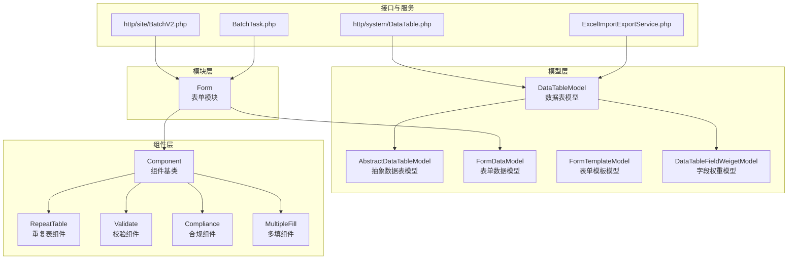

**图表来源**
- [DataTableModel.php](file://process/src/models/DataTableModel.php#L1-L200)
- [Component.php](file://process/src/modules/form/components/Component.php#L1-L120)
- [RepeatTable.php](file://process/src/modules/form/components/RepeatTable.php#L1-L48)
- [Validate.php](file://process/src/modules/form/components/Validate.php#L1-L20)
- [Compliance.php](file://process/src/modules/form/components/Compliance.php#L1-L35)
- [MultipleFill.php](file://process/src/modules/form/components/MultipleFill.php#L49-L62)
- [Form.php](file://process/src/modules/Form.php#L1-L120)
- [FormDataModel.php](file://process/src/models/FormDateModel.php#L1-L90)
- [FormTemplateModel.php](file://process/src/models/FormTemplateModel.php#L1-L57)
- [DataTableFieldWeigetModel.php](file://process/src/models/DataTableFieldWeigetModel.php#L1-L35)
- [DataTable.php（系统接口）](file://process/src/http/system/DataTable.php#L2200-L2230)
- [BatchV2.php](file://process/src/http/site/BatchV2.php#L257-L289)
- [ExcelImportExportService.php](file://process/src/services/desktopManage/ExcelImportExportService.php#L2589-L2614)
- [BatchTask.php](file://process/src/services/task/BatchTask.php#L40-L65)

**章节来源**
- [DataTableModel.php](file://process/src/models/DataTableModel.php#L1-L200)
- [Component.php](file://process/src/modules/form/components/Component.php#L1-L120)
- [Form.php](file://process/src/modules/Form.php#L1-L120)

## 核心组件
- 数据表模型（DataTableModel）
  - 定义数据集的字段类型、展示格式、搜索类型、权限位、内置字段与默认字段集合，提供版本化运行时模型生成与清理机制，支持字段唯一性、采集规则维护与默认数据集设置。
  - 关键职责：字段配置解析、类型与格式常量、内置字段、版本生成与清理、默认数据集管理、权限与来源标识。
- 抽象数据表模型（AbstractDataTableModel）
  - 在保存前对特定格式字段进行统一转换（如人员搜索字段），并在读取时还原为标准对象，保障前后端交互一致性。
- 表单数据模型（FormDataModel）
  - 存储会话维度下的表单数据JSON，提供按会话查找、保存变更对比、并发保护等能力。
- 表单模板模型（FormTemplateModel）
  - 存储表单模板元数据，含名称、类型、配置与创建者，并在保存前进行参数校验与重名校验。
- 组件模型（Component 及其派生）
  - 组件基类负责字段验证、序列化、空值判定、选项映射、变量运算等；重复表组件支持子控件保存后事件联动；校验组件支持外部API校验；合规组件提供字段级变量操作；多填组件支持必填联动校验。
- 表单模块（Form）
  - 负责组件初始化、权限上下文注入、表单数据获取与保存数据过滤、必填与权限校验、事件监听注册与重复表子控件初始化。

**章节来源**
- [DataTableModel.php](file://process/src/models/DataTableModel.php#L1-L200)
- [AbstractDataTableModel.php](file://process/src/models/AbstractDataTableModel.php#L1-L84)
- [FormDataModel.php](file://process/src/models/FormDateModel.php#L1-L90)
- [FormTemplateModel.php](file://process/src/models/FormTemplateModel.php#L1-L57)
- [Component.php](file://process/src/modules/form/components/Component.php#L1-L200)
- [RepeatTable.php](file://process/src/modules/form/components/RepeatTable.php#L1-L48)
- [Validate.php](file://process/src/modules/form/components/Validate.php#L1-L20)
- [Compliance.php](file://process/src/modules/form/components/Compliance.php#L1-L35)
- [MultipleFill.php](file://process/src/modules/form/components/MultipleFill.php#L49-L62)
- [Form.php](file://process/src/modules/Form.php#L1-L200)

## 架构总览
下图展示了从表单提交到数据持久化的整体流程，包括字段验证、权限过滤、组件事件与数据表模型生成。

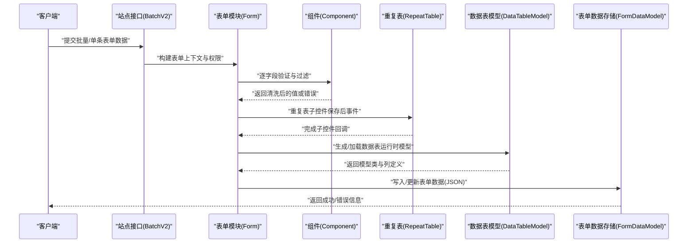

**图表来源**
- [BatchV2.php](file://process/src/http/site/BatchV2.php#L257-L289)
- [Form.php](file://process/src/modules/Form.php#L120-L200)
- [Component.php](file://process/src/modules/form/components/Component.php#L90-L140)
- [RepeatTable.php](file://process/src/modules/form/components/RepeatTable.php#L25-L48)
- [DataTableModel.php](file://process/src/models/DataTableModel.php#L540-L640)
- [FormDataModel.php](file://process/src/models/FormDateModel.php#L1-L90)

## 详细组件分析

### 数据表模型（DataTableModel）
- 字段类型与格式
  - 类型常量：字符串、整型、数组、数值、时间戳、文件等。
  - 展示格式：输入框、单选/多选、选择器、日期/时间、图片/文件、人员搜索等。
  - 搜索类型：等于、模糊、日期、日期范围、数值范围等。
- 内置字段与默认字段
  - 普通数据集内置字段覆盖申请编号、申请人、部门、时间、状态等；个人数据集、共享表、明细表分别有对应内置字段与权限位。
- 版本管理与运行时模型
  - 通过版本ID组合表ID与修改时间生成唯一类名，动态生成运行时模型文件，支持清理过期文件。
- 权限与来源
  - 字段级权限位（可写/只读/隐藏），来源后缀区分个人桌面、应用、同步、管理等场景。
- 默认数据集与采集规则
  - 支持为默认数据集快速添加字段，维护采集规则与字段名称一致性。

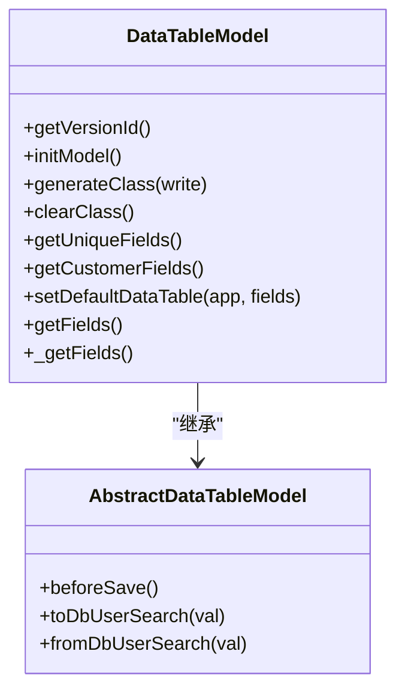

**图表来源**
- [DataTableModel.php](file://process/src/models/DataTableModel.php#L520-L640)
- [AbstractDataTableModel.php](file://process/src/models/AbstractDataTableModel.php#L1-L84)

**章节来源**
- [DataTableModel.php](file://process/src/models/DataTableModel.php#L1-L200)
- [DataTableModel.php](file://process/src/models/DataTableModel.php#L520-L640)
- [DataTableModel.php](file://process/src/models/DataTableModel.php#L640-L800)
- [AbstractDataTableModel.php](file://process/src/models/AbstractDataTableModel.php#L1-L84)

### 表单数据模型（FormDataModel）
- 结构与约束
  - 会话ID、表单ID、表单版本ID、创建者、创建时间与JSON数据体。
- 并发与变更追踪
  - 提供按会话锁定查询、保存前后字段差异计算、分区索引优化。
- 使用场景
  - 与表单模块协同，支撑表单数据的读取、更新与变更审计。

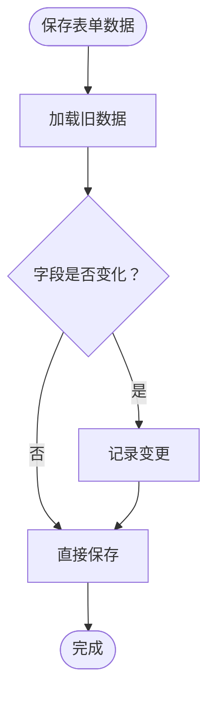

**图表来源**
- [FormDataModel.php](file://process/src/models/FormDateModel.php#L60-L90)

**章节来源**
- [FormDataModel.php](file://process/src/models/FormDateModel.php#L1-L90)

### 表单模板模型（FormTemplateModel）
- 功能要点
  - 模板名称、类型、配置与创建者，保存前参数校验与重名校验。
- 迁移策略
  - 通过迁移脚本创建/升级模板表结构，确保字段与约束一致。

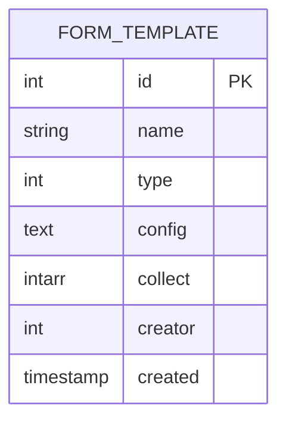

**图表来源**
- [FormTemplateModel.php](file://process/src/models/FormTemplateModel.php#L1-L57)

**章节来源**
- [FormTemplateModel.php](file://process/src/models/FormTemplateModel.php#L1-L57)
- [migration_20240520_100331_form_template.php](file://process/src/migrations/migration_20240520_100331_form_template.php)
- [migration_20250529_form_template.php](file://process/src/migrations/migration_20250529_form_template.php)

### 组件模型（Component 及派生）
- 组件基类（Component）
  - 统一验证、空值判断、序列化、选项映射、变量运算、绑定数据、前后端转换等。
- 重复表（RepeatTable）
  - 支持子控件保存后事件聚合调用，按行遍历并触发子控件的afterSave。
- 校验（Validate）
  - 支持外部API校验入口（类型为API且存在api_id时）。
- 合规（Compliance）
  - 提供字段级变量操作（完整信息、选项值、选项名称）。
- 多填（MultipleFill）
  - 在部分字段为空时，若其他兄弟字段有值则返回必填错误，保证多填一致性。

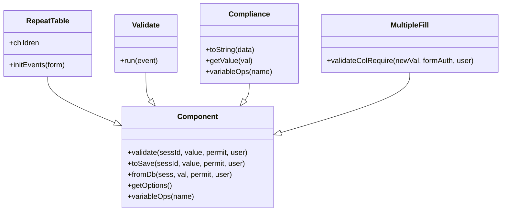

**图表来源**
- [Component.php](file://process/src/modules/form/components/Component.php#L90-L200)
- [RepeatTable.php](file://process/src/modules/form/components/RepeatTable.php#L1-L48)
- [Validate.php](file://process/src/modules/form/components/Validate.php#L1-L20)
- [Compliance.php](file://process/src/modules/form/components/Compliance.php#L1-L35)
- [MultipleFill.php](file://process/src/modules/form/components/MultipleFill.php#L49-L62)

**章节来源**
- [Component.php](file://process/src/modules/form/components/Component.php#L1-L200)
- [RepeatTable.php](file://process/src/modules/form/components/RepeatTable.php#L1-L48)
- [Validate.php](file://process/src/modules/form/components/Validate.php#L1-L20)
- [Compliance.php](file://process/src/modules/form/components/Compliance.php#L1-L35)
- [MultipleFill.php](file://process/src/modules/form/components/MultipleFill.php#L49-L62)

### 表单模块（Form）
- 组件初始化与事件
  - 解析插件配置，构建组件对象，建立重复表与其子控件关系，注册事件监听。
- 数据获取与保存
  - 注入权限上下文，按权限过滤字段，调用组件fromDb与defaultValue，支持暂存时不校验必填。
  - 保存阶段过滤无写权限字段，逐字段验证，重复表子控件特殊校验，异常聚合抛出。
- 变量解析
  - 支持从会话表单数据中解析变量，用于流程条件判断。

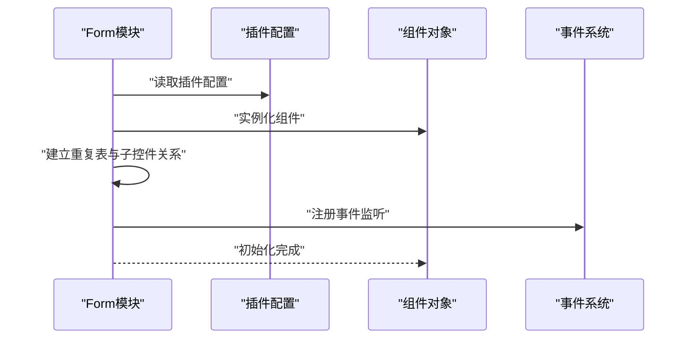

**图表来源**
- [Form.php](file://process/src/modules/Form.php#L200-L320)

**章节来源**
- [Form.php](file://process/src/modules/Form.php#L1-L200)
- [Form.php](file://process/src/modules/Form.php#L200-L320)

### 表单设计器数据结构与布局配置
- 设计器数据结构
  - 插件类型、键名、描述、属性、排序等构成组件配置；重复表组件支持children与pKey关联。
- 布局与字段映射
  - 系统接口中将组件的data_table_id、data_table_field、selectiveData、filterConditions、sortPlugins等映射到结果，支持子表字段与字段转换映射。

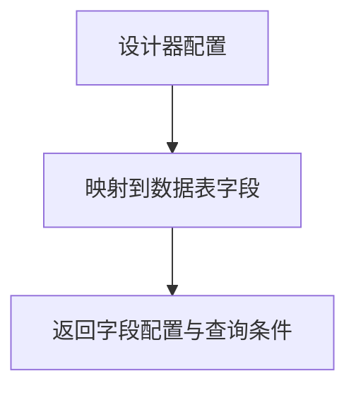

**图表来源**
- [DataTable.php（系统接口）](file://process/src/http/system/DataTable.php#L2212-L2227)

**章节来源**
- [DataTable.php（系统接口）](file://process/src/http/system/DataTable.php#L2212-L2227)

### 字段类型与格式
- 字段类型
  - 字符串、整型、数组、数值、时间戳、日期、文件等。
- 展示格式
  - 输入、文本域、URL、图片、多图、文件、单选、多选、选择器、日期/时间、年/年月、工号、人员搜索、文本年/月/日/时间/时间等。
- 搜索类型
  - 等于、模糊、日期、日期范围、数值范围等。

**章节来源**
- [DataTableModel.php](file://process/src/models/DataTableModel.php#L420-L480)

### 数据验证机制
- 必填校验
  - 组件基类根据权限位判断必填，空值返回必填错误。
- 自定义规则
  - 组件可扩展validateRules，返回错误信息。
- 重复表子控件
  - 重复表组件在保存后事件中对子控件进行afterSave调用，支持联动处理。
- 异常聚合
  - 表单模块聚合验证错误，抛出统一异常。

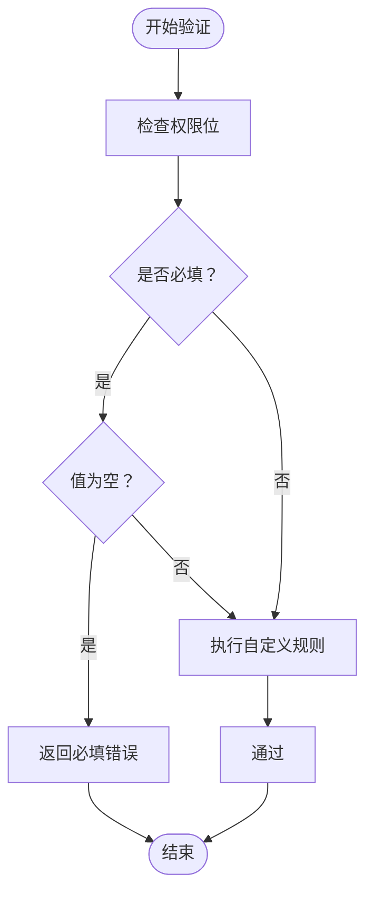

**图表来源**
- [Component.php](file://process/src/modules/form/components/Component.php#L90-L140)
- [RepeatTable.php](file://process/src/modules/form/components/RepeatTable.php#L25-L48)
- [Form.php](file://process/src/modules/Form.php#L120-L200)

**章节来源**
- [Component.php](file://process/src/modules/form/components/Component.php#L90-L140)
- [RepeatTable.php](file://process/src/modules/form/components/RepeatTable.php#L25-L48)
- [Form.php](file://process/src/modules/Form.php#L120-L200)

### 版本管理与模板系统
- 数据表模型版本
  - 通过getVersionId组合表ID与修改时间，生成运行时模型类名，动态生成并清理过期文件。
- 表单模板
  - 模板模型提供名称、类型、配置与创建者字段，迁移脚本确保表结构一致。
- 字段格式迁移
  - 迁移脚本维护字段格式兼容性，避免历史字段格式导致的渲染或存储问题。

**章节来源**
- [DataTableModel.php](file://process/src/models/DataTableModel.php#L520-L640)
- [FormTemplateModel.php](file://process/src/models/FormTemplateModel.php#L1-L57)
- [migration_20251215_112211_data_table_field_format.php](file://process/src/migrations/migration_20251215_112211_data_table_field_format.php)

### 数据迁移策略
- 表单模板
  - 通过迁移脚本创建/升级模板表，确保字段与约束一致。
- 字段格式
  - 通过迁移脚本修正字段格式，保障历史数据与新格式兼容。

**章节来源**
- [migration_20240520_100331_form_template.php](file://process/src/migrations/migration_20240520_100331_form_template.php)
- [migration_20250529_form_template.php](file://process/src/migrations/migration_20250529_form_template.php)
- [migration_20251215_112211_data_table_field_format.php](file://process/src/migrations/migration_20251215_112211_data_table_field_format.php)

### 表单查询、数据导出与批量操作
- 查询字段映射
  - 站点接口在批量查询中，将组件的format与searchType映射为可见与可搜索标志，生成字段键名并过滤不可见/不可搜字段。
- 数据导出
  - Excel导入导出服务对处理后的数据进行去重检查与错误标记，支持字段级权限与范围权限控制。
- 批量任务
  - 批量任务执行捕获表单验证异常，统计忽略、成功、失败数量并回写状态。

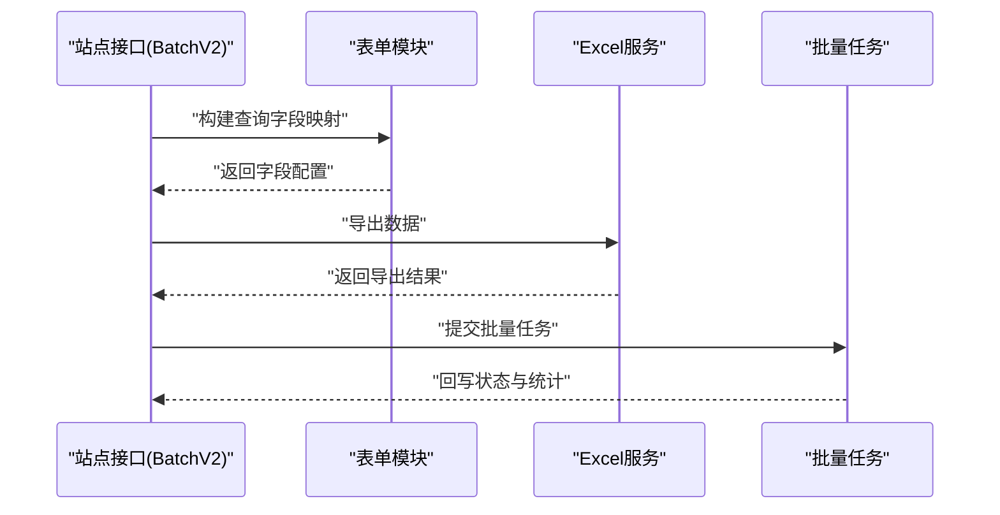

**图表来源**
- [BatchV2.php](file://process/src/http/site/BatchV2.php#L257-L289)
- [ExcelImportExportService.php](file://process/src/services/desktopManage/ExcelImportExportService.php#L2589-L2614)
- [BatchTask.php](file://process/src/services/task/BatchTask.php#L40-L65)

**章节来源**
- [BatchV2.php](file://process/src/http/site/BatchV2.php#L257-L289)
- [ExcelImportExportService.php](file://process/src/services/desktopManage/ExcelImportExportService.php#L2589-L2614)
- [BatchTask.php](file://process/src/services/task/BatchTask.php#L40-L65)

### 数据权限控制与字段级安全
- 字段级权限
  - 数据表模型与组件基类结合权限位（可写/只读/隐藏）进行字段过滤与渲染控制。
- 权限上下文
  - 表单模块在获取数据与保存数据时注入component_form_auth与component_save_auth，确保组件fromDb与validate在权限范围内执行。
- 来源与范围
  - 来源后缀区分不同来源（个人桌面、应用、同步、管理），支持范围权限配置（如个人分类表的数据授权）。

**章节来源**
- [DataTableModel.php](file://process/src/models/DataTableModel.php#L1-L200)
- [Component.php](file://process/src/modules/form/components/Component.php#L90-L140)
- [Form.php](file://process/src/modules/Form.php#L70-L120)

## 依赖关系分析
- 组件与表单模块
  - 组件通过getObject工厂方法按类型实例化，表单模块负责初始化与事件注册。
- 数据表模型与组件
  - 组件从数据表模型读取字段配置（类型、格式、搜索类型），并在渲染与保存时进行转换。
- 表单数据模型与表单模块
  - 表单模块读取/写入表单数据模型，保存时进行变更对比与并发控制。
- 接口与服务
  - 系统接口与站点接口分别面向数据表配置与批量操作，Excel服务与批量任务提供导出与执行能力。

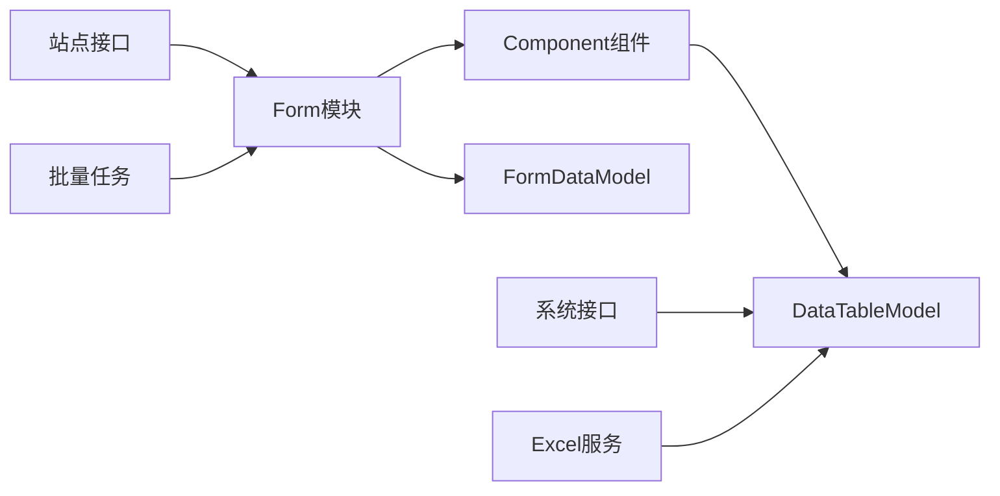

**图表来源**
- [Form.php](file://process/src/modules/Form.php#L1-L120)
- [Component.php](file://process/src/modules/form/components/Component.php#L1-L120)
- [DataTableModel.php](file://process/src/models/DataTableModel.php#L1-L200)
- [FormDataModel.php](file://process/src/models/FormDateModel.php#L1-L90)
- [DataTable.php（系统接口）](file://process/src/http/system/DataTable.php#L2200-L2230)
- [BatchV2.php](file://process/src/http/site/BatchV2.php#L257-L289)
- [ExcelImportExportService.php](file://process/src/services/desktopManage/ExcelImportExportService.php#L2589-L2614)
- [BatchTask.php](file://process/src/services/task/BatchTask.php#L40-L65)

**章节来源**
- [Form.php](file://process/src/modules/Form.php#L1-L120)
- [Component.php](file://process/src/modules/form/components/Component.php#L1-L120)
- [DataTableModel.php](file://process/src/models/DataTableModel.php#L1-L200)
- [FormDataModel.php](file://process/src/models/FormDateModel.php#L1-L90)

## 性能考量
- 运行时模型生成
  - 通过版本化类名与动态生成，避免每次请求重复解析配置；清理过期文件降低磁盘占用。
- 查询与导出
  - 字段可见/可搜标志预计算，减少运行时判断开销；批量任务与并发控制避免锁冲突。
- 缓存与索引
  - 数据表模型与表单数据模型均采用分区与索引优化，提升查询效率。

[本节为通用指导，无需具体文件分析]

## 故障排查指南
- 表单验证异常
  - 批量任务捕获表单验证异常，记录错误消息与组件描述，便于定位问题字段。
- 数据导出错误
  - Excel服务对重复数据进行标记与错误收集，检查字段映射与权限配置。
- 权限过滤导致字段缺失
  - 检查权限位与来源后缀，确认字段是否被正确过滤或隐藏。

**章节来源**
- [BatchTask.php](file://process/src/services/task/BatchTask.php#L40-L65)
- [ExcelImportExportService.php](file://process/src/services/desktopManage/ExcelImportExportService.php#L2589-L2614)
- [Form.php](file://process/src/modules/Form.php#L70-L120)

## 结论
该数据表单模型体系以数据表模型为核心，结合表单模块、组件模型与表单数据模型，实现了字段类型与格式的标准化、权限与来源的精细化控制、版本化运行时模型的高效生成，以及查询、导出与批量操作的完整链路。通过迁移脚本与模板系统，保障了历史数据与新功能的平滑演进。建议在实际使用中：
- 明确字段类型与格式，合理设置权限位与来源后缀；
- 利用重复表组件与事件机制实现复杂联动；
- 在批量导入导出中严格校验字段映射与权限；
- 通过版本化模型与缓存策略优化性能。

[本节为总结，无需具体文件分析]

## 附录
- 字段权重模型（DataTableFieldWeigetModel）
  - 用于记录用户对字段权重的评分或偏好，便于个性化展示与排序。

**章节来源**
- [DataTableFieldWeigetModel.php](file://process/src/models/DataTableFieldWeigetModel.php#L1-L35)