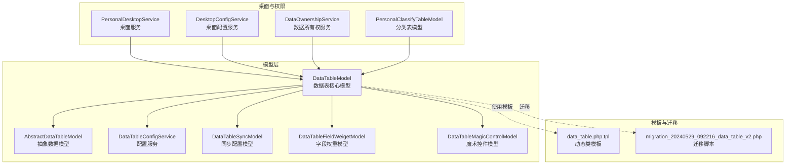
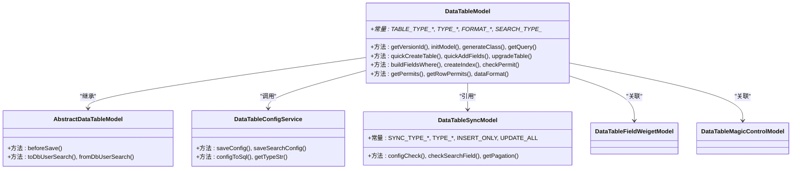
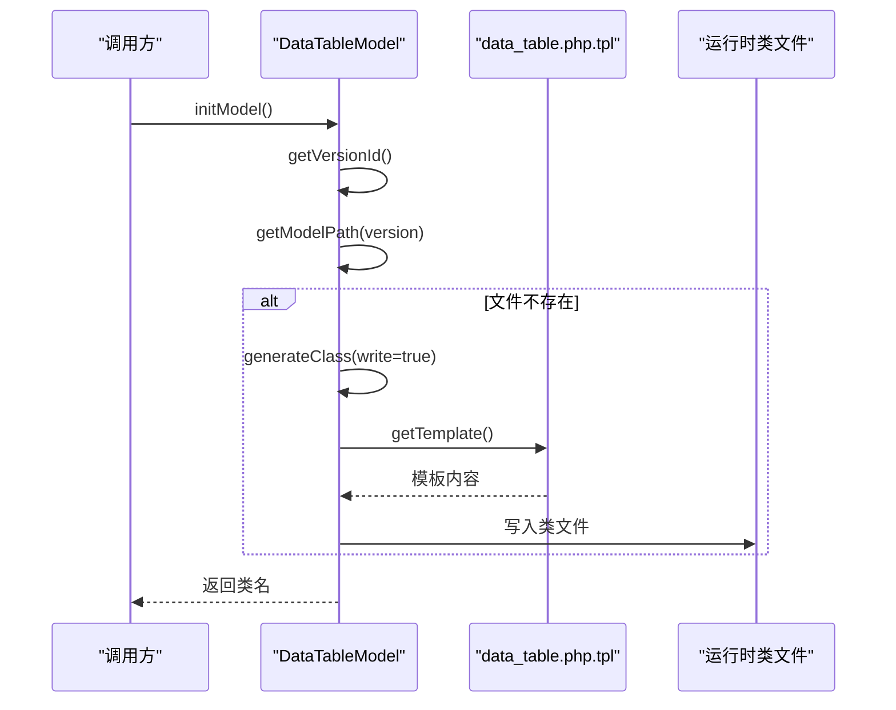
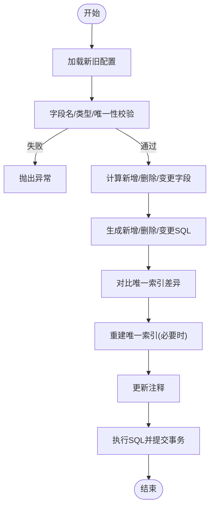
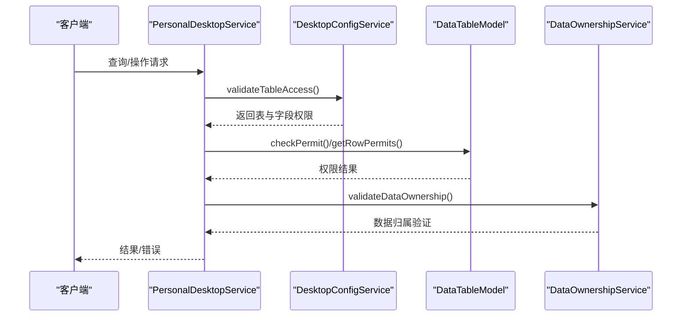
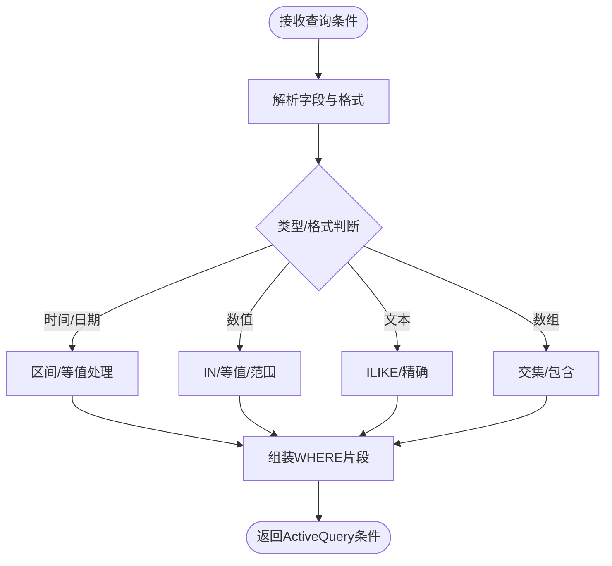
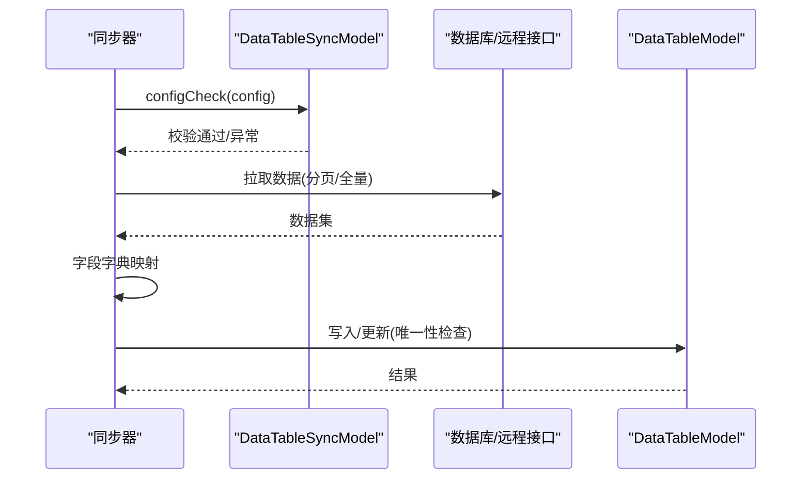
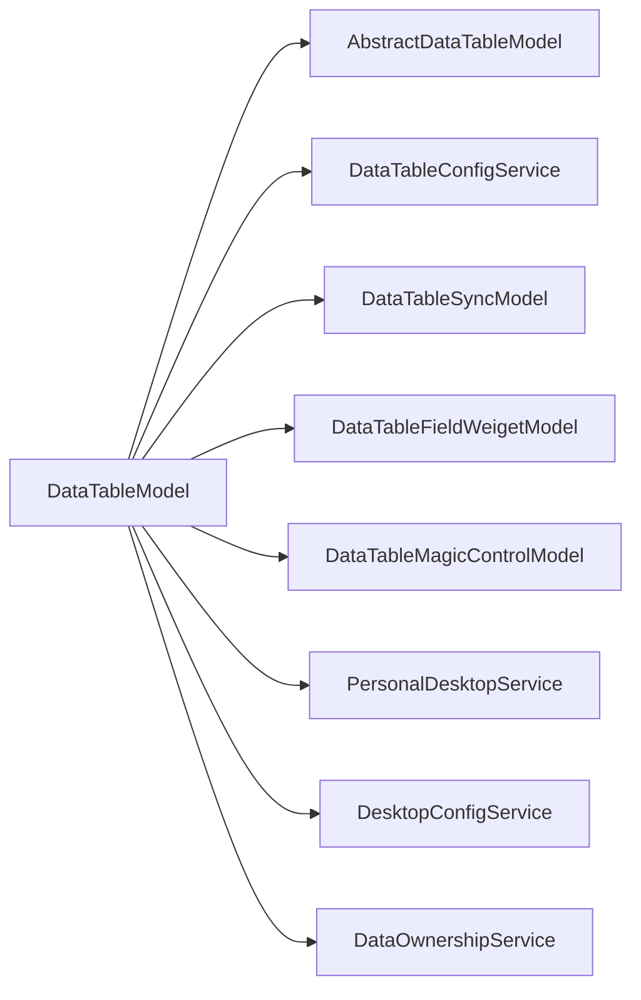

# 数据表核心模型

<cite>
**本文引用的文件**
- [DataTableModel.php](file://process/src/models/DataTableModel.php)
- [AbstractDataTableModel.php](file://process/src/models/AbstractDataTableModel.php)
- [DataTableConfigService.php](file://process/src/services/DataTableConfigService.php)
- [DataTableSyncModel.php](file://process/src/models/DataTableSyncModel.php)
- [DataTableFieldWeigetModel.php](file://process/src/models/DataTableFieldWeigetModel.php)
- [DataTableMagicControlModel.php](file://process/src/models/DataTableMagicControlModel.php)
- [data_table.php.tpl](file://process/src/commands/data_table.php.tpl)
- [migration_20240529_092216_data_table_v2.php](file://process/src/migrations/migration_20240529_092216_data_table_v2.php)
- [PersonalDesktopService.php](file://process/src/services/desktopManage/PersonalDesktopService.php)
- [DesktopConfigService.php](file://process/src/services/desktopManage/DesktopConfigService.php)
- [DataOwnershipService.php](file://process/src/services/desktopManage/DataOwnershipService.php)
- [PersonalClassifyTableModel.php](file://process/src/models/PersonalClassifyTableModel.php)
</cite>

## 目录
1. [简介](#简介)
2. [项目结构](#项目结构)
3. [核心组件](#核心组件)
4. [架构总览](#架构总览)
5. [详细组件分析](#详细组件分析)
6. [依赖关系分析](#依赖关系分析)
7. [性能考量](#性能考量)
8. [故障排查指南](#故障排查指南)
9. [结论](#结论)
10. [附录](#附录)

## 简介
本文件围绕数据表核心模型进行系统化技术文档梳理，重点覆盖以下方面：
- 数据表类型体系：普通数据集、个人数据集、微系统数据集、共享表、明细表
- 字段配置系统：字段类型映射（VARCHAR、INT8、DECIMAL、TIMESTAMP 等）与前端展示格式（INPUT、SELECT、DATE、FILE 等）
- 版本管理与动态类生成：基于版本号生成运行时数据模型类，确保字段变更后即时生效
- 权限控制：基于来源（桌面、事项、同步、管理、数据认领）的行级权限与字段权限
- 搜索配置与查询构建：字段格式驱动的查询条件组装与索引策略
- 数据同步机制：数据库/远程数据源、分页与唯一性约束、更新模式
- 初始化、字段验证与数据迁移：建表、升级、唯一索引、注释维护
- CRUD、批量导入导出与性能优化：查询条件、索引、事务与批处理建议

## 项目结构
数据表核心模型位于 models 与 services 目录，配合命令模板与迁移脚本完成动态类生成与数据库演进。

**图表来源**
- [DataTableModel.php](file://process/src/models/DataTableModel.php#L1-L200)
- [AbstractDataTableModel.php](file://process/src/models/AbstractDataTableModel.php#L1-L84)
- [DataTableConfigService.php](file://process/src/services/DataTableConfigService.php#L1-L120)
- [DataTableSyncModel.php](file://process/src/models/DataTableSyncModel.php#L1-L120)
- [DataTableFieldWeigetModel.php](file://process/src/models/DataTableFieldWeigetModel.php#L1-L35)
- [DataTableMagicControlModel.php](file://process/src/models/DataTableMagicControlModel.php#L1-L47)
- [data_table.php.tpl](file://process/src/commands/data_table.php.tpl#L1-L23)
- [migration_20240529_092216_data_table_v2.php](file://process/src/migrations/migration_20240529_092216_data_table_v2.php#L1-L59)
- [PersonalDesktopService.php](file://process/src/services/desktopManage/PersonalDesktopService.php#L226-L260)
- [DesktopConfigService.php](file://process/src/services/desktopManage/DesktopConfigService.php#L371-L402)
- [DataOwnershipService.php](file://process/src/services/desktopManage/DataOwnershipService.php#L1-L72)
- [PersonalClassifyTableModel.php](file://process/src/models/PersonalClassifyTableModel.php#L109-L141)

**章节来源**
- [DataTableModel.php](file://process/src/models/DataTableModel.php#L1-L200)
- [data_table.php.tpl](file://process/src/commands/data_table.php.tpl#L1-L23)

## 核心组件
- DataTableModel：数据表核心模型，负责类型定义、字段配置、版本管理、动态类生成、权限与搜索、同步与迁移、CRUD与备份等
- AbstractDataTableModel：抽象数据模型，提供保存前钩子与用户搜索字段的序列化/反序列化工具方法
- DataTableConfigService：字段配置变更服务，将配置转换为 SQL，执行建表/升级、唯一索引维护与注释
- DataTableSyncModel：数据同步配置模型，支持数据库/远程数据源、分页、唯一性更新、字段字典映射
- DataTableFieldWeigetModel：字段权重模型，记录字段采集权重
- DataTableMagicControlModel：魔术控件配置模型，扩展字段行为
- 动态类模板：data_table.php.tpl，用于生成运行时数据模型类

**章节来源**
- [DataTableModel.php](file://process/src/models/DataTableModel.php#L1-L200)
- [AbstractDataTableModel.php](file://process/src/models/AbstractDataTableModel.php#L1-L84)
- [DataTableConfigService.php](file://process/src/services/DataTableConfigService.php#L1-L120)
- [DataTableSyncModel.php](file://process/src/models/DataTableSyncModel.php#L1-L120)
- [DataTableFieldWeigetModel.php](file://process/src/models/DataTableFieldWeigetModel.php#L1-L35)
- [DataTableMagicControlModel.php](file://process/src/models/DataTableMagicControlModel.php#L1-L47)
- [data_table.php.tpl](file://process/src/commands/data_table.php.tpl#L1-L23)

## 架构总览
数据表核心模型采用“配置驱动 + 动态类生成 + 权限与搜索解耦”的架构设计。配置（config）描述字段元数据与前端展示格式；通过版本号生成独立的运行时数据模型类，保证字段变更后即时生效；权限与搜索分别由桌面/权限服务与模型内部方法协同完成；同步模块提供多数据源接入与分页能力。

**图表来源**
- [DataTableModel.php](file://process/src/models/DataTableModel.php#L1-L200)
- [AbstractDataTableModel.php](file://process/src/models/AbstractDataTableModel.php#L1-L84)
- [DataTableConfigService.php](file://process/src/services/DataTableConfigService.php#L1-L120)
- [DataTableSyncModel.php](file://process/src/models/DataTableSyncModel.php#L1-L120)
- [DataTableFieldWeigetModel.php](file://process/src/models/DataTableFieldWeigetModel.php#L1-L35)
- [DataTableMagicControlModel.php](file://process/src/models/DataTableMagicControlModel.php#L1-L47)

## 详细组件分析

### 数据表类型与字段配置
- 数据表类型
  - 普通数据集：面向事项采集与报表
  - 个人数据集：面向个人桌面数据
  - 微系统数据集：面向微服务场景
  - 共享表：与主表关联，按工号过滤
  - 明细表：与主表关联，记录子数据
- 字段类型映射
  - VARCHAR → varchar
  - INT8 → int8
  - DECIMAL → decimal(numeric)
  - TIMESTAMP → timestamp(0)
  - TEXT → text
  - FILE → jsonb
  - STRARR/INTARR → varchar[]/int[]
- 前端展示格式
  - INPUT、TEXTAREA、URL、IMAGE、IMAGES、FILES、RADIO、CHECKBOX、SELECT、SELECT_M、TIMESTAMP、DATE、DATETIME、YEAR、YEARMONTH、USERNUMBER、SEARCHUSER、以及多种文本时间格式
- 搜索类型
  - NONE、EQUAL、LIKE、DATE、DATERANGE、RANGE

**章节来源**
- [DataTableModel.php](file://process/src/models/DataTableModel.php#L406-L477)
- [DataTableModel.php](file://process/src/models/DataTableModel.php#L451-L460)

### 动态类生成机制
- 版本标识：基于 id 与 modified 时间戳拼接版本号
- 生成流程：若模板类不存在，则读取模板并写入运行时目录；类名包含版本号，避免缓存命中旧类
- 加载与清理：initModel 触发 autoload；clearClass 清理历史版本文件
- 运行时类：继承 AbstractDataTableModel，静态暴露表名与列定义

**图表来源**
- [DataTableModel.php](file://process/src/models/DataTableModel.php#L558-L630)
- [data_table.php.tpl](file://process/src/commands/data_table.php.tpl#L1-L23)

**章节来源**
- [DataTableModel.php](file://process/src/models/DataTableModel.php#L510-L630)
- [data_table.php.tpl](file://process/src/commands/data_table.php.tpl#L1-L23)

### 字段验证与数据迁移
- 配置校验与 SQL 生成
  - 字段名长度与重复校验
  - 类型合法性校验
  - 新增/修改/删除字段的 SQL 生成
  - 唯一索引变更与注释维护
- 升级策略
  - 无数据时允许类型变更；有数据时禁止类型变更
  - numeric 小数位变更直接 ALTER TYPE
  - 唯一索引变更时先检查重复再重建
- 注释与索引
  - 字段注释与表注释统一维护
  - 唯一索引按字段默认值与 pid 条件生成

**图表来源**
- [DataTableConfigService.php](file://process/src/services/DataTableConfigService.php#L105-L237)
- [DataTableModel.php](file://process/src/models/DataTableModel.php#L1600-L1798)

**章节来源**
- [DataTableConfigService.php](file://process/src/services/DataTableConfigService.php#L1-L258)
- [DataTableModel.php](file://process/src/models/DataTableModel.php#L1600-L1798)

### 权限控制与来源标识
- 来源类型
  - 桌面（个人/管理）、事项、同步、管理、数据认领
- 权限结构
  - permits 字段按来源键聚合字段权限（可写/只读/隐藏/必填）
  - 行级权限：根据来源键与字段 permit 计算可修改字段集合
- 权限验证
  - 桌面服务与配置服务联合校验表权限与字段权限
  - 数据所有权服务支持通过子表共享判断访问权限

**图表来源**
- [PersonalDesktopService.php](file://process/src/services/desktopManage/PersonalDesktopService.php#L226-L260)
- [DesktopConfigService.php](file://process/src/services/desktopManage/DesktopConfigService.php#L371-L402)
- [DataTableModel.php](file://process/src/models/DataTableModel.php#L1373-L1410)
- [DataOwnershipService.php](file://process/src/services/desktopManage/DataOwnershipService.php#L1-L72)
- [PersonalClassifyTableModel.php](file://process/src/models/PersonalClassifyTableModel.php#L109-L141)

**章节来源**
- [DataTableModel.php](file://process/src/models/DataTableModel.php#L1373-L1410)
- [DataTableModel.php](file://process/src/models/DataTableModel.php#L2134-L2183)
- [PersonalDesktopService.php](file://process/src/services/desktopManage/PersonalDesktopService.php#L226-L260)
- [DesktopConfigService.php](file://process/src/services/desktopManage/DesktopConfigService.php#L371-L402)
- [DataOwnershipService.php](file://process/src/services/desktopManage/DataOwnershipService.php#L1-L72)
- [PersonalClassifyTableModel.php](file://process/src/models/PersonalClassifyTableModel.php#L109-L141)

### 搜索配置与查询构建
- 字段格式驱动查询
  - 时间戳/日期：支持区间、等值、毫秒时间戳转换
  - 数值：支持 IN/等值与选择类
  - 文本：支持 ILIKE 模糊匹配与精确匹配
  - 数组：支持交集/包含
- 默认搜索配置
  - 自动生成默认搜索项，文本字段默认 LIKE
- 索引策略
  - 默认索引：__sessid（唯一）、__pid、__number（共享表非空约束）
  - 可选索引：按字段组合创建

**图表来源**
- [DataTableModel.php](file://process/src/models/DataTableModel.php#L1260-L1365)
- [DataTableModel.php](file://process/src/models/DataTableModel.php#L1427-L1448)

**章节来源**
- [DataTableModel.php](file://process/src/models/DataTableModel.php#L1260-L1365)
- [DataTableModel.php](file://process/src/models/DataTableModel.php#L1427-L1448)

### 数据同步机制
- 支持数据源
  - database：数据库直连，支持表选择与 where 过滤、分页辅助字段校验
  - remote_data：远程接口，支持分页与 JSON 路径遍历
- 更新模式
  - 仅新增、按唯一值更新
- 字段字典
  - 自动/手动映射，支持表达式与固定值
- 分页与唯一性
  - 根据配置决定是否分页
  - 唯一索引与唯一性冲突检测

**图表来源**
- [DataTableSyncModel.php](file://process/src/models/DataTableSyncModel.php#L99-L161)
- [DataTableSyncModel.php](file://process/src/models/DataTableSyncModel.php#L163-L247)
- [DataTableModel.php](file://process/src/models/DataTableModel.php#L1600-L1798)

**章节来源**
- [DataTableSyncModel.php](file://process/src/models/DataTableSyncModel.php#L1-L248)
- [DataTableModel.php](file://process/src/models/DataTableModel.php#L1600-L1798)

### 初始化、字段验证与数据迁移
- 快速建表
  - 自动生成内置字段（如申请编号、申请人等），创建表与注释，建立唯一索引
  - 可选初始化数据（基于会话与用户/部门信息）
- 快速新增字段
  - 通过表单组件推断数据库类型，ALTER TABLE 添加列并写注释
  - 可选 UPDATE FROM 初始化字段值
- 升级表
  - 依据配置与现有列对比生成 SQL，执行后重建运行时类并清理历史文件

**章节来源**
- [DataTableModel.php](file://process/src/models/DataTableModel.php#L800-L977)
- [DataTableModel.php](file://process/src/models/DataTableModel.php#L979-L1174)
- [DataTableModel.php](file://process/src/models/DataTableModel.php#L1578-L1597)

### CRUD、批量导入导出与性能优化
- CRUD
  - 通过运行时类进行标准 CRUD 操作；删除前备份至备份表
- 批量导入导出
  - 建议使用数据库层批量 INSERT/UPDATE，结合唯一索引与事务提升吞吐
- 性能优化
  - 合理创建索引（__sessid、__pid、__number 等）
  - 查询条件尽量使用等值/范围/数组交集，避免全表扫描
  - 大数据量场景使用分页与游标（同步模块已支持）

**章节来源**
- [DataTableModel.php](file://process/src/models/DataTableModel.php#L2104-L2118)
- [DataTableSyncModel.php](file://process/src/models/DataTableSyncModel.php#L236-L247)

## 依赖关系分析
- 组件耦合
  - DataTableModel 与 AbstractDataTableModel 强依赖（继承）
  - DataTableModel 与 DataTableConfigService、DataTableSyncModel、DataTableFieldWeigetModel、DataTableMagicControlModel 松耦合（通过配置与 ID 关联）
  - 权限与搜索依赖桌面与权限服务协作
- 外部依赖
  - PostgreSQL Schema 定义与迁移脚本
  - 桌面与权限服务提供来源与字段权限合并

**图表来源**
- [DataTableModel.php](file://process/src/models/DataTableModel.php#L1-L200)
- [AbstractDataTableModel.php](file://process/src/models/AbstractDataTableModel.php#L1-L84)
- [DataTableConfigService.php](file://process/src/services/DataTableConfigService.php#L1-L120)
- [DataTableSyncModel.php](file://process/src/models/DataTableSyncModel.php#L1-L120)
- [DataTableFieldWeigetModel.php](file://process/src/models/DataTableFieldWeigetModel.php#L1-L35)
- [DataTableMagicControlModel.php](file://process/src/models/DataTableMagicControlModel.php#L1-L47)
- [PersonalDesktopService.php](file://process/src/services/desktopManage/PersonalDesktopService.php#L226-L260)
- [DesktopConfigService.php](file://process/src/services/desktopManage/DesktopConfigService.php#L371-L402)
- [DataOwnershipService.php](file://process/src/services/desktopManage/DataOwnershipService.php#L1-L72)

**章节来源**
- [DataTableModel.php](file://process/src/models/DataTableModel.php#L1-L200)
- [DataTableConfigService.php](file://process/src/services/DataTableConfigService.php#L1-L120)
- [DataTableSyncModel.php](file://process/src/models/DataTableSyncModel.php#L1-L120)
- [PersonalDesktopService.php](file://process/src/services/desktopManage/PersonalDesktopService.php#L226-L260)
- [DesktopConfigService.php](file://process/src/services/desktopManage/DesktopConfigService.php#L371-L402)
- [DataOwnershipService.php](file://process/src/services/desktopManage/DataOwnershipService.php#L1-L72)

## 性能考量
- 索引策略
  - 唯一索引：__sessid（主表）或 __sessid+__repeat_index（重复表）
  - 共享表：__number 非空时建立索引
  - 明细表：__pid 建索引
- 查询优化
  - 优先使用等值/范围/数组交集
  - 避免对大字段做 ILIKE 前缀外匹配
- 同步与迁移
  - 同步分页与唯一性检查，减少锁竞争
  - 迁移在事务成功后重建运行时类，避免缓存污染

[本节为通用指导，无需列出具体文件来源]

## 故障排查指南
- 字段类型变更失败
  - 若表已有数据，禁止修改字段类型；可先清空数据或新增字段后迁移
- 唯一索引冲突
  - 唯一字段存在重复值时无法修改唯一索引；请先清洗数据
- 权限不足
  - 检查 permits 中来源键对应的字段权限；确认桌面/分类表权限与字段权限合并结果
- 同步异常
  - 校验 data_source、database_id、table/where/sql、dictionary 等配置；分页辅助字段需为自增列

**章节来源**
- [DataTableConfigService.php](file://process/src/services/DataTableConfigService.php#L170-L237)
- [DataTableModel.php](file://process/src/models/DataTableModel.php#L1645-L1687)
- [DataTableSyncModel.php](file://process/src/models/DataTableSyncModel.php#L99-L161)
- [DataTableSyncModel.php](file://process/src/models/DataTableSyncModel.php#L163-L234)

## 结论
数据表核心模型通过“配置驱动 + 动态类生成 + 权限与搜索解耦 + 同步与迁移自动化”的设计，实现了灵活、可演进、可扩展的数据表能力。建议在生产环境中：
- 严格遵循字段类型与唯一性约束
- 合理规划索引与查询条件
- 使用同步与迁移脚本进行平滑升级
- 通过桌面与权限服务统一管理来源与字段权限

[本节为总结性内容，无需列出具体文件来源]

## 附录
- 迁移脚本示例：v2 版本引入 is_default、task_view、函数等，便于后续版本演进

**章节来源**
- [migration_20240529_092216_data_table_v2.php](file://process/src/migrations/migration_20240529_092216_data_table_v2.php#L1-L59)