# 表单数据管理

<cite>
**本文引用的文件**
- [process/src/models/FormDataModel.php](file://process/src/models/FormDataModel.php)
- [process/src/models/AppSessionModel.php](file://process/src/models/AppSessionModel.php)
- [process/src/models/FormDataChangeModel.php](file://process/src/models/FormDataChangeModel.php)
- [process/docs/sql/database.sql](file://process/docs/sql/database.sql)
- [process/src/services/desktopManage/ExcelImportExportService.php](file://process/src/services/desktopManage/ExcelImportExportService.php)
- [process/src/services/ExportService.php](file://process/src/services/ExportService.php)
- [process/src/services/listeners/PushListener.php](file://process/src/services/listeners/PushListener.php)
- [process/src/services/desktopManage/DesktopPermissionService.php](file://process/src/services/desktopManage/DesktopPermissionService.php)
- [process/src/models/BackUpModel.php](file://process/src/models/BackUpModel.php)
- [process/src/services/task/PushToJinZhiTaskCenter.php](file://process/src/services/task/PushToJinZhiTaskCenter.php)
- [process/src/migrations/migration_20240727_123331_form_data_log_add_name.php](file://process/src/migrations/migration_20240727_123331_form_data_log_add_name.php)
- [process/src/http/system/DataTable.php](file://process/src/http/system/DataTable.php)
- [process/src/http/site/PersonalTask.php](file://process/src/http/site/PersonalTask.php)
- [process/src/services/platform/ShuWeiTaskCenter.php](file://process/src/services/platform/ShuWeiTaskCenter.php)
- [process/src/migrations/migration_20250730_102435_personal_v2.php](file://process/src/migrations/migration_20250730_102435_personal_v2.php)
- [process/src/services/upgrade4to5/Index.php](file://process/src/services/upgrade4to5/Index.php)
- [process/src/helpers/MigrationHelper.php](file://process/src/helpers/MigrationHelper.php)
- [process/src/helpers/SecurityHelper.php](file://process/src/helpers/SecurityHelper.php)
- [process/src/helpers/FilterDataHelper.php](file://process/src/helpers/FilterDataHelper.php)
- [process/src/helpers/SM4.php](file://process/src/helpers/SM4.php)
- [process/src/helpers/OtpHelper.php](file://process/src/helpers/OtpHelper.php)
- [process/src/helpers/QrcodeHelper.php](file://process/src/helpers/QrcodeHelper.php)
- [process/src/helpers/PdfHelper.php](file://process/src/helpers/PdfHelper.php)
- [process/src/helpers/ImageHelper.php](file://process/src/helpers/ImageHelper.php)
- [process/src/helpers/ShellHelper.php](file://process/src/helpers/ShellHelper.php)
- [process/src/helpers/UtilityHelper.php](file://process/src/helpers/UtilityHelper.php)
- [process/src/helpers/YamlHelper.php](file://process/src/helpers/YamlHelper.php)
- [process/src/helpers/StorageHelper.php](file://process/src/helpers/StorageHelper.php)
- [process/src/helpers/LockerHelper.php](file://process/src/helpers/LockerHelper.php)
- [process/src/helpers/CacheKeyHelper.php](file://process/src/helpers/CacheKeyHelper.php)
- [process/src/helpers/functions/](file://process/src/helpers/functions/)
- [process/src/helpers/ii18nnHelper.php](file://process/src/helpers/ii18nnHelper.php)
- [process/src/helpers/FontHelper.php](file://process/src/helpers/FontHelper.php)
- [process/src/helpers/AvatarHelper.php](file://process/src/helpers/AvatarHelper.php)
- [process/src/helpers/Url.php](file://process/src/helpers/Url.php)
- [process/src/components/Cache.php](file://process/src/components/Cache.php)
- [process/src/components/Queue.php](file://process/src/components/Queue.php)
- [process/src/components/User.php](file://process/src/components/User.php)
- [process/src/components/Notice.php](file://process/src/components/Notice.php)
- [process/src/components/ErrorHandler.php](file://process/src/components/ErrorHandler.php)
- [process/src/components/CacheObjectInterface.php](file://process/src/components/CacheObjectInterface.php)
- [process/src/http/system/GatewayApp.php](file://process/src/http/system/GatewayApp.php)
- [process/src/http/system/DataTable.php](file://process/src/http/system/DataTable.php)
- [process/src/http/site/PersonalTask.php](file://process/src/http/site/PersonalTask.php)
- [process/src/http/site/Questionnaire.php](file://process/src/http/site/Questionnaire.php)
- [process/src/annotations/CheckPermit.php](file://process/src/annotations/CheckPermit.php)
- [process/src/annotations/CheckSuper.php](file://process/src/annotations/CheckSuper.php)
- [process/src/config/process.dev.yaml](file://process/src/config/process.dev.yaml)
- [process/src/config/process.prod.yaml](file://process/src/config/process.prod.yaml)
- [process/src/config/main.dev.yaml](file://process/src/config/main.dev.yaml)
- [process/src/config/routes.php](file://process/src/config/routes.php)
- [process/src/config/api.php](file://process/src/config/api.php)
- [process/src/config/http.php](file://process/src/config/http.php)
- [process/src/config/init.php](file://process/src/config/init.php)
- [process/src/config/modules.php](file://process/src/config/modules.php)
- [process/src/config/components.php](file://process/src/config/components.php)
- [process/src/config/components_http.php](file://process/src/config/components_http.php)
- [process/src/config/components_cli.php](file://process/src/config/components_cli.php)
- [process/src/config/cli.php](file://process/src/config/cli.php)
- [process/src/config/crontab.php](file://process/src/config/crontab.php)
- [process/src/config/queue.php](file://process/src/config/queue.php)
- [process/src/config/upload.php](file://process/src/config/upload.php)
- [process/src/config/permits.php](file://process/src/config/permits.php)
- [process/src/config/area.php](file://process/src/config/area.php)
- [process/src/config/mqtt.php](file://process/src/config/mqtt.php)
- [process/src/config/ocr_dictionary.php](file://process/src/config/ocr_dictionary.php)
- [process/src/bootstrap.php](file://process/src/bootstrap.php)
- [process/src/main.php](file://process/src/main.php)
- [process/README.MD](file://process/README.MD)
</cite>

## 目录
1. [简介](#简介)
2. [项目结构](#项目结构)
3. [核心组件](#核心组件)
4. [架构总览](#架构总览)
5. [详细组件分析](#详细组件分析)
6. [依赖关系分析](#依赖关系分析)
7. [性能考量](#性能考量)
8. [故障排查指南](#故障排查指南)
9. [结论](#结论)
10. [附录](#附录)

## 简介
本文件聚焦于表单数据管理，围绕 FormDataModel 的数据存储结构、变更追踪与历史记录管理展开，系统梳理表单数据生命周期、版本控制与审计日志机制，阐述数据变更监听、冲突解决与一致性保障策略，并给出数据导入导出、批量操作与数据清洗的实现思路。同时覆盖数据权限控制、字段级安全与数据脱敏的技术要点，以及备份恢复、迁移升级与性能优化的实践方法。

## 项目结构
- 表单数据核心模型位于 models 层，包括表单数据表、变更表、会话与备份等。
- 业务侧通过 AppSessionModel 统一加载、合并、保存表单数据，并在流程节点中生成审计日志。
- 导入导出由 ExcelImportExportService 与 ExportService 提供，支持主表/子表分离与来源标记。
- 权限控制由 DesktopPermissionService 提供字段级权限合并能力，结合注解与配置实现细粒度控制。
- 数据推送与同步由 PushListener、GatewayApp 等组件负责，支持 API 与数据库两类目标。
- 备份恢复与迁移升级由 BackUpModel、upgrade4to5/Index 与 MigrationHelper 协同完成。

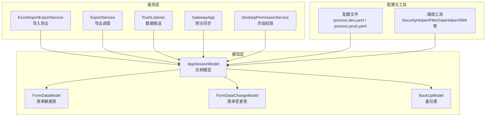

图表来源
- [process/src/models/FormDataModel.php](file://process/src/models/FormDataModel.php#L1-L90)
- [process/src/models/AppSessionModel.php](file://process/src/models/AppSessionModel.php#L300-L450)
- [process/src/models/FormDataChangeModel.php](file://process/src/models/FormDataChangeModel.php#L1-L38)
- [process/src/models/BackUpModel.php](file://process/src/models/BackUpModel.php#L1-L53)
- [process/src/services/desktopManage/ExcelImportExportService.php](file://process/src/services/desktopManage/ExcelImportExportService.php#L1092-L1265)
- [process/src/services/ExportService.php](file://process/src/services/ExportService.php#L1-L41)
- [process/src/services/listeners/PushListener.php](file://process/src/services/listeners/PushListener.php#L1-L68)
- [process/src/services/desktopManage/DesktopPermissionService.php](file://process/src/services/desktopManage/DesktopPermissionService.php#L288-L316)
- [process/src/config/process.dev.yaml](file://process/src/config/process.dev.yaml)
- [process/src/config/process.prod.yaml](file://process/src/config/process.prod.yaml)

章节来源
- [process/src/models/FormDataModel.php](file://process/src/models/FormDataModel.php#L1-L90)
- [process/src/models/AppSessionModel.php](file://process/src/models/AppSessionModel.php#L300-L450)
- [process/src/models/FormDataChangeModel.php](file://process/src/models/FormDataChangeModel.php#L1-L38)
- [process/src/models/BackUpModel.php](file://process/src/models/BackUpModel.php#L1-L53)
- [process/src/services/desktopManage/ExcelImportExportService.php](file://process/src/services/desktopManage/ExcelImportExportService.php#L1092-L1265)
- [process/src/services/ExportService.php](file://process/src/services/ExportService.php#L1-L41)
- [process/src/services/listeners/PushListener.php](file://process/src/services/listeners/PushListener.php#L1-L68)
- [process/src/services/desktopManage/DesktopPermissionService.php](file://process/src/services/desktopManage/DesktopPermissionService.php#L288-L316)
- [process/src/config/process.dev.yaml](file://process/src/config/process.dev.yaml)
- [process/src/config/process.prod.yaml](file://process/src/config/process.prod.yaml)

## 核心组件
- FormDataModel：表单数据持久化模型，定义表结构、列类型与注释，提供保存前校验、并发读取与差异计算能力。
- AppSessionModel：实例模型，负责表单数据的加载、合并、保存与审计日志写入，提供组件值读取与格式化、重复表迭代等能力。
- FormDataChangeModel：表单变更记录模型，用于记录实例级别的变更摘要，便于审计与回溯。
- BackUpModel：备份模型，支持实例删除等场景的备份与恢复，防止误操作导致的数据丢失。
- ExcelImportExportService：导入导出服务，支持主表/子表分离、唯一键校验、来源标记与批量处理。
- ExportService：导出调度服务，基于条件生成导出任务并落库。
- PushListener：数据推送监听器，支持 API 与数据库两类推送目标，具备异步与条件配置能力。
- DesktopPermissionService：桌面权限服务，提供字段级权限合并与层级结构输出，支撑前端渲染与校验。

章节来源
- [process/src/models/FormDataModel.php](file://process/src/models/FormDataModel.php#L1-L90)
- [process/src/models/AppSessionModel.php](file://process/src/models/AppSessionModel.php#L300-L450)
- [process/src/models/FormDataChangeModel.php](file://process/src/models/FormDataChangeModel.php#L1-L38)
- [process/src/models/BackUpModel.php](file://process/src/models/BackUpModel.php#L1-L53)
- [process/src/services/desktopManage/ExcelImportExportService.php](file://process/src/services/desktopManage/ExcelImportExportService.php#L1092-L1265)
- [process/src/services/ExportService.php](file://process/src/services/ExportService.php#L1-L41)
- [process/src/services/listeners/PushListener.php](file://process/src/services/listeners/PushListener.php#L1-L68)
- [process/src/services/desktopManage/DesktopPermissionService.php](file://process/src/services/desktopManage/DesktopPermissionService.php#L288-L316)

## 架构总览
下图展示表单数据在实例生命周期内的流转：表单编辑与保存、变更审计、导入导出、权限控制与数据推送。

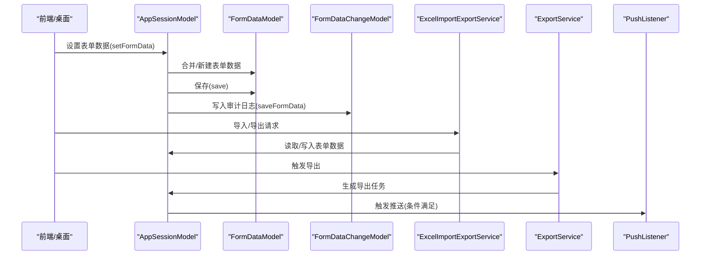

图表来源
- [process/src/models/AppSessionModel.php](file://process/src/models/AppSessionModel.php#L346-L450)
- [process/src/models/FormDataModel.php](file://process/src/models/FormDataModel.php#L36-L75)
- [process/src/models/FormDataChangeModel.php](file://process/src/models/FormDataChangeModel.php#L1-L38)
- [process/src/services/desktopManage/ExcelImportExportService.php](file://process/src/services/desktopManage/ExcelImportExportService.php#L1092-L1265)
- [process/src/services/ExportService.php](file://process/src/services/ExportService.php#L1-L41)
- [process/src/services/listeners/PushListener.php](file://process/src/services/listeners/PushListener.php#L1-L68)

## 详细组件分析

### 表单数据模型与存储结构
- 结构设计
  - 表单数据表：包含实例 ID、表单 ID、表单版本 ID、JSONB 数据、创建人与创建时间等字段，索引覆盖实例+表单组合，支持并发读取。
  - 变更记录表：按实例维度记录变更摘要，便于审计与回溯。
- 关键能力
  - 并发读取：提供 forUpdate 查询，确保在长事务中对同一实例的表单数据加锁读取。
  - 差异计算：保存前后对比，计算字段级变更，便于审计与增量同步。
  - 保存校验：新建时强制校验必要字段，保证数据完整性。

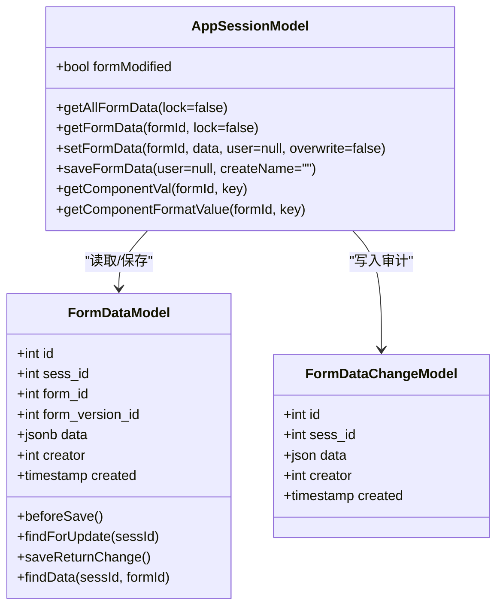

图表来源
- [process/src/models/FormDataModel.php](file://process/src/models/FormDataModel.php#L1-L90)
- [process/src/models/AppSessionModel.php](file://process/src/models/AppSessionModel.php#L300-L450)
- [process/src/models/FormDataChangeModel.php](file://process/src/models/FormDataChangeModel.php#L1-L38)

章节来源
- [process/src/models/FormDataModel.php](file://process/src/models/FormDataModel.php#L1-L90)
- [process/src/models/AppSessionModel.php](file://process/src/models/AppSessionModel.php#L300-L450)
- [process/src/models/FormDataChangeModel.php](file://process/src/models/FormDataChangeModel.php#L1-L38)
- [process/docs/sql/database.sql](file://process/docs/sql/database.sql#L200-L237)

### 表单数据生命周期与版本控制
- 生命周期
  - 草稿/验证：实例状态在草稿与验证之间切换，首次保存时设置状态并写入审计日志。
  - 运行中/完成/终止/取消：根据流程状态推进，实例结束时写入完成时间与结束状态。
- 版本控制
  - 表单版本 ID 与实例绑定，确保不同版本表单的数据隔离与兼容。
  - 导入导出时可按版本维度进行数据映射与迁移。

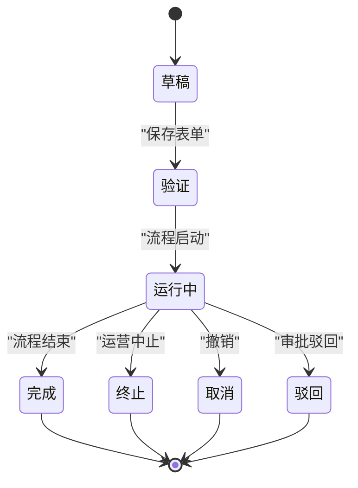

图表来源
- [process/src/models/AppSessionModel.php](file://process/src/models/AppSessionModel.php#L96-L151)
- [process/src/models/AppSessionModel.php](file://process/src/models/AppSessionModel.php#L569-L595)

章节来源
- [process/src/models/AppSessionModel.php](file://process/src/models/AppSessionModel.php#L96-L151)
- [process/src/models/AppSessionModel.php](file://process/src/models/AppSessionModel.php#L569-L595)

### 审计日志与历史记录
- 日志写入
  - 保存表单时，根据上下文区分“发起保存”与“流程节点保存”，分别更新或插入审计日志。
  - 支持 create_name 字段，便于识别来源。
- 变更记录
  - 保存前后对比字段差异，形成变更摘要，便于审计与回溯。

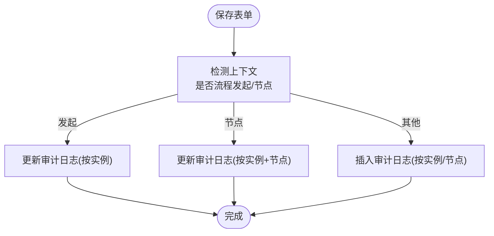

图表来源
- [process/src/models/AppSessionModel.php](file://process/src/models/AppSessionModel.php#L416-L450)
- [process/src/migrations/migration_20240727_123331_form_data_log_add_name.php](file://process/src/migrations/migration_20240727_123331_form_data_log_add_name.php#L1-L24)

章节来源
- [process/src/models/AppSessionModel.php](file://process/src/models/AppSessionModel.php#L416-L450)
- [process/src/migrations/migration_20240727_123331_form_data_log_add_name.php](file://process/src/migrations/migration_20240727_123331_form_data_log_add_name.php#L1-L24)

### 数据变更监听、冲突解决与一致性
- 变更监听
  - 通过 saveReturnChange 对比新旧数据，生成字段级变更集合，可用于审计与增量同步。
- 冲突解决
  - 并发读取采用 forUpdate 锁定，避免竞态；实例级互斥锁用于保护关键操作。
- 一致性保障
  - 保存表单与流程状态更新在同一事务中完成，确保状态与数据一致。
  - 保存后同步 OA 文档数据，保证外部系统一致性。

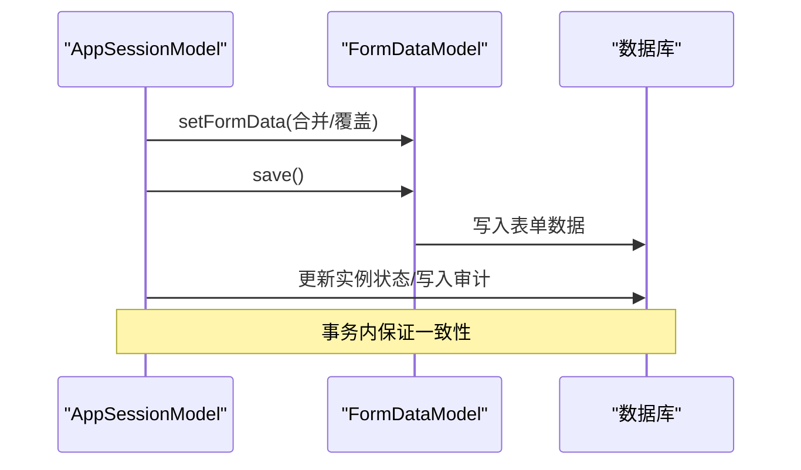

图表来源
- [process/src/models/AppSessionModel.php](file://process/src/models/AppSessionModel.php#L346-L410)
- [process/src/models/FormDataModel.php](file://process/src/models/FormDataModel.php#L36-L75)
- [process/src/helpers/LockerHelper.php](file://process/src/helpers/LockerHelper.php)

章节来源
- [process/src/models/FormDataModel.php](file://process/src/models/FormDataModel.php#L62-L75)
- [process/src/models/AppSessionModel.php](file://process/src/models/AppSessionModel.php#L346-L410)
- [process/src/helpers/LockerHelper.php](file://process/src/helpers/LockerHelper.php)

### 数据导入导出与批量操作
- 导入
  - 支持主表与子表数据分离，预构建子表映射，批量更新个人数据信息，避免重复创建。
  - 支持唯一键校验与来源标记，确保数据一致性与可追溯性。
- 导出
  - 基于条件生成导出任务，记录导出名称与类型，便于后续下载与归档。

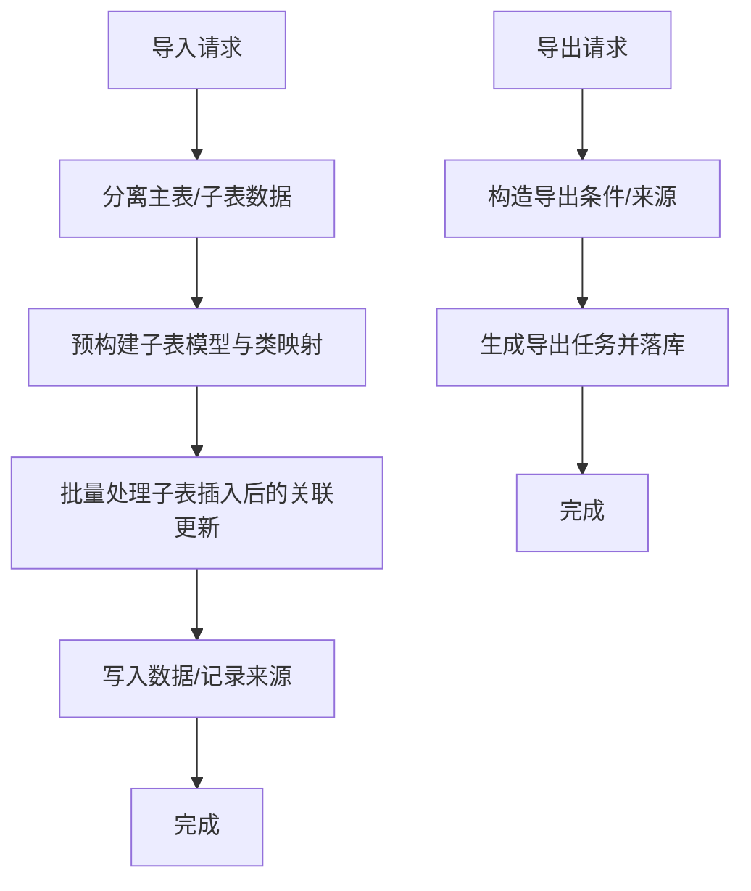

图表来源
- [process/src/services/desktopManage/ExcelImportExportService.php](file://process/src/services/desktopManage/ExcelImportExportService.php#L1092-L1265)
- [process/src/services/ExportService.php](file://process/src/services/ExportService.php#L1-L41)

章节来源
- [process/src/services/desktopManage/ExcelImportExportService.php](file://process/src/services/desktopManage/ExcelImportExportService.php#L1092-L1265)
- [process/src/services/ExportService.php](file://process/src/services/ExportService.php#L1-L41)

### 数据清洗与字段级安全
- 数据清洗
  - 导入前对子表数据进行格式化与去重处理，避免重复创建与脏数据进入系统。
- 字段级安全
  - 权限服务提供字段级权限合并，支持层级结构输出，前端据此渲染与校验。
  - 安全工具提供加密、脱敏、签名等能力，配合注解与配置实现最小暴露原则。

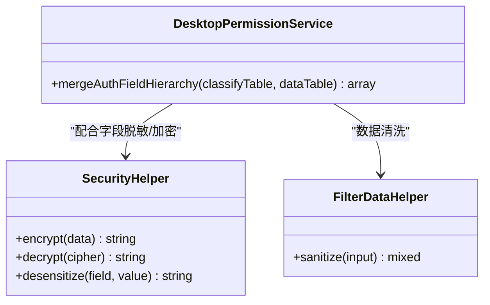

图表来源
- [process/src/services/desktopManage/DesktopPermissionService.php](file://process/src/services/desktopManage/DesktopPermissionService.php#L288-L316)
- [process/src/helpers/SecurityHelper.php](file://process/src/helpers/SecurityHelper.php)
- [process/src/helpers/FilterDataHelper.php](file://process/src/helpers/FilterDataHelper.php)

章节来源
- [process/src/services/desktopManage/DesktopPermissionService.php](file://process/src/services/desktopManage/DesktopPermissionService.php#L288-L316)
- [process/src/helpers/SecurityHelper.php](file://process/src/helpers/SecurityHelper.php)
- [process/src/helpers/FilterDataHelper.php](file://process/src/helpers/FilterDataHelper.php)

### 数据备份恢复与迁移升级
- 备份恢复
  - 删除实例或草稿时生成备份记录，支持恢复操作并防止重复恢复。
  - 任务中心与平台中心通过备份表检索并重建任务数据。
- 迁移升级
  - 升级服务扫描旧数据，按应用与状态过滤，生成升级任务并记录失败明细。
  - 迁移辅助工具提供数据映射与关系维护，确保升级过程可追踪。

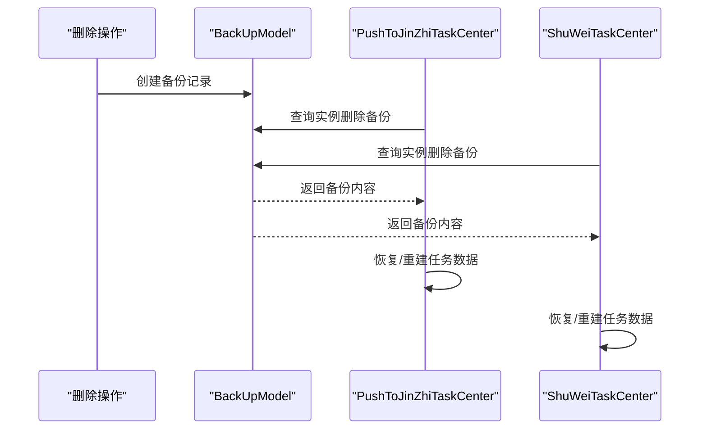

图表来源
- [process/src/models/BackUpModel.php](file://process/src/models/BackUpModel.php#L1-L53)
- [process/src/services/task/PushToJinZhiTaskCenter.php](file://process/src/services/task/PushToJinZhiTaskCenter.php#L207-L236)
- [process/src/services/platform/ShuWeiTaskCenter.php](file://process/src/services/platform/ShuWeiTaskCenter.php#L1127-L1160)

章节来源
- [process/src/models/BackUpModel.php](file://process/src/models/BackUpModel.php#L1-L53)
- [process/src/services/task/PushToJinZhiTaskCenter.php](file://process/src/services/task/PushToJinZhiTaskCenter.php#L207-L236)
- [process/src/services/platform/ShuWeiTaskCenter.php](file://process/src/services/platform/ShuWeiTaskCenter.php#L1127-L1160)

### 数据推送与集成
- 推送监听
  - 支持 API 与数据库两类推送目标，可配置异步与条件表达式。
- 网关同步
  - 系统网关任务将数据推送到第三方平台，支持状态查询与重试。

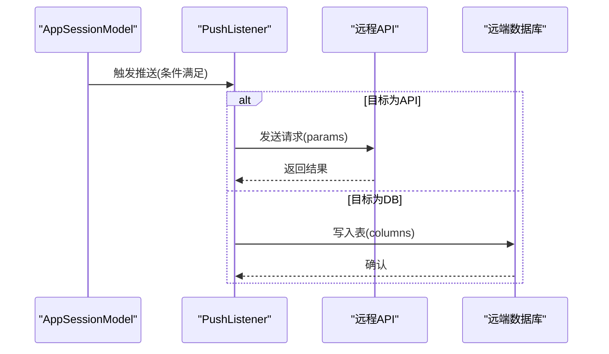

图表来源
- [process/src/services/listeners/PushListener.php](file://process/src/services/listeners/PushListener.php#L1-L68)
- [process/src/http/system/GatewayApp.php](file://process/src/http/system/GatewayApp.php#L35-L70)

章节来源
- [process/src/services/listeners/PushListener.php](file://process/src/services/listeners/PushListener.php#L1-L68)
- [process/src/http/system/GatewayApp.php](file://process/src/http/system/GatewayApp.php#L35-L70)

## 依赖关系分析
- 组件耦合
  - AppSessionModel 依赖 FormDataModel 与 FormDataChangeModel，承担表单数据聚合与审计职责。
  - 导入导出服务依赖数据表模型与来源标识，确保数据一致性。
  - 权限服务与安全工具解耦，通过接口组合实现字段级权限与数据安全。
- 外部依赖
  - 数据库：PostgreSQL JSONB 存储与索引，支持高并发读写。
  - 队列与缓存：用于异步任务与互斥锁，提升吞吐与一致性。
  - 第三方平台：通过推送监听器与网关任务对接外部系统。

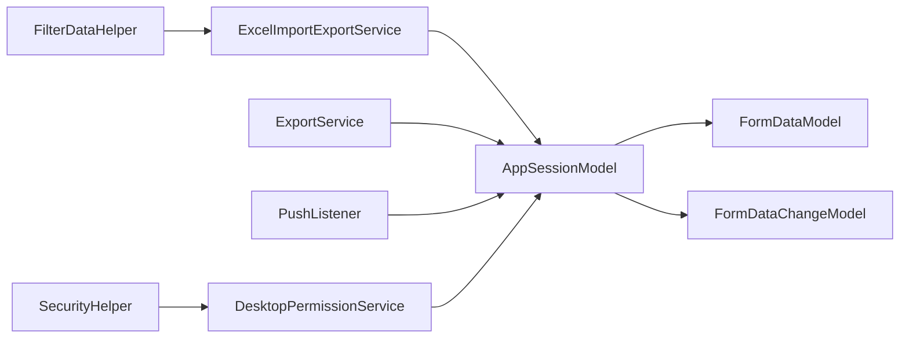

图表来源
- [process/src/models/AppSessionModel.php](file://process/src/models/AppSessionModel.php#L300-L450)
- [process/src/models/FormDataModel.php](file://process/src/models/FormDataModel.php#L1-L90)
- [process/src/models/FormDataChangeModel.php](file://process/src/models/FormDataChangeModel.php#L1-L38)
- [process/src/services/desktopManage/ExcelImportExportService.php](file://process/src/services/desktopManage/ExcelImportExportService.php#L1092-L1265)
- [process/src/services/ExportService.php](file://process/src/services/ExportService.php#L1-L41)
- [process/src/services/listeners/PushListener.php](file://process/src/services/listeners/PushListener.php#L1-L68)
- [process/src/services/desktopManage/DesktopPermissionService.php](file://process/src/services/desktopManage/DesktopPermissionService.php#L288-L316)
- [process/src/helpers/SecurityHelper.php](file://process/src/helpers/SecurityHelper.php)
- [process/src/helpers/FilterDataHelper.php](file://process/src/helpers/FilterDataHelper.php)

章节来源
- [process/src/models/AppSessionModel.php](file://process/src/models/AppSessionModel.php#L300-L450)
- [process/src/models/FormDataModel.php](file://process/src/models/FormDataModel.php#L1-L90)
- [process/src/models/FormDataChangeModel.php](file://process/src/models/FormDataChangeModel.php#L1-L38)
- [process/src/services/desktopManage/ExcelImportExportService.php](file://process/src/services/desktopManage/ExcelImportExportService.php#L1092-L1265)
- [process/src/services/ExportService.php](file://process/src/services/ExportService.php#L1-L41)
- [process/src/services/listeners/PushListener.php](file://process/src/services/listeners/PushListener.php#L1-L68)
- [process/src/services/desktopManage/DesktopPermissionService.php](file://process/src/services/desktopManage/DesktopPermissionService.php#L288-L316)
- [process/src/helpers/SecurityHelper.php](file://process/src/helpers/SecurityHelper.php)
- [process/src/helpers/FilterDataHelper.php](file://process/src/helpers/FilterDataHelper.php)

## 性能考量
- 索引与分区
  - 表单数据表按实例+表单建立索引，支持高并发查询与更新。
  - 变更表按实例建立唯一索引，减少重复写入开销。
- 批量处理
  - 导入导出采用批量插入与映射更新，降低重复创建与查询次数。
- 异步与队列
  - 导出与推送通过队列异步执行，避免阻塞主流程。
- 缓存与锁
  - 互斥锁与缓存键空间用于保护关键路径，减少竞争与重试成本。

[本节为通用性能建议，不直接分析具体文件]

## 故障排查指南
- 常见问题
  - 并发写入冲突：检查实例级互斥锁与 forUpdate 查询是否正确使用。
  - 审计缺失：确认 saveFormData 是否在事务内调用，上下文是否包含流程节点信息。
  - 导入异常：核对唯一键校验与子表映射，查看批量更新是否生效。
  - 权限错误：检查字段级权限合并逻辑与来源标识，确认前端渲染与校验一致。
- 排查步骤
  - 查看备份记录是否完整，必要时执行恢复。
  - 检查推送监听器配置与目标系统响应，确认异步任务状态。
  - 核对升级任务失败明细，定位映射与关系问题。

章节来源
- [process/src/models/BackUpModel.php](file://process/src/models/BackUpModel.php#L1-L53)
- [process/src/models/AppSessionModel.php](file://process/src/models/AppSessionModel.php#L416-L450)
- [process/src/services/desktopManage/ExcelImportExportService.php](file://process/src/services/desktopManage/ExcelImportExportService.php#L1092-L1265)
- [process/src/services/listeners/PushListener.php](file://process/src/services/listeners/PushListener.php#L1-L68)
- [process/src/services/upgrade4to5/Index.php](file://process/src/services/upgrade4to5/Index.php#L120-L162)

## 结论
该表单数据管理体系以模型为中心，围绕实例生命周期提供完整的数据存储、变更追踪与审计能力；通过权限与安全工具实现字段级控制与数据保护；借助导入导出、推送与备份恢复机制，满足复杂业务场景下的数据一致性与可追溯性需求。建议在高并发场景下持续优化索引与批量处理策略，并完善监控与告警体系以提升可观测性。

## 附录
- 数据库结构参考
  - 表单数据表与变更表结构、索引与序列定义参见数据库脚本。
- 配置与路由
  - 进程与运行时配置、HTTP 路由与模块配置位于配置目录，按需调整以适配部署环境。
- 辅助工具
  - 安全、过滤、存储、缓存与队列等辅助组件提供基础能力支撑。

章节来源
- [process/docs/sql/database.sql](file://process/docs/sql/database.sql#L200-L237)
- [process/src/config/process.dev.yaml](file://process/src/config/process.dev.yaml)
- [process/src/config/process.prod.yaml](file://process/src/config/process.prod.yaml)
- [process/src/config/routes.php](file://process/src/config/routes.php)
- [process/src/config/modules.php](file://process/src/config/modules.php)
- [process/src/config/components.php](file://process/src/config/components.php)
- [process/src/config/components_http.php](file://process/src/config/components_http.php)
- [process/src/config/components_cli.php](file://process/src/config/components_cli.php)
- [process/src/config/cli.php](file://process/src/config/cli.php)
- [process/src/config/crontab.php](file://process/src/config/crontab.php)
- [process/src/config/queue.php](file://process/src/config/queue.php)
- [process/src/config/upload.php](file://process/src/config/upload.php)
- [process/src/config/permits.php](file://process/src/config/permits.php)
- [process/src/config/area.php](file://process/src/config/area.php)
- [process/src/config/mqtt.php](file://process/src/config/mqtt.php)
- [process/src/config/ocr_dictionary.php](file://process/src/config/ocr_dictionary.php)
- [process/src/bootstrap.php](file://process/src/bootstrap.php)
- [process/src/main.php](file://process/src/main.php)
- [process/README.MD](file://process/README.MD)