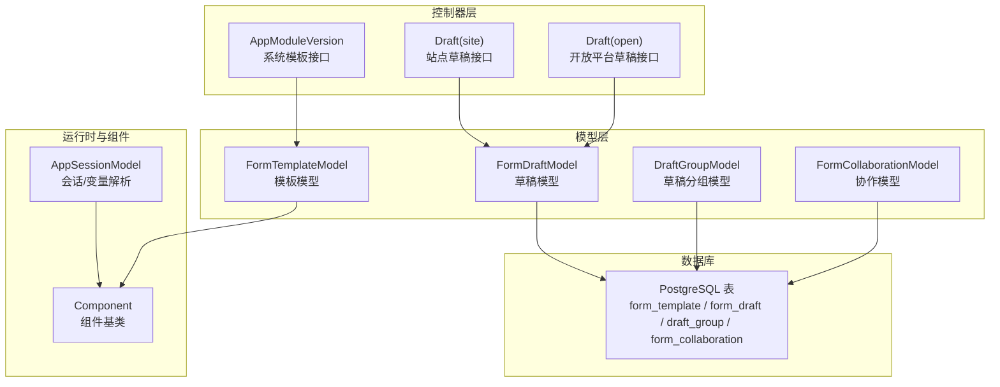
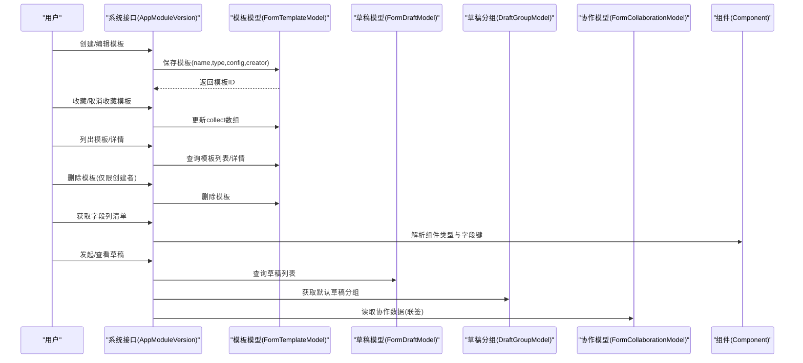
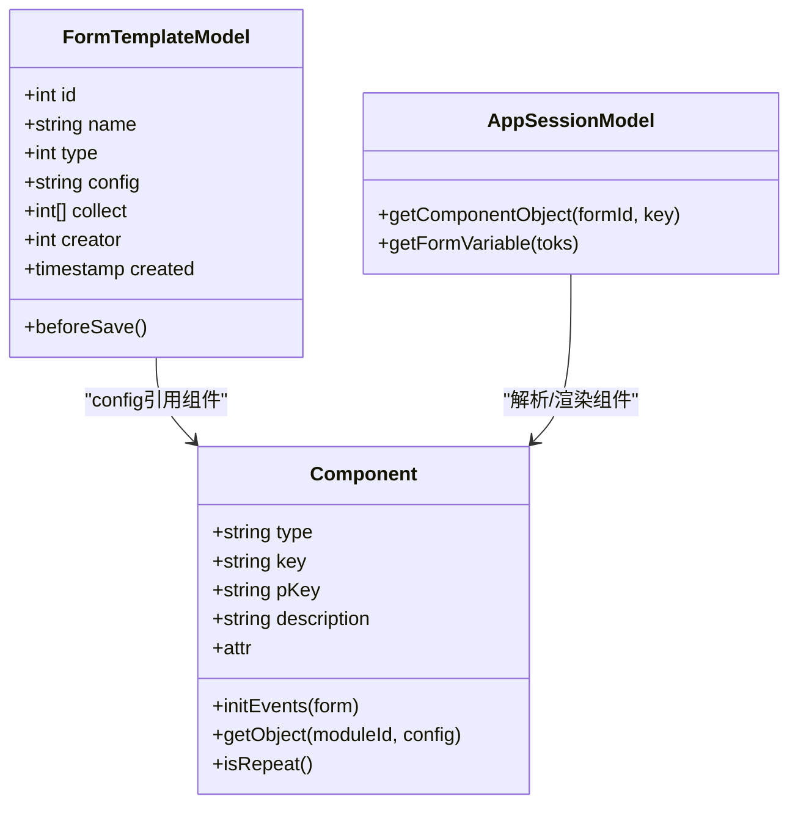
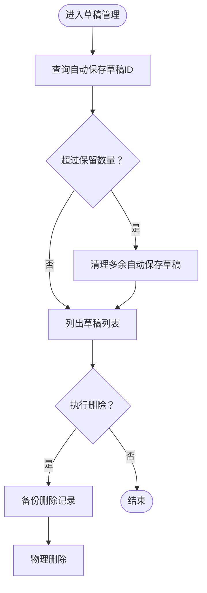
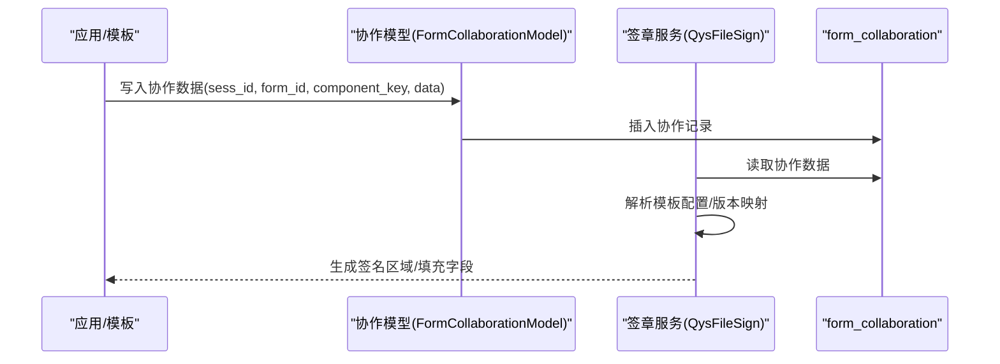
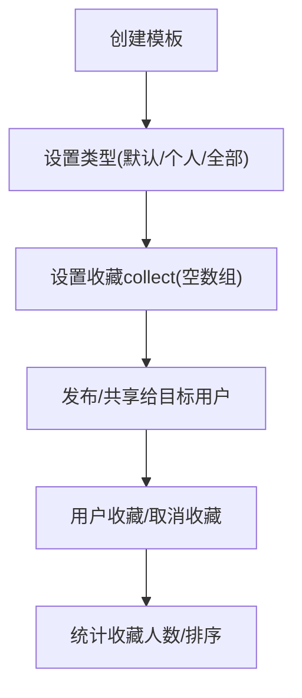
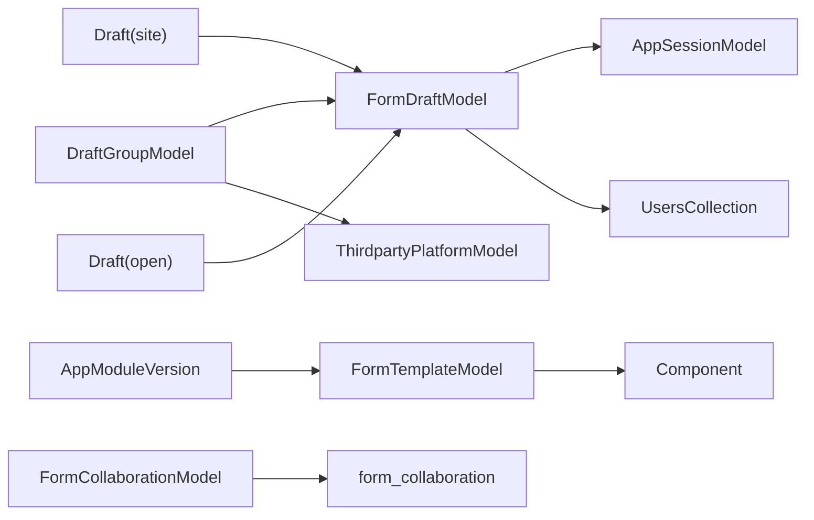

# 表单模板系统

<cite>
**本文引用的文件**
- [FormTemplateModel.php](file://process/src/models/FormTemplateModel.php)
- [FormDraftModel.php](file://process/src/models/FormDraftModel.php)
- [DraftGroupModel.php](file://process/src/models/DraftGroupModel.php)
- [FormCollaborationModel.php](file://process/src/models/FormCollaborationModel.php)
- [AppModuleVersion.php](file://process/src/http/system/AppModuleVersion.php)
- [Draft.php](file://process/src/http/site/Draft.php)
- [Draft.php](file://process/src/http/open/Draft.php)
- [AppSessionModel.php](file://process/src/models/AppSessionModel.php)
- [Component.php](file://process/src/modules/form/components/Component.php)
- [database.sql](file://process/docs/sql/database.sql)
- [migration_20240710_131021_collaboration.php](file://process/src/migrations/migration_20240710_131021_collaboration.php)
- [migration_20251105_darft.php](file://process/src/migrations/migration_20251105_darft.php)
- [migration_20250409_form_template.php](file://process/src/migrations/migration_20250409_form_template.php)
- [ExcelImportTask.php](file://process/src/services/task/ExcelImportTask.php)
- [QysFileSign.php](file://process/src/services/seal_v2/CommonQys/QysFileSign.php)
- [AppModuleWord.php](file://process/src/http/system/AppModuleWord.php)
- [FormValidateException.php](file://process/src/modules/form/FormValidateException.php)
</cite>

## 目录
1. [引言](#引言)
2. [项目结构](#项目结构)
3. [核心组件](#核心组件)
4. [架构总览](#架构总览)
5. [组件详解](#组件详解)
6. [依赖关系分析](#依赖关系分析)
7. [性能与优化](#性能与优化)
8. [故障排查指南](#故障排查指南)
9. [结论](#结论)
10. [附录](#附录)

## 引言
本文件面向表单模板系统，围绕 FormTemplateModel 的模板设计架构、草稿管理、联签机制展开，系统性梳理模板的版本控制、继承与复用策略，可视化编辑、字段配置与布局设计能力，发布流程、权限管理与使用统计，以及模板的导入导出、批量复制与标准化处理方案，并给出性能优化、缓存策略与用户体验改进建议。

## 项目结构
- 模型层：FormTemplateModel、FormDraftModel、DraftGroupModel、FormCollaborationModel 等，负责模板与草稿、协作等数据持久化。
- 控制器层：系统侧与站点侧的草稿与模板接口，如 AppModuleVersion.php、http/site/Draft.php、http/open/Draft.php。
- 运行时与组件：modules/form/components 下的组件体系，支持可视化编辑、字段配置与布局；AppSessionModel 提供变量解析与上下文访问。
- 数据库与迁移：database.sql 与多个 migration 文件定义表结构及演进。
- 签章与协作：seal_v2 与 form_collaboration 支持联签与协作。

**图表来源**
- [FormTemplateModel.php](file://process/src/models/FormTemplateModel.php#L1-L57)
- [FormDraftModel.php](file://process/src/models/FormDraftModel.php#L1-L113)
- [DraftGroupModel.php](file://process/src/models/DraftGroupModel.php#L1-L102)
- [FormCollaborationModel.php](file://process/src/models/FormCollaborationModel.php#L1-L52)
- [AppModuleVersion.php](file://process/src/http/system/AppModuleVersion.php#L370-L483)
- [Draft.php](file://process/src/http/site/Draft.php#L1-L50)
- [Draft.php](file://process/src/http/open/Draft.php#L1-L49)
- [AppSessionModel.php](file://process/src/models/AppSessionModel.php#L1002-L1039)
- [Component.php](file://process/src/modules/form/components/Component.php#L1-L56)
- [database.sql](file://process/docs/sql/database.sql#L234-L272)

**章节来源**
- [FormTemplateModel.php](file://process/src/models/FormTemplateModel.php#L1-L57)
- [FormDraftModel.php](file://process/src/models/FormDraftModel.php#L1-L113)
- [DraftGroupModel.php](file://process/src/models/DraftGroupModel.php#L1-L102)
- [FormCollaborationModel.php](file://process/src/models/FormCollaborationModel.php#L1-L52)
- [AppModuleVersion.php](file://process/src/http/system/AppModuleVersion.php#L370-L483)
- [Draft.php](file://process/src/http/site/Draft.php#L1-L50)
- [Draft.php](file://process/src/http/open/Draft.php#L1-L49)
- [AppSessionModel.php](file://process/src/models/AppSessionModel.php#L1002-L1039)
- [Component.php](file://process/src/modules/form/components/Component.php#L1-L56)
- [database.sql](file://process/docs/sql/database.sql#L234-L272)

## 核心组件
- 模板模型 FormTemplateModel：定义模板字段、类型枚举与保存前校验逻辑，支撑模板的创建、收藏、排序与删除。
- 草稿模型 FormDraftModel：记录单据草稿、自动保存策略、备份删除、变量解析等。
- 草稿分组 DraftGroupModel：按用户与事项维护草稿分组，默认分组生成与批量删除联动清理草稿。
- 协作模型 FormCollaborationModel：记录联签协作数据，支持状态管理与前端展示包装。
- 系统模板接口 AppModuleVersion：提供模板列表、详情、收藏、删除、排序、字段列清单等能力。
- 草稿接口（站点/开放）：提供我的发起草稿列表查询与分页。
- 组件体系 Component：统一抽象组件，支持重复表、数据源绑定、默认值规则等，为模板可视化编辑与字段配置提供基础。

**章节来源**
- [FormTemplateModel.php](file://process/src/models/FormTemplateModel.php#L1-L57)
- [FormDraftModel.php](file://process/src/models/FormDraftModel.php#L1-L113)
- [DraftGroupModel.php](file://process/src/models/DraftGroupModel.php#L1-L102)
- [FormCollaborationModel.php](file://process/src/models/FormCollaborationModel.php#L1-L52)
- [AppModuleVersion.php](file://process/src/http/system/AppModuleVersion.php#L370-L483)
- [Draft.php](file://process/src/http/site/Draft.php#L1-L50)
- [Draft.php](file://process/src/http/open/Draft.php#L1-L49)
- [Component.php](file://process/src/modules/form/components/Component.php#L1-L56)

## 架构总览
模板系统以“模板-草稿-协作-组件”为主线，结合会话上下文与变量解析，形成可编辑、可复用、可协作的表单模板生态。

**图表来源**
- [AppModuleVersion.php](file://process/src/http/system/AppModuleVersion.php#L370-L483)
- [FormTemplateModel.php](file://process/src/models/FormTemplateModel.php#L1-L57)
- [FormDraftModel.php](file://process/src/models/FormDraftModel.php#L1-L113)
- [DraftGroupModel.php](file://process/src/models/DraftGroupModel.php#L1-L102)
- [FormCollaborationModel.php](file://process/src/models/FormCollaborationModel.php#L1-L52)
- [Component.php](file://process/src/modules/form/components/Component.php#L1-L56)

## 组件详解

### 模板设计架构与版本控制
- 模板字段与类型
  - 字段：id、name、type、config、collect、creator、created。
  - 类型枚举：默认(default)、个人(personal)、全部(all)，用于模板可见范围控制。
- 版本控制与复用
  - 模板本身不直接存储版本号；版本控制通过关联的应用版本(AppVersion)与表单版本(form_version)实现。
  - 变量解析在会话(AppSessionModel)中完成，支持跨表单、重复表等复杂表达式访问。
- 可视化编辑与字段配置
  - 组件(Component)体系提供统一抽象，支持基础输入、选择、日期、文件、重复表、数据源绑定等。
  - 字段列清单由系统接口输出，覆盖基础控件、信息控件、动态运算、编号控件等，便于前端构建可视化编辑器。

**图表来源**
- [FormTemplateModel.php](file://process/src/models/FormTemplateModel.php#L1-L57)
- [Component.php](file://process/src/modules/form/components/Component.php#L1-L56)
- [AppSessionModel.php](file://process/src/models/AppSessionModel.php#L1002-L1039)

**章节来源**
- [FormTemplateModel.php](file://process/src/models/FormTemplateModel.php#L1-L57)
- [Component.php](file://process/src/modules/form/components/Component.php#L1-L56)
- [AppModuleWord.php](file://process/src/http/system/AppModuleWord.php#L67-L95)
- [AppSessionModel.php](file://process/src/models/AppSessionModel.php#L1002-L1039)

### 草稿管理与分组
- 自动保存与清理
  - 提供自动保存草稿标识位，支持按应用与创建人查询最近若干条自动保存草稿ID，超出保留数的自动保存草稿会被清理。
- 删除与备份
  - 删除草稿时进行备份记录，确保审计与恢复。
- 分组与默认分组
  - 按用户与应用维护草稿分组，默认分组不存在时自动创建；删除分组时联动清理对应草稿并尝试同步第三方平台。

**图表来源**
- [FormDraftModel.php](file://process/src/models/FormDraftModel.php#L53-L84)
- [DraftGroupModel.php](file://process/src/models/DraftGroupModel.php#L49-L61)

**章节来源**
- [FormDraftModel.php](file://process/src/models/FormDraftModel.php#L53-L84)
- [DraftGroupModel.php](file://process/src/models/DraftGroupModel.php#L49-L61)

### 联签机制与协作
- 协作数据结构
  - 记录会话ID、表单ID、组件key、组件数据、创建人、创建时间与状态，支持初始化与删除标记。
- 联签集成
  - 签章服务根据模板配置与表单版本映射，生成签名区域与填充字段，支持多表单版本配置兼容。

**图表来源**
- [FormCollaborationModel.php](file://process/src/models/FormCollaborationModel.php#L1-L52)
- [migration_20240710_131021_collaboration.php](file://process/src/migrations/migration_20240710_131021_collaboration.php#L1-L33)
- [QysFileSign.php](file://process/src/services/seal_v2/CommonQys/QysFileSign.php#L103-L133)

**章节来源**
- [FormCollaborationModel.php](file://process/src/models/FormCollaborationModel.php#L1-L52)
- [migration_20240710_131021_collaboration.php](file://process/src/migrations/migration_20240710_131021_collaboration.php#L1-L33)
- [QysFileSign.php](file://process/src/services/seal_v2/CommonQys/QysFileSign.php#L103-L133)

### 模板的发布流程、权限管理与使用统计
- 发布与可见范围
  - 通过模板类型(type)控制可见范围：默认(default)、个人(personal)、全部(all)。
- 权限管理
  - 模板收藏使用数组字段维护，支持追加/移除；删除模板仅允许创建者操作。
- 使用统计
  - 收藏人数与是否已收藏字段可用于统计与排序，便于模板推广与检索。

**图表来源**
- [AppModuleVersion.php](file://process/src/http/system/AppModuleVersion.php#L370-L483)
- [FormTemplateModel.php](file://process/src/models/FormTemplateModel.php#L1-L57)

**章节来源**
- [AppModuleVersion.php](file://process/src/http/system/AppModuleVersion.php#L370-L483)
- [FormTemplateModel.php](file://process/src/models/FormTemplateModel.php#L1-L57)

### 可视化编辑、字段配置与布局设计
- 字段列清单
  - 接口返回全部基础控件、信息控件、日期时间、时间范围、手机号码、动态运算、编号控件、合规控件等字段键，便于前端构建字段面板与布局设计器。
- 组件与布局
  - 组件基类提供统一的 key/pKey/description/attr/sort 等属性，支持重复表、数据源绑定、默认值规则等高级特性，为可视化布局与字段配置提供基础。

**章节来源**
- [AppModuleWord.php](file://process/src/http/system/AppModuleWord.php#L67-L95)
- [Component.php](file://process/src/modules/form/components/Component.php#L1-L56)

### 导入导出、批量复制与标准化处理
- 导入导出
  - Excel 导入任务中包含“保存草稿”“实例草稿”“退回”“再次发起”“详情页”“评价”“打印”等开关项，可作为模板发布后的运行期行为配置参考，便于在导入时标准化这些行为。
- 批量复制
  - 通过模板模型的保存与事务封装，可在系统接口中实现批量复制模板（变更名称、重置创建者与收藏数组等），并保持 config 结构一致性。
- 标准化处理
  - 组件字段键命名规范（如 form_{formId}.{key}）与重复表子字段（form_{formId}.{repeatKey}_child）在接口中得到体现，有助于导入导出时的字段映射与校验。

**章节来源**
- [ExcelImportTask.php](file://process/src/services/task/ExcelImportTask.php#L1486-L1519)
- [AppModuleWord.php](file://process/src/http/system/AppModuleWord.php#L67-L95)

### 版本控制、继承关系与复用策略
- 版本控制
  - 模板本身不直接存储版本号；版本控制通过应用版本(AppVersion)与表单版本(form_version)实现，变量解析在会话(AppSessionModel)中完成，支持跨表单、重复表等复杂表达式访问。
- 继承与复用
  - 通过组件(Component)体系与字段键命名规范，模板可复用到不同应用版本与表单版本，实现“模板即配置”的复用策略。

**章节来源**
- [AppSessionModel.php](file://process/src/models/AppSessionModel.php#L1002-L1039)
- [Component.php](file://process/src/modules/form/components/Component.php#L1-L56)

## 依赖关系分析
- 模型间依赖
  - FormTemplateModel 依赖组件体系以承载 config；FormDraftModel 依赖 AppSessionModel 与 UsersCollection 实现变量解析与备份删除；DraftGroupModel 依赖 FormDraftModel 与第三方平台模型实现分组删除联动。
- 控制器依赖
  - 系统模板接口 AppModuleVersion 依赖模板模型与权限校验；站点/开放草稿接口依赖草稿模型与用户上下文。
- 数据库依赖
  - 模板、草稿、协作、序列号规则等表结构在 database.sql 中定义；协作表迁移在 migration_20240710_131021_collaboration.php 中创建索引与表结构。

**图表来源**
- [FormTemplateModel.php](file://process/src/models/FormTemplateModel.php#L1-L57)
- [FormDraftModel.php](file://process/src/models/FormDraftModel.php#L1-L113)
- [DraftGroupModel.php](file://process/src/models/DraftGroupModel.php#L1-L102)
- [AppModuleVersion.php](file://process/src/http/system/AppModuleVersion.php#L370-L483)
- [Draft.php](file://process/src/http/site/Draft.php#L1-L50)
- [Draft.php](file://process/src/http/open/Draft.php#L1-L49)
- [FormCollaborationModel.php](file://process/src/models/FormCollaborationModel.php#L1-L52)
- [database.sql](file://process/docs/sql/database.sql#L234-L272)

**章节来源**
- [FormTemplateModel.php](file://process/src/models/FormTemplateModel.php#L1-L57)
- [FormDraftModel.php](file://process/src/models/FormDraftModel.php#L1-L113)
- [DraftGroupModel.php](file://process/src/models/DraftGroupModel.php#L1-L102)
- [AppModuleVersion.php](file://process/src/http/system/AppModuleVersion.php#L370-L483)
- [Draft.php](file://process/src/http/site/Draft.php#L1-L50)
- [Draft.php](file://process/src/http/open/Draft.php#L1-L49)
- [FormCollaborationModel.php](file://process/src/models/FormCollaborationModel.php#L1-L52)
- [database.sql](file://process/docs/sql/database.sql#L234-L272)

## 性能与优化
- 数据库索引与查询
  - 草稿表与协作表均建立关键字段索引，建议在高并发场景下对 creator/app_id/sess_id 等常用过滤字段保持索引有效性。
- 缓存策略
  - 应用版本(AppVersion)与用户集合(UsersCollection)在运行时频繁使用，建议结合业务热点对常用对象进行缓存预热与失效策略设计。
- 自动保存与清理
  - 对自动保存草稿采用“保留N条+清理多余”的策略，避免草稿表无限增长；删除时进行备份，兼顾性能与审计。
- 变量解析
  - 通过 AppSessionModel 的组件对象解析与表达式访问，建议在渲染前进行必要的字段缓存与重复表索引优化，减少重复计算。

**章节来源**
- [FormDraftModel.php](file://process/src/models/FormDraftModel.php#L53-L84)
- [database.sql](file://process/docs/sql/database.sql#L234-L272)

## 故障排查指南
- 模板保存失败
  - 检查模板名称唯一性与必填参数校验；若提示“模板已存在”，请调整名称后重试。
- 草稿删除异常
  - 删除时会进行备份，若出现异常，请检查备份插入日志与数据库事务状态。
- 协作数据缺失
  - 确认 form_collaboration 表是否存在对应 sess_id 的记录；检查签章服务是否正确读取模板配置与版本映射。
- 组件字段键不匹配
  - 导入导出时需严格遵循字段键命名规范（含重复表子字段），避免因键名不一致导致的数据错配。

**章节来源**
- [FormTemplateModel.php](file://process/src/models/FormTemplateModel.php#L31-L57)
- [FormDraftModel.php](file://process/src/models/FormDraftModel.php#L69-L84)
- [FormCollaborationModel.php](file://process/src/models/FormCollaborationModel.php#L1-L52)
- [AppModuleWord.php](file://process/src/http/system/AppModuleWord.php#L67-L95)

## 结论
表单模板系统以模板模型为核心，结合草稿管理、协作机制与组件体系，实现了从模板设计、版本控制、可视化编辑到发布与使用的全链路能力。通过合理的索引、缓存与清理策略，系统在保证功能完整性的同时兼顾了性能与可维护性。后续可在模板导入导出标准化、批量复制与权限治理方面进一步完善，持续提升用户体验与运营效率。

## 附录
- 数据库表结构参考：模板、草稿、协作、序列号规则等。
- 迁移脚本参考：协作表创建与草稿相关迁移。
- 组件与字段清单：系统接口输出的字段列清单，便于前端构建可视化编辑器。

**章节来源**
- [database.sql](file://process/docs/sql/database.sql#L234-L272)
- [migration_20240710_131021_collaboration.php](file://process/src/migrations/migration_20240710_131021_collaboration.php#L1-L33)
- [migration_20251105_darft.php](file://process/src/migrations/migration_20251105_darft.php#L1-L160)
- [migration_20250409_form_template.php](file://process/src/migrations/migration_20250409_form_template.php#L1-L16)
- [AppModuleWord.php](file://process/src/http/system/AppModuleWord.php#L67-L95)