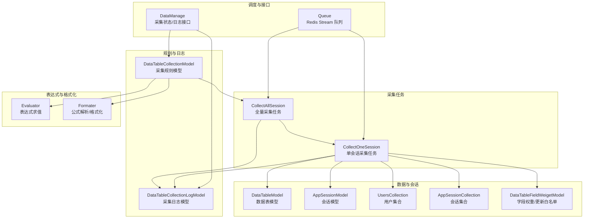
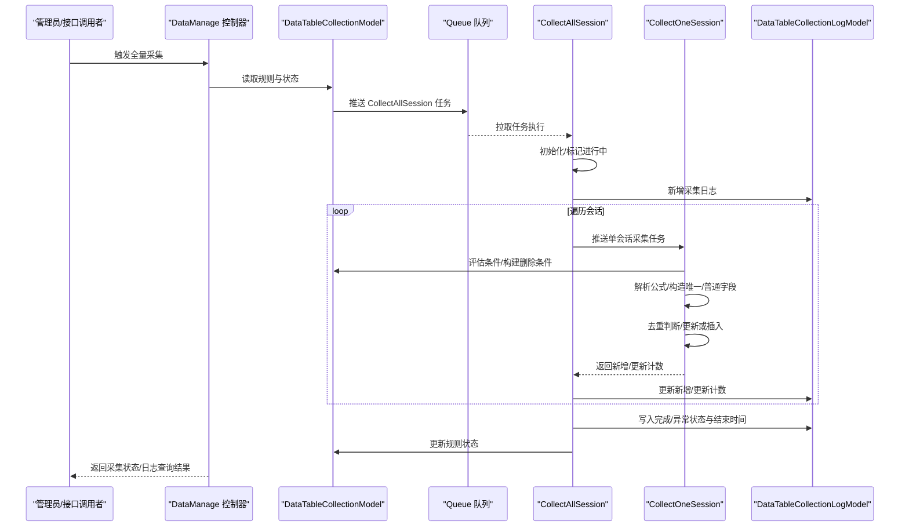
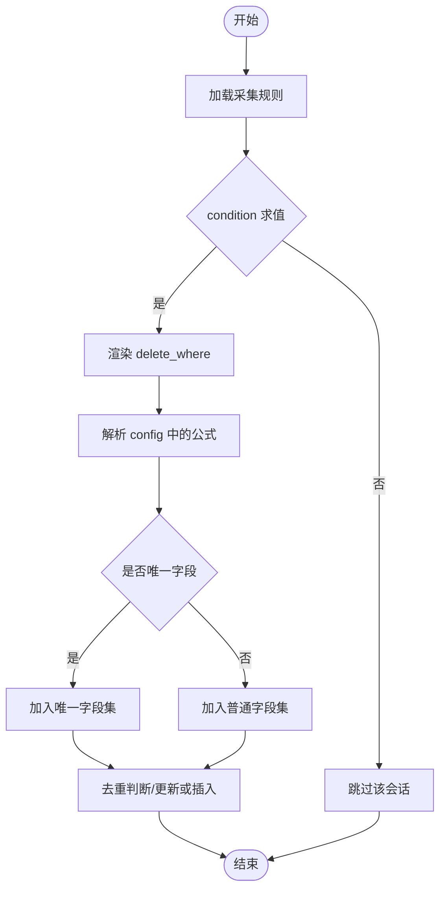
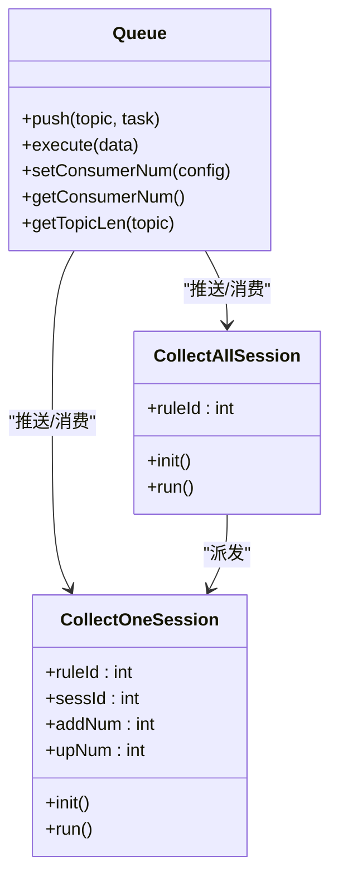
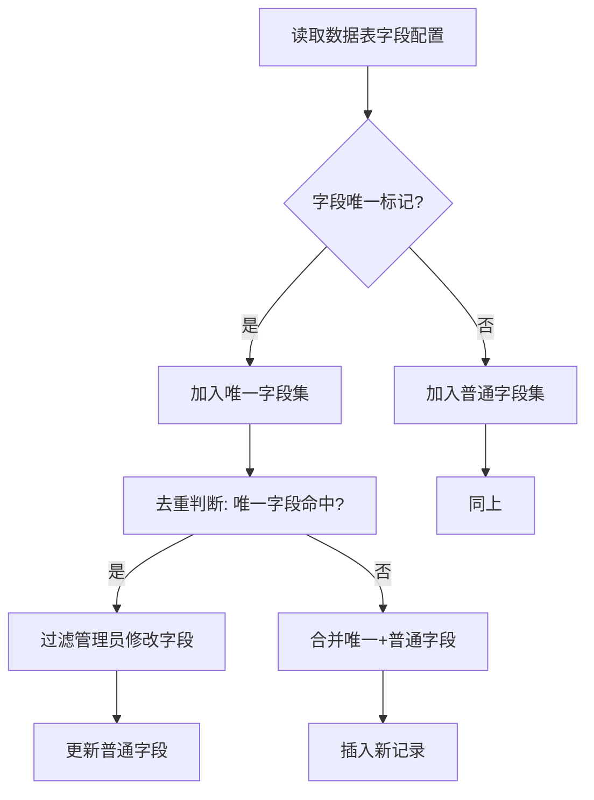
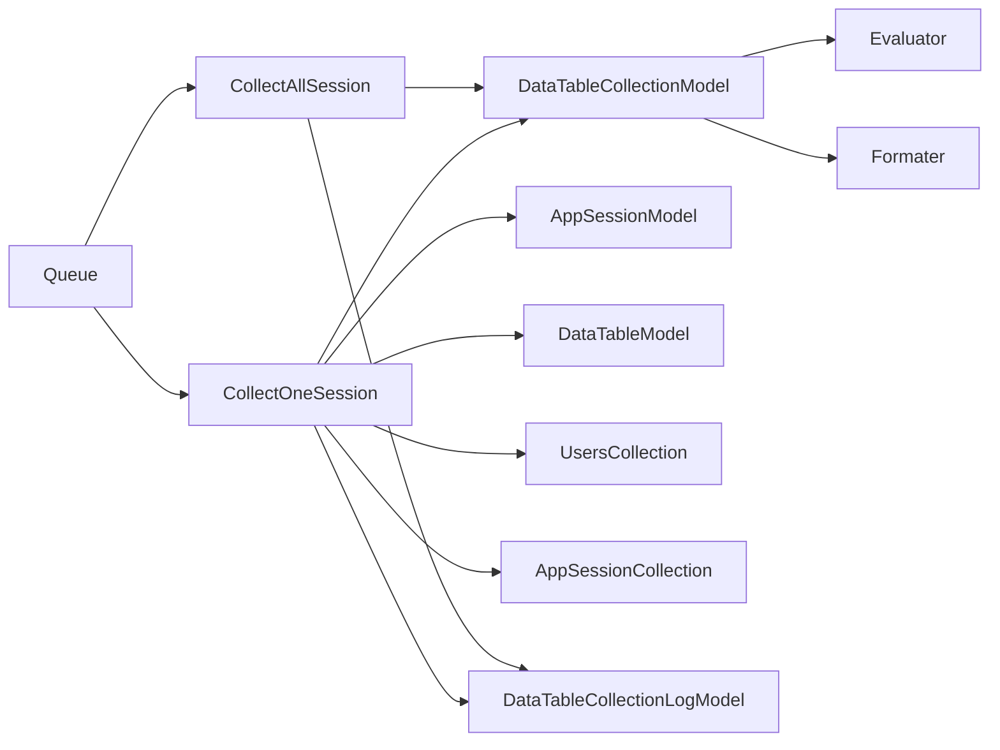

# 表单采集管理

<cite>
**本文引用的文件**
- [DataTableCollectionModel.php](file://process/src/models/DataTableCollectionModel.php)
- [DataTableCollectionLogModel.php](file://process/src/models/DataTableCollectionLogModel.php)
- [CollectAllSession.php](file://process/src/services/task/CollectAllSession.php)
- [CollectOneSession.php](file://process/src/services/task/CollectOneSession.php)
- [Queue.php](file://process/src/components/Queue.php)
- [Evaluator.php](file://process/src/services/expression/Evaluator.php)
- [Formater.php](file://process/src/services/Formater.php)
- [DataTable.php](file://process/src/http/system/DataTable.php)
- [DataManage.php](file://process/src/http/system/DataManage.php)
- [database.sql](file://process/docs/sql/database.sql)
- [DataTableModel.php](file://process/src/models/DataTableModel.php)
- [AppSessionModel.php](file://process/src/models/AppSessionModel.php)
- [DataTableFieldWeigetModel.php](file://process/src/models/DataTableFieldWeigetModel.php)
- [UsersCollection.php](file://process/src/services/UsersCollection.php)
- [AppSessionCollection.php](file://process/src/services/AppSessionCollection.php)
- [DataTableCollection.php](file://process/src/http/system/DataTable.php)
- [DataTableCollectionLogModel.php](file://process/src/models/DataTableCollectionLogModel.php)
- [DataTableCollectionModel.php](file://process/src/models/DataTableCollectionModel.php)
- [CollectAllSession.php](file://process/src/services/task/CollectAllSession.php)
- [CollectOneSession.php](file://process/src/services/task/CollectOneSession.php)
- [Queue.php](file://process/src/components/Queue.php)
- [Evaluator.php](file://process/src/services/expression/Evaluator.php)
- [Formater.php](file://process/src/services/Formater.php)
- [DataTable.php](file://process/src/http/system/DataTable.php)
- [DataManage.php](file://process/src/http/system/DataManage.php)
- [database.sql](file://process/docs/sql/database.sql)
</cite>

## 目录
1. [引言](#引言)
2. [项目结构](#项目结构)
3. [核心组件](#核心组件)
4. [架构总览](#架构总览)
5. [详细组件分析](#详细组件分析)
6. [依赖分析](#依赖分析)
7. [性能考虑](#性能考虑)
8. [故障排查指南](#故障排查指南)
9. [结论](#结论)
10. [附录](#附录)

## 引言
本文件围绕“表单采集管理”主题，系统性梳理数据采集规则配置、数据源对接、实时同步与全量采集、调度与重试、日志与质量控制、去重与数据验证、性能监控与资源优化、以及权限与安全合规等关键能力。重点聚焦于 DataTableCollectionModel 的采集机制、同步策略与日志记录，帮助读者快速理解并高效运维采集体系。

## 项目结构
采集模块由“规则定义模型 + 日志模型 + 采集任务 + 队列调度 + 表达式与格式化引擎 + 数据表与会话模型 + 控制器接口”构成，形成“规则驱动、队列异步、表达式解析、统一落库”的闭环。

图表来源
- [DataTableCollectionModel.php](file://process/src/models/DataTableCollectionModel.php#L1-L134)
- [DataTableCollectionLogModel.php](file://process/src/models/DataTableCollectionLogModel.php#L1-L48)
- [CollectAllSession.php](file://process/src/services/task/CollectAllSession.php#L1-L96)
- [CollectOneSession.php](file://process/src/services/task/CollectOneSession.php#L1-L233)
- [Evaluator.php](file://process/src/services/expression/Evaluator.php#L1-L47)
- [Formater.php](file://process/src/services/Formater.php#L142-L175)
- [DataTableModel.php](file://process/src/models/DataTableModel.php)
- [AppSessionModel.php](file://process/src/models/AppSessionModel.php)
- [UsersCollection.php](file://process/src/services/UsersCollection.php)
- [AppSessionCollection.php](file://process/src/services/AppSessionCollection.php)
- [DataTableFieldWeigetModel.php](file://process/src/models/DataTableFieldWeigetModel.php)
- [Queue.php](file://process/src/components/Queue.php#L1-L173)
- [DataManage.php](file://process/src/http/system/DataManage.php#L802-L840)

章节来源
- [DataTableCollectionModel.php](file://process/src/models/DataTableCollectionModel.php#L1-L134)
- [DataTableCollectionLogModel.php](file://process/src/models/DataTableCollectionLogModel.php#L1-L48)
- [CollectAllSession.php](file://process/src/services/task/CollectAllSession.php#L1-L96)
- [CollectOneSession.php](file://process/src/services/task/CollectOneSession.php#L1-L233)
- [Evaluator.php](file://process/src/services/expression/Evaluator.php#L1-L47)
- [Formater.php](file://process/src/services/Formater.php#L142-L175)
- [Queue.php](file://process/src/components/Queue.php#L1-L173)
- [DataManage.php](file://process/src/http/system/DataManage.php#L802-L840)

## 核心组件
- 采集规则模型：定义采集目标、字段映射、条件过滤、删除条件、类型模式（主表/重复表）、启用状态与采集状态等。
- 采集日志模型：记录每次采集的起止时间、新增/更新数量、最终状态与错误信息。
- 全量采集任务：批量拉取会话ID，逐个派发单会话采集任务，汇总统计并写入日志。
- 单会话采集任务：按规则解析表达式，构造唯一字段与普通字段，执行去重与更新/插入。
- 表达式与格式化：Evaluator 负责条件表达式的语法树解析与求值；Formater 负责公式内容的解析与格式化。
- 队列调度：基于 Redis Stream 的轻量队列，支持不同优先级主题与消费者并发配置。
- 数据与会话：通过 DataTableModel、AppSessionModel、UsersCollection、AppSessionCollection 等模型完成数据表结构、会话上下文与用户信息的访问。
- 控制器接口：提供采集状态查询与采集日志分页查询能力。

章节来源
- [DataTableCollectionModel.php](file://process/src/models/DataTableCollectionModel.php#L1-L134)
- [DataTableCollectionLogModel.php](file://process/src/models/DataTableCollectionLogModel.php#L1-L48)
- [CollectAllSession.php](file://process/src/services/task/CollectAllSession.php#L1-L96)
- [CollectOneSession.php](file://process/src/services/task/CollectOneSession.php#L1-L233)
- [Evaluator.php](file://process/src/services/expression/Evaluator.php#L1-L47)
- [Formater.php](file://process/src/services/Formater.php#L142-L175)
- [Queue.php](file://process/src/components/Queue.php#L1-L173)
- [DataManage.php](file://process/src/http/system/DataManage.php#L802-L840)

## 架构总览
采集流程采用“规则驱动 + 队列异步 + 表达式解析 + 统一落库”的设计。规则模型决定采集范围与字段映射，Evaluator 决定是否采集，Formater 解析公式生成值，CollectOneSession 执行去重与更新/插入，日志模型记录全过程，控制器提供状态与日志查询。

图表来源
- [DataManage.php](file://process/src/http/system/DataManage.php#L802-L840)
- [DataTableCollectionModel.php](file://process/src/models/DataTableCollectionModel.php#L1-L134)
- [Queue.php](file://process/src/components/Queue.php#L1-L173)
- [CollectAllSession.php](file://process/src/services/task/CollectAllSession.php#L1-L96)
- [CollectOneSession.php](file://process/src/services/task/CollectOneSession.php#L1-L233)
- [DataTableCollectionLogModel.php](file://process/src/models/DataTableCollectionLogModel.php#L1-L48)

## 详细组件分析

### 采集规则配置与表达式/格式化
- 规则字段
  - config：字段映射规则数组，包含目标字段、字段名与公式内容。
  - type：采集模式（主表/重复表），以及重复表标识等。
  - condition：采集条件表达式，使用 Evaluator 解析。
  - delete_where：删除条件模板，运行时通过 Formater 渲染为实际 where 条件。
  - enable/status/is_default：规则启用、采集状态与默认规则标记。
- 表达式求值
  - Evaluator 将表达式转为语法树并求值，支持复杂布尔组合。
- 公式解析
  - Formater 负责解析公式字符串，支持表单字段、重复表字段、函数等，必要时进行 XSS 处理。

图表来源
- [DataTableCollectionModel.php](file://process/src/models/DataTableCollectionModel.php#L1-L134)
- [Evaluator.php](file://process/src/services/expression/Evaluator.php#L1-L47)
- [Formater.php](file://process/src/services/Formater.php#L142-L175)
- [CollectOneSession.php](file://process/src/services/task/CollectOneSession.php#L1-L233)

章节来源
- [DataTableCollectionModel.php](file://process/src/models/DataTableCollectionModel.php#L1-L134)
- [Evaluator.php](file://process/src/services/expression/Evaluator.php#L1-L47)
- [Formater.php](file://process/src/services/Formater.php#L142-L175)
- [CollectOneSession.php](file://process/src/services/task/CollectOneSession.php#L1-L233)

### 数据源对接与实时同步
- 数据源
  - 会话数据来源于 AppSessionModel，结合 UsersCollection 提供创建人信息。
  - 数据表结构来源于 DataTableModel，字段配置决定可采集字段与唯一性。
- 实时同步
  - 通过队列推送 CollectAllSession/CollectOneSession 任务，异步执行，避免阻塞主线程。
  - 支持测试数据过滤、会话状态过滤等，确保只采集有效数据。

章节来源
- [CollectAllSession.php](file://process/src/services/task/CollectAllSession.php#L1-L96)
- [CollectOneSession.php](file://process/src/services/task/CollectOneSession.php#L1-L233)
- [AppSessionModel.php](file://process/src/models/AppSessionModel.php)
- [DataTableModel.php](file://process/src/models/DataTableModel.php)
- [UsersCollection.php](file://process/src/services/UsersCollection.php)
- [AppSessionCollection.php](file://process/src/services/AppSessionCollection.php)

### 同步策略与调度管理
- 主题与并发
  - 队列支持 low/common/high 三级主题，便于区分任务优先级。
  - 通过 setConsumerNum 动态调整消费者数量，实现弹性扩容。
- 任务派发
  - 全量采集：CollectAllSession 读取规则，筛选会话ID，逐个派发 CollectOneSession。
  - 单会话采集：CollectOneSession 在会话上下文中解析规则，执行去重与入库。
- 重试与忽略
  - 若规则未配置或采集已在进行，任务直接忽略，避免重复执行。

图表来源
- [Queue.php](file://process/src/components/Queue.php#L1-L173)
- [CollectAllSession.php](file://process/src/services/task/CollectAllSession.php#L1-L96)
- [CollectOneSession.php](file://process/src/services/task/CollectOneSession.php#L1-L233)

章节来源
- [Queue.php](file://process/src/components/Queue.php#L1-L173)
- [CollectAllSession.php](file://process/src/services/task/CollectAllSession.php#L1-L96)
- [CollectOneSession.php](file://process/src/services/task/CollectOneSession.php#L1-L233)

### 日志记录与状态管理
- 日志模型
  - 记录规则ID、名称、起止时间、新增/更新数量、消息与状态（进行中/完成/异常）。
- 状态流转
  - 全量采集任务启动时写入“进行中”，完成后写入“完成”或“异常”，同时更新规则状态为“完成”。

章节来源
- [DataTableCollectionLogModel.php](file://process/src/models/DataTableCollectionLogModel.php#L1-L48)
- [CollectAllSession.php](file://process/src/services/task/CollectAllSession.php#L1-L96)
- [DataTableCollectionModel.php](file://process/src/models/DataTableCollectionModel.php#L1-L134)

### 错误重试与异常处理
- 条件表达式异常
  - Evaluator 在解析失败时抛出异常并记录日志，保证规则有效性。
- 公式解析异常
  - Formater 在无法转换为字符串或函数语法错误时抛出异常，阻止脏数据入库。
- 单会话采集容错
  - CollectAllSession 对每个会话的采集异常进行捕获并汇总，不影响整体流程。
- 控制器查询
  - DataManage 提供采集状态与日志查询接口，便于定位问题。

章节来源
- [Evaluator.php](file://process/src/services/expression/Evaluator.php#L1-L47)
- [Formater.php](file://process/src/services/Formater.php#L142-L175)
- [CollectAllSession.php](file://process/src/services/task/CollectAllSession.php#L1-L96)
- [DataManage.php](file://process/src/http/system/DataManage.php#L802-L840)

### 数据质量控制、去重策略与验证规则
- 唯一性约束
  - 依据数据表字段配置的唯一标记，构造唯一字段集合用于去重判断。
- 更新白名单
  - 管理员修改过的字段不可被自动更新，通过字段权重模型过滤普通字段集合。
- 默认值与空值处理
  - 公式解析为空或 null 时回退到允许类型的默认值，保障入库完整性。
- 重复表采集
  - 支持重复表字段采集，通过 foreachRepeatTable 遍历重复行，逐行解析并入库。
- 数据表字段存在性校验
  - 通过 DataTableModel 的 config 字段判断字段是否存在，避免无效字段写入。

图表来源
- [CollectOneSession.php](file://process/src/services/task/CollectOneSession.php#L1-L233)
- [DataTableFieldWeigetModel.php](file://process/src/models/DataTableFieldWeigetModel.php)
- [DataTableModel.php](file://process/src/models/DataTableModel.php)

章节来源
- [CollectOneSession.php](file://process/src/services/task/CollectOneSession.php#L1-L233)
- [DataTableFieldWeigetModel.php](file://process/src/models/DataTableFieldWeigetModel.php)
- [DataTableModel.php](file://process/src/models/DataTableModel.php)

### 采集性能监控与资源优化
- 队列长度监控
  - 通过 getTopicLen 获取各主题队列长度，评估积压情况。
- 并发调优
  - setConsumerNum 动态调整消费者数量，结合业务高峰与资源水位弹性扩缩容。
- 内存与超时
  - 全量任务中临时提升内存限制，避免大批量处理时内存不足；注意合理拆分任务粒度。
- 日志聚合
  - 将异常信息汇总写入日志模型，便于后续离线分析与报警。

章节来源
- [Queue.php](file://process/src/components/Queue.php#L1-L173)
- [CollectAllSession.php](file://process/src/services/task/CollectAllSession.php#L1-L96)

### 权限控制、数据安全与合规
- 数据权限
  - 通过数据权限辅助工具构建 where 条件，结合用户角色与数据授权范围，确保仅可见/可操作授权数据。
- 字段级脱敏
  - 在展示层对敏感字段进行脱敏处理，降低数据泄露风险。
- 合规性
  - 采集规则需明确目的与范围，遵循最小必要原则；日志保留与清理需符合数据生命周期管理。

章节来源
- [DataTable.php](file://process/src/http/system/DataTable.php#L1980-L2010)
- [DataTable.php](file://process/src/http/system/DataTable.php)

## 依赖分析
- 规则模型依赖表达式与格式化引擎，用于条件与公式解析。
- 采集任务依赖会话与数据表模型，以及用户集合与会话集合。
- 日志模型贯穿全链路，记录状态与错误。
- 队列组件提供跨进程/跨实例的任务分发能力。

图表来源
- [DataTableCollectionModel.php](file://process/src/models/DataTableCollectionModel.php#L1-L134)
- [Evaluator.php](file://process/src/services/expression/Evaluator.php#L1-L47)
- [Formater.php](file://process/src/services/Formater.php#L142-L175)
- [CollectAllSession.php](file://process/src/services/task/CollectAllSession.php#L1-L96)
- [CollectOneSession.php](file://process/src/services/task/CollectOneSession.php#L1-L233)
- [DataTableCollectionLogModel.php](file://process/src/models/DataTableCollectionLogModel.php#L1-L48)
- [Queue.php](file://process/src/components/Queue.php#L1-L173)

章节来源
- [DataTableCollectionModel.php](file://process/src/models/DataTableCollectionModel.php#L1-L134)
- [CollectAllSession.php](file://process/src/services/task/CollectAllSession.php#L1-L96)
- [CollectOneSession.php](file://process/src/services/task/CollectOneSession.php#L1-L233)
- [DataTableCollectionLogModel.php](file://process/src/models/DataTableCollectionLogModel.php#L1-L48)
- [Queue.php](file://process/src/components/Queue.php#L1-L173)

## 性能考虑
- 任务拆分：将全量采集拆分为单会话任务，避免长事务与内存峰值。
- 并发控制：根据队列长度与 CPU/内存水位动态调整消费者数量。
- I/O 优化：批量写入与去重查询尽量走索引，减少回表。
- 缓存利用：规则与数据表模型使用缓存，降低数据库压力。
- 超时与重试：为长时间任务设置超时与重试策略，避免僵尸任务。

## 故障排查指南
- 采集状态查询
  - 通过 DataManage 的采集状态接口确认规则是否处于“进行中/完成/禁用”。
- 日志定位
  - 使用采集日志接口查询起止时间、新增/更新数量与错误消息，定位异常批次。
- 表达式/公式问题
  - 检查规则 condition 与 config 中公式是否正确，关注 Evaluator 与 Formater 抛出的异常信息。
- 队列积压
  - 查看各主题队列长度，必要时增加消费者数量或优化任务耗时。
- 去重与更新异常
  - 核对数据表字段唯一标记与管理员修改字段白名单，确保更新逻辑符合预期。

章节来源
- [DataManage.php](file://process/src/http/system/DataManage.php#L802-L840)
- [DataTableCollectionLogModel.php](file://process/src/models/DataTableCollectionLogModel.php#L1-L48)
- [Evaluator.php](file://process/src/services/expression/Evaluator.php#L1-L47)
- [Formater.php](file://process/src/services/Formater.php#L142-L175)
- [Queue.php](file://process/src/components/Queue.php#L1-L173)

## 结论
本采集体系以规则模型为核心，结合表达式与格式化引擎，通过队列异步化实现高吞吐、可扩展的表单数据采集。完善的日志与状态管理、去重与更新白名单、权限与脱敏机制，共同保障了数据质量与安全合规。建议在生产环境中持续监控队列积压、消费者并发与异常日志，配合定期审计与权限校验，确保采集系统的稳定与可靠。

## 附录
- 数据库表结构参考
  - 采集规则表与采集日志表的字段定义与含义可参考数据库脚本。

章节来源
- [database.sql](file://process/docs/sql/database.sql#L1218-L1254)