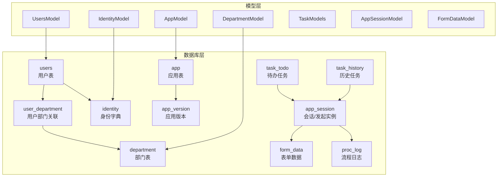
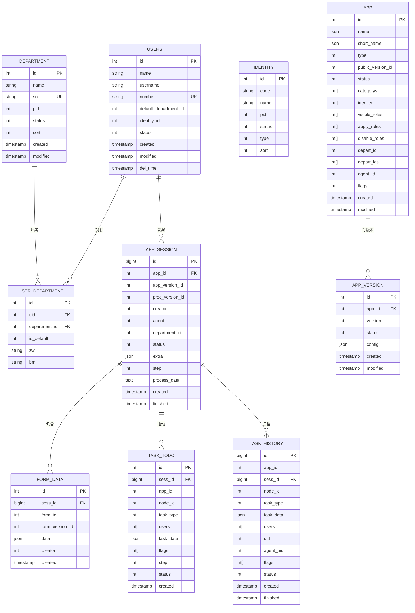
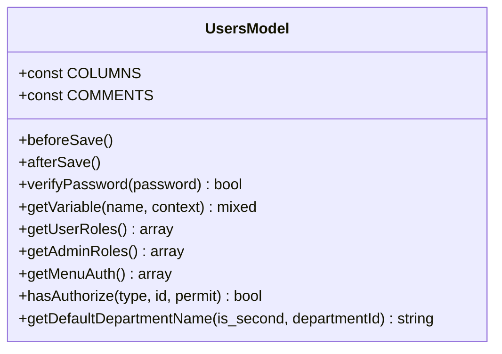
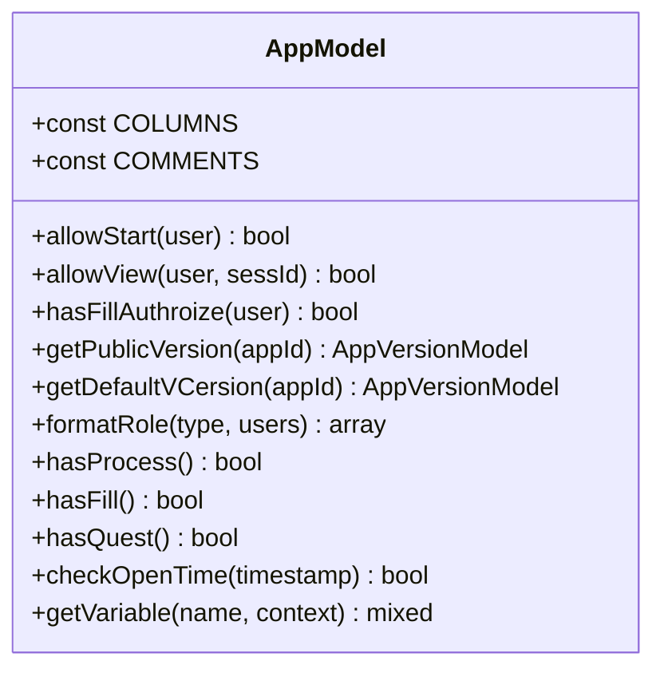
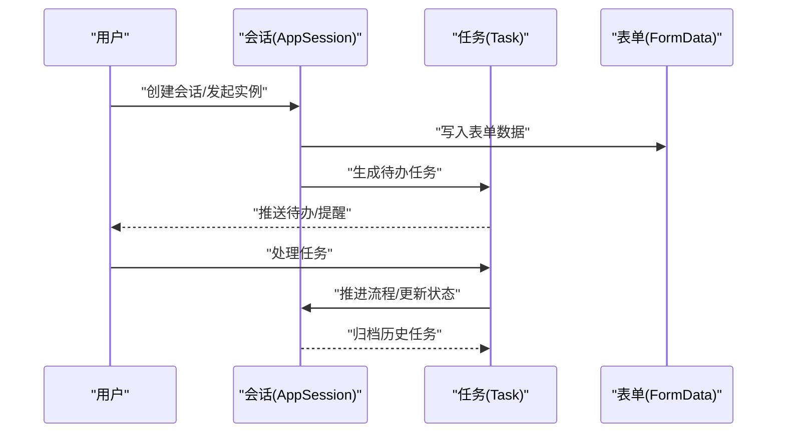
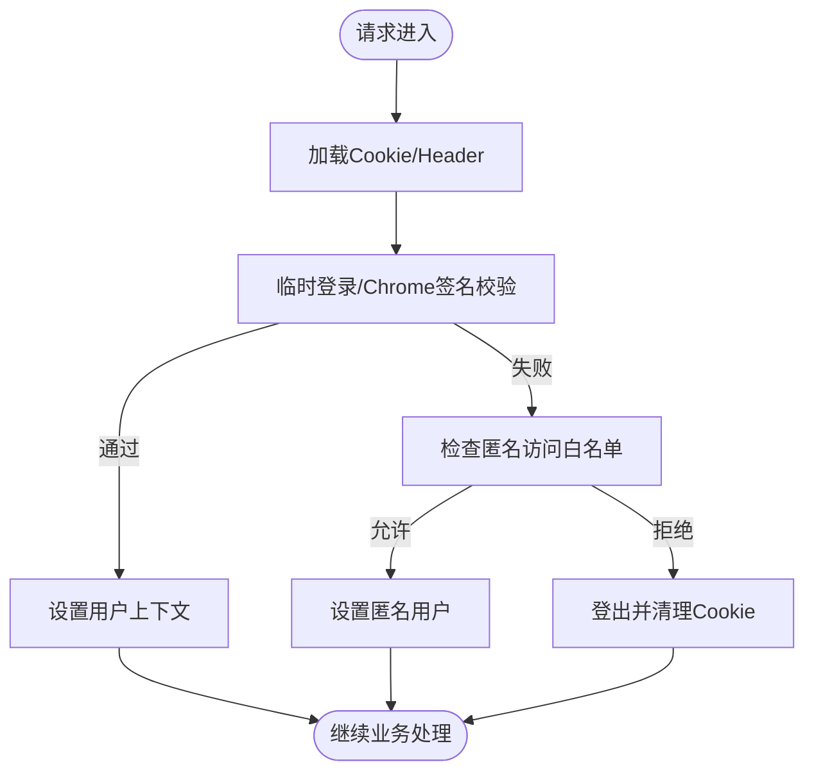
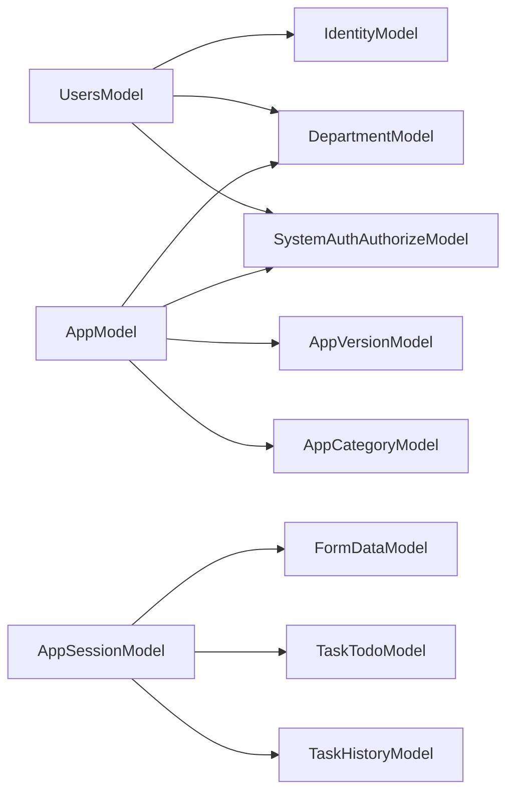

# 核心数据模型

<cite>
**本文引用的文件**
- [database.sql](file://process/docs/sql/database.sql)
- [init.sql](file://process/docs/sql/init.sql)
- [UsersModel.php](file://process/src/models/UsersModel.php)
- [AppModel.php](file://process/src/models/AppModel.php)
- [User.php](file://process/src/components/User.php)
</cite>

## 目录
1. [简介](#简介)
2. [项目结构](#项目结构)
3. [核心组件](#核心组件)
4. [架构总览](#架构总览)
5. [详细组件分析](#详细组件分析)
6. [依赖分析](#依赖分析)
7. [性能考量](#性能考量)
8. [故障排查指南](#故障排查指南)
9. [结论](#结论)
10. [附录](#附录)

## 简介
本文件聚焦于系统的核心数据模型，围绕“用户模型”“应用模型”“任务模型”等关键业务实体，系统梳理其设计原理、字段定义、数据类型、实体关系映射、外键约束与级联行为，并结合模型的生命周期管理（含软删除与审计）、数据验证与业务规则、常用查询与关联聚合方法，以及常见问题排查建议，帮助读者全面理解并高效使用这些模型。

## 项目结构
- 数据库结构由 SQL 脚本定义，涵盖用户、部门、身份、应用、流程、任务、消息、第三方平台等核心表。
- 模型层位于 src/models，采用统一的基类与缓存策略，提供字段元数据、验证、序列化、变量解析等能力。
- 认证与用户上下文由 src/components/User 管理，负责登录态、匿名访问控制、测试态模拟等。

图表来源
- [database.sql](file://process/docs/sql/database.sql#L582-L603)
- [database.sql](file://process/docs/sql/database.sql#L628-L649)
- [database.sql](file://process/docs/sql/database.sql#L720-L739)
- [database.sql](file://process/docs/sql/database.sql#L24-L52)
- [database.sql](file://process/docs/sql/database.sql#L68-L81)
- [database.sql](file://process/docs/sql/database.sql#L320-L361)
- [database.sql](file://process/docs/sql/database.sql#L340-L361)
- [database.sql](file://process/docs/sql/database.sql#L176-L195)
- [database.sql](file://process/docs/sql/database.sql#L213-L221)
- [database.sql](file://process/docs/sql/database.sql#L280-L290)

章节来源
- [database.sql](file://process/docs/sql/database.sql#L582-L603)
- [database.sql](file://process/docs/sql/database.sql#L628-L649)
- [database.sql](file://process/docs/sql/database.sql#L720-L739)
- [database.sql](file://process/docs/sql/database.sql#L24-L52)
- [database.sql](file://process/docs/sql/database.sql#L68-L81)
- [database.sql](file://process/docs/sql/database.sql#L320-L361)
- [database.sql](file://process/docs/sql/database.sql#L340-L361)
- [database.sql](file://process/docs/sql/database.sql#L176-L195)
- [database.sql](file://process/docs/sql/database.sql#L213-L221)
- [database.sql](file://process/docs/sql/database.sql#L280-L290)

## 核心组件
- 用户模型 UsersModel
  - 字段与类型：整型主键、字符串姓名/用户名/头像、枚举状态、时间戳创建/修改、字符串手机号/邮箱、可空删除时间、整型创建人、字符串外部唯一标识、整型默认部门、字符串身份类型、整型来源类型、整型同步标志、整型排序等。
  - 关键能力：字段验证、保存前后钩子、变量解析（支持“user.*”“creator.*”）、角色体系（登录/成员/身份/部门/岗位/团队等）、授权与菜单权限计算、默认部门名称解析、码表字段值解析。
- 应用模型 AppModel
  - 字段与类型：JSON 名称/简称、整型类型（表单/流程/第三方）、整型公开版本ID、整型状态、字符串数组关键词、整型管理部门、整型数组分类/身份/可见/申请/禁用角色、文本描述、JSON 属性、数值评分、整型排序、整型代理消息ID、整型标记位、JSON 测试/模拟用户、整型数组服务部门ID、时间戳创建/修改等。
  - 关键能力：发布版本选择、流程/表单/问卷标志位管理、可见/申请/禁用角色格式化、发起/查看权限判定、开放时间校验、变量解析（支持“app.*”）。
- 任务模型 TaskModels
  - 表 task_todo 与 task_history：待办/历史任务，包含会话ID、应用ID、节点ID、任务类型、用户数组、任务数据、状态标志、创建/完成时间等；历史表主键与待办一致，便于归档与检索。
  - 关联关系：与 app_session 关联，支撑流程实例与任务生命周期管理。
- 会话模型 AppSessionModel
  - 表 app_session：记录一次“发起”实例，包含应用/版本/流程版本、发起人/代发起人、部门、匿名标志、状态、额外信息、步骤、流程数据、创建/完成时间等；配合 form_data 存储表单数据。
- 表单数据模型 FormDataModel
  - 表 form_data：按会话+组件维度存储 JSON 数据，支持草稿与变更追踪（form_draft/form_data_change）。

章节来源
- [UsersModel.php](file://process/src/models/UsersModel.php#L128-L172)
- [UsersModel.php](file://process/src/models/UsersModel.php#L228-L247)
- [AppModel.php](file://process/src/models/AppModel.php#L54-L81)
- [AppModel.php](file://process/src/models/AppModel.php#L202-L252)
- [database.sql](file://process/docs/sql/database.sql#L320-L361)
- [database.sql](file://process/docs/sql/database.sql#L340-L361)
- [database.sql](file://process/docs/sql/database.sql#L176-L195)
- [database.sql](file://process/docs/sql/database.sql#L213-L221)

## 架构总览
下图展示用户、应用、任务、会话、表单数据之间的关系与典型交互路径。

图表来源
- [database.sql](file://process/docs/sql/database.sql#L582-L603)
- [database.sql](file://process/docs/sql/database.sql#L628-L649)
- [database.sql](file://process/docs/sql/database.sql#L720-L739)
- [database.sql](file://process/docs/sql/database.sql#L24-L52)
- [database.sql](file://process/docs/sql/database.sql#L68-L81)
- [database.sql](file://process/docs/sql/database.sql#L176-L195)
- [database.sql](file://process/docs/sql/database.sql#L213-L221)
- [database.sql](file://process/docs/sql/database.sql#L320-L361)
- [database.sql](file://process/docs/sql/database.sql#L340-L361)

## 详细组件分析

### 用户模型 UsersModel
- 设计要点
  - 字段元数据与注释：通过常量定义字段类型与中文注释，便于统一校验与文档生成。
  - 验证与保存：新建时对关键字段进行必填校验，并检查用户名/工号唯一性；更新时自动写入修改时间。
  - 变量解析：支持“user.*”“creator.*”表达式，动态解析用户基础字段、部门信息、身份信息等。
  - 角色与授权：构建登录/成员/身份/部门/岗位/团队等多维角色集合，结合授权表计算菜单权限与资源授权。
  - 前端缓存：保存后清理前端缓存键，保证界面数据一致性。
- 关键字段与类型
  - 主键 id、字符串 name/username/avatar、整型 identity_id、字符串 identity_type、整型 default_department_id、字符串 number、整型 status、时间戳 created/modified/del_time、整型 creator、整型 source_type/is_sync、整型 sort。
- 生命周期与软删除
  - 通过 del_time 字段实现软删除；在加载与鉴权时需过滤该状态。
- 常用查询与聚合
  - 基于角色/授权的批量查询：结合用户角色数组与授权表进行权限过滤。
  - 部门/身份维度统计：利用 department_id 与 identity_id 进行分组统计。
- 业务规则
  - 密码校验：提供哈希校验方法；字段中存储加密值。
  - 默认部门名称解析：支持一级/二级单位名称获取。
  - 码表字段：通过字典表映射返回人类可读值。

图表来源
- [UsersModel.php](file://process/src/models/UsersModel.php#L128-L172)
- [UsersModel.php](file://process/src/models/UsersModel.php#L228-L247)
- [UsersModel.php](file://process/src/models/UsersModel.php#L299-L315)
- [UsersModel.php](file://process/src/models/UsersModel.php#L436-L497)
- [UsersModel.php](file://process/src/models/UsersModel.php#L536-L561)
- [UsersModel.php](file://process/src/models/UsersModel.php#L675-L731)

章节来源
- [UsersModel.php](file://process/src/models/UsersModel.php#L128-L172)
- [UsersModel.php](file://process/src/models/UsersModel.php#L228-L247)
- [UsersModel.php](file://process/src/models/UsersModel.php#L299-L315)
- [UsersModel.php](file://process/src/models/UsersModel.php#L436-L497)
- [UsersModel.php](file://process/src/models/UsersModel.php#L536-L561)
- [UsersModel.php](file://process/src/models/UsersModel.php#L675-L731)

### 应用模型 AppModel
- 设计要点
  - JSON 字段：名称/简称采用 JSON 存储多语言值；属性 attributes 为 JSON 结构，承载复杂配置。
  - 标记位：flags 以位运算标记是否具备流程/表单/问卷等功能。
  - 权限控制：通过 visible_roles/apply_roles/disable_roles 三类角色数组控制可见/申请/禁用范围。
  - 发布版本：public_version_id 指向已发布版本；若无则回退到最新版本。
  - 开放时间：attributes.base.open_time 支持按日/周/月/年/自定义时间段开放。
- 关键字段与类型
  - JSON name/short_name、整型 type/public_version_id/status、字符串数组 keywords、整型数组 categorys/identity/visible_roles/apply_roles/disable_roles、整型 depart_id、JSON attributes、数值 star、整型 sort、整型 agent_id、整型 flags、JSON simulate_users/test_users、整型数组 depart_ids、时间戳 created/modified。
- 生命周期与发布
  - 新建应用时初始化统计数据条目；变更管理部门时自动注入对应部门管理员授权。
- 常用查询与聚合
  - 基于可见角色与禁用角色过滤的应用列表；按部门/分类/身份维度统计。
  - 服务大厅展示配置：根据站点配置决定来源部门与排序规则。
- 业务规则
  - 发起/查看权限：综合角色、授权、测试/模拟用户、实例审批人等判定。
  - 功能标志：提供 hasProcess/hasFill/hasQuest 等便捷方法。

图表来源
- [AppModel.php](file://process/src/models/AppModel.php#L54-L81)
- [AppModel.php](file://process/src/models/AppModel.php#L202-L252)
- [AppModel.php](file://process/src/models/AppModel.php#L467-L488)
- [AppModel.php](file://process/src/models/AppModel.php#L491-L500)
- [AppModel.php](file://process/src/models/AppModel.php#L555-L584)
- [AppModel.php](file://process/src/models/AppModel.php#L652-L750)

章节来源
- [AppModel.php](file://process/src/models/AppModel.php#L54-L81)
- [AppModel.php](file://process/src/models/AppModel.php#L202-L252)
- [AppModel.php](file://process/src/models/AppModel.php#L467-L488)
- [AppModel.php](file://process/src/models/AppModel.php#L491-L500)
- [AppModel.php](file://process/src/models/AppModel.php#L555-L584)
- [AppModel.php](file://process/src/models/AppModel.php#L652-L750)

### 任务模型与会话模型
- 任务模型
  - task_todo：待办任务，包含会话ID、应用ID、节点ID、任务类型、用户数组、任务数据、状态标志、步骤、状态、创建时间。
  - task_history：历史任务，主键与待办一致，记录完成时间、经办人、代理经办人等。
- 会话模型
  - app_session：一次“发起”的完整上下文，包含应用/版本/流程版本、发起人/代发起人、部门、匿名标志、状态、额外信息、步骤、流程数据、创建/完成时间。
- 关联关系
  - 任务与会话：通过 sess_id 关联，支撑流程推进与任务归档。
  - 会话与表单：通过 form_data 存储各组件的数据快照与变更。

图表来源
- [database.sql](file://process/docs/sql/database.sql#L320-L361)
- [database.sql](file://process/docs/sql/database.sql#L340-L361)
- [database.sql](file://process/docs/sql/database.sql#L176-L195)
- [database.sql](file://process/docs/sql/database.sql#L213-L221)

章节来源
- [database.sql](file://process/docs/sql/database.sql#L320-L361)
- [database.sql](file://process/docs/sql/database.sql#L340-L361)
- [database.sql](file://process/docs/sql/database.sql#L176-L195)
- [database.sql](file://process/docs/sql/database.sql#L213-L221)

### 用户上下文与认证组件
- 组件 User
  - 登录态管理：基于 Cookie 与 Redis Salt 实现登录态校验与刷新；支持设备区分与跨域场景。
  - 匿名访问控制：针对特定 URI 放行匿名访问，并校验应用允许匿名与 IP 白名单。
  - 测试态模拟：支持测试用户对目标用户进行模拟登录，便于联调与预览。
  - 令牌与第三方票据：支持平台票据校验与登出联动。
- 与模型的协作
  - 登录成功后将 UsersModel 实例注入上下文；鉴权失败抛出异常并终止流程。

图表来源
- [User.php](file://process/src/components/User.php#L286-L351)
- [User.php](file://process/src/components/User.php#L120-L155)
- [User.php](file://process/src/components/User.php#L170-L210)
- [User.php](file://process/src/components/User.php#L386-L428)

章节来源
- [User.php](file://process/src/components/User.php#L286-L351)
- [User.php](file://process/src/components/User.php#L120-L155)
- [User.php](file://process/src/components/User.php#L170-L210)
- [User.php](file://process/src/components/User.php#L386-L428)

## 依赖分析
- 模型间耦合
  - UsersModel 依赖 IdentityModel、DepartmentModel、SystemAuthAuthorizeModel 等进行角色与授权计算。
  - AppModel 依赖 AppVersionModel、AppCategoryModel、DepartmentModel、SystemAuthAuthorizeModel 等进行版本与权限控制。
  - 任务/会话/表单模型通过外键与 app_session 关联，形成流程实例的数据闭环。
- 外键与索引
  - users.number 唯一索引；department.sn 唯一索引；app_session 与 task_* 通过 sess_id 关联；form_data 通过 sess_id+form_id 建立复合索引。
- 级联行为
  - 数据库层面未显式声明级联删除；软删除通过 del_time 字段实现，业务侧需在查询时过滤。
- 外部依赖
  - Redis 用于登录盐值与短期缓存；YAML 配置用于登录过期、Cookie SameSite 等策略。

图表来源
- [UsersModel.php](file://process/src/models/UsersModel.php#L436-L497)
- [AppModel.php](file://process/src/models/AppModel.php#L467-L488)
- [database.sql](file://process/docs/sql/database.sql#L176-L195)
- [database.sql](file://process/docs/sql/database.sql#L213-L221)
- [database.sql](file://process/docs/sql/database.sql#L320-L361)
- [database.sql](file://process/docs/sql/database.sql#L340-L361)

章节来源
- [UsersModel.php](file://process/src/models/UsersModel.php#L436-L497)
- [AppModel.php](file://process/src/models/AppModel.php#L467-L488)
- [database.sql](file://process/docs/sql/database.sql#L176-L195)
- [database.sql](file://process/docs/sql/database.sql#L213-L221)
- [database.sql](file://process/docs/sql/database.sql#L320-L361)
- [database.sql](file://process/docs/sql/database.sql#L340-L361)

## 性能考量
- 查询优化
  - 利用 Gin 索引与数组操作符加速角色/身份/关键词等过滤。
  - 对高频字段（如 users.username、users.number、department.sn）建立唯一/普通索引。
- 缓存策略
  - 模型层普遍采用缓存键与前端缓存键，保存后主动清理，降低重复查询成本。
- 写入优化
  - 批量授权注入与事务后回调减少多次查询。
- 日志与可观测
  - 关键流程（如开放时间校验、权限判定）增加日志输出，便于定位性能瓶颈。

## 故障排查指南
- 登录态异常
  - 检查 Cookie 与 Redis Salt 是否匹配；确认 SameSite/Secure 配置与协议一致。
  - 若跨平台票据失效，确认第三方平台对象的票据校验逻辑。
- 权限误判
  - 核对 visible_roles/apply_roles/disable_roles 与用户角色集合的交集关系；确认授权表 roles 字段是否包含所需键。
  - 检查是否存在测试/模拟用户导致的例外放行。
- 数据不一致
  - 确认软删除过滤条件；核对保存后缓存清理逻辑是否执行。
- 开放时间判定错误
  - 校验 attributes.base.open_time 配置与当前时间戳转换是否正确；检查节假日缓存键与缓存有效期。

章节来源
- [User.php](file://process/src/components/User.php#L286-L351)
- [UsersModel.php](file://process/src/models/UsersModel.php#L536-L561)
- [AppModel.php](file://process/src/models/AppModel.php#L652-L750)

## 结论
本核心数据模型以清晰的表结构与严谨的模型层实现为基础，结合角色/授权、变量解析、缓存与事务后回调等机制，实现了用户、应用、任务、会话与表单数据的有机协同。通过合理的字段设计、索引策略与业务规则封装，既满足了复杂的权限与流程需求，又兼顾了性能与可维护性。建议在扩展新功能时遵循现有模型约定，确保字段语义一致、验证与缓存策略统一。

## 附录
- 初始化数据
  - crontab、第三方平台、微信 Agent、消息类型、字典项、身份与身份属性、应用分类等初始化数据，为系统运行提供基础配置。

章节来源
- [init.sql](file://process/docs/sql/init.sql#L1-L86)