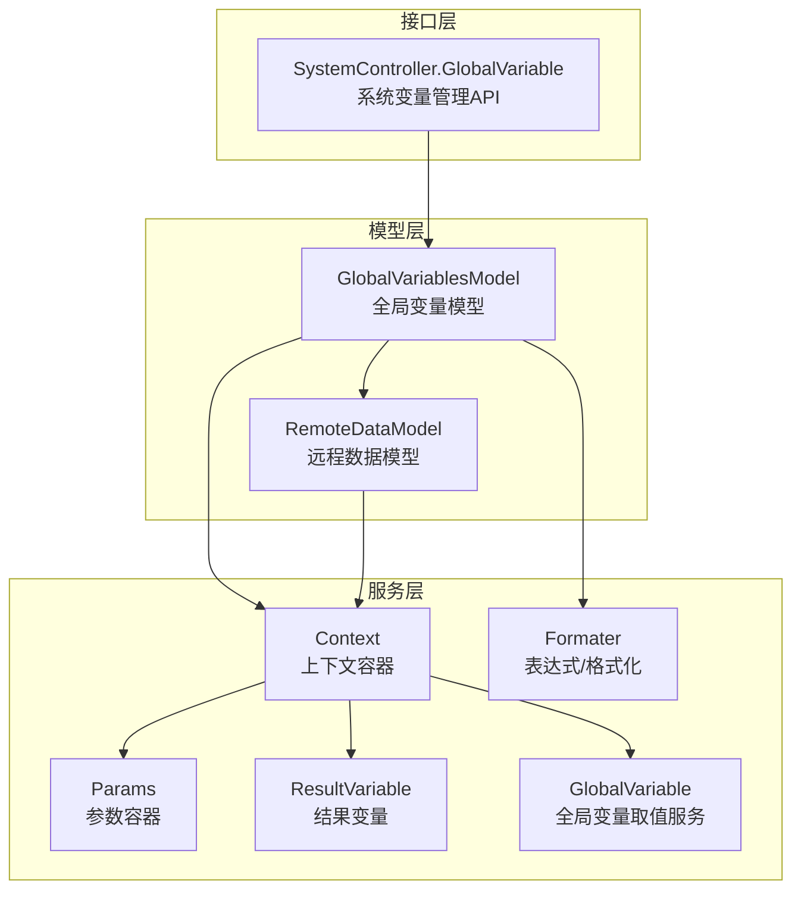
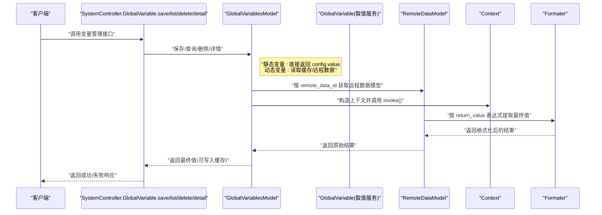
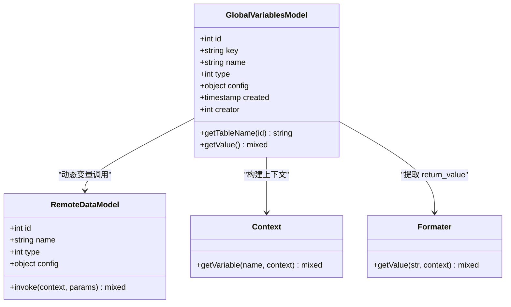
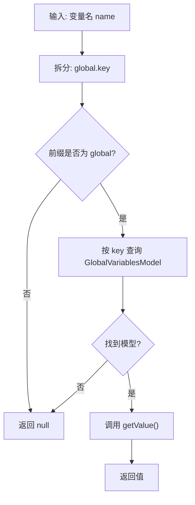
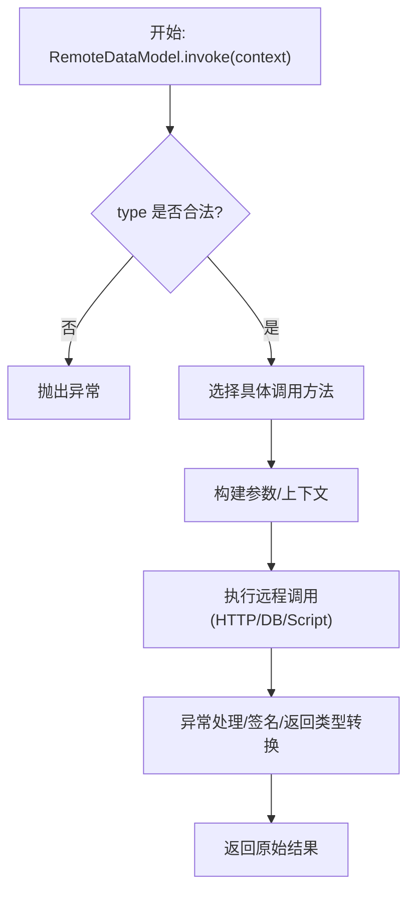
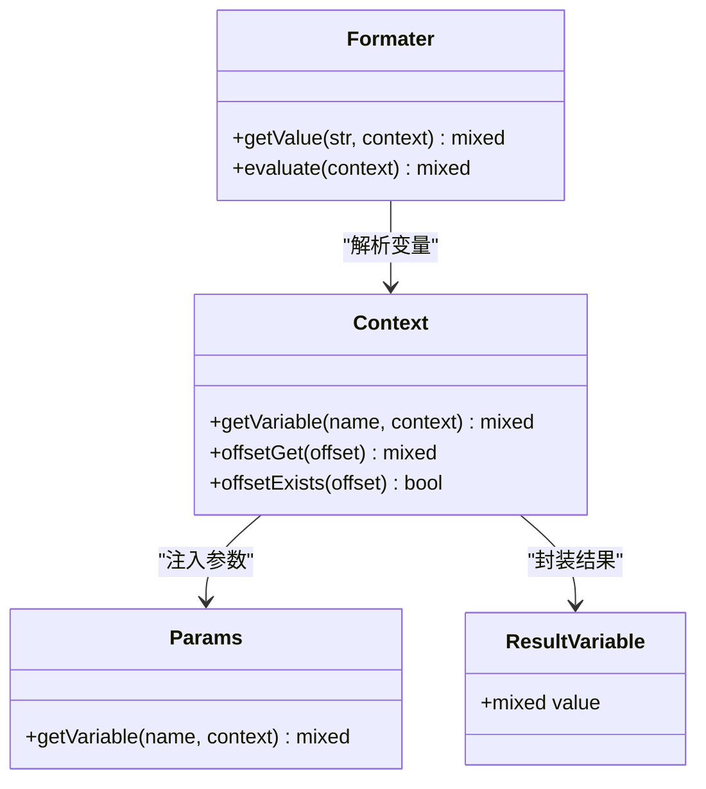
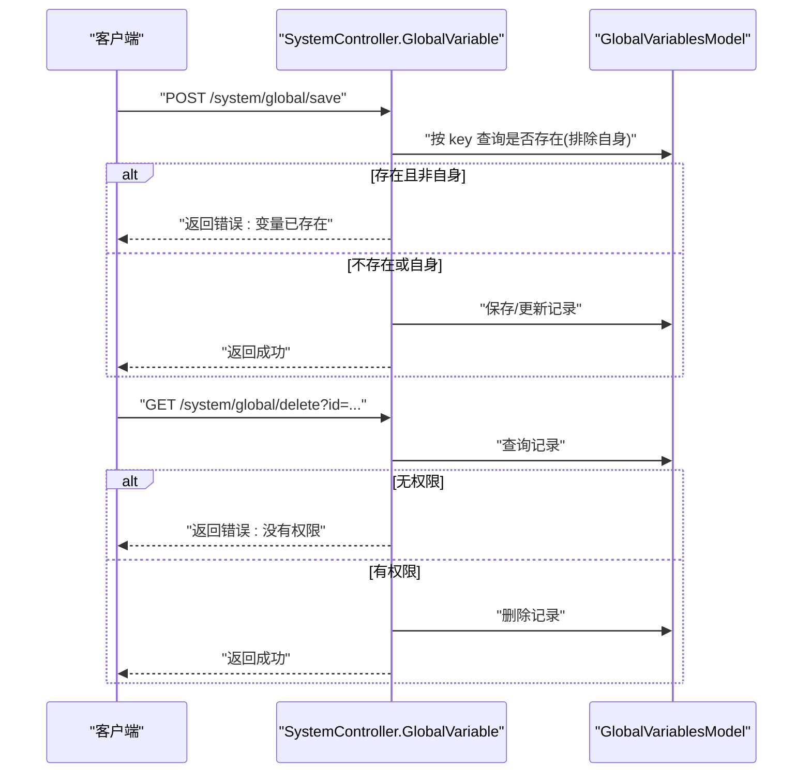
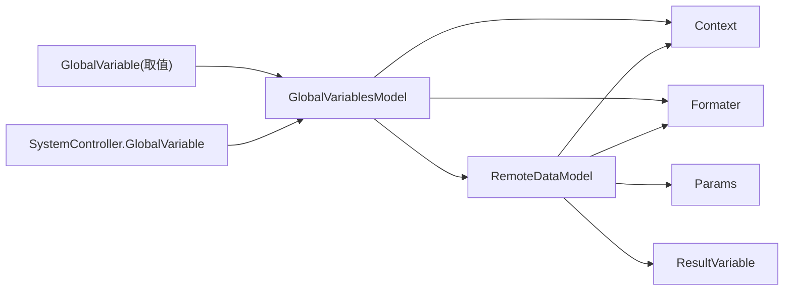

# 全局变量模型

<cite>
**本文引用的文件**
- [GlobalVariablesModel.php](file://process/src/models/GlobalVariablesModel.php)
- [GlobalVariable.php（服务）](file://process/src/services/GlobalVariable.php)
- [GlobalVariable.php（HTTP 控制器）](file://process/src/http/system/GlobalVariable.php)
- [RemoteDataModel.php](file://process/src/models/RemoteDataModel.php)
- [Context.php](file://process/src/services/Context.php)
- [Formater.php](file://process/src/services/Formater.php)
- [Params.php](file://process/src/services/Params.php)
- [ResultVariable.php](file://process/src/services/ResultVariable.php)
</cite>

## 目录
1. [引言](#引言)
2. [项目结构](#项目结构)
3. [核心组件](#核心组件)
4. [架构总览](#架构总览)
5. [详细组件分析](#详细组件分析)
6. [依赖关系分析](#依赖关系分析)
7. [性能考量](#性能考量)
8. [故障排查指南](#故障排查指南)
9. [结论](#结论)
10. [附录](#附录)

## 引言
本文件围绕“全局变量模型”展开，系统性说明其在系统全局变量管理中的职责与实现方式。重点覆盖以下方面：
- 全局变量的数据存储结构与字段语义
- 变量类型（静态/动态）与命名空间、作用域控制
- 类型定义、默认值设置与动态更新机制
- 变量查询接口、变量监听与变量广播能力
- 变量设置、获取与删除的完整 API 使用路径
- 变量缓存策略、持久化存储与生命周期管理

## 项目结构
全局变量相关的核心代码分布在以下模块：
- 模型层：全局变量模型与远程数据模型
- 服务层：上下文、格式化器、参数容器、结果变量等
- 接口层：系统管理控制器，提供变量的增删改查与详情接口

图表来源
- [GlobalVariablesModel.php](file://process/src/models/GlobalVariablesModel.php#L1-L66)
- [RemoteDataModel.php](file://process/src/models/RemoteDataModel.php#L1-L120)
- [Context.php](file://process/src/services/Context.php#L1-L77)
- [Formater.php](file://process/src/services/Formater.php#L1-L120)
- [Params.php](file://process/src/services/Params.php#L1-L24)
- [ResultVariable.php](file://process/src/services/ResultVariable.php)
- [GlobalVariable.php（HTTP 控制器）](file://process/src/http/system/GlobalVariable.php#L1-L98)

章节来源
- [GlobalVariablesModel.php](file://process/src/models/GlobalVariablesModel.php#L1-L66)
- [RemoteDataModel.php](file://process/src/models/RemoteDataModel.php#L1-L120)
- [Context.php](file://process/src/services/Context.php#L1-L77)
- [Formater.php](file://process/src/services/Formater.php#L1-L120)
- [Params.php](file://process/src/services/Params.php#L1-L24)
- [GlobalVariable.php（HTTP 控制器）](file://process/src/http/system/GlobalVariable.php#L1-L98)

## 核心组件
- 全局变量模型：负责全局变量的持久化、类型区分、动态值计算与缓存命中逻辑。
- 全局变量取值服务：通过名称空间 global.<key> 查询变量值。
- 远程数据模型：为动态变量提供远程数据源调用能力，支持数据库、数据表、HTTP、脚本等多种类型。
- 上下文与格式化器：贯穿变量解析、表达式求值、参数注入与返回值提取。
- 系统变量管理控制器：提供变量列表、保存、删除、详情等 HTTP 接口。

章节来源
- [GlobalVariablesModel.php](file://process/src/models/GlobalVariablesModel.php#L1-L66)
- [GlobalVariable.php（服务）](file://process/src/services/GlobalVariable.php#L1-L20)
- [RemoteDataModel.php](file://process/src/models/RemoteDataModel.php#L120-L220)
- [Context.php](file://process/src/services/Context.php#L1-L77)
- [Formater.php](file://process/src/services/Formater.php#L1-L120)
- [GlobalVariable.php（HTTP 控制器）](file://process/src/http/system/GlobalVariable.php#L1-L98)

## 架构总览
全局变量的读取流程从 HTTP 控制器发起，经由全局变量取值服务定位到具体变量模型，再根据变量类型决定直接返回静态值或通过远程数据模型动态计算，并可选地将结果写入缓存。

图表来源
- [GlobalVariable.php（HTTP 控制器）](file://process/src/http/system/GlobalVariable.php#L1-L98)
- [GlobalVariablesModel.php](file://process/src/models/GlobalVariablesModel.php#L34-L66)
- [RemoteDataModel.php](file://process/src/models/RemoteDataModel.php#L133-L170)
- [Context.php](file://process/src/services/Context.php#L52-L66)
- [Formater.php](file://process/src/services/Formater.php#L23-L40)

## 详细组件分析

### 全局变量模型（GlobalVariablesModel）
- 数据结构与字段
  - 主键：id
  - 标识：key（唯一索引）
  - 名称：name
  - 类型：type（静态/动态）
  - 配置：config（JSON），包含 value 或 remote_data_id、return_value、expire 等
  - 创建时间与创建者：created、creator
- 类型与行为
  - 静态变量：直接返回 config.value
  - 动态变量：优先从缓存读取；未命中则通过远程数据模型调用，按 return_value 表达式提取结果，并按 expire 设置缓存过期
- 关键方法
  - getValue：根据类型与缓存策略决定取值路径
  - getTableName：固定表名 global_variables

图表来源
- [GlobalVariablesModel.php](file://process/src/models/GlobalVariablesModel.php#L1-L66)
- [RemoteDataModel.php](file://process/src/models/RemoteDataModel.php#L120-L220)
- [Context.php](file://process/src/services/Context.php#L52-L66)
- [Formater.php](file://process/src/services/Formater.php#L23-L40)

章节来源
- [GlobalVariablesModel.php](file://process/src/models/GlobalVariablesModel.php#L1-L66)

### 全局变量取值服务（GlobalVariable）
- 命名空间规则：以 global. 开头的变量名，例如 global.<key>
- 实现逻辑：解析名称，定位到对应 GlobalVariablesModel 实例，调用其 getValue 返回值；否则返回 null

图表来源
- [GlobalVariable.php（服务）](file://process/src/services/GlobalVariable.php#L1-L20)

章节来源
- [GlobalVariable.php（服务）](file://process/src/services/GlobalVariable.php#L1-L20)

### 远程数据模型（RemoteDataModel）
- 作用：为动态变量提供统一的数据源调用入口，支持多种类型（数据库、数据表、HTTP、脚本等）
- 关键点
  - invoke：根据 type 分派到具体调用方法
  - HTTP 类型：构建请求头、查询参数、请求体，支持签名算法与异常处理
  - 表达式与参数：通过 buildParams 与 Formater 注入上下文变量（如 @process、@params、@creator、@const 等）
  - 返回值提取：支持 return_type 与 return_value 表达式

图表来源
- [RemoteDataModel.php](file://process/src/models/RemoteDataModel.php#L133-L170)
- [RemoteDataModel.php](file://process/src/models/RemoteDataModel.php#L166-L297)
- [RemoteDataModel.php](file://process/src/models/RemoteDataModel.php#L323-L427)
- [RemoteDataModel.php](file://process/src/models/RemoteDataModel.php#L494-L509)

章节来源
- [RemoteDataModel.php](file://process/src/models/RemoteDataModel.php#L120-L220)
- [RemoteDataModel.php](file://process/src/models/RemoteDataModel.php#L299-L321)
- [RemoteDataModel.php](file://process/src/models/RemoteDataModel.php#L323-L427)
- [RemoteDataModel.php](file://process/src/models/RemoteDataModel.php#L494-L509)

### 上下文与格式化器（Context、Formater、Params、ResultVariable）
- Context：作为变量解析的根容器，支持 ArrayAccess 与 VariableInterface，按对象链路逐个尝试 getVariable
- Formater：解析表达式字符串，支持函数与变量嵌套，将变量名映射到 Context 中的值
- Params：将外部参数注入到上下文中，支持 params.<key> 的访问
- ResultVariable：封装远程调用结果，供表达式提取使用

图表来源
- [Context.php](file://process/src/services/Context.php#L1-L77)
- [Formater.php](file://process/src/services/Formater.php#L1-L120)
- [Params.php](file://process/src/services/Params.php#L1-L24)
- [ResultVariable.php](file://process/src/services/ResultVariable.php)

章节来源
- [Context.php](file://process/src/services/Context.php#L1-L77)
- [Formater.php](file://process/src/services/Formater.php#L1-L120)
- [Params.php](file://process/src/services/Params.php#L1-L24)

### 系统变量管理 API（HTTP 控制器）
- 接口概览
  - 列表：支持关键词搜索、分页
  - 保存：校验 key 唯一性，支持新增与编辑
  - 删除：校验权限（超级管理员或创建者）
  - 详情：返回变量信息
- 关键行为
  - 保存时将 value 作为 JSON 写入 config 字段
  - 删除前预留使用检查（注释）

图表来源
- [GlobalVariable.php（HTTP 控制器）](file://process/src/http/system/GlobalVariable.php#L46-L97)

章节来源
- [GlobalVariable.php（HTTP 控制器）](file://process/src/http/system/GlobalVariable.php#L1-L98)

## 依赖关系分析
- 组件耦合
  - GlobalVariablesModel 依赖 RemoteDataModel、Context、Formater、Redis 缓存
  - RemoteDataModel 依赖 Context、Formater、Params、ResultVariable、多种数据源类型
  - GlobalVariable 依赖 GlobalVariablesModel
  - HTTP 控制器依赖 GlobalVariablesModel 与用户权限判定
- 外部依赖
  - Redis：用于动态变量缓存
  - HTTP 客户端：用于 HTTP 类型远程数据源
  - 数据库连接：用于数据库/数据表类型远程数据源

图表来源
- [GlobalVariablesModel.php](file://process/src/models/GlobalVariablesModel.php#L1-L66)
- [RemoteDataModel.php](file://process/src/models/RemoteDataModel.php#L120-L220)
- [GlobalVariable.php（服务）](file://process/src/services/GlobalVariable.php#L1-L20)
- [GlobalVariable.php（HTTP 控制器）](file://process/src/http/system/GlobalVariable.php#L1-L98)

章节来源
- [GlobalVariablesModel.php](file://process/src/models/GlobalVariablesModel.php#L1-L66)
- [RemoteDataModel.php](file://process/src/models/RemoteDataModel.php#L120-L220)
- [GlobalVariable.php（服务）](file://process/src/services/GlobalVariable.php#L1-L20)
- [GlobalVariable.php（HTTP 控制器）](file://process/src/http/system/GlobalVariable.php#L1-L98)

## 性能考量
- 缓存策略
  - 动态变量在 getValue 中优先从 Redis 读取，命中即直接返回，避免重复远程调用
  - 可通过 expire 字段设置缓存过期时间，支持数值或表达式两种形式
- 计算开销
  - 表达式解析与函数调用在 Formater 中完成，建议尽量减少复杂表达式层级
  - HTTP 类型远程数据源涉及网络 IO，应合理设置缓存与超时
- 并发与事务
  - 远程数据源调用支持异步队列推送，可在事务完成后异步执行，降低主流程阻塞

章节来源
- [GlobalVariablesModel.php](file://process/src/models/GlobalVariablesModel.php#L34-L66)
- [RemoteDataModel.php](file://process/src/models/RemoteDataModel.php#L133-L170)
- [RemoteDataModel.php](file://process/src/models/RemoteDataModel.php#L154-L164)

## 故障排查指南
- 变量取值为空
  - 检查变量 key 是否正确，确认 GlobalVariablesModel 中是否存在该 key
  - 对于动态变量，确认 Redis 中是否存在缓存键 global_variable_<id>，必要时清理缓存重试
- 动态变量异常
  - 查看远程数据源类型与配置是否正确（HTTP/DB/Script）
  - 检查 return_value 表达式是否能从 Context 中解析到所需字段
- 权限问题
  - 删除变量需满足超级管理员或创建者身份，否则会返回权限错误
- 表达式解析错误
  - 确认表达式语法正确，避免非法函数或变量路径

章节来源
- [GlobalVariable.php（服务）](file://process/src/services/GlobalVariable.php#L1-L20)
- [GlobalVariablesModel.php](file://process/src/models/GlobalVariablesModel.php#L34-L66)
- [RemoteDataModel.php](file://process/src/models/RemoteDataModel.php#L166-L297)
- [GlobalVariable.php（HTTP 控制器）](file://process/src/http/system/GlobalVariable.php#L76-L97)

## 结论
全局变量模型通过“静态直返 + 动态远程”的双通道设计，实现了灵活、可扩展的全局变量管理。结合上下文与格式化器，系统能够以表达式的方式从远程数据中提取所需值，并通过缓存显著提升性能。HTTP 控制器提供了完善的 CRUD 接口，配合权限校验确保安全可控。

## 附录

### API 示例（使用路径）
- 获取变量值
  - 通过全局变量取值服务访问：global.<key>
  - 服务实现参考：[GlobalVariable.php（服务）](file://process/src/services/GlobalVariable.php#L1-L20)
- 设置变量
  - 保存接口：POST /system/global/save
  - 参数：id、key、name、type、value（JSON）
  - 实现参考：[GlobalVariable.php（HTTP 控制器）](file://process/src/http/system/GlobalVariable.php#L46-L74)
- 删除变量
  - 删除接口：GET /system/global/delete
  - 参数：id
  - 权限：超级管理员或创建者
  - 实现参考：[GlobalVariable.php（HTTP 控制器）](file://process/src/http/system/GlobalVariable.php#L76-L97)
- 查询变量详情
  - 详情接口：GET /system/global/detail
  - 参数：id
  - 实现参考：[GlobalVariable.php（HTTP 控制器）](file://process/src/http/system/GlobalVariable.php#L88-L94)

### 变量类型与配置要点
- 静态变量
  - 配置字段：value（直接返回）
  - 适用场景：常量、固定配置
- 动态变量
  - 配置字段：remote_data_id、return_value、expire
  - 适用场景：从远程数据源动态获取值，并可缓存

章节来源
- [GlobalVariablesModel.php](file://process/src/models/GlobalVariablesModel.php#L16-L24)
- [GlobalVariablesModel.php](file://process/src/models/GlobalVariablesModel.php#L34-L66)
- [RemoteDataModel.php](file://process/src/models/RemoteDataModel.php#L120-L220)