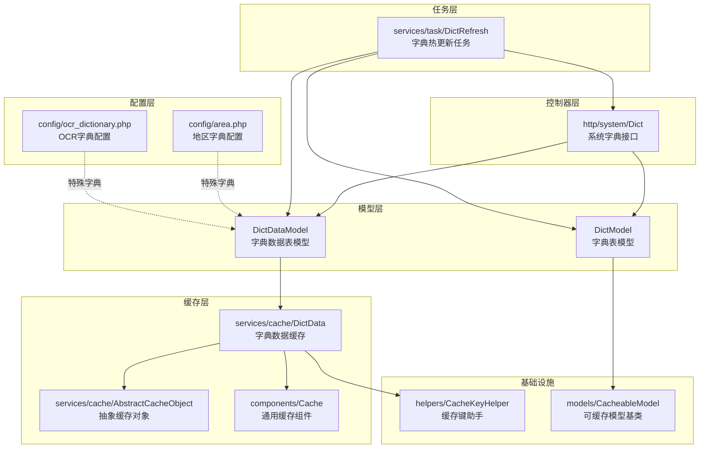
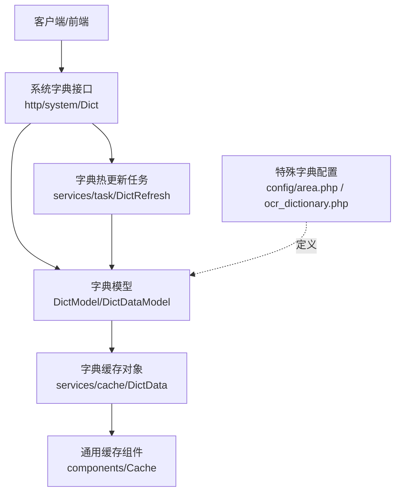
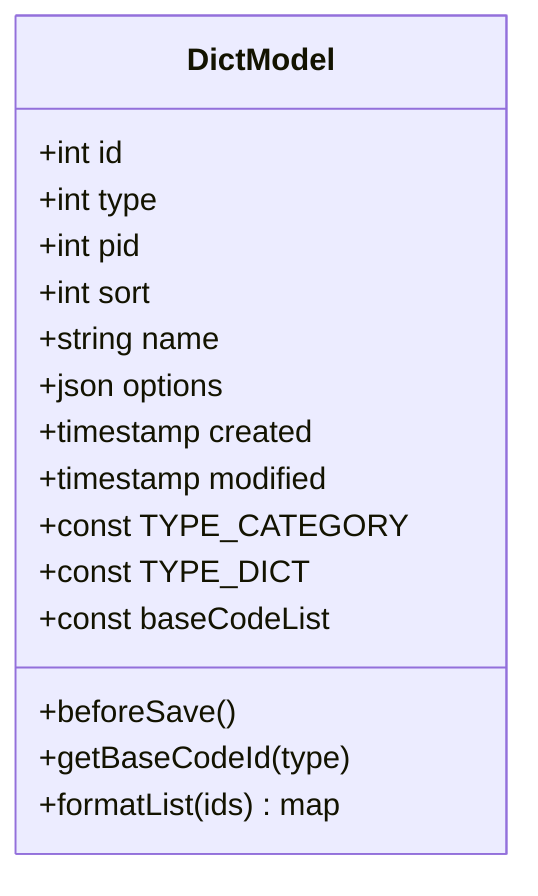
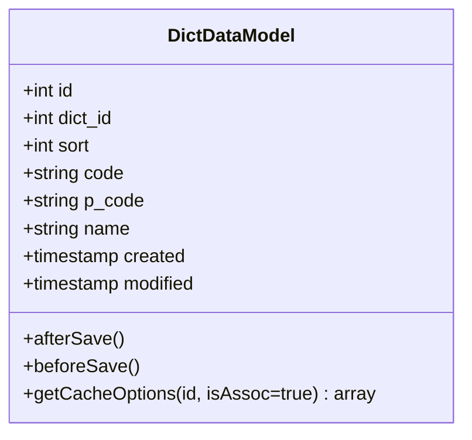
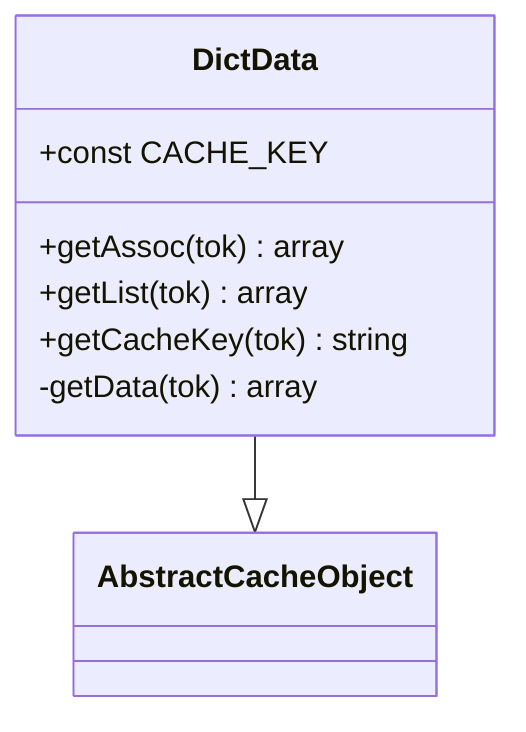
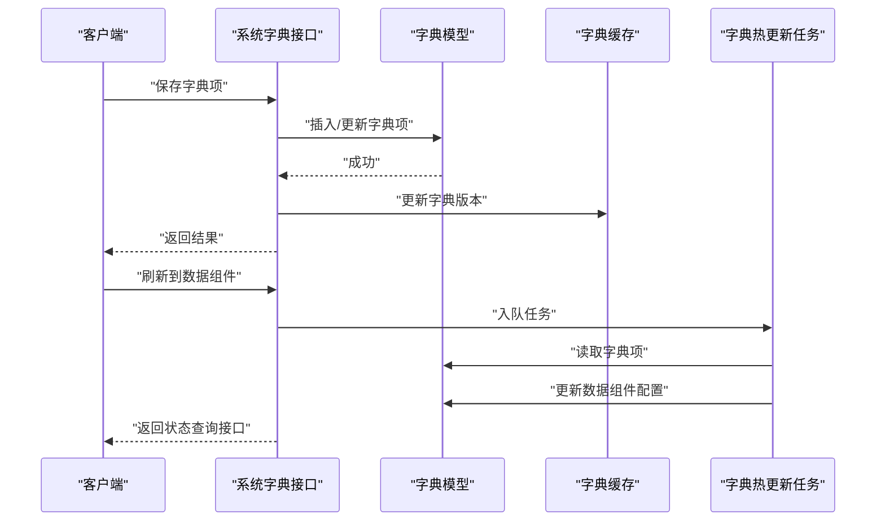
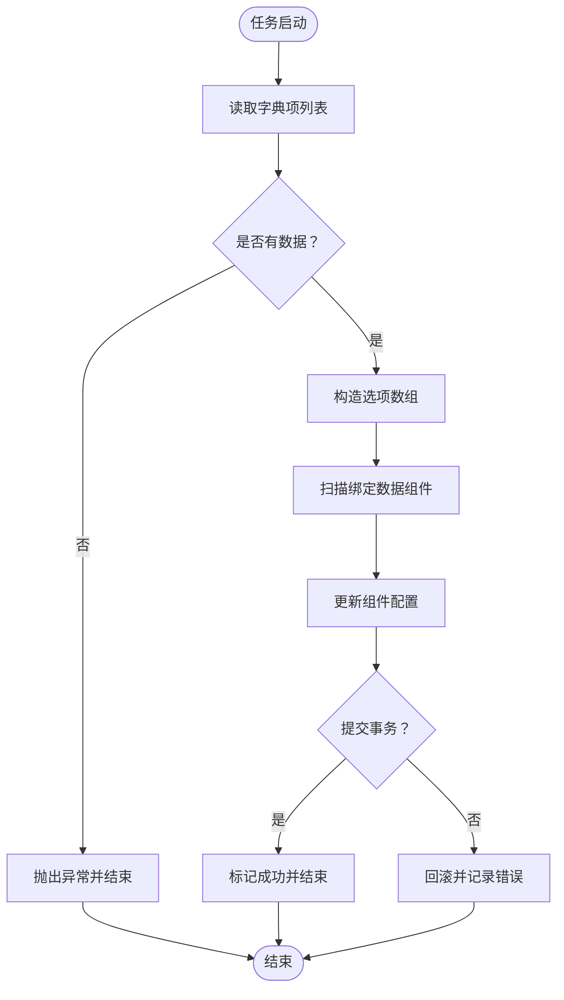
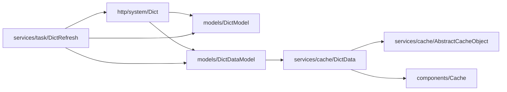

# 字典模型

<cite>
**本文引用的文件**
- [models/DictModel.php](file://process/src/models/DictModel.php)
- [models/DictDataModel.php](file://process/src/models/DictDataModel.php)
- [services/cache/DictData.php](file://process/src/services/cache/DictData.php)
- [http/system/Dict.php](file://process/src/http/system/Dict.php)
- [services/task/DictRefresh.php](file://process/src/services/task/DictRefresh.php)
- [config/area.php](file://process/src/config/area.php)
- [config/ocr_dictionary.php](file://process/src/config/ocr_dictionary.php)
- [components/Cache.php](file://process/src/components/Cache.php)
- [services/cache/AbstractCacheObject.php](file://process/src/services/cache/AbstractCacheObject.php)
- [helpers/CacheKeyHelper.php](file://process/src/helpers/CacheKeyHelper.php)
- [models/CacheableModel.php](file://process/src/models/CacheableModel.php)
</cite>

## 目录
1. [简介](#简介)
2. [项目结构](#项目结构)
3. [核心组件](#核心组件)
4. [架构总览](#架构总览)
5. [详细组件分析](#详细组件分析)
6. [依赖关系分析](#依赖关系分析)
7. [性能考量](#性能考量)
8. [故障排查指南](#故障排查指南)
9. [结论](#结论)
10. [附录](#附录)

## 简介
本文件系统性梳理“字典模型”在本仓库中的实现与使用，重点覆盖以下方面：
- 字典分类与字典项的模型设计与约束
- 字典数据的组织、缓存与版本控制
- 地区字典与OCR字典等特殊字典类型的配置与应用
- 字典查询接口、字典树构建与多级字典支持
- 字典导入导出、字典缓存与热更新流程
- 字典国际化与多语言字典管理的实践建议

## 项目结构
围绕字典模型的相关文件主要分布在以下模块：
- 模型层：字典表与字典数据表的ORM模型
- 缓存层：字典数据缓存对象与通用缓存组件
- 控制器层：系统端字典管理接口
- 任务层：字典热更新到数据组件的任务
- 配置层：地区字典与OCR字典的配置文件
- 基础设施：缓存键助手、可缓存模型基类与通用缓存组件

图表来源
- [models/DictModel.php](file://process/src/models/DictModel.php#L1-L101)
- [models/DictDataModel.php](file://process/src/models/DictDataModel.php#L1-L66)
- [services/cache/DictData.php](file://process/src/services/cache/DictData.php#L1-L48)
- [http/system/Dict.php](file://process/src/http/system/Dict.php#L1-L167)
- [services/task/DictRefresh.php](file://process/src/services/task/DictRefresh.php#L1-L106)
- [config/area.php](file://process/src/config/area.php#L1-L800)
- [config/ocr_dictionary.php](file://process/src/config/ocr_dictionary.php#L1-L188)
- [components/Cache.php](file://process/src/components/Cache.php#L1-L48)
- [services/cache/AbstractCacheObject.php](file://process/src/services/cache/AbstractCacheObject.php)
- [helpers/CacheKeyHelper.php](file://process/src/helpers/CacheKeyHelper.php)
- [models/CacheableModel.php](file://process/src/models/CacheableModel.php)

章节来源
- [models/DictModel.php](file://process/src/models/DictModel.php#L1-L101)
- [models/DictDataModel.php](file://process/src/models/DictDataModel.php#L1-L66)
- [services/cache/DictData.php](file://process/src/services/cache/DictData.php#L1-L48)
- [http/system/Dict.php](file://process/src/http/system/Dict.php#L1-L167)
- [services/task/DictRefresh.php](file://process/src/services/task/DictRefresh.php#L1-L106)
- [config/area.php](file://process/src/config/area.php#L1-L800)
- [config/ocr_dictionary.php](file://process/src/config/ocr_dictionary.php#L1-L188)
- [components/Cache.php](file://process/src/components/Cache.php#L1-L48)
- [services/cache/AbstractCacheObject.php](file://process/src/services/cache/AbstractCacheObject.php)
- [helpers/CacheKeyHelper.php](file://process/src/helpers/CacheKeyHelper.php)
- [models/CacheableModel.php](file://process/src/models/CacheableModel.php)

## 核心组件
- 字典表模型（DictModel）
  - 负责字典分类与字典的增删改查、基础码表映射、列表格式化等
  - 支持分类与字典两种类型，提供基础码表ID映射常量
- 字典数据表模型（DictDataModel）
  - 负责字典项的增删改查、自动更新修改时间、保存后触发缓存版本更新
  - 提供获取缓存选项的便捷方法（关联数组或原始列表）
- 字典数据缓存（services/cache/DictData）
  - 基于抽象缓存对象，按字典ID生成缓存键
  - 针对特定字典（如国家地区）采用特殊排序策略
  - 提供关联数组与列表两种输出形态
- 系统字典接口（http/system/Dict）
  - 提供分类与字典的保存、删除、列表、详情、分页列表、字典项保存与删除、查询
  - 提供字典热更新到数据组件的任务触发与状态查询
- 字典热更新任务（services/task/DictRefresh）
  - 将字典数据转换为数据组件可用的选项结构，并批量更新相关数据组件配置
  - 使用事务保证一致性，失败时记录错误并标记状态
- 特殊字典配置
  - 地区字典：以层级结构配置，用于地区选择等场景
  - OCR字典：描述不同识别类型的参数与字段映射，便于前端渲染与校验

章节来源
- [models/DictModel.php](file://process/src/models/DictModel.php#L1-L101)
- [models/DictDataModel.php](file://process/src/models/DictDataModel.php#L1-L66)
- [services/cache/DictData.php](file://process/src/services/cache/DictData.php#L1-L48)
- [http/system/Dict.php](file://process/src/http/system/Dict.php#L1-L167)
- [services/task/DictRefresh.php](file://process/src/services/task/DictRefresh.php#L1-L106)
- [config/area.php](file://process/src/config/area.php#L1-L800)
- [config/ocr_dictionary.php](file://process/src/config/ocr_dictionary.php#L1-L188)

## 架构总览
字典模型采用“模型-缓存-接口-任务-配置”的分层架构：
- 模型层负责数据结构与基本校验
- 缓存层负责热点数据的高效读取与版本控制
- 接口层提供管理与查询能力
- 任务层负责跨组件的字典热更新
- 配置层提供特殊字典的静态定义

图表来源
- [http/system/Dict.php](file://process/src/http/system/Dict.php#L1-L167)
- [models/DictModel.php](file://process/src/models/DictModel.php#L1-L101)
- [models/DictDataModel.php](file://process/src/models/DictDataModel.php#L1-L66)
- [services/cache/DictData.php](file://process/src/services/cache/DictData.php#L1-L48)
- [components/Cache.php](file://process/src/components/Cache.php#L1-L48)
- [services/task/DictRefresh.php](file://process/src/services/task/DictRefresh.php#L1-L106)
- [config/area.php](file://process/src/config/area.php#L1-L800)
- [config/ocr_dictionary.php](file://process/src/config/ocr_dictionary.php#L1-L188)

## 详细组件分析

### 字典表模型（DictModel）
- 数据结构要点
  - 字段：id、type（分类/字典）、pid（父级ID）、sort（排序）、name（名称）、options（JSON扩展字段）、created/modified
  - 类型常量：分类与字典两类
  - 基础码表映射：提供常用基础码表的ID映射
- 校验与约束
  - 新增时对分类与字典分别进行参数校验
  - 同名同父级同类型不可重复
- 辅助方法
  - 基础码表ID查询
  - 批量格式化字典项为“字典ID -> {编码 -> 名称}”的结构

图表来源
- [models/DictModel.php](file://process/src/models/DictModel.php#L1-L101)

章节来源
- [models/DictModel.php](file://process/src/models/DictModel.php#L1-L101)

### 字典数据表模型（DictDataModel）
- 数据结构要点
  - 字段：id、dict_id（所属字典）、sort、code（编码）、p_code（上级编码）、name、created/modified
- 生命周期钩子
  - 保存前设置修改时间，新增时校验必需字段
  - 保存后更新对应字典的缓存版本
- 查询辅助
  - 提供按字典ID获取缓存选项的方法（关联数组或原始列表）

图表来源
- [models/DictDataModel.php](file://process/src/models/DictDataModel.php#L1-L66)

章节来源
- [models/DictDataModel.php](file://process/src/models/DictDataModel.php#L1-L66)

### 字典数据缓存（services/cache/DictData）
- 缓存键策略
  - 以“dict_data_{dict_id}”作为缓存键模板
- 数据加载策略
  - 对特定字典（如国家地区）采用按拼音排序的SQL
  - 其他字典默认按sort降序、id升序
- 输出形态
  - 关联数组：以编码为键、名称为值
  - 列表：保持原始字段结构

图表来源
- [services/cache/DictData.php](file://process/src/services/cache/DictData.php#L1-L48)
- [services/cache/AbstractCacheObject.php](file://process/src/services/cache/AbstractCacheObject.php)

章节来源
- [services/cache/DictData.php](file://process/src/services/cache/DictData.php#L1-L48)
- [services/cache/AbstractCacheObject.php](file://process/src/services/cache/AbstractCacheObject.php)

### 系统字典接口（http/system/Dict）
- 功能清单
  - 分类保存与删除（删除前检查是否存在子字典）
  - 字典保存（区分分类与字典）
  - 分类树形列表（基于工具函数生成树）
  - 字典详情（返回缓存选项）
  - 字典项分页列表（按排序与ID排序）
  - 字典项保存与删除（去重校验）
  - 字典查询（按名称模糊匹配）
  - 触发字典热更新任务并查询状态
- 关键流程
  - 保存/删除字典项会触发缓存版本更新
  - 热更新任务会扫描绑定该字典的数据组件并更新其选项

图表来源
- [http/system/Dict.php](file://process/src/http/system/Dict.php#L1-L167)
- [models/DictDataModel.php](file://process/src/models/DictDataModel.php#L1-L66)
- [services/cache/DictData.php](file://process/src/services/cache/DictData.php#L1-L48)
- [services/task/DictRefresh.php](file://process/src/services/task/DictRefresh.php#L1-L106)

章节来源
- [http/system/Dict.php](file://process/src/http/system/Dict.php#L1-L167)

### 字典热更新任务（services/task/DictRefresh）
- 目标
  - 将字典项转换为数据组件可用的选项结构，并批量更新相关数据组件配置
- 流程
  - 读取字典项，构造选项数组
  - 查找绑定该字典的数据组件与插件，更新其选项
  - 使用事务确保一致性，失败时回滚并记录错误
- 状态反馈
  - 通过Redis键记录任务状态（开始、成功、失败）

图表来源
- [services/task/DictRefresh.php](file://process/src/services/task/DictRefresh.php#L1-L106)

章节来源
- [services/task/DictRefresh.php](file://process/src/services/task/DictRefresh.php#L1-L106)

### 特殊字典类型
- 地区字典（config/area.php）
  - 采用层级结构配置，适合树形选择与联动
  - 可直接用于前端地区选择器
- OCR字典（config/ocr_dictionary.php）
  - 定义不同识别类型的参数范围与字段映射
  - 支持重复表字段的嵌套结构，便于前端渲染与校验

章节来源
- [config/area.php](file://process/src/config/area.php#L1-L800)
- [config/ocr_dictionary.php](file://process/src/config/ocr_dictionary.php#L1-L188)

### 多级字典与字典树
- 多级字典
  - 通过p_code（上级编码）与sort（排序）实现层级与顺序控制
- 字典树构建
  - 使用工具函数将扁平列表转为树形结构，便于前端展示与选择

章节来源
- [models/DictDataModel.php](file://process/src/models/DictDataModel.php#L1-L66)
- [http/system/Dict.php](file://process/src/http/system/Dict.php#L1-L167)

### 字典查询接口
- 支持按名称模糊查询字典列表
- 支持按字典ID获取详情与分页列表
- 支持按字典ID获取缓存选项（关联数组或列表）

章节来源
- [http/system/Dict.php](file://process/src/http/system/Dict.php#L1-L167)
- [models/DictDataModel.php](file://process/src/models/DictDataModel.php#L1-L66)

### 字典导入导出与热更新
- 导入
  - 通过接口批量新增字典项，保存后自动更新缓存版本
- 导出
  - 通过分页列表接口导出字典项
- 热更新
  - 通过任务将字典项转换为数据组件选项并批量更新配置

章节来源
- [http/system/Dict.php](file://process/src/http/system/Dict.php#L1-L167)
- [services/task/DictRefresh.php](file://process/src/services/task/DictRefresh.php#L1-L106)

### 国际化与多语言字典管理
- 当前实现
  - 字典项名称为本地化文本，缓存层未内置多语言切换逻辑
- 实践建议
  - 在缓存键中加入语言标识，或在字典项中增加语言维度字段
  - 通过配置文件或数据库扩展字段支持多语言映射

[本节为概念性建议，不直接分析具体文件]

## 依赖关系分析
- 组件耦合
  - 控制器依赖模型与缓存对象
  - 缓存对象依赖抽象缓存基类与缓存组件
  - 任务依赖模型与接口控制器
- 外部依赖
  - Redis用于任务状态与缓存版本
  - 数据库用于持久化字典与字典项
- 循环依赖
  - 未发现明显循环依赖

图表来源
- [http/system/Dict.php](file://process/src/http/system/Dict.php#L1-L167)
- [models/DictModel.php](file://process/src/models/DictModel.php#L1-L101)
- [models/DictDataModel.php](file://process/src/models/DictDataModel.php#L1-L66)
- [services/cache/DictData.php](file://process/src/services/cache/DictData.php#L1-L48)
- [services/cache/AbstractCacheObject.php](file://process/src/services/cache/AbstractCacheObject.php)
- [components/Cache.php](file://process/src/components/Cache.php#L1-L48)
- [services/task/DictRefresh.php](file://process/src/services/task/DictRefresh.php#L1-L106)

章节来源
- [http/system/Dict.php](file://process/src/http/system/Dict.php#L1-L167)
- [models/DictModel.php](file://process/src/models/DictModel.php#L1-L101)
- [models/DictDataModel.php](file://process/src/models/DictDataModel.php#L1-L66)
- [services/cache/DictData.php](file://process/src/services/cache/DictData.php#L1-L48)
- [services/cache/AbstractCacheObject.php](file://process/src/services/cache/AbstractCacheObject.php)
- [components/Cache.php](file://process/src/components/Cache.php#L1-L48)
- [services/task/DictRefresh.php](file://process/src/services/task/DictRefresh.php#L1-L106)

## 性能考量
- 缓存策略
  - 以字典ID为维度的缓存键，结合版本号更新，避免脏读
  - 请求级缓存管理器可用于避免静态缓存导致的数据不一致
- 排序与查询
  - 特殊字典采用专用排序SQL，其他字典使用复合排序索引
- 事务与幂等
  - 热更新任务使用事务，失败回滚，减少不一致风险
- 内存与超时
  - 任务运行时调整内存限制，注意大数据量场景下的内存占用

[本节提供一般性指导，不直接分析具体文件]

## 故障排查指南
- 参数校验失败
  - 检查分类与字典的新增参数是否满足校验规则
  - 参考路径：[models/DictModel.php](file://process/src/models/DictModel.php#L54-L82)
- 字典项重复
  - 新增字典项时若编码重复会抛出异常
  - 参考路径：[http/system/Dict.php](file://process/src/http/system/Dict.php#L108-L114)
- 删除分类失败
  - 若分类下仍有字典会阻止删除
  - 参考路径：[http/system/Dict.php](file://process/src/http/system/Dict.php#L38-L47)
- 热更新失败
  - 查看任务状态键，确认错误信息
  - 参考路径：[services/task/DictRefresh.php](file://process/src/services/task/DictRefresh.php#L94-L100)

章节来源
- [models/DictModel.php](file://process/src/models/DictModel.php#L54-L82)
- [http/system/Dict.php](file://process/src/http/system/Dict.php#L38-L47)
- [http/system/Dict.php](file://process/src/http/system/Dict.php#L108-L114)
- [services/task/DictRefresh.php](file://process/src/services/task/DictRefresh.php#L94-L100)

## 结论
本字典模型通过清晰的分层设计实现了：
- 字典分类与字典项的规范化管理
- 高效的缓存与版本控制机制
- 面向数据组件的热更新能力
- 地区与OCR等特殊字典类型的灵活配置
建议在后续迭代中完善国际化与多语言字典管理方案，并持续优化缓存与任务执行的性能与可观测性。

## 附录
- 缓存键助手与可缓存模型基类
  - 缓存键助手用于统一生成任务状态与缓存键
  - 可缓存模型基类提供统一的缓存版本维护机制
- 常用操作路径参考
  - 字典保存与删除：[http/system/Dict.php](file://process/src/http/system/Dict.php#L24-L68)
  - 字典项保存与删除：[http/system/Dict.php](file://process/src/http/system/Dict.php#L96-L124)
  - 字典详情与分页列表：[http/system/Dict.php](file://process/src/http/system/Dict.php#L79-L94)
  - 字典热更新触发与状态查询：[http/system/Dict.php](file://process/src/http/system/Dict.php#L139-L165)
  - 热更新任务执行逻辑：[services/task/DictRefresh.php](file://process/src/services/task/DictRefresh.php#L17-L101)

章节来源
- [helpers/CacheKeyHelper.php](file://process/src/helpers/CacheKeyHelper.php)
- [models/CacheableModel.php](file://process/src/models/CacheableModel.php)
- [http/system/Dict.php](file://process/src/http/system/Dict.php#L24-L165)
- [services/task/DictRefresh.php](file://process/src/services/task/DictRefresh.php#L17-L101)