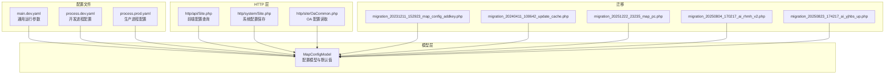
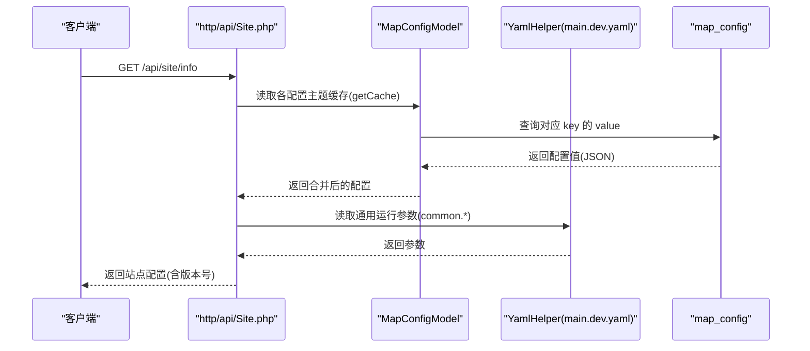
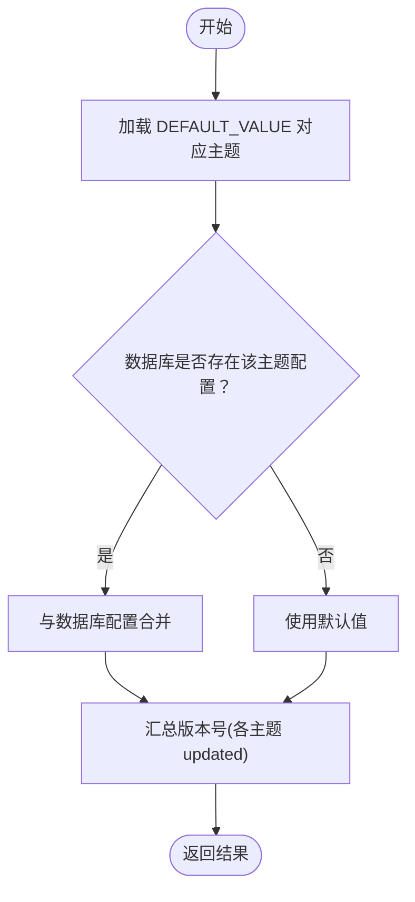
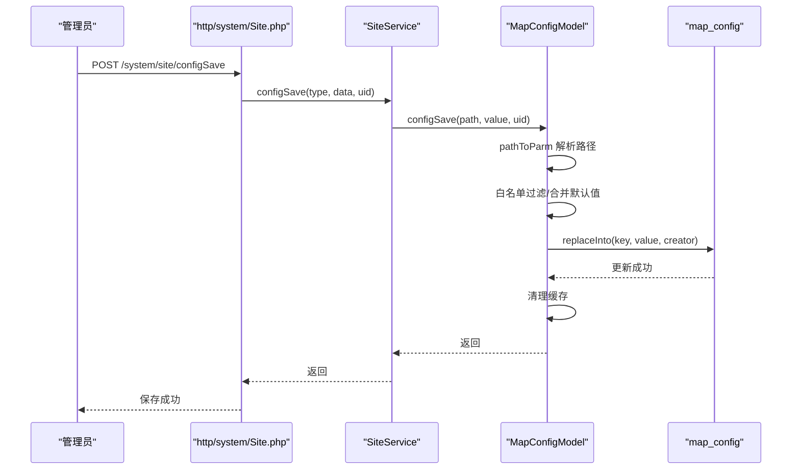
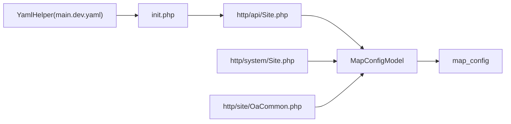

# 应用配置模型

<cite>
**本文引用的文件**
- [MapConfigModel.php](file://process/src/models/MapConfigModel.php)
- [Site.php（API）](file://process/src/http/api/Site.php)
- [Site.php（系统）](file://process/src/http/system/Site.php)
- [init.php](file://process/src/config/init.php)
- [main.dev.yaml](file://process/src/config/main.dev.yaml)
- [process.dev.yaml](file://process/src/config/process.dev.yaml)
- [process.prod.yaml](file://process/src/config/process.prod.yaml)
- [migration_20231211_152923_map_config_addkey.php](file://process/src/migrations/migration_20231211_152923_map_config_addkey.php)
- [migration_20240411_100642_update_cache.php](file://process/src/migrations/migration_20240411_100642_update_cache.php)
- [migration_20251222_23235_map_pc.php](file://process/src/migrations/migration_20251222_23235_map_pc.php)
- [migration_20250804_170217_ai_rhmh_v2.php](file://process/src/migrations/migration_20250804_170217_ai_rhmh_v2.php)
- [migration_20250823_174217_ai_yjhbs_up.php](file://process/src/migrations/migration_20250823_174217_ai_yjhbs_up.php)
- [OaCommon.php](file://process/src/http/site/OaCommon.php)
</cite>

## 目录
1. [引言](#引言)
2. [项目结构](#项目结构)
3. [核心组件](#核心组件)
4. [架构总览](#架构总览)
5. [详细组件分析](#详细组件分析)
6. [依赖关系分析](#依赖关系分析)
7. [性能考量](#性能考量)
8. [故障排查指南](#故障排查指南)
9. [结论](#结论)
10. [附录](#附录)

## 引言
本文件围绕应用配置模型 AppConfigModel（在代码中以 MapConfigModel 体现）进行系统化文档化，目标包括：
- 解析配置数据结构设计与分类管理
- 说明配置项的存储、读取与更新流程
- 阐述默认值设置、覆盖机制与验证规则
- 介绍配置热更新与缓存策略
- 提供配置查询接口、批量配置管理与版本控制的实现要点
- 解释开发与生产环境配置差异处理

## 项目结构
应用配置模型主要位于 models 层，配合 http 层的 API 与系统控制器提供读写能力；配置文件位于 config 目录，包含通用运行参数与进程配置；迁移脚本负责数据库结构演进与配置数据迁移。

图表来源
- [MapConfigModel.php](file://process/src/models/MapConfigModel.php#L1-L120)
- [Site.php（API）](file://process/src/http/api/Site.php#L230-L418)
- [Site.php（系统）](file://process/src/http/system/Site.php#L48-L87)
- [OaCommon.php](file://process/src/http/site/OaCommon.php#L47-L113)
- [main.dev.yaml](file://process/src/config/main.dev.yaml#L1-L97)
- [process.dev.yaml](file://process/src/config/process.dev.yaml#L1-L89)
- [process.prod.yaml](file://process/src/config/process.prod.yaml#L1-L80)
- [migration_20231211_152923_map_config_addkey.php](file://process/src/migrations/migration_20231211_152923_map_config_addkey.php#L1-L24)
- [migration_20240411_100642_update_cache.php](file://process/src/migrations/migration_20240411_100642_update_cache.php#L1-L20)
- [migration_20251222_23235_map_pc.php](file://process/src/migrations/migration_20251222_23235_map_pc.php#L1-L35)
- [migration_20250804_170217_ai_rhmh_v2.php](file://process/src/migrations/migration_20250804_170217_ai_rhmh_v2.php#L86-L114)
- [migration_20250823_174217_ai_yjhbs_up.php](file://process/src/migrations/migration_20250823_174217_ai_yjhbs_up.php#L165-L186)

章节来源
- [MapConfigModel.php](file://process/src/models/MapConfigModel.php#L1-L120)
- [main.dev.yaml](file://process/src/config/main.dev.yaml#L1-L97)
- [process.dev.yaml](file://process/src/config/process.dev.yaml#L1-L89)
- [process.prod.yaml](file://process/src/config/process.prod.yaml#L1-L80)

## 核心组件
- 配置模型 MapConfigModel
  - 数据表映射：表名为 map_config，主键为 key，缓存版本列 updated
  - 配置常量：涵盖个性化配置、功能配置、网站配置、登录配置、OA 配置、AI 中心配置、访客规则、隐私政策、安全配置、UI 开关、提示设置、数据集、第三方平台启用状态等
  - 默认值 DEFAULT_VALUE：集中定义各配置主题的默认结构与字段
  - 读写方法：getCache、replaceInto、configSave、pathToParm、getConfigMergeData
  - 验证与覆盖：对写入字段进行白名单过滤与默认值合并
  - 缓存与版本：基于 updated 字段的缓存版本控制，更新后清理缓存
- HTTP 接口
  - API 查询：http/api/Site.php 提供站点配置聚合查询，结合 YAML 配置与数据库配置，返回带版本号的结果
  - 系统保存：http/system/Site.php 提供系统配置保存接口，记录操作日志
  - OA 配置：http/site/OaCommon.php 提供 OA 移动端与通用配置读取
- 配置文件
  - main.dev.yaml：通用运行参数（schema、host、db、redis、队列、日志级别等）
  - process.dev.yaml / process.prod.yaml：进程与业务配置文件路径、进程数量、CPU 亲和度等

章节来源
- [MapConfigModel.php](file://process/src/models/MapConfigModel.php#L1-L120)
- [Site.php（API）](file://process/src/http/api/Site.php#L230-L418)
- [Site.php（系统）](file://process/src/http/system/Site.php#L48-L87)
- [OaCommon.php](file://process/src/http/site/OaCommon.php#L47-L113)
- [main.dev.yaml](file://process/src/config/main.dev.yaml#L1-L97)
- [process.dev.yaml](file://process/src/config/process.dev.yaml#L1-L89)
- [process.prod.yaml](file://process/src/config/process.prod.yaml#L1-L80)

## 架构总览
应用配置模型采用“配置常量 + 默认值 + 数据库存储 + 缓存版本”的分层设计，通过 HTTP 层提供统一查询与保存入口，迁移脚本保障历史数据与结构演进。

图表来源
- [Site.php（API）](file://process/src/http/api/Site.php#L230-L418)
- [MapConfigModel.php](file://process/src/models/MapConfigModel.php#L1-L120)
- [main.dev.yaml](file://process/src/config/main.dev.yaml#L1-L97)

## 详细组件分析

### MapConfigModel 数据结构与默认值
- 表结构与缓存
  - 主键：key
  - 缓存版本：updated
  - 列定义：key、value、expire、created、updated、creator
- 配置主题常量
  - 个性化配置：PERSONAL_PC、PERSONAL_MOBILE、PERSONAL_MOBILE_USER、PERSONAL_COMMON、PERSONAL_COMMON_LOGIN
  - 功能与网站：GNPZ、WZPZ、SYPZ、RMFW、JXF、MGC、FWDT、SYSCTJ、XXQD、XXFS
  - 登录与消息：DLPZ、LOGIN_CONFIG、NOTICE_CONFIG
  - 安全与扩展：SAFE_CONFIG、VISITOR_RULE、EXTENSION_*、PRIVACY_POLICY
  - OA 配置：OA_* 系列
  - AI 中心：AIGC_* 系列（DTPZ、FWDTPZ、TBDTPZ、MHDTPZ、XIDIAN_MHDTPZ、BPI_MHDTPZ、YJHBS、GNPZ、ZNTX、ZNSP、ZNKTB、ZNWD、ZNCJWJ、OAQA、CLAIM_LOCK_TIP）
  - UI 与提示：UI_SWITCH、PROMP_SETTINGS、DATA_TABLE
- 默认值 DEFAULT_VALUE
  - 覆盖范围广，包含嵌套对象与数组，确保未配置时的可用性
  - 示例主题：WZPZ（网站信息）、GNPZ（功能设置）、SYPZ（首页配置）、RMFW（热门服务）、JXF（教师/学生/访客）、FWDT（服务大厅）、DLPZ（登录配置）、VISITOR_RULE（访客规则）、SAFE_CONFIG（安全配置）、AIGC_* 系列、OA_* 系列等

章节来源
- [MapConfigModel.php](file://process/src/models/MapConfigModel.php#L1-L120)
- [MapConfigModel.php](file://process/src/models/MapConfigModel.php#L299-L1797)

### 配置读取与合并流程
- 读取
  - 通过 getCache 读取数据库配置，若存在则返回，否则返回默认值
  - 对于特定主题（如 WZPZ、DLPZ、GNPZ），API 层会叠加版本号参与前端缓存
- 合并
  - getConfigMergeData 将数据库中的增量配置与 DEFAULT_VALUE 合并，形成最终配置
- 版本控制
  - 版本号来源于各主题 updated 字段的时间戳之和，用于前端缓存失效判定

图表来源
- [MapConfigModel.php](file://process/src/models/MapConfigModel.php#L1811-L1816)
- [Site.php（API）](file://process/src/http/api/Site.php#L230-L265)

章节来源
- [MapConfigModel.php](file://process/src/models/MapConfigModel.php#L1811-L1816)
- [Site.php（API）](file://process/src/http/api/Site.php#L230-L265)

### 配置写入与覆盖机制
- 写入入口
  - 系统控制器 http/system/Site.php 提供 configSave 接口，校验权限后调用 SiteService::configSave
  - SiteService::configSave 最终调用 MapConfigModel::configSave
- 路径解析
  - pathToParm 支持“主题.字段”路径，实现细粒度字段更新
- 白名单过滤
  - 对整主题写入时，会对传入字段与 DEFAULT_VALUE 的键集合做差集过滤，避免非法字段入库
- 合并与持久化
  - getConfigMergeData 将默认值与新值合并
  - replaceInto 使用 ON CONFLICT (key) DO UPDATE 实现幂等更新
- 缓存清理
  - 更新后清理对应 key 的缓存，确保下次读取为最新

图表来源
- [Site.php（系统）](file://process/src/http/system/Site.php#L59-L87)
- [MapConfigModel.php](file://process/src/models/MapConfigModel.php#L1818-L1917)
- [MapConfigModel.php](file://process/src/models/MapConfigModel.php#L1825-L1838)

章节来源
- [Site.php（系统）](file://process/src/http/system/Site.php#L59-L87)
- [MapConfigModel.php](file://process/src/models/MapConfigModel.php#L1818-L1917)
- [MapConfigModel.php](file://process/src/models/MapConfigModel.php#L1825-L1838)

### 配置验证规则与安全控制
- 字段白名单
  - 整主题写入时，仅允许 DEFAULT_VALUE 中存在的键进入数据库
- 权限校验
  - 系统保存接口对操作者权限进行校验，防止越权
- 特定配置的参数校验
  - 二次验证管理（SEC_ADMIN_AUTH）对有效期等参数进行校验，并支持票据验证

章节来源
- [MapConfigModel.php](file://process/src/models/MapConfigModel.php#L1893-L1903)
- [MapConfigModel.php](file://process/src/models/MapConfigModel.php#L1841-L1880)
- [Site.php（系统）](file://process/src/http/system/Site.php#L48-L57)

### 配置热更新与缓存策略
- 缓存键与版本
  - 缓存键：以 key 为主键
  - 缓存版本：以 updated 字段为版本依据
- 更新后清理
  - replaceInto 与 configSave 在更新后主动清理缓存，保证一致性
- 迁移脚本辅助
  - migration_20231211_152923_map_config_addkey.php 将 key 设为主键，便于幂等更新
  - migration_20240411_100642_update_cache.php 为历史配置补充 updated 字段，启用缓存版本控制

章节来源
- [MapConfigModel.php](file://process/src/models/MapConfigModel.php#L1-L120)
- [MapConfigModel.php](file://process/src/models/MapConfigModel.php#L1825-L1838)
- [migration_20231211_152923_map_config_addkey.php](file://process/src/migrations/migration_20231211_152923_map_config_addkey.php#L1-L24)
- [migration_20240411_100642_update_cache.php](file://process/src/migrations/migration_20240411_100642_update_cache.php#L1-L20)

### 配置查询接口与批量管理
- 查询接口
  - http/api/Site.php::getConfig 与 http/api/Site.php::info 提供配置聚合查询，支持热门服务部门名称回填、AI 助手开关等场景
  - http/site/OaCommon.php 提供 OA 移动端与通用配置读取
- 批量管理
  - 通过“主题.字段”路径实现细粒度字段更新，避免整主题覆盖导致的数据丢失
  - DEFAULT_VALUE 作为基准，减少冗余存储

章节来源
- [Site.php（API）](file://process/src/http/api/Site.php#L230-L418)
- [OaCommon.php](file://process/src/http/site/OaCommon.php#L47-L113)
- [MapConfigModel.php](file://process/src/models/MapConfigModel.php#L1818-L1816)

### 配置版本控制与前端缓存
- 版本号来源
  - API 层对各主题配置的 updated 字段进行时间戳累加，作为版本号
- 前端缓存
  - API 返回结果包含版本号，前端据此进行缓存失效与刷新

章节来源
- [Site.php（API）](file://process/src/http/api/Site.php#L230-L265)

### 开发与生产环境差异处理
- 运行参数
  - main.dev.yaml 定义 schema、host、db、redis、队列、日志级别等
- 进程配置
  - process.dev.yaml 与 process.prod.yaml 分别定义开发与生产环境的进程数量、CPU 亲和度、业务配置文件路径等
- 初始化
  - init.php 注册 main.yaml 并读取日志级别，设置全局日志等级

章节来源
- [main.dev.yaml](file://process/src/config/main.dev.yaml#L1-L97)
- [process.dev.yaml](file://process/src/config/process.dev.yaml#L1-L89)
- [process.prod.yaml](file://process/src/config/process.prod.yaml#L1-L80)
- [init.php](file://process/src/config/init.php#L1-L48)

### 配置迁移与演进
- 结构迁移
  - 将 map_config 的主键改为 key，支持 ON CONFLICT 幂等更新
- 数据迁移
  - 将历史配置备份并补齐默认值，确保新增字段的兼容性
  - 将不同配置主题字段进行迁移与合并（如 AIGC 配置与大厅配置字段互换）

章节来源
- [migration_20231211_152923_map_config_addkey.php](file://process/src/migrations/migration_20231211_152923_map_config_addkey.php#L1-L24)
- [migration_20251222_23235_map_pc.php](file://process/src/migrations/migration_20251222_23235_map_pc.php#L1-L35)
- [migration_20250804_170217_ai_rhmh_v2.php](file://process/src/migrations/migration_20250804_170217_ai_rhmh_v2.php#L86-L114)
- [migration_20250823_174217_ai_yjhbs_up.php](file://process/src/migrations/migration_20250823_174217_ai_yjhbs_up.php#L165-L186)

## 依赖关系分析
- 模型依赖
  - MapConfigModel 依赖 DEFAULT_VALUE、数据库表 map_config、缓存键工具与时间工具
- HTTP 依赖
  - API 依赖 MapConfigModel 与 YamlHelper；系统控制器依赖 MapConfigModel 与日志模型
- 配置文件依赖
  - init.php 依赖 YamlHelper 读取 main.dev.yaml；进程配置分别在开发与生产环境使用不同的 process.*.yaml

图表来源
- [init.php](file://process/src/config/init.php#L1-L48)
- [Site.php（API）](file://process/src/http/api/Site.php#L230-L418)
- [Site.php（系统）](file://process/src/http/system/Site.php#L59-L87)
- [OaCommon.php](file://process/src/http/site/OaCommon.php#L47-L113)
- [MapConfigModel.php](file://process/src/models/MapConfigModel.php#L1-L120)

章节来源
- [init.php](file://process/src/config/init.php#L1-L48)
- [Site.php（API）](file://process/src/http/api/Site.php#L230-L418)
- [Site.php（系统）](file://process/src/http/system/Site.php#L59-L87)
- [OaCommon.php](file://process/src/http/site/OaCommon.php#L47-L113)
- [MapConfigModel.php](file://process/src/models/MapConfigModel.php#L1-L120)

## 性能考量
- 缓存命中与版本控制
  - 基于 updated 的缓存版本可有效避免脏读，同时减少数据库压力
- 幂等更新
  - replaceInto 使用 ON CONFLICT，降低并发写入冲突概率
- 前端缓存
  - API 返回版本号，前端可按版本缓存响应，减少网络与渲染开销
- 迁移脚本
  - 结构与数据迁移在后台执行，不影响线上读写性能

## 故障排查指南
- 写入失败
  - 检查 DEFAULT_VALUE 中是否存在该键；确认 pathToParm 路径正确
  - 查看 replaceInto 是否抛出异常并清理缓存
- 权限不足
  - 系统保存接口会进行权限校验，确认操作者具备相应权限
- 缓存未刷新
  - 确认更新后是否调用缓存清理逻辑；检查 updated 字段是否更新
- 版本号异常
  - 检查各主题 updated 字段是否正常；确认 API 层版本号累加逻辑

章节来源
- [MapConfigModel.php](file://process/src/models/MapConfigModel.php#L1825-L1838)
- [MapConfigModel.php](file://process/src/models/MapConfigModel.php#L1893-L1917)
- [Site.php（系统）](file://process/src/http/system/Site.php#L48-L57)

## 结论
MapConfigModel 通过“默认值 + 数据库存储 + 缓存版本 + 白名单过滤”的设计，实现了稳定、可演进、可验证的应用配置管理。结合 HTTP 层的查询与保存接口、YAML 配置与迁移脚本，满足开发与生产环境的差异化需求，并提供完善的热更新与前端缓存支持。

## 附录
- 配置主题清单（节选）
  - 个性化配置：PERSONAL_PC、PERSONAL_MOBILE、PERSONAL_MOBILE_USER、PERSONAL_COMMON、PERSONAL_COMMON_LOGIN
  - 功能与网站：GNPZ、WZPZ、SYPZ、RMFW、JXF、MGC、FWDT、SYSCTJ、XXQD、XXFS
  - 登录与消息：DLPZ、LOGIN_CONFIG、NOTICE_CONFIG
  - 安全与扩展：SAFE_CONFIG、VISITOR_RULE、EXTENSION_*、PRIVACY_POLICY
  - OA 配置：OA_* 系列
  - AI 中心：AIGC_* 系列（DTPZ、FWDTPZ、TBDTPZ、MHDTPZ、XIDIAN_MHDTPZ、BPI_MHDTPZ、YJHBS、GNPZ、ZNTX、ZNSP、ZNKTB、ZNWD、ZNCJWJ、OAQA、CLAIM_LOCK_TIP）
  - UI 与提示：UI_SWITCH、PROMP_SETTINGS、DATA_TABLE

章节来源
- [MapConfigModel.php](file://process/src/models/MapConfigModel.php#L1-L120)
- [MapConfigModel.php](file://process/src/models/MapConfigModel.php#L299-L1797)