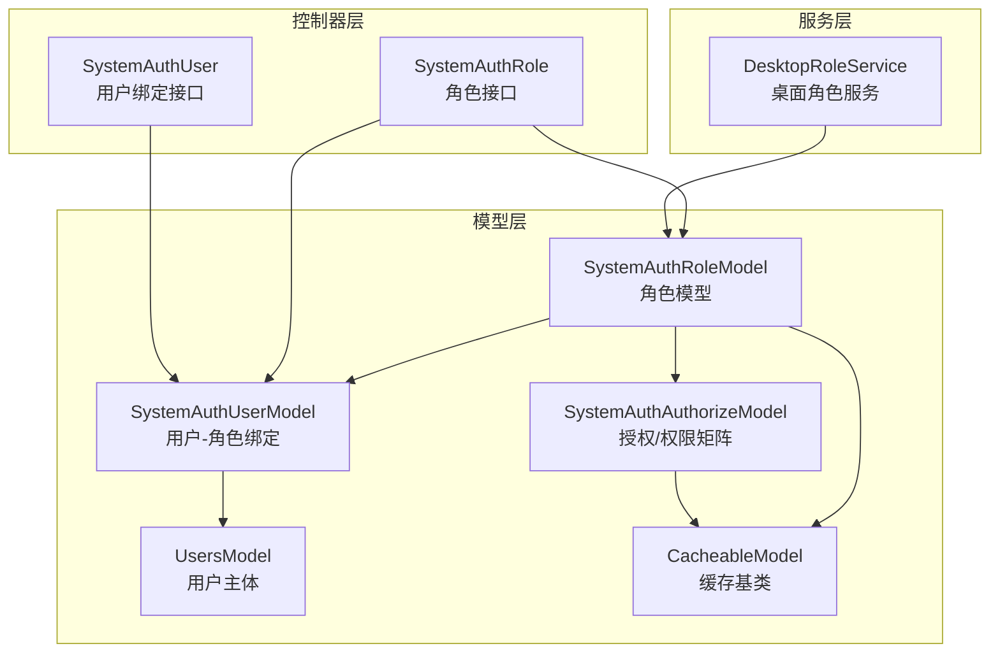
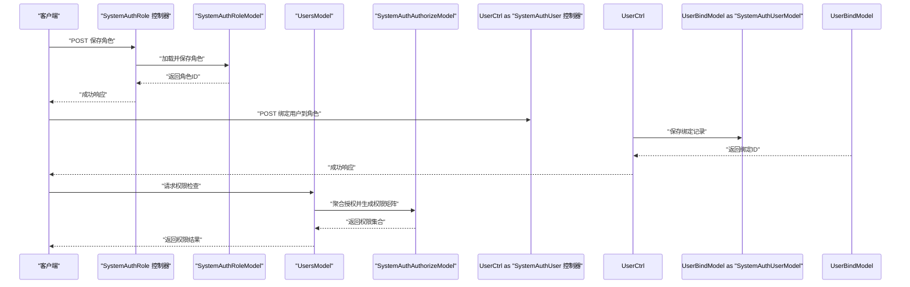
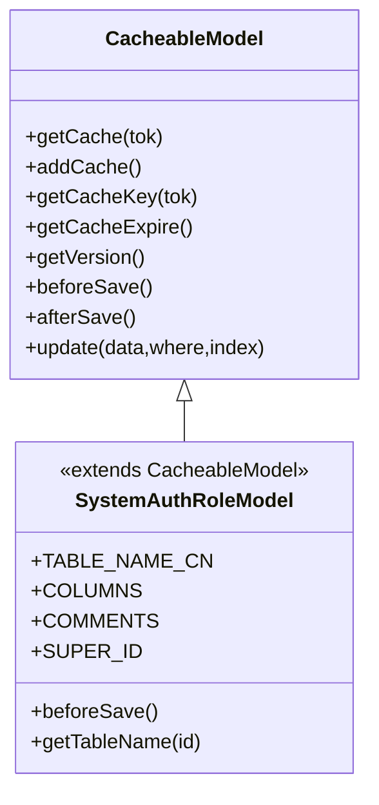
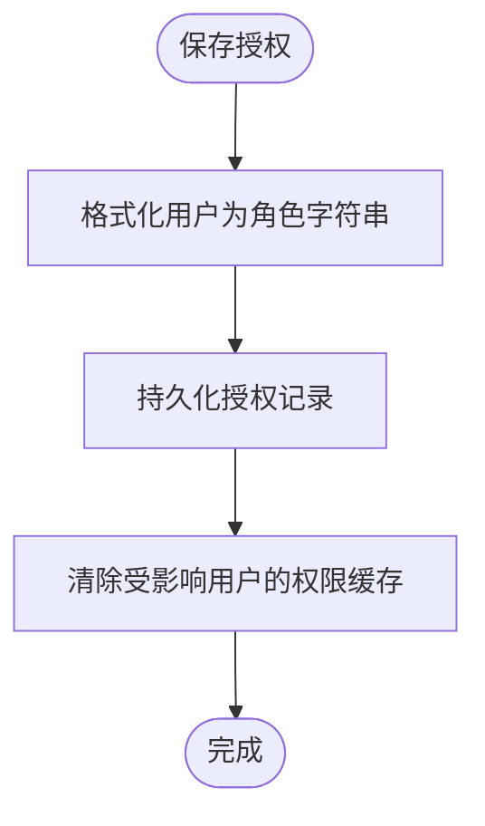
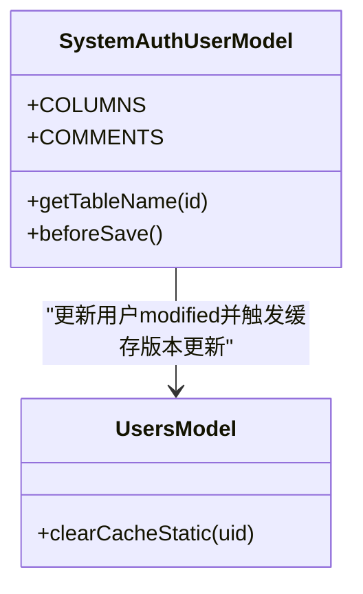
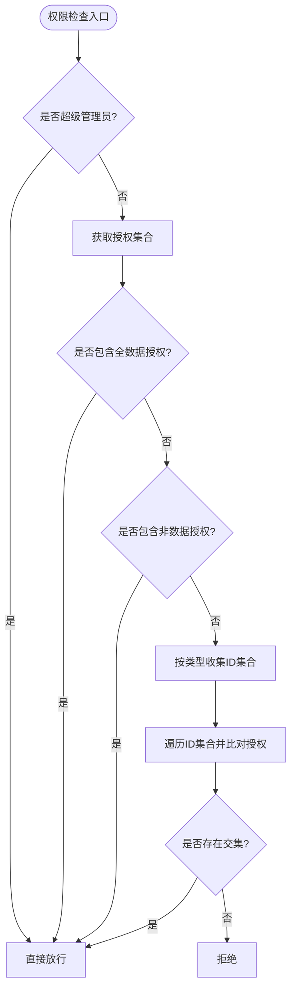
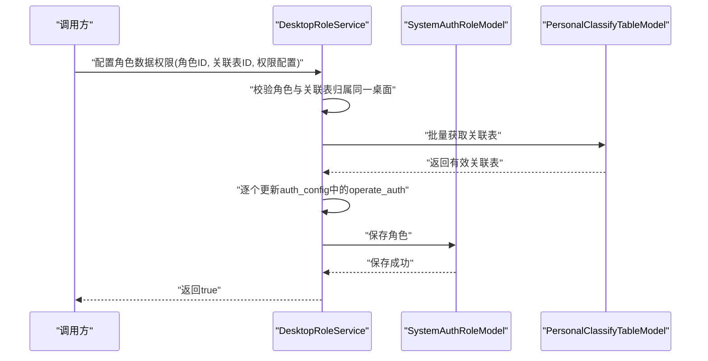
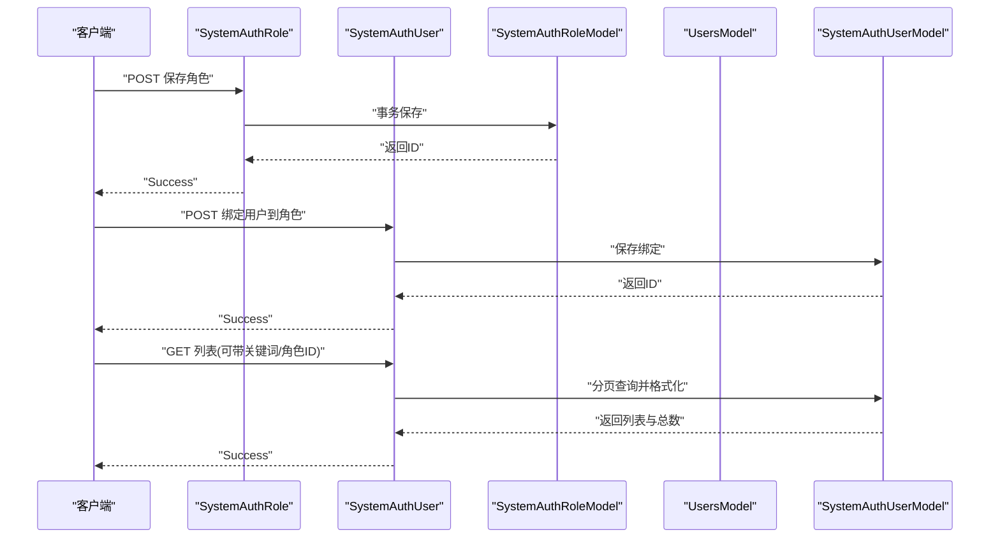
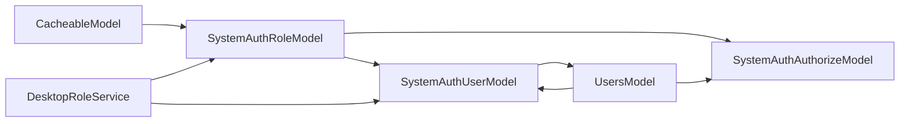

# 系统权限角色模型

<cite>
**本文引用的文件**
- [SystemAuthRoleModel.php](file://process/src/models/SystemAuthRoleModel.php)
- [SystemAuthAuthorizeModel.php](file://process/src/models/SystemAuthAuthorizeModel.php)
- [SystemAuthUserModel.php](file://process/src/models/SystemAuthUserModel.php)
- [UsersModel.php](file://process/src/models/UsersModel.php)
- [SystemAuthRole.php](file://process/src/http/system/SystemAuthRole.php)
- [SystemAuthUser.php](file://process/src/http/system/SystemAuthUser.php)
- [DesktopRoleService.php](file://process/src/services/desktopManage/DesktopRoleService.php)
- [CacheableModel.php](file://process/src/models/CacheableModel.php)
- [CacheObjectInterface.php](file://process/src/components/CacheObjectInterface.php)
- [database.sql](file://process/docs/sql/database.sql)
</cite>

## 目录
1. [引言](#引言)
2. [项目结构](#项目结构)
3. [核心组件](#核心组件)
4. [架构总览](#架构总览)
5. [详细组件分析](#详细组件分析)
6. [依赖分析](#依赖分析)
7. [性能考虑](#性能考虑)
8. [故障排查指南](#故障排查指南)
9. [结论](#结论)
10. [附录](#附录)

## 引言
本文件围绕“系统权限角色模型”进行系统化说明，重点阐述 SystemAuthRoleModel 在权限管理体系中的定位与实现原理，覆盖角色数据结构、权限继承与层级设计、用户角色绑定、权限矩阵计算与动态权限检查机制，并给出角色创建、权限分配与回收的完整流程。同时提供权限验证接口、角色查询与权限树构建的代码示例路径，以及权限缓存策略与权限变更的实时生效机制。

## 项目结构
权限体系涉及三层：
- 模型层：角色、授权、用户绑定、用户主体等模型定义与缓存策略
- 控制器层：角色与用户绑定的HTTP接口
- 服务层：桌面角色服务（桌面级权限配置入口）

图示来源
- [SystemAuthRoleModel.php](file://process/src/models/SystemAuthRoleModel.php#L1-L44)
- [SystemAuthUserModel.php](file://process/src/models/SystemAuthUserModel.php#L1-L67)
- [SystemAuthAuthorizeModel.php](file://process/src/models/SystemAuthAuthorizeModel.php#L1-L120)
- [UsersModel.php](file://process/src/models/UsersModel.php#L1-L120)
- [SystemAuthRole.php](file://process/src/http/system/SystemAuthRole.php#L1-L78)
- [SystemAuthUser.php](file://process/src/http/system/SystemAuthUser.php#L1-L100)
- [DesktopRoleService.php](file://process/src/services/desktopManage/DesktopRoleService.php#L597-L632)
- [CacheableModel.php](file://process/src/models/CacheableModel.php#L1-L103)

章节来源
- [SystemAuthRoleModel.php](file://process/src/models/SystemAuthRoleModel.php#L1-L44)
- [SystemAuthAuthorizeModel.php](file://process/src/models/SystemAuthAuthorizeModel.php#L1-L120)
- [SystemAuthUserModel.php](file://process/src/models/SystemAuthUserModel.php#L1-L67)
- [SystemAuthRole.php](file://process/src/http/system/SystemAuthRole.php#L1-L78)
- [SystemAuthUser.php](file://process/src/http/system/SystemAuthUser.php#L1-L100)
- [DesktopRoleService.php](file://process/src/services/desktopManage/DesktopRoleService.php#L597-L632)
- [CacheableModel.php](file://process/src/models/CacheableModel.php#L1-L103)

## 核心组件
- 角色模型 SystemAuthRoleModel：定义角色表结构、菜单权限字段、超级管理员保护逻辑与表名映射
- 授权模型 SystemAuthAuthorizeModel：定义授权表结构、权限枚举、静默授权类型、角色字符串格式化、授权删除清理等
- 用户绑定模型 SystemAuthUserModel：定义用户与角色的绑定关系，以及管理范围（部门/应用/用户）
- 用户主体模型 UsersModel：封装用户角色、授权、变量解析等能力，支持权限矩阵计算与动态检查
- 角色接口 SystemAuthRole：提供角色保存、删除、详情、列表等HTTP接口
- 用户绑定接口 SystemAuthUser：提供用户绑定保存、分页列表、删除等HTTP接口
- 桌面角色服务 DesktopRoleService：提供桌面级角色数据权限配置入口（操作权限、数据权限）

章节来源
- [SystemAuthRoleModel.php](file://process/src/models/SystemAuthRoleModel.php#L1-L44)
- [SystemAuthAuthorizeModel.php](file://process/src/models/SystemAuthAuthorizeModel.php#L1-L200)
- [SystemAuthUserModel.php](file://process/src/models/SystemAuthUserModel.php#L1-L67)
- [UsersModel.php](file://process/src/models/UsersModel.php#L1-L200)
- [SystemAuthRole.php](file://process/src/http/system/SystemAuthRole.php#L1-L78)
- [SystemAuthUser.php](file://process/src/http/system/SystemAuthUser.php#L1-L100)
- [DesktopRoleService.php](file://process/src/services/desktopManage/DesktopRoleService.php#L597-L632)

## 架构总览
权限体系采用“角色-授权-绑定-用户”的分层设计：
- 角色定义与菜单权限
- 授权定义与权限矩阵
- 用户绑定角色与管理范围
- 用户主体聚合权限并进行动态检查
- 桌面级角色服务负责桌面维度的权限配置

图示来源
- [SystemAuthRole.php](file://process/src/http/system/SystemAuthRole.php#L1-L78)
- [SystemAuthUser.php](file://process/src/http/system/SystemAuthUser.php#L1-L100)
- [SystemAuthRoleModel.php](file://process/src/models/SystemAuthRoleModel.php#L1-L44)
- [SystemAuthUserModel.php](file://process/src/models/SystemAuthUserModel.php#L1-L67)
- [SystemAuthAuthorizeModel.php](file://process/src/models/SystemAuthAuthorizeModel.php#L1-L200)
- [UsersModel.php](file://process/src/models/UsersModel.php#L681-L718)

## 详细组件分析

### 角色模型 SystemAuthRoleModel
- 数据结构
  - 主键、名称、描述、菜单权限数组、创建人、创建/修改时间
  - 表名为 system_auth_role
- 关键行为
  - 保护超级管理员角色（ID=1）不可被修改
  - 提供表名映射与缓存基类能力

图示来源
- [SystemAuthRoleModel.php](file://process/src/models/SystemAuthRoleModel.php#L1-L44)
- [CacheableModel.php](file://process/src/models/CacheableModel.php#L1-L103)

章节来源
- [SystemAuthRoleModel.php](file://process/src/models/SystemAuthRoleModel.php#L1-L44)
- [CacheableModel.php](file://process/src/models/CacheableModel.php#L1-L103)

### 授权模型 SystemAuthAuthorizeModel
- 数据结构
  - 授权类型、授权数据ID数组、权限数组、额外参数、授权用户/角色、静默授权类型、创建人、创建/修改时间
- 关键行为
  - 定义各类授权类型与权限枚举（事项、支付、报表、用户、部门、岗位、标签、OA等）
  - 菜单权限映射
  - 角色字符串格式化（user.x、depart.y 等）
  - 静默授权类型（创建者、部门相关管理员）
  - 授权删除时对源数据的清理逻辑
  - 保存后清除受影响用户的权限缓存

图示来源
- [SystemAuthAuthorizeModel.php](file://process/src/models/SystemAuthAuthorizeModel.php#L1-L200)
- [SystemAuthAuthorizeModel.php](file://process/src/models/SystemAuthAuthorizeModel.php#L296-L306)

章节来源
- [SystemAuthAuthorizeModel.php](file://process/src/models/SystemAuthAuthorizeModel.php#L1-L200)
- [SystemAuthAuthorizeModel.php](file://process/src/models/SystemAuthAuthorizeModel.php#L296-L306)

### 用户绑定模型 SystemAuthUserModel
- 数据结构
  - 角色ID、用户ID、管理的应用/用户/部门范围、是否应用/标签管理员等
- 关键行为
  - 保存前更新用户修改时间
  - 与 UsersModel 的缓存联动

图示来源
- [SystemAuthUserModel.php](file://process/src/models/SystemAuthUserModel.php#L1-L67)
- [UsersModel.php](file://process/src/models/UsersModel.php#L1-L120)

章节来源
- [SystemAuthUserModel.php](file://process/src/models/SystemAuthUserModel.php#L1-L67)
- [UsersModel.php](file://process/src/models/UsersModel.php#L1-L120)

### 用户主体模型 UsersModel 与权限矩阵
- 关键职责
  - 用户角色与管理角色分离
  - 权限组聚合与授权缓存
  - 动态权限检查：支持全数据、非数据、父子部门继承等规则
  - 对部门/用户类型的权限检查会向上遍历父部门ID集合

图示来源
- [UsersModel.php](file://process/src/models/UsersModel.php#L681-L718)

章节来源
- [UsersModel.php](file://process/src/models/UsersModel.php#L681-L718)

### 桌面角色服务 DesktopRoleService
- 关键职责
  - 校验角色与关联表归属同一桌面
  - 更新角色的桌面级操作权限与数据权限配置
  - 保存后持久化配置

图示来源
- [DesktopRoleService.php](file://process/src/services/desktopManage/DesktopRoleService.php#L597-L632)
- [DesktopRoleService.php](file://process/src/services/desktopManage/DesktopRoleService.php#L1145-L1156)

章节来源
- [DesktopRoleService.php](file://process/src/services/desktopManage/DesktopRoleService.php#L597-L632)
- [DesktopRoleService.php](file://process/src/services/desktopManage/DesktopRoleService.php#L1145-L1156)

### 角色与用户绑定接口
- SystemAuthRole：保存、删除、详情、列表
- SystemAuthUser：保存、分页列表、删除

图示来源
- [SystemAuthRole.php](file://process/src/http/system/SystemAuthRole.php#L1-L78)
- [SystemAuthUser.php](file://process/src/http/system/SystemAuthUser.php#L1-L100)
- [SystemAuthRoleModel.php](file://process/src/models/SystemAuthRoleModel.php#L1-L44)
- [SystemAuthUserModel.php](file://process/src/models/SystemAuthUserModel.php#L1-L67)

章节来源
- [SystemAuthRole.php](file://process/src/http/system/SystemAuthRole.php#L1-L78)
- [SystemAuthUser.php](file://process/src/http/system/SystemAuthUser.php#L1-L100)

## 依赖分析
- 模型间依赖
  - SystemAuthRoleModel 依赖 CacheableModel 实现缓存与版本控制
  - SystemAuthAuthorizeModel 依赖 UsersModel 进行用户/部门名称格式化与缓存清理
  - SystemAuthUserModel 依赖 UsersModel 进行用户信息与缓存联动
  - UsersModel 聚合授权并进行动态权限检查
- 控制器依赖
  - SystemAuthRole 与 SystemAuthUser 分别依赖对应模型执行业务
- 服务依赖
  - DesktopRoleService 依赖角色与关联表模型进行桌面级权限配置

图示来源
- [CacheableModel.php](file://process/src/models/CacheableModel.php#L1-L103)
- [SystemAuthRoleModel.php](file://process/src/models/SystemAuthRoleModel.php#L1-L44)
- [SystemAuthAuthorizeModel.php](file://process/src/models/SystemAuthAuthorizeModel.php#L1-L200)
- [SystemAuthUserModel.php](file://process/src/models/SystemAuthUserModel.php#L1-L67)
- [UsersModel.php](file://process/src/models/UsersModel.php#L1-L200)
- [DesktopRoleService.php](file://process/src/services/desktopManage/DesktopRoleService.php#L597-L632)

章节来源
- [CacheableModel.php](file://process/src/models/CacheableModel.php#L1-L103)
- [SystemAuthRoleModel.php](file://process/src/models/SystemAuthRoleModel.php#L1-L44)
- [SystemAuthAuthorizeModel.php](file://process/src/models/SystemAuthAuthorizeModel.php#L1-L200)
- [SystemAuthUserModel.php](file://process/src/models/SystemAuthUserModel.php#L1-L67)
- [UsersModel.php](file://process/src/models/UsersModel.php#L1-L200)
- [DesktopRoleService.php](file://process/src/services/desktopManage/DesktopRoleService.php#L597-L632)

## 性能考虑
- 缓存策略
  - CacheableModel 提供基于 modified 字段的版本控制与缓存失效机制
  - 用户权限缓存与角色/授权变更联动，确保权限变更后缓存版本更新
- 缓存键与过期
  - 缓存键由表名与主键构成，过期时间可按模型定制
- 查询优化
  - 授权删除时通过数组包含条件批量清理，避免逐条扫描
  - 用户绑定列表支持关键词检索与分页，减少一次性数据量

章节来源
- [CacheableModel.php](file://process/src/models/CacheableModel.php#L1-L103)
- [SystemAuthAuthorizeModel.php](file://process/src/models/SystemAuthAuthorizeModel.php#L308-L326)
- [SystemAuthUser.php](file://process/src/http/system/SystemAuthUser.php#L42-L80)

## 故障排查指南
- 超级管理员保护
  - 尝试修改超级管理员角色将抛出异常，需通过更高权限或绕过保护逻辑
- 授权删除后权限未刷新
  - 确认授权保存后的缓存清理逻辑已执行；必要时手动触发用户权限缓存版本更新
- 用户绑定后权限未生效
  - 检查用户 modified 字段是否更新，确认缓存版本已更新
- 桌面角色配置失败
  - 确认角色与关联表属于同一桌面，否则会抛出异常

章节来源
- [SystemAuthRoleModel.php](file://process/src/models/SystemAuthRoleModel.php#L30-L44)
- [SystemAuthAuthorizeModel.php](file://process/src/models/SystemAuthAuthorizeModel.php#L296-L306)
- [SystemAuthUserModel.php](file://process/src/models/SystemAuthUserModel.php#L55-L67)
- [DesktopRoleService.php](file://process/src/services/desktopManage/DesktopRoleService.php#L597-L632)

## 结论
本权限角色模型通过“角色-授权-绑定-用户”的清晰分层，结合缓存与版本控制机制，实现了角色数据结构、权限继承与层级设计、用户角色绑定、权限矩阵计算与动态权限检查的完整闭环。桌面角色服务进一步扩展了桌面维度的权限配置能力。整体设计具备良好的扩展性与可维护性，适合在复杂组织与多应用场景中落地。

## 附录

### 角色创建、权限分配与回收流程
- 角色创建
  - 通过 SystemAuthRole::save 接口提交角色数据，系统自动写入菜单权限数组并持久化
  - 参考路径：[SystemAuthRole.php](file://process/src/http/system/SystemAuthRole.php#L14-L28)
- 权限分配
  - 通过 SystemAuthAuthorizeModel 定义授权类型、数据ID、权限数组与静默授权类型
  - 保存后自动格式化用户为角色字符串并清理受影响用户的权限缓存
  - 参考路径：[SystemAuthAuthorizeModel.php](file://process/src/models/SystemAuthAuthorizeModel.php#L198-L206)
- 权限回收
  - 授权删除时，系统根据数据ID数组进行移除或整条删除，保证授权与源数据一致性
  - 参考路径：[SystemAuthAuthorizeModel.php](file://process/src/models/SystemAuthAuthorizeModel.php#L311-L326)

### 权限验证接口、角色查询与权限树构建
- 权限验证接口
  - 用户主体通过 UsersModel 的权限检查方法进行动态权限判断，支持全数据/非数据、父子部门继承等规则
  - 参考路径：[UsersModel.php](file://process/src/models/UsersModel.php#L681-L718)
- 角色查询
  - SystemAuthRole::detail 与 SystemAuthRole::list 提供角色详情与列表查询
  - 参考路径：[SystemAuthRole.php](file://process/src/http/system/SystemAuthRole.php#L43-L77)
- 权限树构建
  - 授权模型提供菜单权限映射与权限枚举，可用于前端权限树渲染
  - 参考路径：[SystemAuthAuthorizeModel.php](file://process/src/models/SystemAuthAuthorizeModel.php#L44-L63)

### 权限缓存策略与权限变更的实时生效机制
- 缓存策略
  - CacheableModel 基于 modified 字段进行版本控制，新增/更新/删除均会更新缓存版本
  - 参考路径：[CacheableModel.php](file://process/src/models/CacheableModel.php#L45-L81)
- 权限变更实时生效
  - 授权保存后主动清理受影响用户的权限缓存版本，确保下次访问即时生效
  - 参考路径：[SystemAuthAuthorizeModel.php](file://process/src/models/SystemAuthAuthorizeModel.php#L296-L306)
  - 用户绑定保存后更新用户 modified 并触发缓存版本更新
  - 参考路径：[SystemAuthUserModel.php](file://process/src/models/SystemAuthUserModel.php#L55-L67)

### 数据库与角色层级设计
- 角色与授权表结构
  - 角色表：包含主键、名称、描述、菜单权限数组、创建人、时间戳
  - 授权表：包含授权类型、数据ID数组、权限数组、额外参数、用户/角色、静默授权类型、创建人、时间戳
  - 参考路径：[database.sql](file://process/docs/sql/database.sql#L913-L943)

章节来源
- [SystemAuthRole.php](file://process/src/http/system/SystemAuthRole.php#L14-L77)
- [SystemAuthAuthorizeModel.php](file://process/src/models/SystemAuthAuthorizeModel.php#L44-L63)
- [SystemAuthAuthorizeModel.php](file://process/src/models/SystemAuthAuthorizeModel.php#L296-L306)
- [SystemAuthUserModel.php](file://process/src/models/SystemAuthUserModel.php#L55-L67)
- [UsersModel.php](file://process/src/models/UsersModel.php#L681-L718)
- [database.sql](file://process/docs/sql/database.sql#L913-L943)