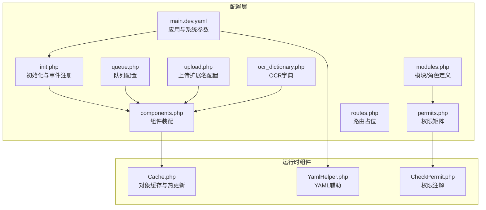
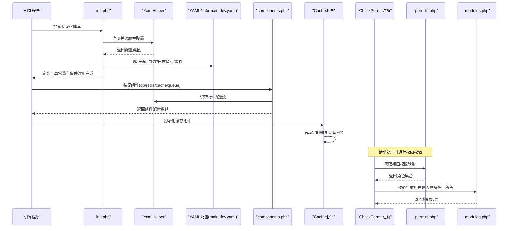
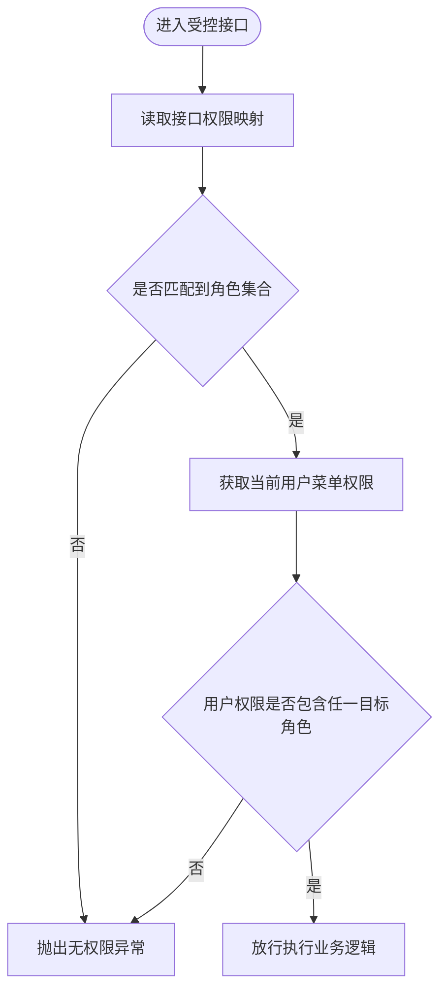
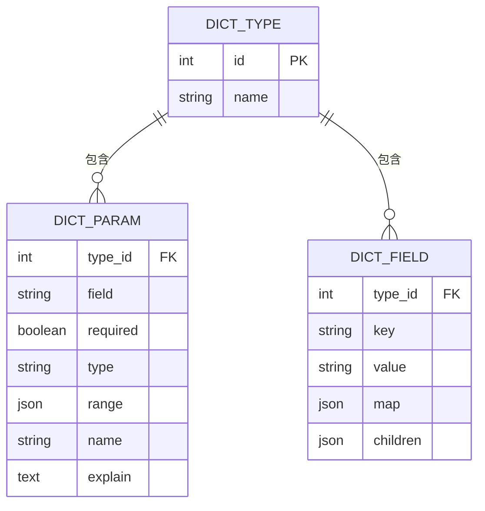
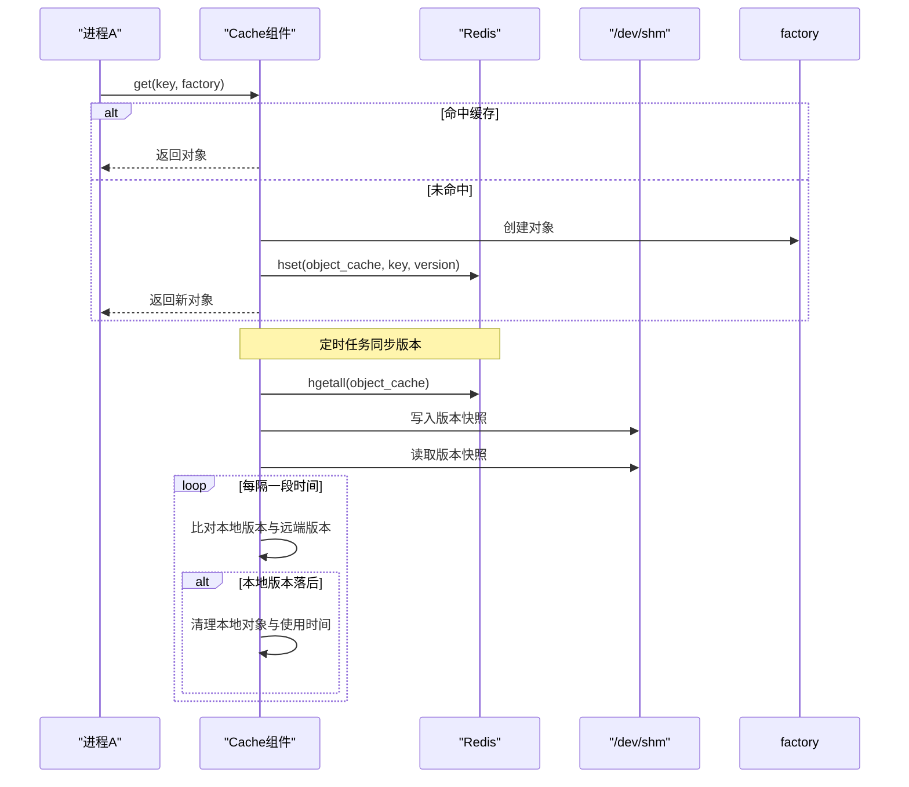
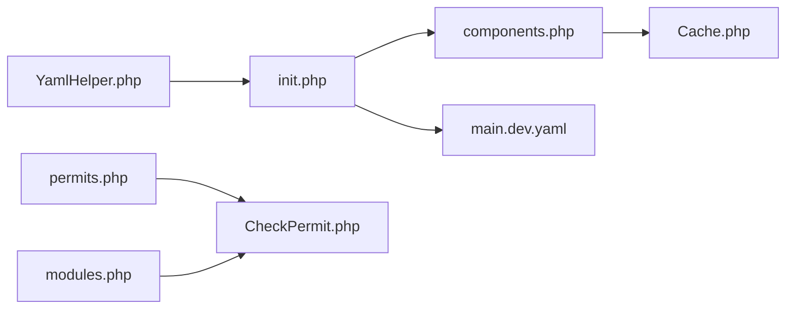

# 系统配置模型

<cite>
**本文引用的文件**
- [main.dev.yaml](file://process/src/config/main.dev.yaml)
- [init.php](file://process/src/config/init.php)
- [components.php](file://process/src/config/components.php)
- [permits.php](file://process/src/config/permits.php)
- [modules.php](file://process/src/config/modules.php)
- [routes.php](file://process/src/config/routes.php)
- [queue.php](file://process/src/config/queue.php)
- [upload.php](file://process/src/config/upload.php)
- [ocr_dictionary.php](file://process/src/config/ocr_dictionary.php)
- [Cache.php](file://process/src/components/Cache.php)
- [YamlHelper.php](file://process/src/helpers/YamlHelper.php)
- [CheckPermit.php](file://process/src/annotations/CheckPermit.php)
</cite>

## 目录
1. [引言](#引言)
2. [项目结构](#项目结构)
3. [核心组件](#核心组件)
4. [架构总览](#架构总览)
5. [详细组件分析](#详细组件分析)
6. [依赖关系分析](#依赖关系分析)
7. [性能考量](#性能考量)
8. [故障排查指南](#故障排查指南)
9. [结论](#结论)
10. [附录](#附录)

## 引言
本文件围绕系统配置模型展开，系统性梳理应用配置模型、系统权限角色模型、字典模型在系统管理中的作用与实现方式，并深入解析全局变量管理、配置映射与系统参数存储机制，阐述权限控制的数据结构、角色继承与权限矩阵实现，涵盖系统字典的数据组织、分类管理与国际化支持。同时提供配置查询、权限检查与动态配置更新的实现示例思路，解释配置缓存策略与热更新机制。

## 项目结构
系统配置相关的核心文件集中在 process/src/config 目录，辅以 components、helpers、annotations 等目录中的组件与工具类，共同构成配置加载、组件装配、权限校验与缓存管理的基础设施。

图表来源
- [main.dev.yaml](file://process/src/config/main.dev.yaml#L1-L97)
- [init.php](file://process/src/config/init.php#L1-L48)
- [components.php](file://process/src/config/components.php#L1-L34)
- [permits.php](file://process/src/config/permits.php#L1-L385)
- [modules.php](file://process/src/config/modules.php#L1-L99)
- [routes.php](file://process/src/config/routes.php#L1-L4)
- [queue.php](file://process/src/config/queue.php#L1-L13)
- [upload.php](file://process/src/config/upload.php#L1-L15)
- [ocr_dictionary.php](file://process/src/config/ocr_dictionary.php#L1-L188)
- [Cache.php](file://process/src/components/Cache.php#L1-L136)
- [YamlHelper.php](file://process/src/helpers/YamlHelper.php#L1-L8)
- [CheckPermit.php](file://process/src/annotations/CheckPermit.php#L1-L27)

章节来源
- [main.dev.yaml](file://process/src/config/main.dev.yaml#L1-L97)
- [init.php](file://process/src/config/init.php#L1-L48)
- [components.php](file://process/src/config/components.php#L1-L34)
- [permits.php](file://process/src/config/permits.php#L1-L385)
- [modules.php](file://process/src/config/modules.php#L1-L99)
- [routes.php](file://process/src/config/routes.php#L1-L4)
- [queue.php](file://process/src/config/queue.php#L1-L13)
- [upload.php](file://process/src/config/upload.php#L1-L15)
- [ocr_dictionary.php](file://process/src/config/ocr_dictionary.php#L1-L188)
- [Cache.php](file://process/src/components/Cache.php#L1-L136)
- [YamlHelper.php](file://process/src/helpers/YamlHelper.php#L1-L8)
- [CheckPermit.php](file://process/src/annotations/CheckPermit.php#L1-L27)

## 核心组件
- 应用配置模型
  - 通过 YAML 文件集中管理通用参数、HTTP 监听、数据库、Redis、权限、上传、队列、日志等系统参数，便于统一配置与环境切换。
- 权限角色模型
  - 模块/角色定义与权限矩阵分离，模块侧定义角色标识与中文描述，权限矩阵将具体接口路径映射到角色集合，支持通配符匹配与精确匹配优先级。
- 字典模型
  - OCR 字典用于规范识别参数与字段映射，支撑多类型票据/证件的字段抽取与展示；亦可作为系统码表的基础数据形态。
- 全局变量与系统参数
  - 初始化阶段从 YAML 加载参数，计算项目主机地址与路径，设置日志级别，并注册事件监听器，形成全局可用的系统参数入口。
- 组件装配与缓存
  - 组件装配文件将 YAML 中的 db/redis 等配置注入到运行时组件；对象缓存组件通过 Redis 维护版本号与本地内存缓存，实现跨进程共享与热更新。

章节来源
- [main.dev.yaml](file://process/src/config/main.dev.yaml#L1-L97)
- [init.php](file://process/src/config/init.php#L1-L48)
- [components.php](file://process/src/config/components.php#L1-L34)
- [permits.php](file://process/src/config/permits.php#L1-L385)
- [modules.php](file://process/src/config/modules.php#L1-L99)
- [ocr_dictionary.php](file://process/src/config/ocr_dictionary.php#L1-L188)
- [Cache.php](file://process/src/components/Cache.php#L1-L136)

## 架构总览
系统配置模型的运行时架构由“配置加载—组件装配—权限校验—缓存热更新”四条主线组成，贯穿应用启动与请求处理流程。

图表来源
- [init.php](file://process/src/config/init.php#L1-L48)
- [YamlHelper.php](file://process/src/helpers/YamlHelper.php#L1-L8)
- [main.dev.yaml](file://process/src/config/main.dev.yaml#L1-L97)
- [components.php](file://process/src/config/components.php#L1-L34)
- [Cache.php](file://process/src/components/Cache.php#L1-L136)
- [CheckPermit.php](file://process/src/annotations/CheckPermit.php#L1-L27)
- [permits.php](file://process/src/config/permits.php#L1-L385)
- [modules.php](file://process/src/config/modules.php#L1-L99)

## 详细组件分析

### 应用配置模型（YAML 配置）
- 配置分层
  - 通用参数：schema/host/uptime/front_prefix 等前端与公网信息。
  - 服务参数：HTTP 监听地址与端口。
  - 数据库与缓存：db/redis 的连接类与参数。
  - 权限与验证码：登录有效期、验证码字符集/字体/长度等。
  - 上传与队列：上传目录与对象存储配置、队列消费者默认并发。
  - 日志：日志级别。
- 加载与生效
  - 初始化脚本注册主 YAML 并读取日志级别，设置全局日志等级；计算项目主机地址与路径；按环境注册事件监听器。
- 环境覆盖
  - 组件装配文件支持按环境合并组件配置，实现不同部署环境下的差异化装配。

章节来源
- [main.dev.yaml](file://process/src/config/main.dev.yaml#L1-L97)
- [init.php](file://process/src/config/init.php#L1-L48)
- [components.php](file://process/src/config/components.php#L1-L34)

### 权限角色模型（模块与权限矩阵）
- 角色定义
  - 模块/角色定义文件集中列出各角色标识与其中文描述，作为权限体系的“词汇表”。
- 权限矩阵
  - 接口路径到角色集合的映射，支持精确路径优先匹配与通配符匹配；未命中将触发错误提示。
- 权限注解
  - 注解在方法上声明所需角色，运行时从用户菜单权限中校验是否包含目标角色，不具备则抛出无权限异常。

图表来源
- [permits.php](file://process/src/config/permits.php#L1-L385)
- [modules.php](file://process/src/config/modules.php#L1-L99)
- [CheckPermit.php](file://process/src/annotations/CheckPermit.php#L1-L27)

章节来源
- [permits.php](file://process/src/config/permits.php#L1-L385)
- [modules.php](file://process/src/config/modules.php#L1-L99)
- [CheckPermit.php](file://process/src/annotations/CheckPermit.php#L1-L27)

### 字典模型（系统码表与 OCR 字典）
- 数据组织
  - 采用“类型 → 参数定义 + 字段映射”的结构，支持参数必填、类型、取值范围与说明，以及字段层级与子节点。
- 分类管理
  - 通过类型键区分不同票据/证件，便于按场景选择与扩展。
- 国际化支持
  - 字段名称与说明采用中文键值，若需国际化可在上层渲染层进行翻译映射。

图表来源
- [ocr_dictionary.php](file://process/src/config/ocr_dictionary.php#L1-L188)

章节来源
- [ocr_dictionary.php](file://process/src/config/ocr_dictionary.php#L1-L188)

### 全局变量管理与配置映射
- 全局变量
  - 初始化阶段根据 YAML 计算并定义项目主机地址与路径常量，供后续模块使用。
- 配置映射
  - 组件装配文件将 YAML 中的 db/redis 等配置映射到运行时组件，形成统一的配置入口。
- 上传扩展名
  - 上传配置文件定义各类文件类型的扩展名集合，便于统一校验与处理。

章节来源
- [init.php](file://process/src/config/init.php#L1-L48)
- [components.php](file://process/src/config/components.php#L1-L34)
- [upload.php](file://process/src/config/upload.php#L1-L15)

### 队列与系统参数存储
- 队列配置
  - 队列配置文件读取 YAML 中的消费者并发设置，并与组件装配结合，形成统一的队列运行参数。
- 系统参数存储
  - 通过 YAML 集中存储系统参数，避免硬编码；运行时通过组件装配注入到各子系统。

章节来源
- [queue.php](file://process/src/config/queue.php#L1-L13)
- [components.php](file://process/src/config/components.php#L1-L34)
- [main.dev.yaml](file://process/src/config/main.dev.yaml#L1-L97)

### 配置缓存策略与热更新机制
- 对象缓存
  - 缓存组件维护本地内存对象与最后使用时间，定期清理过期对象；通过 Redis 维护版本哈希，实现跨进程一致性。
- 热更新
  - 定时从 Redis 同步版本号至共享内存文件，各进程轮询比对本地版本与远端版本，低于远端版本的对象被剔除，达到热更新效果。
- 版本管理
  - 对象需实现版本号接口，缓存组件在写入时记录版本；删除或更新时主动删除版本键，触发其他进程淘汰旧对象。

图表来源
- [Cache.php](file://process/src/components/Cache.php#L1-L136)

章节来源
- [Cache.php](file://process/src/components/Cache.php#L1-L136)

## 依赖关系分析
- 配置加载链路
  - init.php 依赖 YamlHelper 读取 main.dev.yaml，生成全局常量与事件注册；components.php 依赖 init.php 与 YamlHelper 读取 db/redis 等配置。
- 权限依赖链
  - CheckPermit 注解依赖 permits.php 的权限矩阵与 modules.php 的角色定义，最终在请求处理时校验用户菜单权限。
- 缓存依赖链
  - Cache.php 依赖 Redis 与共享内存文件实现跨进程缓存与热更新。

图表来源
- [YamlHelper.php](file://process/src/helpers/YamlHelper.php#L1-L8)
- [init.php](file://process/src/config/init.php#L1-L48)
- [components.php](file://process/src/config/components.php#L1-L34)
- [main.dev.yaml](file://process/src/config/main.dev.yaml#L1-L97)
- [permits.php](file://process/src/config/permits.php#L1-L385)
- [modules.php](file://process/src/config/modules.php#L1-L99)
- [CheckPermit.php](file://process/src/annotations/CheckPermit.php#L1-L27)
- [Cache.php](file://process/src/components/Cache.php#L1-L136)

章节来源
- [YamlHelper.php](file://process/src/helpers/YamlHelper.php#L1-L8)
- [init.php](file://process/src/config/init.php#L1-L48)
- [components.php](file://process/src/config/components.php#L1-L34)
- [main.dev.yaml](file://process/src/config/main.dev.yaml#L1-L97)
- [permits.php](file://process/src/config/permits.php#L1-L385)
- [modules.php](file://process/src/config/modules.php#L1-L99)
- [CheckPermit.php](file://process/src/annotations/CheckPermit.php#L1-L27)
- [Cache.php](file://process/src/components/Cache.php#L1-L136)

## 性能考量
- 配置加载
  - YAML 解析与事件注册在启动阶段完成，避免请求路径上的重复开销。
- 缓存策略
  - 本地内存缓存+Redis 版本同步，降低重复计算与 IO；定期清理过期对象，控制内存占用。
- 队列并发
  - 通过 YAML 配置队列消费者并发，结合组件装配统一管理，便于按环境调优。

## 故障排查指南
- 权限异常
  - 若出现“无权限访问”，检查接口在 permits.php 是否存在匹配项，确认用户菜单权限是否包含目标角色。
- 配置未生效
  - 检查 init.php 是否成功读取 YAML 并设置日志级别与全局常量；确认 components.php 是否正确合并环境配置。
- 缓存不一致
  - 查看 Cache.php 的定时任务是否运行，确认 Redis 中 object_cache 是否存在版本键，共享内存文件是否存在且可读。

章节来源
- [CheckPermit.php](file://process/src/annotations/CheckPermit.php#L1-L27)
- [permits.php](file://process/src/config/permits.php#L1-L385)
- [init.php](file://process/src/config/init.php#L1-L48)
- [components.php](file://process/src/config/components.php#L1-L34)
- [Cache.php](file://process/src/components/Cache.php#L1-L136)

## 结论
本系统通过 YAML 驱动的配置模型实现了参数集中化与环境隔离，配合模块化的权限矩阵与角色定义，构建了清晰的权限控制体系。对象缓存与热更新机制保障了运行时性能与一致性。OCR 字典等数据模型为系统提供了可扩展的码表能力。整体设计兼顾可维护性与可扩展性，适合在多环境、多租户场景下稳定运行。

## 附录
- 配置查询示例思路
  - 在业务层通过 YamlHelper 读取 YAML 键值；在组件层通过 components.php 注入配置；在控制器层按需获取配置并应用。
- 权限检查示例思路
  - 使用 CheckPermit 注解声明所需角色；在控制器方法上标注注解；运行时由注解拦截器读取权限矩阵并校验用户权限。
- 动态配置更新示例思路
  - 通过修改 YAML 文件后，由 Cache.php 的热更新机制自动淘汰旧版本对象；或在特定场景调用缓存组件的版本删除接口触发更新。
- 配置缓存策略
  - 本地内存缓存为主，Redis 版本号为辅；定期清理与共享内存同步确保跨进程一致性。