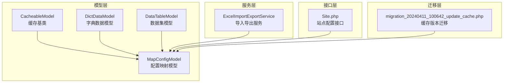
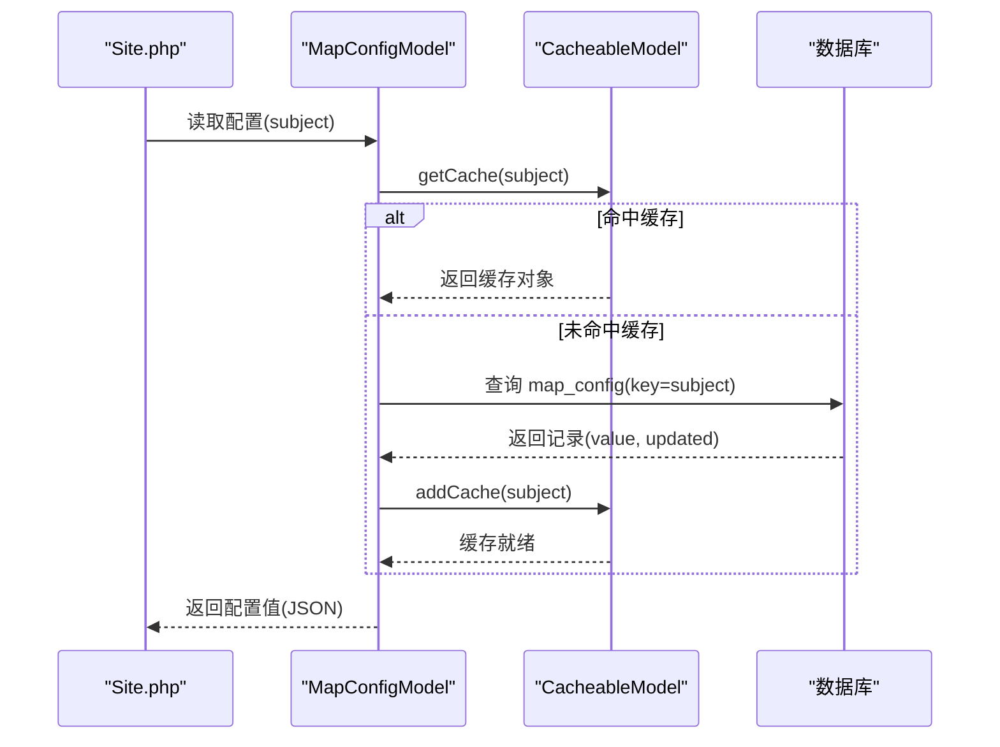
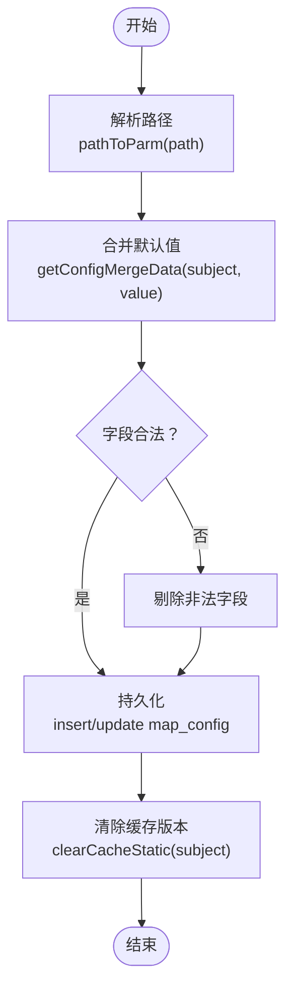
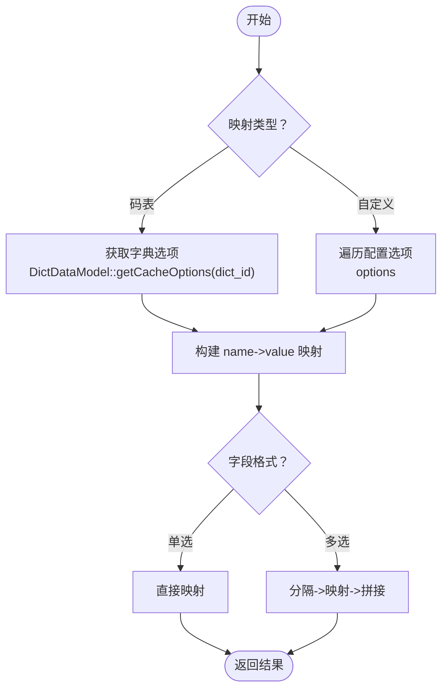
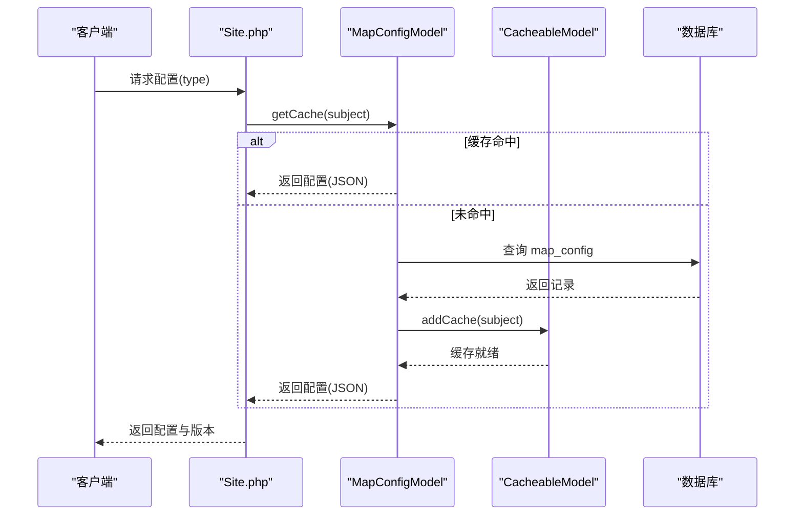
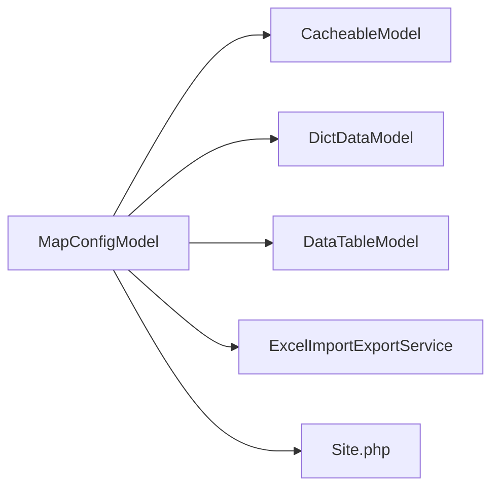

# 配置映射模型

<cite>
**本文引用的文件**
- [MapConfigModel.php](file://process/src/models/MapConfigModel.php)
- [CacheableModel.php](file://process/src/models/CacheableModel.php)
- [DictDataModel.php](file://process/src/models/DictDataModel.php)
- [ExcelImportExportService.php](file://process/src/services/desktopManage/ExcelImportExportService.php)
- [DataTableModel.php](file://process/src/models/DataTableModel.php)
- [Site.php](file://process/src/http/api/Site.php)
- [migration_20240411_100642_update_cache.php](file://process/src/migrations/migration_20240411_100642_update_cache.php)
</cite>

## 目录
1. [简介](#简介)
2. [项目结构](#项目结构)
3. [核心组件](#核心组件)
4. [架构总览](#架构总览)
5. [详细组件分析](#详细组件分析)
6. [依赖分析](#依赖分析)
7. [性能考虑](#性能考虑)
8. [故障排查指南](#故障排查指南)
9. [结论](#结论)
10. [附录](#附录)

## 简介
本文件围绕配置映射模型 MapConfigModel 展开，系统性阐述其映射配置管理与数据转换机制。内容涵盖：
- 配置映射的数据结构与字段映射规则
- 配置项的动态加载、合并与持久化
- 映射缓存策略与版本控制
- 数据类型转换与格式化处理
- 配置查询、规则更新与性能优化实践
- 版本管理与向后兼容策略

## 项目结构
MapConfigModel 位于 models 层，继承通用缓存模型 CacheableModel，提供配置项的读取、合并、持久化与缓存失效能力；同时与字典数据 DictDataModel、数据集字段模型 DataTableModel、导入导出服务 ExcelImportExportService 等协作，完成选项字段的名称/编码映射与格式化。

图表来源
- [MapConfigModel.php](file://process/src/models/MapConfigModel.php#L1-L120)
- [CacheableModel.php](file://process/src/models/CacheableModel.php#L1-L103)
- [DictDataModel.php](file://process/src/models/DictDataModel.php#L1-L66)
- [DataTableModel.php](file://process/src/models/DataTableModel.php#L1-L120)
- [ExcelImportExportService.php](file://process/src/services/desktopManage/ExcelImportExportService.php#L1538-L1636)
- [Site.php](file://process/src/http/api/Site.php#L230-L418)
- [migration_20240411_100642_update_cache.php](file://process/src/migrations/migration_20240411_100642_update_cache.php#L1-L20)

章节来源
- [MapConfigModel.php](file://process/src/models/MapConfigModel.php#L1-L200)
- [CacheableModel.php](file://process/src/models/CacheableModel.php#L1-L103)

## 核心组件
- MapConfigModel：配置映射的核心模型，提供配置项的默认值合并、路径解析、持久化、缓存失效与版本控制。
- CacheableModel：通用缓存基类，提供基于列的缓存键、版本号、缓存清理与批量更新时的缓存失效。
- DictDataModel：字典数据模型，提供字典选项的缓存与读取，供选项字段映射使用。
- DataTableModel：数据集模型，定义字段类型与格式，为选项字段的映射与格式化提供依据。
- ExcelImportExportService：导入导出服务，提供选项字段的名称/编码映射与多选/单选转换逻辑。
- Site.php：站点配置接口，演示如何从 MapConfigModel 读取配置并合并默认值。

章节来源
- [MapConfigModel.php](file://process/src/models/MapConfigModel.php#L1800-L1917)
- [CacheableModel.php](file://process/src/models/CacheableModel.php#L23-L103)
- [DictDataModel.php](file://process/src/models/DictDataModel.php#L52-L66)
- [DataTableModel.php](file://process/src/models/DataTableModel.php#L407-L460)
- [ExcelImportExportService.php](file://process/src/services/desktopManage/ExcelImportExportService.php#L1538-L1636)
- [Site.php](file://process/src/http/api/Site.php#L230-L260)

## 架构总览
MapConfigModel 通过 DEFAULT_VALUE 提供配置项的默认值集合，结合 pathToParm 解析路径，使用 getConfigMergeData 合并用户配置与默认值，最终以 JSON 形式持久化到 map_config 表。缓存通过 CacheableModel 的 getCache/clearCacheStatic 实现，版本控制由 updated 字段驱动。

图表来源
- [Site.php](file://process/src/http/api/Site.php#L230-L260)
- [MapConfigModel.php](file://process/src/models/MapConfigModel.php#L1800-L1816)
- [CacheableModel.php](file://process/src/models/CacheableModel.php#L23-L48)

## 详细组件分析

### MapConfigModel：配置映射与转换
- 数据结构与默认值
  - DEFAULT_VALUE 定义了多种配置主题（如站点配置、登录配置、AI配置等）的默认值结构，便于在未配置时提供回退。
  - getConfigMergeData 将用户配置与默认值进行合并，确保字段完整性与一致性。
- 路径解析与持久化
  - pathToParm 将形如“主题.字段”的路径拆分为 subject 与 field。
  - configSave 校验字段合法性，合并默认值，插入或更新 map_config 记录，并触发缓存失效。
- 缓存与版本控制
  - 继承 CacheableModel，使用 updated 作为版本字段，afterSave/clearCacheStatic 在更新后更新缓存版本。
  - 迁移脚本 migration_20240411_100642_update_cache 将所有记录的 updated 刷新为当前时间，强制缓存版本更新。
- 选项字段映射与格式化
  - ExcelImportExportService 中的 getOptionNameToValueMap 根据字段配置的映射类型（码表/自定义），构建名称到编码的映射表，并支持多选与单选场景的转换。
  - DataTableModel 定义了字段类型与格式（如 radio/select/checkbox/timestamp/date 等），为映射与格式化提供约束。

图表来源
- [MapConfigModel.php](file://process/src/models/MapConfigModel.php#L1818-L1917)
- [ExcelImportExportService.php](file://process/src/services/desktopManage/ExcelImportExportService.php#L1538-L1636)
- [DataTableModel.php](file://process/src/models/DataTableModel.php#L407-L460)

章节来源
- [MapConfigModel.php](file://process/src/models/MapConfigModel.php#L1811-L1917)
- [ExcelImportExportService.php](file://process/src/services/desktopManage/ExcelImportExportService.php#L1538-L1636)
- [DataTableModel.php](file://process/src/models/DataTableModel.php#L407-L460)
- [migration_20240411_100642_update_cache.php](file://process/src/migrations/migration_20240411_100642_update_cache.php#L1-L20)

### 选项字段映射与转换算法
- 映射类型
  - 码表映射：通过 DictDataModel::getCacheOptions 获取字典选项，构建 name/code 映射，并同时支持 code->code 的自映射，避免用户直接输入编码值导致的不一致。
  - 自定义映射：从字段配置的 options 中提取 name/value，构建 name->value 映射。
- 转换逻辑
  - 单选字段：直接使用 name->value 映射，若找不到则保留原值。
  - 多选字段：按逗号分割字符串，逐项映射后再拼接。
- 格式化处理
  - 根据字段 format（如 select/checkbox/radio）选择不同的映射与拼接策略，确保输出符合前端展示需求。

图表来源
- [ExcelImportExportService.php](file://process/src/services/desktopManage/ExcelImportExportService.php#L1538-L1636)
- [DictDataModel.php](file://process/src/models/DictDataModel.php#L52-L66)
- [DataTableModel.php](file://process/src/models/DataTableModel.php#L407-L460)

章节来源
- [ExcelImportExportService.php](file://process/src/services/desktopManage/ExcelImportExportService.php#L1538-L1636)
- [DictDataModel.php](file://process/src/models/DictDataModel.php#L52-L66)

### 配置查询、更新与验证
- 查询
  - 通过 MapConfigModel::getCache(subject) 读取缓存或数据库记录，返回 JSON 配置值。
  - Site.php 中演示了多主题配置的聚合与版本累加。
- 更新
  - configSave 校验字段合法性，合并默认值，执行 insert/on conflict update，随后清除缓存版本。
- 验证
  - 对特定配置（如二次验证）进行参数校验与权限校验，异常时抛出用户异常。

图表来源
- [Site.php](file://process/src/http/api/Site.php#L230-L260)
- [MapConfigModel.php](file://process/src/models/MapConfigModel.php#L1800-L1816)
- [CacheableModel.php](file://process/src/models/CacheableModel.php#L23-L48)

章节来源
- [Site.php](file://process/src/http/api/Site.php#L230-L260)
- [MapConfigModel.php](file://process/src/models/MapConfigModel.php#L1889-L1917)

### 版本管理与向后兼容
- 版本控制
  - 使用 updated 字段作为版本依据，CacheableModel::getVersion 返回时间戳，用于缓存版本比较。
  - 迁移脚本将所有记录的 updated 刷新为当前时间，强制缓存版本更新，保证配置变更立即生效。
- 向后兼容
  - DEFAULT_VALUE 提供默认值集合，configSave 在未配置字段时自动合并默认值，避免因字段缺失导致的异常。
  - 对于新增字段，旧配置不会丢失，新字段采用默认值，确保系统稳定运行。

章节来源
- [CacheableModel.php](file://process/src/models/CacheableModel.php#L45-L71)
- [migration_20240411_100642_update_cache.php](file://process/src/migrations/migration_20240411_100642_update_cache.php#L1-L20)
- [MapConfigModel.php](file://process/src/models/MapConfigModel.php#L1811-L1816)

## 依赖分析
- MapConfigModel 依赖
  - CacheableModel：缓存与版本控制
  - DictDataModel：码表选项映射
  - DataTableModel：字段类型与格式约束
  - ExcelImportExportService：选项字段映射与转换
  - Site.php：配置聚合与版本累加
- 外部依赖
  - 数据库：map_config 表
  - 缓存：统一缓存组件（版本更新）

图表来源
- [MapConfigModel.php](file://process/src/models/MapConfigModel.php#L1-L120)
- [CacheableModel.php](file://process/src/models/CacheableModel.php#L1-L103)
- [DictDataModel.php](file://process/src/models/DictDataModel.php#L1-L66)
- [DataTableModel.php](file://process/src/models/DataTableModel.php#L1-L120)
- [ExcelImportExportService.php](file://process/src/services/desktopManage/ExcelImportExportService.php#L1538-L1636)
- [Site.php](file://process/src/http/api/Site.php#L230-L260)

章节来源
- [MapConfigModel.php](file://process/src/models/MapConfigModel.php#L1-L120)
- [CacheableModel.php](file://process/src/models/CacheableModel.php#L1-L103)

## 性能考虑
- 缓存命中率
  - 使用 CacheableModel 的 getCache/getCacheKey，减少数据库查询次数；合理设置缓存过期时间，平衡实时性与性能。
- 批量更新与缓存失效
  - CacheableModel::update 在未指定缓存键时，会查询受影响的键并逐一更新版本，避免遗漏失效。
- JSON 持久化
  - 配置以 JSON 存储，读取后直接解码使用，减少序列化成本；更新时使用 ON CONFLICT UPDATE，降低写入开销。
- 选项映射
  - 字典选项通过 DictData 缓存对象复用，避免重复查询；映射表构建后在内存中进行转换，减少 IO。

章节来源
- [CacheableModel.php](file://process/src/models/CacheableModel.php#L83-L103)
- [MapConfigModel.php](file://process/src/models/MapConfigModel.php#L1825-L1838)
- [DictDataModel.php](file://process/src/models/DictDataModel.php#L52-L66)

## 故障排查指南
- 配置未生效
  - 检查是否调用 configSave 并触发 clearCacheStatic(subject)，确认缓存版本已更新。
  - 若使用迁移脚本强制刷新版本，确认 updated 字段已被更新。
- 权限不足或参数异常
  - 对特定配置（如二次验证）进行权限与参数校验，异常时会抛出用户异常，需检查调用者权限与参数范围。
- 选项映射不正确
  - 确认映射类型（码表/自定义）与字段 format 是否匹配；检查字典选项是否正确加载；多选场景注意逗号分隔与空值处理。

章节来源
- [MapConfigModel.php](file://process/src/models/MapConfigModel.php#L1841-L1890)
- [ExcelImportExportService.php](file://process/src/services/desktopManage/ExcelImportExportService.php#L1538-L1636)
- [migration_20240411_100642_update_cache.php](file://process/src/migrations/migration_20240411_100642_update_cache.php#L1-L20)

## 结论
MapConfigModel 通过默认值合并、路径解析、JSON 持久化与缓存版本控制，实现了配置映射的完整生命周期管理。配合字典数据与数据集模型，能够可靠地完成选项字段的名称/编码映射与格式化处理。在性能方面，缓存命中与批量更新策略有效降低了数据库压力；在稳定性方面，版本迁移与默认值合并保障了向后兼容与系统健壮性。

## 附录
- 配置主题与默认值参考
  - 站点配置、登录配置、AI配置、访客规则、隐私政策、数据集配置等主题均在 DEFAULT_VALUE 中定义，便于扩展与维护。
- 字段类型与格式参考
  - DataTableModel 定义了字段类型与格式常量，为映射与格式化提供统一约束。

章节来源
- [MapConfigModel.php](file://process/src/models/MapConfigModel.php#L280-L520)
- [DataTableModel.php](file://process/src/models/DataTableModel.php#L407-L460)