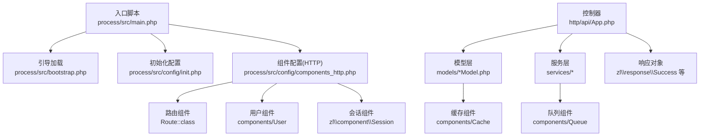
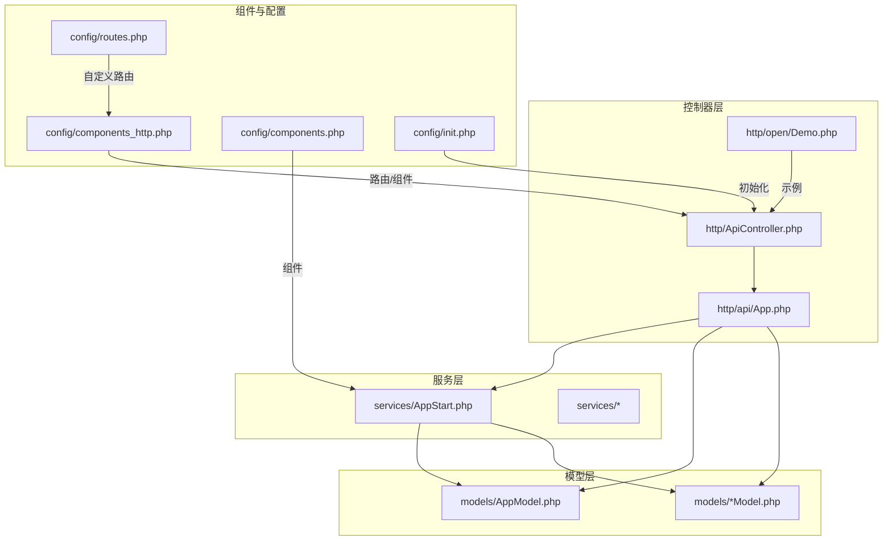
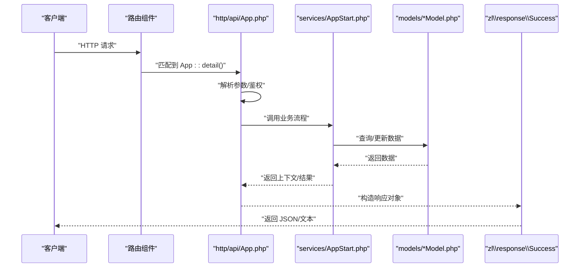
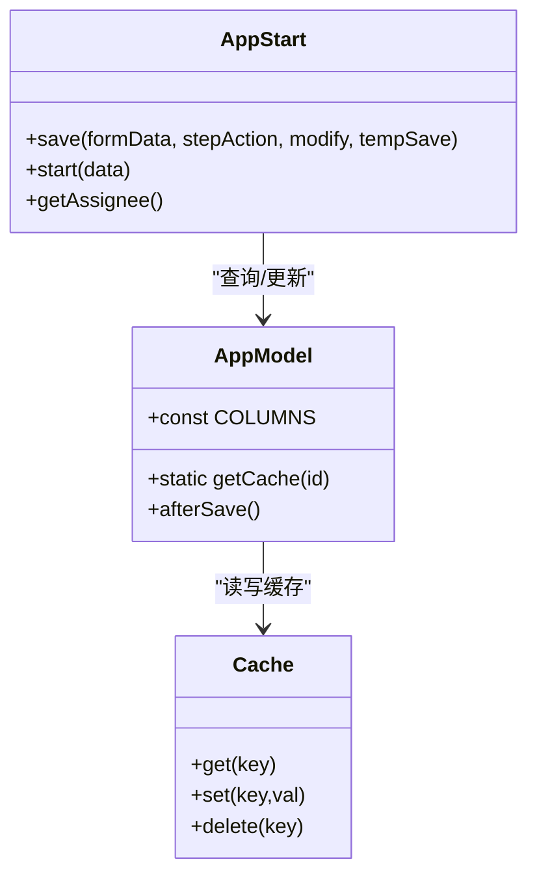
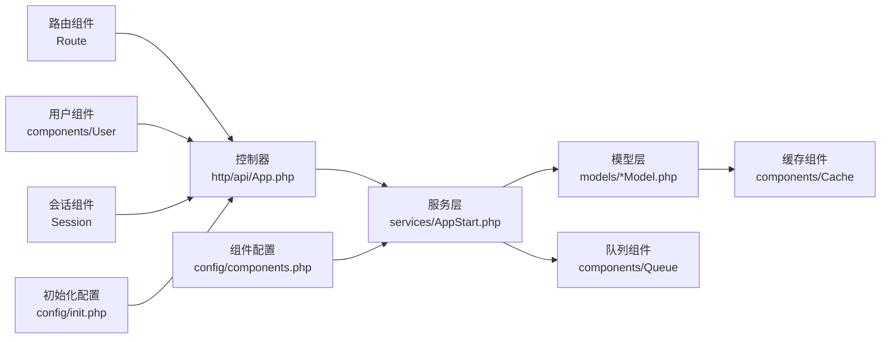

# MVC 架构模式

<cite>
**本文引用的文件**
- [main.php](file://process/src/main.php)
- [bootstrap.php](file://process/src/bootstrap.php)
- [init.php](file://process/src/config/init.php)
- [components.php](file://process/src/config/components.php)
- [components_http.php](file://process/src/config/components_http.php)
- [routes.php](file://process/src/config/routes.php)
- [ApiController.php](file://process/src/http/ApiController.php)
- [App.php](file://process/src/http/api/App.php)
- [Demo.php](file://process/src/http/open/Demo.php)
- [AppModel.php](file://process/src/models/AppModel.php)
- [AppStart.php](file://process/src/services/AppStart.php)
- [Curl.php](file://process/src/helpers/functions/Curl.php)
- [Module.php](file://process/src/modules/Module.php)
- [Cache.php](file://process/src/components/Cache.php)
- [User.php](file://process/src/components/User.php)
- [Queue.php](file://process/src/components/Queue.php)
- [ErrorHandler.php](file://process/src/components/ErrorHandler.php)
- [data_table.php.tpl](file://process/src/commands/data_table.php.tpl)
</cite>

## 目录
1. [引言](#引言)
2. [项目结构](#项目结构)
3. [核心组件](#核心组件)
4. [架构总览](#架构总览)
5. [详细组件分析](#详细组件分析)
6. [依赖分析](#依赖分析)
7. [性能考虑](#性能考虑)
8. [故障排查指南](#故障排查指南)
9. [结论](#结论)
10. [附录](#附录)

## 引言
本文件系统性梳理 htdNew 项目的 MVC 架构实践，围绕控制器层、模型层与视图层的职责划分与协作方式进行深入说明。重点涵盖：
- 控制器如何接收请求、解析参数、调用服务与生成响应；
- 模型层的数据访问模式、ORM 映射与数据验证机制；
- 视图层的模板渲染与数据绑定（本项目以 API 为主，视图层体现为响应对象）；
- MVC 层间交互、依赖注入与生命周期管理；
- 提供架构图与数据流图，帮助读者快速把握系统全貌。

## 项目结构
htdNew 采用“入口脚本 + 自动加载 + 组件配置 + 控制器/模型/服务”的分层组织方式。入口脚本负责初始化运行环境与组件容器；自动加载器按命名空间与目录规则解析类文件；配置文件集中定义路由规则、组件与事件监听；控制器负责请求处理，模型负责数据访问，服务层封装业务流程。

图表来源
- [main.php](file://process/src/main.php#L1-L25)
- [bootstrap.php](file://process/src/bootstrap.php#L1-L40)
- [init.php](file://process/src/config/init.php#L1-L48)
- [components_http.php](file://process/src/config/components_http.php#L1-L33)
- [App.php](file://process/src/http/api/App.php#L1-L200)
- [AppModel.php](file://process/src/models/AppModel.php#L1-L200)
- [Cache.php](file://process/src/components/Cache.php)
- [User.php](file://process/src/components/User.php)
- [Queue.php](file://process/src/components/Queue.php)

章节来源
- [main.php](file://process/src/main.php#L1-L25)
- [bootstrap.php](file://process/src/bootstrap.php#L1-L40)
- [init.php](file://process/src/config/init.php#L1-L48)
- [components_http.php](file://process/src/config/components_http.php#L1-L33)

## 核心组件
- 入口与引导
  - 入口脚本负责启用协程钩子、加载 Composer 自动加载器、设置默认 HTTP Handler，并引入引导文件启动框架主流程。
  - 引导文件注册自动加载器，支持 vendor、runtime、envs 等命名空间与本地模块目录的类解析。
- 配置与组件
  - 初始化配置读取 YAML 并设置日志级别、全局事件分发器等。
  - 组件配置集中定义数据库、缓存、Redis、通知、队列等组件，HTTP 组件定义路由规则与用户/会话组件。
- 控制器
  - 抽象控制器基类来自第三方框架模块，具体控制器继承该基类，统一处理请求参数、鉴权与响应生成。
- 模型
  - 模型基于可缓存模型基类，提供 ORM 字段映射、缓存读写、事件钩子等能力。
- 服务
  - 服务封装复杂业务流程，如应用发起、流程节点处理、多步表单、事件触发等。
- 辅助与工具
  - HTTP 客户端封装 Swoole 协程 HTTP 调用，统一记录请求/响应日志。

章节来源
- [main.php](file://process/src/main.php#L1-L25)
- [bootstrap.php](file://process/src/bootstrap.php#L1-L40)
- [init.php](file://process/src/config/init.php#L1-L48)
- [components.php](file://process/src/config/components.php#L1-L34)
- [components_http.php](file://process/src/config/components_http.php#L1-L33)
- [ApiController.php](file://process/src/http/ApiController.php#L1-L9)
- [App.php](file://process/src/http/api/App.php#L1-L200)
- [AppModel.php](file://process/src/models/AppModel.php#L1-L200)
- [AppStart.php](file://process/src/services/AppStart.php#L1-L200)
- [Curl.php](file://process/src/helpers/functions/Curl.php#L1-L66)

## 架构总览
下图展示 MVC 在 htdNew 中的落地形态：控制器作为入口，调用服务层完成业务处理，服务层通过模型层访问数据，最终由控制器返回响应对象。组件配置贯穿于 HTTP 请求生命周期，路由规则决定控制器与方法的分发。

图表来源
- [ApiController.php](file://process/src/http/ApiController.php#L1-L9)
- [App.php](file://process/src/http/api/App.php#L1-L200)
- [Demo.php](file://process/src/http/open/Demo.php#L1-L12)
- [AppModel.php](file://process/src/models/AppModel.php#L1-L200)
- [AppStart.php](file://process/src/services/AppStart.php#L1-L200)
- [components_http.php](file://process/src/config/components_http.php#L1-L33)
- [components.php](file://process/src/config/components.php#L1-L34)
- [init.php](file://process/src/config/init.php#L1-L48)
- [routes.php](file://process/src/config/routes.php#L1-L4)

## 详细组件分析

### 控制器层：请求处理、路由分发与响应生成
- 控制器基类
  - 抽象控制器基类来源于第三方框架模块，提供统一的请求参数解析、鉴权与响应封装能力。
- 具体控制器
  - API 控制器：继承抽象控制器，面向 API 场景，提供统一的错误处理与响应格式。
  - 示例控制器：演示如何返回成功响应对象，体现控制器只做“编排”，不做业务细节。
- 路由分发
  - HTTP 组件定义了路由规则，支持 envs 与 http 两套命名空间下的控制器方法分发，同时支持短链、文件下载、校验等规则。
  - 自定义路由可通过环境路径下的 routes.php 合并覆盖。
- 生命周期与依赖注入
  - 组件容器在初始化阶段注册组件，控制器在运行时通过组件容器获取用户、会话等依赖。
- 错误处理
  - 控制器层抛出异常或返回特定响应对象，配合全局错误处理器进行统一处理。

图表来源
- [components_http.php](file://process/src/config/components_http.php#L1-L33)
- [App.php](file://process/src/http/api/App.php#L1-L200)
- [AppStart.php](file://process/src/services/AppStart.php#L1-L200)
- [AppModel.php](file://process/src/models/AppModel.php#L1-L200)

章节来源
- [ApiController.php](file://process/src/http/ApiController.php#L1-L9)
- [App.php](file://process/src/http/api/App.php#L1-L200)
- [Demo.php](file://process/src/http/open/Demo.php#L1-L12)
- [components_http.php](file://process/src/config/components_http.php#L1-L33)
- [routes.php](file://process/src/config/routes.php#L1-L4)

### 模型层：数据访问、ORM 映射与验证
- 数据访问模式
  - 模型基于可缓存模型基类，提供字段映射、缓存读写、事件钩子等能力，典型方法包括 getCache、find/select/one/all 等。
- ORM 映射关系
  - 模型定义常量 COLUMNS 描述字段类型与注释，用于 ORM 层面的结构约束与序列化/反序列化。
- 数据验证机制
  - 业务层在服务中进行参数校验与权限控制，控制器层在必要时进行基础鉴权判断，模型层通过事件钩子与缓存一致性保障数据完整性。
- 缓存与一致性
  - 模型层结合缓存组件进行热点数据读写，服务层在事务成功后清理相关缓存，确保一致性。

图表来源
- [AppModel.php](file://process/src/models/AppModel.php#L1-L200)
- [Cache.php](file://process/src/components/Cache.php)
- [AppStart.php](file://process/src/services/AppStart.php#L1-L200)

章节来源
- [AppModel.php](file://process/src/models/AppModel.php#L1-L200)
- [components.php](file://process/src/config/components.php#L1-L34)
- [AppStart.php](file://process/src/services/AppStart.php#L1-L200)

### 视图层：模板渲染与数据绑定
- 本项目以 API 服务为主，视图层体现为响应对象与数据结构的组装，而非传统模板引擎渲染。
- 控制器在处理完成后返回统一的成功/错误响应对象，前端或调用方负责展示。
- 若存在站点类控制器，通常也会遵循同样的“数据准备 → 响应对象”的模式。

章节来源
- [App.php](file://process/src/http/api/App.php#L1-L200)

### 服务层：业务流程编排与事件驱动
- 服务层封装复杂业务流程，如应用发起、流程节点处理、多步表单、事件触发等。
- 通过事件分发器在关键节点触发事件，便于扩展与解耦。
- 服务层与模型层紧密协作，保证事务边界内的数据一致性。

章节来源
- [AppStart.php](file://process/src/services/AppStart.php#L1-L200)
- [init.php](file://process/src/config/init.php#L1-L48)

### 模块层：业务方法拆分
- 模块类用于存放跨模型的业务方法，便于将不适合放入模型的逻辑独立出来，提升可维护性。
- 通过模块类获取版本信息与应用模块关联，支撑服务层的业务编排。

章节来源
- [Module.php](file://process/src/modules/Module.php#L1-L34)

### 组件与工具：依赖注入与基础设施
- 组件配置集中定义数据库、缓存、Redis、通知、队列等组件，HTTP 组件定义路由与用户/会话组件。
- 组件容器在初始化阶段注册组件，控制器/服务在运行时通过组件容器获取依赖。
- HTTP 客户端封装 Swoole 协程 HTTP 调用，统一记录请求/响应日志，便于调试与审计。

章节来源
- [components.php](file://process/src/config/components.php#L1-L34)
- [components_http.php](file://process/src/config/components_http.php#L1-L33)
- [Curl.php](file://process/src/helpers/functions/Curl.php#L1-L66)

## 依赖分析
- 控制器依赖
  - 控制器依赖路由组件进行方法分发，依赖用户/会话组件进行鉴权，依赖响应对象进行输出。
- 服务依赖
  - 服务依赖模型层进行数据访问，依赖缓存/队列等组件进行性能优化与异步处理。
- 模型依赖
  - 模型依赖缓存组件与数据库连接，通过事件钩子与缓存一致性保障数据完整性。
- 配置与生命周期
  - 初始化配置负责注册事件监听器与日志级别设置；组件配置在运行期提供依赖注入；路由规则在请求进入时生效。

图表来源
- [components_http.php](file://process/src/config/components_http.php#L1-L33)
- [components.php](file://process/src/config/components.php#L1-L34)
- [init.php](file://process/src/config/init.php#L1-L48)
- [App.php](file://process/src/http/api/App.php#L1-L200)
- [AppStart.php](file://process/src/services/AppStart.php#L1-L200)
- [AppModel.php](file://process/src/models/AppModel.php#L1-L200)
- [Cache.php](file://process/src/components/Cache.php)
- [Queue.php](file://process/src/components/Queue.php)

章节来源
- [components_http.php](file://process/src/config/components_http.php#L1-L33)
- [components.php](file://process/src/config/components.php#L1-L34)
- [init.php](file://process/src/config/init.php#L1-L48)

## 性能考虑
- 协程与异步
  - 入口脚本启用协程钩子，提升并发处理能力；服务层在合适场景使用协程上下文与队列组件异步处理。
- 缓存策略
  - 模型层广泛使用缓存组件，减少数据库压力；服务层在事务成功后清理缓存，避免脏读。
- 日志与监控
  - HTTP 客户端统一记录请求/响应日志，便于定位性能瓶颈与异常。

章节来源
- [main.php](file://process/src/main.php#L1-L25)
- [Curl.php](file://process/src/helpers/functions/Curl.php#L1-L66)
- [AppModel.php](file://process/src/models/AppModel.php#L1-L200)

## 故障排查指南
- 路由不生效
  - 检查 HTTP 组件路由规则与环境路径下的自定义路由合并顺序；确认控制器方法签名与路由正则匹配。
- 依赖注入失败
  - 检查组件配置是否正确注册组件类与参数；确认初始化配置已加载并注册事件监听器。
- 缓存不一致
  - 模型保存后需清理相关缓存键；服务层在事务成功回调中执行缓存清理逻辑。
- 错误处理
  - 控制器层抛出异常或返回特定响应对象，配合全局错误处理器进行统一处理；必要时开启更详细的日志级别。

章节来源
- [components_http.php](file://process/src/config/components_http.php#L1-L33)
- [components.php](file://process/src/config/components.php#L1-L34)
- [ErrorHandler.php](file://process/src/components/ErrorHandler.php)

## 结论
htdNew 的 MVC 实践以“控制器编排、服务流程、模型持久化”为核心，通过组件化与事件驱动实现高内聚低耦合。控制器层专注于请求与响应，模型层专注数据访问与一致性，服务层承担复杂业务编排与事件触发。路由规则与组件配置贯穿生命周期，形成清晰的职责边界与协作关系。

## 附录
- 数据表模型生成模板
  - 提供数据表模型生成模板，约定主键、字段映射与表名，便于快速生成数据表模型基类。

章节来源
- [data_table.php.tpl](file://process/src/commands/data_table.php.tpl#L1-L23)