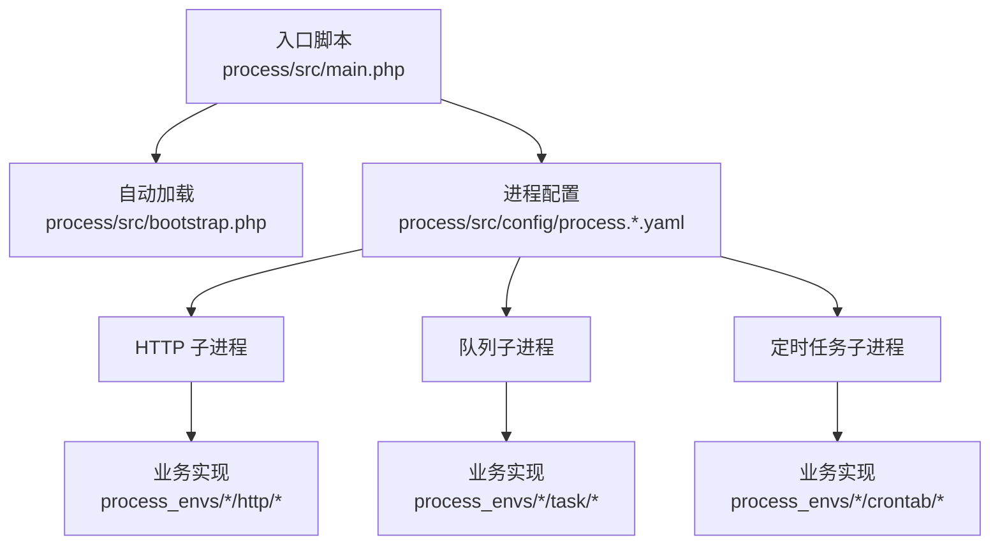
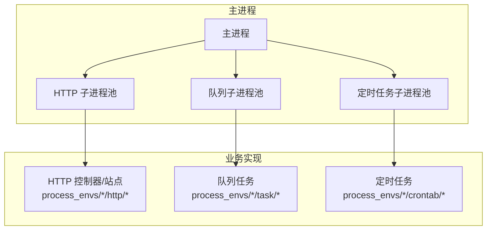
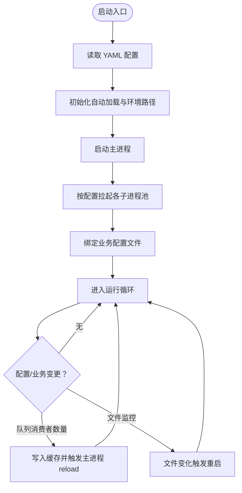
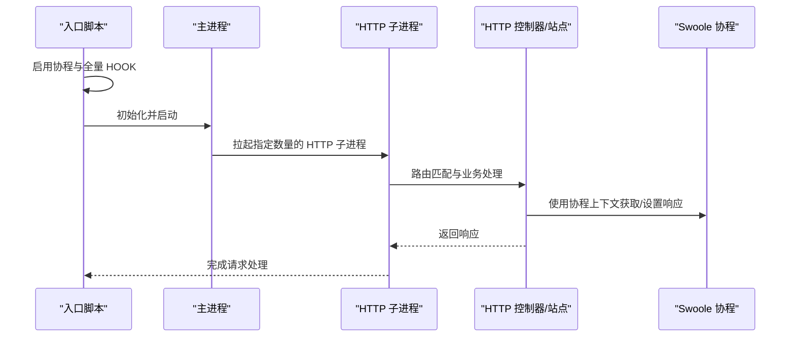
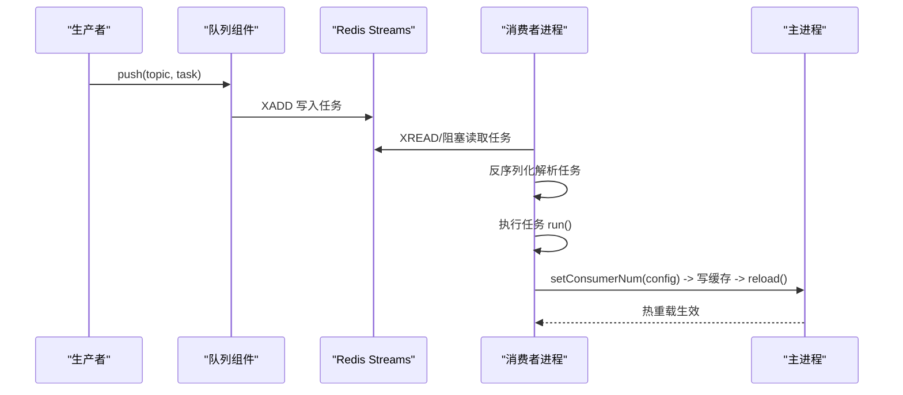
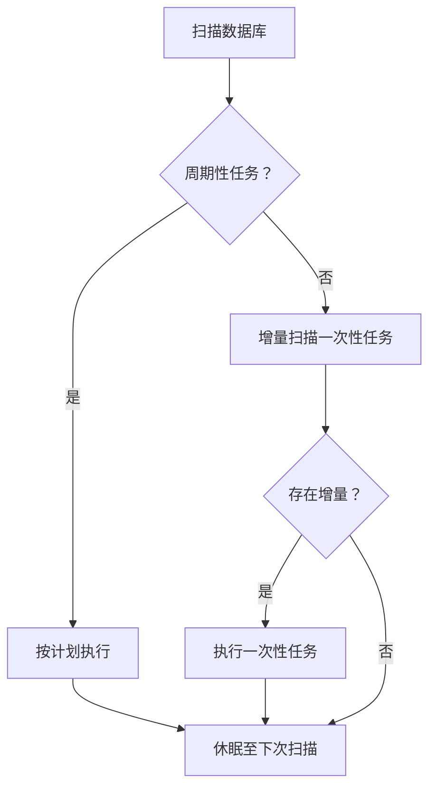
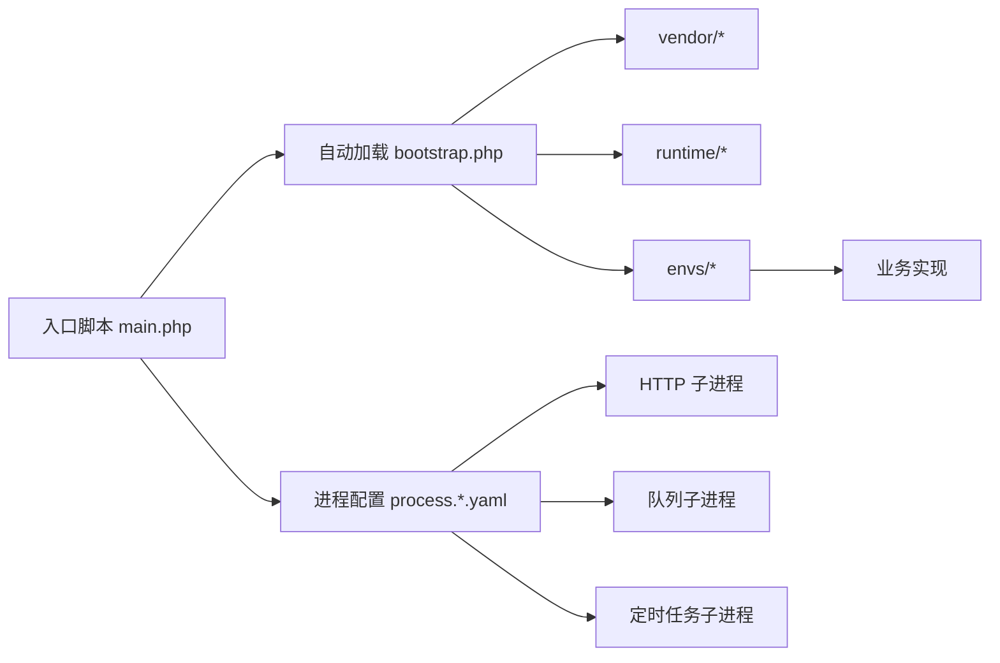

# 多进程架构设计

<cite>
**本文引用的文件**
- [process.dev.yaml](file://process/src/config/process.dev.yaml)
- [process.prod.yaml](file://process/src/config/process.prod.yaml)
- [main.php](file://process/src/main.php)
- [bootstrap.php](file://process/src/bootstrap.php)
- [Queue.php](file://process/src/components/Queue.php)
- [CrontabProcess.php](file://process/src/services/crontab/CrontabProcess.php)
- [LockerHelper.php](file://process/src/helpers/LockerHelper.php)
- [User.php](file://process/src/components/User.php)
- [XidianAimh.php](file://process_envs/xidian/product/http/site/XidianAimh.php)
- [process_envs 示例-1](file://process_envs/uestc/product/crontab/SendMessage6.php)
- [process_envs 示例-2](file://process_envs/upc/product/crontab/PushCaiwuCrontab.php)
- [process_envs 示例-3](file://process_envs/hrl/product/crontab/pushClockInCrontab.php)
</cite>

## 目录
1. [引言](#引言)
2. [项目结构](#项目结构)
3. [核心组件](#核心组件)
4. [架构总览](#架构总览)
5. [详细组件分析](#详细组件分析)
6. [依赖关系分析](#依赖关系分析)
7. [性能考量](#性能考量)
8. [故障排查指南](#故障排查指南)
9. [结论](#结论)
10. [附录](#附录)

## 引言
本文件面向 htdNew 项目的多进程架构设计，围绕基于 Swoole 的多进程管理模式进行系统化说明。重点涵盖主进程如何统一管理 HTTP、队列、定时任务等子进程；进程池配置参数、进程间通信机制与生命周期管理；协程启用策略、HOOK 策略选择与性能优化；进程配置文件结构、环境差异配置以及进程监控机制。文末提供架构图与数据流图，帮助开发者快速理解多进程协作的工作原理。

## 项目结构
htdNew 将“进程管理”与“业务实现”解耦：进程管理由独立的配置与入口负责，业务逻辑分布在 process_envs 下按机构/产品维度组织。核心入口与配置如下：
- 入口脚本：process/src/main.php
- 自动加载：process/src/bootstrap.php
- 进程配置：process/src/config/process.dev.yaml 与 process/src/config/process.prod.yaml
- 子进程示例：
  - HTTP：process/src/config/process.*.yaml 中 http 节点
  - 队列：process/src/config/process.*.yaml 中 queue 节点
  - 定时任务：process/src/config/process.*.yaml 中 crontab 节点
  - 业务实现：process_envs 下各机构/产品的 http、crontab、task 等目录

图表来源
- [main.php](file://process/src/main.php#L1-L25)
- [bootstrap.php](file://process/src/bootstrap.php#L1-L40)
- [process.dev.yaml](file://process/src/config/process.dev.yaml#L1-L89)
- [process.prod.yaml](file://process/src/config/process.prod.yaml#L1-L80)

章节来源
- [main.php](file://process/src/main.php#L1-L25)
- [bootstrap.php](file://process/src/bootstrap.php#L1-L40)
- [process.dev.yaml](file://process/src/config/process.dev.yaml#L1-L89)
- [process.prod.yaml](file://process/src/config/process.prod.yaml#L1-L80)

## 核心组件
- 协程与 HOOK 启用
  - 在入口中启用 Swoole 协程与全量 HOOK，使 HTTP 客户端、网络 IO 等具备协程能力，提升吞吐与资源利用率。
  - 同时设置默认 HTTP 客户端处理器为 Swoole Handler，确保协程化网络请求行为一致。
- 进程配置与命名空间
  - 入口读取 YAML 配置，设置基础路径与命名空间，并根据 customer/envModel 动态定位 envs 路径。
- 进程池与进程模型
  - 配置文件定义主进程、HTTP、队列、定时任务等子进程的类名、数量、名称模板与业务配置文件路径。
  - 生产环境可启用 CPU 亲和性绑定，以提升缓存命中与减少上下文切换。
- 业务实现
  - HTTP：通过 process_envs 下的控制器/站点实现具体路由与业务逻辑。
  - 队列：通过组件封装 Redis Streams 推送与消费，支持动态调整消费者数量并触发主进程热重载。
  - 定时任务：通过 CrontabProcess 扫描数据库中的周期/一次性任务，按需调度执行。

章节来源
- [main.php](file://process/src/main.php#L1-L25)
- [process.dev.yaml](file://process/src/config/process.dev.yaml#L1-L89)
- [process.prod.yaml](file://process/src/config/process.prod.yaml#L1-L80)
- [Queue.php](file://process/src/components/Queue.php#L1-L52)
- [CrontabProcess.php](file://process/src/services/crontab/CrontabProcess.php#L1-L46)

## 架构总览
下图展示主进程如何统一管理 HTTP、队列、定时任务三类子进程，以及它们与业务实现的关系：

图表来源
- [process.dev.yaml](file://process/src/config/process.dev.yaml#L1-L89)
- [process.prod.yaml](file://process/src/config/process.prod.yaml#L1-L80)
- [Queue.php](file://process/src/components/Queue.php#L1-L52)
- [CrontabProcess.php](file://process/src/services/crontab/CrontabProcess.php#L1-L46)

## 详细组件分析

### 进程配置与生命周期
- 配置文件结构
  - runtimePath/logPath：运行与日志目录
  - project/customer/envModel：部署系统元信息
  - processes.main：主进程定义
  - processes.http/queue/crontab：子进程定义，含 class、name 模板、number、affinity、configFile 等
  - 生产环境额外支持 deploy 进程与 CPU 亲和绑定
- 生命周期管理
  - 启动：入口读取 YAML，初始化自动加载与环境路径，构造主进程并启动各子进程池
  - 运行：各子进程按配置数量拉起，绑定业务配置文件，持续监听与处理
  - 重启/热更新：队列消费者数量变更通过缓存写入后触发主进程 reload，避免频繁重启
  - 监控：开发环境可启用文件监控进程，自动重启工作进程（配置文件与进程类变更除外）

图表来源
- [main.php](file://process/src/main.php#L1-L25)
- [process.dev.yaml](file://process/src/config/process.dev.yaml#L1-L89)
- [process.prod.yaml](file://process/src/config/process.prod.yaml#L1-L80)
- [Queue.php](file://process/src/components/Queue.php#L1-L52)

章节来源
- [process.dev.yaml](file://process/src/config/process.dev.yaml#L1-L89)
- [process.prod.yaml](file://process/src/config/process.prod.yaml#L1-L80)
- [Queue.php](file://process/src/components/Queue.php#L1-L52)

### HTTP 子进程与协程策略
- 协程启用
  - 入口启用 Swoole 协程与全量 HOOK，使 HTTP 请求、Redis、MySQL 等 IO 变为非阻塞
  - 默认 HTTP 客户端处理器替换为 Swoole Handler，确保协程化网络行为一致
- 业务实现
  - HTTP 控制器/站点位于 process_envs/*/http/*，可直接使用协程上下文与 Swoole 提供的能力
  - 示例：站点控制器中通过协程上下文获取响应对象并设置响应头/状态码
- 性能建议
  - 合理设置 HTTP 子进程数量与 CPU 亲和，避免过多上下文切换
  - 对外请求尽量使用协程化客户端，减少阻塞等待

图表来源
- [main.php](file://process/src/main.php#L1-L25)
- [XidianAimh.php](file://process_envs/xidian/product/http/site/XidianAimh.php#L172-L260)
- [User.php](file://process/src/components/User.php#L251-L290)

章节来源
- [main.php](file://process/src/main.php#L1-L25)
- [XidianAimh.php](file://process_envs/xidian/product/http/site/XidianAimh.php#L172-L260)
- [User.php](file://process/src/components/User.php#L251-L290)

### 队列子进程与进程间通信
- 数据通道
  - 使用 Redis Streams 作为队列载体，生产者通过组件 push 方法写入，消费者从不同主题读取
- 进程间通信
  - 消费者数量动态调整：通过组件方法写入缓存键，随后调用主进程 reload 触发热更新
  - 业务侧通过 YAML 辅助工具读取当前消费者配置，实现运行期可视化与运维可控
- 锁与并发
  - 提供基于 Redis 的分布式锁封装，支持 trylock/wait/free，结合协程 defer 释放，保障幂等与一致性

图表来源
- [Queue.php](file://process/src/components/Queue.php#L1-L52)
- [LockerHelper.php](file://process/src/helpers/LockerHelper.php#L1-L48)

章节来源
- [Queue.php](file://process/src/components/Queue.php#L1-L52)
- [LockerHelper.php](file://process/src/helpers/LockerHelper.php#L1-L48)

### 定时任务子进程与调度策略
- 任务来源
  - 周期性任务与一次性增量任务均来自数据库模型，通过 CrontabProcess 统一扫描与调度
- 调度策略
  - 周期性任务：按规则周期执行
  - 一次性任务：按修改时间增量扫描，避免全量扫描带来的压力
- 业务实现
  - 各机构/产品在 process_envs/*/crontab/* 下实现具体任务逻辑，如企业微信打卡推送、财务推送重试等

图表来源
- [CrontabProcess.php](file://process/src/services/crontab/CrontabProcess.php#L1-L46)
- [process_envs 示例-1](file://process_envs/uestc/product/crontab/SendMessage6.php#L1-L38)
- [process_envs 示例-2](file://process_envs/upc/product/crontab/PushCaiwuCrontab.php#L1-L47)
- [process_envs 示例-3](file://process_envs/hrl/product/crontab/pushClockInCrontab.php#L1-L45)

章节来源
- [CrontabProcess.php](file://process/src/services/crontab/CrontabProcess.php#L1-L46)
- [process_envs 示例-1](file://process_envs/uestc/product/crontab/SendMessage6.php#L1-L38)
- [process_envs 示例-2](file://process_envs/upc/product/crontab/PushCaiwuCrontab.php#L1-L47)
- [process_envs 示例-3](file://process_envs/hrl/product/crontab/pushClockInCrontab.php#L1-L45)

## 依赖关系分析
- 入口与自动加载
  - 入口脚本负责协程/HOOK 初始化、默认 HTTP 客户端处理器替换、自动加载引导与主进程启动
  - 自动加载根据命名空间前缀映射 vendor/runtime/envs 与源码目录，支持动态环境路径
- 进程配置与业务实现
  - 配置文件决定子进程数量、名称、CPU 亲和与业务配置文件路径
  - 业务实现位于 process_envs 下，按机构/产品维度组织，与进程模型解耦
- 运维与监控
  - 队列组件提供消费者数量热更新能力，结合主进程 reload 实现平滑变更
  - 开发环境可启用文件监控进程，自动重启工作进程（配置文件与进程类变更除外）

图表来源
- [main.php](file://process/src/main.php#L1-L25)
- [bootstrap.php](file://process/src/bootstrap.php#L1-L40)
- [process.dev.yaml](file://process/src/config/process.dev.yaml#L1-L89)
- [process.prod.yaml](file://process/src/config/process.prod.yaml#L1-L80)

章节来源
- [main.php](file://process/src/main.php#L1-L25)
- [bootstrap.php](file://process/src/bootstrap.php#L1-L40)
- [process.dev.yaml](file://process/src/config/process.dev.yaml#L1-L89)
- [process.prod.yaml](file://process/src/config/process.prod.yaml#L1-L80)

## 性能考量
- 协程与 HOOK
  - 启用全量 HOOK 使网络 IO、文件 IO 等具备协程能力，显著降低阻塞等待
  - 默认 HTTP 客户端处理器替换为 Swoole Handler，确保协程化请求的一致性
- 进程与 CPU 亲和
  - 生产环境可通过 affinity 将 HTTP 子进程绑定到特定 CPU 核，提升缓存命中率与减少上下文切换
- 队列与锁
  - 使用 Redis Streams 作为队列，配合 trylock/wait/free 实现分布式锁，保障幂等与一致性
  - 动态调整消费者数量并通过主进程 reload 热更新，避免频繁重启
- 定时任务
  - 增量扫描一次性任务，减少数据库压力；周期性任务按计划执行，避免重复调度

章节来源
- [main.php](file://process/src/main.php#L1-L25)
- [process.prod.yaml](file://process/src/config/process.prod.yaml#L1-L80)
- [Queue.php](file://process/src/components/Queue.php#L1-L52)
- [LockerHelper.php](file://process/src/helpers/LockerHelper.php#L1-L48)
- [CrontabProcess.php](file://process/src/services/crontab/CrontabProcess.php#L1-L46)

## 故障排查指南
- 协程未生效
  - 检查入口是否正确启用协程与 HOOK，确认默认 HTTP 客户端处理器已被替换
- 进程未按预期拉起
  - 核对配置文件中 processes.http/queue/crontab 的 class、number、name 模板与 configFile 是否正确
  - 确认生产环境是否启用了 CPU 亲和绑定且值未超出 CPU 核数范围
- 队列消费者数量变更无效
  - 确认 setConsumerNum 是否被调用并写入缓存键，随后触发主进程 reload
  - 检查业务侧是否正确读取 YAML 辅助工具中的消费者配置
- 分布式锁失效
  - 检查 Redis 连接状态与键过期时间，确认 wait/trylock/free 的使用顺序与异常处理
- 定时任务未执行
  - 检查 CrontabProcess 的扫描逻辑与数据库任务状态，确认一次性任务的增量时间窗口是否合理

章节来源
- [main.php](file://process/src/main.php#L1-L25)
- [process.dev.yaml](file://process/src/config/process.dev.yaml#L1-L89)
- [process.prod.yaml](file://process/src/config/process.prod.yaml#L1-L80)
- [Queue.php](file://process/src/components/Queue.php#L1-L52)
- [LockerHelper.php](file://process/src/helpers/LockerHelper.php#L1-L48)
- [CrontabProcess.php](file://process/src/services/crontab/CrontabProcess.php#L1-L46)

## 结论
htdNew 的多进程架构以 Swoole 为核心，通过统一入口与 YAML 配置实现对 HTTP、队列、定时任务等子进程的集中管理。协程与 HOOK 的启用提升了整体吞吐与资源利用率；队列与定时任务的业务实现与进程模型解耦，便于按机构/产品维度扩展；动态消费者数量与热重载机制提供了灵活的运维能力。建议在生产环境中合理设置 CPU 亲和与进程数量，并结合监控与日志体系持续优化性能与稳定性。

## 附录
- 进程配置文件结构要点
  - runtimePath/logPath：运行与日志目录
  - project/customer/envModel：部署系统元信息
  - processes.main：主进程定义
  - processes.http/queue/crontab：子进程定义，含 class、name 模板、number、affinity、configFile
  - 生产环境可选 deploy 进程与 CPU 亲和绑定
- 环境差异配置
  - 开发环境：关注文件监控与调试便利性
  - 生产环境：强调 CPU 亲和、稳定性与热更新能力
- 进程监控机制
  - 开发环境可启用文件监控进程，自动重启工作进程（配置文件与进程类变更除外）
  - 生产环境通过主进程 reload 与业务日志实现健康监控与问题定位

章节来源
- [process.dev.yaml](file://process/src/config/process.dev.yaml#L1-L89)
- [process.prod.yaml](file://process/src/config/process.prod.yaml#L1-L80)