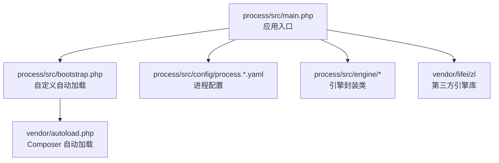
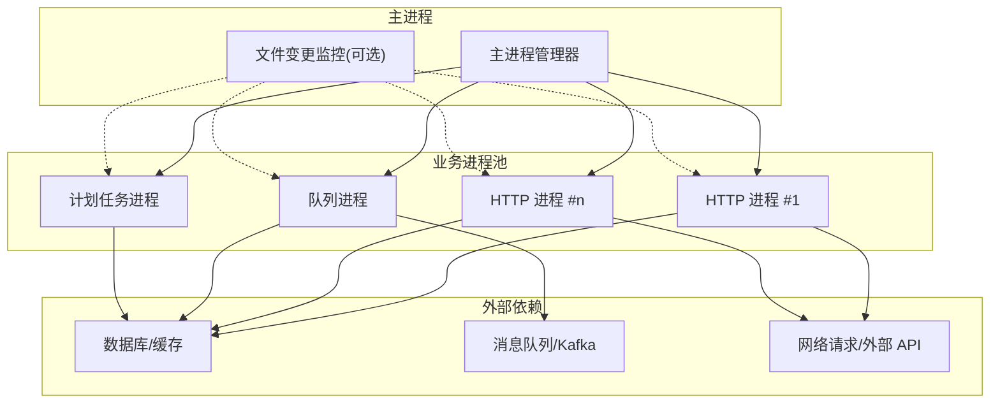
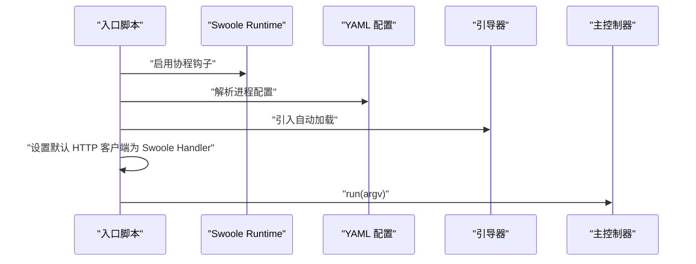
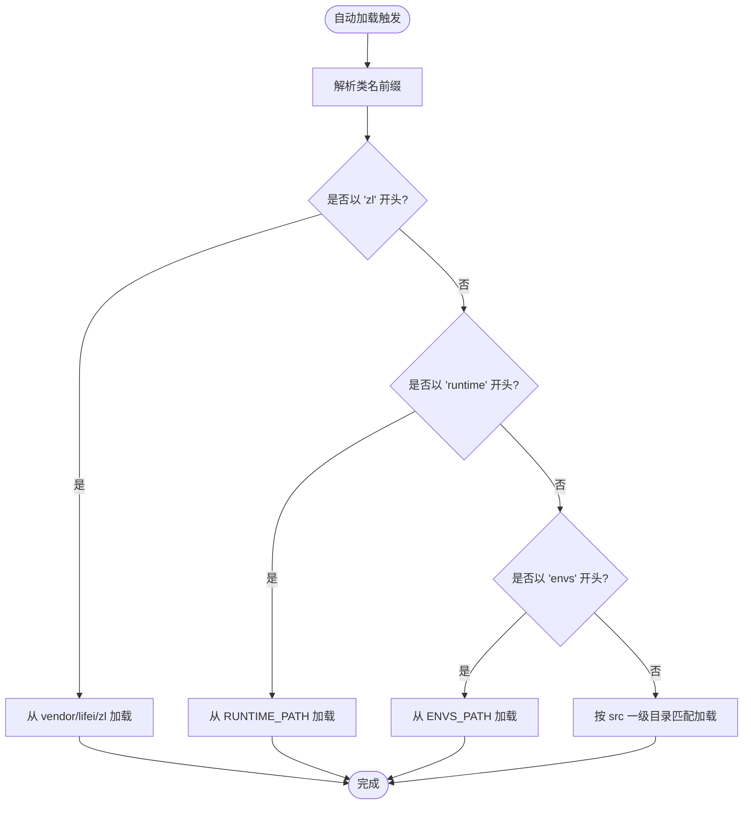
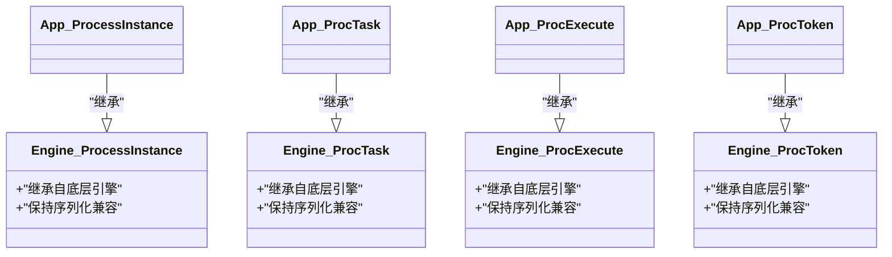
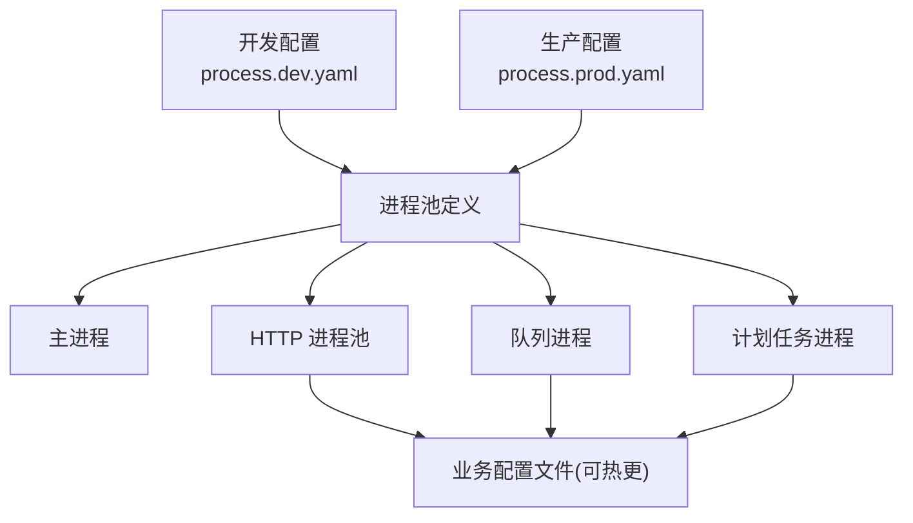
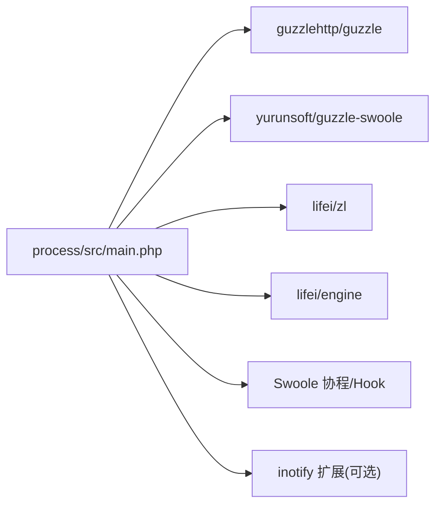
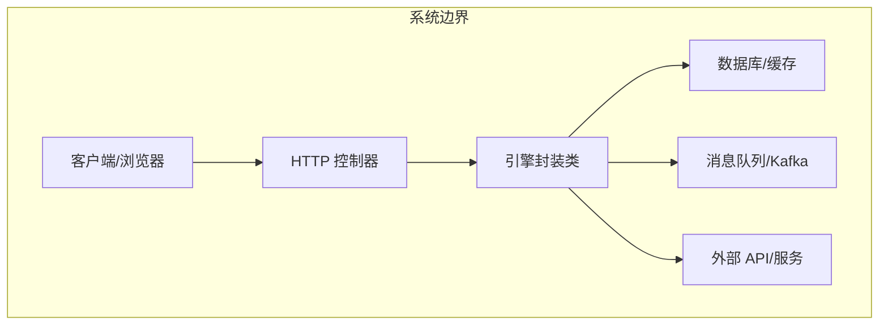

# 架构设计

<cite>
**本文引用的文件**
- [process/src/main.php](file://process/src/main.php)
- [process/src/bootstrap.php](file://process/src/bootstrap.php)
- [process/composer.json](file://process/composer.json)
- [process/src/config/process.dev.yaml](file://process/src/config/process.dev.yaml)
- [process/src/config/process.prod.yaml](file://process/src/config/process.prod.yaml)
- [process/src/engine/ProcessInstance.php](file://process/src/engine/ProcessInstance.php)
- [process/src/engine/ProcTask.php](file://process/src/engine/ProcTask.php)
- [process/src/engine/ProcExecute.php](file://process/src/engine/ProcExecute.php)
- [process/src/engine/ProcToken.php](file://process/src/engine/ProcToken.php)
</cite>

## 目录
1. [引言](#引言)
2. [项目结构](#项目结构)
3. [核心组件](#核心组件)
4. [架构总览](#架构总览)
5. [详细组件分析](#详细组件分析)
6. [依赖关系分析](#依赖关系分析)
7. [性能考虑](#性能考虑)
8. [故障排查指南](#故障排查指南)
9. [结论](#结论)
10. [附录](#附录)

## 引言
本架构设计文档面向 htdNew 项目，聚焦于基于 Swoole 的多进程架构与高并发处理能力，系统性阐述主进程管理、进程池配置、进程间通信机制、MVC 架构模式在项目中的落地方式、组件化设计与生命周期管理，并给出高并发处理策略、协程使用策略与性能优化方案。文档同时提供系统边界图、组件交互图与数据流向图，帮助开发者快速理解整体设计思路与技术权衡。

## 项目结构
htdNew 采用“进程级”模块化组织方式，核心入口位于 process/src/main.php，通过 YAML 配置驱动不同类型的进程（如 HTTP、队列、计划任务等），并由自定义引导器完成命名空间与类加载映射。引擎层通过轻量封装扩展底层流程执行能力，便于在多进程环境中稳定运行。

图表来源
- [process/src/main.php](file://process/src/main.php#L1-L25)
- [process/src/bootstrap.php](file://process/src/bootstrap.php#L1-L40)
- [process/composer.json](file://process/composer.json#L1-L70)

章节来源
- [process/src/main.php](file://process/src/main.php#L1-L25)
- [process/src/bootstrap.php](file://process/src/bootstrap.php#L1-L40)
- [process/composer.json](file://process/composer.json#L1-L70)

## 核心组件
- 应用入口与协程初始化：入口脚本启用 Swoole 协程钩子，设置默认 HTTP 客户端为 Swoole Handler，随后加载配置与引导器并启动主控制器。
- 自定义自动加载：根据命名空间前缀将类映射到 vendor、运行时路径或环境定制路径，支持动态扩展与按需加载。
- 引擎封装：对底层流程实例、任务、执行器与令牌进行轻量继承封装，确保序列化兼容与生命周期一致性。
- 进程配置：通过 YAML 文件声明主进程、HTTP、队列、计划任务等进程类型及其数量、亲和性与业务配置文件路径。

章节来源
- [process/src/main.php](file://process/src/main.php#L1-L25)
- [process/src/bootstrap.php](file://process/src/bootstrap.php#L1-L40)
- [process/src/engine/ProcessInstance.php](file://process/src/engine/ProcessInstance.php#L1-L11)
- [process/src/engine/ProcTask.php](file://process/src/engine/ProcTask.php#L1-L11)
- [process/src/engine/ProcExecute.php](file://process/src/engine/ProcExecute.php#L1-L11)
- [process/src/engine/ProcToken.php](file://process/src/engine/ProcToken.php#L1-L11)
- [process/src/config/process.dev.yaml](file://process/src/config/process.dev.yaml#L1-L89)
- [process/src/config/process.prod.yaml](file://process/src/config/process.prod.yaml#L1-L80)

## 架构总览
系统采用“主进程 + 多进程池”的架构，主进程负责统一调度与监控，各业务进程（HTTP、队列、计划任务）独立运行并共享业务配置文件。Swoole 协程与 Hook 使 I/O 密集型场景具备高并发能力；进程内通过协程池与异步任务提升吞吐。

图表来源
- [process/src/config/process.dev.yaml](file://process/src/config/process.dev.yaml#L1-L89)
- [process/src/config/process.prod.yaml](file://process/src/config/process.prod.yaml#L1-L80)

## 详细组件分析

### 组件 A：入口与协程初始化
- 启用 Swoole 协程钩子，覆盖原生 cURL 与普通 cURL，使同步风格代码在协程中非阻塞。
- 加载 YAML 进程配置，注入基础路径与命名空间，设置环境路径，引入 Composer 自动加载。
- 将默认 HTTP 客户端替换为 Swoole Handler，确保协程安全的网络 I/O。
- 调用主控制器并传入 CLI 参数，进入主循环。

图表来源
- [process/src/main.php](file://process/src/main.php#L1-L25)

章节来源
- [process/src/main.php](file://process/src/main.php#L1-L25)

### 组件 B：自定义自动加载与命名空间映射
- 使用 spl_autoload_register 注册自动加载回调，按命名空间前缀分派加载目标：
  - zl 前缀：指向 vendor/lifei/zl 源码路径；
  - runtime 前缀：指向 RUNTIME_PATH 下对应文件；
  - envs 前缀：指向 ENVS_PATH 下对应文件；
  - 默认：按 src 下一级目录扫描匹配类文件。
- 支持异常捕获与按需包含，增强稳定性。

图表来源
- [process/src/bootstrap.php](file://process/src/bootstrap.php#L1-L40)

章节来源
- [process/src/bootstrap.php](file://process/src/bootstrap.php#L1-L40)

### 组件 C：引擎封装类（ProcessInstance/ProcTask/ProcExecute/ProcToken）
- 通过继承底层引擎类，保留序列化兼容性，避免因类删除导致会话状态不可恢复。
- 适用于多进程环境中的任务编排、执行与令牌管理，确保跨进程一致的生命周期语义。

图表来源
- [process/src/engine/ProcessInstance.php](file://process/src/engine/ProcessInstance.php#L1-L11)
- [process/src/engine/ProcTask.php](file://process/src/engine/ProcTask.php#L1-L11)
- [process/src/engine/ProcExecute.php](file://process/src/engine/ProcExecute.php#L1-L11)
- [process/src/engine/ProcToken.php](file://process/src/engine/ProcToken.php#L1-L11)

章节来源
- [process/src/engine/ProcessInstance.php](file://process/src/engine/ProcessInstance.php#L1-L11)
- [process/src/engine/ProcTask.php](file://process/src/engine/ProcTask.php#L1-L11)
- [process/src/engine/ProcExecute.php](file://process/src/engine/ProcExecute.php#L1-L11)
- [process/src/engine/ProcToken.php](file://process/src/engine/ProcToken.php#L1-L11)

### 组件 D：进程池配置与进程间通信
- 开发与生产配置分别定义主进程、HTTP、队列、计划任务等进程类型，支持设置进程数量与 CPU 亲和。
- 业务配置文件路径可在不重启主进程的情况下热更新，降低运维成本。
- 进程间通信建议采用：
  - 内部：共享内存/信号量/消息队列（如 Kafka）；
  - 外部：数据库/Redis 等作为事件总线；
  - 通过引擎封装类协调任务状态与令牌流转。

图表来源
- [process/src/config/process.dev.yaml](file://process/src/config/process.dev.yaml#L1-L89)
- [process/src/config/process.prod.yaml](file://process/src/config/process.prod.yaml#L1-L80)

章节来源
- [process/src/config/process.dev.yaml](file://process/src/config/process.dev.yaml#L1-L89)
- [process/src/config/process.prod.yaml](file://process/src/config/process.prod.yaml#L1-L80)

### 组件 E：MVC 架构在项目中的实现
- Model 层：位于 models 目录，承载数据模型与持久化逻辑，配合引擎封装类维护任务状态与令牌。
- View 层：位于 http/* 与响应组件，负责输出格式与视图渲染。
- Controller 层：位于 http/* 控制器基类与具体控制器，承接路由与业务编排，结合引擎执行器完成任务调度。
- 组件化设计：components 目录提供通用组件（如缓存、错误处理、通知、用户、队列），通过引导器按命名空间加载，形成可复用的横切关注点。
- 生命周期管理：入口脚本初始化协程与自动加载，主控制器负责进程生命周期与任务调度，引擎封装类保障序列化与状态一致性。

章节来源
- [process/src/bootstrap.php](file://process/src/bootstrap.php#L1-L40)
- [process/src/engine/ProcessInstance.php](file://process/src/engine/ProcessInstance.php#L1-L11)
- [process/src/engine/ProcTask.php](file://process/src/engine/ProcTask.php#L1-L11)
- [process/src/engine/ProcExecute.php](file://process/src/engine/ProcExecute.php#L1-L11)
- [process/src/engine/ProcToken.php](file://process/src/engine/ProcToken.php#L1-L11)

## 依赖关系分析
- Composer 依赖：项目通过 composer.json 声明大量第三方库，涵盖 HTTP 客户端、图像处理、MQTT/Kafka、验证与邮件等能力；入口脚本将 Guzzle 默认处理器替换为 Swoole Handler，确保协程友好。
- 引擎依赖：通过 vendor/lifei/zl 与 lifei/engine 提供进程与任务执行能力，入口脚本将其纳入命名空间映射，确保自动加载可用。
- 运行时依赖：Swoole 协程与 Hook、inotify 扩展（用于文件监控）、CPU 亲和配置等。

图表来源
- [process/composer.json](file://process/composer.json#L1-L70)
- [process/src/main.php](file://process/src/main.php#L1-L25)

章节来源
- [process/composer.json](file://process/composer.json#L1-L70)
- [process/src/main.php](file://process/src/main.php#L1-L25)

## 性能考虑
- 协程与 Hook：启用 SWOOLE_HOOK_ALL，使 cURL、Socket 等阻塞调用在协程中非阻塞，显著提升 I/O 并发。
- 进程池规模：HTTP 进程数量应与 CPU 核心数匹配，生产环境建议主服务占用较多核心，其他进程按需分配；可通过 CPU 亲和绑定减少上下文切换。
- 配置热更新：业务配置文件路径可在进程内热加载，避免频繁重启主进程带来的停机时间。
- 任务编排：利用引擎封装类的序列化兼容性，确保任务状态在多进程间一致，降低失败重试成本。
- I/O 优化：对外部依赖（数据库、缓存、消息队列）采用连接池与批量操作，减少握手开销。

## 故障排查指南
- 协程未生效：检查入口脚本是否正确启用 Swoole 协程钩子与替换默认 HTTP 客户端。
- 自动加载失败：确认命名空间前缀映射是否正确，尤其是 envs 与 runtime 前缀对应的物理路径是否存在。
- 进程数量与亲和：核对 YAML 配置中的 number 与 affinity 设置，确保不超过物理 CPU 核数且满足业务需求。
- 业务配置热更新：确认 configFile 路径有效，且进程内具备读取权限。
- 引擎类兼容性：若出现序列化相关问题，检查引擎封装类是否被删除或迁移，确保与底层引擎版本兼容。

章节来源
- [process/src/main.php](file://process/src/main.php#L1-L25)
- [process/src/bootstrap.php](file://process/src/bootstrap.php#L1-L40)
- [process/src/config/process.dev.yaml](file://process/src/config/process.dev.yaml#L1-L89)
- [process/src/config/process.prod.yaml](file://process/src/config/process.prod.yaml#L1-L80)
- [process/src/engine/ProcessInstance.php](file://process/src/engine/ProcessInstance.php#L1-L11)
- [process/src/engine/ProcTask.php](file://process/src/engine/ProcTask.php#L1-L11)
- [process/src/engine/ProcExecute.php](file://process/src/engine/ProcExecute.php#L1-L11)
- [process/src/engine/ProcToken.php](file://process/src/engine/ProcToken.php#L1-L11)

## 结论
htdNew 项目以 Swoole 为核心，构建了“主进程 + 多进程池”的高并发架构。通过协程与 Hook、灵活的进程池配置、自定义自动加载与引擎封装，系统在保证稳定性的同时实现了良好的可扩展性与可维护性。建议在生产环境中合理规划进程数量与亲和、充分利用配置热更新与连接池优化，并持续完善进程间通信与监控体系，以支撑更高并发与复杂业务场景。

## 附录
- 系统边界图：展示主进程、业务进程池与外部依赖（数据库、缓存、消息队列、网络请求）之间的边界与交互。
- 组件交互图：细化控制器、模型、组件与引擎封装类之间的调用关系。
- 数据流向图：描述请求从入口到业务处理再到外部依赖的数据流转过程。

图表来源
- [process/src/main.php](file://process/src/main.php#L1-L25)
- [process/src/engine/ProcessInstance.php](file://process/src/engine/ProcessInstance.php#L1-L11)
- [process/src/engine/ProcTask.php](file://process/src/engine/ProcTask.php#L1-L11)
- [process/src/engine/ProcExecute.php](file://process/src/engine/ProcExecute.php#L1-L11)
- [process/src/engine/ProcToken.php](file://process/src/engine/ProcToken.php#L1-L11)