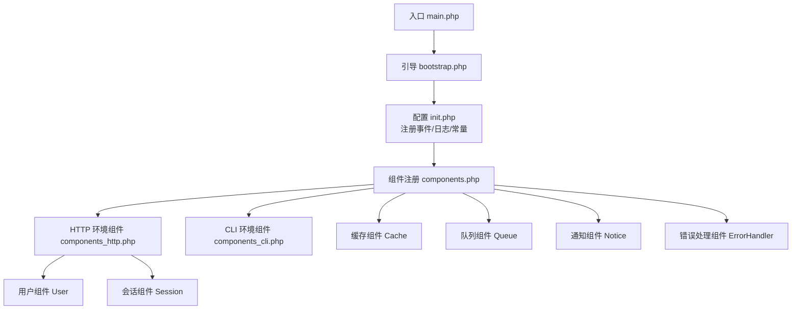
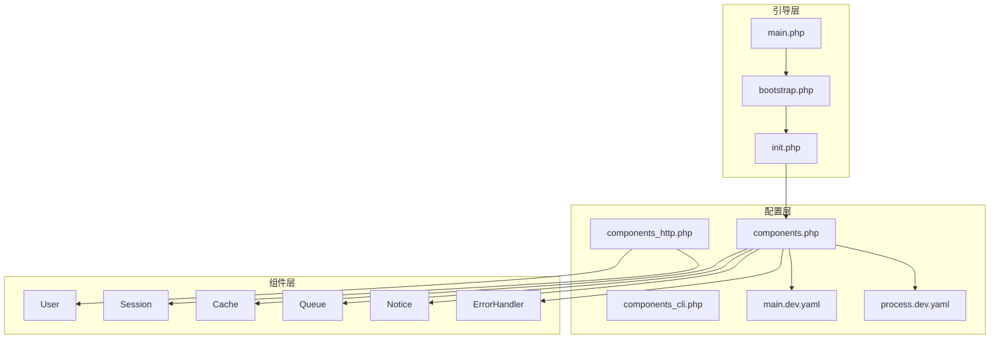
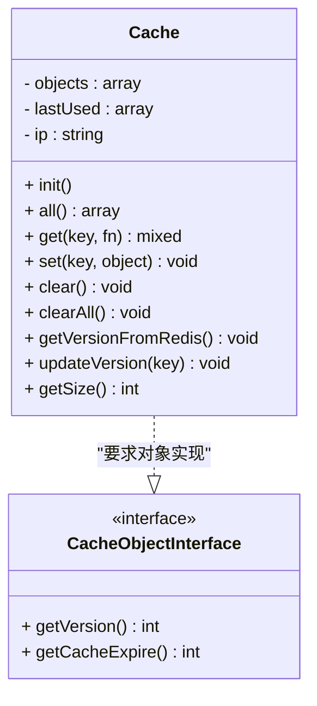
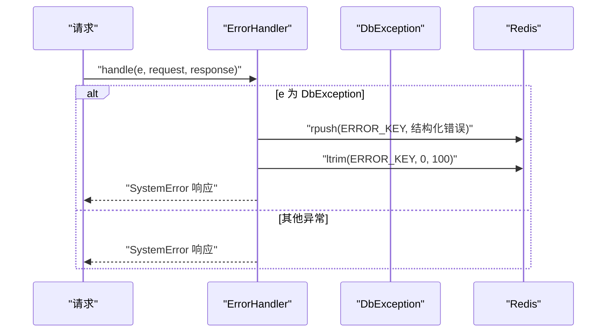
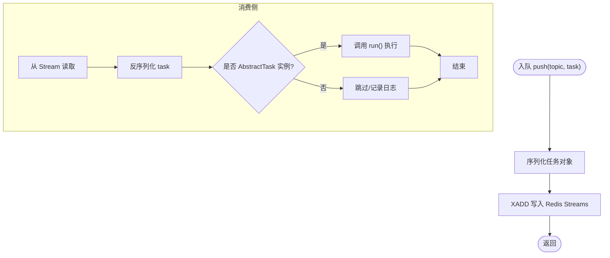
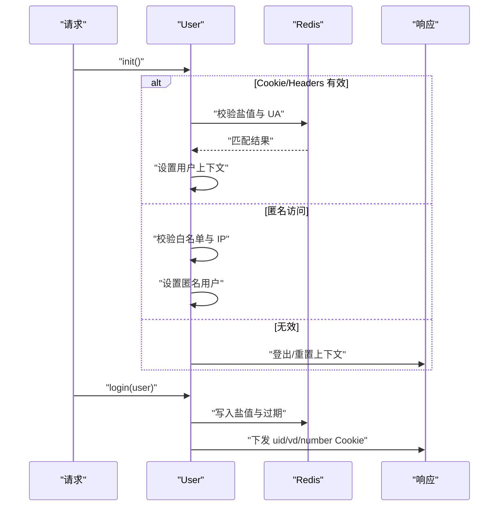
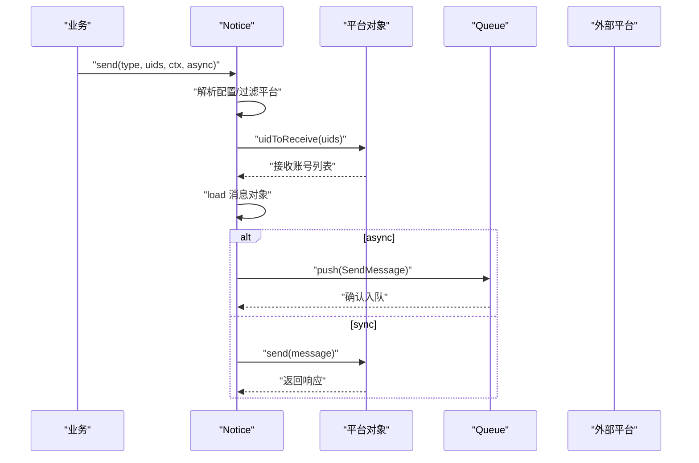
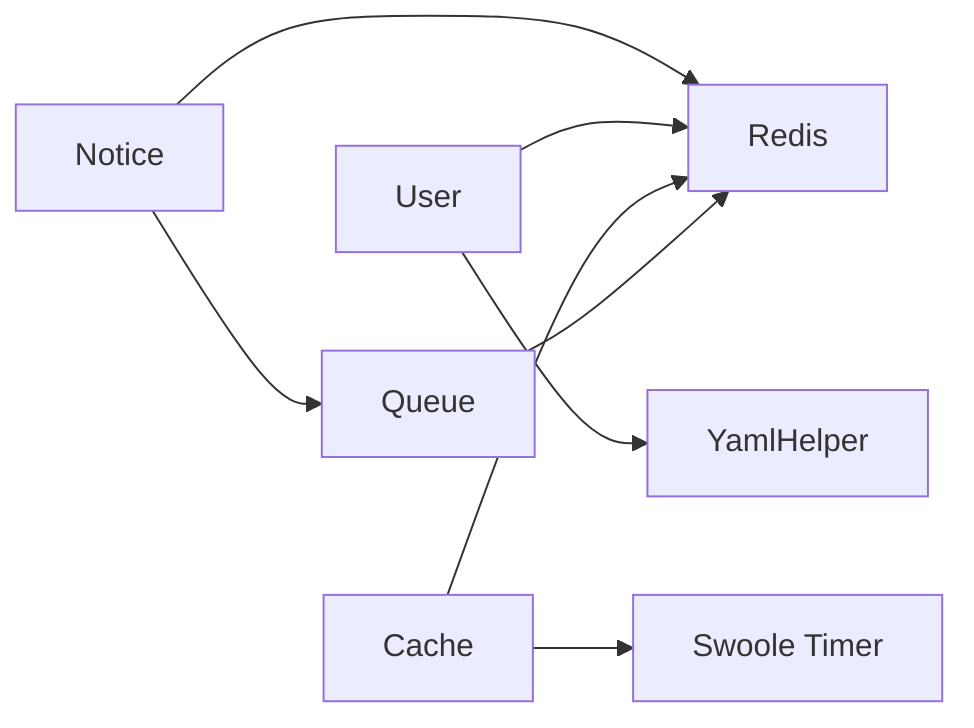
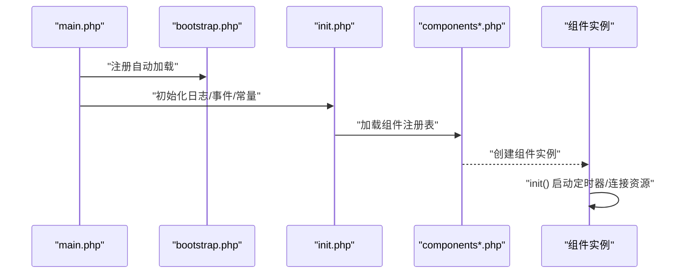

# 组件化设计原理

<cite>
**本文引用的文件**
- [process\src\components\Cache.php](file://process\src\components\Cache.php)
- [process\src\components\CacheObjectInterface.php](file://process\src\components\CacheObjectInterface.php)
- [process\src\components\ErrorHandler.php](file://process\src\components\ErrorHandler.php)
- [process\src\components\Queue.php](file://process\src\components\Queue.php)
- [process\src\components\User.php](file://process\src\components\User.php)
- [process\src\components\Notice.php](file://process\src\components\Notice.php)
- [process\src\config\components.php](file://process\src\config\components.php)
- [process\src\config\components_http.php](file://process\src\config\components_http.php)
- [process\src\config\components_cli.php](file://process\src\config\components_cli.php)
- [process\src\config\init.php](file://process\src\config\init.php)
- [process\src\config\main.dev.yaml](file://process\src\config\main.dev.yaml)
- [process\src\config\process.dev.yaml](file://process\src\config\process.dev.yaml)
- [process\src\bootstrap.php](file://process\src\bootstrap.php)
- [process\src\main.php](file://process\src\main.php)
</cite>

## 目录
1. [引言](#引言)
2. [项目结构](#项目结构)
3. [核心组件](#核心组件)
4. [架构总览](#架构总览)
5. [详细组件分析](#详细组件分析)
6. [依赖分析](#依赖分析)
7. [性能考量](#性能考量)
8. [故障排查指南](#故障排查指南)
9. [结论](#结论)
10. [附录](#附录)

## 引言
本文件面向 htdNew 项目的组件化设计，系统阐述组件注册、依赖注入与生命周期管理的实现机制，并对核心组件（错误处理、缓存、队列、用户、通知）进行深入解析。文档同时给出组件配置文件结构说明、初始化流程以及组件间交互关系图，帮助开发者快速理解并高效使用该组件化体系。

## 项目结构
htdNew 采用“按功能域分层 + 组件注册”的组织方式：
- 组件集中于 components 目录，每个组件以独立类实现职责边界清晰的能力单元
- 配置集中在 config 目录，分别定义组件注册清单、HTTP/CLI 环境下的组件装配规则、运行时 YAML 配置
- 启动入口位于 main.php，配合 bootstrap.php 实现自动加载与主框架初始化
- 运行时通过 process.dev.yaml 和 main.dev.yaml 提供进程模型、日志级别、数据库/Redis/队列等基础设施配置

图表来源
- [process\src\main.php](file://process\src\main.php#L1-L25)
- [process\src\bootstrap.php](file://process\src\bootstrap.php#L1-L40)
- [process\src\config\init.php](file://process\src\config\init.php#L1-L48)
- [process\src\config\components.php](file://process\src\config\components.php#L1-L34)
- [process\src\config\components_http.php](file://process\src\config\components_http.php#L1-L33)
- [process\src\config\components_cli.php](file://process\src\config\components_cli.php#L1-L3)

章节来源
- [process\src\main.php](file://process\src\main.php#L1-L25)
- [process\src\bootstrap.php](file://process\src\bootstrap.php#L1-L40)
- [process\src\config\init.php](file://process\src\config\init.php#L1-L48)
- [process\src\config\components.php](file://process\src\config\components.php#L1-L34)
- [process\src\config\components_http.php](file://process\src\config\components_http.php#L1-L33)
- [process\src\config\components_cli.php](file://process\src\config\components_cli.php#L1-L3)

## 核心组件
本节聚焦五大核心组件：缓存、错误处理、队列、用户、通知。它们通过统一的组件注册机制被注入到应用容器中，形成可插拔、可替换的模块化能力。

- 缓存组件（Cache）
  - 职责：提供基于内存与 Redis 的对象级缓存，支持版本一致性校验、定时清理与跨进程共享
  - 关键能力：对象获取与设置、版本同步、全量清理、按过期策略清理
  - 接口契约：实现 CacheObjectInterface，暴露版本与过期策略

- 错误处理组件（ErrorHandler）
  - 职责：捕获异常并统一输出系统错误响应；对数据库异常进行结构化记录
  - 关键能力：异常分类处理、Redis 记录错误堆栈、返回标准化响应

- 队列组件（Queue）
  - 职责：封装 Redis Streams 的任务推送与消费，支持编码/解码任务对象
  - 关键能力：任务入队、执行反序列化、动态消费者配置、统计队列长度

- 用户组件（User）
  - 职责：登录态加载、校验与登出，支持模拟登录、第三方平台票据、Cookie 策略
  - 关键能力：加载用户上下文、颁发登录 Cookie、刷新登录盐值、登出清理

- 通知组件（Notice）
  - 职责：按消息类型与平台配置发送站内外部消息，支持异步队列与同步直发
  - 关键能力：平台选择与过滤、接收者映射、消息对象构建、重试与日志记录

章节来源
- [process\src\components\Cache.php](file://process\src\components\Cache.php#L1-L136)
- [process\src\components\CacheObjectInterface.php](file://process\src\components\CacheObjectInterface.php#L1-L9)
- [process\src\components\ErrorHandler.php](file://process\src\components\ErrorHandler.php#L1-L26)
- [process\src\components\Queue.php](file://process\src\components\Queue.php#L1-L173)
- [process\src\components\User.php](file://process\src\components\User.php#L1-L429)
- [process\src\components\Notice.php](file://process\src\components\Notice.php#L1-L406)

## 架构总览
组件化架构围绕“配置驱动 + 容器注入 + 生命周期管理”展开：
- 配置驱动：components.php 统一声明组件类与依赖；components_http.php/ components_cli.php 在不同运行场景下叠加组件
- 容器注入：通过框架容器将组件实例注入到控制器、服务与业务逻辑中
- 生命周期管理：组件在 init 阶段完成定时器、共享资源初始化；运行期由进程模型（HTTP/Queue/Crontab）承载

图表来源
- [process\src\main.php](file://process\src\main.php#L1-L25)
- [process\src\bootstrap.php](file://process\src\bootstrap.php#L1-L40)
- [process\src\config\init.php](file://process\src\config\init.php#L1-L48)
- [process\src\config\components.php](file://process\src\config\components.php#L1-L34)
- [process\src\config\components_http.php](file://process\src\config\components_http.php#L1-L33)
- [process\src\config\components_cli.php](file://process\src\config\components_cli.php#L1-L3)
- [process\src\config\main.dev.yaml](file://process\src\config\main.dev.yaml#L1-L97)
- [process\src\config\process.dev.yaml](file://process\src\config\process.dev.yaml#L1-L89)

## 详细组件分析

### 缓存组件（Cache）
- 设计要点
  - 单例模式 + 内存缓存 + Redis 版本一致性：通过 Redis Hash 存储对象版本，定期拉取并对比，实现跨进程缓存失效
  - 定时清理：基于 lastUsed 与对象过期策略，周期性剔除陈旧对象
  - 进程互斥：利用 Redis set nx ex 实现“每容器仅一个进程”从 Redis 同步版本至共享内存，降低竞争与抖动
- 关键接口
  - get/set：支持闭包懒加载与版本写入
  - clear/clearAll：按过期策略清理或全量清理
  - updateVersion：主动失效某键
- 复杂度与性能
  - get/set 平均 O(1)，clear 遍历 lastUsed，复杂度 O(n)
  - 版本同步通过共享内存减少重复 IO

图表来源
- [process\src\components\Cache.php](file://process\src\components\Cache.php#L1-L136)
- [process\src\components\CacheObjectInterface.php](file://process\src\components\CacheObjectInterface.php#L1-L9)

章节来源
- [process\src\components\Cache.php](file://process\src\components\Cache.php#L1-L136)
- [process\src\components\CacheObjectInterface.php](file://process\src\components\CacheObjectInterface.php#L1-L9)

### 错误处理组件（ErrorHandler）
- 设计要点
  - 统一异常处理入口，区分数据库异常与其他异常
  - 数据库异常写入 Redis 列表，保留最近若干条错误，便于运维定位
  - 输出系统错误响应，屏蔽内部细节
- 关键流程
  - 捕获 Throwable
  - 若为 DbException，记录错误详情并限制列表长度
  - 返回标准化系统错误响应

图表来源
- [process\src\components\ErrorHandler.php](file://process\src\components\ErrorHandler.php#L1-L26)

章节来源
- [process\src\components\ErrorHandler.php](file://process\src\components\ErrorHandler.php#L1-L26)

### 队列组件（Queue）
- 设计要点
  - 基于 Redis Streams 的任务队列，支持高/中/低优先级主题
  - 任务对象序列化/反序列化：兼容 __serialize/__unserialize 与 BaseObject 构造注入
  - 动态消费者配置：通过 Redis 缓存覆盖 YAML 默认配置，支持热更新
- 关键流程
  - push：将任务序列化后写入指定主题
  - execute：从 Stream 读取数据并反序列化执行
  - getConsumerNum：合并默认与缓存配置

图表来源
- [process\src\components\Queue.php](file://process\src\components\Queue.php#L1-L173)

章节来源
- [process\src\components\Queue.php](file://process\src\components\Queue.php#L1-L173)

### 用户组件（User）
- 设计要点
  - 协程单例：每个协程上下文内唯一实例，避免并发污染
  - 登录态加载：支持 Cookie、Header、临时登录、Chrome 签名等多种来源
  - 登录 Cookie 策略：根据协议与 SameSite 规则动态设置 Secure/HttpOnly/SameSite
  - 模拟登录与第三方票据：支持测试场景与外部平台票据校验
- 关键流程
  - init：从上下文加载用户，支持匿名访问白名单
  - login：生成盐值、写入 Redis、下发 Cookie
  - load/logout：校验 Cookie 与盐值，登出时清理 Cookie 与 Redis

图表来源
- [process\src\components\User.php](file://process\src\components\User.php#L1-L429)

章节来源
- [process\src\components\User.php](file://process\src\components\User.php#L1-L429)

### 通知组件（Notice）
- 设计要点
  - 按消息类型与平台配置发送：支持默认配置与应用定制配置
  - 平台过滤与接收者映射：按用户设置与平台规则筛选接收方
  - 异步/同步发送：默认异步入队，支持同步直发并捕获异常
- 关键流程
  - send/sendConfig：解析配置、过滤平台、组装消息对象
  - doSend/doSendRetry：写入发送日志、构造消息对象、入队或直发
  - sendType/sendSms/sendEmail：针对非 UID 场景的直接发送

图表来源
- [process\src\components\Notice.php](file://process\src\components\Notice.php#L1-L406)
- [process\src\components\Queue.php](file://process\src\components\Queue.php#L1-L173)

章节来源
- [process\src\components\Notice.php](file://process\src\components\Notice.php#L1-L406)
- [process\src\components\Queue.php](file://process\src\components\Queue.php#L1-L173)

## 依赖分析
- 组件注册与装配
  - components.php 统一声明 db、cache、redis、sredis、notice、queue 等组件
  - components_http.php 注入 user、session 等 HTTP 专用组件
  - components_cli.php 为空，表示 CLI 环境默认不注入额外组件
- 外部依赖与基础设施
  - main.dev.yaml 定义 db、redis、队列消费者默认值、日志级别等
  - process.dev.yaml 定义进程模型（HTTP、Queue、Crontab），决定组件运行载体
- 组件间耦合
  - Notice 依赖 Queue（异步发送）、Redis（平台配置/用户设置）、平台对象
  - User 依赖 Redis（盐值/登录态）、YamlHelper（配置）、Cookie/UA 校验
  - Cache 依赖 Redis（版本同步/互斥）、Swoole Timer（定时清理）

图表来源
- [process\src\config\components.php](file://process\src\config\components.php#L1-L34)
- [process\src\config\components_http.php](file://process\src\config\components_http.php#L1-L33)
- [process\src\config\main.dev.yaml](file://process\src\config\main.dev.yaml#L1-L97)
- [process\src\config\process.dev.yaml](file://process\src\config\process.dev.yaml#L1-L89)

章节来源
- [process\src\config\components.php](file://process\src\config\components.php#L1-L34)
- [process\src\config\components_http.php](file://process\src\config\components_http.php#L1-L33)
- [process\src\config\main.dev.yaml](file://process\src\config\main.dev.yaml#L1-L97)
- [process\src\config\process.dev.yaml](file://process\src\config\process.dev.yaml#L1-L89)

## 性能考量
- 缓存命中与版本同步
  - 使用共享内存缓存 Redis 版本，降低频繁 IO 与锁竞争
  - 定时清理与对象过期策略避免内存膨胀
- 队列与异步化
  - 异步发送消息通过队列削峰填谷，提升吞吐
  - 任务编码/解码兼容多种对象形态，兼顾灵活性与性能
- 登录态与 Cookie 策略
  - 通过盐值与 UA 校验降低暴力破解风险，同时减少不必要的鉴权开销
  - 根据协议动态设置 Cookie 属性，兼顾安全与兼容

## 故障排查指南
- 错误日志与定位
  - 数据库异常会被记录到 Redis 列表，可通过列表长度与内容快速定位问题
  - 系统错误响应统一输出，便于前端与监控系统采集
- 缓存一致性问题
  - 检查 Redis 中 object_cache 哈希与共享内存文件是否一致
  - 关注版本同步定时器是否正常运行
- 队列积压与消费异常
  - 查看队列长度与消费者配置，确认是否因配置变更未生效
  - 检查任务对象是否满足序列化约束（如必须参数具备默认值）
- 登录态异常
  - 校验 Cookie 与盐值是否匹配，关注 UA 变更导致的自动登出
  - 检查第三方平台票据有效性与域名/路径设置

章节来源
- [process\src\components\ErrorHandler.php](file://process\src\components\ErrorHandler.php#L1-L26)
- [process\src\components\Cache.php](file://process\src\components\Cache.php#L1-L136)
- [process\src\components\Queue.php](file://process\src\components\Queue.php#L1-L173)
- [process\src\components\User.php](file://process\src\components\User.php#L1-L429)

## 结论
htdNew 的组件化设计以“配置驱动 + 容器注入 + 生命周期管理”为核心，通过五大组件实现高内聚、低耦合的可扩展架构。组件注册与装配清晰，依赖关系明确，结合进程模型与异步队列，既满足高性能场景，又便于维护与演进。建议在新增组件时遵循现有契约与命名规范，确保与容器与配置体系无缝集成。

## 附录

### 组件配置文件结构说明
- components.php
  - 统一声明组件类与依赖，如 cache、queue、notice、redis/sredis 等
  - 支持按环境合并 envs/components.php
- components_http.php
  - 在 HTTP 环境下注入 user、session 等组件
- components_cli.php
  - CLI 环境默认不注入额外组件
- main.dev.yaml
  - 定义 db、redis、队列消费者默认值、日志级别、上传存储等
- process.dev.yaml
  - 定义进程模型（HTTP、Queue、Crontab）及进程数量与业务配置文件路径

章节来源
- [process\src\config\components.php](file://process\src\config\components.php#L1-L34)
- [process\src\config\components_http.php](file://process\src\config\components_http.php#L1-L33)
- [process\src\config\components_cli.php](file://process\src\config\components_cli.php#L1-L3)
- [process\src\config\main.dev.yaml](file://process\src\config\main.dev.yaml#L1-L97)
- [process\src\config\process.dev.yaml](file://process\src\config\process.dev.yaml#L1-L89)

### 组件初始化流程
- main.php 启动主进程，设置协程 Hook
- bootstrap.php 注册自动加载，按命名空间映射加载组件与业务类
- config/init.php 注册全局事件、日志级别与常量
- config/components*.php 加载组件注册表，完成容器注入
- 各组件在 init 阶段启动定时器、连接 Redis、准备共享资源

图表来源
- [process\src\main.php](file://process\src\main.php#L1-L25)
- [process\src\bootstrap.php](file://process\src\bootstrap.php#L1-L40)
- [process\src\config\init.php](file://process\src\config\init.php#L1-L48)
- [process\src\config\components.php](file://process\src\config\components.php#L1-L34)
- [process\src\config\components_http.php](file://process\src\config\components_http.php#L1-L33)
- [process\src\config\components_cli.php](file://process\src\config\components_cli.php#L1-L3)