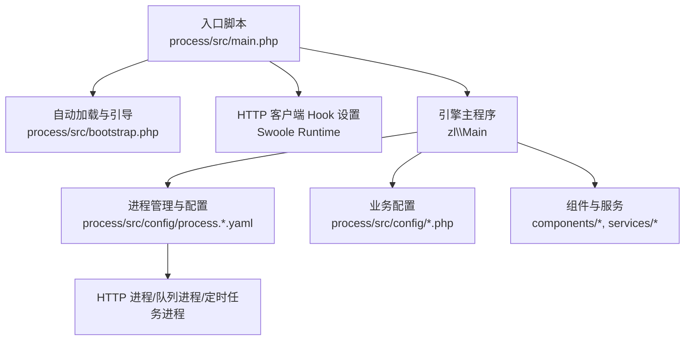
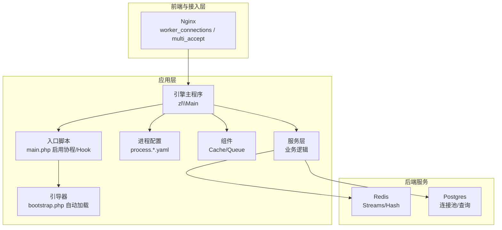
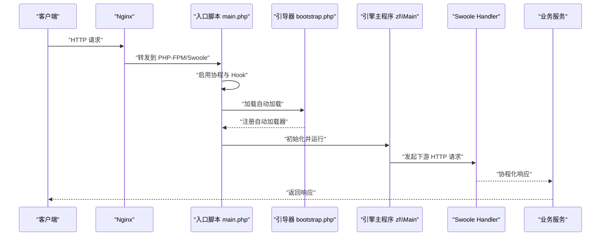
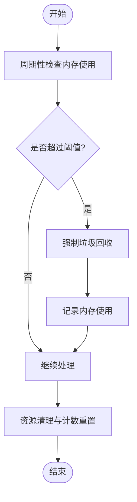
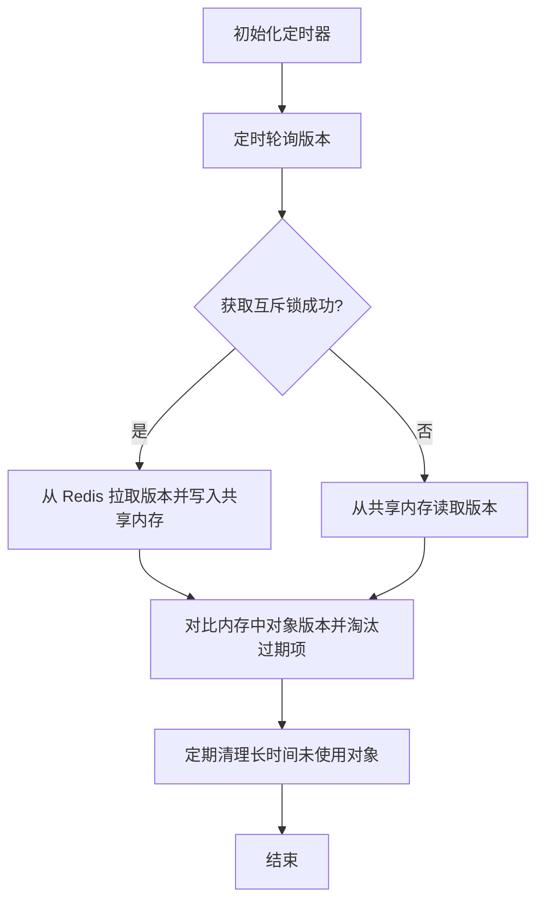
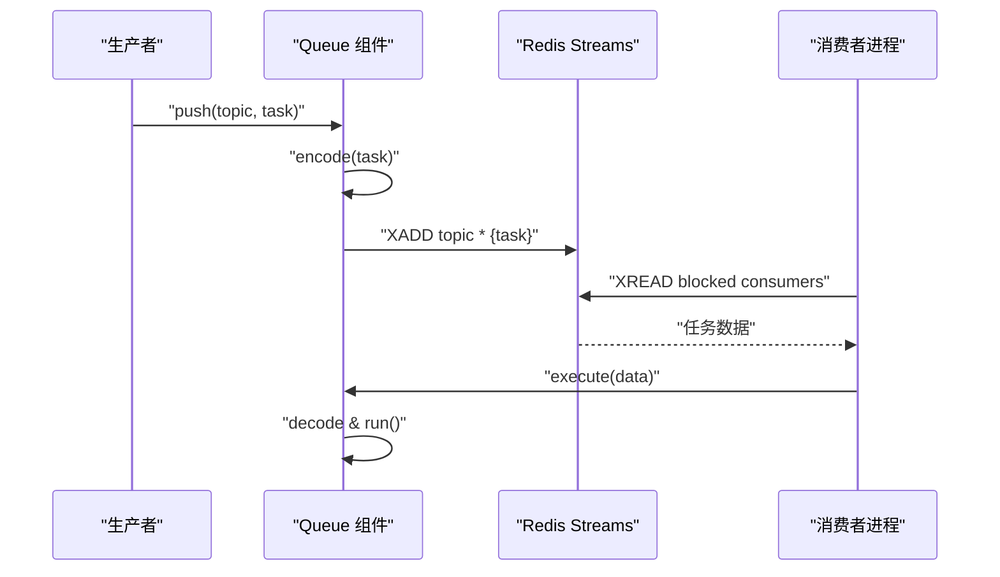
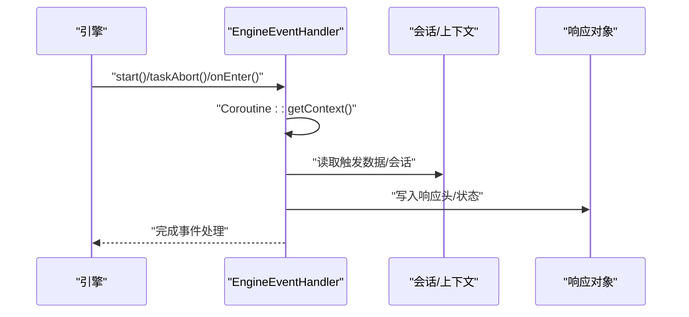
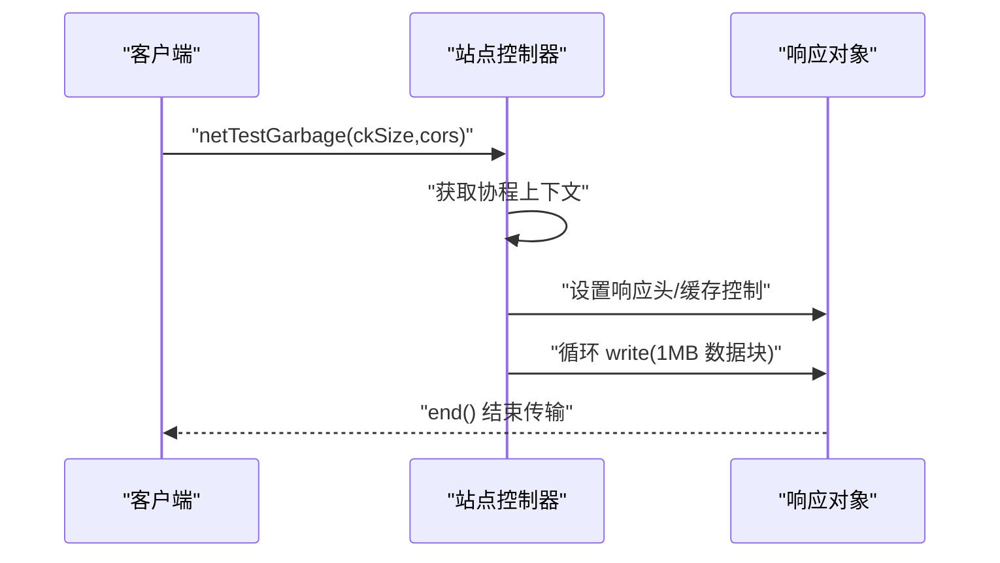
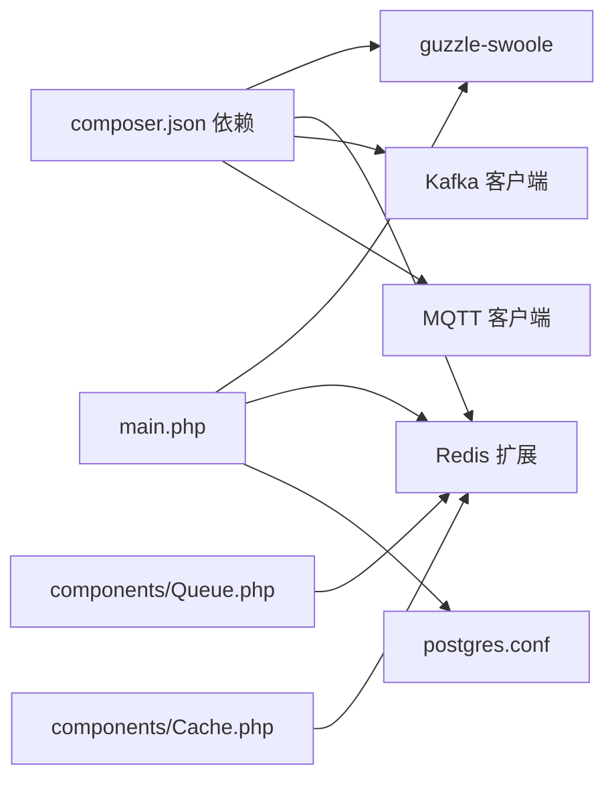

# 高并发与性能优化

<cite>
**本文引用的文件**
- [process\src\main.php](file://process\src\main.php)
- [process\src\bootstrap.php](file://process\src\bootstrap.php)
- [process\src\config\main.dev.yaml](file://process\src\config\main.dev.yaml)
- [process\src\config\process.dev.yaml](file://process\src\config\process.dev.yaml)
- [process\src\config\process.prod.yaml](file://process\src\config\process.prod.yaml)
- [process\src\components\Cache.php](file://process\src\components\Cache.php)
- [process\src\components\Queue.php](file://process\src\components\Queue.php)
- [process\src\services\trait\MemoryManagementTrait.php](file://process\src\services\trait\MemoryManagementTrait.php)
- [process\src\modules\process\EngineEventHandler.php](file://process\src\modules\process\EngineEventHandler.php)
- [process_envs\xidian\product\http\site\XidianAimh.php](file://process_envs\xidian\product\http\site\XidianAimh.php)
- [process\docker\services\nginx\nginx.conf](file://process\docker\services\nginx\nginx.conf)
- [process\docker\services\postgres\postgresql.conf](file://process\docker\services\postgres\postgresql.conf)
- [process\src\migrations\migration_20250421_frequency_limit.php](file://process\src\migrations\migration_20250421_frequency_limit.php)
- [process\src\models\StatisticsBaseTaskNodeModel.php](file://process\src\models\StatisticsBaseTaskNodeModel.php)
- [process\src\migrations\migration_20240716_170331_statistics.php](file://process\src\migrations\migration_20240716_170331_statistics.php)
- [process\composer.json](file://process\composer.json)
</cite>

## 目录
1. [引言](#引言)
2. [项目结构](#项目结构)
3. [核心组件](#核心组件)
4. [架构总览](#架构总览)
5. [详细组件分析](#详细组件分析)
6. [依赖关系分析](#依赖关系分析)
7. [性能考量](#性能考量)
8. [故障排查指南](#故障排查指南)
9. [结论](#结论)
10. [附录](#附录)

## 引言
本文件面向 htdNew 项目，聚焦于基于 Swoole 的高并发与性能优化实践。内容涵盖协程启用与 Hook 策略、异步处理机制、内存管理与资源回收、连接池与缓存策略、负载均衡与并发控制、限流与监控指标、性能基准测试方法与调优建议，并辅以架构与流程图示，帮助开发者系统性提升系统吞吐与稳定性。

## 项目结构
htdNew 采用多进程 + Swoole 协程的架构模式，入口脚本负责启用协程与 HTTP 客户端 Hook，随后加载业务配置与引导器，最终交由引擎主程序运行。生产与开发环境分别通过独立配置文件控制进程数量、CPU 亲和与业务配置路径。

**图表来源**
- [process\src\main.php](file://process\src\main.php#L1-L25)
- [process\src\bootstrap.php](file://process\src\bootstrap.php#L1-L40)
- [process\src\config\process.dev.yaml](file://process\src\config\process.dev.yaml#L1-L89)
- [process\src\config\process.prod.yaml](file://process\src\config\process.prod.yaml#L1-L80)

**章节来源**
- [process\src\main.php](file://process\src\main.php#L1-L25)
- [process\src\bootstrap.php](file://process\src\bootstrap.php#L1-L40)
- [process\src\config\process.dev.yaml](file://process\src\config\process.dev.yaml#L1-L89)
- [process\src\config\process.prod.yaml](file://process\src\config\process.prod.yaml#L1-L80)

## 核心组件
- 协程与 Hook
  - 在入口启用 Swoole 协程与 Hook，确保网络 I/O 非阻塞。
  - 将默认 HTTP 客户端处理器切换为 Swoole Handler，实现协程化请求。
- 进程与配置
  - 开发与生产环境分别定义 HTTP/队列/定时任务等进程数量与 CPU 亲和。
  - 业务配置文件可热更新，无需重启主进程。
- 缓存与对象缓存
  - 内置对象级缓存组件，结合 Redis 版本与共享内存，定期清理与版本同步。
- 队列与消费者
  - 基于 Redis Streams 的任务队列，支持高、中、低优先级主题，动态调整消费者数量。
- 内存管理
  - 提供周期性内存检查与强制 GC 的能力，以及智能清理策略。
- 引擎事件与协程上下文
  - 引擎事件处理器在协程上下文中访问请求上下文，支撑异步流程。

**章节来源**
- [process\src\main.php](file://process\src\main.php#L1-L25)
- [process\src\config\process.dev.yaml](file://process\src\config\process.dev.yaml#L1-L89)
- [process\src\config\process.prod.yaml](file://process\src\config\process.prod.yaml#L1-L80)
- [process\src\components\Cache.php](file://process\src\components\Cache.php#L1-L136)
- [process\src\components\Queue.php](file://process\src\components\Queue.php#L1-L173)
- [process\src\services\trait\MemoryManagementTrait.php](file://process\src\services\trait\MemoryManagementTrait.php#L112-L150)
- [process\src\modules\process\EngineEventHandler.php](file://process\src\modules\process\EngineEventHandler.php#L1-L302)

## 架构总览
下图展示从 Nginx 到 PHP 进程、Swoole 协程、HTTP 客户端 Hook、Redis/Postgres 的整体链路与交互。

**图表来源**
- [process\docker\services\nginx\nginx.conf](file://process\docker\services\nginx\nginx.conf#L1-L50)
- [process\src\main.php](file://process\src\main.php#L1-L25)
- [process\src\bootstrap.php](file://process\src\bootstrap.php#L1-L40)
- [process\src\config\process.dev.yaml](file://process\src\config\process.dev.yaml#L1-L89)
- [process\src\components\Cache.php](file://process\src\components\Cache.php#L1-L136)
- [process\src\components\Queue.php](file://process\src\components\Queue.php#L1-L173)

## 详细组件分析

### 协程启用与 Hook 策略
- 协程启用
  - 在入口脚本中启用 Swoole 协程，覆盖常见 Hook，使网络 I/O、DNS 解析、信号等操作非阻塞。
- HTTP 客户端 Hook
  - 将默认 HTTP 客户端处理器替换为 Swoole Handler，确保 Guzzle 请求在协程中执行，避免阻塞事件循环。
- 异步处理机制
  - 通过协程上下文传递请求响应对象，配合事件处理器在协程环境中执行业务逻辑，实现高并发异步处理。

**图表来源**
- [process\src\main.php](file://process\src\main.php#L1-L25)
- [process\src\bootstrap.php](file://process\src\bootstrap.php#L1-L40)

**章节来源**
- [process\src\main.php](file://process\src\main.php#L1-L25)
- [process\src\bootstrap.php](file://process\src\bootstrap.php#L1-L40)

### 内存管理与资源回收
- 周期性内存检查
  - 在处理流程中按固定间隔检查内存使用，超过阈值触发强制垃圾回收。
- 智能清理
  - 支持保留关键缓存并清理非关键数据，或在极端情况下进行全量清理。
- 资源清理
  - 在同步/批处理完成后清空临时标记、重置计数与恢复内存限制，避免长期占用。

**图表来源**
- [process\src\services\trait\MemoryManagementTrait.php](file://process\src\services\trait\MemoryManagementTrait.php#L112-L150)

**章节来源**
- [process\src\services\trait\MemoryManagementTrait.php](file://process\src\services\trait\MemoryManagementTrait.php#L112-L150)

### 对象缓存与版本同步
- 缓存策略
  - 使用内存缓存对象，结合 Redis Hash 存储版本，定时轮询同步版本差异，主动淘汰过期对象。
- 共享内存优化
  - 通过互斥锁与共享内存文件减少多进程重复拉取版本，降低 Redis 压力。
- 清理机制
  - 基于最后使用时间与对象过期时间进行定期清理，避免内存膨胀。

**图表来源**
- [process\src\components\Cache.php](file://process\src\components\Cache.php#L1-L136)

**章节来源**
- [process\src\components\Cache.php](file://process\src\components\Cache.php#L1-L136)

### 队列与消费者动态调整
- 任务编码与解码
  - 通过统一编码器对任务对象进行序列化，支持自定义 __serialize/__unserialize 或反射属性遍历。
- 主题与优先级
  - 高、中、低优先级主题分离，便于差异化处理与资源分配。
- 动态消费者数量
  - 通过 Redis 缓存键存储消费者数量配置，支持在线调整并触发主程序热重载。

**图表来源**
- [process\src\components\Queue.php](file://process\src\components\Queue.php#L1-L173)

**章节来源**
- [process\src\components\Queue.php](file://process\src\components\Queue.php#L1-L173)

### 引擎事件与协程上下文
- 事件处理
  - 引擎事件处理器在协程上下文中获取触发数据与会话，驱动后续流程。
- 上下文传递
  - 通过协程上下文传递响应对象与触发数据，保障异步场景下的状态一致性。

**图表来源**
- [process\src\modules\process\EngineEventHandler.php](file://process\src\modules\process\EngineEventHandler.php#L1-L302)

**章节来源**
- [process\src\modules\process\EngineEventHandler.php](file://process\src\modules\process\EngineEventHandler.php#L1-L302)

### 并发处理与网络测速示例
- 协程上下文访问响应对象，实现分块写入与跨域控制，支撑高并发下载/测速场景。
- 通过协程写入大块数据，结合客户端 keep-alive 与缓存控制，优化传输效率。

**图表来源**
- [process_envs\xidian\product\http\site\XidianAimh.php](file://process_envs\xidian\product\http\site\XidianAimh.php#L172-L260)

**章节来源**
- [process_envs\xidian\product\http\site\XidianAimh.php](file://process_envs\xidian\product\http\site\XidianAimh.php#L172-L260)

## 依赖关系分析
- 外部依赖
  - 使用 Guzzle-Swoole 适配器实现协程化 HTTP 请求；集成 Redis/Postgres 等数据库与消息中间件。
- 组件耦合
  - Queue 与 Cache 作为横切关注点，被业务服务广泛依赖；引擎事件处理器与协程上下文紧密耦合。
- 进程与配置
  - 开发/生产配置文件决定进程数量、CPU 亲和与业务配置路径，影响整体并发能力与资源分配。

**图表来源**
- [process\composer.json](file://process\composer.json#L1-L70)
- [process\src\main.php](file://process\src\main.php#L1-L25)
- [process\docker\services\postgres\postgresql.conf](file://process\docker\services\postgres\postgresql.conf#L105-L131)
- [process\src\components\Queue.php](file://process\src\components\Queue.php#L1-L173)
- [process\src\components\Cache.php](file://process\src\components\Cache.php#L1-L136)

**章节来源**
- [process\composer.json](file://process\composer.json#L1-L70)
- [process\src\main.php](file://process\src\main.php#L1-L25)
- [process\docker\services\postgres\postgresql.conf](file://process\docker\services\postgres\postgresql.conf#L105-L131)
- [process\src\components\Queue.php](file://process\src\components\Queue.php#L1-L173)
- [process\src\components\Cache.php](file://process\src\components\Cache.php#L1-L136)

## 性能考量
- 协程启用与 Hook
  - 确保启用 SWOOLE_HOOK_ALL，避免阻塞式 I/O；同时注意同一时间仅启用一种 CURL Hook。
- HTTP 客户端协程化
  - 使用 Swoole Handler 替换默认处理器，减少阻塞等待；结合 keep-alive 与连接池降低握手开销。
- 进程与并发
  - 生产环境根据 CPU 核心数合理设置 HTTP 进程数量与 CPU 亲和，避免抢占与上下文切换。
- 缓存与对象复用
  - 利用对象缓存与共享内存版本同步，降低重复计算与网络往返；定期清理避免内存泄漏。
- 队列与背压
  - 通过主题优先级与消费者数量动态调整，结合队列长度监控，防止积压。
- 数据库与连接池
  - 合理配置 Postgres 的 shared_buffers、effective_cache_size 等参数，结合连接池与事务批处理降低开销。
- Nginx 接入层
  - 提升 worker_connections、multi_accept 与内核缓冲参数，减少 TCP 握手与队头阻塞。
- 内存与 GC
  - 在长耗时任务中周期性检查内存并强制 GC；必要时进行智能清理，避免峰值内存过高。
- 监控与指标
  - 建议采集：QPS、P95/P99 延迟、队列长度、内存使用、GC 次数、数据库连接数、Redis 命中率、Nginx 连接数与错误日志。

**章节来源**
- [process\src\main.php](file://process\src\main.php#L1-L25)
- [process\src\config\process.prod.yaml](file://process\src\config\process.prod.yaml#L1-L80)
- [process\src\components\Cache.php](file://process\src\components\Cache.php#L1-L136)
- [process\src\components\Queue.php](file://process\src\components\Queue.php#L1-L173)
- [process\docker\services\nginx\nginx.conf](file://process\docker\services\nginx\nginx.conf#L1-L50)
- [process\docker\services\postgres\postgresql.conf](file://process\docker\services\postgres\postgresql.conf#L105-L131)
- [process\src\services\trait\MemoryManagementTrait.php](file://process\src\services\trait\MemoryManagementTrait.php#L112-L150)

## 故障排查指南
- 协程相关问题
  - 确认协程已启用且未同时启用冲突 Hook；检查 Swoole Handler 是否生效。
- 队列积压
  - 查看各主题长度与消费者数量配置；确认热重载是否成功；检查任务编码/解码异常。
- 内存飙升
  - 观察周期性内存检查与强制 GC 行为；定位是否存在未释放的大对象或循环引用。
- 数据库慢查询
  - 检查计划参数与统计信息；确认索引与查询路径；评估连接池大小与并发。
- Nginx 连接瓶颈
  - 提升 worker_connections、启用 multi_accept；检查 keepalive 超时与内核参数。
- 限流与频率控制
  - 如存在频率限制表字段，确认迁移与业务逻辑一致；结合队列与速率控制避免瞬时洪峰。

**章节来源**
- [process\src\main.php](file://process\src\main.php#L1-L25)
- [process\src\components\Queue.php](file://process\src\components\Queue.php#L1-L173)
- [process\src\services\trait\MemoryManagementTrait.php](file://process\src\services\trait\MemoryManagementTrait.php#L112-L150)
- [process\docker\services\nginx\nginx.conf](file://process\docker\services\nginx\nginx.conf#L1-L50)
- [process\docker\services\postgres\postgresql.conf](file://process\docker\services\postgres\postgresql.conf#L105-L131)
- [process\src\migrations\migration_20250421_frequency_limit.php](file://process\src\migrations\migration_20250421_frequency_limit.php#L1-L19)

## 结论
htdNew 通过 Swoole 协程与 Hook 实现高并发 I/O 非阻塞，结合对象缓存、队列与消费者动态调整、内存管理与 GC 策略，形成完整的性能优化闭环。生产环境应依据 CPU 与业务特征合理配置进程与亲和，配合 Nginx 与数据库参数调优，持续监控关键指标并迭代优化。

## 附录
- 性能基准测试方法
  - 压测工具：wrk/ab/JMeter；场景：并发连接数、RPS、P95/P99 延迟、错误率。
  - 关注指标：CPU 使用率、内存、GC 次数、队列长度、数据库连接数、Redis 命中率。
- 监控指标定义
  - 吞吐：QPS、每秒任务数
  - 延迟：P50/P95/P99
  - 资源：内存使用、GC 次数、数据库连接数、Redis 命中率
  - 稳定性：错误率、超时率、队列积压时长
- 调优建议
  - 协程：启用合适 Hook，避免阻塞；合理分块写入与 keep-alive。
  - 缓存：对象缓存 + 版本同步 + 定期清理；共享内存降重。
  - 队列：主题优先级 + 动态消费者 + 长度告警。
  - 数据库：参数调优 + 连接池 + 事务批处理。
  - 接入层：提升连接上限与内核缓冲，启用多接受。