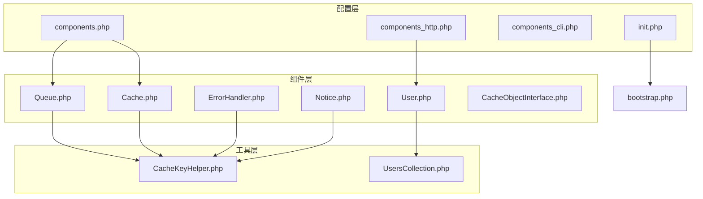
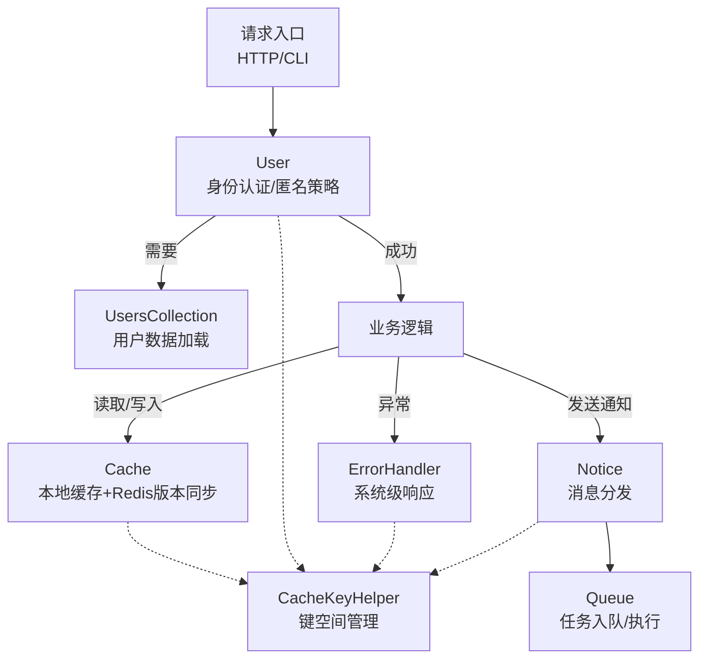
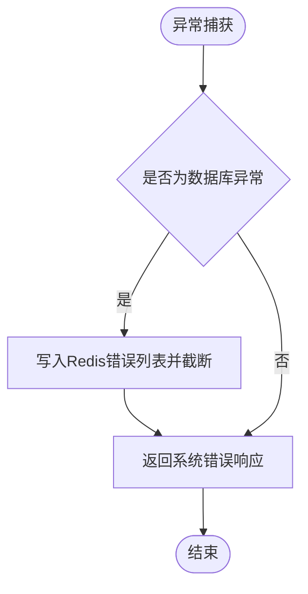
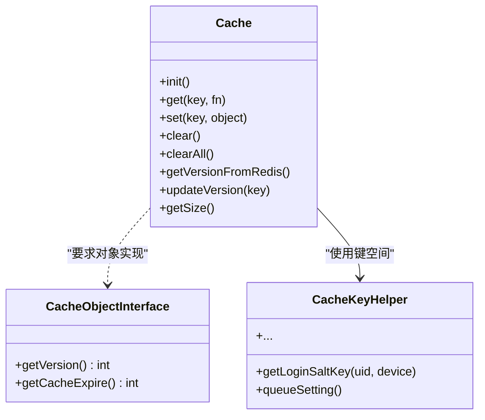
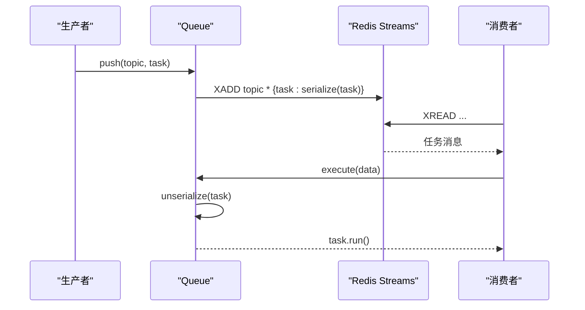
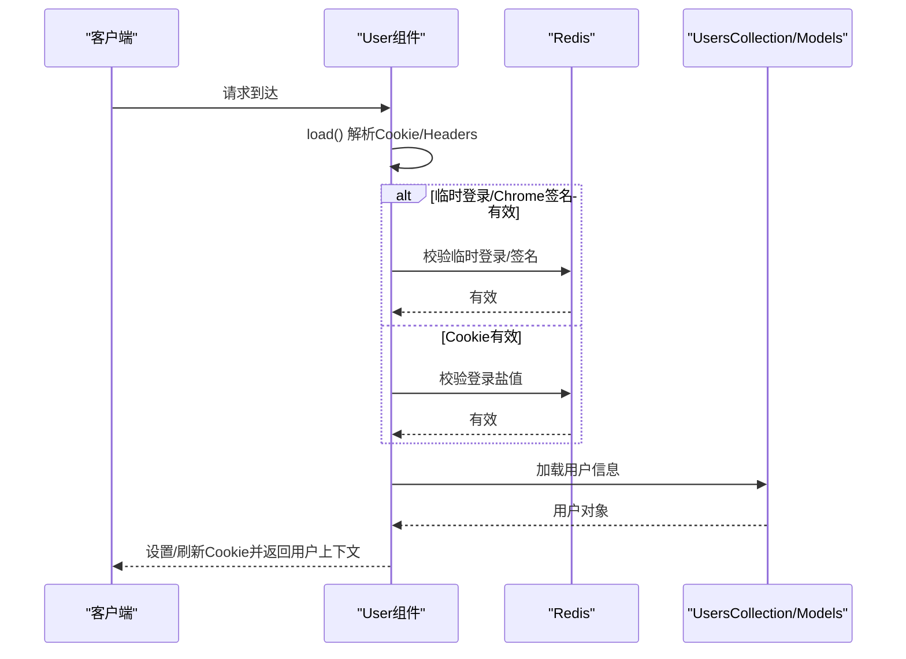
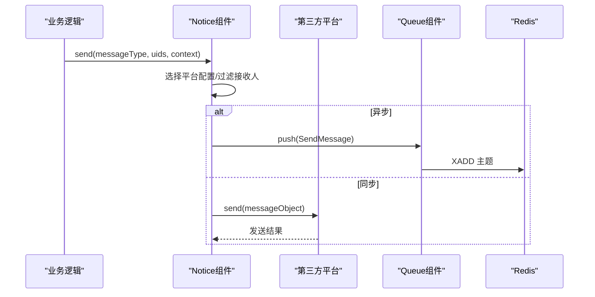
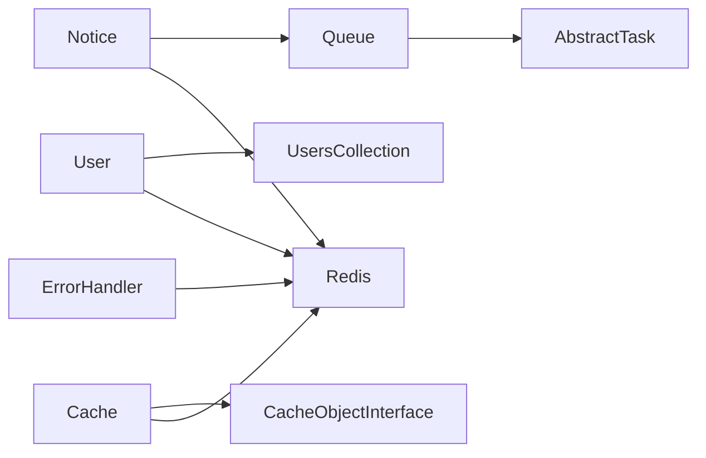

# 核心组件

<cite>
**本文引用的文件**
- [components.php](file://process/src/config/components.php)
- [components_http.php](file://process/src/config/components_http.php)
- [components_cli.php](file://process/src/config/components_cli.php)
- [bootstrap.php](file://process/src/bootstrap.php)
- [init.php](file://process/src/config/init.php)
- [Cache.php](file://process/src/components/Cache.php)
- [CacheObjectInterface.php](file://process/src/components/CacheObjectInterface.php)
- [ErrorHandler.php](file://process/src/components/ErrorHandler.php)
- [Queue.php](file://process/src/components/Queue.php)
- [User.php](file://process/src/components/User.php)
- [Notice.php](file://process/src/components/Notice.php)
- [CacheKeyHelper.php](file://process/src/helpers/CacheKeyHelper.php)
- [UsersCollection.php](file://process/src/services/UsersCollection.php)
</cite>

## 目录
1. [简介](#简介)
2. [项目结构](#项目结构)
3. [核心组件](#核心组件)
4. [架构总览](#架构总览)
5. [详细组件分析](#详细组件分析)
6. [依赖分析](#依赖分析)
7. [性能考量](#性能考量)
8. [故障排查指南](#故障排查指南)
9. [结论](#结论)
10. [附录](#附录)

## 简介
本文件系统性梳理 htdNew 项目的核心组件，围绕组件化架构的设计理念与实现机制展开，重点覆盖以下方面：
- 组件注册与依赖注入：如何在配置层声明组件、如何在运行时按需注入。
- 生命周期管理：组件初始化、定时任务、清理与版本同步。
- 关键组件能力：
  - 错误处理组件：异常捕获、分类处理与系统级响应。
  - 缓存组件：本地内存缓存、Redis 版本同步、定期清理与失效策略。
  - 队列组件：任务序列化/反序列化、消费者数量配置、主题管理与执行流程。
  - 用户组件：身份认证、匿名访问控制、登录态维护与登出处理。
- 组件协作与数据传递：组件间如何通过共享的 redis、配置中心与上下文进行交互。

## 项目结构
核心组件位于 process/src/components 目录，配合 config 中的组件注册配置与 bootstrap 自动加载机制共同构成组件化基础层。辅助工具如 CacheKeyHelper 提供统一的键空间管理；User 组件依赖 UsersCollection 与模型层完成用户数据加载。

**图表来源**
- [components.php](file://process/src/config/components.php#L1-L34)
- [components_http.php](file://process/src/config/components_http.php#L1-L33)
- [components_cli.php](file://process/src/config/components_cli.php#L1-L3)
- [init.php](file://process/src/config/init.php#L1-L48)
- [bootstrap.php](file://process/src/bootstrap.php#L1-L40)
- [User.php](file://process/src/components/User.php#L1-L429)
- [ErrorHandler.php](file://process/src/components/ErrorHandler.php#L1-L26)
- [Queue.php](file://process/src/components/Queue.php#L1-L173)
- [Notice.php](file://process/src/components/Notice.php#L1-L406)
- [Cache.php](file://process/src/components/Cache.php#L1-L136)
- [CacheObjectInterface.php](file://process/src/components/CacheObjectInterface.php#L1-L9)
- [CacheKeyHelper.php](file://process/src/helpers/CacheKeyHelper.php#L1-L636)
- [UsersCollection.php](file://process/src/services/UsersCollection.php#L1-L17)

**章节来源**
- [components.php](file://process/src/config/components.php#L1-L34)
- [components_http.php](file://process/src/config/components_http.php#L1-L33)
- [components_cli.php](file://process/src/config/components_cli.php#L1-L3)
- [init.php](file://process/src/config/init.php#L1-L48)
- [bootstrap.php](file://process/src/bootstrap.php#L1-L40)

## 核心组件
本节从设计理念与实现机制两个维度，概述四大核心组件的职责边界与协作方式。

- 组件注册与依赖注入
  - 在配置文件中声明组件类与依赖，HTTP/CLI 场景分别注册不同组件集合，确保按需加载与隔离。
  - 通过 bootstrap 的自动加载器支持命名空间映射，简化组件引入与跨模块复用。
- 生命周期管理
  - 组件在初始化阶段启动定时任务（如缓存版本同步、过期清理），并在运行期根据外部配置动态调整行为。
- 组件协作
  - 共享键空间由 CacheKeyHelper 统一管理，避免键冲突。
  - 用户组件与模型层协同完成用户加载与权限判定；通知组件通过队列异步发送消息；队列组件负责任务编解码与执行。

**章节来源**
- [components.php](file://process/src/config/components.php#L1-L34)
- [components_http.php](file://process/src/config/components_http.php#L1-L33)
- [bootstrap.php](file://process/src/bootstrap.php#L1-L40)
- [CacheKeyHelper.php](file://process/src/helpers/CacheKeyHelper.php#L1-L636)

## 架构总览
下图展示组件化架构中的关键交互路径：请求进入后由用户组件完成身份认证与匿名策略判定，随后业务逻辑可调用缓存组件进行对象缓存与版本同步，错误处理组件贯穿于异常捕获与系统级响应，通知组件通过队列异步发送消息，队列组件负责任务的序列化、入队与执行。

**图表来源**
- [User.php](file://process/src/components/User.php#L1-L429)
- [UsersCollection.php](file://process/src/services/UsersCollection.php#L1-L17)
- [Cache.php](file://process/src/components/Cache.php#L1-L136)
- [CacheKeyHelper.php](file://process/src/helpers/CacheKeyHelper.php#L1-L636)
- [ErrorHandler.php](file://process/src/components/ErrorHandler.php#L1-L26)
- [Notice.php](file://process/src/components/Notice.php#L1-L406)
- [Queue.php](file://process/src/components/Queue.php#L1-L173)

## 详细组件分析

### 错误处理组件（ErrorHandler）
- 设计理念
  - 将数据库异常与通用异常区分开来，针对数据库异常进行集中记录与截断保留，其余异常统一返回系统错误响应。
- 实现要点
  - 捕获 Throwable，识别 DbException 类型，写入 Redis 列表并限制长度，随后返回系统错误响应。
  - 非 DbException 走统一系统错误响应路径。
- 使用建议
  - 在中间件或控制器层统一拦截未处理异常，交由该组件输出一致的错误格式。

**图表来源**
- [ErrorHandler.php](file://process/src/components/ErrorHandler.php#L1-L26)

**章节来源**
- [ErrorHandler.php](file://process/src/components/ErrorHandler.php#L1-L26)

### 缓存组件（Cache）
- 设计理念
  - 采用“本地内存 + Redis 版本”双层一致性方案：本地缓存提升访问速度，Redis 版本用于跨进程一致性与失效通知。
- 实现要点
  - 初始化阶段启动定时任务：
    - 每 3 秒从 Redis 同步版本，写入 /dev/shm 并基于互斥锁避免并发竞争。
    - 每 600 秒清理超期对象。
  - 提供 get/set/updateVersion/clearAll 等方法，结合 CacheObjectInterface 规范对象的版本与过期时间。
- 失效机制
  - 本地 lastUsed 与对象 getCacheExpire 对比决定是否过期。
  - Redis 版本低于远端版本时主动剔除。
- 性能特征
  - 本地命中避免 Redis 访问；版本同步采用互斥锁与文件缓存降低 Redis 压力。

**图表来源**
- [Cache.php](file://process/src/components/Cache.php#L1-L136)
- [CacheObjectInterface.php](file://process/src/components/CacheObjectInterface.php#L1-L9)
- [CacheKeyHelper.php](file://process/src/helpers/CacheKeyHelper.php#L1-L636)

**章节来源**
- [Cache.php](file://process/src/components/Cache.php#L1-L136)
- [CacheObjectInterface.php](file://process/src/components/CacheObjectInterface.php#L1-L9)
- [CacheKeyHelper.php](file://process/src/helpers/CacheKeyHelper.php#L1-L636)

### 队列组件（Queue）
- 设计理念
  - 以 Redis Streams 作为消息传输载体，支持高吞吐的任务投递与消费；通过配置中心动态调整消费者数量。
- 实现要点
  - push/pushReturnId：将任务序列化后写入指定主题。
  - execute：从消息体反序列化任务并调用其 run 方法。
  - setConsumerNum/getConsumerNum：通过 Redis 与 YAML 合并配置，动态生效。
  - encode/decode：兼容 BaseObject 与普通对象，支持 __serialize/__unserialize 或反射属性遍历。
- 使用示例
  - 业务侧将实现了抽象任务的对象推送到指定主题，消费者进程通过配置中心拉取消费者数量后开始消费。

**图表来源**
- [Queue.php](file://process/src/components/Queue.php#L1-L173)

**章节来源**
- [Queue.php](file://process/src/components/Queue.php#L1-L173)

### 用户组件（User）
- 设计理念
  - 以协程单例模式管理当前用户上下文，支持登录态校验、匿名访问白名单、测试态模拟与多平台额外票据。
- 实现要点
  - init：从 Cookie/Headers/临时登录等多渠道加载用户，校验签名与第三方票据有效性，设置用户对象。
  - login/refreshCookie/logout：发放/刷新登录 Cookie，并在登出时清理相关域与票据。
  - 匿名访问：对特定 URI 白名单放行，结合应用配置与 IP 校验。
- 权限控制
  - 通过 UsersCollection 与模型层配合，检查用户状态与测试态权限。
  - 支持按设备区分登录盐值，延长或缩短登录有效期。

**图表来源**
- [User.php](file://process/src/components/User.php#L1-L429)
- [UsersCollection.php](file://process/src/services/UsersCollection.php#L1-L17)

**章节来源**
- [User.php](file://process/src/components/User.php#L1-L429)
- [UsersCollection.php](file://process/src/services/UsersCollection.php#L1-L17)

### 通知组件（Notice）
- 设计理念
  - 以平台抽象屏蔽多种通知渠道（站内、短信、邮件、企业微信等），通过配置中心与消息模板驱动发送。
- 实现要点
  - send/sendConfig：按消息类型与应用维度选择平台配置，过滤用户接收条件，异步入队或直接发送。
  - doSend/doSendRetry：构造消息对象、设置接收方、记录发送日志并入队或直发。
  - sendType/sendSms/sendEmail：面向非登录场景的直发能力。
- 与队列协作
  - 异步发送通过 queue()->push 投递到队列，由消费者平台对象执行发送。

**图表来源**
- [Notice.php](file://process/src/components/Notice.php#L1-L406)
- [Queue.php](file://process/src/components/Queue.php#L1-L173)

**章节来源**
- [Notice.php](file://process/src/components/Notice.php#L1-L406)
- [Queue.php](file://process/src/components/Queue.php#L1-L173)

## 依赖分析
- 组件耦合
  - User 依赖 UsersCollection 与模型层；Notice 依赖平台对象与队列；Queue 依赖抽象任务接口；Cache 依赖 CacheObjectInterface 与键空间。
- 外部依赖
  - Redis 作为共享存储与消息通道；YAML 配置中心用于动态参数下发；Swoole 定时器与协程上下文支撑运行时行为。
- 潜在风险
  - 编解码兼容性：encode/decode 对象构造参数的默认值要求需明确；消费者数量变更需确保 reload 生效。
  - 键空间冲突：需严格遵循 CacheKeyHelper 的命名规范。

**图表来源**
- [User.php](file://process/src/components/User.php#L1-L429)
- [Notice.php](file://process/src/components/Notice.php#L1-L406)
- [Queue.php](file://process/src/components/Queue.php#L1-L173)
- [Cache.php](file://process/src/components/Cache.php#L1-L136)
- [CacheObjectInterface.php](file://process/src/components/CacheObjectInterface.php#L1-L9)
- [ErrorHandler.php](file://process/src/components/ErrorHandler.php#L1-L26)

**章节来源**
- [User.php](file://process/src/components/User.php#L1-L429)
- [Notice.php](file://process/src/components/Notice.php#L1-L406)
- [Queue.php](file://process/src/components/Queue.php#L1-L173)
- [Cache.php](file://process/src/components/Cache.php#L1-L136)
- [CacheObjectInterface.php](file://process/src/components/CacheObjectInterface.php#L1-L9)
- [ErrorHandler.php](file://process/src/components/ErrorHandler.php#L1-L26)

## 性能考量
- 缓存命中优化
  - 本地内存缓存减少 Redis 访问；版本同步采用互斥锁与文件缓存，降低热点键竞争。
- 队列吞吐
  - 使用 Redis Streams 作为消息通道，支持多消费者并行；encode/decode 采用反射与序列化兼顾，平衡灵活性与性能。
- 用户登录态
  - 登录盐值按设备区分，避免跨设备挤占；登出时清理 Cookie 与 Redis，防止会话残留。
- 异常处理
  - 数据库异常集中记录并截断，避免无限增长；非数据库异常统一响应，便于监控与告警。

[本节为通用指导，不直接分析具体文件]

## 故障排查指南
- 缓存不一致
  - 检查 /dev/shm 文件是否存在且最新；确认 Redis 中 object_cache 哈希是否更新；核对 Cache::getVersionFromRedis 的互斥锁逻辑。
- 队列消费异常
  - 查看消费者数量配置是否生效（setConsumerNum 后 reload）；确认主题名称与消费者数量匹配；检查任务对象的构造参数默认值。
- 用户登录失败
  - 核对 Cookie 与 UA 的 MD5 校验；检查 Redis 登录盐值是否存在与过期；确认匿名访问白名单与应用配置。
- 通知未送达
  - 检查平台启用状态与用户接收设置；确认异步发送已入队；查看发送日志与重试数据。

**章节来源**
- [Cache.php](file://process/src/components/Cache.php#L1-L136)
- [Queue.php](file://process/src/components/Queue.php#L1-L173)
- [User.php](file://process/src/components/User.php#L1-L429)
- [Notice.php](file://process/src/components/Notice.php#L1-L406)

## 结论
htdNew 的核心组件以“配置驱动 + 组件化 + 共享键空间”的方式构建了稳定、可扩展的基础层。通过明确的生命周期管理与清晰的职责边界，组件在认证、缓存、消息与任务调度等方面形成高效协作。建议在扩展新组件时遵循现有约定：使用配置文件声明、实现必要的接口、利用 CacheKeyHelper 管理键空间，并通过队列实现异步解耦。

[本节为总结性内容，不直接分析具体文件]

## 附录
- 组件注册与注入
  - 在 components.php 中声明组件类；在 components_http.php 中注册用户组件；在 components_cli.php 中预留 CLI 组件扩展点。
- 自动加载
  - bootstrap.php 提供命名空间到文件路径的映射规则，确保组件与业务代码可无缝引入。
- 初始化与事件
  - init.php 注册日志级别、全局事件分发器与环境事件监听，为组件运行提供基础设施。

**章节来源**
- [components.php](file://process/src/config/components.php#L1-L34)
- [components_http.php](file://process/src/config/components_http.php#L1-L33)
- [components_cli.php](file://process/src/config/components_cli.php#L1-L3)
- [bootstrap.php](file://process/src/bootstrap.php#L1-L40)
- [init.php](file://process/src/config/init.php#L1-L48)