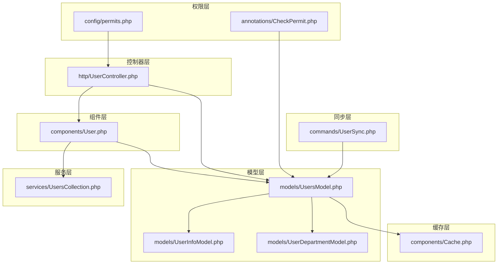
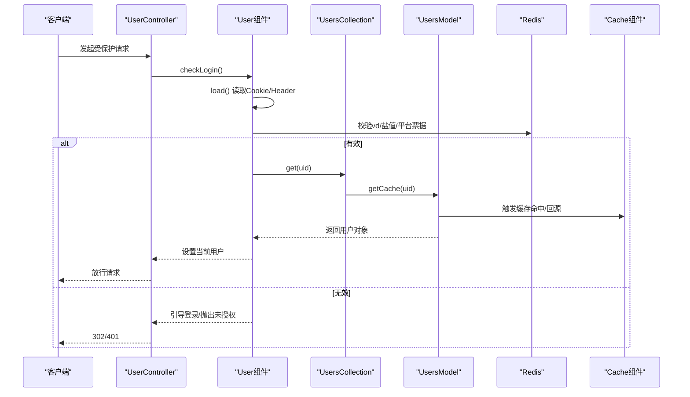
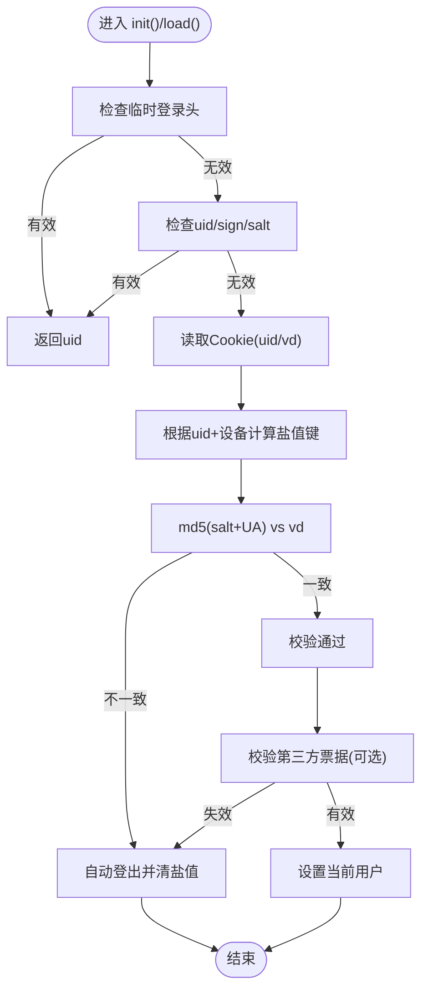
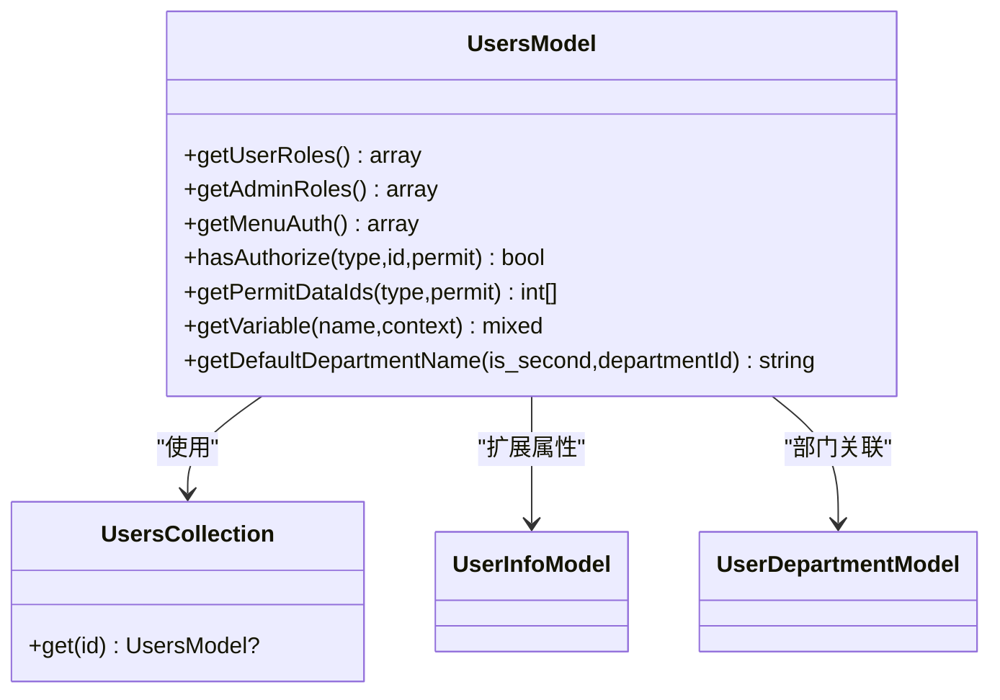
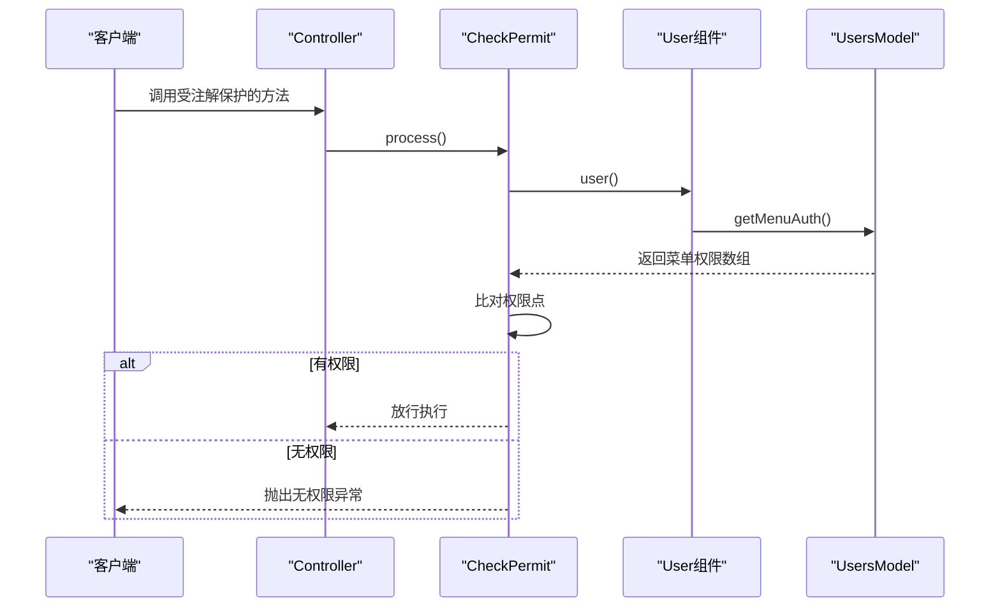
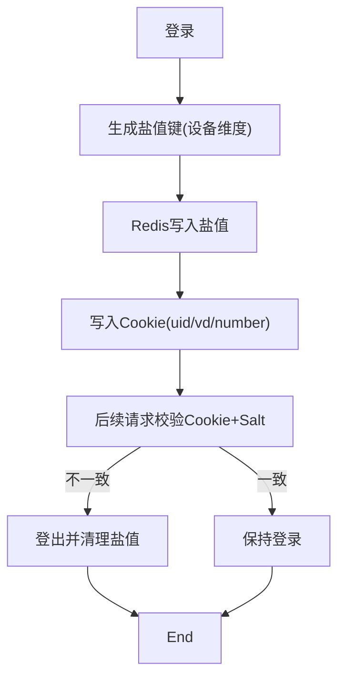
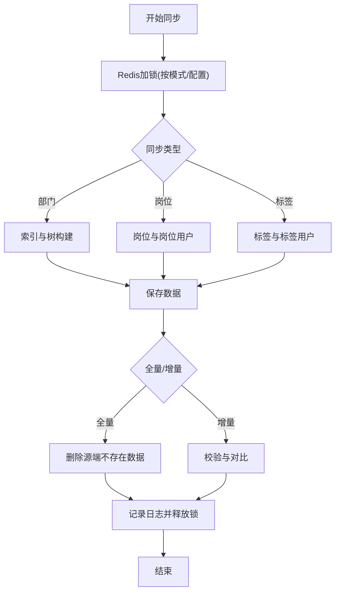
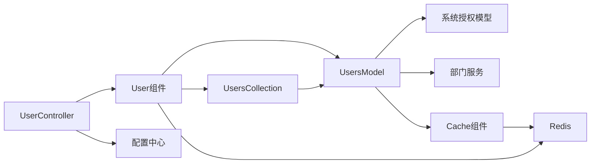

# 用户组件

<cite>
**本文引用的文件**
- [components/User.php](file://process/src/components/User.php)
- [models/UsersModel.php](file://process/src/models/UsersModel.php)
- [models/UserInfoModel.php](file://process/src/models/UserInfoModel.php)
- [models/UserDepartmentModel.php](file://process/src/models/UserDepartmentModel.php)
- [services/UsersCollection.php](file://process/src/services/UsersCollection.php)
- [http/UserController.php](file://process/src/http/UserController.php)
- [annotations/CheckPermit.php](file://process/src/annotations/CheckPermit.php)
- [config/permits.php](file://process/src/config/permits.php)
- [config/components.php](file://process/src/config/components.php)
- [components/Cache.php](file://process/src/components/Cache.php)
- [commands/UserSync.php](file://process/src/commands/UserSync.php)
</cite>

## 目录
1. [简介](#简介)
2. [项目结构](#项目结构)
3. [核心组件](#核心组件)
4. [架构总览](#架构总览)
5. [详细组件分析](#详细组件分析)
6. [依赖分析](#依赖分析)
7. [性能考虑](#性能考虑)
8. [故障排查指南](#故障排查指南)
9. [结论](#结论)
10. [附录](#附录)

## 简介
本文件面向“用户组件”的设计与实现，围绕用户身份认证、权限验证与会话管理展开，系统性梳理用户模型体系（UsersModel、UserInfoModel、UserDepartmentModel 等），阐述用户组件与权限系统的集成方式，并总结缓存策略与同步机制。同时给出扩展方法、自定义用户属性与权限管理的最佳实践，帮助开发者在多校区、多平台环境下稳定地构建用户域。

## 项目结构
用户组件位于 process/src 下，主要由以下模块构成：
- 组件层：components/User.php 提供登录态加载、登录/登出、Cookie/令牌颁发、跨平台退出校验等能力
- 模型层：models 下的 UsersModel、UserInfoModel、UserDepartmentModel 等承载用户实体与扩展属性
- 服务层：services/UsersCollection.php 提供统一的用户缓存访问入口
- 控制器层：http/UserController.php 提供统一登录校验与匿名/分享/临时用户场景处理
- 权限层：annotations/CheckPermit.php 与 config/permits.php 实现基于注解与路由映射的权限控制
- 缓存层：components/Cache.php 提供对象级缓存与版本一致性维护
- 同步层：commands/UserSync.php 及其配套服务负责用户与组织、岗位、标签等维度的同步

图表来源
- [components/User.php](file://process/src/components/User.php#L1-L429)
- [models/UsersModel.php](file://process/src/models/UsersModel.php#L1-L800)
- [models/UserInfoModel.php](file://process/src/models/UserInfoModel.php#L1-L65)
- [models/UserDepartmentModel.php](file://process/src/models/UserDepartmentModel.php#L1-L72)
- [services/UsersCollection.php](file://process/src/services/UsersCollection.php#L1-L17)
- [http/UserController.php](file://process/src/http/UserController.php#L1-L186)
- [annotations/CheckPermit.php](file://process/src/annotations/CheckPermit.php#L1-L27)
- [config/permits.php](file://process/src/config/permits.php#L1-L385)
- [components/Cache.php](file://process/src/components/Cache.php#L1-L136)
- [commands/UserSync.php](file://process/src/commands/UserSync.php#L1-L221)

章节来源
- [components/User.php](file://process/src/components/User.php#L1-L429)
- [models/UsersModel.php](file://process/src/models/UsersModel.php#L1-L800)
- [models/UserInfoModel.php](file://process/src/models/UserInfoModel.php#L1-L65)
- [models/UserDepartmentModel.php](file://process/src/models/UserDepartmentModel.php#L1-L72)
- [services/UsersCollection.php](file://process/src/services/UsersCollection.php#L1-L17)
- [http/UserController.php](file://process/src/http/UserController.php#L1-L186)
- [annotations/CheckPermit.php](file://process/src/annotations/CheckPermit.php#L1-L27)
- [config/permits.php](file://process/src/config/permits.php#L1-L385)
- [components/Cache.php](file://process/src/components/Cache.php#L1-L136)
- [commands/UserSync.php](file://process/src/commands/UserSync.php#L1-L221)

## 核心组件
- 用户组件（User）
  - 负责加载请求上下文中的登录态，支持 Cookie、临时登录头、第三方平台票据校验与跨平台退出联动
  - 提供登录、刷新 Cookie、登出、模拟登录（测试态）等能力
  - 通过 CacheKeyHelper 与 redis 维护登录盐值与有效期
- 用户模型（UsersModel）
  - 用户主表模型，封装角色、身份、部门、岗位、授权等聚合查询与缓存
  - 提供菜单权限、授权数据 ID 列表、变量解析（如部门、身份、岗位等）等能力
- 用户信息模型（UserInfoModel）
  - 用户扩展信息表，支持保存与缓存失效联动
- 用户部门模型（UserDepartmentModel）
  - 用户-部门关联表，支持默认部门切换与同步默认部门到 UsersModel
- 用户集合服务（UsersCollection）
  - 统一的用户缓存访问入口，简化 UsersModel::getCache 使用
- 控制器基类（UserController）
  - 统一登录校验、匿名/分享/临时用户注入、CSRF 简易校验
- 权限注解与配置（CheckPermit、permits.php）
  - 注解式权限拦截；路由到权限点的映射配置
- 缓存组件（Cache）
  - 对象级缓存与版本一致性维护，定期清理与跨进程版本同步
- 用户同步（UserSync）
  - 部门/岗位/标签等维度的全量与增量同步流程，带 Redis 锁与日志

章节来源
- [components/User.php](file://process/src/components/User.php#L1-L429)
- [models/UsersModel.php](file://process/src/models/UsersModel.php#L1-L800)
- [models/UserInfoModel.php](file://process/src/models/UserInfoModel.php#L1-L65)
- [models/UserDepartmentModel.php](file://process/src/models/UserDepartmentModel.php#L1-L72)
- [services/UsersCollection.php](file://process/src/services/UsersCollection.php#L1-L17)
- [http/UserController.php](file://process/src/http/UserController.php#L1-L186)
- [annotations/CheckPermit.php](file://process/src/annotations/CheckPermit.php#L1-L27)
- [config/permits.php](file://process/src/config/permits.php#L1-L385)
- [components/Cache.php](file://process/src/components/Cache.php#L1-L136)
- [commands/UserSync.php](file://process/src/commands/UserSync.php#L1-L221)

## 架构总览
用户组件贯穿“请求生命周期”，从控制器基类进行登录校验，到用户组件加载/校验登录态，再到模型层聚合权限与属性，最终通过注解与配置完成权限拦截。

图表来源
- [http/UserController.php](file://process/src/http/UserController.php#L100-L168)
- [components/User.php](file://process/src/components/User.php#L286-L351)
- [services/UsersCollection.php](file://process/src/services/UsersCollection.php#L12-L17)
- [models/UsersModel.php](file://process/src/models/UsersModel.php#L1-L200)
- [components/Cache.php](file://process/src/components/Cache.php#L1-L136)

## 详细组件分析

### 用户组件（User）分析
- 登录态加载与校验
  - 优先从 Header/临时登录头校验，其次从 Cookie 校验
  - 结合设备类型与盐值进行二次校验，防止 Cookie 被复制
  - 支持第三方平台票据校验与跨平台退出联动
- 登录/登出
  - 登录：生成设备维度盐值，写入 Redis 与 Cookie（uid/vd/number），支持永久登录策略
  - 刷新：延长 Cookie 有效期并刷新 Redis 中盐值 TTL
  - 登出：清除 Cookie 并按平台清理融合态 Cookie，删除盐值
- 测试态与模拟登录
  - 通过 testuid/testappid 检查应用测试权限，成功则模拟目标用户并标记 isSimulate
- 匿名访问
  - 在白名单 URI 或匹配规则下，结合 App 配置与 IP 白名单放行匿名用户

图表来源
- [components/User.php](file://process/src/components/User.php#L286-L351)
- [components/User.php](file://process/src/components/User.php#L175-L210)
- [components/User.php](file://process/src/components/User.php#L386-L428)

章节来源
- [components/User.php](file://process/src/components/User.php#L1-L429)

### 用户模型（UsersModel）分析
- 角色与身份
  - 内置公共角色、登录角色、成员角色
  - 基于身份、部门、岗位、团队/标签等生成用户角色集合
- 管理角色
  - 基于系统权限用户（SystemAuthUserModel）与角色（SystemAuthRoleModel）推导管理角色（如 matter_admin.*、user_admin.*、department_admin.* 等）
- 菜单权限与授权
  - 聚合用户角色与管理角色，查询系统授权（SystemAuthAuthorizeModel），支持按类型与权限名筛选
  - 提供 hasAuthorize、getPermitDataIds、getPermitDataIdsWithExtra 等便捷方法
- 变量解析与默认部门
  - 支持表达式解析（如 user.depart.name、user.second_department_name 等）
  - 默认部门名称与二级单位名称查询
- 缓存与集合
  - 通过 UsersCollection::get(uid) 与内部缓存机制降低数据库压力
  - 保存/更新后清理前端缓存键

图表来源
- [models/UsersModel.php](file://process/src/models/UsersModel.php#L360-L731)
- [services/UsersCollection.php](file://process/src/services/UsersCollection.php#L12-L17)
- [models/UserInfoModel.php](file://process/src/models/UserInfoModel.php#L1-L65)
- [models/UserDepartmentModel.php](file://process/src/models/UserDepartmentModel.php#L1-L72)

章节来源
- [models/UsersModel.php](file://process/src/models/UsersModel.php#L1-L800)
- [services/UsersCollection.php](file://process/src/services/UsersCollection.php#L1-L17)
- [models/UserInfoModel.php](file://process/src/models/UserInfoModel.php#L1-L65)
- [models/UserDepartmentModel.php](file://process/src/models/UserDepartmentModel.php#L1-L72)

### 权限系统集成
- 注解式权限
  - CheckPermit 注解在方法上声明所需权限点，运行时读取当前用户菜单权限进行比对
- 路由到权限映射
  - permits.php 将具体路由映射到权限点或通配符，支持精确匹配与通配符匹配
- 控制器基类
  - UserController::checkLogin 统一校验登录态，必要时引导登录或抛出未验证异常

图表来源
- [annotations/CheckPermit.php](file://process/src/annotations/CheckPermit.php#L1-L27)
- [http/UserController.php](file://process/src/http/UserController.php#L100-L168)
- [models/UsersModel.php](file://process/src/models/UsersModel.php#L536-L561)

章节来源
- [annotations/CheckPermit.php](file://process/src/annotations/CheckPermit.php#L1-L27)
- [config/permits.php](file://process/src/config/permits.php#L1-L385)
- [http/UserController.php](file://process/src/http/UserController.php#L1-L186)
- [models/UsersModel.php](file://process/src/models/UsersModel.php#L523-L561)

### 会话与缓存策略
- 登录盐值与 Cookie
  - 设备维度盐值键，登录时生成并写入 Redis，Cookie 中保存 uid/vd/number
  - 刷新 Cookie 时延长盐值 TTL，登出时删除盐值
- 对象缓存与版本一致性
  - Cache 组件维护对象缓存与版本，定时从 Redis 同步版本并清理过期对象
  - 通过共享内存文件（/dev/shm/object_cache.json）实现跨进程一致性
- 前端缓存键
  - UsersModel::getFeKey 生成前端缓存键，保存/更新后主动清理

图表来源
- [components/User.php](file://process/src/components/User.php#L175-L210)
- [components/User.php](file://process/src/components/User.php#L219-L247)
- [components/User.php](file://process/src/components/User.php#L386-L428)
- [components/Cache.php](file://process/src/components/Cache.php#L95-L131)
- [models/UsersModel.php](file://process/src/models/UsersModel.php#L353-L360)

章节来源
- [components/User.php](file://process/src/components/User.php#L175-L247)
- [components/Cache.php](file://process/src/components/Cache.php#L1-L136)
- [models/UsersModel.php](file://process/src/models/UsersModel.php#L249-L254)

### 用户同步机制
- 同步类型
  - 部门用户、岗位用户、单岗位用户、标签用户、单标签用户
- 流程要点
  - 全量/增量模式下设置 Redis 锁，避免并发冲突
  - 部门同步时进行编码去重校验
  - 同步完成后记录日志并释放锁
- 与用户模型的关系
  - 同步结果最终落库并与 UsersModel 关联，触发缓存清理与权限重建

图表来源
- [commands/UserSync.php](file://process/src/commands/UserSync.php#L67-L149)
- [commands/UserSync.php](file://process/src/commands/UserSync.php#L151-L221)

章节来源
- [commands/UserSync.php](file://process/src/commands/UserSync.php#L1-L221)

### 扩展与最佳实践
- 自定义用户属性
  - 在 UserInfoModel 中新增字段并在 UsersModel::getVariable 中暴露对应变量，确保 afterSave 清理缓存
- 权限管理
  - 通过 SystemAuthUserModel/SystemAuthRoleModel 维护用户-角色-授权映射，使用 CheckPermit 注解与 permits.php 映射路由
- 会话安全
  - 启用设备维度盐值与 Cookie samesite/secure 策略，登出时删除盐值，避免 Cookie 复用
- 缓存一致性
  - 对象缓存通过版本同步与定时清理保证一致性；用户信息变更后及时清理前端缓存键
- 同步稳定性
  - 全量同步前进行编码去重校验，增量同步严格控制锁时长，失败时记录日志并释放锁

章节来源
- [models/UserInfoModel.php](file://process/src/models/UserInfoModel.php#L1-L65)
- [models/UsersModel.php](file://process/src/models/UsersModel.php#L269-L316)
- [annotations/CheckPermit.php](file://process/src/annotations/CheckPermit.php#L1-L27)
- [config/permits.php](file://process/src/config/permits.php#L1-L385)
- [components/User.php](file://process/src/components/User.php#L175-L247)
- [components/Cache.php](file://process/src/components/Cache.php#L95-L131)
- [commands/UserSync.php](file://process/src/commands/UserSync.php#L151-L221)

## 依赖分析
- 组件耦合
  - User 依赖 UsersCollection 与 UsersModel，间接依赖 Redis 与配置中心
  - UsersModel 依赖系统授权模型与部门服务，输出角色/权限/变量
  - UserController 依赖 User 与配置，提供统一登录校验
  - Cache 作为通用缓存组件被多处使用
- 外部依赖
  - Redis 用于盐值与对象缓存版本存储
  - 配置中心提供 Cookie 安全策略、权限过期时间等参数

图表来源
- [components/User.php](file://process/src/components/User.php#L1-L429)
- [models/UsersModel.php](file://process/src/models/UsersModel.php#L1-L800)
- [services/UsersCollection.php](file://process/src/services/UsersCollection.php#L1-L17)
- [http/UserController.php](file://process/src/http/UserController.php#L1-L186)
- [components/Cache.php](file://process/src/components/Cache.php#L1-L136)

章节来源
- [components/User.php](file://process/src/components/User.php#L1-L429)
- [models/UsersModel.php](file://process/src/models/UsersModel.php#L1-L800)
- [services/UsersCollection.php](file://process/src/services/UsersCollection.php#L1-L17)
- [http/UserController.php](file://process/src/http/UserController.php#L1-L186)
- [components/Cache.php](file://process/src/components/Cache.php#L1-L136)

## 性能考虑
- 缓存命中与热点用户
  - UsersModel 与 UsersCollection 提供缓存，减少数据库访问；Cache 组件通过版本同步与定时清理避免脏读
- 登录校验开销
  - Cookie 校验在用户态加载阶段完成，避免每次请求都回源数据库
- 同步效率
  - 全量同步前进行编码去重校验，避免重复写入；增量同步严格控制锁时长，降低阻塞风险

## 故障排查指南
- 登录失败/频繁掉线
  - 检查 Cookie 是否携带 uid/vd，确认 md5(salt+UA) 与 vd 一致
  - 核对设备维度盐值键是否存在且未过期
- 第三方平台退出无效
  - 检查 extra_tk 与平台票据有效性，确认平台对象的 ticketValid 回调
- 权限不足
  - 使用注解与菜单权限接口核对当前用户权限点，确认 permits.php 映射正确
- 缓存不一致
  - 触发对象缓存版本同步或手动清理 object_cache 哈希，确认 /dev/shm 文件存在且可读
- 同步异常
  - 查看 UserSync 日志，确认 Redis 锁是否释放，全量同步前的编码去重校验是否通过

章节来源
- [components/User.php](file://process/src/components/User.php#L286-L351)
- [components/User.php](file://process/src/components/User.php#L353-L428)
- [annotations/CheckPermit.php](file://process/src/annotations/CheckPermit.php#L1-L27)
- [config/permits.php](file://process/src/config/permits.php#L1-L385)
- [components/Cache.php](file://process/src/components/Cache.php#L95-L131)
- [commands/UserSync.php](file://process/src/commands/UserSync.php#L67-L149)

## 结论
用户组件通过“组件-模型-服务-控制器-权限-缓存-同步”七层协同，实现了高可用、可扩展的用户域能力。登录态采用设备维度盐值与 Cookie 校验，配合第三方平台票据与跨平台退出机制，保障会话安全；权限体系以注解与路由映射为核心，结合用户角色与授权模型，实现细粒度访问控制；缓存与同步机制确保性能与一致性。建议在扩展用户属性与权限时遵循本文最佳实践，持续优化登录体验与系统稳定性。

## 附录
- 配置参考
  - 组件初始化与 Redis 配置：components.php
  - 权限映射：permits.php
- 常用路径
  - 用户组件：components/User.php
  - 用户模型：models/UsersModel.php
  - 用户信息：models/UserInfoModel.php
  - 用户部门：models/UserDepartmentModel.php
  - 用户集合：services/UsersCollection.php
  - 控制器基类：http/UserController.php
  - 权限注解：annotations/CheckPermit.php
  - 对象缓存：components/Cache.php
  - 用户同步：commands/UserSync.php