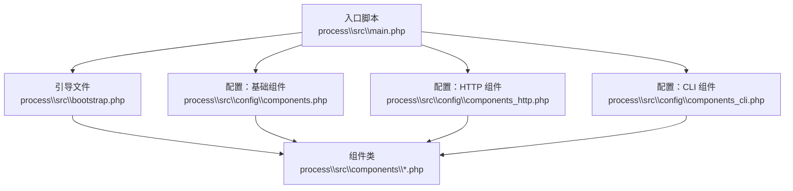
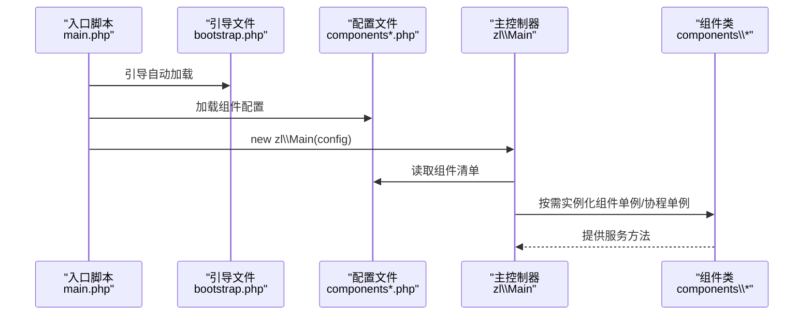
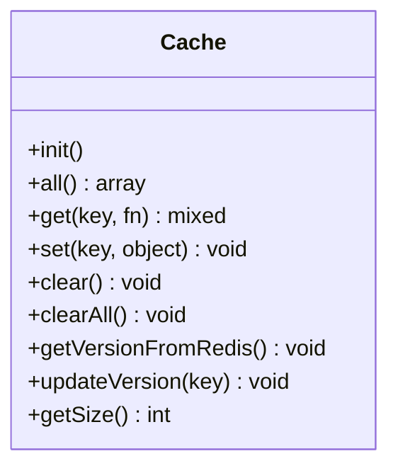
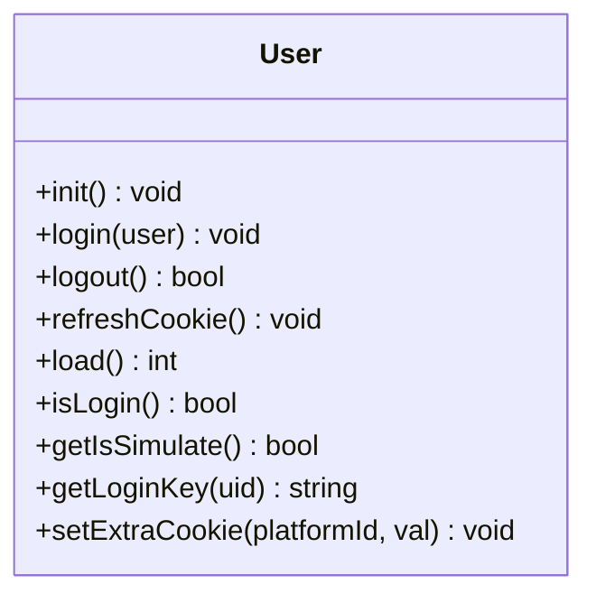
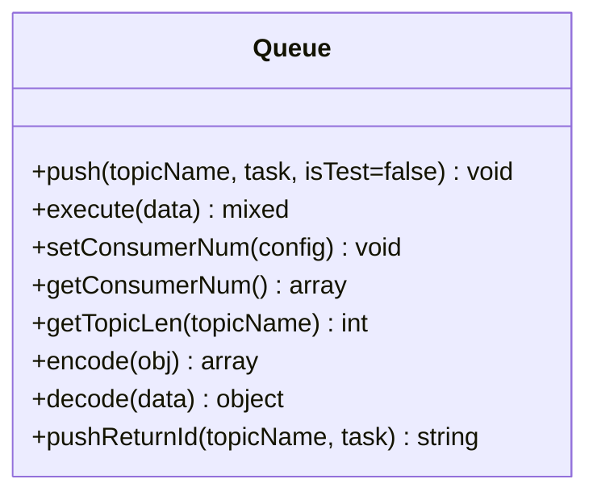
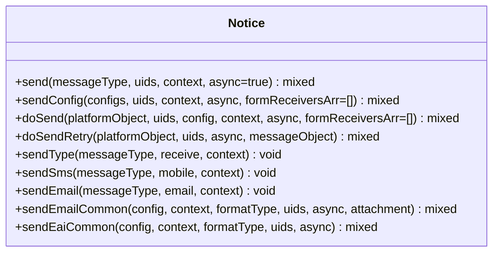
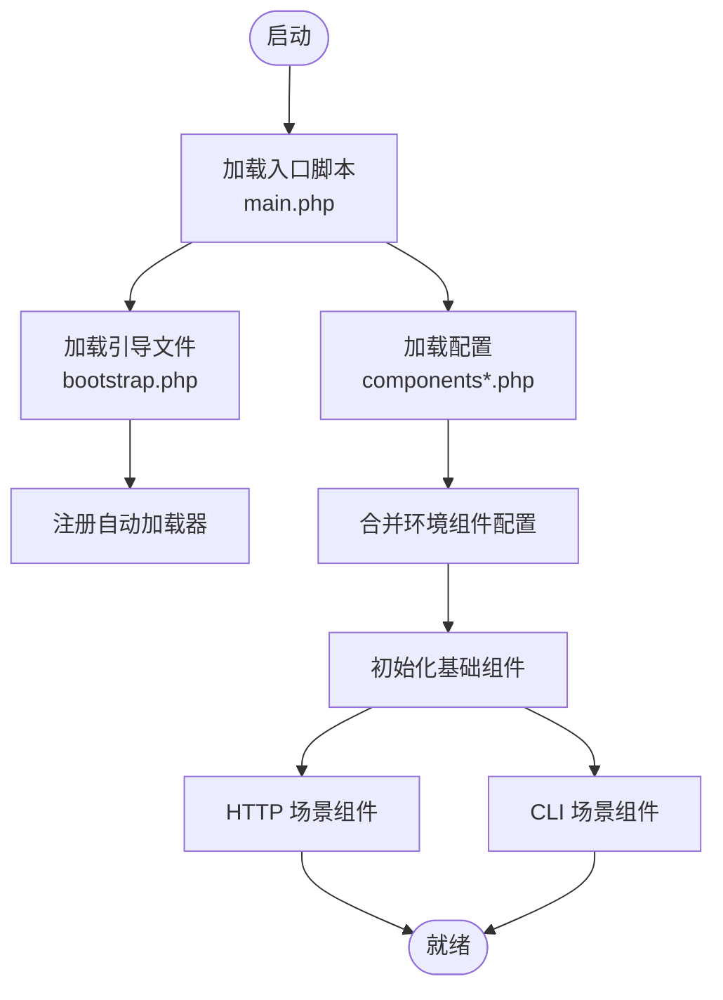

# 组件架构设计

<cite>
**本文引用的文件**
- [process\src\config\components.php](file://process\src\config\components.php)
- [process\src\config\components_http.php](file://process\src\config\components_http.php)
- [process\src\config\components_cli.php](file://process\src\config\components_cli.php)
- [process\src\config\init.php](file://process\src\config\init.php)
- [process\src\bootstrap.php](file://process\src\bootstrap.php)
- [process\src\main.php](file://process\src\main.php)
- [process\src\components\Cache.php](file://process\src\components\Cache.php)
- [process\src\components\User.php](file://process\src\components\User.php)
- [process\src\components\Queue.php](file://process\src\components\Queue.php)
- [process\src\components\Notice.php](file://process\src\components\Notice.php)
- [process_envs\buaa\product\components.php](file://process_envs\buaa\product\components.php)
- [process_envs\demo\product\components.php](file://process_envs\demo\product\components.php)
- [process\src\helpers\YamlHelper.php](file://process\src\helpers\YamlHelper.php)
</cite>

## 目录
1. [引言](#引言)
2. [项目结构](#项目结构)
3. [核心组件](#核心组件)
4. [架构总览](#架构总览)
5. [组件详细分析](#组件详细分析)
6. [依赖关系与初始化顺序](#依赖关系与初始化顺序)
7. [性能考量](#性能考量)
8. [故障排查指南](#故障排查指南)
9. [结论](#结论)
10. [附录：配置文件与最佳实践](#附录配置文件与最佳实践)

## 引言
本文件系统性梳理 htdNew 项目的组件化架构设计，重点围绕组件注册机制、依赖注入系统、生命周期管理展开；同时详解组件配置文件 components.php、components_http.php、components_cli.php 的结构与差异，并给出通过配置文件扩展与自定义组件的方法。文档旨在帮助读者快速理解并高效扩展该框架。

## 项目结构
htdNew 将“组件”抽象为可按需启用的命名实体，通过配置文件集中声明，结合引导与自动加载机制完成装配。核心入口与引导流程如下：
- 入口脚本负责加载 vendor、设置协程运行时、定义环境路径、引入引导文件并启动主控制器。
- 引导文件负责注册自动加载器，按命名空间映射加载组件与业务代码。
- 配置层通过 components.php、components_http.php、components_cli.php 分场景声明组件清单与路由规则。
- 组件层以类的形式提供缓存、用户、队列、通知等能力，并通过静态工厂或全局辅助函数在业务中使用。

图表来源
- [process\src\main.php](file://process\src\main.php#L1-L25)
- [process\src\bootstrap.php](file://process\src\bootstrap.php#L1-L40)
- [process\src\config\components.php](file://process\src\config\components.php#L1-L34)
- [process\src\config\components_http.php](file://process\src\config\components_http.php#L1-L33)
- [process\src\config\components_cli.php](file://process\src\config\components_cli.php#L1-L3)

章节来源
- [process\src\main.php](file://process\src\main.php#L1-L25)
- [process\src\bootstrap.php](file://process\src\bootstrap.php#L1-L40)

## 核心组件
本节聚焦四大核心组件及其职责与特性：
- 缓存组件：基于内存与 Redis 的对象缓存，支持版本一致性与定期清理。
- 用户组件：会话与登录态管理，支持匿名访问、测试模式、跨域与多平台登出。
- 队列组件：基于 Redis Stream 的任务推送与消费，支持消费者数量动态配置。
- 通知组件：统一消息发送入口，按平台与配置异步投递至队列或直接发送。

章节来源
- [process\src\components\Cache.php](file://process\src\components\Cache.php#L1-L136)
- [process\src\components\User.php](file://process\src\components\User.php#L1-L429)
- [process\src\components\Queue.php](file://process\src\components\Queue.php#L1-L173)
- [process\src\components\Notice.php](file://process\src\components\Notice.php#L1-L406)

## 架构总览
组件注册与装配的关键流程如下：
- 入口脚本加载配置与引导，随后由主控制器根据运行模式选择组件集合。
- 组件配置文件返回“组件名 => 配置”的数组，配置包含类名、参数、规则等。
- 引导文件的自动加载器按命名空间映射加载组件类，确保类可用。
- 组件在首次使用时通过单例/协程单例模式提供全局实例，避免重复初始化。

图表来源
- [process\src\main.php](file://process\src\main.php#L1-L25)
- [process\src\bootstrap.php](file://process\src\bootstrap.php#L1-L40)
- [process\src\config\components.php](file://process\src\config\components.php#L1-L34)
- [process\src\config\components_http.php](file://process\src\config\components_http.php#L1-L33)
- [process\src\config\components_cli.php](file://process\src\config\components_cli.php#L1-L3)

## 组件详细分析

### 缓存组件（Cache）
- 设计要点
  - 使用内存哈希表缓存对象，配合 Redis 维护版本号，实现跨进程一致性。
  - 定时任务周期性从 Redis 同步版本并清理过期对象。
  - 支持手动更新版本与全量清理。
- 关键行为
  - get(key, fn)：若命中返回，否则调用回调创建并写入 Redis 版本。
  - clear()：按最后使用时间与对象过期策略清理。
  - getVersionFromRedis()：通过互斥锁与共享内存减少 Redis 访问压力。
- 生命周期
  - init() 在进程启动后注册定时器，持续维护缓存一致性。

图表来源
- [process\src\components\Cache.php](file://process\src\components\Cache.php#L1-L136)

章节来源
- [process\src\components\Cache.php](file://process\src\components\Cache.php#L1-L136)

### 用户组件（User）
- 设计要点
  - 协程单例，贯穿一次请求上下文。
  - 支持 Cookie/Headers/临时登录等多种鉴权方式。
  - 支持匿名访问白名单、测试模式模拟登录、多平台登出联动。
- 关键行为
  - init()：从上下文加载用户，校验状态与测试条件。
  - login()/logout()：发放/清除 Cookie 并同步 Redis 登录盐值。
  - load()：综合多种渠道校验登录有效性。
- 生命周期
  - 在每次请求开始时初始化，结束时保持在协程上下文中。

图表来源
- [process\src\components\User.php](file://process\src\components\User.php#L1-L429)

章节来源
- [process\src\components\User.php](file://process\src\components\User.php#L1-L429)

### 队列组件（Queue）
- 设计要点
  - 基于 Redis Stream 推送任务，支持高、中、低三个主题。
  - 支持动态调整消费者数量并通过缓存持久化配置，触发主控制器重载。
  - 采用自定义序列化/反序列化策略，兼容 BaseObject 子类与普通对象。
- 关键行为
  - push(topic, task)：序列化任务并写入 Stream。
  - execute(data)：反序列化并执行任务对象的 run()。
  - setConsumerNum()/getConsumerNum()：读取/写入消费者配置。
- 生命周期
  - 作为工具类在运行期按需使用，无需显式初始化。

图表来源
- [process\src\components\Queue.php](file://process\src\components\Queue.php#L1-L173)

章节来源
- [process\src\components\Queue.php](file://process\src\components\Queue.php#L1-L173)

### 通知组件（Notice）
- 设计要点
  - 统一消息发送入口，按消息类型与平台配置进行分发。
  - 支持异步发送（入队）与同步发送两种模式。
  - 支持平台过滤、接收者转换、发送日志与重试数据持久化。
- 关键行为
  - send()/sendConfig()：按配置筛选平台并发送。
  - doSend()/doSendRetry()：平台级发送与重试。
  - sendType()/sendSms()/sendEmail()：面向类型的便捷发送。
- 生命周期
  - 作为服务类在运行期按需使用，无需显式初始化。

图表来源
- [process\src\components\Notice.php](file://process\src\components\Notice.php#L1-L406)

章节来源
- [process\src\components\Notice.php](file://process\src\components\Notice.php#L1-L406)

## 依赖关系与初始化顺序
- 组件注册与合并
  - 基础组件配置 components.php 定义 db、cache、redis、notice、queue 等组件。
  - HTTP 场景组件 components_http.php 注册路由与用户、会话组件。
  - CLI 场景组件 components_cli.php 当前为空，便于后续扩展。
  - 若存在环境目录 envs/*/components.php，则与基础配置合并，实现按环境扩展。
- 初始化顺序
  - 入口脚本 main.php 设置协程运行时、定义环境路径、引入引导文件。
  - 引导文件 bootstrap.php 注册自动加载器，按命名空间映射加载组件类。
  - 配置 init.php 注册 YAML、设置日志级别、注册事件监听器。
  - 主控制器根据运行模式加载对应组件集合，组件按需实例化。
- 组件间依赖
  - Notice 依赖 Queue 与平台对象；Queue 依赖 Redis；User 依赖 Redis 与 Cookie/Headers；Cache 依赖 Redis 与定时器。

图表来源
- [process\src\main.php](file://process\src\main.php#L1-L25)
- [process\src\bootstrap.php](file://process\src\bootstrap.php#L1-L40)
- [process\src\config\components.php](file://process\src\config\components.php#L1-L34)
- [process\src\config\components_http.php](file://process\src\config\components_http.php#L1-L33)
- [process\src\config\components_cli.php](file://process\src\config\components_cli.php#L1-L3)

章节来源
- [process\src\config\components.php](file://process\src\config\components.php#L1-L34)
- [process\src\config\components_http.php](file://process\src\config\components_http.php#L1-L33)
- [process\src\config\components_cli.php](file://process\src\config\components_cli.php#L1-L3)
- [process\src\config\init.php](file://process\src\config\init.php#L1-L48)
- [process\src\bootstrap.php](file://process\src\bootstrap.php#L1-L40)
- [process\src\main.php](file://process\src\main.php#L1-L25)

## 性能考量
- 缓存一致性与跨进程同步
  - 通过互斥锁与共享内存降低 Redis 访问频率，提升版本同步效率。
  - 建议合理设置清理周期与对象过期时间，避免内存膨胀。
- 队列与异步发送
  - 异步发送可显著降低请求延迟，建议对高频消息使用队列。
  - 动态调整消费者数量需谨慎评估资源占用，避免过度并发。
- 自动加载与命名空间
  - 引导文件的自动加载器按命名空间映射，减少不必要的文件扫描。
  - 建议保持组件类命名规范，避免同名冲突。

[本节为通用指导，无需列出具体文件来源]

## 故障排查指南
- 组件未生效
  - 检查 components.php 中组件项是否正确声明类名与参数。
  - 确认环境目录 envs/*/components.php 是否存在且返回数组。
- 自动加载失败
  - 确认 bootstrap.php 的命名空间映射是否覆盖目标组件类。
  - 检查类文件是否存在且命名空间与文件路径一致。
- 日志与事件
  - init.php 注册日志级别与事件监听器，若事件类不存在会输出提示信息。
  - 建议检查 envs/*/events.php 的事件配置是否正确。
- 队列消费者
  - setConsumerNum() 会写入缓存并触发主控制器重载，确认缓存键与重载逻辑。

章节来源
- [process\src\config\init.php](file://process\src\config\init.php#L1-L48)
- [process\src\bootstrap.php](file://process\src\bootstrap.php#L1-L40)
- [process_envs\buaa\product\components.php](file://process_envs\buaa\product\components.php#L1-L7)
- [process_envs\demo\product\components.php](file://process_envs\demo\product\components.php#L1-L7)

## 结论
htdNew 的组件架构以“配置驱动 + 自动加载 + 单例/协程单例”为核心，实现了高内聚、低耦合的可扩展体系。通过 components.php、components_http.php、components_cli.php 的分场景配置，结合 envs 目录的环境化扩展，可在不改动核心代码的前提下灵活定制组件集合与行为。建议在新增组件时遵循统一的命名规范与配置约定，确保生命周期与依赖关系清晰可控。

[本节为总结性内容，无需列出具体文件来源]

## 附录：配置文件与最佳实践

### 配置文件结构与用途
- components.php
  - 定义基础组件清单，如 db、cache、redis、notice、queue 等。
  - 可通过 envs/*/components.php 合并扩展。
- components_http.php
  - 定义 HTTP 场景下的路由规则与组件（如 route、user、session）。
  - 可通过 envs/*/routes.php 合并自定义路由。
- components_cli.php
  - 当前为空，可用于 CLI 场景组件扩展。

章节来源
- [process\src\config\components.php](file://process\src\config\components.php#L1-L34)
- [process\src\config\components_http.php](file://process\src\config\components_http.php#L1-L33)
- [process\src\config\components_cli.php](file://process\src\config\components_cli.php#L1-L3)

### 通过配置文件扩展与自定义组件
- 扩展步骤
  - 在 envs/<customer>/<env>/ 目录下创建 components.php，返回“组件名 => 配置”的数组。
  - 在配置中声明类名与必要参数，或复用已有的组件别名。
  - 如需自定义路由，可在 envs/<customer>/<env>/ 目录下创建 routes.php 并与默认规则合并。
- 最佳实践
  - 组件命名应语义明确，避免与内置组件冲突。
  - 对于需要持久化的配置（如队列消费者），建议通过缓存键统一管理并提供变更入口。
  - 对于复杂组件，建议在 init.php 中注册事件监听器或全局辅助函数，统一接入点。

章节来源
- [process_envs\buaa\product\components.php](file://process_envs\buaa\product\components.php#L1-L7)
- [process_envs\demo\product\components.php](file://process_envs\demo\product\components.php#L1-L7)
- [process\src\config\init.php](file://process\src\config\init.php#L1-L48)
- [process\src\config\components_http.php](file://process\src\config\components_http.php#L1-L33)