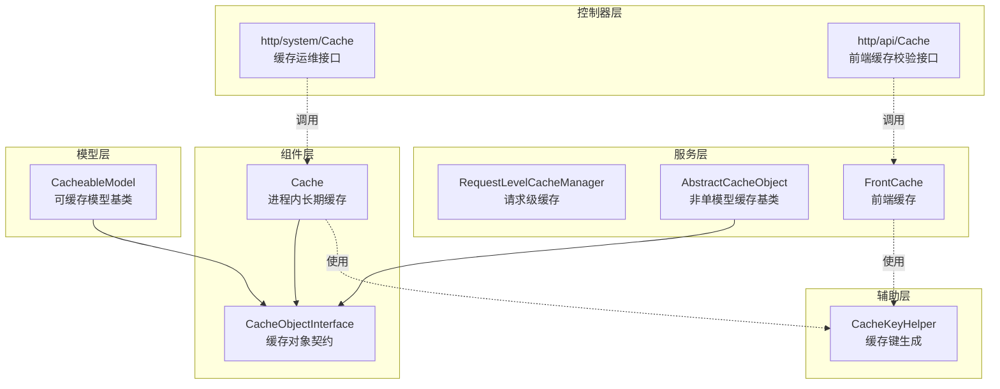
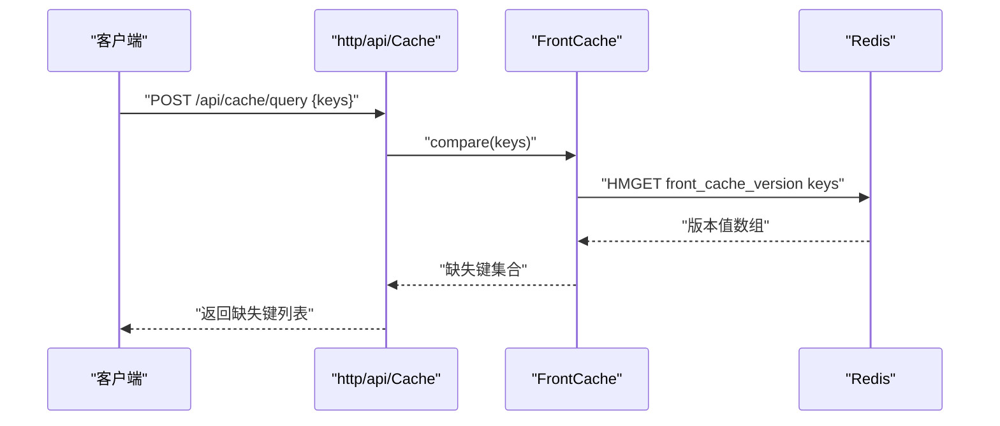
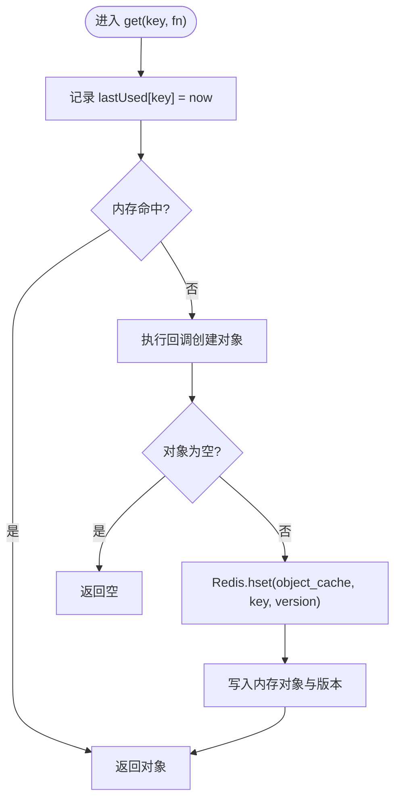
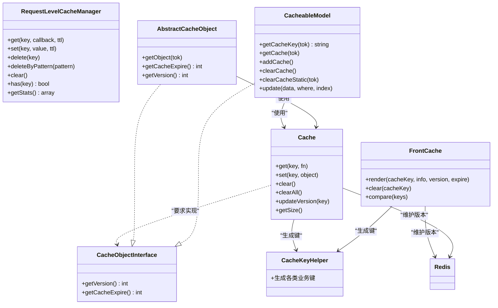

# 缓存系统组件

<cite>
**本文引用的文件**
- [Cache.php](file://process/src/components/Cache.php)
- [CacheObjectInterface.php](file://process/src/components/CacheObjectInterface.php)
- [CacheKeyHelper.php](file://process/src/helpers/CacheKeyHelper.php)
- [RequestLevelCacheManager.php](file://process/src/services/cache/RequestLevelCacheManager.php)
- [AbstractCacheObject.php](file://process/src/services/cache/AbstractCacheObject.php)
- [CacheableModel.php](file://process/src/models/CacheableModel.php)
- [FrontCache.php](file://process/src/services/FrontCache.php)
- [http/system/Cache.php](file://process/src/http/system/Cache.php)
- [http/api/Cache.php](file://process/src/http/api/Cache.php)
</cite>

## 目录
1. [简介](#简介)
2. [项目结构](#项目结构)
3. [核心组件](#核心组件)
4. [架构总览](#架构总览)
5. [详细组件分析](#详细组件分析)
6. [依赖关系分析](#依赖关系分析)
7. [性能考量](#性能考量)
8. [故障排查指南](#故障排查指南)
9. [结论](#结论)
10. [附录](#附录)

## 简介
本文件系统性梳理仓库中的缓存体系，围绕 Cache 组件的设计与实现进行深入解析，涵盖缓存策略、缓存键生成、缓存失效机制；明确 CacheObjectInterface 的职责与实现约束；阐述 CacheKeyHelper 的键管理能力；并结合实际代码路径说明内存缓存、Redis 缓存与前端缓存的协同使用方式。同时给出缓存性能优化建议、缓存穿透防护思路与缓存一致性保障方法。

## 项目结构
缓存相关代码主要分布在以下模块：
- 组件层：Cache（进程内长期缓存）、CacheObjectInterface（缓存对象契约）
- 服务层：RequestLevelCacheManager（请求级缓存）、AbstractCacheObject（非单模型缓存基类）、FrontCache（前端缓存）
- 辅助层：CacheKeyHelper（统一键生成工具）
- 控制器层：http/system/Cache（缓存运维接口）、http/api/Cache（前端缓存校验接口）
- 模型层：CacheableModel（可缓存模型基类）

图表来源
- [Cache.php](file://process/src/components/Cache.php#L1-L136)
- [CacheObjectInterface.php](file://process/src/components/CacheObjectInterface.php#L1-L9)
- [RequestLevelCacheManager.php](file://process/src/services/cache/RequestLevelCacheManager.php#L1-L136)
- [AbstractCacheObject.php](file://process/src/services/cache/AbstractCacheObject.php#L1-L44)
- [FrontCache.php](file://process/src/services/FrontCache.php#L1-L39)
- [CacheKeyHelper.php](file://process/src/helpers/CacheKeyHelper.php#L1-L636)
- [http/system/Cache.php](file://process/src/http/system/Cache.php#L1-L53)
- [http/api/Cache.php](file://process/src/http/api/Cache.php#L1-L20)
- [CacheableModel.php](file://process/src/models/CacheableModel.php#L1-L103)

章节来源
- [Cache.php](file://process/src/components/Cache.php#L1-L136)
- [CacheObjectInterface.php](file://process/src/components/CacheObjectInterface.php#L1-L9)
- [CacheKeyHelper.php](file://process/src/helpers/CacheKeyHelper.php#L1-L636)
- [RequestLevelCacheManager.php](file://process/src/services/cache/RequestLevelCacheManager.php#L1-L136)
- [AbstractCacheObject.php](file://process/src/services/cache/AbstractCacheObject.php#L1-L44)
- [CacheableModel.php](file://process/src/models/CacheableModel.php#L1-L103)
- [FrontCache.php](file://process/src/services/FrontCache.php#L1-L39)
- [http/system/Cache.php](file://process/src/http/system/Cache.php#L1-L53)
- [http/api/Cache.php](file://process/src/http/api/Cache.php#L1-L20)

## 核心组件
- Cache（进程内长期缓存）：基于内存数组维护对象实例，配合 Redis 维护版本号，实现跨进程一致性与定期清理。
- CacheObjectInterface（缓存对象契约）：规定缓存对象必须提供版本号与缓存过期时间，用于一致性判断与过期控制。
- CacheKeyHelper（缓存键生成）：集中管理各类业务键规则，避免硬编码与冲突。
- RequestLevelCacheManager（请求级缓存）：在单次请求生命周期内缓存数据，避免静态缓存导致的数据不一致。
- AbstractCacheObject（非单模型缓存基类）：面向多行/多表聚合数据的缓存封装，统一获取与版本控制。
- CacheableModel（可缓存模型基类）：面向单模型的缓存封装，提供按主键缓存与自动失效。
- FrontCache（前端缓存）：前端渲染数据的版本与过期控制，配合 http/api/Cache 实现前端缓存一致性校验。

章节来源
- [Cache.php](file://process/src/components/Cache.php#L1-L136)
- [CacheObjectInterface.php](file://process/src/components/CacheObjectInterface.php#L1-L9)
- [CacheKeyHelper.php](file://process/src/helpers/CacheKeyHelper.php#L1-L636)
- [RequestLevelCacheManager.php](file://process/src/services/cache/RequestLevelCacheManager.php#L1-L136)
- [AbstractCacheObject.php](file://process/src/services/cache/AbstractCacheObject.php#L1-L44)
- [CacheableModel.php](file://process/src/models/CacheableModel.php#L1-L103)
- [FrontCache.php](file://process/src/services/FrontCache.php#L1-L39)

## 架构总览
缓存系统采用“进程内对象缓存 + Redis 版本协调 + 前端版本校验”的三层协同架构：
- 进程内缓存：以内存数组保存对象实例，减少重复计算与数据库访问。
- Redis 协调：以哈希表维护各缓存键的版本号，跨进程广播更新，确保多进程一致性。
- 前端缓存：以哈希表维护前端渲染数据版本，前端携带版本号请求后端，后端返回缺失键集合，前端据此刷新。

图表来源
- [http/api/Cache.php](file://process/src/http/api/Cache.php#L1-L20)
- [FrontCache.php](file://process/src/services/FrontCache.php#L1-L39)

章节来源
- [http/api/Cache.php](file://process/src/http/api/Cache.php#L1-L20)
- [FrontCache.php](file://process/src/services/FrontCache.php#L1-L39)

## 详细组件分析

### Cache 组件（进程内长期缓存）
- 设计要点
  - 单例模式，进程内维护对象字典与最近使用时间表。
  - 通过 Redis 哈希表维护各缓存键的版本号，实现跨进程一致性。
  - 定时任务从 Redis 拉取版本并清理过期对象；另定时清理内存中长时间未使用的对象。
- 关键流程
  - get(key, fn)：命中则直接返回；未命中则执行回调创建对象，写入 Redis 版本与内存缓存。
  - clear()：遍历 lastUsed，依据对象的 getCacheExpire() 判断是否超时清理。
  - getVersionFromRedis()：通过互斥锁仅允许单进程从 Redis 读取版本并落盘共享内存，其他进程从共享内存读取，再对比版本号清理过期对象。
  - updateVersion(key)/clearAll()：主动失效或清空缓存。
- 复杂度与性能
  - get/clear/updateVersion 均为 O(n)（n 为当前缓存对象数），但通常缓存规模可控。
  - 定时任务频率较低，对性能影响有限。
- 错误处理
  - 共享内存文件读写失败时回退至 Redis；版本为空时跳过清理。
  - 互斥锁失败时回退到本地文件读取，避免阻塞。

图表来源
- [Cache.php](file://process/src/components/Cache.php#L42-L61)

章节来源
- [Cache.php](file://process/src/components/Cache.php#L1-L136)

### CacheObjectInterface（缓存对象契约）
- 职责
  - 规定缓存对象必须提供版本号与缓存过期时间，用于一致性判断与过期控制。
- 实现要求
  - getVersion() 返回整型版本号，建议使用时间戳或数据变更时间。
  - getCacheExpire() 返回整型过期秒数，建议根据数据更新频率与一致性需求设定。

章节来源
- [CacheObjectInterface.php](file://process/src/components/CacheObjectInterface.php#L1-L9)

### CacheKeyHelper（缓存键生成）
- 职责
  - 统一生成各类业务键，避免硬编码与冲突，提升可维护性。
- 使用场景
  - 用户会话、验证码、统计指标、报表权限、开放接口 token、AIGC 相关、定时任务锁等。
- 设计特点
  - 方法命名清晰，参数语义明确，便于团队协作与复用。
  - 部分键包含时间维度（如短信/邮件验证码按小时维度），降低键数量峰值。

章节来源
- [CacheKeyHelper.php](file://process/src/helpers/CacheKeyHelper.php#L1-L636)

### RequestLevelCacheManager（请求级缓存）
- 职责
  - 在单次请求生命周期内缓存数据，避免静态缓存导致的数据不一致。
- 关键能力
  - get(key, callback, ttl)：支持 TTL 过期与回调加载。
  - set/delete/deleteByPattern/clear/has/getStats：提供完整的缓存操作与统计。
- 性能与一致性
  - 仅限请求内有效，避免跨请求污染；适合高频读取且对一致性要求较高的场景。

章节来源
- [RequestLevelCacheManager.php](file://process/src/services/cache/RequestLevelCacheManager.php#L1-L136)

### AbstractCacheObject（非单模型缓存基类）
- 职责
  - 面向多行/多表聚合数据的缓存封装，统一获取与版本控制。
- 关键点
  - getObject(tok) 通过 cache()->get(key, factory) 统一走 Cache 组件。
  - getCacheExpire() 默认 3600 秒，可按子类覆盖。
  - 子类需实现 getCacheKey(tok) 与 getData(tok)。

章节来源
- [AbstractCacheObject.php](file://process/src/services/cache/AbstractCacheObject.php#L1-L44)

### CacheableModel（可缓存模型基类）
- 职责
  - 面向单模型的缓存封装，提供按主键缓存与自动失效。
- 关键点
  - getCacheKey(tok) 默认使用表名+主键组合。
  - getCache(tok) 通过 cache()->get(key, fn) 从数据库加载并缓存。
  - afterSave()/beforeSave() 配合 clearCache()/clearCacheStatic() 主动失效。
  - update() 自动计算受影响键并失效。
- 适用场景
  - 后台数据、配置类、字典类等更新频率低、读多写少的模型。

章节来源
- [CacheableModel.php](file://process/src/models/CacheableModel.php#L1-L103)

### FrontCache（前端缓存）
- 职责
  - 前端渲染数据的版本与过期控制，配合 http/api/Cache 实现前端缓存一致性校验。
- 关键点
  - render(cacheKey, info, version, expire)：写入 Redis 哈希表并返回包含缓存元信息的结构。
  - clear(cacheKey)：删除指定键。
  - compare(keys)：批量比较前端传来的键与版本，返回缺失键集合。
- 与 http/api/Cache 的配合
  - 前端携带 keys={key:version} 调用 /api/cache/query，后端返回缺失键列表，前端据此拉取完整数据并更新版本。

章节来源
- [FrontCache.php](file://process/src/services/FrontCache.php#L1-L39)
- [http/api/Cache.php](file://process/src/http/api/Cache.php#L1-L20)

### http/system/Cache（缓存运维接口）
- 功能
  - list/detail/clearOne/clearAll/reload/size：提供缓存列表、详情、单键失效、全量清理、部署重载与缓存大小查询。
- 使用场景
  - 运维与调试，快速定位缓存状态与触发失效。

章节来源
- [http/system/Cache.php](file://process/src/http/system/Cache.php#L1-L53)

## 依赖关系分析
- Cache 依赖
  - CacheObjectInterface：要求缓存对象实现版本与过期。
  - CacheKeyHelper：生成缓存键。
  - Redis：维护 object_cache 哈希表与版本互斥锁。
- CacheableModel/AbstractCacheObject 依赖
  - Cache：统一的进程内缓存入口。
  - Redis：版本写入与读取。
- FrontCache 依赖
  - Redis：front_cache_version 哈希表。
  - CacheKeyHelper：生成前端缓存键（部分）。
- http/system/Cache 与 http/api/Cache
  - 分别面向运维与前端校验，均依赖底层缓存组件。

图表来源
- [Cache.php](file://process/src/components/Cache.php#L1-L136)
- [CacheObjectInterface.php](file://process/src/components/CacheObjectInterface.php#L1-L9)
- [CacheKeyHelper.php](file://process/src/helpers/CacheKeyHelper.php#L1-L636)
- [RequestLevelCacheManager.php](file://process/src/services/cache/RequestLevelCacheManager.php#L1-L136)
- [AbstractCacheObject.php](file://process/src/services/cache/AbstractCacheObject.php#L1-L44)
- [CacheableModel.php](file://process/src/models/CacheableModel.php#L1-L103)
- [FrontCache.php](file://process/src/services/FrontCache.php#L1-L39)

章节来源
- [Cache.php](file://process/src/components/Cache.php#L1-L136)
- [CacheObjectInterface.php](file://process/src/components/CacheObjectInterface.php#L1-L9)
- [CacheKeyHelper.php](file://process/src/helpers/CacheKeyHelper.php#L1-L636)
- [RequestLevelCacheManager.php](file://process/src/services/cache/RequestLevelCacheManager.php#L1-L136)
- [AbstractCacheObject.php](file://process/src/services/cache/AbstractCacheObject.php#L1-L44)
- [CacheableModel.php](file://process/src/models/CacheableModel.php#L1-L103)
- [FrontCache.php](file://process/src/services/FrontCache.php#L1-L39)

## 性能考量
- 缓存命中率优化
  - 将热点数据放入 Cache（进程内 + Redis 版本），减少数据库访问。
  - 对于频繁读取且写入较少的数据，适当延长 getCacheExpire()。
- 内存与 CPU 平衡
  - 定时清理周期合理设置，避免频繁扫描；根据业务流量调整清理阈值。
  - 使用 RequestLevelCacheManager 缓解请求内重复计算压力。
- Redis 压力控制
  - object_cache/front_cache_version 使用哈希表，键数量过多时考虑按业务维度拆分或增加过期时间。
  - 共享内存读取失败回退逻辑避免阻塞，但仍需监控 Redis 延迟。
- 前端缓存一致性
  - 前端携带版本号请求，后端只返回缺失键，降低传输与渲染成本。

[本节为通用指导，无需列出具体文件来源]

## 故障排查指南
- 缓存不生效或异常
  - 检查 Cache::getVersionFromRedis 是否能正确从 Redis 读取版本并写入共享内存；确认互斥锁是否成功获取。
  - 使用 http/system/Cache 的 list/size/detail 接口查看当前缓存状态与对象数量。
- 数据不一致
  - 确认 CacheObjectInterface::getVersion() 是否随数据变化而递增；检查 Cache::updateVersion(key) 是否被调用。
  - 对于模型更新，确认 CacheableModel::afterSave()/update() 是否触发 clearCache()/clearCacheStatic()。
- 前端缓存错失
  - 使用 http/api/Cache::query 接口核对 keys 与版本，确认 FrontCache::render() 是否正确写入版本。
- 性能问题
  - 关注定时清理任务频率与内存占用；必要时缩短清理周期或降低缓存规模。

章节来源
- [http/system/Cache.php](file://process/src/http/system/Cache.php#L1-L53)
- [http/api/Cache.php](file://process/src/http/api/Cache.php#L1-L20)
- [Cache.php](file://process/src/components/Cache.php#L95-L135)
- [CacheableModel.php](file://process/src/models/CacheableModel.php#L66-L103)
- [FrontCache.php](file://process/src/services/FrontCache.php#L1-L39)

## 结论
该缓存体系通过“进程内对象缓存 + Redis 版本协调 + 前端版本校验”实现了高可用与强一致性的协同缓存方案。CacheObjectInterface 明确了缓存对象的契约，CacheKeyHelper 统一了键生成规范，Cache 与 FrontCache 分别承担后端与前端的缓存职责。结合 RequestLevelCacheManager 与 CacheableModel/AbstractCacheObject，能够覆盖从单模型到聚合数据的多种缓存场景，并提供完善的运维与一致性保障手段。

[本节为总结性内容，无需列出具体文件来源]

## 附录
- 缓存策略建议
  - 读多写少：优先使用 Cache + Redis 版本；对热点数据适当延长过期时间。
  - 写多读少：使用 CacheableModel/AbstractCacheObject，写入后主动失效。
  - 请求内高频读取：使用 RequestLevelCacheManager。
  - 前端渲染：使用 FrontCache + http/api/Cache 的一致性校验。
- 缓存键设计原则
  - 唯一性：键由业务域、实体标识与时间维度组成，避免冲突。
  - 可读性：方法命名直观，参数语义明确。
  - 可扩展：新增键时遵循既有命名与分组规则。
- 缓存穿透与一致性
  - 缓存穿透：对不存在的键也做缓存（如返回空对象并设置短 TTL），并结合布隆过滤器进一步防护。
  - 一致性：通过版本号与定时同步，确保多进程与多实例间的一致性。

[本节为通用指导，无需列出具体文件来源]