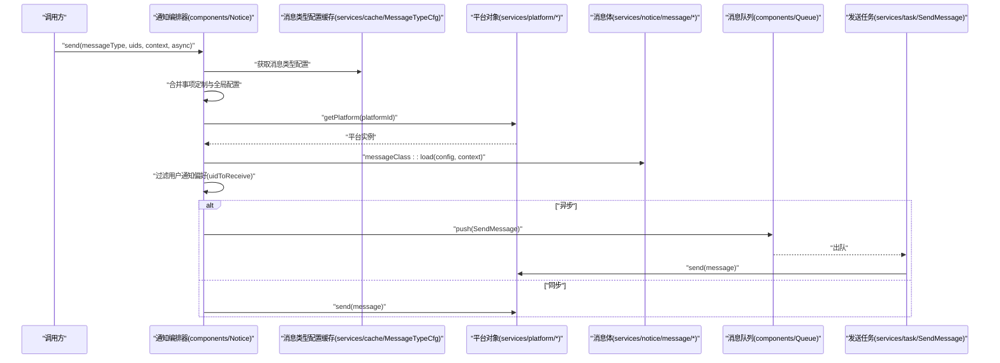
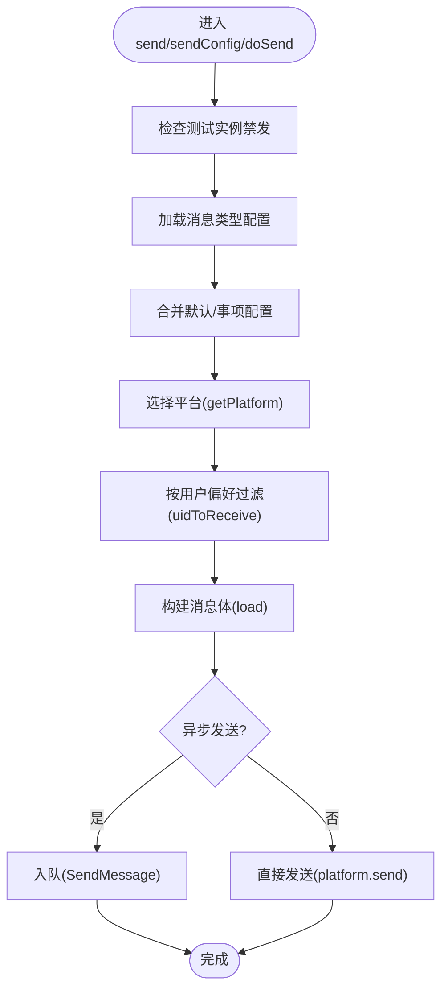
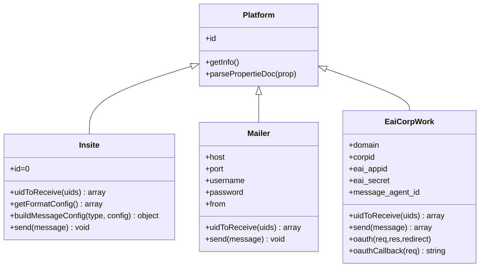
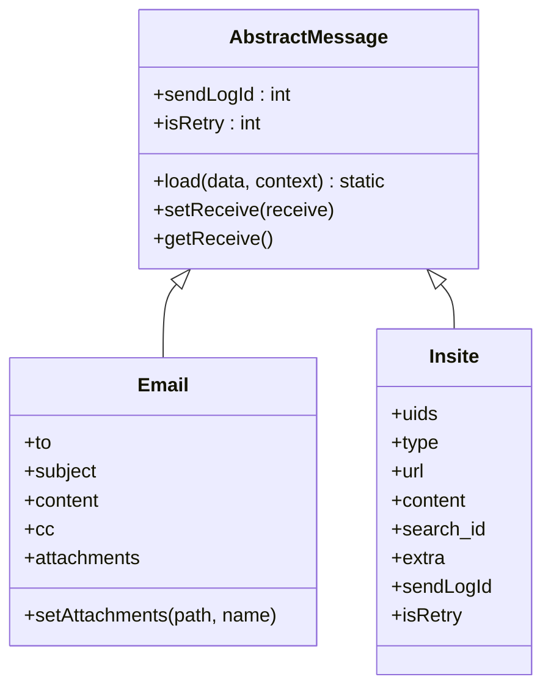
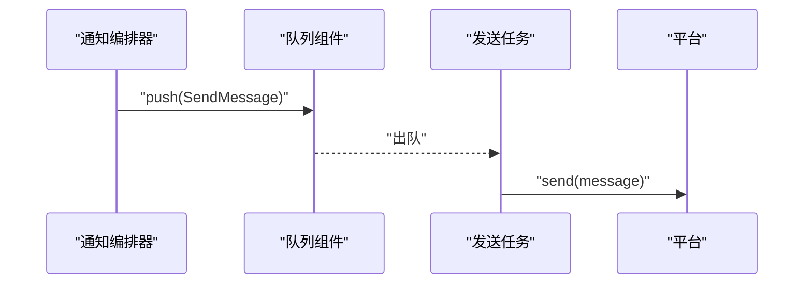
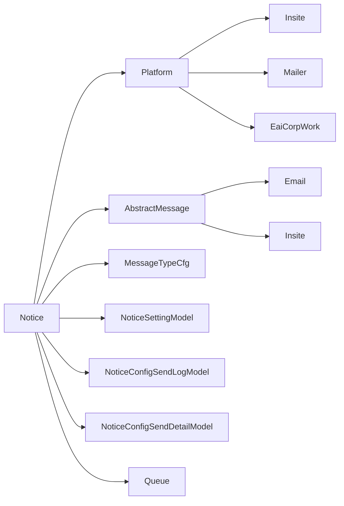

# 通知组件

<cite>
**本文引用的文件**
- [Notice.php](file://process/src/components/Notice.php)
- [components.php](file://process/src/config/components.php)
- [Platform.php](file://process/src/services/platform/Platform.php)
- [Insite.php](file://process/src/services/platform/Insite.php)
- [Mailer.php](file://process/src/services/platform/Mailer.php)
- [EaiCorpWork.php](file://process/src/services/platform/EaiCorpWork.php)
- [AbstractMessage.php](file://process/src/services/notice/message/AbstractMessage.php)
- [Email.php](file://process/src/services/notice/message/Email.php)
- [Insite.php（消息体）](file://process/src/services/notice/message/Insite.php)
- [SendMessage.php](file://process/src/services/task/SendMessage.php)
- [ThirdpartyPlatformModel.php](file://process/src/models/ThirdpartyPlatformModel.php)
- [NoticeSettingModel.php](file://process/src/models/NoticeSettingModel.php)
- [NoticeConfigSendLogModel.php](file://process/src/models/NoticeConfigSendLogModel.php)
- [NoticeConfigSendDetailModel.php](file://process/src/models/NoticeConfigSendDetailModel.php)
- [MessageTypeCfg.php](file://process/src/services/cache/MessageTypeCfg.php)
- [InteractionLog.php](file://process/src/services/InteractionLog.php)
- [InteractionLogModel.php](file://process/src/models/InteractionLogModel.php)
- [Queue.php](file://process/src/components/Queue.php)
</cite>

## 目录
1. [简介](#简介)
2. [项目结构](#项目结构)
3. [核心组件](#核心组件)
4. [架构总览](#架构总览)
5. [详细组件分析](#详细组件分析)
6. [依赖关系分析](#依赖关系分析)
7. [性能与可靠性](#性能与可靠性)
8. [故障排查指南](#故障排查指南)
9. [结论](#结论)
10. [附录：扩展与最佳实践](#附录扩展与最佳实践)

## 简介
本文件系统性梳理通知组件的设计与实现，覆盖消息发送、路由与处理全流程，深入解析通知消息类型（如站内消息、邮件、企业微信等）及消息体抽象模型，说明配置管理、消息模板与发送策略，并给出扩展通知渠道与消息队列集成的最佳实践。

## 项目结构
通知组件位于 process/src/components/Notice.php，围绕“平台-消息体-任务队列”三层组织，配合平台适配器（如站内、邮件、企业微信）、消息体抽象与后台配置缓存，形成可插拔的通知体系。

```mermaid
graph TB
subgraph "组件层"
Notice["components/Notice.php<br/>通知编排器"]
end
subgraph "平台适配层"
PlatBase["services/platform/Platform.php<br/>平台基类"]
InsiteP["services/platform/Insite.php<br/>站内消息平台"]
MailerP["services/platform/Mailer.php<br/>邮件平台"]
EaiP["services/platform/EaiCorpWork.php<br/>企业微信平台"]
end
subgraph "消息体层"
MsgAbs["services/notice/message/AbstractMessage.php<br/>消息体抽象"]
MsgEmail["services/notice/message/Email.php<br/>邮件消息体"]
MsgInsite["services/notice/message/Insite.php<br/>站内消息体"]
end
subgraph "任务与配置"
TaskSend["services/task/SendMessage.php<br/>发送任务"]
CfgCache["services/cache/MessageTypeCfg.php<br/>消息类型配置缓存"]
PlatModel["models/ThirdpartyPlatformModel.php<br/>第三方平台模型"]
SetModel["models/NoticeSettingModel.php<br/>用户通知偏好"]
LogModel["models/NoticeConfigSendLogModel.php<br/>发送日志"]
DetailModel["models/NoticeConfigSendDetailModel.php<br/>发送明细"]
InterLog["services/InteractionLog.php<br/>交互日志"]
InterModel["models/InteractionLogModel.php<br/>交互日志模型"]
QueueComp["components/Queue.php<br/>消息队列组件"]
end
Notice --> PlatBase
Notice --> CfgCache
Notice --> PlatModel
Notice --> SetModel
Notice --> LogModel
Notice --> DetailModel
Notice --> InterLog
Notice --> InterModel
Notice --> QueueComp
PlatBase --> InsiteP
PlatBase --> MailerP
PlatBase --> EaiP
MsgAbs --> MsgEmail
MsgAbs --> MsgInsite
TaskSend --> PlatModel
TaskSend --> InsiteP
TaskSend --> MailerP
TaskSend --> EaiP
```

**图表来源**
- [Notice.php](file://process/src/components/Notice.php#L1-L406)
- [Platform.php](file://process/src/services/platform/Platform.php#L1-L93)
- [Insite.php](file://process/src/services/platform/Insite.php#L1-L129)
- [Mailer.php](file://process/src/services/platform/Mailer.php#L1-L128)
- [EaiCorpWork.php](file://process/src/services/platform/EaiCorpWork.php#L1-L339)
- [AbstractMessage.php](file://process/src/services/notice/message/AbstractMessage.php#L1-L31)
- [Email.php](file://process/src/services/notice/message/Email.php#L1-L37)
- [Insite.php（消息体）](file://process/src/services/notice/message/Insite.php#L1-L51)
- [SendMessage.php](file://process/src/services/task/SendMessage.php#L1-L19)
- [MessageTypeCfg.php](file://process/src/services/cache/MessageTypeCfg.php)
- [ThirdpartyPlatformModel.php](file://process/src/models/ThirdpartyPlatformModel.php)
- [NoticeSettingModel.php](file://process/src/models/NoticeSettingModel.php)
- [NoticeConfigSendLogModel.php](file://process/src/models/NoticeConfigSendLogModel.php)
- [NoticeConfigSendDetailModel.php](file://process/src/models/NoticeConfigSendDetailModel.php)
- [InteractionLog.php](file://process/src/services/InteractionLog.php)
- [InteractionLogModel.php](file://process/src/models/InteractionLogModel.php)
- [Queue.php](file://process/src/components/Queue.php)

**章节来源**
- [Notice.php](file://process/src/components/Notice.php#L1-L406)
- [components.php](file://process/src/config/components.php#L1-L34)

## 核心组件
- 通知编排器（components/Notice.php）
  - 负责根据消息类型与上下文选择平台、过滤接收人、构建消息体、异步入队或直接发送。
  - 支持按“事项定制配置”与“全局配置”双路径合并发送策略；支持测试实例禁发、特定事项屏蔽等控制。
- 平台适配器（services/platform/*）
  - 平台基类定义通用接口与元信息解析；具体平台实现 uidToReceive、send、getFormatConfig 等。
  - 内置站内消息、邮件、企业微信等平台。
- 消息体抽象（services/notice/message/*）
  - 抽象消息体统一 load、setReceive、getReceive；具体消息体承载字段（如邮件主题、内容、附件；站内消息类型、URL、内容等）。
- 任务与队列（services/task/SendMessage.php、components/Queue.php）
  - 异步发送通过队列投递，消费者拉取任务并调用对应平台 send。
- 配置与模型（models/*、services/cache/MessageTypeCfg.php）
  - 第三方平台模型、用户通知偏好、发送日志与明细、消息类型配置缓存。

**章节来源**
- [Notice.php](file://process/src/components/Notice.php#L1-L406)
- [Platform.php](file://process/src/services/platform/Platform.php#L1-L93)
- [AbstractMessage.php](file://process/src/services/notice/message/AbstractMessage.php#L1-L31)
- [SendMessage.php](file://process/src/services/task/SendMessage.php#L1-L19)
- [components.php](file://process/src/config/components.php#L1-L34)

## 架构总览
通知系统采用“配置驱动 + 平台适配 + 消息体抽象 + 队列异步”的架构模式。发送流程分为两类：
- 面向用户UID集合的批量发送（send/sendConfig/doSend）
- 面向非UID接收方（如手机号、邮箱地址）的直发（sendType/sendSms/sendEmail）

**图表来源**
- [Notice.php](file://process/src/components/Notice.php#L1-L406)
- [MessageTypeCfg.php](file://process/src/services/cache/MessageTypeCfg.php)
- [Platform.php](file://process/src/services/platform/Platform.php#L1-L93)
- [AbstractMessage.php](file://process/src/services/notice/message/AbstractMessage.php#L1-L31)
- [SendMessage.php](file://process/src/services/task/SendMessage.php#L1-L19)
- [Queue.php](file://process/src/components/Queue.php)

## 详细组件分析

### 通知编排器（components/Notice）
职责与关键流程
- 测试实例禁发、事项ID白名单/黑名单控制、默认/事项两级配置合并、平台启用校验、用户偏好过滤、消息体构建、异步入队与同步发送。
- 提供 send/sendConfig/doSend/doSendRetry/sendType/sendSms/sendEmail/sendEmailCommon/sendEaiCommon 等对外接口。

**图表来源**
- [Notice.php](file://process/src/components/Notice.php#L1-L406)

**章节来源**
- [Notice.php](file://process/src/components/Notice.php#L1-L406)

### 平台适配器（services/platform/*）
- 平台基类（Platform.php）
  - 定义平台元信息解析、通用表单属性注解解析等。
- 站内消息（Insite.php）
  - 平台ID为0，直接使用UID作为接收人；写入站内消息表与读者表，联动其他平台推送，记录发送日志与明细。
- 邮件（Mailer.php）
  - 通过DSN构造传输，支持附件；从UID映射到邮箱地址。
- 企业微信（EaiCorpWork.php）
  - 实现OAuth、带access_token请求、消息类型配置、uidToReceive（工号映射）。

**图表来源**
- [Platform.php](file://process/src/services/platform/Platform.php#L1-L93)
- [Insite.php](file://process/src/services/platform/Insite.php#L1-L129)
- [Mailer.php](file://process/src/services/platform/Mailer.php#L1-L128)
- [EaiCorpWork.php](file://process/src/services/platform/EaiCorpWork.php#L1-L339)

**章节来源**
- [Platform.php](file://process/src/services/platform/Platform.php#L1-L93)
- [Insite.php](file://process/src/services/platform/Insite.php#L1-L129)
- [Mailer.php](file://process/src/services/platform/Mailer.php#L1-L128)
- [EaiCorpWork.php](file://process/src/services/platform/EaiCorpWork.php#L1-L339)

### 消息体抽象与具体消息（services/notice/message/*）
- 抽象消息体（AbstractMessage.php）
  - 统一 load 方法，基于上下文格式化字段；维护 sendLogId、isRetry 等通用属性。
- 邮件消息体（Email.php）
  - 字段包含主题、内容、抄送、附件；支持 setAttachments。
- 站内消息体（services/notice/message/Insite.php）
  - 字段包含 type、content、url、search_id、extra、sendLogId 等；支持 task/session 上下文注入。

**图表来源**
- [AbstractMessage.php](file://process/src/services/notice/message/AbstractMessage.php#L1-L31)
- [Email.php](file://process/src/services/notice/message/Email.php#L1-L37)
- [Insite.php（消息体）](file://process/src/services/notice/message/Insite.php#L1-L51)

**章节来源**
- [AbstractMessage.php](file://process/src/services/notice/message/AbstractMessage.php#L1-L31)
- [Email.php](file://process/src/services/notice/message/Email.php#L1-L37)
- [Insite.php（消息体）](file://process/src/services/notice/message/Insite.php#L1-L51)

### 发送任务与队列（services/task/SendMessage.php、components/Queue.php）
- 发送任务（SendMessage.php）
  - 根据 platformId 获取平台对象并执行 send。
- 队列组件（components/Queue.php）
  - 提供 push、消费等能力；Notice 在异步场景下将发送任务推送到队列。

**图表来源**
- [SendMessage.php](file://process/src/services/task/SendMessage.php#L1-L19)
- [Queue.php](file://process/src/components/Queue.php)

**章节来源**
- [SendMessage.php](file://process/src/services/task/SendMessage.php#L1-L19)
- [Queue.php](file://process/src/components/Queue.php)

### 配置与模型（models/*、services/cache/MessageTypeCfg.php）
- 第三方平台模型（ThirdpartyPlatformModel.php）
  - 缓存平台配置、启用状态、通知能力标识；提供平台对象获取。
- 用户通知偏好（NoticeSettingModel.php）
  - 过滤用户是否允许某平台通知。
- 发送日志与明细（NoticeConfigSendLogModel.php、NoticeConfigSendDetailModel.php）
  - 记录发送状态、统计数量、关联消息体序列化数据。
- 消息类型配置缓存（MessageTypeCfg.php）
  - 加载消息类型对应的平台配置列表。

**章节来源**
- [ThirdpartyPlatformModel.php](file://process/src/models/ThirdpartyPlatformModel.php)
- [NoticeSettingModel.php](file://process/src/models/NoticeSettingModel.php)
- [NoticeConfigSendLogModel.php](file://process/src/models/NoticeConfigSendLogModel.php)
- [NoticeConfigSendDetailModel.php](file://process/src/models/NoticeConfigSendDetailModel.php)
- [MessageTypeCfg.php](file://process/src/services/cache/MessageTypeCfg.php)

## 依赖关系分析
- 组件耦合
  - Notice 对平台、消息体、配置缓存、用户偏好、日志与队列均有依赖，但通过平台接口与消息体抽象降低耦合度。
- 外部依赖
  - 邮件平台依赖外部SMTP传输库；企业微信平台依赖远程HTTP接口与access_token管理。
- 循环依赖
  - 当前结构未见明显循环依赖；平台与消息体通过静态工厂方法与类名约定进行解耦。

**图表来源**
- [Notice.php](file://process/src/components/Notice.php#L1-L406)
- [Platform.php](file://process/src/services/platform/Platform.php#L1-L93)
- [AbstractMessage.php](file://process/src/services/notice/message/AbstractMessage.php#L1-L31)
- [MessageTypeCfg.php](file://process/src/services/cache/MessageTypeCfg.php)
- [NoticeSettingModel.php](file://process/src/models/NoticeSettingModel.php)
- [NoticeConfigSendLogModel.php](file://process/src/models/NoticeConfigSendLogModel.php)
- [NoticeConfigSendDetailModel.php](file://process/src/models/NoticeConfigSendDetailModel.php)
- [Queue.php](file://process/src/components/Queue.php)

**章节来源**
- [Notice.php](file://process/src/components/Notice.php#L1-L406)
- [Platform.php](file://process/src/services/platform/Platform.php#L1-L93)
- [AbstractMessage.php](file://process/src/services/notice/message/AbstractMessage.php#L1-L31)

## 性能与可靠性
- 异步发送
  - 异步场景通过队列解耦，避免阻塞主流程；消费者并发拉取任务提升吞吐。
- 日志与重试
  - 发送日志记录请求/响应与消息体序列化，便于重放与审计；平台侧可结合业务做幂等与重试策略。
- 过滤与限流
  - 用户偏好过滤减少无效发送；平台侧建议增加速率限制与退避策略。
- 配置缓存
  - 平台与消息类型配置缓存降低数据库压力，提高热路径性能。

[本节为通用建议，无需列出具体文件来源]

## 故障排查指南
- 常见问题定位
  - 无接收人：检查用户偏好过滤与 uidToReceive 映射；查看交互日志记录。
  - 平台不可用：确认平台启用标志与通知能力开关。
  - 邮件发送异常：核对DSN、凭据与附件路径；关注传输库返回错误。
  - 企业微信失败：检查access_token获取与过期处理、agent_id配置与回调参数。
- 关键日志点
  - 交互日志（InteractionLog/InteractionLogModel）记录请求/响应与状态。
  - 发送日志（NoticeConfigSendLogModel）记录发送状态与统计。
- 重试与回溯
  - 发送日志记录消息体序列化数据，可用于重放；平台侧可补充幂等键与去重。

**章节来源**
- [Notice.php](file://process/src/components/Notice.php#L1-L406)
- [InteractionLog.php](file://process/src/services/InteractionLog.php)
- [InteractionLogModel.php](file://process/src/models/InteractionLogModel.php)
- [NoticeConfigSendLogModel.php](file://process/src/models/NoticeConfigSendLogModel.php)

## 结论
通知组件通过“配置驱动 + 平台适配 + 消息体抽象 + 队列异步”的设计，实现了多渠道、可扩展、可观测的通知能力。平台与消息体均以抽象接口约束，便于新增渠道与消息类型；异步发送与日志体系保障了可靠性与可运维性。

[本节为总结性内容，无需列出具体文件来源]

## 附录：扩展与最佳实践

### 新增通知渠道（平台）
- 实现步骤
  - 新建平台类继承平台基类，实现 uidToReceive、send、getFormatConfig、getMessageClass 等方法。
  - 在平台模型中注册通知类型与能力标识，确保启用状态与通知开关生效。
  - 如需OAuth/支付能力，参考企业微信平台的实现方式。
- 最佳实践
  - 明确平台能力与分组，完善表单配置项与必填校验。
  - 平台内部实现幂等与重试策略，记录交互日志。
  - 对外接口统一返回标准化结构，便于上层统一处理。

**章节来源**
- [Platform.php](file://process/src/services/platform/Platform.php#L1-L93)
- [EaiCorpWork.php](file://process/src/services/platform/EaiCorpWork.php#L1-L339)
- [ThirdpartyPlatformModel.php](file://process/src/models/ThirdpartyPlatformModel.php)

### 新增消息类型（消息体）
- 实现步骤
  - 新建消息体类继承抽象消息体，实现 load、setReceive、getReceive。
  - 在平台类中声明 getMessageClass，确保编排器能正确构造消息体。
- 最佳实践
  - 字段尽量通过上下文格式化，保证模板复用与动态渲染。
  - 对敏感字段（如附件路径）进行校验与白名单控制。

**章节来源**
- [AbstractMessage.php](file://process/src/services/notice/message/AbstractMessage.php#L1-L31)
- [Email.php](file://process/src/services/notice/message/Email.php#L1-L37)
- [Insite.php（消息体）](file://process/src/services/notice/message/Insite.php#L1-L51)

### 模板与发送策略
- 模板变量
  - 通过上下文注入变量，消息体 load 时统一格式化。
- 发送策略
  - 支持默认配置与事项定制配置叠加；可按平台关闭或屏蔽。
  - 针对测试实例与特定事项ID可临时禁发，保障线上稳定。

**章节来源**
- [Notice.php](file://process/src/components/Notice.php#L1-L406)
- [MessageTypeCfg.php](file://process/src/services/cache/MessageTypeCfg.php)

### 队列集成与异步发送
- 入队时机
  - 异步发送时将发送任务推送到队列；同步发送直接调用平台 send。
- 消费与监控
  - 消费者拉取任务并调用平台 send；结合日志与指标监控发送成功率与耗时。

**章节来源**
- [Notice.php](file://process/src/components/Notice.php#L1-L406)
- [SendMessage.php](file://process/src/services/task/SendMessage.php#L1-L19)
- [Queue.php](file://process/src/components/Queue.php)