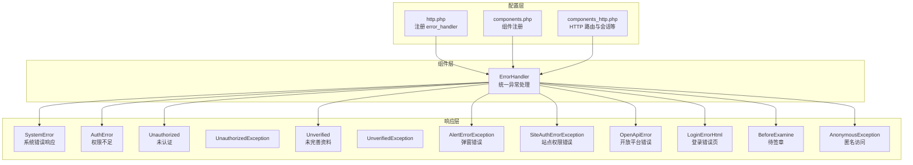
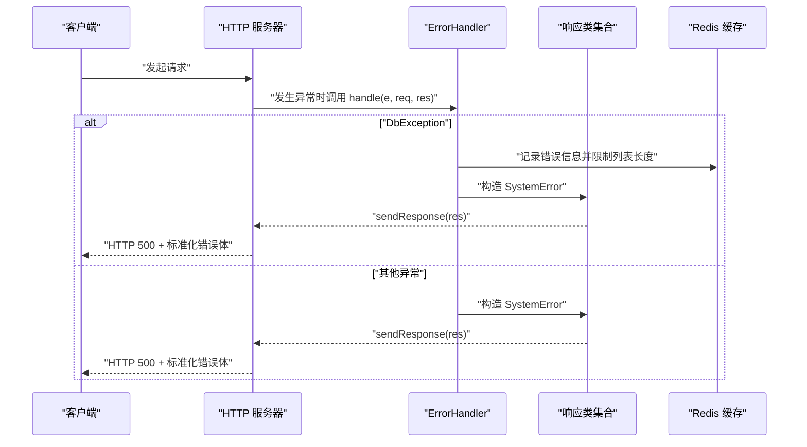
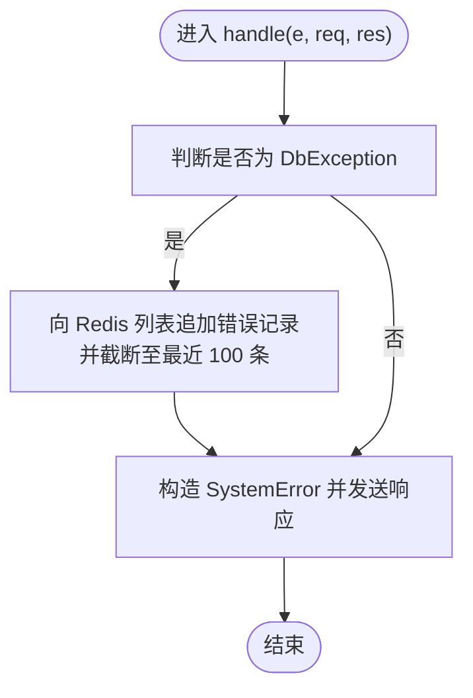
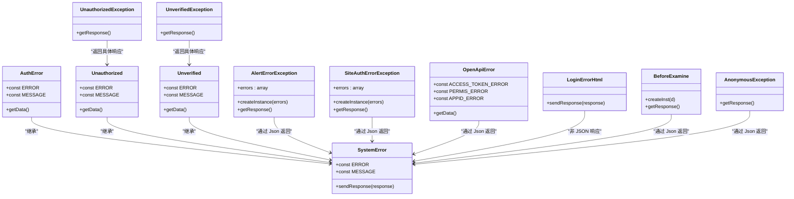
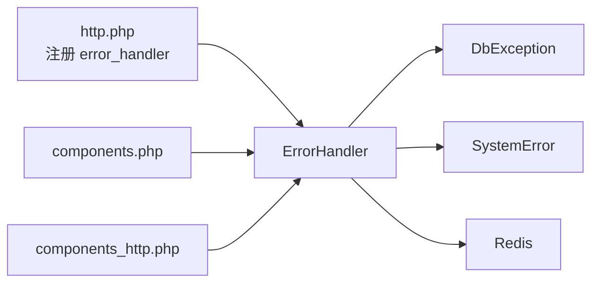

# 错误处理组件

<cite>
**本文引用的文件**
- [process/src/components/ErrorHandler.php](file://process/src/components/ErrorHandler.php)
- [process/src/config/http.php](file://process/src/config/http.php)
- [process/src/config/components.php](file://process/src/config/components.php)
- [process/src/config/components_http.php](file://process/src/config/components_http.php)
- [process/src/response/SystemError.php](file://process/vendor/lifei/zl/src/response/SystemError.php)
- [process/src/response/AuthError.php](file://process/src/response/AuthError.php)
- [process/src/response/Unauthorized.php](file://process/src/response/Unauthorized.php)
- [process/src/response/UnauthorizedException.php](file://process/src/response/UnauthorizedException.php)
- [process/src/response/Unverified.php](file://process/src/response/Unverified.php)
- [process/src/response/UnverifiedException.php](file://process/src/response/UnverifiedException.php)
- [process/src/response/AlertErrorException.php](file://process/src/response/AlertErrorException.php)
- [process/src/response/SiteAuthErrorException.php](file://process/src/response/SiteAuthErrorException.php)
- [process/src/response/OpenApiError.php](file://process/src/response/OpenApiError.php)
- [process/src/response/LoginErrorHtml.php](file://process/src/response/LoginErrorHtml.php)
- [process/src/response/BeforeExamine.php](file://process/src/response/BeforeExamine.php)
- [process/src/response/AnonymousException.php](file://process/src/response/AnonymousException.php)
</cite>

## 目录
1. [简介](#简介)
2. [项目结构](#项目结构)
3. [核心组件](#核心组件)
4. [架构总览](#架构总览)
5. [详细组件分析](#详细组件分析)
6. [依赖关系分析](#依赖关系分析)
7. [性能与可维护性](#性能与可维护性)
8. [故障排查指南](#故障排查指南)
9. [结论](#结论)
10. [附录：最佳实践与扩展建议](#附录最佳实践与扩展建议)

## 简介
本文件围绕错误处理组件进行系统化梳理，重点覆盖以下方面：
- ErrorHandler 的设计原理与实现机制：异常捕获、错误分类与处理策略
- 各类异常类型的定义与使用场景：如权限不足、未认证、未完善资料、弹窗错误、站点权限错误、开放平台错误、匿名访问等
- 中间件机制与错误响应格式化：如何在 HTTP 层统一拦截异常并输出标准化响应
- 日志与记录：数据库异常的 Redis 记录与截断策略
- 最佳实践与扩展：自定义异常类型、错误页面配置、错误响应格式化规范

## 项目结构
错误处理相关代码主要分布在如下位置：
- 组件层：ErrorHandler（统一异常处理）
- 配置层：http.php、components.php、components_http.php（注册错误处理器与组件）
- 响应层：各类业务错误响应类（AuthError、Unauthorized、Unverified、AlertErrorException、SiteAuthErrorException、OpenApiError、LoginErrorHtml 等）
- 外部依赖：SystemError（系统级错误响应基类）

图表来源
- [process/src/config/http.php](file://process/src/config/http.php#L1-L26)
- [process/src/config/components.php](file://process/src/config/components.php#L1-L34)
- [process/src/config/components_http.php](file://process/src/config/components_http.php#L1-L33)
- [process/src/components/ErrorHandler.php](file://process/src/components/ErrorHandler.php#L1-L26)
- [process/src/response/SystemError.php](file://process/vendor/lifei/zl/src/response/SystemError.php#L1-L22)
- [process/src/response/AuthError.php](file://process/src/response/AuthError.php#L1-L20)
- [process/src/response/Unauthorized.php](file://process/src/response/Unauthorized.php#L1-L29)
- [process/src/response/Unverified.php](file://process/src/response/Unverified.php#L1-L29)
- [process/src/response/AlertErrorException.php](file://process/src/response/AlertErrorException.php#L1-L27)
- [process/src/response/SiteAuthErrorException.php](file://process/src/response/SiteAuthErrorException.php#L1-L25)
- [process/src/response/OpenApiError.php](file://process/src/response/OpenApiError.php#L1-L28)
- [process/src/response/LoginErrorHtml.php](file://process/src/response/LoginErrorHtml.php#L1-L28)
- [process/src/response/BeforeExamine.php](file://process/src/response/BeforeExamine.php#L1-L28)
- [process/src/response/AnonymousException.php](file://process/src/response/AnonymousException.php#L1-L15)

章节来源
- [process/src/config/http.php](file://process/src/config/http.php#L1-L26)
- [process/src/config/components.php](file://process/src/config/components.php#L1-L34)
- [process/src/config/components_http.php](file://process/src/config/components_http.php#L1-L33)

## 核心组件
- ErrorHandler：统一异常处理入口，负责识别异常类型并选择对应的响应对象输出；对数据库异常进行 Redis 记录与截断。
- SystemError：系统级错误响应基类，固定错误码与消息，并设置 HTTP 500 状态。
- 各类业务错误响应类：按业务语义返回标准化 JSON 或重定向页面。

章节来源
- [process/src/components/ErrorHandler.php](file://process/src/components/ErrorHandler.php#L1-L26)
- [process/vendor/lifei/zl/src/response/SystemError.php](file://process/vendor/lifei/zl/src/response/SystemError.php#L1-L22)

## 架构总览
下图展示了从请求进入 HTTP 服务器到异常被捕获并输出响应的整体流程，以及 ErrorHandler 与各响应类之间的交互关系。

图表来源
- [process/src/components/ErrorHandler.php](file://process/src/components/ErrorHandler.php#L1-L26)
- [process/src/response/SystemError.php](file://process/vendor/lifei/zl/src/response/SystemError.php#L1-L22)

## 详细组件分析

### ErrorHandler 组件
- 职责
  - 捕获 Throwable 异常
  - 区分数据库异常（DbException）与其他异常
  - 对 DbException 进行 Redis 记录与截断，随后返回系统错误响应
  - 其他异常同样返回系统错误响应
- 关键行为
  - 数据库异常记录字段包含：错误信息、SQL、参数、堆栈
  - 使用固定 Redis 列表键名，保留最近 100 条
  - 统一返回 SystemError 并设置 HTTP 500

图表来源
- [process/src/components/ErrorHandler.php](file://process/src/components/ErrorHandler.php#L1-L26)

章节来源
- [process/src/components/ErrorHandler.php](file://process/src/components/ErrorHandler.php#L1-L26)

### 异常类型与响应类

#### 权限不足（AuthError）
- 场景：鉴权通过但无操作权限
- 表现：返回标准化 JSON，包含错误码、消息与数据

章节来源
- [process/src/response/AuthError.php](file://process/src/response/AuthError.php#L1-L20)

#### 未认证（Unauthorized / UnauthorizedException）
- 场景：用户未登录或令牌无效
- 表现：返回标准化 JSON，支持携带额外信息

章节来源
- [process/src/response/Unauthorized.php](file://process/src/response/Unauthorized.php#L1-L29)
- [process/src/response/UnauthorizedException.php](file://process/src/response/UnauthorizedException.php#L1-L15)

#### 未完善资料（Unverified / UnverifiedException）
- 场景：用户资料不完整导致无法继续
- 表现：返回标准化 JSON，可携带提示信息

章节来源
- [process/src/response/Unverified.php](file://process/src/response/Unverified.php#L1-L29)
- [process/src/response/UnverifiedException.php](file://process/src/response/UnverifiedException.php#L1-L9)

#### 弹窗错误（AlertErrorException）
- 场景：前端以弹窗形式展示的错误提示
- 表现：返回标准化 JSON，包含错误标识、消息与数据

章节来源
- [process/src/response/AlertErrorException.php](file://process/src/response/AlertErrorException.php#L1-L27)

#### 站点权限错误（SiteAuthErrorException）
- 场景：站点层面的权限不足
- 表现：返回标准化 JSON，支持默认或自定义错误信息

章节来源
- [process/src/response/SiteAuthErrorException.php](file://process/src/response/SiteAuthErrorException.php#L1-L25)

#### 开放平台错误（OpenApiError）
- 场景：开放平台接口调用失败（如 Token、权限、AppId）
- 表现：根据错误码映射消息，返回标准化 JSON

章节来源
- [process/src/response/OpenApiError.php](file://process/src/response/OpenApiError.php#L1-L28)

#### 登录错误页面（LoginErrorHtml）
- 场景：登录态异常或登录失败跳转到前端错误页
- 表现：构造参数并重定向到前端错误页

章节来源
- [process/src/response/LoginErrorHtml.php](file://process/src/response/LoginErrorHtml.php#L1-L28)

#### 待签章（BeforeExamine）
- 场景：业务前置条件（如签章）未满足
- 表现：返回标准化 JSON，携带业务数据

章节来源
- [process/src/response/BeforeExamine.php](file://process/src/response/BeforeExamine.php#L1-L28)

#### 匿名访问（AnonymousException）
- 场景：当前网络环境不允许访问
- 表现：返回标准化 JSON，包含错误标识与消息

章节来源
- [process/src/response/AnonymousException.php](file://process/src/response/AnonymousException.php#L1-L15)

### 类关系图（响应类）

图表来源
- [process/vendor/lifei/zl/src/response/SystemError.php](file://process/vendor/lifei/zl/src/response/SystemError.php#L1-L22)
- [process/src/response/AuthError.php](file://process/src/response/AuthError.php#L1-L20)
- [process/src/response/Unauthorized.php](file://process/src/response/Unauthorized.php#L1-L29)
- [process/src/response/Unverified.php](file://process/src/response/Unverified.php#L1-L29)
- [process/src/response/AlertErrorException.php](file://process/src/response/AlertErrorException.php#L1-L27)
- [process/src/response/SiteAuthErrorException.php](file://process/src/response/SiteAuthErrorException.php#L1-L25)
- [process/src/response/OpenApiError.php](file://process/src/response/OpenApiError.php#L1-L28)
- [process/src/response/LoginErrorHtml.php](file://process/src/response/LoginErrorHtml.php#L1-L28)
- [process/src/response/BeforeExamine.php](file://process/src/response/BeforeExamine.php#L1-L28)
- [process/src/response/AnonymousException.php](file://process/src/response/AnonymousException.php#L1-L15)
- [process/src/response/UnauthorizedException.php](file://process/src/response/UnauthorizedException.php#L1-L15)
- [process/src/response/UnverifiedException.php](file://process/src/response/UnverifiedException.php#L1-L9)

## 依赖关系分析
- ErrorHandler 依赖
  - DbException：用于识别数据库异常并记录
  - SystemError：用于统一返回系统错误
  - Redis：用于持久化最近数据库错误
- 配置层
  - http.php 中注册 error_handler，指向 ErrorHandler
  - components.php 与 components_http.php 提供通用组件与路由配置

图表来源
- [process/src/config/http.php](file://process/src/config/http.php#L1-L26)
- [process/src/config/components.php](file://process/src/config/components.php#L1-L34)
- [process/src/config/components_http.php](file://process/src/config/components_http.php#L1-L33)
- [process/src/components/ErrorHandler.php](file://process/src/components/ErrorHandler.php#L1-L26)

章节来源
- [process/src/config/http.php](file://process/src/config/http.php#L1-L26)
- [process/src/config/components.php](file://process/src/config/components.php#L1-L34)
- [process/src/config/components_http.php](file://process/src/config/components_http.php#L1-L33)

## 性能与可维护性
- Redis 记录策略
  - 使用列表追加与截断，避免无限增长，建议结合监控指标观察错误频率
- 响应一致性
  - 所有错误均返回标准化 JSON 结构，便于前端统一处理
- 可扩展性
  - 新增异常类型只需新增响应类并按需在 ErrorHandler 中区分处理
- 日志与可观测性
  - 建议在生产环境同时输出应用日志与 Redis 错误队列，以便多维度定位问题

[本节为通用建议，无需特定文件引用]

## 故障排查指南
- 数据库异常未记录
  - 检查 DbException 是否被正确抛出
  - 检查 Redis 配置与连接状态
  - 检查 Redis 列表键名与长度限制逻辑
- 统一错误响应未生效
  - 确认 http.php 中已注册 error_handler
  - 确认异常未被业务层提前捕获而未上抛
- 权限不足或未认证响应不符合预期
  - 核对 AuthError、Unauthorized、Unverified 的使用场景与构造参数
- 登录错误页面未跳转
  - 检查 LoginErrorHtml 的参数构造与重定向 URL

章节来源
- [process/src/components/ErrorHandler.php](file://process/src/components/ErrorHandler.php#L1-L26)
- [process/src/config/http.php](file://process/src/config/http.php#L1-L26)
- [process/src/response/LoginErrorHtml.php](file://process/src/response/LoginErrorHtml.php#L1-L28)

## 结论
ErrorHandler 作为统一异常处理入口，实现了对数据库异常的特殊记录与统一响应，并通过丰富的业务错误响应类覆盖了常见的权限、认证、资料完善、弹窗提示、开放平台与登录错误等场景。配合配置层的注册机制，形成了清晰、可扩展且易于维护的错误处理体系。

[本节为总结性内容，无需特定文件引用]

## 附录：最佳实践与扩展建议

- 最佳实践
  - 明确异常分类：业务异常与系统异常分离，分别走不同响应路径
  - 标准化错误体：统一字段（错误码、消息、数据），便于前端一致处理
  - 保护敏感信息：避免在错误体中泄露 SQL、参数等敏感细节
  - 分级告警：对高频错误建立告警与降采样策略

- 自定义异常类型
  - 新增响应类：参考现有响应类的结构与命名约定
  - 在 ErrorHandler 中增加类型判断分支，决定记录与响应策略
  - 如涉及数据库操作，确保异常可被 DbException 捕获并记录

- 错误页面配置
  - 登录错误页：通过 LoginErrorHtml 构造参数并重定向
  - 其他页面：可在响应类中返回 HTML 或重定向到静态页面

- 错误日志与记录
  - 数据库异常：利用 Redis 列表记录最近错误，定期巡检
  - 应用日志：补充业务日志与审计日志，形成闭环

[本节为通用建议，无需特定文件引用]