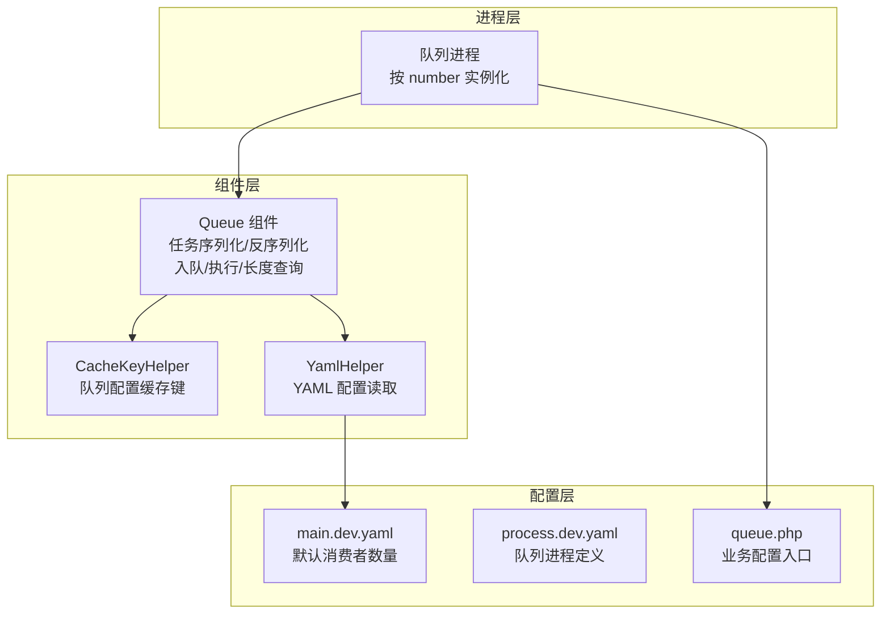
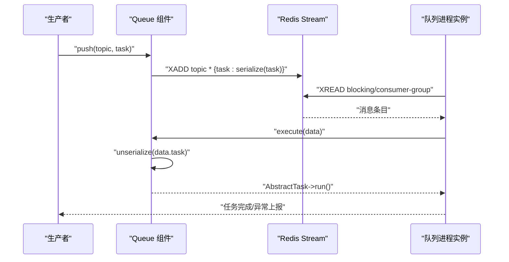
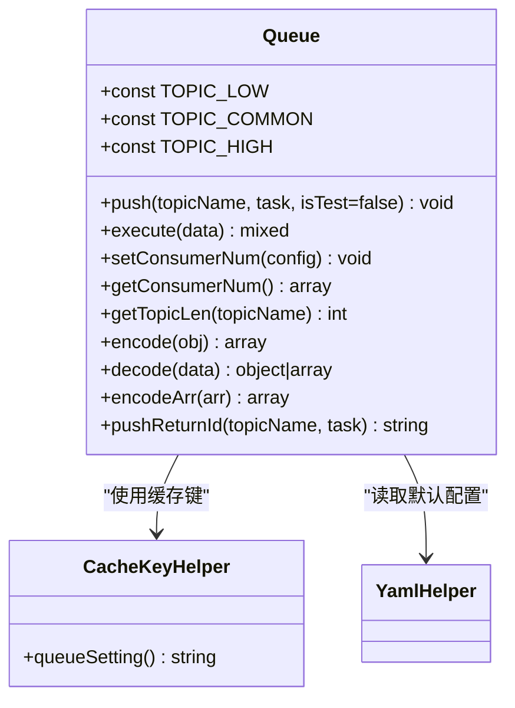
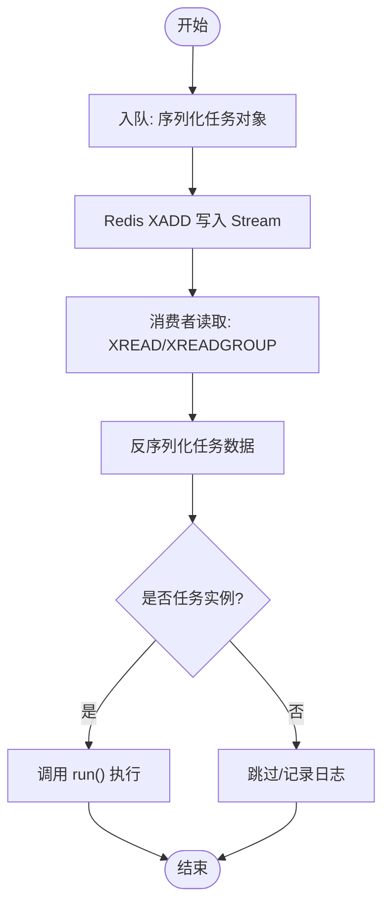
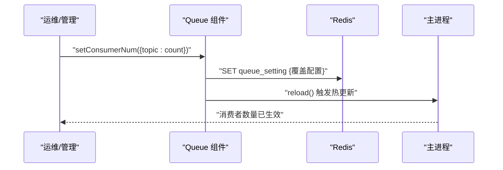
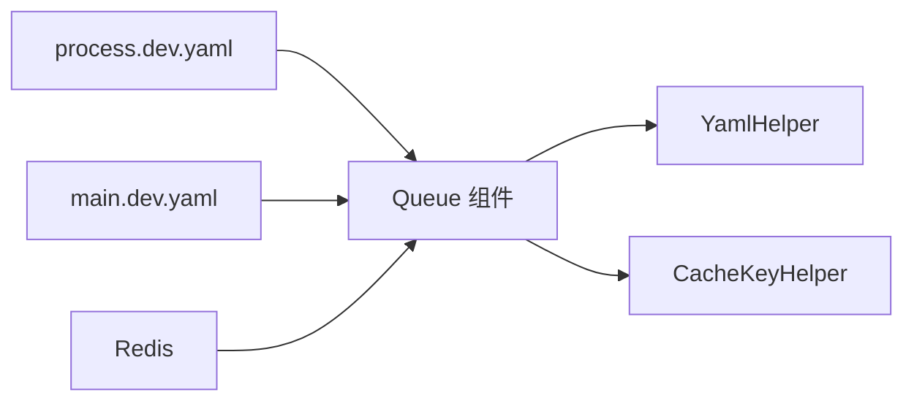

# 队列系统组件

<cite>
**本文引用的文件**
- [Queue.php](file://process/src/components/Queue.php)
- [main.dev.yaml](file://process/src/config/main.dev.yaml)
- [process.dev.yaml](file://process/src/config/process.dev.yaml)
- [queue.php](file://process/src/config/queue.php)
- [YamlHelper.php](file://process/src/helpers/YamlHelper.php)
- [CacheKeyHelper.php](file://process/src/helpers/CacheKeyHelper.php)
</cite>

## 目录
1. [简介](#简介)
2. [项目结构](#项目结构)
3. [核心组件](#核心组件)
4. [架构总览](#架构总览)
5. [详细组件分析](#详细组件分析)
6. [依赖关系分析](#依赖关系分析)
7. [性能考虑](#性能考虑)
8. [故障排查指南](#故障排查指南)
9. [结论](#结论)
10. [附录](#附录)

## 简介
本文件围绕队列系统组件进行系统化说明，重点覆盖以下方面：
- 队列设计与实现：任务模型抽象、任务序列化机制、任务入队与执行流程
- 任务队列管理：主题分类（高/中/低优先级）、队列长度查询、任务持久化存储
- 消费者注册与动态配置：消费者数量配置、运行时热更新
- 可靠性保障：任务重试、死信队列、任务监控与可观测性
- 性能优化：优先级设置、批量处理、并发与资源分配
- 调优建议：基于配置文件与运行时参数的参数含义与调优方法

## 项目结构
队列系统由“组件层 + 配置层 + 进程层”构成：
- 组件层：队列组件负责任务序列化、入队、出队执行、消费者配置读取与写入
- 配置层：YAML 提供默认消费者数量；Redis 缓存提供运行时覆盖配置
- 进程层：通过进程配置文件声明队列进程实例数量与业务配置文件路径

图表来源
- [Queue.php](file://process/src/components/Queue.php#L1-L173)
- [main.dev.yaml](file://process/src/config/main.dev.yaml#L58-L65)
- [process.dev.yaml](file://process/src/config/process.dev.yaml#L54-L62)
- [queue.php](file://process/src/config/queue.php#L1-L13)
- [YamlHelper.php](file://process/src/helpers/YamlHelper.php#L1-L8)
- [CacheKeyHelper.php](file://process/src/helpers/CacheKeyHelper.php#L312-L316)

章节来源
- [Queue.php](file://process/src/components/Queue.php#L1-L173)
- [main.dev.yaml](file://process/src/config/main.dev.yaml#L58-L65)
- [process.dev.yaml](file://process/src/config/process.dev.yaml#L54-L62)
- [queue.php](file://process/src/config/queue.php#L1-L13)
- [YamlHelper.php](file://process/src/helpers/YamlHelper.php#L1-L8)
- [CacheKeyHelper.php](file://process/src/helpers/CacheKeyHelper.php#L312-L316)

## 核心组件
- 队列组件（Queue）
  - 任务入队：向 Redis Stream 写入任务字段，支持高/中/低主题
  - 任务执行：从 Redis Stream 读取任务，反序列化为具体任务对象并调用 run
  - 消费者配置：读取 YAML 默认配置与 Redis 运行时覆盖配置，支持热更新
  - 队列长度：查询指定主题的队列长度
  - 任务序列化：自定义 encode/decode 支持复杂对象与数组的递归序列化
- 配置组件
  - YamlHelper：封装 YAML 读取能力
  - CacheKeyHelper：提供队列配置缓存键常量
- 进程配置
  - main.dev.yaml：定义默认消费者数量（高/中/低）
  - process.dev.yaml：声明队列进程类、实例数量与业务配置文件路径
  - queue.php：作为业务配置入口，返回组件与默认配置

章节来源
- [Queue.php](file://process/src/components/Queue.php#L20-L40)
- [Queue.php](file://process/src/components/Queue.php#L42-L60)
- [Queue.php](file://process/src/components/Queue.php#L62-L67)
- [Queue.php](file://process/src/components/Queue.php#L84-L165)
- [main.dev.yaml](file://process/src/config/main.dev.yaml#L58-L65)
- [process.dev.yaml](file://process/src/config/process.dev.yaml#L54-L62)
- [queue.php](file://process/src/config/queue.php#L1-L13)
- [YamlHelper.php](file://process/src/helpers/YamlHelper.php#L1-L8)
- [CacheKeyHelper.php](file://process/src/helpers/CacheKeyHelper.php#L312-L316)

## 架构总览
队列系统采用“生产者-消费者-存储”三层协作模式：
- 生产者：业务模块将任务对象推送到指定主题
- 队列存储：Redis Stream 作为消息存储介质
- 消费者：队列进程实例从 Redis Stream 读取并执行任务
- 配置驱动：YAML 默认配置 + Redis 运行时覆盖配置决定消费者数量

图表来源
- [Queue.php](file://process/src/components/Queue.php#L26-L40)
- [process.dev.yaml](file://process/src/config/process.dev.yaml#L54-L62)
- [main.dev.yaml](file://process/src/config/main.dev.yaml#L58-L65)

## 详细组件分析

### 队列组件（Queue）类图

图表来源
- [Queue.php](file://process/src/components/Queue.php#L20-L173)
- [CacheKeyHelper.php](file://process/src/helpers/CacheKeyHelper.php#L312-L316)
- [YamlHelper.php](file://process/src/helpers/YamlHelper.php#L1-L8)

章节来源
- [Queue.php](file://process/src/components/Queue.php#L20-L173)
- [CacheKeyHelper.php](file://process/src/helpers/CacheKeyHelper.php#L312-L316)
- [YamlHelper.php](file://process/src/helpers/YamlHelper.php#L1-L8)

### 任务序列化与反序列化流程
- 入队序列化
  - 使用 PHP 序列化将任务对象写入 Redis Stream 字段
  - 支持复杂对象与数组的递归序列化
- 出队反序列化
  - 从 Redis Stream 读取后进行反序列化
  - 若反序列化结果为任务抽象类实例，则调用 run 执行

图表来源
- [Queue.php](file://process/src/components/Queue.php#L26-L40)
- [Queue.php](file://process/src/components/Queue.php#L84-L165)

章节来源
- [Queue.php](file://process/src/components/Queue.php#L26-L40)
- [Queue.php](file://process/src/components/Queue.php#L84-L165)

### 消费者注册与动态配置
- 默认消费者数量来源于 YAML 配置
- 运行时可通过 setConsumerNum 写入 Redis 缓存键，触发主进程 reload 生效
- getConsumerNum 合并默认配置与 Redis 覆盖配置

图表来源
- [Queue.php](file://process/src/components/Queue.php#L42-L48)
- [CacheKeyHelper.php](file://process/src/helpers/CacheKeyHelper.php#L312-L316)
- [main.dev.yaml](file://process/src/config/main.dev.yaml#L58-L65)

章节来源
- [Queue.php](file://process/src/components/Queue.php#L42-L60)
- [CacheKeyHelper.php](file://process/src/helpers/CacheKeyHelper.php#L312-L316)
- [main.dev.yaml](file://process/src/config/main.dev.yaml#L58-L65)

### 队列长度查询与监控
- getTopicLen 通过 Redis XLEN 查询指定主题队列长度
- 结合业务监控可实现队列积压告警与容量规划

章节来源
- [Queue.php](file://process/src/components/Queue.php#L62-L67)

### 队列进程与实例化
- process.dev.yaml 中声明队列进程类、实例数量与业务配置文件路径
- 队列进程按 number 实例化，每个实例从 Redis Stream 拉取消息并执行

章节来源
- [process.dev.yaml](file://process/src/config/process.dev.yaml#L54-L62)

## 依赖关系分析
- 组件耦合
  - Queue 依赖 YamlHelper 读取默认配置
  - Queue 依赖 CacheKeyHelper 生成队列配置缓存键
  - 进程配置文件 process.dev.yaml 决定队列进程实例数量
- 外部依赖
  - Redis：Stream 存储与读取
  - 主进程：reload 触发运行时配置生效

图表来源
- [Queue.php](file://process/src/components/Queue.php#L42-L60)
- [process.dev.yaml](file://process/src/config/process.dev.yaml#L54-L62)
- [main.dev.yaml](file://process/src/config/main.dev.yaml#L58-L65)
- [YamlHelper.php](file://process/src/helpers/YamlHelper.php#L1-L8)
- [CacheKeyHelper.php](file://process/src/helpers/CacheKeyHelper.php#L312-L316)

章节来源
- [Queue.php](file://process/src/components/Queue.php#L42-L60)
- [process.dev.yaml](file://process/src/config/process.dev.yaml#L54-L62)
- [main.dev.yaml](file://process/src/config/main.dev.yaml#L58-L65)
- [YamlHelper.php](file://process/src/helpers/YamlHelper.php#L1-L8)
- [CacheKeyHelper.php](file://process/src/helpers/CacheKeyHelper.php#L312-L316)

## 性能考虑
- 任务序列化选择
  - 当前使用 PHP 序列化，具备更高的序列化效率与兼容性
  - 如需跨语言或更清晰的数据格式，可评估 JSON 序列化替代方案（注释中已有对比思路）
- 并发与消费者数量
  - 通过 YAML 的默认消费者数量与 Redis 覆盖配置共同决定
  - 建议根据任务耗时与 CPU 核心数合理设置，避免过度竞争
- 队列主题与优先级
  - 高/中/低主题用于区分任务优先级，结合消费者数量分配实现差异化处理
- 批量处理
  - Redis Stream 支持 XREAD 分批读取，建议在消费者侧按批处理以降低网络与上下文切换开销
- 监控与告警
  - 使用 getTopicLen 监控队列长度，结合阈值告警与扩容策略

章节来源
- [Queue.php](file://process/src/components/Queue.php#L26-L40)
- [Queue.php](file://process/src/components/Queue.php#L62-L67)
- [main.dev.yaml](file://process/src/config/main.dev.yaml#L58-L65)
- [process.dev.yaml](file://process/src/config/process.dev.yaml#L54-L62)

## 故障排查指南
- 任务无法反序列化或类不存在
  - 现象：执行阶段抛出类未找到或反序列化失败
  - 排查：确认任务类在消费者节点可用；检查序列化对象的构造函数参数是否满足默认值要求
- 消费者数量未生效
  - 现象：调整运行时配置后消费者数量不变
  - 排查：确认已调用 setConsumerNum 并触发主进程 reload；检查 Redis 缓存键是否正确写入
- 队列积压严重
  - 现象：getTopicLen 持续增长
  - 排查：提升消费者数量、优化任务执行耗时、拆分主题与限流策略
- 任务重复消费
  - 现象：同一条消息被多次执行
  - 排查：检查消费者组与 ACK 逻辑；确保任务执行幂等或引入去重机制

章节来源
- [Queue.php](file://process/src/components/Queue.php#L84-L165)
- [Queue.php](file://process/src/components/Queue.php#L42-L48)
- [Queue.php](file://process/src/components/Queue.php#L62-L67)

## 结论
该队列系统以 Redis Stream 为核心存储，结合自定义任务序列化与运行时配置热更新，提供了灵活的任务分发与消费者管理能力。通过主题优先级与消费者数量配置，可在不同业务场景下实现差异化处理。建议在生产环境中完善重试、死信与监控体系，并持续优化任务执行路径与并发策略。

## 附录

### 队列配置参数与含义
- 默认消费者数量（YAML）
  - 键名：queue.consumer
  - 含义：高/中/低主题的默认消费者数量
  - 来源：main.dev.yaml
- 运行时消费者覆盖（Redis）
  - 键名：通过 CacheKeyHelper.queueSetting() 生成
  - 含义：运行时覆盖配置，配合 setConsumerNum 写入
  - 生效方式：写入后触发主进程 reload
- 队列进程实例（进程配置）
  - 键名：processes.queue.number
  - 含义：队列进程实例数量
  - 来源：process.dev.yaml

章节来源
- [main.dev.yaml](file://process/src/config/main.dev.yaml#L58-L65)
- [process.dev.yaml](file://process/src/config/process.dev.yaml#L54-L62)
- [CacheKeyHelper.php](file://process/src/helpers/CacheKeyHelper.php#L312-L316)
- [Queue.php](file://process/src/components/Queue.php#L42-L48)

### 可靠性保障建议
- 任务重试
  - 在消费者侧对异常任务进行有限次重试，并记录重试次数
- 死信队列
  - 超过最大重试次数的任务移入死信主题，交由人工处理或异步补偿
- 任务监控
  - 基于 getTopicLen、任务执行耗时与成功率构建监控看板
- 幂等与去重
  - 为任务引入唯一 ID 与幂等校验，避免重复执行

[本节为通用建议，不直接分析具体文件]