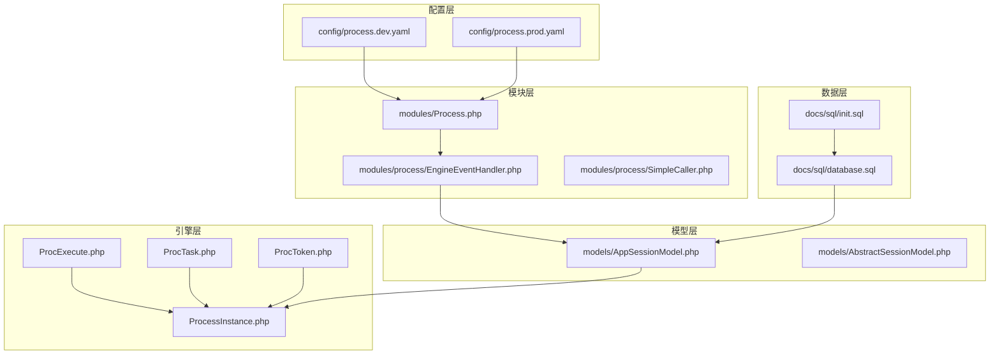
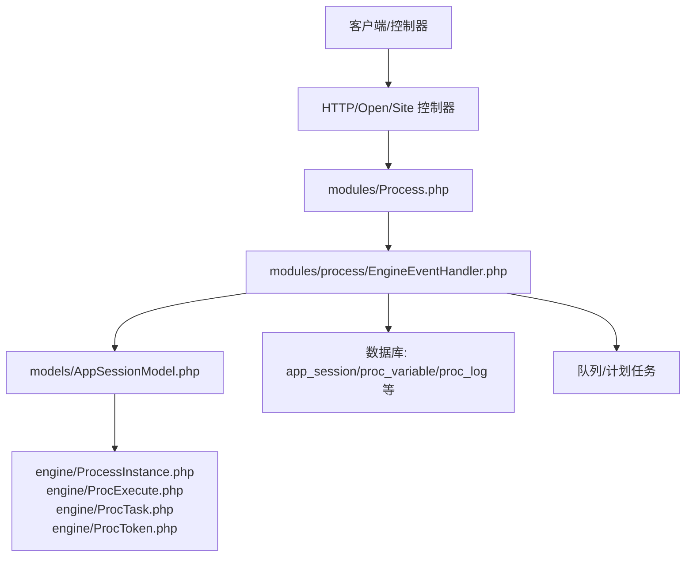
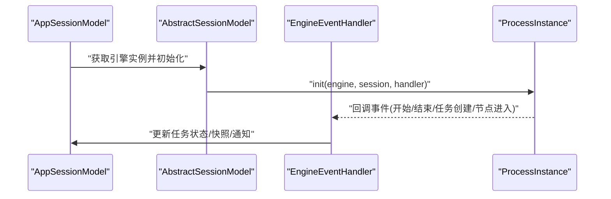
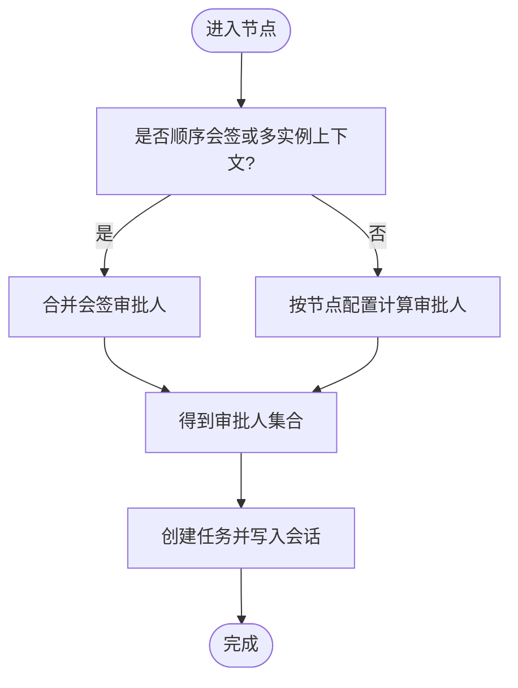
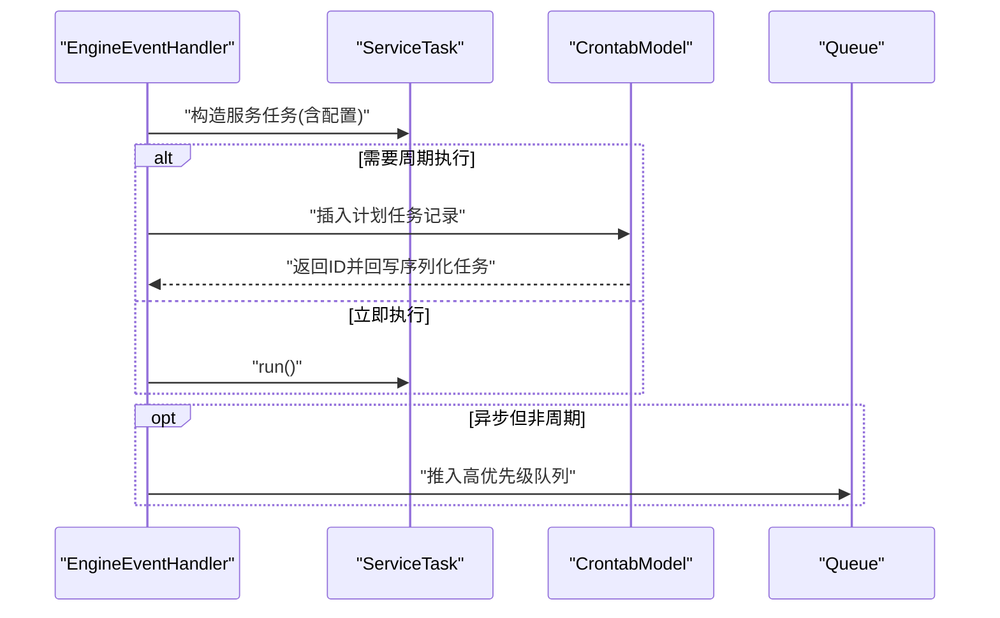
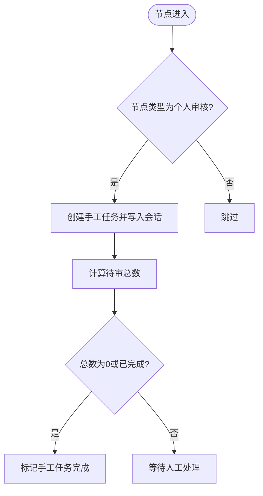
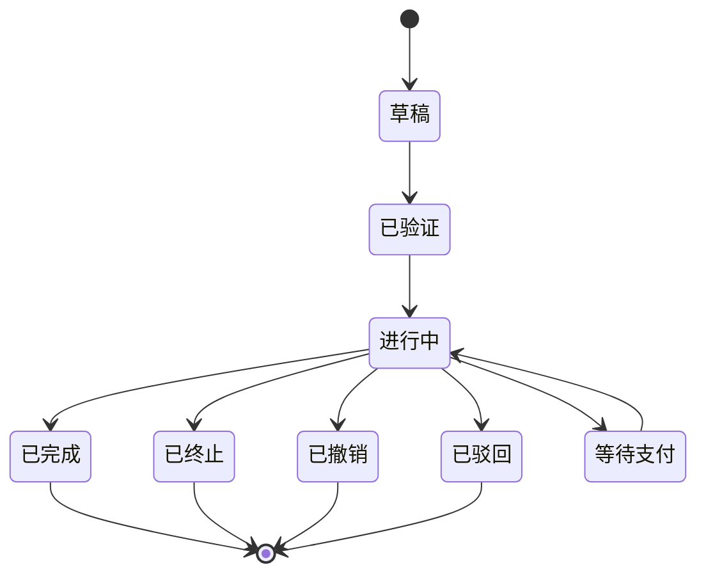
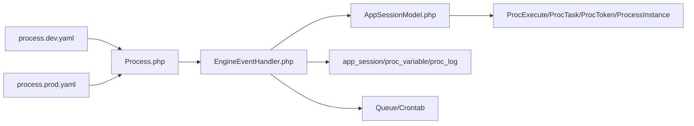
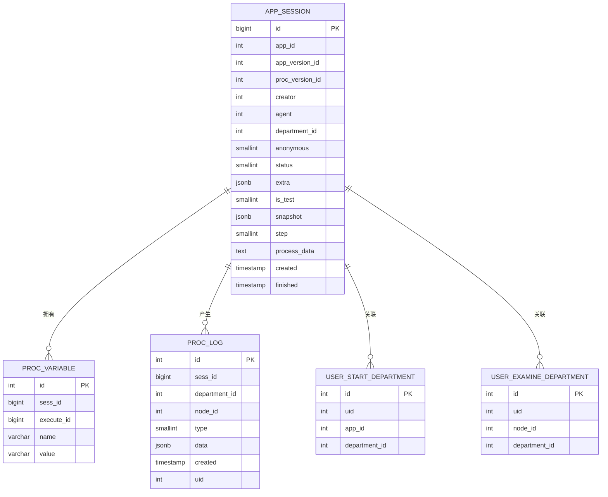

# 流程引擎系统

<cite>
**本文引用的文件**
- [README.MD](file://process/README.MD)
- [ProcExecute.php](file://process/src/engine/ProcExecute.php)
- [ProcTask.php](file://process/src/engine/ProcTask.php)
- [ProcToken.php](file://process/src/engine/ProcToken.php)
- [ProcessInstance.php](file://process/src/engine/ProcessInstance.php)
- [Process.php](file://process/src/modules/Process.php)
- [EngineEventHandler.php](file://process/src/modules/process/EngineEventHandler.php)
- [SimpleCaller.php](file://process/src/modules/process/SimpleCaller.php)
- [AppSessionModel.php](file://process/src/models/AppSessionModel.php)
- [AbstractSessionModel.php](file://process/src/models/AbstractSessionModel.php)
- [process.dev.yaml](file://process/src/config/process.dev.yaml)
- [process.prod.yaml](file://process/src/config/process.prod.yaml)
- [database.sql](file://process/docs/sql/database.sql)
- [init.sql](file://process/docs/sql/init.sql)
- [routes.php](file://process/src/config/routes.php)
- [Upgrade4to5 App.php](file://process/src/services/upgrade4to5/App.php)
</cite>

## 目录
1. [引言](#引言)
2. [项目结构](#项目结构)
3. [核心组件](#核心组件)
4. [架构总览](#架构总览)
5. [详细组件分析](#详细组件分析)
6. [依赖关系分析](#依赖关系分析)
7. [性能考量](#性能考量)
8. [故障排查指南](#故障排查指南)
9. [结论](#结论)
10. [附录](#附录)

## 引言
本文件面向 htdNew 项目的流程引擎系统，围绕 BPMN 流程建模与执行、会话管理、节点状态跟踪、实例生命周期、并行与分支合并、任务分配与审批、会签机制、流程设计器与版本迁移、性能优化与最佳实践展开，帮助开发者与运维人员快速理解并高效使用该流程引擎。

## 项目结构
- 核心引擎封装位于 engine 目录，采用对底层 lifei\engine 的继承扩展，确保序列化兼容性与运行期稳定性。
- 模块层 modules 提供流程模块 Process 与事件处理器 EngineEventHandler，负责节点解析、任务创建、会签合并、服务任务调度等。
- 模型层 models 提供会话模型 AppSessionModel 与抽象会话模型 AbstractSessionModel，承载流程实例序列化、状态管理、任务变更、快照与回滚等能力。
- 配置层 config 提供开发与生产环境进程配置，支持多进程、队列、计划任务等。
- 数据层 docs/sql 提供数据库初始化与核心表结构（会话、变量、日志、默认部门等）。
- 升级工具 services/upgrade4to5 提供从旧版 BPMN 到新版应用版本的迁移逻辑。

**图表来源**
- [ProcExecute.php](file://process/src/engine/ProcExecute.php#L1-L11)
- [ProcTask.php](file://process/src/engine/ProcTask.php#L1-L11)
- [ProcToken.php](file://process/src/engine/ProcToken.php#L1-L11)
- [ProcessInstance.php](file://process/src/engine/ProcessInstance.php#L1-L11)
- [Process.php](file://process/src/modules/Process.php#L1-L47)
- [EngineEventHandler.php](file://process/src/modules/process/EngineEventHandler.php#L1-L302)
- [SimpleCaller.php](file://process/src/modules/process/SimpleCaller.php#L1-L16)
- [AppSessionModel.php](file://process/src/models/AppSessionModel.php#L1-L800)
- [AbstractSessionModel.php](file://process/src/models/AbstractSessionModel.php#L42-L72)
- [process.dev.yaml](file://process/src/config/process.dev.yaml#L1-L89)
- [process.prod.yaml](file://process/src/config/process.prod.yaml#L1-L80)
- [database.sql](file://process/docs/sql/database.sql#L172-L310)
- [init.sql](file://process/docs/sql/init.sql#L1-L86)

**章节来源**
- [README.MD](file://process/README.MD#L1-L158)
- [process.dev.yaml](file://process/src/config/process.dev.yaml#L1-L89)
- [process.prod.yaml](file://process/src/config/process.prod.yaml#L1-L80)
- [database.sql](file://process/docs/sql/database.sql#L172-L310)
- [init.sql](file://process/docs/sql/init.sql#L1-L86)

## 核心组件
- 引擎适配层
  - ProcExecute/ProcTask/ProcToken/ProcessInstance：对底层引擎类的轻量继承，保留序列化兼容性要求。
- 模块与事件
  - Process：加载流程节点、维护 node_key 与 node_id 映射，暴露默认起始节点。
  - EngineEventHandler：实现引擎事件回调，包括任务创建、会签合并、服务任务调度、手工任务创建、节点进入清理等。
  - SimpleCaller：对外暴露自定义函数调用接口。
- 会话与状态
  - AppSessionModel：流程实例持久化载体，负责序列化/反序列化、状态流转、任务变更、快照与回滚、挂起/恢复、撤销/中止、消息通知等。
  - AbstractSessionModel：提供获取引擎实例、运行时审批人解析等通用逻辑。
- 配置与路由
  - process.dev.yaml/process.prod.yaml：定义多进程、队列、计划任务等运行参数。
  - routes.php：路由配置占位，便于后续扩展。

**章节来源**
- [ProcExecute.php](file://process/src/engine/ProcExecute.php#L1-L11)
- [ProcTask.php](file://process/src/engine/ProcTask.php#L1-L11)
- [ProcToken.php](file://process/src/engine/ProcToken.php#L1-L11)
- [ProcessInstance.php](file://process/src/engine/ProcessInstance.php#L1-L11)
- [Process.php](file://process/src/modules/Process.php#L1-L47)
- [EngineEventHandler.php](file://process/src/modules/process/EngineEventHandler.php#L1-L302)
- [SimpleCaller.php](file://process/src/modules/process/SimpleCaller.php#L1-L16)
- [AppSessionModel.php](file://process/src/models/AppSessionModel.php#L1-L800)
- [AbstractSessionModel.php](file://process/src/models/AbstractSessionModel.php#L42-L72)
- [process.dev.yaml](file://process/src/config/process.dev.yaml#L1-L89)
- [process.prod.yaml](file://process/src/config/process.prod.yaml#L1-L80)
- [routes.php](file://process/src/config/routes.php#L1-L4)

## 架构总览
流程引擎系统采用“模块-事件-模型-引擎”的分层架构：
- 模块层负责流程元数据与节点解析；
- 事件处理器承接引擎回调，驱动任务创建、会签合并、服务任务等；
- 模型层承载会话状态与持久化，负责序列化/反序列化与状态机；
- 引擎层提供执行、令牌、任务等核心对象；
- 配置层控制进程与资源分配。

**图表来源**
- [Process.php](file://process/src/modules/Process.php#L1-L47)
- [EngineEventHandler.php](file://process/src/modules/process/EngineEventHandler.php#L1-L302)
- [AppSessionModel.php](file://process/src/models/AppSessionModel.php#L1-L800)
- [ProcessInstance.php](file://process/src/engine/ProcessInstance.php#L1-L11)
- [ProcExecute.php](file://process/src/engine/ProcExecute.php#L1-L11)
- [ProcTask.php](file://process/src/engine/ProcTask.php#L1-L11)
- [ProcToken.php](file://process/src/engine/ProcToken.php#L1-L11)
- [database.sql](file://process/docs/sql/database.sql#L172-L310)

## 详细组件分析

### 引擎对象与会话序列化
- 引擎对象通过 AppSessionModel 的抽象层进行初始化与反序列化，确保流程实例在数据库中以字符串形式持久化，并在运行时重建。
- ProcessInstance/ProcExecute/ProcTask/ProcToken 作为引擎核心对象，由 AppSessionModel 在运行期注入上下文并驱动执行。

**图表来源**
- [AbstractSessionModel.php](file://process/src/models/AbstractSessionModel.php#L42-L72)
- [AppSessionModel.php](file://process/src/models/AppSessionModel.php#L1-L800)
- [EngineEventHandler.php](file://process/src/modules/process/EngineEventHandler.php#L1-L302)

**章节来源**
- [AbstractSessionModel.php](file://process/src/models/AbstractSessionModel.php#L42-L72)
- [AppSessionModel.php](file://process/src/models/AppSessionModel.php#L1-L800)

### 任务分配与会签合并
- 运行时审批人解析优先从“合并后的会签”中获取；若节点为顺序会签或存在多实例上下文，则走合并逻辑；否则按节点配置动态计算。
- 会签场景下，多实例审批人的集合会在节点进入时合并，避免遗漏与重复。

**图表来源**
- [AbstractSessionModel.php](file://process/src/models/AbstractSessionModel.php#L56-L72)
- [EngineEventHandler.php](file://process/src/modules/process/EngineEventHandler.php#L93-L121)

**章节来源**
- [AbstractSessionModel.php](file://process/src/models/AbstractSessionModel.php#L56-L72)
- [EngineEventHandler.php](file://process/src/modules/process/EngineEventHandler.php#L93-L121)

### 服务任务与计划任务
- 服务任务支持同步/异步、一次性/周期性两种模式，周期性任务通过计划任务表落盘并在事务成功后入队。
- 引擎事件回调中根据节点配置决定是否立即执行或延迟执行，并在必要时写入计划任务表。

**图表来源**
- [EngineEventHandler.php](file://process/src/modules/process/EngineEventHandler.php#L171-L234)
- [database.sql](file://process/docs/sql/database.sql#L270-L278)

**章节来源**
- [EngineEventHandler.php](file://process/src/modules/process/EngineEventHandler.php#L171-L234)
- [database.sql](file://process/docs/sql/database.sql#L270-L278)

### 手工任务与个人审核
- 对于“个人审核”类型的节点，系统生成手工任务并根据维度与表单配置计算待审总数；当无明细或全部完成时，手工任务自动完成。

**图表来源**
- [EngineEventHandler.php](file://process/src/modules/process/EngineEventHandler.php#L252-L295)

**章节来源**
- [EngineEventHandler.php](file://process/src/modules/process/EngineEventHandler.php#L252-L295)

### 实例生命周期与状态机
- AppSessionModel 定义了完整的流程状态集合与状态机，涵盖进行中、完成、终止、撤销、驳回、等待支付等。
- 结束事件触发后，系统根据引擎状态更新会话状态，并在事务成功后发送通知、清理消息、更新最近审批人与时间等。

**图表来源**
- [AppSessionModel.php](file://process/src/models/AppSessionModel.php#L96-L151)
- [AppSessionModel.php](file://process/src/models/AppSessionModel.php#L566-L600)

**章节来源**
- [AppSessionModel.php](file://process/src/models/AppSessionModel.php#L96-L151)
- [AppSessionModel.php](file://process/src/models/AppSessionModel.php#L566-L600)

### 并行与分支合并
- 多实例与顺序会签在运行时通过合并审批人集合实现“并行收集、顺序合并”，确保下游节点在满足条件后继续执行。
- 引擎事件回调中对节点进入时的任务变量进行清理，避免脏数据影响后续执行。

**章节来源**
- [EngineEventHandler.php](file://process/src/modules/process/EngineEventHandler.php#L117-L121)
- [EngineEventHandler.php](file://process/src/modules/process/EngineEventHandler.php#L296-L302)

### BPMN 建模与版本迁移
- 项目内置从旧版 BPMN 到新版应用版本的迁移工具，支持任务名、提示语、步骤、进度号、表达式、监听器等字段的转换与映射。
- 迁移过程中将 BPMN XML/SVG 与全局变量等配置写入应用版本配置，同时维护 ID 关系映射。

**章节来源**
- [Upgrade4to5 App.php](file://process/src/services/upgrade4to5/App.php#L443-L2163)

## 依赖关系分析
- 模块 Process 依赖节点模型与会话模型，提供节点键到节点 ID 的映射与默认起始节点。
- EngineEventHandler 依赖会话模型、节点模型、计划任务模型、队列组件等，实现事件驱动的任务创建与调度。
- AppSessionModel 依赖引擎对象、事件处理器接口、任务模型、通知组件等，承担状态与持久化职责。
- 配置文件 process.dev.yaml/process.prod.yaml 决定进程数量、亲和性、业务配置文件路径等，影响系统并发与资源占用。

**图表来源**
- [Process.php](file://process/src/modules/Process.php#L1-L47)
- [EngineEventHandler.php](file://process/src/modules/process/EngineEventHandler.php#L1-L302)
- [AppSessionModel.php](file://process/src/models/AppSessionModel.php#L1-L800)
- [ProcExecute.php](file://process/src/engine/ProcExecute.php#L1-L11)
- [ProcTask.php](file://process/src/engine/ProcTask.php#L1-L11)
- [ProcToken.php](file://process/src/engine/ProcToken.php#L1-L11)
- [ProcessInstance.php](file://process/src/engine/ProcessInstance.php#L1-L11)
- [process.dev.yaml](file://process/src/config/process.dev.yaml#L1-L89)
- [process.prod.yaml](file://process/src/config/process.prod.yaml#L1-L80)

**章节来源**
- [Process.php](file://process/src/modules/Process.php#L1-L47)
- [EngineEventHandler.php](file://process/src/modules/process/EngineEventHandler.php#L1-L302)
- [AppSessionModel.php](file://process/src/models/AppSessionModel.php#L1-L800)
- [process.dev.yaml](file://process/src/config/process.dev.yaml#L1-L89)
- [process.prod.yaml](file://process/src/config/process.prod.yaml#L1-L80)

## 性能考量
- 多进程与 CPU 亲和：生产环境建议合理设置进程数量与 CPU 亲和，主服务独占核心，其他服务按需独立核，降低上下文切换开销。
- 队列与计划任务：服务任务的异步执行与周期性任务通过队列与计划任务表解耦，减少阻塞。
- 会话序列化：引擎对象序列化存储于 app_session.process_data，避免频繁重建带来的开销。
- 数据索引：proc_variable 上的复合索引、app_session 的常用过滤字段索引有助于查询性能。
- 事务后钩子：在事务成功后触发通知与计划任务入队，避免阻塞主流程。

**章节来源**
- [process.prod.yaml](file://process/src/config/process.prod.yaml#L30-L80)
- [database.sql](file://process/docs/sql/database.sql#L172-L206)
- [database.sql](file://process/docs/sql/database.sql#L270-L278)
- [AppSessionModel.php](file://process/src/models/AppSessionModel.php#L456-L502)

## 故障排查指南
- 无法找到处理人
  - 现象：创建任务时报“无法找到处理人，请联系管理员”。
  - 排查：检查节点配置、会话运行时审批人解析逻辑、是否存在顺序会签/多实例上下文导致的合并异常。
  - 参考
    - [EngineEventHandler.php](file://process/src/modules/process/EngineEventHandler.php#L93-L112)
    - [AbstractSessionModel.php](file://process/src/models/AbstractSessionModel.php#L56-L72)
- 会话状态异常
  - 现象：结束事件触发后状态未正确更新或通知未发送。
  - 排查：确认引擎状态与会话状态映射、事务后钩子是否执行、通知组件是否可用。
  - 参考
    - [EngineEventHandler.php](file://process/src/modules/process/EngineEventHandler.php#L77-L91)
    - [AppSessionModel.php](file://process/src/models/AppSessionModel.php#L566-L600)
- 服务任务未执行
  - 现象：配置了周期性服务任务但未触发。
  - 排查：检查计划任务表记录、队列是否启用、事务后钩子是否写入任务。
  - 参考
    - [EngineEventHandler.php](file://process/src/modules/process/EngineEventHandler.php#L171-L234)
    - [database.sql](file://process/docs/sql/database.sql#L270-L278)
- 快照与回滚
  - 现象：收回后流程状态未恢复或任务未清理。
  - 排查：确认快照任务 ID 一致性、会话状态是否回到进行中、新任务是否按历史时间点清理。
  - 参考
    - [AppSessionModel.php](file://process/src/models/AppSessionModel.php#L517-L549)

**章节来源**
- [EngineEventHandler.php](file://process/src/modules/process/EngineEventHandler.php#L77-L112)
- [AbstractSessionModel.php](file://process/src/models/AbstractSessionModel.php#L56-L72)
- [AppSessionModel.php](file://process/src/models/AppSessionModel.php#L517-L549)
- [database.sql](file://process/docs/sql/database.sql#L270-L278)

## 结论
htdNew 流程引擎系统以模块-事件-模型-引擎为核心，结合会话序列化、事件驱动的任务创建与调度、完善的生命周期状态机与日志/变量/通知体系，实现了对 BPMN 流程的稳定执行与扩展。通过合理的进程配置、队列与计划任务解耦、以及严格的会签合并与任务清理机制，系统在复杂业务场景下具备良好的可维护性与可扩展性。

## 附录

### 流程设计器与版本管理
- 设计器与 BPMN 导入
  - 项目提供从旧版 BPMN 到新版应用版本的迁移工具，支持任务名、提示语、步骤、表达式、监听器等字段转换。
  - 参考
    - [Upgrade4to5 App.php](file://process/src/services/upgrade4to5/App.php#L443-L2163)
- 版本与配置
  - 应用版本与流程版本分离，流程版本在发起时锁定，编辑仅在删除环节节点时产生新版本。
  - 参考
    - [AppSessionModel.php](file://process/src/models/AppSessionModel.php#L38-L51)

**章节来源**
- [Upgrade4to5 App.php](file://process/src/services/upgrade4to5/App.php#L443-L2163)
- [AppSessionModel.php](file://process/src/models/AppSessionModel.php#L38-L51)

### 数据模型概览
- 会话与变量
  - app_session：流程实例主表，存储发起人、部门、状态、快照、流程数据等。
  - proc_variable：流程运行时环境变量，支持按会话与执行 ID 查询。
  - proc_log：节点日志，记录节点类型、数据与操作人。
- 默认部门
  - user_start_department：发起默认部门
  - user_examine_department：审批默认部门

**图表来源**
- [database.sql](file://process/docs/sql/database.sql#L172-L310)

**章节来源**
- [database.sql](file://process/docs/sql/database.sql#L172-L310)

### 初始化与环境准备
- 环境要求与初始化步骤、Docker 开发环境、调试端口与平滑重启方式、数据库升级脚本等详见项目说明。
- 参考
  - [README.MD](file://process/README.MD#L1-L158)
  - [init.sql](file://process/docs/sql/init.sql#L1-L86)

**章节来源**
- [README.MD](file://process/README.MD#L1-L158)
- [init.sql](file://process/docs/sql/init.sql#L1-L86)