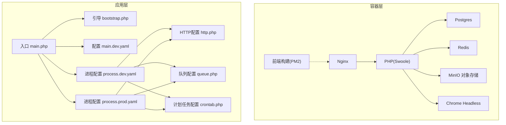
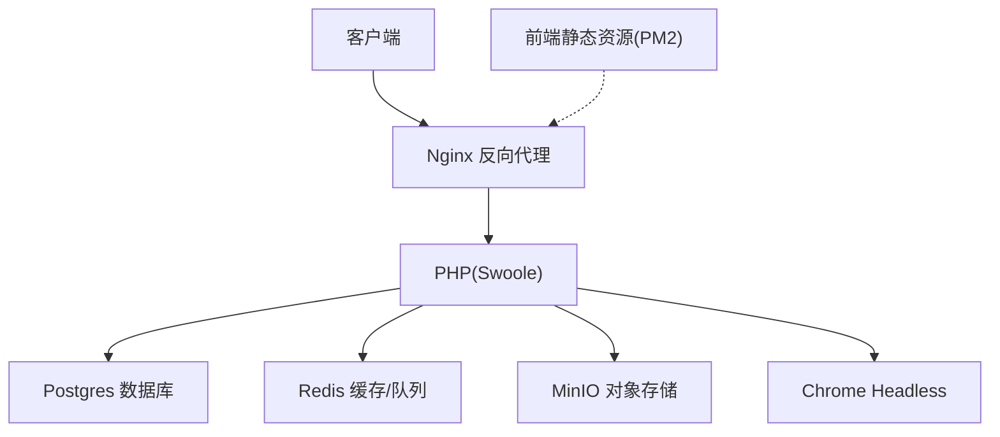
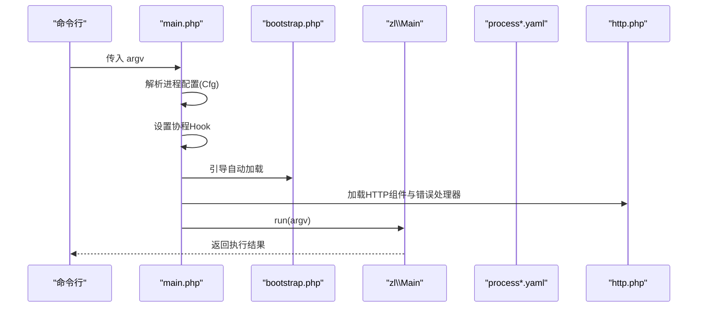
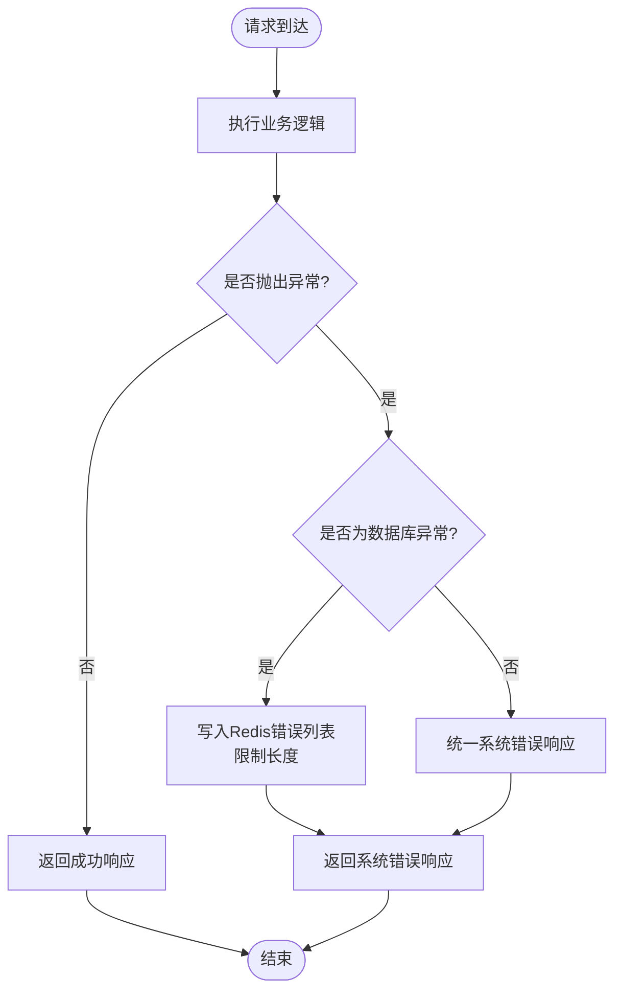
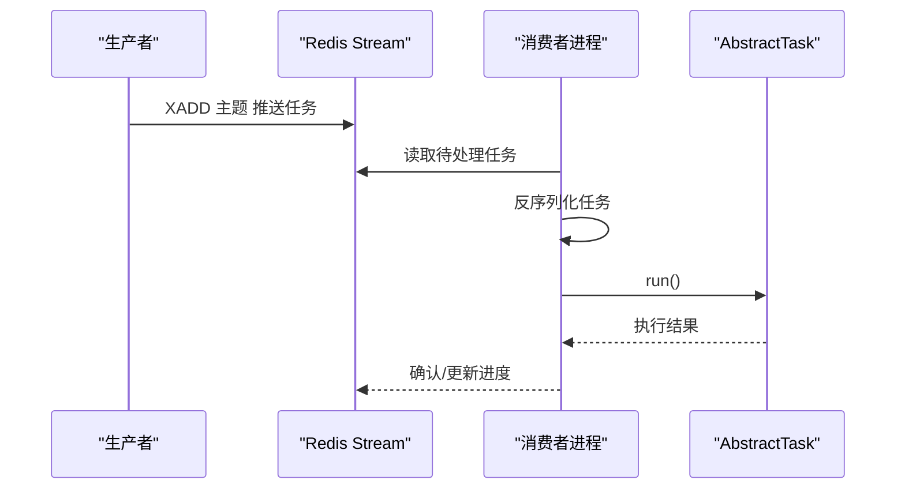
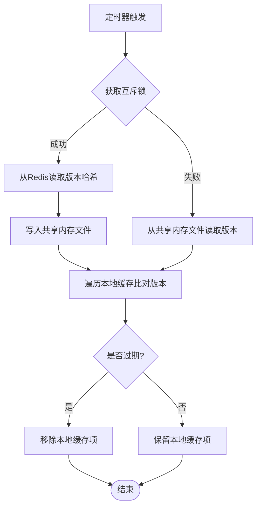
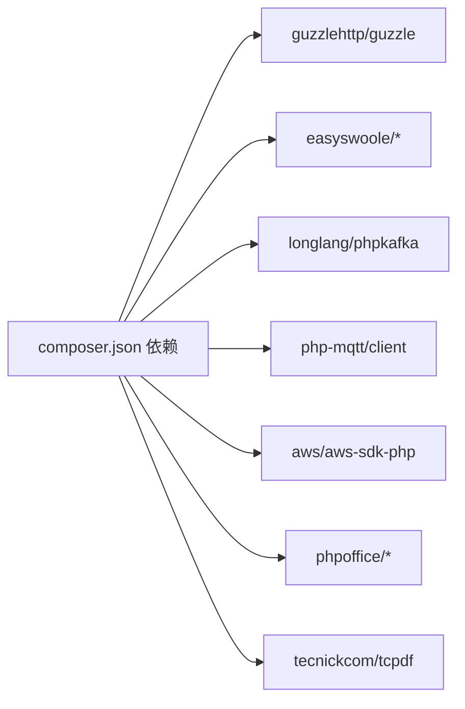

# 运维手册

<cite>
**本文引用的文件**
- [README.MD](file://process/README.MD)
- [composer.json](file://process/composer.json)
- [docker-compose.yml](file://process/docker/docker-compose.yml)
- [dev.env](file://process/docker/dev.env)
- [prod.env](file://process/docker/prod.env)
- [bootstrap.php](file://process/src/bootstrap.php)
- [main.php](file://process/src/main.php)
- [process.dev.yaml](file://process/src/config/process.dev.yaml)
- [process.prod.yaml](file://process/src/config/process.prod.yaml)
- [main.dev.yaml](file://process/src/config/main.dev.yaml)
- [http.php](file://process/src/config/http.php)
- [queue.php](file://process/src/config/queue.php)
- [crontab.php](file://process/src/config/crontab.php)
- [ErrorHandler.php](file://process/src/components/ErrorHandler.php)
- [Queue.php](file://process/src/components/Queue.php)
- [Cache.php](file://process/src/components/Cache.php)
</cite>

## 目录
1. [简介](#简介)
2. [项目结构](#项目结构)
3. [核心组件](#核心组件)
4. [架构总览](#架构总览)
5. [详细组件分析](#详细组件分析)
6. [依赖关系分析](#依赖关系分析)
7. [性能与容量规划](#性能与容量规划)
8. [部署与发布流程](#部署与发布流程)
9. [平滑重启与故障恢复](#平滑重启与故障恢复)
10. [监控、日志与告警](#监控日志与告警)
11. [备份与恢复](#备份与恢复)
12. [安全加固与合规](#安全加固与合规)
13. [运维工具与应急响应](#运维工具与应急响应)
14. [故障排除指南](#故障排除指南)
15. [结论](#结论)

## 简介
本运维手册面向 htdNew 项目（基于 Swoole 的 PHP 应用）的生产与开发运维场景，覆盖系统监控、日志管理、告警机制；部署流程、平滑重启与故障恢复策略；性能监控指标、容量规划与扩展方案；备份恢复、安全加固与合规要求；以及运维工具使用、故障排除与应急响应流程。文档内容均来源于仓库现有配置与源码，确保可操作与可落地。

## 项目结构
项目采用“容器化 + 多环境配置 + 自定义进程模型”的架构：
- 容器编排：通过 docker-compose 管理 redis、postgres、php、nginx、chrome、frontend、minio 等服务。
- 多环境：dev.env 与 prod.env 提供开发与生产的差异化变量。
- 进程模型：通过 process.dev.yaml/process.prod.yaml 定义主进程、HTTP 工作进程、队列进程、计划任务进程等。
- 配置体系：main.dev.yaml 提供运行期通用配置（数据库、Redis、上传、日志级别等），并通过 http.php/queue.php/crontab.php 注入到对应进程。
- 启动入口：main.php 加载配置、引导自动加载与引导程序，交由 zl\Main 执行。

图表来源
- [docker-compose.yml](file://process/docker/docker-compose.yml#L1-L150)
- [main.php](file://process/src/main.php#L1-L25)
- [bootstrap.php](file://process/src/bootstrap.php#L1-L40)
- [process.dev.yaml](file://process/src/config/process.dev.yaml#L1-L89)
- [process.prod.yaml](file://process/src/config/process.prod.yaml#L1-L80)
- [http.php](file://process/src/config/http.php#L1-L27)
- [queue.php](file://process/src/config/queue.php#L1-L13)
- [crontab.php](file://process/src/config/crontab.php#L1-L10)

章节来源
- [docker-compose.yml](file://process/docker/docker-compose.yml#L1-L150)
- [main.php](file://process/src/main.php#L1-L25)
- [bootstrap.php](file://process/src/bootstrap.php#L1-L40)
- [process.dev.yaml](file://process/src/config/process.dev.yaml#L1-L89)
- [process.prod.yaml](file://process/src/config/process.prod.yaml#L1-L80)
- [http.php](file://process/src/config/http.php#L1-L27)
- [queue.php](file://process/src/config/queue.php#L1-L13)
- [crontab.php](file://process/src/config/crontab.php#L1-L10)

## 核心组件
- 启动与引导
  - 入口：main.php 负责加载 YAML 进程配置、设置 Swoole 协程 Hook、引入 bootstrap.php，并调用 zl\Main 运行 CLI 参数。
  - 引导：bootstrap.php 实现按命名空间与目录的自动加载，支持 vendor/lifei/zl、runtime、envs 等路径映射。
- 进程模型
  - 开发模式：启用文件变更监控（watcher）、HTTP 工作进程、队列进程、计划任务进程。
  - 生产模式：启用 HTTP 工作进程、部署进程（deploy）、队列进程、计划任务进程；配置 CPU 亲和与进程数量。
- 错误处理
  - ErrorHandler 将数据库异常写入 Redis 队列，限制长度并返回统一系统错误响应。
- 队列与缓存
  - Queue 支持高/中/低优先级主题，提供推送、执行、消费者数量动态调整、主题长度查询等能力。
  - Cache 通过定时轮询 Redis 维护对象缓存版本，利用共享内存文件实现跨进程一致性。

章节来源
- [main.php](file://process/src/main.php#L1-L25)
- [bootstrap.php](file://process/src/bootstrap.php#L1-L40)
- [process.dev.yaml](file://process/src/config/process.dev.yaml#L1-L89)
- [process.prod.yaml](file://process/src/config/process.prod.yaml#L1-L80)
- [ErrorHandler.php](file://process/src/components/ErrorHandler.php#L1-L26)
- [Queue.php](file://process/src/components/Queue.php#L1-L173)
- [Cache.php](file://process/src/components/Cache.php#L1-L136)

## 架构总览
下图展示生产环境典型交互：Nginx 作为反向代理，PHP(Swoole) 提供 API 与业务逻辑，Postgres 存储结构化数据，Redis 提供缓存与队列，MinIO 提供对象存储，Chrome Headless 用于页面渲染，Frontend 通过 PM2 管理静态资源。

图表来源
- [docker-compose.yml](file://process/docker/docker-compose.yml#L1-L150)

章节来源
- [docker-compose.yml](file://process/docker/docker-compose.yml#L1-L150)

## 详细组件分析

### 启动与引导流程
- 关键步骤
  - 解析进程配置（process.dev.yaml 或 process.prod.yaml）
  - 设置 Swoole 协程 Hook
  - 引导自动加载（bootstrap.php）
  - 注入组件与错误处理器（http.php）
  - 交由 zl\Main 执行命令行参数
- 平滑重启要点
  - 通过发送信号触发工作进程热重启（见 README 中 SIGUSR1 示例）

图表来源
- [main.php](file://process/src/main.php#L1-L25)
- [bootstrap.php](file://process/src/bootstrap.php#L1-L40)
- [process.dev.yaml](file://process/src/config/process.dev.yaml#L1-L89)
- [process.prod.yaml](file://process/src/config/process.prod.yaml#L1-L80)
- [http.php](file://process/src/config/http.php#L1-L27)

章节来源
- [main.php](file://process/src/main.php#L1-L25)
- [bootstrap.php](file://process/src/bootstrap.php#L1-L40)
- [process.dev.yaml](file://process/src/config/process.dev.yaml#L1-L89)
- [process.prod.yaml](file://process/src/config/process.prod.yaml#L1-L80)
- [http.php](file://process/src/config/http.php#L1-L27)

### 错误处理与日志
- 错误处理
  - 数据库异常写入 Redis 列表，保留最近若干条，统一返回系统错误响应。
- 日志配置
  - main.dev.yaml 中设置 logLevel，便于调试与生产环境分级输出。
- 日志位置
  - docker-compose 映射了各服务的日志目录，便于采集与持久化。

图表来源
- [ErrorHandler.php](file://process/src/components/ErrorHandler.php#L1-L26)
- [main.dev.yaml](file://process/src/config/main.dev.yaml#L1-L97)
- [docker-compose.yml](file://process/docker/docker-compose.yml#L1-L150)

章节来源
- [ErrorHandler.php](file://process/src/components/ErrorHandler.php#L1-L26)
- [main.dev.yaml](file://process/src/config/main.dev.yaml#L1-L97)
- [docker-compose.yml](file://process/docker/docker-compose.yml#L1-L150)

### 队列与消费者动态调整
- 主题与执行
  - 支持 high/common/low 三类主题，通过 XADD 推送任务，执行时反序列化并调用 run()。
- 动态消费者数量
  - 通过 Redis 缓存队列设置，结合 YAML 默认值合并，运行时 reload 生效。
- 监控指标
  - 通过 XLEN 获取主题长度，评估积压情况。

图表来源
- [Queue.php](file://process/src/components/Queue.php#L1-L173)

章节来源
- [Queue.php](file://process/src/components/Queue.php#L1-L173)

### 缓存一致性与版本控制
- 版本同步
  - 多进程通过 Redis 维护对象缓存版本哈希，定时从 Redis 拉取并在共享内存文件上做本地缓存版本比对，剔除过期对象。
- 清理策略
  - 基于 lastUsed 与对象过期时间定期清理；支持全量清空与单键更新版本。

图表来源
- [Cache.php](file://process/src/components/Cache.php#L1-L136)

章节来源
- [Cache.php](file://process/src/components/Cache.php#L1-L136)

## 依赖关系分析
- Composer 依赖
  - 包含 Guzzle、EasySwoole 工具集、MQTT/Kafka 客户端、AWS SDK、TCPDF、PhpOffice 等，满足网络请求、并发、消息与文档处理等需求。
- 运行时依赖
  - PHP 8.1+、Swoole 5+、Postgres 12/OpenGauss、Redis 5+、YAML 扩展、inotify（开发环境）。

图表来源
- [composer.json](file://process/composer.json#L1-L70)

章节来源
- [composer.json](file://process/composer.json#L1-L70)
- [README.MD](file://process/README.MD#L1-L158)

## 性能与容量规划
- 进程与 CPU 亲和
  - 生产模式建议为主服务分配独立 CPU 核心，其他进程（队列、计划任务）可独占核心或共享，依据 CPU 核心数与业务负载调整。
- 队列积压监控
  - 通过主题长度评估积压，结合消费者数量动态调整（Queue::setConsumerNum）。
- 缓存命中与版本一致性
  - Cache 组件降低热点数据访问压力，同时通过版本同步避免脏读。
- I/O 与存储
  - Postgres 与 Redis 均挂载持久化卷；MinIO 提供对象存储，注意容量与快照策略。

章节来源
- [process.dev.yaml](file://process/src/config/process.dev.yaml#L1-L89)
- [process.prod.yaml](file://process/src/config/process.prod.yaml#L1-L80)
- [Queue.php](file://process/src/components/Queue.php#L1-L173)
- [Cache.php](file://process/src/components/Cache.php#L1-L136)
- [docker-compose.yml](file://process/docker/docker-compose.yml#L1-L150)

## 部署与发布流程
- 开发环境
  - 拷贝开发配置与 .env，构建并启动容器，浏览器访问示例接口验证。
- 生产环境
  - 使用 prod.env，启用部署进程（deploy），通过私钥提取路径拉取代码并部署。
- 前端构建
  - 安装 Node.js，执行构建并将 dist 目录放置于服务器同级目录。

章节来源
- [README.MD](file://process/README.MD#L1-L158)
- [prod.env](file://process/docker/prod.env#L1-L46)
- [process.prod.yaml](file://process/src/config/process.prod.yaml#L1-L80)

## 平滑重启与故障恢复
- 平滑重启
  - 通过向 PHP 容器发送 SIGUSR1 信号触发工作进程热重启，无需中断服务。
- 服务级重启
  - 生产环境可通过 docker service update --force 触发服务滚动重启。
- 故障恢复
  - Watcher（开发）与部署进程（生产）配合，保障代码变更与部署的自动化；队列与缓存具备自愈能力（版本同步、定时清理）。

章节来源
- [README.MD](file://process/README.MD#L1-L158)
- [process.dev.yaml](file://process/src/config/process.dev.yaml#L1-L89)
- [process.prod.yaml](file://process/src/config/process.prod.yaml#L1-L80)

## 监控、日志与告警
- Grafana 日志入口
  - README 提供 Grafana 探索页链接与账号信息，可用于日志聚合与可视化。
- 日志采集
  - docker-compose 映射 Nginx、PHP、Redis、Postgres、MinIO 等日志目录，建议接入集中式日志系统（如 Loki/EFK）。
- 告警建议
  - 基于 Grafana/InfluxDB 客户端（composer 已引入）建立告警规则：HTTP 错误率、队列长度、数据库连接数、Redis 内存使用、磁盘空间、容器健康状态等。

章节来源
- [README.MD](file://process/README.MD#L1-L158)
- [docker-compose.yml](file://process/docker/docker-compose.yml#L1-L150)
- [composer.json](file://process/composer.json#L1-L70)

## 备份与恢复
- 数据库备份
  - 使用 Postgres 容器内置备份机制或外部策略，结合 initdb 初始化脚本进行恢复演练。
- 对象存储备份
  - MinIO 支持快照与复制，建议制定周期性快照与异地备份策略。
- 配置与代码
  - 通过部署进程（deploy）与版本控制进行回滚与恢复。

章节来源
- [docker-compose.yml](file://process/docker/docker-compose.yml#L1-L150)
- [process.prod.yaml](file://process/src/config/process.prod.yaml#L1-L80)

## 安全加固与合规
- 环境隔离
  - 开发与生产使用不同 .env 与镜像（prod 使用 Alpine），减少攻击面。
- 端口与网络
  - 仅暴露必要端口；容器网络通过自定义网络隔离。
- 证书与传输
  - 建议在反向代理层启用 TLS；数据库与对象存储通信走内网或加密通道。
- 权限与最小化
  - 生产镜像移除开发工具；禁用不必要的扩展与服务。

章节来源
- [dev.env](file://process/docker/dev.env#L1-L50)
- [prod.env](file://process/docker/prod.env#L1-L46)
- [docker-compose.yml](file://process/docker/docker-compose.yml#L1-L150)

## 运维工具与应急响应
- 常用命令
  - Docker 构建与启动、服务更新、容器内调试（psql/redis-cli）。
- 应急响应
  - 快速定位：查看日志目录、检查队列长度、确认数据库与 Redis 连通性。
  - 回滚策略：利用部署进程与版本控制快速回退至上一稳定版本。

章节来源
- [README.MD](file://process/README.MD#L1-L158)
- [docker-compose.yml](file://process/docker/docker-compose.yml#L1-L150)

## 故障排除指南
- 无法访问
  - 检查 Nginx 端口映射与 hosts 绑定；确认 PHP 容器已启动。
- 数据库连接失败
  - 校验 Postgres 端口、凭据与初始化脚本；确认容器间网络可达。
- 队列堆积
  - 查看主题长度，适当提升消费者数量；检查任务执行耗时与重试策略。
- 缓存不一致
  - 触发版本同步流程，确认共享内存文件存在且权限正确。

章节来源
- [README.MD](file://process/README.MD#L1-L158)
- [Queue.php](file://process/src/components/Queue.php#L1-L173)
- [Cache.php](file://process/src/components/Cache.php#L1-L136)
- [docker-compose.yml](file://process/docker/docker-compose.yml#L1-L150)

## 结论
本手册基于仓库现有配置与源码，给出了 htdNew 项目的运维全景：从容器编排、进程模型、错误处理、队列与缓存，到部署发布、平滑重启、监控日志、备份恢复、安全加固与应急响应。建议在生产环境中进一步完善集中式日志与告警体系、制定标准化的发布与回滚流程，并持续优化 CPU 亲和与队列消费者配置以匹配业务峰值。