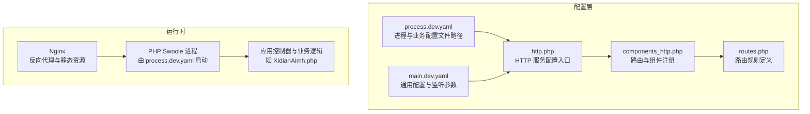
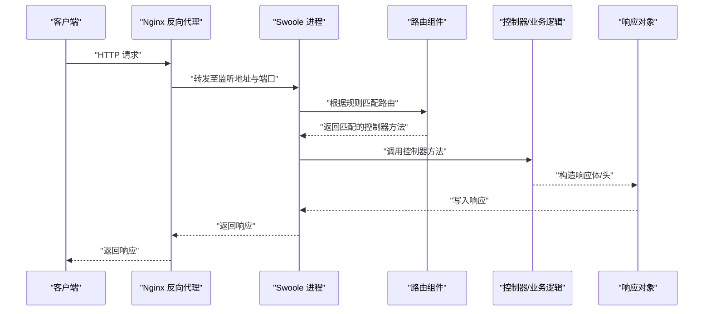
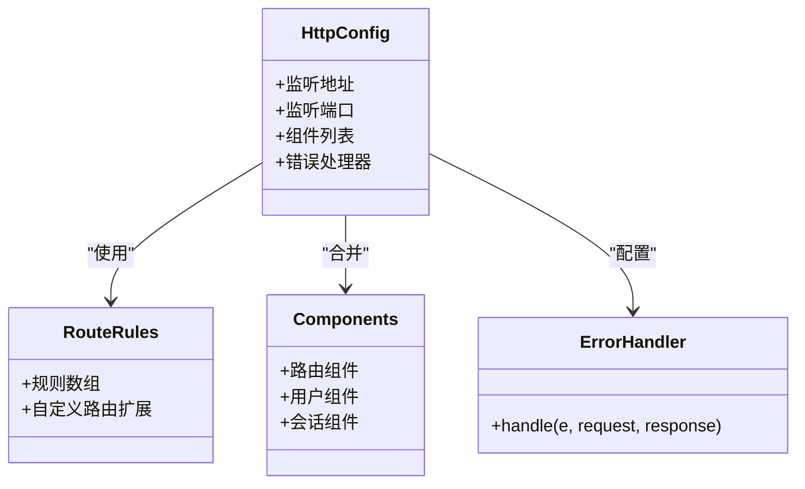
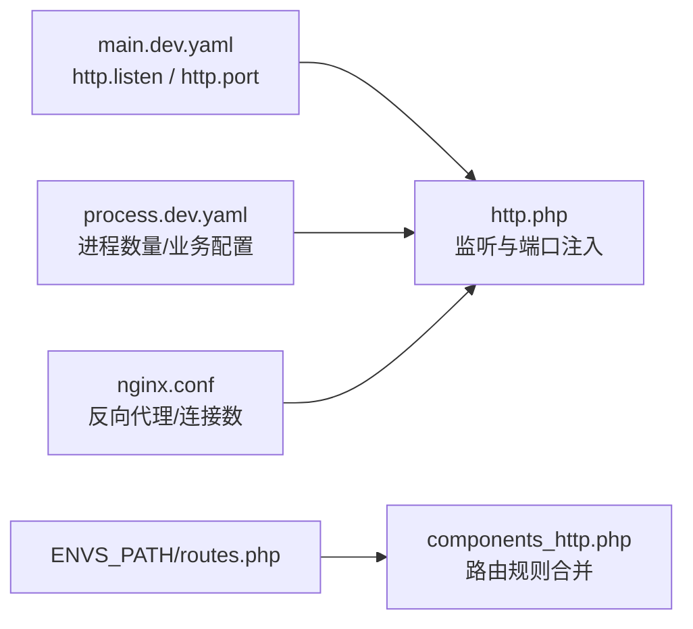

# HTTP 服务配置

<cite>
**本文引用的文件**
- [http.php](file://process/src/config/http.php)
- [components_http.php](file://process/src/config/components_http.php)
- [routes.php](file://process/src/config/routes.php)
- [process.dev.yaml](file://process/src/config/process.dev.yaml)
- [main.dev.yaml](file://process/src/config/main.dev.yaml)
- [ErrorHandler.php](file://process/src/components/ErrorHandler.php)
- [bootstrap.php](file://process/src/bootstrap.php)
- [nginx.conf](file://process/docker/services/nginx/nginx.conf)
- [dev.env](file://process/docker/dev.env)
- [prod.env](file://process/docker/prod.env)
- [XidianAimh.php](file://process_envs/xidian/product/http/site/XidianAimh.php)
</cite>

## 目录
1. [引言](#引言)
2. [项目结构](#项目结构)
3. [核心组件](#核心组件)
4. [架构总览](#架构总览)
5. [详细组件分析](#详细组件分析)
6. [依赖关系分析](#依赖关系分析)
7. [性能考虑](#性能考虑)
8. [故障排查指南](#故障排查指南)
9. [结论](#结论)
10. [附录](#附录)

## 引言
本文件围绕 HTTP 服务配置进行系统化说明，重点覆盖以下方面：
- http.php 中的服务器监听、端口、组件与错误处理配置
- routes.php 与 components_http.php 的路由规则、中间件与路由分组策略
- HTTP 服务启动流程、请求处理管道与响应格式化机制
- 性能调优、负载均衡与安全防护建议

## 项目结构
HTTP 服务配置位于 process/src/config 目录，结合 Docker 环境变量与 Nginx 配置共同构成完整的运行时环境。

图表来源
- [process.dev.yaml](file://process/src/config/process.dev.yaml#L1-L89)
- [http.php](file://process/src/config/http.php#L1-L27)
- [components_http.php](file://process/src/config/components_http.php#L1-L33)
- [routes.php](file://process/src/config/routes.php#L1-L4)
- [main.dev.yaml](file://process/src/config/main.dev.yaml#L1-L97)

章节来源
- [process.dev.yaml](file://process/src/config/process.dev.yaml#L1-L89)
- [http.php](file://process/src/config/http.php#L1-L27)
- [components_http.php](file://process/src/config/components_http.php#L1-L33)
- [routes.php](file://process/src/config/routes.php#L1-L4)
- [main.dev.yaml](file://process/src/config/main.dev.yaml#L1-L97)

## 核心组件
- HTTP 服务配置入口
  - 监听地址与端口来源于 YAML 配置，最终注入到 HTTP 服务配置中
  - 组件合并来自通用组件与 HTTP 专用组件
  - 错误处理器统一拦截异常并返回系统错误响应
- 路由与组件
  - 路由规则优先匹配 envs 接口，再回退到标准 http 命名空间
  - 自定义路由可通过 ENVS_PATH 下的 routes.php 扩展
  - 注册用户、会话等常用组件
- 启动与加载
  - bootstrap.php 提供按命名空间自动加载逻辑，确保控制器与组件可被正确解析

章节来源
- [http.php](file://process/src/config/http.php#L1-L27)
- [components_http.php](file://process/src/config/components_http.php#L1-L33)
- [bootstrap.php](file://process/src/bootstrap.php#L1-L40)
- [ErrorHandler.php](file://process/src/components/ErrorHandler.php#L1-L26)

## 架构总览
HTTP 服务启动流程与请求处理管道如下：

图表来源
- [process.dev.yaml](file://process/src/config/process.dev.yaml#L1-L89)
- [http.php](file://process/src/config/http.php#L1-L27)
- [components_http.php](file://process/src/config/components_http.php#L1-L33)
- [nginx.conf](file://process/docker/services/nginx/nginx.conf#L1-L50)

## 详细组件分析

### HTTP 服务配置（http.php）
- 监听地址与端口
  - 监听地址与端口由 YAML 文件提供，http.php 将其注入配置
  - 监听地址支持 IPv4/IPv6 与 Unix Socket 形式
- 组件合并
  - 合并通用组件与 HTTP 专用组件，形成完整组件注册表
- 错误处理
  - 统一错误处理器用于捕获数据库异常与其它异常，记录并返回系统错误响应

章节来源
- [http.php](file://process/src/config/http.php#L1-L27)
- [ErrorHandler.php](file://process/src/components/ErrorHandler.php#L1-L26)

### 路由与中间件（components_http.php 与 routes.php）
- 路由规则优先级
  - 优先匹配 envs 命名空间下的接口，随后回退到 http 命名空间
  - 内置规则示例：短链、文件下载、文本校验等
- 自定义路由扩展
  - 若存在 ENVS_PATH 下的 routes.php，则将其规则前置合并
- 组件注册
  - 注册路由组件、用户组件、会话组件等

章节来源
- [components_http.php](file://process/src/config/components_http.php#L1-L33)
- [routes.php](file://process/src/config/routes.php#L1-L4)

### 请求处理与响应格式化（示例：XidianAimh.php）
- 请求获取与头部解析
  - 从请求对象读取头部信息，解析客户端 IP
- 响应格式化
  - 设置内容类型、附件下载头、跨域头、缓存控制头
  - 支持分块写入与结束响应，实现大文件或压力测试场景的数据输出

章节来源
- [XidianAimh.php](file://process_envs/xidian/product/http/site/XidianAimh.php#L172-L260)

### 启动流程与自动加载（bootstrap.php）
- 自动加载策略
  - 根据命名空间前缀选择加载路径：zl、runtime、envs 或项目内模块
  - 通过 spl_autoload_register 注册加载器，确保控制器与组件可被动态解析

章节来源
- [bootstrap.php](file://process/src/bootstrap.php#L1-L40)

### 类关系图（配置与组件）

图表来源
- [http.php](file://process/src/config/http.php#L1-L27)
- [components_http.php](file://process/src/config/components_http.php#L1-L33)
- [ErrorHandler.php](file://process/src/components/ErrorHandler.php#L1-L26)

## 依赖关系分析
- 配置依赖
  - http.php 依赖 YAML 配置中的 http.listen 与 http.port
  - components_http.php 依赖 ENVS_PATH 下的 routes.php（若存在）
- 运行时依赖
  - process.dev.yaml 指定 HTTP 进程数量与业务配置文件路径
  - Nginx 作为反向代理，负责上游转发与静态资源处理

图表来源
- [main.dev.yaml](file://process/src/config/main.dev.yaml#L1-L97)
- [http.php](file://process/src/config/http.php#L1-L27)
- [components_http.php](file://process/src/config/components_http.php#L1-L33)
- [process.dev.yaml](file://process/src/config/process.dev.yaml#L1-L89)
- [nginx.conf](file://process/docker/services/nginx/nginx.conf#L1-L50)

章节来源
- [main.dev.yaml](file://process/src/config/main.dev.yaml#L1-L97)
- [process.dev.yaml](file://process/src/config/process.dev.yaml#L1-L89)
- [nginx.conf](file://process/docker/services/nginx/nginx.conf#L1-L50)

## 性能考虑
- 进程与 CPU 亲和
  - process.dev.yaml 中可配置 HTTP 进程数量与 CPU 亲和，建议根据 CPU 核心数合理分配
- Nginx 连接与缓冲
  - nginx.conf 中 worker_connections、worker_rlimit_nofile、large_client_header_buffers 等参数直接影响并发与内存占用
- 监听参数
  - main.dev.yaml 中 http.listen 与 http.port 决定服务暴露方式与端口，建议在生产环境使用 0.0.0.0 并配合 Nginx 做 TLS 终止
- 响应优化
  - 控制器侧可设置合适的 Content-Type、缓存头与分块传输，减少一次性大响应带来的阻塞

章节来源
- [process.dev.yaml](file://process/src/config/process.dev.yaml#L1-L89)
- [nginx.conf](file://process/docker/services/nginx/nginx.conf#L1-L50)
- [main.dev.yaml](file://process/src/config/main.dev.yaml#L1-L97)
- [XidianAimh.php](file://process_envs/xidian/product/http/site/XidianAimh.php#L172-L260)

## 故障排查指南
- 监听与端口问题
  - 检查 main.dev.yaml 中 http.listen 与 http.port 是否与 process.dev.yaml 的 configFile 对应
- 路由不生效
  - 确认 ENVS_PATH 下 routes.php 是否存在且规则语法正确；components_http.php 会优先合并自定义规则
- 响应异常
  - 控制器中检查是否正确设置响应头与状态码；必要时参考 XidianAimh.php 的响应设置模式
- 错误处理
  - ErrorHandler 会记录数据库异常并返回系统错误响应，可在日志中查看错误队列键定位问题

章节来源
- [main.dev.yaml](file://process/src/config/main.dev.yaml#L1-L97)
- [components_http.php](file://process/src/config/components_http.php#L1-L33)
- [ErrorHandler.php](file://process/src/components/ErrorHandler.php#L1-L26)
- [XidianAimh.php](file://process_envs/xidian/product/http/site/XidianAimh.php#L172-L260)

## 结论
本文梳理了 HTTP 服务配置的关键要素：监听与端口、进程数量、路由规则与组件注册、错误处理以及与 Nginx 的协作方式。通过合理配置与调优，可在保证稳定性的同时提升吞吐与响应速度。建议在生产环境中结合负载均衡与 TLS 终止进一步强化安全与可用性。

## 附录
- 环境变量与容器
  - dev.env 与 prod.env 定义了 PHP、Nginx、Postgres 等服务的端口与日志路径，便于本地与生产的快速切换
- 负载均衡与安全
  - 建议在 Nginx 层面启用限流、健康检查与压缩；在应用层设置 CORS、缓存与安全头；对敏感接口增加鉴权与签名校验

章节来源
- [dev.env](file://process/docker/dev.env#L1-L50)
- [prod.env](file://process/docker/prod.env#L1-L46)
- [nginx.conf](file://process/docker/services/nginx/nginx.conf#L1-L50)