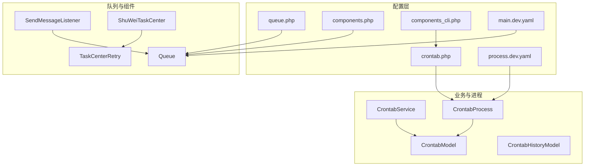
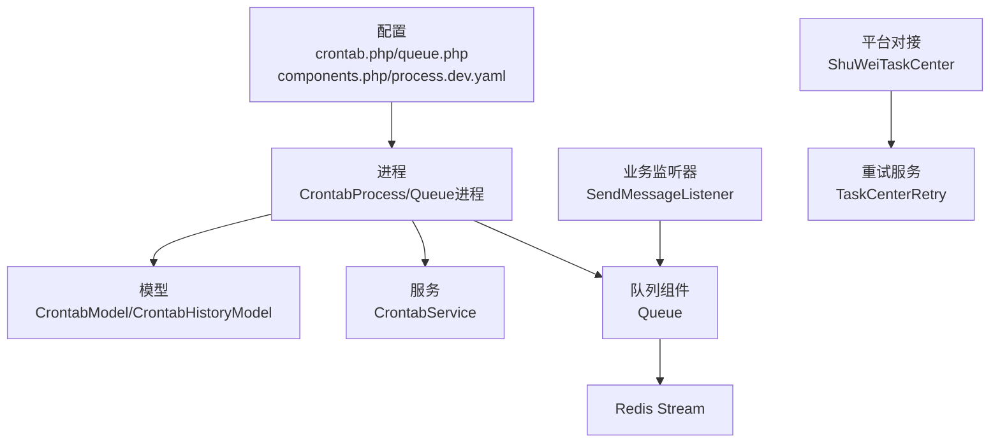
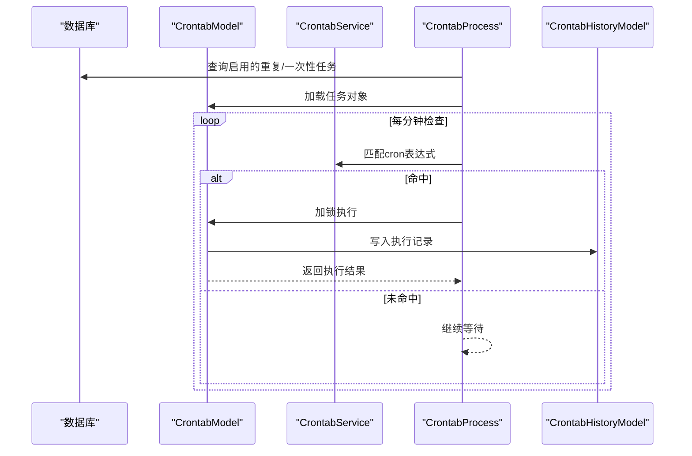
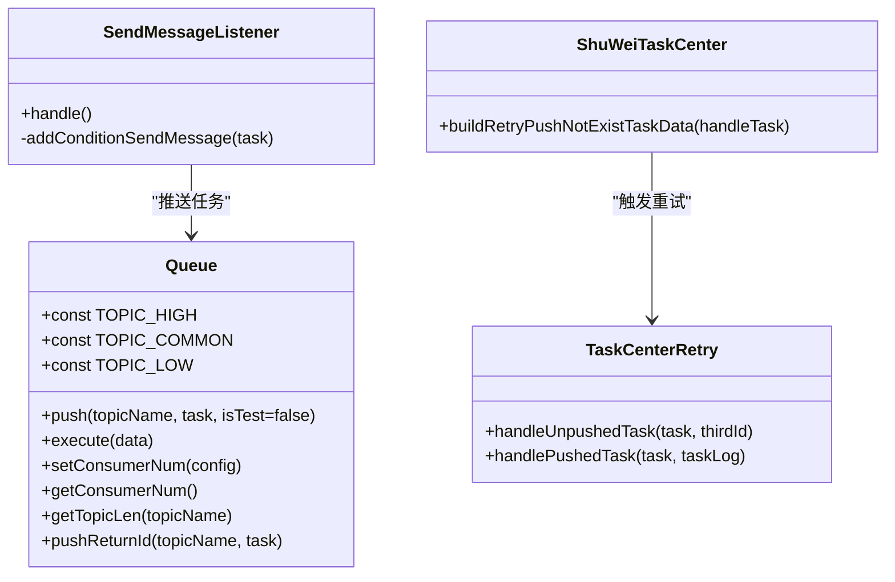
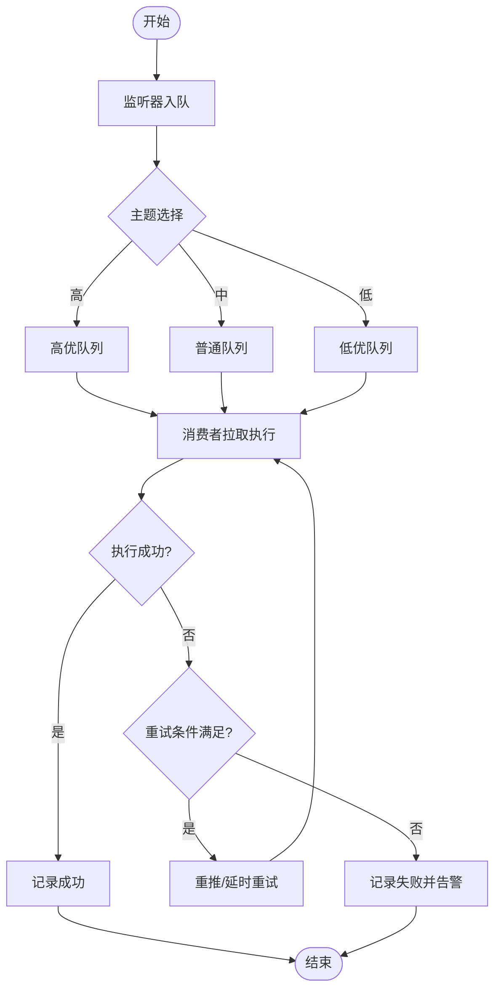
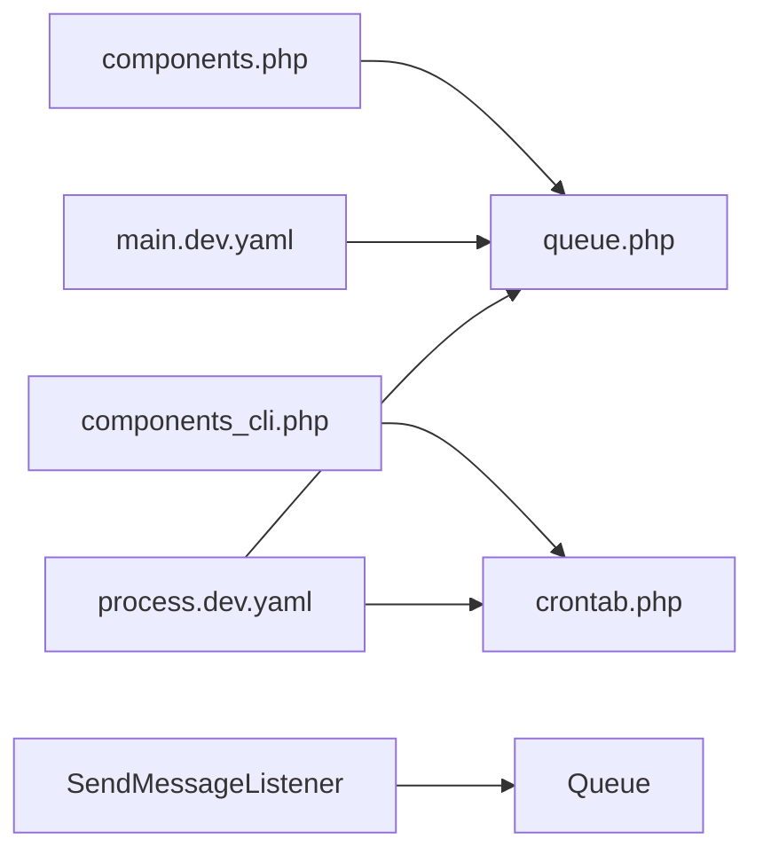

# 任务调度配置

<cite>
**本文引用的文件**
- [process/src/config/crontab.php](file://process/src/config/crontab.php)
- [process/src/config/queue.php](file://process/src/config/queue.php)
- [process/src/config/components.php](file://process/src/config/components.php)
- [process/src/config/components_cli.php](file://process/src/config/components_cli.php)
- [process/src/config/main.dev.yaml](file://process/src/config/main.dev.yaml)
- [process/src/config/process.dev.yaml](file://process/src/config/process.dev.yaml)
- [process/src/components/Queue.php](file://process/src/components/Queue.php)
- [process/src/services/crontab/CrontabProcess.php](file://process/src/services/crontab/CrontabProcess.php)
- [process/src/models/CrontabModel.php](file://process/src/models/CrontabModel.php)
- [process/src/models/CrontabHistoryModel.php](file://process/src/models/CrontabHistoryModel.php)
- [process/src/services/CrontabService.php](file://process/src/services/CrontabService.php)
- [process/docs/sql/database.sql](file://process/docs/sql/database.sql)
- [process/src/services/listeners/SendMessageListener.php](file://process/src/services/listeners/SendMessageListener.php)
- [process/src/services/platform/ShuWeiTaskCenter.php](file://process/src/services/platform/ShuWeiTaskCenter.php)
- [process/src/services/task/TaskCenterRetry.php](file://process/src/services/task/TaskCenterRetry.php)
</cite>

## 目录
1. [引言](#引言)
2. [项目结构](#项目结构)
3. [核心组件](#核心组件)
4. [架构总览](#架构总览)
5. [详细组件分析](#详细组件分析)
6. [依赖关系分析](#依赖关系分析)
7. [性能考量](#性能考量)
8. [故障排查指南](#故障排查指南)
9. [结论](#结论)
10. [附录](#附录)

## 引言
本文件围绕任务调度配置展开，重点解析以下方面：
- 定时任务配置：来自数据库的计划任务表与运行时进程如何加载、执行与去重。
- 队列配置：基于 Redis Stream 的消息队列，包括消费者数量、主题分区、持久化与重试策略。
- 执行流程：从任务生成、入队、消费者拉取、执行到结果记录的完整链路。
- 故障恢复：失败重试、幂等控制、积压处理与监控建议。

## 项目结构
与任务调度相关的关键文件分布如下：
- 配置层：crontab.php、queue.php、components.php、components_cli.php、main.dev.yaml、process.dev.yaml
- 业务模型：CrontabModel、CrontabHistoryModel
- 服务与进程：CrontabService、CrontabProcess
- 队列组件：Queue
- 业务监听器与平台对接：SendMessageListener、ShuWeiTaskCenter、TaskCenterRetry

图表来源
- [process/src/config/crontab.php](file://process/src/config/crontab.php#L1-L10)
- [process/src/config/queue.php](file://process/src/config/queue.php#L1-L13)
- [process/src/config/components.php](file://process/src/config/components.php#L1-L34)
- [process/src/config/components_cli.php](file://process/src/config/components_cli.php#L1-L3)
- [process/src/config/main.dev.yaml](file://process/src/config/main.dev.yaml#L58-L65)
- [process/src/config/process.dev.yaml](file://process/src/config/process.dev.yaml#L55-L71)
- [process/src/models/CrontabModel.php](file://process/src/models/CrontabModel.php#L1-L223)
- [process/src/models/CrontabHistoryModel.php](file://process/src/models/CrontabHistoryModel.php#L1-L39)
- [process/src/services/CrontabService.php](file://process/src/services/CrontabService.php#L1-L84)
- [process/src/services/crontab/CrontabProcess.php](file://process/src/services/crontab/CrontabProcess.php#L1-L46)
- [process/src/components/Queue.php](file://process/src/components/Queue.php#L1-L173)
- [process/src/services/listeners/SendMessageListener.php](file://process/src/services/listeners/SendMessageListener.php#L76-L105)
- [process/src/services/platform/ShuWeiTaskCenter.php](file://process/src/services/platform/ShuWeiTaskCenter.php#L1525-L1551)
- [process/src/services/task/TaskCenterRetry.php](file://process/src/services/task/TaskCenterRetry.php#L48-L147)

章节来源
- [process/src/config/crontab.php](file://process/src/config/crontab.php#L1-L10)
- [process/src/config/queue.php](file://process/src/config/queue.php#L1-L13)
- [process/src/config/components.php](file://process/src/config/components.php#L1-L34)
- [process/src/config/components_cli.php](file://process/src/config/components_cli.php#L1-L3)
- [process/src/config/main.dev.yaml](file://process/src/config/main.dev.yaml#L58-L65)
- [process/src/config/process.dev.yaml](file://process/src/config/process.dev.yaml#L55-L71)

## 核心组件
- 定时任务配置入口
  - crontab.php 将 components 与 components_cli 合并后导出，供 CrontabProcess 使用。
- 队列配置入口
  - queue.php 通过 YAML 读取默认消费者配置，并与 components 合并导出。
- 队列组件
  - Queue 提供 push、execute、动态调整消费者数量、查询队列长度等能力；支持高/中/低三个主题。
- 定时任务模型与历史
  - CrontabModel 定义任务类型、规则、执行状态与去重锁；CrontabHistoryModel 记录执行日志。
- CrontabService
  - 提供 cron 表达式解析与匹配逻辑，用于判定任务是否应触发。
- CrontabProcess
  - 从数据库增量/全量加载一次性与重复性任务对象，驱动执行。

章节来源
- [process/src/config/crontab.php](file://process/src/config/crontab.php#L1-L10)
- [process/src/config/queue.php](file://process/src/config/queue.php#L1-L13)
- [process/src/components/Queue.php](file://process/src/components/Queue.php#L1-L173)
- [process/src/models/CrontabModel.php](file://process/src/models/CrontabModel.php#L1-L223)
- [process/src/models/CrontabHistoryModel.php](file://process/src/models/CrontabHistoryModel.php#L1-L39)
- [process/src/services/CrontabService.php](file://process/src/services/CrontabService.php#L1-L84)
- [process/src/services/crontab/CrontabProcess.php](file://process/src/services/crontab/CrontabProcess.php#L1-L46)

## 架构总览
整体调度架构由“配置层—进程层—模型层—队列层”构成：
- 配置层负责组件注册与默认参数（如队列消费者数量）。
- 进程层分别承载定时任务进程与队列进程，按配置文件启动。
- 模型层负责任务定义、规则解析、执行状态与历史记录。
- 队列层提供消息入队、拉取、反序列化执行与动态消费者管理。

图表来源
- [process/src/config/crontab.php](file://process/src/config/crontab.php#L1-L10)
- [process/src/config/queue.php](file://process/src/config/queue.php#L1-L13)
- [process/src/config/components.php](file://process/src/config/components.php#L1-L34)
- [process/src/config/process.dev.yaml](file://process/src/config/process.dev.yaml#L55-L71)
- [process/src/services/crontab/CrontabProcess.php](file://process/src/services/crontab/CrontabProcess.php#L1-L46)
- [process/src/models/CrontabModel.php](file://process/src/models/CrontabModel.php#L1-L223)
- [process/src/models/CrontabHistoryModel.php](file://process/src/models/CrontabHistoryModel.php#L1-L39)
- [process/src/services/CrontabService.php](file://process/src/services/CrontabService.php#L1-L84)
- [process/src/components/Queue.php](file://process/src/components/Queue.php#L1-L173)
- [process/src/services/listeners/SendMessageListener.php](file://process/src/services/listeners/SendMessageListener.php#L76-L105)
- [process/src/services/platform/ShuWeiTaskCenter.php](file://process/src/services/platform/ShuWeiTaskCenter.php#L1525-L1551)
- [process/src/services/task/TaskCenterRetry.php](file://process/src/services/task/TaskCenterRetry.php#L48-L147)

## 详细组件分析

### 定时任务配置与执行流程
- 任务定义
  - 数据库表结构包含任务规则字段（一次性运行时间、重复任务起止与 cron 表达式、远程脚本 ID 等），以及任务内容字段（序列化后的任务对象）。
  - 模型提供添加一次性/重复任务的方法，并对任务执行状态进行更新与历史记录。
- 执行周期
  - CrontabService 提供 cron 表达式解析与匹配，用于判断是否应触发某条任务。
- 并发与去重
  - 执行前通过 Redis 锁避免重复执行；一次性任务执行完成后标记禁用。
- 历史与状态
  - 执行结果写入 crontab_history，包含开始/结束时间、状态与错误内容。

图表来源
- [process/src/services/crontab/CrontabProcess.php](file://process/src/services/crontab/CrontabProcess.php#L1-L46)
- [process/src/models/CrontabModel.php](file://process/src/models/CrontabModel.php#L151-L216)
- [process/src/services/CrontabService.php](file://process/src/services/CrontabService.php#L1-L84)
- [process/docs/sql/database.sql](file://process/docs/sql/database.sql#L434-L456)

章节来源
- [process/src/models/CrontabModel.php](file://process/src/models/CrontabModel.php#L1-L223)
- [process/src/models/CrontabHistoryModel.php](file://process/src/models/CrontabHistoryModel.php#L1-L39)
- [process/src/services/CrontabService.php](file://process/src/services/CrontabService.php#L1-L84)
- [process/src/services/crontab/CrontabProcess.php](file://process/src/services/crontab/CrontabProcess.php#L1-L46)
- [process/docs/sql/database.sql](file://process/docs/sql/database.sql#L434-L456)

### 队列配置与消费者管理
- 队列类型与主题
  - Queue 定义高/中/低三个主题，业务通过监听器将任务推送到对应主题。
- 消费者数量
  - 默认消费者数量来源于 YAML 配置；可通过组件方法动态更新并触发主进程热重载。
- 消息持久化
  - 使用 Redis Stream 存储消息，具备天然持久化能力。
- 重试机制
  - 业务侧通过平台对接与重试服务实现失败重试、幂等控制与积压处理。

图表来源
- [process/src/components/Queue.php](file://process/src/components/Queue.php#L1-L173)
- [process/src/services/listeners/SendMessageListener.php](file://process/src/services/listeners/SendMessageListener.php#L76-L105)
- [process/src/services/platform/ShuWeiTaskCenter.php](file://process/src/services/platform/ShuWeiTaskCenter.php#L1525-L1551)
- [process/src/services/task/TaskCenterRetry.php](file://process/src/services/task/TaskCenterRetry.php#L48-L147)

章节来源
- [process/src/config/main.dev.yaml](file://process/src/config/main.dev.yaml#L58-L65)
- [process/src/config/process.dev.yaml](file://process/src/config/process.dev.yaml#L55-L71)
- [process/src/components/Queue.php](file://process/src/components/Queue.php#L1-L173)
- [process/src/services/listeners/SendMessageListener.php](file://process/src/services/listeners/SendMessageListener.php#L76-L105)
- [process/src/services/platform/ShuWeiTaskCenter.php](file://process/src/services/platform/ShuWeiTaskCenter.php#L1525-L1551)
- [process/src/services/task/TaskCenterRetry.php](file://process/src/services/task/TaskCenterRetry.php#L48-L147)

### 任务分发策略与故障恢复
- 分发策略
  - 监听器根据发送规则选择不同主题（高/中/低）入队；支持循环发送与自定义时间窗口。
- 故障恢复
  - 失败重试：TaskCenterRetry 对失败或状态不一致的任务进行重推，并受重试次数与时间间隔限制。
  - 幂等控制：通过缓存键与锁避免重复执行；平台侧也提供构建重推数据的逻辑。
  - 积压处理：通过增加消费者数量与合理划分主题缓解高峰压力。

图表来源
- [process/src/services/listeners/SendMessageListener.php](file://process/src/services/listeners/SendMessageListener.php#L76-L105)
- [process/src/services/task/TaskCenterRetry.php](file://process/src/services/task/TaskCenterRetry.php#L48-L147)
- [process/src/components/Queue.php](file://process/src/components/Queue.php#L1-L173)

章节来源
- [process/src/services/listeners/SendMessageListener.php](file://process/src/services/listeners/SendMessageListener.php#L76-L105)
- [process/src/services/task/TaskCenterRetry.php](file://process/src/services/task/TaskCenterRetry.php#L48-L147)
- [process/src/components/Queue.php](file://process/src/components/Queue.php#L1-L173)

## 依赖关系分析
- 组件注册
  - components.php 注册 redis、cache、notice、queue 等组件；queue.php 读取 YAML 的默认消费者配置并与 components 合并。
- 进程配置
  - process.dev.yaml 明确启动 queue 与 crontab 两类进程，分别加载 queue.php 与 crontab.php 作为业务配置文件。
- 任务与队列耦合
  - SendMessageListener 在事务提交后将任务推送到队列；平台对接与重试服务依赖队列组件完成消息流转。

图表来源
- [process/src/config/components.php](file://process/src/config/components.php#L1-L34)
- [process/src/config/components_cli.php](file://process/src/config/components_cli.php#L1-L3)
- [process/src/config/queue.php](file://process/src/config/queue.php#L1-L13)
- [process/src/config/main.dev.yaml](file://process/src/config/main.dev.yaml#L58-L65)
- [process/src/config/process.dev.yaml](file://process/src/config/process.dev.yaml#L55-L71)
- [process/src/services/listeners/SendMessageListener.php](file://process/src/services/listeners/SendMessageListener.php#L76-L105)
- [process/src/components/Queue.php](file://process/src/components/Queue.php#L1-L173)

章节来源
- [process/src/config/components.php](file://process/src/config/components.php#L1-L34)
- [process/src/config/components_cli.php](file://process/src/config/components_cli.php#L1-L3)
- [process/src/config/queue.php](file://process/src/config/queue.php#L1-L13)
- [process/src/config/main.dev.yaml](file://process/src/config/main.dev.yaml#L58-L65)
- [process/src/config/process.dev.yaml](file://process/src/config/process.dev.yaml#L55-L71)
- [process/src/services/listeners/SendMessageListener.php](file://process/src/services/listeners/SendMessageListener.php#L76-L105)
- [process/src/components/Queue.php](file://process/src/components/Queue.php#L1-L173)

## 性能考量
- 队列消费者数量
  - 默认值可在 YAML 中配置；高峰期可通过动态接口调整并热重载，避免频繁重启。
- 主题分流
  - 高/中/低主题分离有助于削峰填谷，降低热点队列压力。
- 执行去重与幂等
  - Redis 锁与平台幂等键可有效避免重复执行，减少无效开销。
- 监控与日志
  - 建议结合 crontab_history 与队列长度指标（getTopicLen）进行容量评估与预警。

## 故障排查指南
- 定时任务未执行
  - 检查任务是否启用、规则是否匹配；查看 crontab_history 是否有失败记录。
- 队列积压严重
  - 查看各主题长度，适当提升消费者数量；检查消费者处理耗时与异常重试。
- 重复执行或丢失
  - 核对 Redis 锁键与任务幂等键；确认平台对接是否正确构建重推数据。
- 动态调整消费者无效
  - 确认 setConsumerNum 后已触发主进程热重载；检查 YAML 缓存键与 Redis 写入。

章节来源
- [process/src/models/CrontabHistoryModel.php](file://process/src/models/CrontabHistoryModel.php#L1-L39)
- [process/src/components/Queue.php](file://process/src/components/Queue.php#L42-L67)
- [process/src/services/platform/ShuWeiTaskCenter.php](file://process/src/services/platform/ShuWeiTaskCenter.php#L1525-L1551)
- [process/src/services/task/TaskCenterRetry.php](file://process/src/services/task/TaskCenterRetry.php#L48-L147)

## 结论
本项目采用“数据库驱动的定时任务 + Redis Stream 队列”的组合方案，具备良好的扩展性与可观测性。通过 YAML 默认配置与动态调整接口，可在不重启主进程的情况下优化消费者规模；借助历史记录与重试机制，能够稳定应对失败与积压场景。建议在生产环境中配合监控指标与容量规划，持续优化主题分流与消费者数量。

## 附录
- 关键配置项速览
  - 队列默认消费者数量：YAML 中的 queue.consumer（common/high/low）
  - 进程配置：process.dev.yaml 中 queue 与 crontab 进程的启动参数与配置文件路径
  - 组件注册：components.php 中 redis/cache/notice/queue 的组件定义

章节来源
- [process/src/config/main.dev.yaml](file://process/src/config/main.dev.yaml#L58-L65)
- [process/src/config/process.dev.yaml](file://process/src/config/process.dev.yaml#L55-L71)
- [process/src/config/components.php](file://process/src/config/components.php#L1-L34)