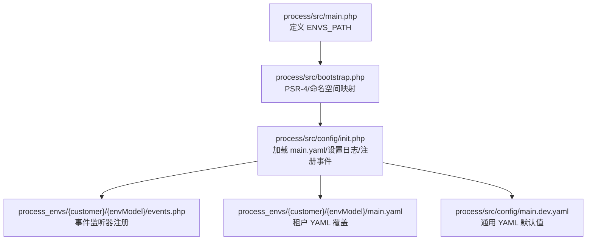
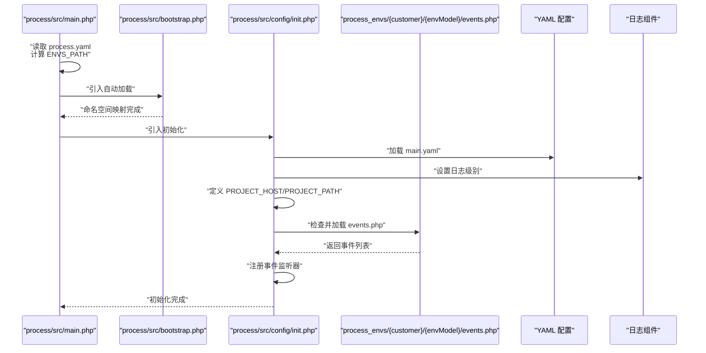
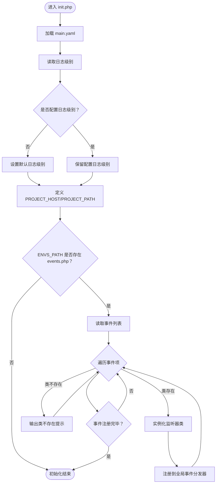
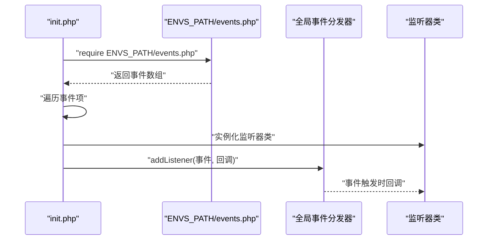
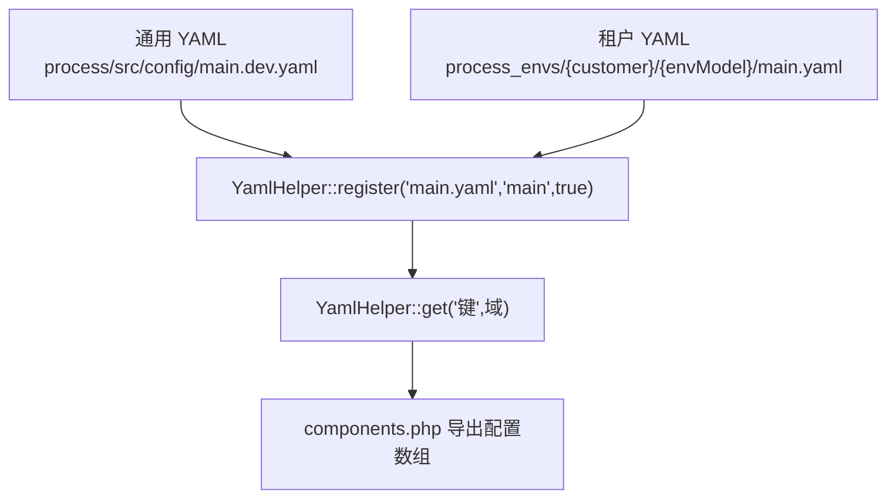
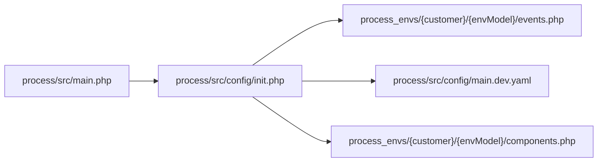

# 多租户配置

<cite>
**本文引用的文件**
- [process/src/main.php](file://process/src/main.php)
- [process/src/bootstrap.php](file://process/src/bootstrap.php)
- [process/src/config/init.php](file://process/src/config/init.php)
- [process/src/config/main.dev.yaml](file://process/src/config/main.dev.yaml)
- [process/src/config/process.dev.yaml](file://process/src/config/process.dev.yaml)
- [process/src/config/process.prod.yaml](file://process/src/config/process.prod.yaml)
- [process_envs/bistu/product/events.php](file://process_envs/bistu/product/events.php)
- [process_envs/bit/product/events.php](file://process_envs/bit/product/events.php)
- [process_envs/bjmu/product/events.php](file://process_envs/bjmu/product/events.php)
- [process_envs/bit/product/components.php](file://process_envs/bit/product/components.php)
</cite>

## 目录
1. [引言](#引言)
2. [项目结构](#项目结构)
3. [核心组件](#核心组件)
4. [架构总览](#架构总览)
5. [详细组件分析](#详细组件分析)
6. [依赖分析](#依赖分析)
7. [性能考虑](#性能考虑)
8. [故障排查指南](#故障排查指南)
9. [结论](#结论)
10. [附录](#附录)

## 引言
本文件围绕多租户配置管理展开，重点解析以下方面：
- 初始化流程：如何基于运行参数确定租户与环境，加载配置与事件监听器。
- 配置加载顺序与默认值：主配置、业务配置、租户覆盖与事件注入的优先级与合并策略。
- 多租户组织方式：以“客户标识/环境模型”为维度的目录结构与命名约定。
- 客户化覆盖机制：租户级 YAML 与 PHP 文件如何覆盖通用配置。
- 环境隔离策略：不同 customer/envModel 的路径隔离与事件注册隔离。
- 配置继承关系：通用配置与租户配置的继承与覆盖规则。
- 最佳实践、冲突解决与动态更新：如何安全地进行配置变更与事件扩展。

## 项目结构
多租户配置由“运行入口 → 自动加载 → 初始化 → 配置与事件注入”的链路构成。核心路径与职责如下：
- 运行入口：根据 process.yaml 中的 customer 与 envModel 组合生成 ENVS_PATH，指向 process_envs 下的租户目录。
- 自动加载：按命名空间映射到 vendor、runtime、envs 等目录，实现租户 PHP 文件的按需加载。
- 初始化：加载 main.yaml，设置日志级别与全局主机信息；按 ENVS_PATH 注册事件监听器。
- 配置与覆盖：通用 YAML 在 src/config 下，租户 YAML 在 process_envs/{customer}/{envModel}/ 下，后者可覆盖前者。

图表来源
- [process/src/main.php](file://process/src/main.php#L1-L25)
- [process/src/bootstrap.php](file://process/src/bootstrap.php#L1-L40)
- [process/src/config/init.php](file://process/src/config/init.php#L1-L48)
- [process/src/config/main.dev.yaml](file://process/src/config/main.dev.yaml#L1-L97)

章节来源
- [process/src/main.php](file://process/src/main.php#L1-L25)
- [process/src/bootstrap.php](file://process/src/bootstrap.php#L1-L40)
- [process/src/config/init.php](file://process/src/config/init.php#L1-L48)
- [process/src/config/main.dev.yaml](file://process/src/config/main.dev.yaml#L1-L97)

## 核心组件
- 运行入口与租户定位
  - 依据 process.yaml 中的 customer 与 envModel 组合计算 ENVS_PATH，确保每个租户与环境拥有独立的配置与事件目录。
- 自动加载与租户文件可见性
  - 通过命名空间前缀 envs 映射至 ENVS_PATH，使租户 PHP 文件（如 events.php、components.php）可被框架按需加载。
- 初始化流程与事件注入
  - 加载 main.yaml 并设置日志级别与全局主机信息；若 ENVS_PATH 存在 events.php，则读取并注册事件监听器。
- 配置层次与默认值
  - 通用 YAML 提供默认值；租户 YAML 通过 YamlHelper::register 与 get 的组合实现覆盖；components.php 可将租户 YAML 导出为组件配置。

章节来源
- [process/src/main.php](file://process/src/main.php#L1-L25)
- [process/src/bootstrap.php](file://process/src/bootstrap.php#L1-L40)
- [process/src/config/init.php](file://process/src/config/init.php#L1-L48)
- [process/src/config/main.dev.yaml](file://process/src/config/main.dev.yaml#L1-L97)
- [process/src/config/process.dev.yaml](file://process/src/config/process.dev.yaml#L1-L89)
- [process/src/config/process.prod.yaml](file://process/src/config/process.prod.yaml#L1-L80)

## 架构总览
下图展示了多租户配置在启动阶段的关键交互：入口脚本决定租户与环境，自动加载器解析命名空间，初始化模块加载 YAML 并注册事件，最终形成“通用配置 + 租户覆盖”的最终配置集。

图表来源
- [process/src/main.php](file://process/src/main.php#L1-L25)
- [process/src/bootstrap.php](file://process/src/bootstrap.php#L1-L40)
- [process/src/config/init.php](file://process/src/config/init.php#L1-L48)
- [process_envs/bistu/product/events.php](file://process_envs/bistu/product/events.php#L1-L37)

## 详细组件分析

### 初始化配置机制（init.php）
- 环境检测与路径
  - 通过 ENVS_PATH 获取当前租户与环境的事件与配置目录，确保事件注册与配置覆盖仅作用于当前租户/环境。
- 配置加载顺序
  - 先加载 main.yaml（通用），再读取日志级别；若未显式设置则采用默认级别。
  - 定义全局常量 PROJECT_HOST 与 PROJECT_PATH，便于后续组件使用。
- 事件注册
  - 若 ENVS_PATH 下存在 events.php，则逐条读取并实例化监听器，注册到全局事件分发器。
  - 对不存在的监听器类进行容错输出，避免中断初始化流程。
- 默认值设置
  - 日志级别未配置时采用默认值；主机信息来源于 main.yaml 的 common.schema 与 common.host。

图表来源
- [process/src/config/init.php](file://process/src/config/init.php#L1-L48)

章节来源
- [process/src/config/init.php](file://process/src/config/init.php#L1-L48)

### process.yaml 与 ENVS_PATH 的关系
- 运行入口读取 process.yaml，从中提取 customer 与 envModel，拼接得到 ENVS_PATH。
- 该路径用于后续自动加载与事件注册，确保租户与环境隔离。

章节来源
- [process/src/main.php](file://process/src/main.php#L1-L25)
- [process/src/config/process.dev.yaml](file://process/src/config/process.dev.yaml#L1-L89)
- [process/src/config/process.prod.yaml](file://process/src/config/process.prod.yaml#L1-L80)

### 自动加载与租户文件可见性（bootstrap.php）
- 命名空间映射
  - envs 前缀映射到 ENVS_PATH，使得 process_envs 下的 PHP 文件可被框架按需加载。
- 类加载策略
  - 支持 vendor、runtime、envs 等目录的自动加载，增强租户自定义组件的可发现性。

章节来源
- [process/src/bootstrap.php](file://process/src/bootstrap.php#L1-L40)

### 事件注册与租户覆盖（events.php）
- 事件清单
  - 每个租户/环境的 events.php 返回事件数组，包含事件名、触发器类与配置。
- 注册流程
  - 初始化阶段读取 events.php，校验类是否存在，实例化后注册到全局事件分发器。
- 示例对比
  - 不同租户的事件清单差异体现了租户定制化能力，例如登录检查、流程变更等事件的监听器不同。

图表来源
- [process/src/config/init.php](file://process/src/config/init.php#L1-L48)
- [process_envs/bistu/product/events.php](file://process_envs/bistu/product/events.php#L1-L37)
- [process_envs/bit/product/events.php](file://process_envs/bit/product/events.php#L1-L29)
- [process_envs/bjmu/product/events.php](file://process_envs/bjmu/product/events.php#L1-L12)

章节来源
- [process_envs/bistu/product/events.php](file://process_envs/bistu/product/events.php#L1-L37)
- [process_envs/bit/product/events.php](file://process_envs/bit/product/events.php#L1-L29)
- [process_envs/bjmu/product/events.php](file://process_envs/bjmu/product/events.php#L1-L12)

### 配置层次与覆盖机制（YAML 与 components.php）
- 通用 YAML
  - main.dev.yaml 提供通用默认值，如日志级别、数据库连接、上传存储等。
- 租户 YAML
  - 租户目录下的 main.yaml 通过 YamlHelper::register 与 get 的组合实现覆盖。
- 组件导出
  - components.php 将租户 YAML 的键值导出为组件可用的配置数组，便于在业务中直接消费。

图表来源
- [process/src/config/main.dev.yaml](file://process/src/config/main.dev.yaml#L1-L97)
- [process_envs/bit/product/components.php](file://process_envs/bit/product/components.php#L1-L7)

章节来源
- [process/src/config/main.dev.yaml](file://process/src/config/main.dev.yaml#L1-L97)
- [process_envs/bit/product/components.php](file://process_envs/bit/product/components.php#L1-L7)

## 依赖分析
- 入口对配置与事件的依赖
  - ENVS_PATH 的正确性直接影响事件注册与租户 YAML 的可见性。
- 初始化对事件系统的依赖
  - 事件清单的完整性决定业务行为的可定制程度；缺失类的容错避免了启动失败。
- 配置对 YAML 辅助工具的依赖
  - YamlHelper 提供注册与读取能力，是通用与租户配置合并的关键。

图表来源
- [process/src/main.php](file://process/src/main.php#L1-L25)
- [process/src/config/init.php](file://process/src/config/init.php#L1-L48)
- [process/src/config/main.dev.yaml](file://process/src/config/main.dev.yaml#L1-L97)
- [process_envs/bit/product/components.php](file://process_envs/bit/product/components.php#L1-L7)

章节来源
- [process/src/main.php](file://process/src/main.php#L1-L25)
- [process/src/config/init.php](file://process/src/config/init.php#L1-L48)
- [process/src/config/main.dev.yaml](file://process/src/config/main.dev.yaml#L1-L97)
- [process_envs/bit/product/components.php](file://process_envs/bit/product/components.php#L1-L7)

## 性能考虑
- 事件注册的开销
  - 初始化阶段一次性注册事件监听器，运行期事件触发成本主要取决于监听器实现。
- YAML 解析与缓存
  - 建议在生产环境对 YAML 解析结果进行缓存或预热，减少重复解析带来的开销。
- 自动加载命中率
  - 通过合理的命名空间与文件组织，提升自动加载命中率，降低磁盘 IO。

## 故障排查指南
- 事件类不存在
  - 现象：初始化时输出“事件类不存在”提示。
  - 排查：确认 ENVS_PATH 下 events.php 中的类名是否正确，且已通过自动加载器可访问。
- ENVS_PATH 未生效
  - 现象：事件未注册、租户 YAML 未生效。
  - 排查：确认 process.yaml 的 customer 与 envModel 正确，且 ENVS_PATH 拼接逻辑无误。
- 日志级别异常
  - 现象：日志输出不符合预期。
  - 排查：确认 main.yaml 中 log.logLevel 的配置，或接受默认级别。
- 组件配置为空
  - 现象：业务组件读取不到租户配置。
  - 排查：确认租户 main.yaml 已注册，components.php 的键名与域一致。

章节来源
- [process/src/config/init.php](file://process/src/config/init.php#L1-L48)
- [process/src/main.php](file://process/src/main.php#L1-L25)
- [process/src/config/main.dev.yaml](file://process/src/config/main.dev.yaml#L1-L97)
- [process_envs/bit/product/components.php](file://process_envs/bit/product/components.php#L1-L7)

## 结论
该多租户配置体系通过“运行入口 → 自动加载 → 初始化 → 事件与配置覆盖”的链路，实现了租户与环境的强隔离与灵活定制。通用 YAML 提供默认值，租户 YAML 与 PHP 文件提供覆盖与扩展点，事件系统支持业务行为的按租户定制。遵循本文的最佳实践与排障建议，可在保证稳定性的前提下高效迭代多租户能力。

## 附录
- 最佳实践
  - 将不随版本变化的静态配置放入通用 YAML；仅将易变配置放入租户 YAML。
  - 使用 components.php 将租户 YAML 导出为组件配置，避免在业务层直接依赖路径。
  - 事件监听器类名与路径保持稳定，确保自动加载器可正确解析。
- 冲突解决
  - 当通用与租户同时配置同一键时，租户 YAML 优先；若租户未配置，则回退到通用默认值。
- 动态更新方案
  - 业务配置文件（如 http.php、queue.php）支持热更新；但涉及进程类与配置文件的变更仍需重启主进程。