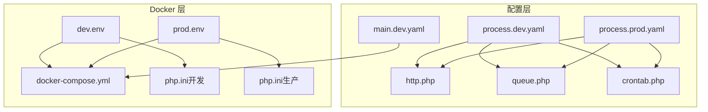
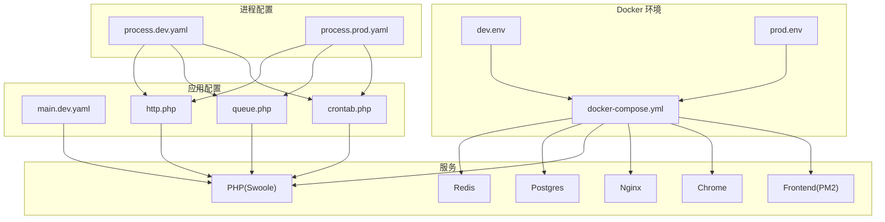
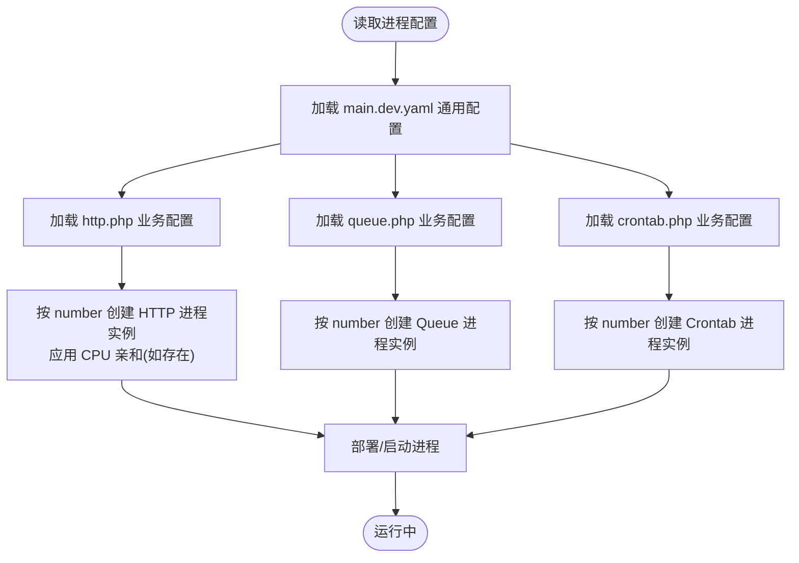
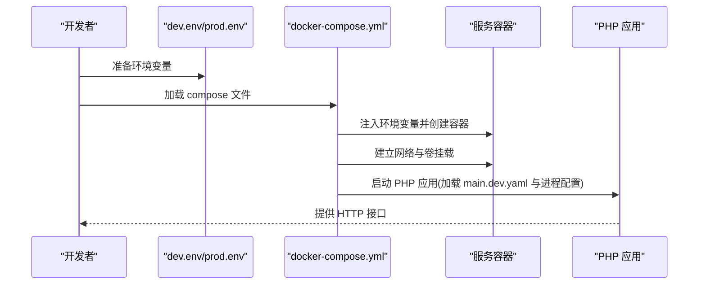
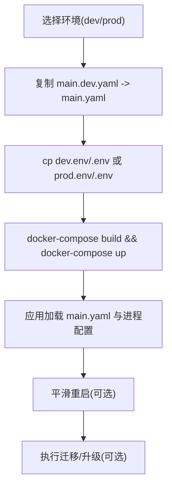
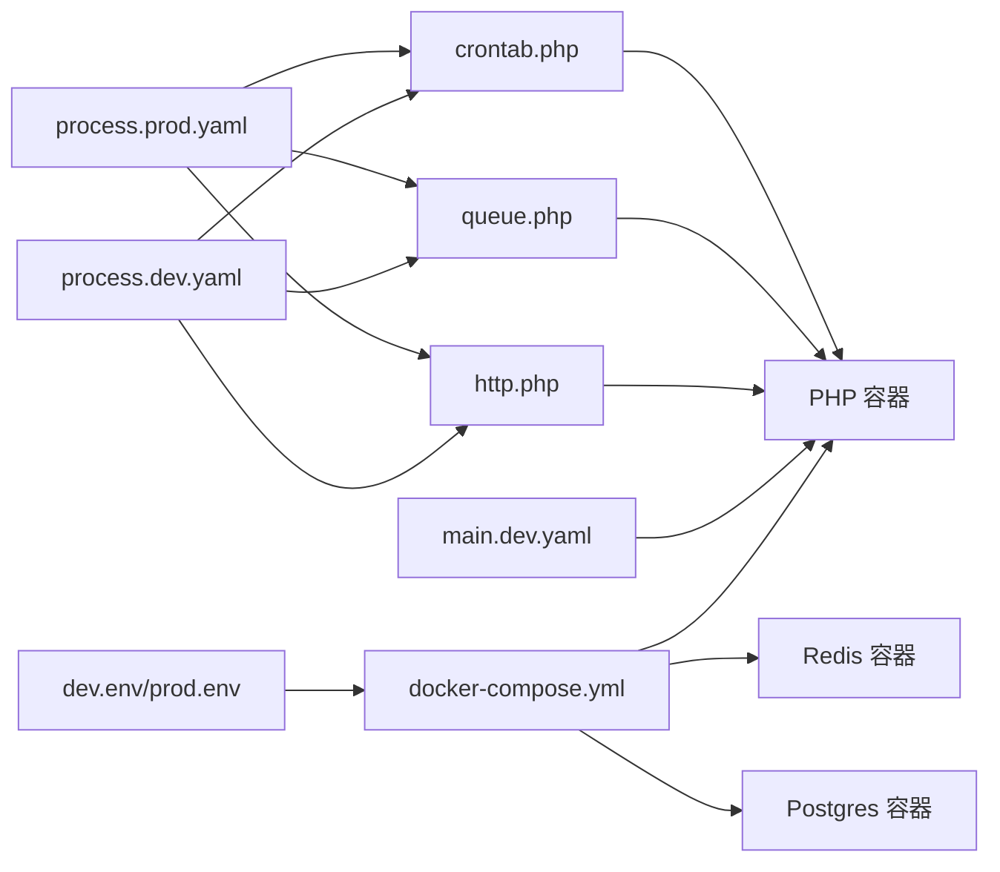

# 环境配置管理

<cite>
**本文引用的文件**
- [process.dev.yaml](file://process/src/config/process.dev.yaml)
- [process.prod.yaml](file://process/src/config/process.prod.yaml)
- [dev.env](file://process/docker/dev.env)
- [prod.env](file://process/docker/prod.env)
- [docker-compose.yml](file://process/docker/docker-compose.yml)
- [main.dev.yaml](file://process/src/config/main.dev.yaml)
- [http.php](file://process/src/config/http.php)
- [queue.php](file://process/src/config/queue.php)
- [crontab.php](file://process/src/config/crontab.php)
- [php.ini（开发）](file://process/docker/services/php/php.ini)
- [php.ini（生产）](file://process/docker/services/php.prod/php.ini)
- [README.MD](file://process/README.MD)
</cite>

## 目录
1. [引言](#引言)
2. [项目结构](#项目结构)
3. [核心组件](#核心组件)
4. [架构总览](#架构总览)
5. [详细组件分析](#详细组件分析)
6. [依赖关系分析](#依赖关系分析)
7. [性能考量](#性能考量)
8. [故障排查指南](#故障排查指南)
9. [结论](#结论)
10. [附录](#附录)

## 引言
本文件围绕“环境配置管理”目标，系统梳理并解释以下内容：
- 进程配置参数：进程数量、CPU亲和、业务配置文件挂载与热更新策略
- Docker 环境变量：数据库、缓存、第三方服务、前端与静态资源路径
- 环境切换机制：dev/prod 的差异与选择策略
- 配置验证与部署流程：初始化、平滑重启、数据库迁移与升级
- 最佳实践与配置模板：如何安全地维护与扩展配置
- 自动化部署脚本：基于仓库提供的命令与流程

## 项目结构
该仓库采用“按层/功能”组织方式，核心与环境配置集中在以下位置：
- 进程与运行时配置：process/src/config/process.dev.yaml、process.prod.yaml
- Docker 环境变量与编排：process/docker/dev.env、prod.env、docker-compose.yml
- 应用通用配置：process/src/config/main.dev.yaml
- 进程级业务配置加载：process/src/config/http.php、queue.php、crontab.php
- PHP 运行时配置：开发与生产两套 php.ini
- 说明与运维脚本：process/README.MD

图表来源
- [process.dev.yaml](file://process/src/config/process.dev.yaml#L1-L89)
- [process.prod.yaml](file://process/src/config/process.prod.yaml#L1-L80)
- [main.dev.yaml](file://process/src/config/main.dev.yaml#L1-L97)
- [http.php](file://process/src/config/http.php#L1-L27)
- [queue.php](file://process/src/config/queue.php#L1-L13)
- [crontab.php](file://process/src/config/crontab.php#L1-L10)
- [dev.env](file://process/docker/dev.env#L1-L50)
- [prod.env](file://process/docker/prod.env#L1-L46)
- [docker-compose.yml](file://process/docker/docker-compose.yml#L1-L150)
- [php.ini（开发）](file://process/docker/services/php/php.ini#L1-L152)
- [php.ini（生产）](file://process/docker/services/php.prod/php.ini#L1-L152)

章节来源
- [process.dev.yaml](file://process/src/config/process.dev.yaml#L1-L89)
- [process.prod.yaml](file://process/src/config/process.prod.yaml#L1-L80)
- [dev.env](file://process/docker/dev.env#L1-L50)
- [prod.env](file://process/docker/prod.env#L1-L46)
- [docker-compose.yml](file://process/docker/docker-compose.yml#L1-L150)
- [main.dev.yaml](file://process/src/config/main.dev.yaml#L1-L97)
- [http.php](file://process/src/config/http.php#L1-L27)
- [queue.php](file://process/src/config/queue.php#L1-L13)
- [crontab.php](file://process/src/config/crontab.php#L1-L10)
- [php.ini（开发）](file://process/docker/services/php/php.ini#L1-L152)
- [php.ini（生产）](file://process/docker/services/php.prod/php.ini#L1-L152)
- [README.MD](file://process/README.MD#L1-L158)

## 核心组件
- 进程配置文件
  - process.dev.yaml：开发环境进程清单与数量建议，包含 http、queue、crontab 等进程；提供业务配置文件挂载与热更新提示
  - process.prod.yaml：生产环境进程清单，包含 http、deploy、queue、crontab 等进程；提供 CPU 亲和与部署提取路径
- Docker 环境变量
  - dev.env/prod.env：集中定义 REDIS、NGINX、PHP、POSTGRES、CHROME、FRONTEND 等服务的镜像版本、端口、日志与数据卷路径
  - docker-compose.yml：将上述变量注入容器，定义服务间依赖与网络别名
- 应用通用配置
  - main.dev.yaml：数据库、Redis、上传存储、队列消费者默认值、日志级别等
- 进程级业务配置加载
  - http.php、queue.php、crontab.php：通过 YAML Helper 加载对应模块的配置，并合并组件配置

章节来源
- [process.dev.yaml](file://process/src/config/process.dev.yaml#L1-L89)
- [process.prod.yaml](file://process/src/config/process.prod.yaml#L1-L80)
- [dev.env](file://process/docker/dev.env#L1-L50)
- [prod.env](file://process/docker/prod.env#L1-L46)
- [docker-compose.yml](file://process/docker/docker-compose.yml#L1-L150)
- [main.dev.yaml](file://process/src/config/main.dev.yaml#L1-L97)
- [http.php](file://process/src/config/http.php#L1-L27)
- [queue.php](file://process/src/config/queue.php#L1-L13)
- [crontab.php](file://process/src/config/crontab.php#L1-L10)

## 架构总览
下图展示“进程配置 → Docker 环境变量 → 编排与服务”的整体关系，以及应用配置对进程行为的影响。

图表来源
- [process.dev.yaml](file://process/src/config/process.dev.yaml#L1-L89)
- [process.prod.yaml](file://process/src/config/process.prod.yaml#L1-L80)
- [dev.env](file://process/docker/dev.env#L1-L50)
- [prod.env](file://process/docker/prod.env#L1-L46)
- [docker-compose.yml](file://process/docker/docker-compose.yml#L1-L150)
- [main.dev.yaml](file://process/src/config/main.dev.yaml#L1-L97)
- [http.php](file://process/src/config/http.php#L1-L27)
- [queue.php](file://process/src/config/queue.php#L1-L13)
- [crontab.php](file://process/src/config/crontab.php#L1-L10)

## 详细组件分析

### 进程配置参数（process.dev.yaml 与 process.prod.yaml）
- 运行时与日志目录
  - runtimePath、logPath：统一定义运行时与日志根目录，便于容器挂载与持久化
- 项目标识与环境模型
  - project、customer、envModel：用于部署系统识别项目、客户与环境类型
- 进程清单与数量
  - http：开发环境通常 1 个，生产环境 3 个；生产环境提供 CPU 亲和数组，确保主服务独占核心
  - queue：通用队列进程，数量 1
  - crontab：计划任务进程，数量 1
  - deploy：生产环境启用部署进程，配置提取路径与私钥字段
  - watcher：开发环境可选的文件监控进程，用于自动重启工作进程（注释掉的示例）
- 业务配置文件挂载
  - http、queue、crontab 进程均支持通过 configFile 指向各自业务配置文件，实现“修改业务配置无需重启主进程”

图表来源
- [process.dev.yaml](file://process/src/config/process.dev.yaml#L1-L89)
- [process.prod.yaml](file://process/src/config/process.prod.yaml#L1-L80)
- [http.php](file://process/src/config/http.php#L1-L27)
- [queue.php](file://process/src/config/queue.php#L1-L13)
- [crontab.php](file://process/src/config/crontab.php#L1-L10)
- [main.dev.yaml](file://process/src/config/main.dev.yaml#L1-L97)

章节来源
- [process.dev.yaml](file://process/src/config/process.dev.yaml#L1-L89)
- [process.prod.yaml](file://process/src/config/process.prod.yaml#L1-L80)
- [http.php](file://process/src/config/http.php#L1-L27)
- [queue.php](file://process/src/config/queue.php#L1-L13)
- [crontab.php](file://process/src/config/crontab.php#L1-L10)
- [main.dev.yaml](file://process/src/config/main.dev.yaml#L1-L97)

### Docker 环境变量与服务配置
- Redis
  - 镜像版本、端口映射、配置文件、日志与数据卷路径均由 dev.env/prod.env 统一管理
- Nginx
  - 版本、端口映射、域名、日志与配置文件路径、公共目录挂载
- PHP
  - 镜像版本、容器名、源码与公共目录挂载、运行时与日志目录、PHP 配置文件挂载
  - 通过 PROCESS_CONF 指向 process.dev.yaml 或 process.prod.yaml
- Postgres
  - 用户名、密码、初始化脚本、数据卷与配置文件
- Chrome
  - 镜像版本、数据与日志目录
- Frontend
  - 前端目录与 PM2 启动配置
- docker-compose.yml
  - 将上述变量注入容器，定义服务间依赖（php 依赖 redis、postgres、chrome），网络别名与暴露端口

图表来源
- [dev.env](file://process/docker/dev.env#L1-L50)
- [prod.env](file://process/docker/prod.env#L1-L46)
- [docker-compose.yml](file://process/docker/docker-compose.yml#L1-L150)
- [main.dev.yaml](file://process/src/config/main.dev.yaml#L1-L97)
- [process.dev.yaml](file://process/src/config/process.dev.yaml#L1-L89)
- [process.prod.yaml](file://process/src/config/process.prod.yaml#L1-L80)

章节来源
- [dev.env](file://process/docker/dev.env#L1-L50)
- [prod.env](file://process/docker/prod.env#L1-L46)
- [docker-compose.yml](file://process/docker/docker-compose.yml#L1-L150)
- [main.dev.yaml](file://process/src/config/main.dev.yaml#L1-L97)

### 应用配置与进程行为
- 数据库与缓存
  - main.dev.yaml 定义 PostgreSQL 连接参数与 Redis 连接参数，供 PHP 应用使用
- 上传与对象存储
  - MinIO 端点、访问密钥、桶名等，用于文件上传
- 队列消费者默认值
  - queue.php 从 YAML 读取默认消费者并发数，影响队列处理能力
- 日志级别
  - main.dev.yaml 提供日志级别配置入口

章节来源
- [main.dev.yaml](file://process/src/config/main.dev.yaml#L1-L97)
- [queue.php](file://process/src/config/queue.php#L1-L13)

### 环境切换机制与部署流程
- 环境切换
  - 通过复制 main.dev.yaml 为 main.yaml 并在 dev.env/prod.env 之间切换 .env 实现
  - docker-compose.yml 通过变量控制 PHP 镜像版本、进程配置文件与前端目录
- 平滑重启
  - README.MD 提供使用信号触发平滑重启的工作进程方式
- 数据库迁移与升级
  - README.MD 提供创建与执行迁移脚本的命令示例

图表来源
- [README.MD](file://process/README.MD#L1-L158)
- [docker-compose.yml](file://process/docker/docker-compose.yml#L1-L150)
- [process.dev.yaml](file://process/src/config/process.dev.yaml#L1-L89)
- [process.prod.yaml](file://process/src/config/process.prod.yaml#L1-L80)

章节来源
- [README.MD](file://process/README.MD#L1-L158)
- [docker-compose.yml](file://process/docker/docker-compose.yml#L1-L150)

## 依赖关系分析
- 进程配置对业务配置的依赖
  - http.php、queue.php、crontab.php 通过 YAML Helper 读取对应模块配置，再合并组件配置
- Docker 编排对环境变量的依赖
  - docker-compose.yml 通过 ${VAR} 形式引用 dev.env/prod.env 中的变量，决定服务镜像、端口、卷与网络
- 应用配置对服务的依赖
  - main.dev.yaml 中的 db、redis、upload 等配置直接影响 PHP 应用连接外部服务的能力

图表来源
- [process.dev.yaml](file://process/src/config/process.dev.yaml#L1-L89)
- [process.prod.yaml](file://process/src/config/process.prod.yaml#L1-L80)
- [http.php](file://process/src/config/http.php#L1-L27)
- [queue.php](file://process/src/config/queue.php#L1-L13)
- [crontab.php](file://process/src/config/crontab.php#L1-L10)
- [dev.env](file://process/docker/dev.env#L1-L50)
- [prod.env](file://process/docker/prod.env#L1-L46)
- [docker-compose.yml](file://process/docker/docker-compose.yml#L1-L150)
- [main.dev.yaml](file://process/src/config/main.dev.yaml#L1-L97)

章节来源
- [process.dev.yaml](file://process/src/config/process.dev.yaml#L1-L89)
- [process.prod.yaml](file://process/src/config/process.prod.yaml#L1-L80)
- [http.php](file://process/src/config/http.php#L1-L27)
- [queue.php](file://process/src/config/queue.php#L1-L13)
- [crontab.php](file://process/src/config/crontab.php#L1-L10)
- [dev.env](file://process/docker/dev.env#L1-L50)
- [prod.env](file://process/docker/prod.env#L1-L46)
- [docker-compose.yml](file://process/docker/docker-compose.yml#L1-L150)
- [main.dev.yaml](file://process/src/config/main.dev.yaml#L1-L97)

## 性能考量
- 进程数量与 CPU 亲和
  - 生产环境 http 进程数量与亲和配置有助于隔离主服务与其它进程，避免争抢 CPU
- PHP 内存限制
  - 开发环境 php.ini memory_limit 为 128M，生产环境为 256M；应结合业务峰值合理调整
- I/O 与持久化
  - runtime 与 log 目录通过卷挂载到宿主机，建议定期清理与容量监控
- 数据库与缓存
  - main.dev.yaml 中的 db、redis 参数需与容器端口映射一致，避免连接失败

章节来源
- [process.prod.yaml](file://process/src/config/process.prod.yaml#L1-L80)
- [php.ini（开发）](file://process/docker/services/php/php.ini#L1-L152)
- [php.ini（生产）](file://process/docker/services/php.prod/php.ini#L1-L152)
- [main.dev.yaml](file://process/src/config/main.dev.yaml#L1-L97)

## 故障排查指南
- 进程未按预期启动
  - 检查 process.dev.yaml/process.prod.yaml 中进程数量与亲和配置是否合理
  - 确认 http.php/queue.php/crontab.php 的 configFile 路径正确且可读
- 数据库连接失败
  - 核对 main.dev.yaml 中 db.host/port/user/password 与 docker-compose.yml 的端口映射一致
- Redis 连接异常
  - 核对 main.dev.yaml 中 redis.host/port 与容器网络别名一致
- 平滑重启无效
  - 参考 README.MD 中的信号重启方式，确认目标容器名称与信号正确
- 迁移失败
  - 参考 README.MD 中的迁移命令，确保数据库已初始化且权限正确

章节来源
- [process.dev.yaml](file://process/src/config/process.dev.yaml#L1-L89)
- [process.prod.yaml](file://process/src/config/process.prod.yaml#L1-L80)
- [http.php](file://process/src/config/http.php#L1-L27)
- [queue.php](file://process/src/config/queue.php#L1-L13)
- [crontab.php](file://process/src/config/crontab.php#L1-L10)
- [main.dev.yaml](file://process/src/config/main.dev.yaml#L1-L97)
- [README.MD](file://process/README.MD#L1-L158)

## 结论
本项目通过“进程配置文件 + Docker 环境变量 + 编排文件 + 应用配置”的分层设计，实现了清晰的环境隔离与可扩展的部署流程。开发与生产环境在进程数量、CPU 亲和、镜像版本与错误输出等方面存在显著差异，建议严格遵循仓库提供的切换与运维流程，配合平滑重启与迁移命令，保障线上稳定运行。

## 附录
- 环境切换最佳实践
  - 在 dev 环境使用较小的进程数量与更高的错误输出，便于调试
  - 在 prod 环境启用 CPU 亲和、禁用不必要的开发工具与错误输出
  - 使用 .env 切换时，确保 main.yaml 与进程配置文件指向正确
- 配置模板建议
  - 为每个环境维护独立的 dev.env/prod.env，并在 CI 中按环境注入变量
  - 将敏感信息（如数据库密码、第三方凭据）放入环境变量而非硬编码
- 自动化部署脚本要点
  - 使用 README.MD 中的命令完成构建、启动与迁移
  - 对于生产环境，优先使用平滑重启减少停机时间

章节来源
- [README.MD](file://process/README.MD#L1-L158)
- [dev.env](file://process/docker/dev.env#L1-L50)
- [prod.env](file://process/docker/prod.env#L1-L46)
- [docker-compose.yml](file://process/docker/docker-compose.yml#L1-L150)