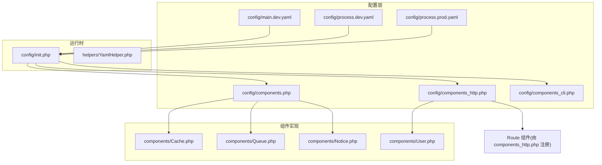
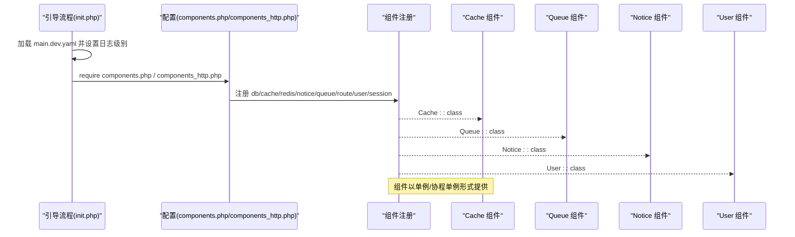
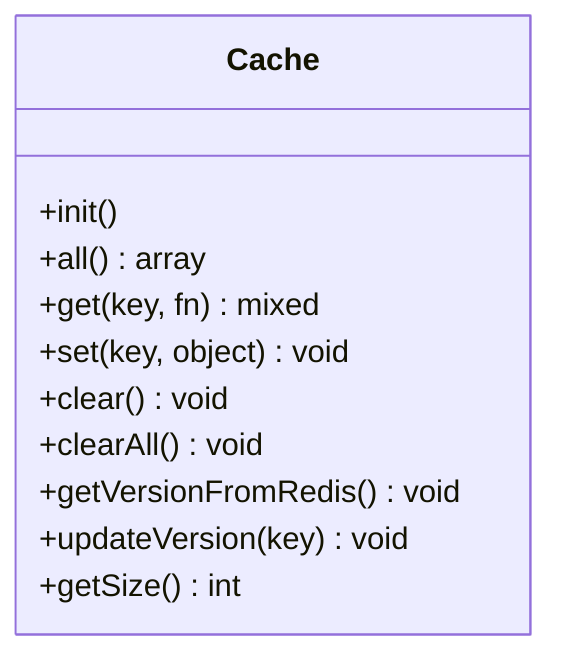
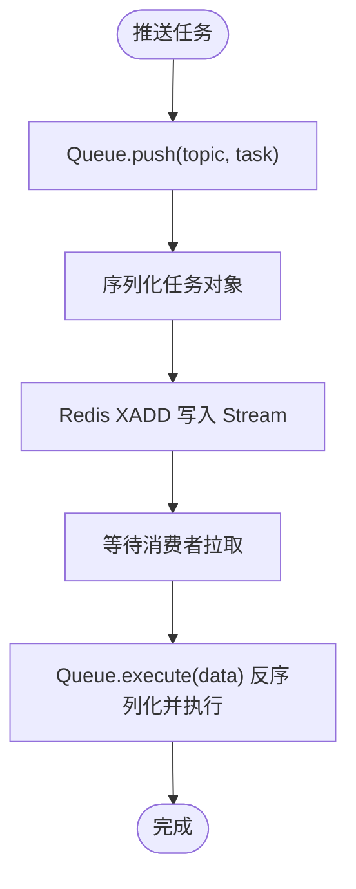
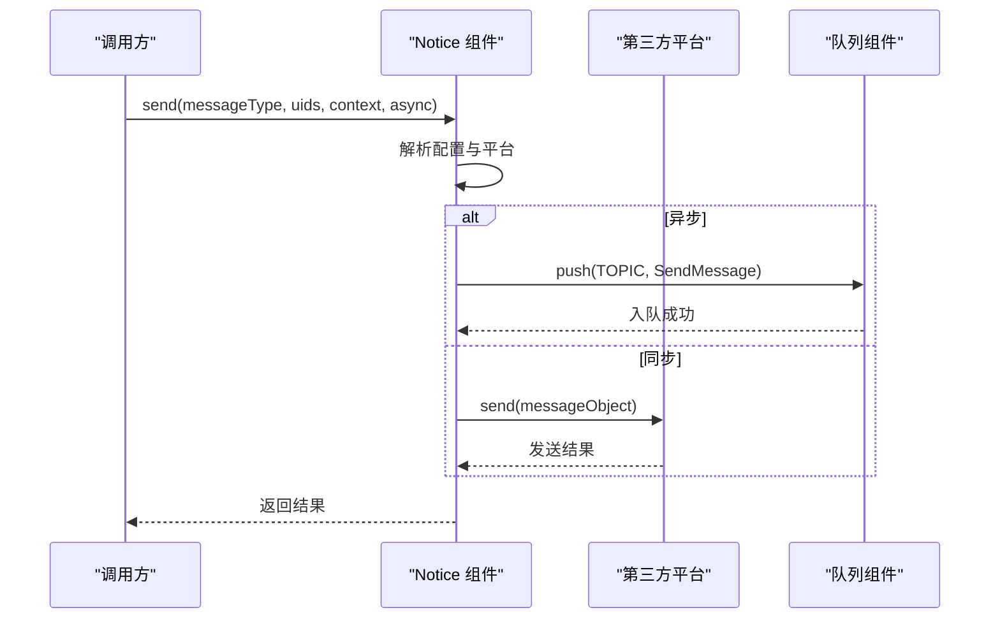
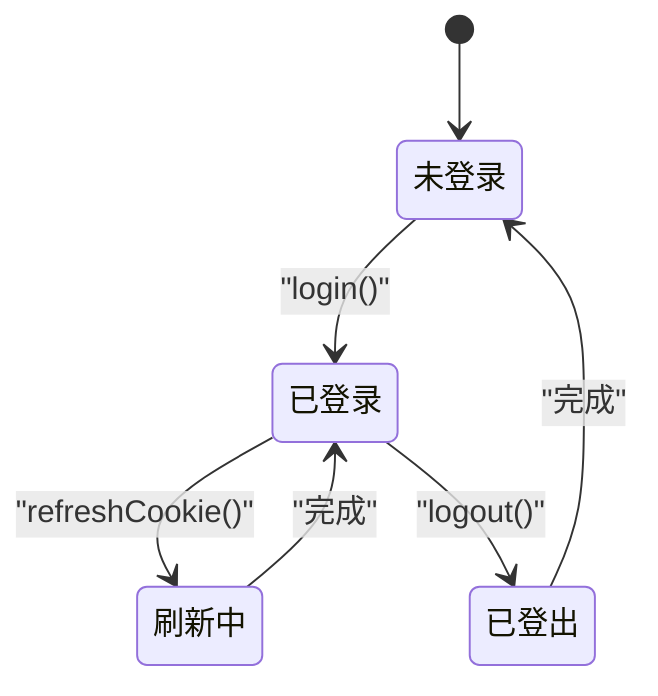
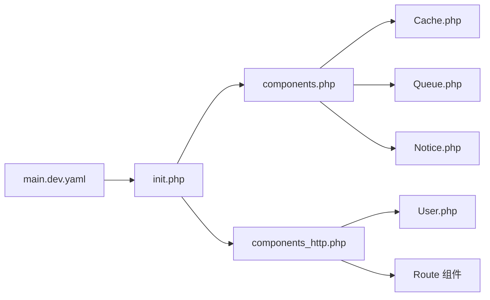

# 组件配置

<cite>
**本文引用的文件**
- [components.php](file://process/src/config/components.php)
- [components_http.php](file://process/src/config/components_http.php)
- [components_cli.php](file://process/src/config/components_cli.php)
- [Cache.php](file://process/src/components/Cache.php)
- [Queue.php](file://process/src/components/Queue.php)
- [Notice.php](file://process/src/components/Notice.php)
- [User.php](file://process/src/components/User.php)
- [init.php](file://process/src/config/init.php)
- [YamlHelper.php](file://process/src/helpers/YamlHelper.php)
- [main.dev.yaml](file://process/src/config/main.dev.yaml)
- [process.dev.yaml](file://process/src/config/process.dev.yaml)
- [process.prod.yaml](file://process/src/config/process.prod.yaml)
</cite>

## 目录
1. [引言](#引言)
2. [项目结构](#项目结构)
3. [核心组件](#核心组件)
4. [架构总览](#架构总览)
5. [详细组件分析](#详细组件分析)
6. [依赖关系分析](#依赖关系分析)
7. [性能考量](#性能考量)
8. [故障排查指南](#故障排查指南)
9. [结论](#结论)
10. [附录](#附录)

## 引言
本文件围绕组件配置系统进行深入解析，重点覆盖以下方面：
- components.php、components_http.php、components_cli.php 的配置结构与参数语义
- 数据库连接、Redis、缓存、队列、通知等组件的配置要点与使用方式
- 组件注册机制、依赖注入原理与生命周期管理
- 最佳实践、性能优化建议与常见配置错误的解决方案

## 项目结构
组件配置位于配置目录，结合 YAML 配置与运行时注册机制，形成“配置驱动 + 单例/协程单例”的组件体系。关键文件如下：
- 配置入口：components.php、components_http.php、components_cli.php
- 运行初始化：init.php 负责注册 YAML、日志级别、事件分发器等
- 组件实现：Cache、Queue、Notice、User 等
- YAML 配置：main.dev.yaml 提供 db、redis、queue、log 等基础配置；process.dev.yaml/prod.yaml 描述进程模型与业务配置文件路径

图表来源
- [components.php](file://process/src/config/components.php#L1-L34)
- [components_http.php](file://process/src/config/components_http.php#L1-L33)
- [components_cli.php](file://process/src/config/components_cli.php#L1-L3)
- [init.php](file://process/src/config/init.php#L1-L48)
- [YamlHelper.php](file://process/src/helpers/YamlHelper.php#L1-L8)
- [main.dev.yaml](file://process/src/config/main.dev.yaml#L1-L97)
- [process.dev.yaml](file://process/src/config/process.dev.yaml#L1-L89)
- [process.prod.yaml](file://process/src/config/process.prod.yaml#L1-L80)

章节来源
- [components.php](file://process/src/config/components.php#L1-L34)
- [components_http.php](file://process/src/config/components_http.php#L1-L33)
- [components_cli.php](file://process/src/config/components_cli.php#L1-L3)
- [init.php](file://process/src/config/init.php#L1-L48)
- [YamlHelper.php](file://process/src/helpers/YamlHelper.php#L1-L8)
- [main.dev.yaml](file://process/src/config/main.dev.yaml#L1-L97)
- [process.dev.yaml](file://process/src/config/process.dev.yaml#L1-L89)
- [process.prod.yaml](file://process/src/config/process.prod.yaml#L1-L80)

## 核心组件
本节聚焦三大配置文件的结构与参数含义，并结合 YAML 配置说明数据库、Redis、缓存、队列、通知等组件的配置要点。

- components.php
  - 数据库配置：通过 YAML 获取 db.main 并注入到组件配置数组中，作为 db 组件的配置来源
  - 缓存组件：以 Cache 类作为缓存组件实现
  - Redis 配置：提供两个键值对
    - redis：启用非序列化模式，适合存储字符串/数字
    - sredis：启用序列化模式，适合存储数组
  - 通知组件：以 Notice 类作为通知组件实现
  - 队列组件：以 Queue 类作为队列组件实现
  - 环境合并：若存在 ENVS_PATH/components.php，则与默认配置合并

- components_http.php
  - 路由组件：注册 Route 类，规则数组支持正则匹配与控制器映射
  - 用户组件：注册 User 类，负责登录态、匿名访问、Cookie 签发与校验
  - 会话组件：注册 Session 类，用于会话管理

- components_cli.php
  - 当前为空数组，表示 CLI 场景下暂无额外组件注册

- YAML 配置要点
  - 数据库：db.class、db.schemaClass、db.config.user/password/host/port/dbname
  - Redis：redis.host、redis.port（可选认证字段）
  - 队列：queue.consumer.common/high/low 默认消费者数量
  - 日志：log.logLevel
  - 权限与上传：permission.auth.expire、upload.* 等

章节来源
- [components.php](file://process/src/config/components.php#L1-L34)
- [components_http.php](file://process/src/config/components_http.php#L1-L33)
- [components_cli.php](file://process/src/config/components_cli.php#L1-L3)
- [main.dev.yaml](file://process/src/config/main.dev.yaml#L1-L97)

## 架构总览
组件配置采用“配置驱动 + 运行时注册”的模式：
- init.php 在应用启动时加载 YAML 并注册全局日志级别、事件分发器等
- components.php 将 db、cache、redis、notice、queue 等组件注册为可按名称获取的单例/协程单例
- components_http.php 将 route、user、session 等组件注册到 HTTP 生命周期中
- 组件内部通过静态方法或全局辅助函数（如 redis()、queue()、logger()）访问底层资源

图表来源
- [init.php](file://process/src/config/init.php#L1-L48)
- [components.php](file://process/src/config/components.php#L1-L34)
- [components_http.php](file://process/src/config/components_http.php#L1-L33)

## 详细组件分析

### 数据库连接配置
- 配置来源
  - YAML 中 db.class、db.schemaClass、db.config.* 定义连接参数
  - components.php 通过 YAML 读取 db.main 并注入到 db 组件配置
- 参数说明
  - class：数据库连接类
  - schemaClass：数据库架构类
  - config.user/password/host/port/dbname：连接凭据与目标库
- 使用方式
  - 通过 db 组件名在运行时获取连接实例（由框架注册机制提供）

章节来源
- [main.dev.yaml](file://process/src/config/main.dev.yaml#L23-L32)
- [components.php](file://process/src/config/components.php#L8-L11)

### Redis 配置与差异
- 配置来源
  - YAML 中 redis.host、redis.port 定义 Redis 连接参数
  - components.php 提供两套键值对：
    - redis：非序列化模式，适合字符串/数字
    - sredis：序列化模式，适合数组
- 使用建议
  - 存储简单键值对优先使用 redis
  - 存储复杂结构（数组/对象）使用 sredis

章节来源
- [main.dev.yaml](file://process/src/config/main.dev.yaml#L32-L37)
- [components.php](file://process/src/config/components.php#L5-L6)
- [components.php](file://process/src/config/components.php#L12-L17)

### 缓存组件配置与实现
- 组件注册
  - components.php 中 cache 键指向 Cache::class
- 实现要点
  - Cache 为单例，内部维护对象缓存与版本同步
  - 定时任务从 Redis 同步版本，清理过期对象
  - 通过 redis() 辅助函数与 Redis 交互
- 关键行为
  - get/set：基于内存与 Redis 的两级缓存
  - clear/clearAll：定时清理与全量清理
  - getVersionFromRedis：跨进程一致性维护（基于共享内存与互斥锁）

图表来源
- [Cache.php](file://process/src/components/Cache.php#L1-L136)

章节来源
- [components.php](file://process/src/config/components.php#L12-L14)
- [Cache.php](file://process/src/components/Cache.php#L1-L136)

### 队列组件配置与实现
- 组件注册
  - components.php 中 queue 键指向 Queue::class
- 实现要点
  - 使用 Redis Streams 推送任务，支持 topic（low/common/high）
  - 支持动态设置消费者数量并通过 Redis 缓存队列配置
  - 提供 push/pushReturnId、execute、getTopicLen 等方法
  - 任务序列化/反序列化策略：encode/decode 支持对象属性与嵌套数组
- 关键行为
  - setConsumerNum：将消费者配置写入 Redis 并触发主进程 reload
  - getConsumerNum：合并 YAML 默认配置与 Redis 缓存配置

图表来源
- [Queue.php](file://process/src/components/Queue.php#L1-L173)

章节来源
- [components.php](file://process/src/config/components.php#L24-L26)
- [Queue.php](file://process/src/components/Queue.php#L1-L173)
- [main.dev.yaml](file://process/src/config/main.dev.yaml#L58-L65)

### 通知组件配置与实现
- 组件注册
  - components.php 中 notice 键指向 Notice::class
- 实现要点
  - 支持按消息类型与平台配置发送
  - 支持异步发送（通过队列）与同步发送
  - 平台选择与过滤：根据平台启用状态、用户设置等决定发送范围
  - 记录交互日志与发送日志，便于审计与追踪
- 关键行为
  - send/sendConfig/sendType：多种发送入口
  - doSend/doSendRetry：平台级发送与重试
  - sendSms/sendEmail/sendEmailCommon/sendEaiCommon：常用快捷发送

图表来源
- [Notice.php](file://process/src/components/Notice.php#L1-L406)
- [Queue.php](file://process/src/components/Queue.php#L1-L173)

章节来源
- [components.php](file://process/src/config/components.php#L21-L23)
- [Notice.php](file://process/src/components/Notice.php#L1-L406)

### 用户组件配置与实现
- 组件注册
  - components_http.php 中 user 键指向 User::class
- 实现要点
  - 协程单例：每个协程持有独立实例
  - 登录态管理：支持 Cookie 签发、校验、刷新与登出
  - 匿名访问控制：白名单 URI 放行并校验来源 IP
  - 设备识别与盐值：基于 UA 与设备类型生成登录盐值并存储于 Redis
- 关键行为
  - init：初始化用户态（含测试态模拟）
  - login/refreshCookie/logout：登录、刷新 Cookie、登出
  - load：从请求中加载用户 ID（支持临时登录、Chrome 校验等）

图表来源
- [User.php](file://process/src/components/User.php#L1-L429)

章节来源
- [components_http.php](file://process/src/config/components_http.php#L24-L26)
- [User.php](file://process/src/components/User.php#L1-L429)

### 组件注册机制、依赖注入与生命周期
- 注册机制
  - components.php/components_http.php 返回组件描述数组，包含 class 字段
  - 框架根据组件名（如 db、cache、redis、notice、queue、route、user、session）进行注册
- 依赖注入
  - 组件内部通过静态方法或全局辅助函数访问依赖（如 redis()、queue()、logger()）
  - YAML 配置通过 YamlHelper 读取，贯穿 db、redis、queue、log 等配置项
- 生命周期
  - Cache：初始化定时器，周期性同步版本与清理过期对象
  - User：协程单例，随协程上下文创建与销毁
  - Queue：通过 setConsumerNum 动态调整消费者数量并触发主进程 reload

章节来源
- [components.php](file://process/src/config/components.php#L7-L33)
- [components_http.php](file://process/src/config/components_http.php#L19-L32)
- [init.php](file://process/src/config/init.php#L1-L48)
- [YamlHelper.php](file://process/src/helpers/YamlHelper.php#L1-L8)
- [Cache.php](file://process/src/components/Cache.php#L21-L35)
- [User.php](file://process/src/components/User.php#L16-L20)
- [Queue.php](file://process/src/components/Queue.php#L42-L60)

## 依赖关系分析
- 配置到实现的依赖
  - components.php 依赖 YAML 配置（db、redis、queue、log）
  - Cache/Queue/Notice/User 依赖 Redis 与 YAML 配置
- 运行时依赖
  - init.php 依赖 YamlHelper 与全局日志、事件分发器
  - components_http.php 依赖 Route 组件与 User 组件

图表来源
- [main.dev.yaml](file://process/src/config/main.dev.yaml#L1-L97)
- [init.php](file://process/src/config/init.php#L1-L48)
- [components.php](file://process/src/config/components.php#L1-L34)
- [components_http.php](file://process/src/config/components_http.php#L1-L33)

章节来源
- [main.dev.yaml](file://process/src/config/main.dev.yaml#L1-L97)
- [init.php](file://process/src/config/init.php#L1-L48)
- [components.php](file://process/src/config/components.php#L1-L34)
- [components_http.php](file://process/src/config/components_http.php#L1-L33)

## 性能考量
- 缓存策略
  - Cache 使用内存缓存与 Redis 版本同步，减少重复计算与 IO
  - 建议合理设置缓存过期时间与清理周期，避免内存膨胀
- 队列消费
  - 通过 setConsumerNum 动态调节消费者数量，平衡吞吐与延迟
  - 合理划分 topic（high/common/low），确保高优任务优先处理
- Redis 使用
  - 区分 redis/sredis，避免序列化开销与类型不匹配
  - 对热点键使用 EX/NX 等选项，降低竞争与误操作
- 日志级别
  - 生产环境建议提升日志级别，减少调试日志输出带来的 IO 压力

## 故障排查指南
- 组件未注册或无法获取
  - 检查 components.php/components_http.php 是否返回对应组件键值
  - 确认 ENVS_PATH/components.php 未覆盖关键配置
- Redis 相关问题
  - 若使用 sredis 存储简单类型导致异常，切换为 redis
  - 检查 Redis 连接参数（host/port）与认证配置
- 队列消费异常
  - 通过 getTopicLen 查看队列长度，确认消费者数量是否足够
  - 检查 setConsumerNum 的缓存是否生效（主进程 reload）
- 通知发送失败
  - 检查平台启用状态与用户设置过滤
  - 观察异步发送是否入队成功，或同步发送是否抛出异常
- 用户登录态异常
  - 校验 Cookie 前缀、SameSite 与 Secure 设置
  - 检查盐值生成与 Redis 存储是否一致

章节来源
- [components.php](file://process/src/config/components.php#L29-L33)
- [main.dev.yaml](file://process/src/config/main.dev.yaml#L32-L37)
- [Queue.php](file://process/src/components/Queue.php#L42-L60)
- [Notice.php](file://process/src/components/Notice.php#L150-L218)
- [User.php](file://process/src/components/User.php#L249-L271)

## 结论
该组件配置系统以 YAML 为配置中心，配合 components.php/components_http.php 的注册机制，形成清晰的组件生命周期与依赖注入路径。通过 Cache、Queue、Notice、User 等组件的职责分离与协程单例模式，系统在并发场景下具备良好的扩展性与稳定性。建议在生产环境中合理设置日志级别、队列消费者数量与缓存策略，并持续监控 Redis 与队列健康状况。

## 附录
- 进程模型参考
  - process.dev.yaml：开发环境进程数量与业务配置文件路径
  - process.prod.yaml：生产环境进程数量、CPU 亲和与业务配置文件路径

章节来源
- [process.dev.yaml](file://process/src/config/process.dev.yaml#L1-L89)
- [process.prod.yaml](file://process/src/config/process.prod.yaml#L1-L80)