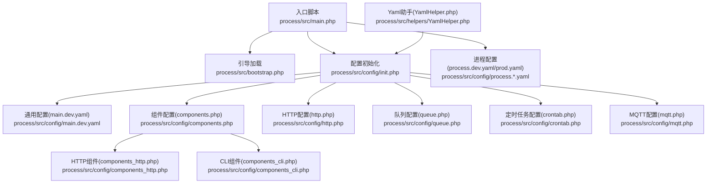
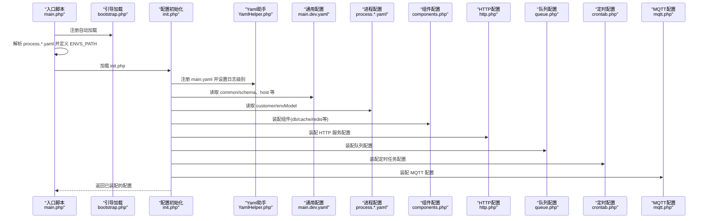
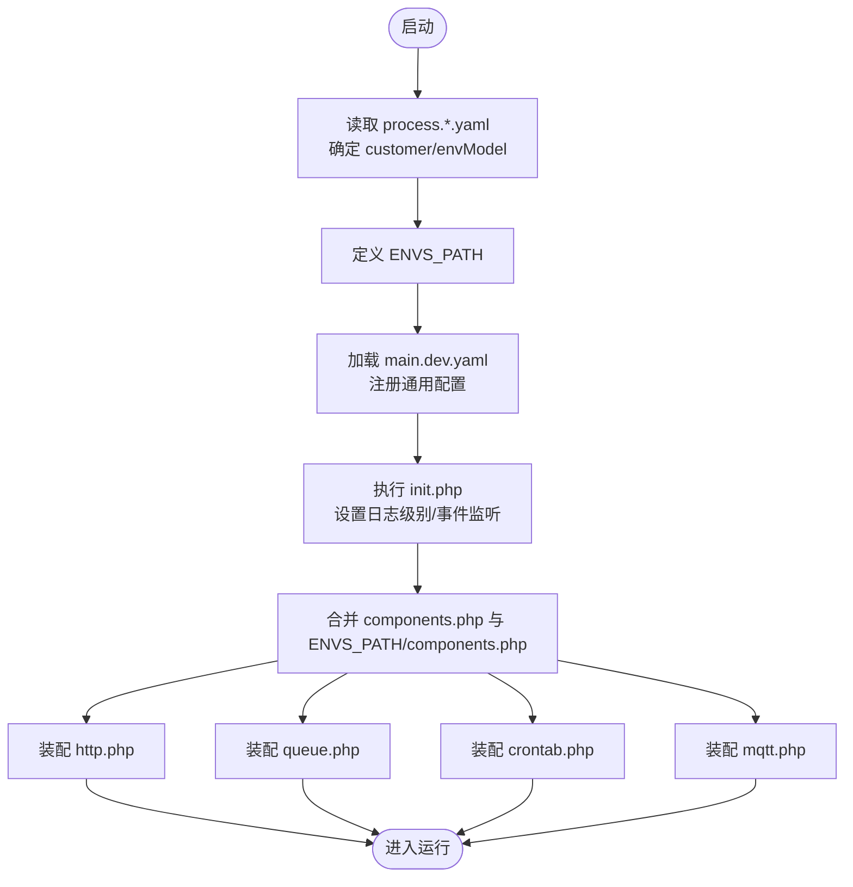
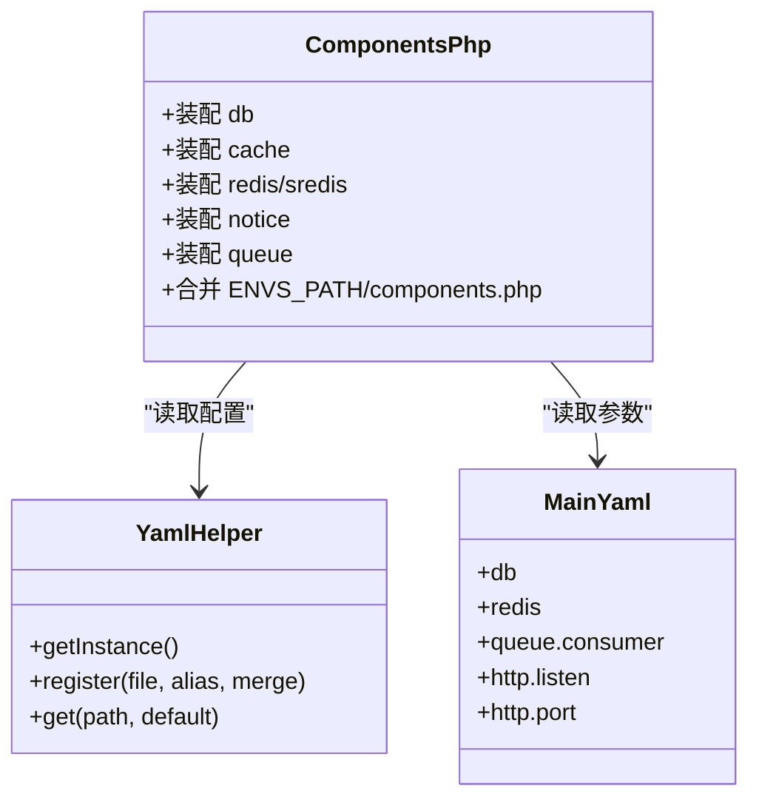
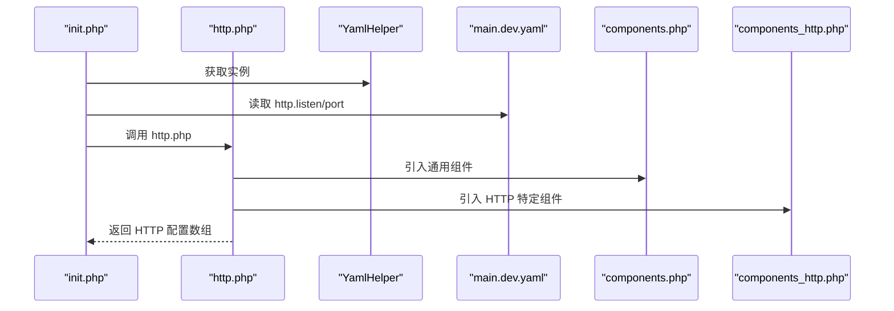
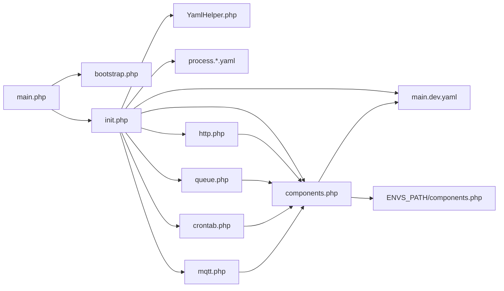

# 配置管理系统

<cite>
**本文引用的文件**
- [process/src/main.php](file://process/src/main.php)
- [process/src/bootstrap.php](file://process/src/bootstrap.php)
- [process/src/config/init.php](file://process/src/config/init.php)
- [process/src/config/main.dev.yaml](file://process/src/config/main.dev.yaml)
- [process/src/config/process.dev.yaml](file://process/src/config/process.dev.yaml)
- [process/src/config/process.prod.yaml](file://process/src/config/process.prod.yaml)
- [process/src/config/http.php](file://process/src/config/http.php)
- [process/src/config/queue.php](file://process/src/config/queue.php)
- [process/src/config/crontab.php](file://process/src/config/crontab.php)
- [process/src/config/mqtt.php](file://process/src/config/mqtt.php)
- [process/src/config/components.php](file://process/src/config/components.php)
- [process/src/config/components_http.php](file://process/src/config/components_http.php)
- [process/src/config/components_cli.php](file://process/src/config/components_cli.php)
- [process/src/helpers/YamlHelper.php](file://process/src/helpers/YamlHelper.php)
</cite>

## 目录
1. [简介](#简介)
2. [项目结构](#项目结构)
3. [核心组件](#核心组件)
4. [架构总览](#架构总览)
5. [详细组件分析](#详细组件分析)
6. [依赖关系分析](#依赖关系分析)
7. [性能考量](#性能考量)
8. [故障排除指南](#故障排除指南)
9. [结论](#结论)
10. [附录](#附录)

## 简介
本文件面向 htdNew 项目的配置管理系统，系统基于 YAML 与 PHP 配置文件组合，结合多租户与环境隔离机制，实现组件配置、HTTP 服务配置、定时任务配置与 MQTT 配置的统一管理。文档重点阐述以下内容：
- 配置层次结构与加载优先级
- 组件配置、HTTP 配置、定时任务配置、MQTT 配置的参数说明与使用方法
- 多租户配置管理与环境隔离
- 动态配置更新与热更新策略
- 配置验证、回滚与最佳实践
- 故障排除与开发指南

## 项目结构
配置系统围绕 process/src/config 目录展开，并通过 process/src/main.php 初始化加载流程，结合 ENVS_PATH 实现按客户与环境的差异化配置覆盖。

图表来源
- [process/src/main.php](file://process/src/main.php#L1-L25)
- [process/src/bootstrap.php](file://process/src/bootstrap.php#L1-L40)
- [process/src/config/init.php](file://process/src/config/init.php#L1-L48)
- [process/src/config/main.dev.yaml](file://process/src/config/main.dev.yaml#L1-L97)
- [process/src/config/process.dev.yaml](file://process/src/config/process.dev.yaml#L1-L89)
- [process/src/config/process.prod.yaml](file://process/src/config/process.prod.yaml#L1-L80)
- [process/src/config/http.php](file://process/src/config/http.php#L1-L27)
- [process/src/config/queue.php](file://process/src/config/queue.php#L1-L13)
- [process/src/config/crontab.php](file://process/src/config/crontab.php#L1-L10)
- [process/src/config/mqtt.php](file://process/src/config/mqtt.php#L1-L10)
- [process/src/config/components.php](file://process/src/config/components.php#L1-L34)
- [process/src/config/components_http.php](file://process/src/config/components_http.php#L1-L33)
- [process/src/config/components_cli.php](file://process/src/config/components_cli.php#L1-L3)
- [process/src/helpers/YamlHelper.php](file://process/src/helpers/YamlHelper.php#L1-L8)

章节来源
- [process/src/main.php](file://process/src/main.php#L1-L25)
- [process/src/bootstrap.php](file://process/src/bootstrap.php#L1-L40)
- [process/src/config/init.php](file://process/src/config/init.php#L1-L48)

## 核心组件
- 配置加载与优先级
  - 进程启动时读取 process.*.yaml 决定运行模式、进程数量与业务配置文件路径。
  - 通过 ENVS_PATH 定位多租户与环境差异化配置，实现“环境层”覆盖“通用层”。
  - 通用配置 main.dev.yaml 提供基础组件与服务参数；业务配置 http.php/queue.php/crontab.php/mqtt.php 仅注入运行期所需片段。
- 组件配置
  - components.php 聚合 db、cache、redis/sredis、notice、queue 等核心组件，并支持 ENVS_PATH 下的组件叠加。
- HTTP 配置
  - http.php 从 YAML 读取 http.listen/port，并合并 components 与 components_http 的路由与用户会话组件。
- 队列与定时任务
  - queue.php 读取 YAML 中的 queue.consumer 默认消费并发设置；crontab.php 合并 CLI 组件用于计划任务执行。
- MQTT 配置
  - mqtt.php 从 YAML 读取 mqtt 段落，为空则返回空数组，便于按需启用。

章节来源
- [process/src/config/process.dev.yaml](file://process/src/config/process.dev.yaml#L1-L89)
- [process/src/config/process.prod.yaml](file://process/src/config/process.prod.yaml#L1-L80)
- [process/src/config/main.dev.yaml](file://process/src/config/main.dev.yaml#L1-L97)
- [process/src/config/components.php](file://process/src/config/components.php#L1-L34)
- [process/src/config/http.php](file://process/src/config/http.php#L1-L27)
- [process/src/config/queue.php](file://process/src/config/queue.php#L1-L13)
- [process/src/config/crontab.php](file://process/src/config/crontab.php#L1-L10)
- [process/src/config/mqtt.php](file://process/src/config/mqtt.php#L1-L10)

## 架构总览
下图展示配置加载与运行期装配的关键交互：

图表来源
- [process/src/main.php](file://process/src/main.php#L1-L25)
- [process/src/bootstrap.php](file://process/src/bootstrap.php#L1-L40)
- [process/src/config/init.php](file://process/src/config/init.php#L1-L48)
- [process/src/helpers/YamlHelper.php](file://process/src/helpers/YamlHelper.php#L1-L8)
- [process/src/config/main.dev.yaml](file://process/src/config/main.dev.yaml#L1-L97)
- [process/src/config/process.dev.yaml](file://process/src/config/process.dev.yaml#L1-L89)
- [process/src/config/components.php](file://process/src/config/components.php#L1-L34)
- [process/src/config/http.php](file://process/src/config/http.php#L1-L27)
- [process/src/config/queue.php](file://process/src/config/queue.php#L1-L13)
- [process/src/config/crontab.php](file://process/src/config/crontab.php#L1-L10)
- [process/src/config/mqtt.php](file://process/src/config/mqtt.php#L1-L10)

## 详细组件分析

### 配置层次与加载优先级
- 层次结构
  - 通用层：process/src/config/main.dev.yaml 提供公共参数（如 http 监听、db/redis 配置、日志级别等）。
  - 进程层：process/src/config/process.dev.yaml 或 process.prod.yaml 定义进程模型、进程数量、CPU 亲和与业务配置文件路径。
  - 环境层：ENVS_PATH 下的 components.php、routes.php、events.php 等文件对通用层进行增量覆盖。
  - 运行层：http.php/queue.php/crontab.php/mqtt.php 仅注入当前进程所需的片段。
- 优先级规则
  - 环境层覆盖通用层（例如 ENVS_PATH/components.php 与通用 components.php 合并，后者可被前者覆盖）。
  - 进程层决定是否启用某类进程及业务配置文件路径，但不改变通用层的全局参数。
  - 运行层仅影响对应进程的运行配置，不影响其他进程或通用层。

图表来源
- [process/src/main.php](file://process/src/main.php#L1-L25)
- [process/src/config/init.php](file://process/src/config/init.php#L1-L48)
- [process/src/config/main.dev.yaml](file://process/src/config/main.dev.yaml#L1-L97)
- [process/src/config/components.php](file://process/src/config/components.php#L1-L34)
- [process/src/config/http.php](file://process/src/config/http.php#L1-L27)
- [process/src/config/queue.php](file://process/src/config/queue.php#L1-L13)
- [process/src/config/crontab.php](file://process/src/config/crontab.php#L1-L10)
- [process/src/config/mqtt.php](file://process/src/config/mqtt.php#L1-L10)

章节来源
- [process/src/main.php](file://process/src/main.php#L1-L25)
- [process/src/config/init.php](file://process/src/config/init.php#L1-L48)
- [process/src/config/process.dev.yaml](file://process/src/config/process.dev.yaml#L1-L89)
- [process/src/config/process.prod.yaml](file://process/src/config/process.prod.yaml#L1-L80)
- [process/src/config/components.php](file://process/src/config/components.php#L1-L34)

### 组件配置（components.php）
- 职责
  - 装配 db、cache、redis/sredis、notice、queue 等核心组件。
  - 从 YAML 读取 db/redis 参数，并对 redis/sredis 做序列化策略区分。
  - 支持 ENVS_PATH/components.php 对通用组件进行增量覆盖。
- 关键点
  - redis 与 sredis 分离，分别用于不同序列化需求。
  - 组件最终与 HTTP/队列/定时任务配置合并后注入到对应进程。

图表来源
- [process/src/config/components.php](file://process/src/config/components.php#L1-L34)
- [process/src/helpers/YamlHelper.php](file://process/src/helpers/YamlHelper.php#L1-L8)
- [process/src/config/main.dev.yaml](file://process/src/config/main.dev.yaml#L1-L97)

章节来源
- [process/src/config/components.php](file://process/src/config/components.php#L1-L34)
- [process/src/config/main.dev.yaml](file://process/src/config/main.dev.yaml#L1-L97)
- [process/src/helpers/YamlHelper.php](file://process/src/helpers/YamlHelper.php#L1-L8)

### HTTP 配置（http.php）
- 职责
  - 从 YAML 读取 http.listen 与 http.port。
  - 合并 components.php 与 components_http.php，注入路由、用户与会话组件。
  - 提供错误处理器配置。
- 关键点
  - 支持监听 0.0.0.0 或本地 127.0.0.1，以及 UNIX Socket。
  - 路由规则优先匹配 envs 下 routes.php，再回退到 components_http.php 的默认规则。

图表来源
- [process/src/config/http.php](file://process/src/config/http.php#L1-L27)
- [process/src/config/components.php](file://process/src/config/components.php#L1-L34)
- [process/src/config/components_http.php](file://process/src/config/components_http.php#L1-L33)
- [process/src/config/main.dev.yaml](file://process/src/config/main.dev.yaml#L1-L97)

章节来源
- [process/src/config/http.php](file://process/src/config/http.php#L1-L27)
- [process/src/config/components_http.php](file://process/src/config/components_http.php#L1-L33)
- [process/src/config/main.dev.yaml](file://process/src/config/main.dev.yaml#L1-L97)

### 队列配置（queue.php）
- 职责
  - 从 YAML 读取 queue.consumer 的默认并发设置。
  - 合并通用组件，作为队列进程的运行配置。
- 关键点
  - 通过 ENVS_PATH/components.php 可对队列组件进行定制。

章节来源
- [process/src/config/queue.php](file://process/src/config/queue.php#L1-L13)
- [process/src/config/main.dev.yaml](file://process/src/config/main.dev.yaml#L1-L97)
- [process/src/config/components.php](file://process/src/config/components.php#L1-L34)

### 定时任务配置（crontab.php）
- 职责
  - 合并通用组件与 CLI 组件，用于计划任务进程。
- 关键点
  - 与 process.*.yaml 中的 crontab 进程定义配合使用。

章节来源
- [process/src/config/crontab.php](file://process/src/config/crontab.php#L1-L10)
- [process/src/config/components.php](file://process/src/config/components.php#L1-L34)
- [process/src/config/components_cli.php](file://process/src/config/components_cli.php#L1-L3)

### MQTT 配置（mqtt.php）
- 职责
  - 从 YAML 读取 mqtt 段落；若为空则返回空数组，便于按需启用。
- 关键点
  - 与 process.*.yaml 中的 mqtt 进程定义配合使用。

章节来源
- [process/src/config/mqtt.php](file://process/src/config/mqtt.php#L1-L10)
- [process/src/config/main.dev.yaml](file://process/src/config/main.dev.yaml#L1-L97)
- [process/src/config/process.dev.yaml](file://process/src/config/process.dev.yaml#L1-L89)
- [process/src/config/process.prod.yaml](file://process/src/config/process.prod.yaml#L1-L80)

### 多租户与环境隔离
- ENVS_PATH 生成逻辑
  - 依据 process.*.yaml 中的 customer 与 envModel 字段拼接出 ENVS_PATH，从而实现按客户与环境的差异化配置。
- 覆盖策略
  - components.php 与 ENVS_PATH/components.php 合并，后者可覆盖前者同名键。
  - routes.php 与 events.php 可在 ENVS_PATH 下按需注入自定义路由与事件监听器。

章节来源
- [process/src/main.php](file://process/src/main.php#L1-L25)
- [process/src/config/init.php](file://process/src/config/init.php#L1-L48)
- [process/src/config/components.php](file://process/src/config/components.php#L1-L34)
- [process/src/config/components_http.php](file://process/src/config/components_http.php#L1-L33)

### 动态配置更新与热更新
- 运行期可更新的配置
  - http.php、queue.php、crontab.php、mqtt.php 等业务配置文件可在不重启主进程的情况下生效（进程内按需重新加载）。
- 文件监控与自动重启
  - process.dev.yaml 中提供 watcher 进程用于监控文件变化并自动重启工作进程；但该机制不适用于进程类定义与本配置文件本身的变更。
- 回滚策略建议
  - 在更新业务配置文件前保留备份；若异常可通过回滚至上一版本恢复。
  - 对于关键参数（如 db/redis），建议先在测试环境验证后再推广。

章节来源
- [process/src/config/process.dev.yaml](file://process/src/config/process.dev.yaml#L1-L89)
- [process/src/config/process.prod.yaml](file://process/src/config/process.prod.yaml#L1-L80)

## 依赖关系分析
- 组件耦合
  - components.php 是配置装配的核心，被 http.php/queue.php/crontab.php/mqtt.php 间接依赖。
  - components_http.php 仅在 HTTP 进程中使用，与队列/定时/ MQTT 进程解耦。
- 外部依赖
  - Swoole 协程与 Guzzle SwooleHandler 在入口脚本中启用，影响 HTTP 请求行为。
  - YamlHelper 扩展自框架底层实现，提供统一的 YAML 读取能力。

图表来源
- [process/src/main.php](file://process/src/main.php#L1-L25)
- [process/src/bootstrap.php](file://process/src/bootstrap.php#L1-L40)
- [process/src/config/init.php](file://process/src/config/init.php#L1-L48)
- [process/src/helpers/YamlHelper.php](file://process/src/helpers/YamlHelper.php#L1-L8)
- [process/src/config/main.dev.yaml](file://process/src/config/main.dev.yaml#L1-L97)
- [process/src/config/process.dev.yaml](file://process/src/config/process.dev.yaml#L1-L89)
- [process/src/config/components.php](file://process/src/config/components.php#L1-L34)
- [process/src/config/http.php](file://process/src/config/http.php#L1-L27)
- [process/src/config/queue.php](file://process/src/config/queue.php#L1-L13)
- [process/src/config/crontab.php](file://process/src/config/crontab.php#L1-L10)
- [process/src/config/mqtt.php](file://process/src/config/mqtt.php#L1-L10)

章节来源
- [process/src/main.php](file://process/src/main.php#L1-L25)
- [process/src/config/init.php](file://process/src/config/init.php#L1-L48)
- [process/src/config/components.php](file://process/src/config/components.php#L1-L34)

## 性能考量
- 进程与 CPU 亲和
  - 生产环境可配置 http 进程的 number 与 affinity，确保主服务独占核心并提升吞吐。
- 队列并发
  - 通过 queue.consumer 的并发设置调整消费者数量，平衡处理能力与资源占用。
- 日志级别
  - 在 main.dev.yaml 中设置 log.logLevel，避免在高并发场景下产生过多 I/O。

章节来源
- [process/src/config/process.prod.yaml](file://process/src/config/process.prod.yaml#L1-L80)
- [process/src/config/main.dev.yaml](file://process/src/config/main.dev.yaml#L1-L97)

## 故障排除指南
- 启动失败或找不到类
  - 检查 ENVS_PATH 是否正确生成（由 process.*.yaml 的 customer/envModel 决定）。
  - 确认 bootstrap.php 的自动加载映射是否覆盖到 envs 命名空间。
- 配置未生效
  - 确认业务配置文件路径与 process.*.yaml 中的 configFile 一致。
  - 若使用 watcher，请确认文件监控范围与权限。
- 组件装配异常
  - 检查 components.php 中 db/redis 参数是否与 main.dev.yaml 一致。
  - 确认 ENVS_PATH/components.php 是否存在语法错误或键名冲突。
- HTTP 路由问题
  - 确认 ENVS_PATH/routes.php 是否正确合并到 components_http.php 的规则之前。
- 日志级别与输出
  - 在 init.php 中设置日志级别后，检查日志路径与权限。

章节来源
- [process/src/main.php](file://process/src/main.php#L1-L25)
- [process/src/bootstrap.php](file://process/src/bootstrap.php#L1-L40)
- [process/src/config/init.php](file://process/src/config/init.php#L1-L48)
- [process/src/config/components.php](file://process/src/config/components.php#L1-L34)
- [process/src/config/components_http.php](file://process/src/config/components_http.php#L1-L33)
- [process/src/config/process.dev.yaml](file://process/src/config/process.dev.yaml#L1-L89)

## 结论
本配置管理系统通过“通用层—进程层—环境层—运行层”的分层设计，实现了灵活的多租户与环境隔离；借助 ENVS_PATH 与 YAML 辅助工具，既保证了配置的一致性，又允许按需覆盖。HTTP、队列、定时与 MQTT 的配置均以轻量片段注入，便于运行期动态更新与热切换。建议在生产环境中严格遵循“先测试、后上线、有备份、可回滚”的原则，确保系统稳定运行。

## 附录
- 开发指南
  - 新增业务配置：在对应进程配置文件中声明 configFile，并在 ENVS_PATH 下提供覆盖文件。
  - 新增组件：在 components.php 中添加组件定义，并在 ENVS_PATH/components.php 进行覆盖。
  - 新增路由：在 ENVS_PATH/routes.php 中追加规则，确保优先级高于默认规则。
- 最佳实践
  - 将易变参数放入业务配置文件，避免修改进程配置导致主进程重启。
  - 对关键参数（db/redis）在测试环境先行验证。
  - 使用 CPU 亲和与并发设置优化性能。
- 配置验证清单
  - process.*.yaml：customer/envModel/进程数量/业务配置文件路径
  - main.dev.yaml：http.listen/port/db/redis/queue.consumer/log.logLevel
  - ENVS_PATH/components.php：组件覆盖项
  - ENVS_PATH/routes.php：路由覆盖项