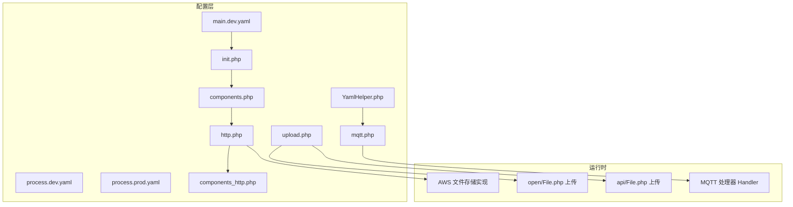
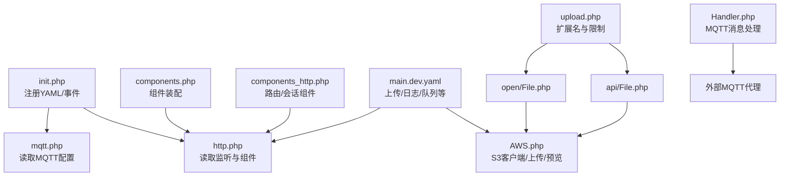
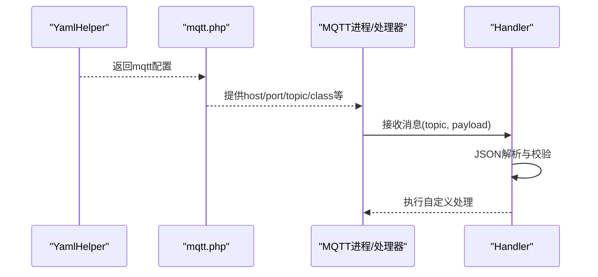
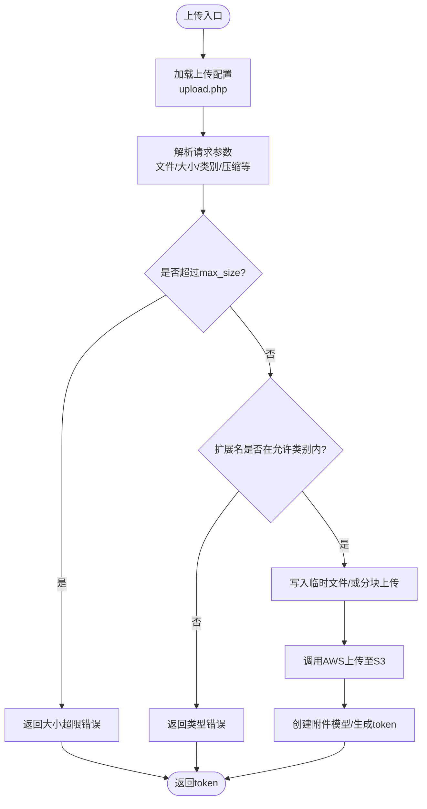
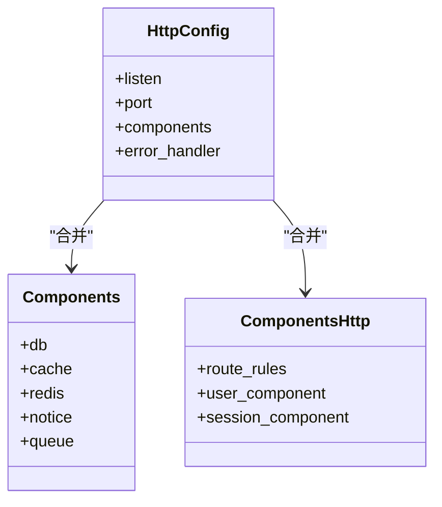
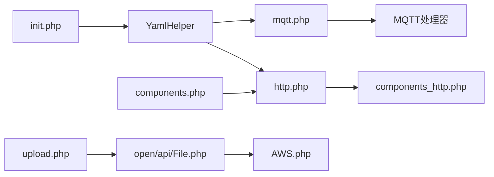

# 集成服务配置

<cite>
**本文引用的文件**
- [mqtt.php](file://process/src/config/mqtt.php)
- [upload.php](file://process/src/config/upload.php)
- [main.dev.yaml](file://process/src/config/main.dev.yaml)
- [process.dev.yaml](file://process/src/config/process.dev.yaml)
- [process.prod.yaml](file://process/src/config/process.prod.yaml)
- [components.php](file://process/src/config/components.php)
- [components_http.php](file://process/src/config/components_http.php)
- [http.php](file://process/src/config/http.php)
- [init.php](file://process/src/config/init.php)
- [YamlHelper.php](file://process/src/helpers/YamlHelper.php)
- [AWS.php](file://process/src/services/storage/AWS.php)
- [File.php（open）](file://process/src/http/open/File.php)
- [File.php（api）](file://process/src/http/api/File.php)
- [Handler.php（MQTT）](file://process/src/services/mqtt/Handler.php)
</cite>

## 目录
1. [引言](#引言)
2. [项目结构](#项目结构)
3. [核心组件](#核心组件)
4. [架构总览](#架构总览)
5. [详细组件分析](#详细组件分析)
6. [依赖关系分析](#依赖关系分析)
7. [性能考量](#性能考量)
8. [故障排除指南](#故障排除指南)
9. [结论](#结论)

## 引言
本文件面向集成服务的配置管理，围绕三类关键配置展开：MQTT 配置（连接、订阅、消息处理与安全）、上传配置（存储路径、类型与大小限制、格式验证与安全策略）、API 配置（接口版本、认证、限流与跨域）。同时提供配置验证、连接测试与常见问题排查方法，帮助运维与开发快速定位与解决问题。

## 项目结构
集成服务的配置主要分布在以下位置：
- YAML 配置：main.dev.yaml、process.dev.yaml、process.prod.yaml
- PHP 配置：config 目录下的 http.php、components.php、components_http.php、upload.php、mqtt.php、init.php
- 辅助工具：helpers/YamlHelper.php
- 存储实现：services/storage/AWS.php
- 上传控制器：http/open/File.php、http/api/File.php
- MQTT 处理器：services/mqtt/Handler.php

**图示来源**
- [main.dev.yaml](file://process/src/config/main.dev.yaml#L1-L97)
- [process.dev.yaml](file://process/src/config/process.dev.yaml#L1-L89)
- [process.prod.yaml](file://process/src/config/process.prod.yaml#L1-L80)
- [http.php](file://process/src/config/http.php#L1-L27)
- [components.php](file://process/src/config/components.php#L1-L34)
- [components_http.php](file://process/src/config/components_http.php#L1-L33)
- [upload.php](file://process/src/config/upload.php#L1-L15)
- [mqtt.php](file://process/src/config/mqtt.php#L1-L10)
- [init.php](file://process/src/config/init.php#L1-L48)
- [YamlHelper.php](file://process/src/helpers/YamlHelper.php#L1-L8)
- [AWS.php](file://process/src/services/storage/AWS.php#L1-L214)
- [File.php（open）](file://process/src/http/open/File.php#L1-L47)
- [File.php（api）](file://process/src/http/api/File.php#L1-L750)
- [Handler.php（MQTT）](file://process/src/services/mqtt/Handler.php#L1-L24)

**章节来源**
- [main.dev.yaml](file://process/src/config/main.dev.yaml#L1-L97)
- [process.dev.yaml](file://process/src/config/process.dev.yaml#L1-L89)
- [process.prod.yaml](file://process/src/config/process.prod.yaml#L1-L80)
- [http.php](file://process/src/config/http.php#L1-L27)
- [components.php](file://process/src/config/components.php#L1-L34)
- [components_http.php](file://process/src/config/components_http.php#L1-L33)
- [upload.php](file://process/src/config/upload.php#L1-L15)
- [mqtt.php](file://process/src/config/mqtt.php#L1-L10)
- [init.php](file://process/src/config/init.php#L1-L48)
- [YamlHelper.php](file://process/src/helpers/YamlHelper.php#L1-L8)
- [AWS.php](file://process/src/services/storage/AWS.php#L1-L214)
- [File.php（open）](file://process/src/http/open/File.php#L1-L47)
- [File.php（api）](file://process/src/http/api/File.php#L1-L750)
- [Handler.php（MQTT）](file://process/src/services/mqtt/Handler.php#L1-L24)

## 核心组件
- MQTT 配置加载：通过 YamlHelper 读取 yaml 中的 mqtt 节点，返回给业务模块使用。
- 上传配置：集中于 upload.php，定义扩展名类别与允许类型集合；上传控制器据此进行类型与大小校验。
- API 配置：http.php 从 YAML 读取监听地址与端口，并合并组件配置；components_http.php 定义路由规则与会话组件。
- 存储配置：main.dev.yaml 的 upload 节点提供对象存储 endpoint/key/secret/bucket 等；AWS 实现封装 S3 客户端与上传/下载能力。
- 初始化：init.php 注册 YAML 配置、设置日志级别、构建全局事件分发器等。

**章节来源**
- [mqtt.php](file://process/src/config/mqtt.php#L1-L10)
- [upload.php](file://process/src/config/upload.php#L1-L15)
- [http.php](file://process/src/config/http.php#L1-L27)
- [components_http.php](file://process/src/config/components_http.php#L1-L33)
- [main.dev.yaml](file://process/src/config/main.dev.yaml#L50-L57)
- [AWS.php](file://process/src/services/storage/AWS.php#L25-L47)
- [init.php](file://process/src/config/init.php#L14-L31)

## 架构总览
下图展示配置到运行时的关键交互：YAML 配置经 init.php 注册后，被 http.php 与 mqtt.php 读取；上传请求由 open/api/File.php 控制器处理，结合 upload.php 与 AWS 存储实现；MQTT 请求由 Handler 接收并处理。

**图示来源**
- [init.php](file://process/src/config/init.php#L14-L31)
- [http.php](file://process/src/config/http.php#L8-L26)
- [components.php](file://process/src/config/components.php#L7-L27)
- [components_http.php](file://process/src/config/components_http.php#L19-L33)
- [main.dev.yaml](file://process/src/config/main.dev.yaml#L50-L57)
- [AWS.php](file://process/src/services/storage/AWS.php#L25-L47)
- [upload.php](file://process/src/config/upload.php#L1-L15)
- [File.php（open）](file://process/src/http/open/File.php#L23-L47)
- [File.php（api）](file://process/src/http/api/File.php#L31-L750)
- [Handler.php（MQTT）](file://process/src/services/mqtt/Handler.php#L1-L24)

## 详细组件分析

### MQTT 配置与处理
- 配置入口
  - mqtt.php 通过 YamlHelper 获取 yaml 中的 mqtt 节点，为空则返回空数组。
  - main.dev.yaml 提供注释示例，说明可配置项包括 host、port、topic、class、username、password、clean_session 等。
  - process.dev.yaml 在注释中给出进程侧的启用方式（如 mqtt 进程），但当前未启用。
- 处理流程
  - 业务侧通过 mqtt.php 获取配置后，交由 MQTT 进程或处理器消费消息。
  - 示例处理器 Handler.php 对特定主题进行 JSON 解析并执行自定义处理逻辑。
- 安全与可靠性
  - 可通过 username/password 进行认证；clean_session 控制会话持久性。
  - 建议在生产环境启用 TLS 并校验证书（当前 AWS 客户端关闭了证书验证，需谨慎评估风险）。

**图示来源**
- [mqtt.php](file://process/src/config/mqtt.php#L1-L10)
- [main.dev.yaml](file://process/src/config/main.dev.yaml#L86-L97)
- [process.dev.yaml](file://process/src/config/process.dev.yaml#L74-L88)
- [Handler.php（MQTT）](file://process/src/services/mqtt/Handler.php#L1-L24)

**章节来源**
- [mqtt.php](file://process/src/config/mqtt.php#L1-L10)
- [main.dev.yaml](file://process/src/config/main.dev.yaml#L86-L97)
- [process.dev.yaml](file://process/src/config/process.dev.yaml#L74-L88)
- [Handler.php（MQTT）](file://process/src/services/mqtt/Handler.php#L1-L24)

### 上传配置与安全策略
- 类型与大小限制
  - upload.php 定义多种扩展名类别（image/document/media/all/excel/word 等），控制器据此校验扩展名。
  - api/File.php 在创建模型时支持 max_size 参数（MB），并对文件大小进行上限检查。
- 存储路径与对象存储
  - main.dev.yaml 的 upload 节点提供 endpoint/key/secret/bucket 等，AWS.php 基于此建立 S3 客户端。
  - AWS.php 支持普通上传、分块上传、缩略图生成、PDF 预览、图片方向修正等。
- 安全策略
  - 受保护文件与 AI 处理需登录态；部分场景要求用户登录后方可操作。
  - 建议在生产环境开启 TLS 并校验证书，避免明文传输敏感文件元数据与内容。
- 上传流程要点
  - open/File.php 与 api/File.php 均在 init 中加载 upload.php，并通过 StorageHelper 获取文件存储实例。
  - 上传成功后生成 token，后续下载/预览通过该 token 与存储路径组合访问。

**图示来源**
- [upload.php](file://process/src/config/upload.php#L1-L15)
- [File.php（api）](file://process/src/http/api/File.php#L131-L161)
- [AWS.php](file://process/src/services/storage/AWS.php#L49-L70)

**章节来源**
- [upload.php](file://process/src/config/upload.php#L1-L15)
- [File.php（open）](file://process/src/http/open/File.php#L23-L47)
- [File.php（api）](file://process/src/http/api/File.php#L31-L750)
- [main.dev.yaml](file://process/src/config/main.dev.yaml#L50-L57)
- [AWS.php](file://process/src/services/storage/AWS.php#L25-L47)

### API 配置与路由
- 监听与组件
  - http.php 从 YAML 读取 listen 与 port，并合并 components 与 components_http。
  - components.php 与 components_http.php 分别注入 db/cache/redis/notice/queue/session 等组件与路由规则。
- 路由与跨域
  - components_http.php 定义多条路由规则，覆盖 envs 优先、短链、文件下载、TXT 校验等。
  - 跨域策略可通过路由规则中的 OPTIONS 方法与控制器响应头进行控制。
- 认证与会话
  - session 组件由 components_http.php 注入，配合控制器进行会话管理。
- 版本与接口
  - API 接口清单由各模块路由与控制器暴露，版本信息通常体现在 URL 与文档链接中。

**图示来源**
- [http.php](file://process/src/config/http.php#L8-L26)
- [components.php](file://process/src/config/components.php#L7-L27)
- [components_http.php](file://process/src/config/components_http.php#L19-L33)

**章节来源**
- [http.php](file://process/src/config/http.php#L8-L26)
- [components.php](file://process/src/config/components.php#L7-L27)
- [components_http.php](file://process/src/config/components_http.php#L1-L33)

## 依赖关系分析
- 配置依赖
  - init.php 注册 main.yaml 并设置日志级别，随后 mqtt.php 与 http.php 通过 YamlHelper 读取配置。
  - components.php 与 components_http.php 作为组件装配与路由规则的聚合入口。
- 运行时依赖
  - 上传控制器依赖 upload.php 与 AWS 存储实现；MQTT 处理器依赖 mqtt.php 配置。
  - 进程配置（process.dev.yaml/process.prod.yaml）决定 HTTP/队列/计划任务等进程数量与启动方式。

**图示来源**
- [init.php](file://process/src/config/init.php#L14-L31)
- [YamlHelper.php](file://process/src/helpers/YamlHelper.php#L1-L8)
- [mqtt.php](file://process/src/config/mqtt.php#L1-L10)
- [http.php](file://process/src/config/http.php#L8-L26)
- [components.php](file://process/src/config/components.php#L7-L27)
- [components_http.php](file://process/src/config/components_http.php#L19-L33)
- [upload.php](file://process/src/config/upload.php#L1-L15)
- [File.php（open）](file://process/src/http/open/File.php#L23-L47)
- [File.php（api）](file://process/src/http/api/File.php#L31-L750)
- [AWS.php](file://process/src/services/storage/AWS.php#L25-L47)

**章节来源**
- [init.php](file://process/src/config/init.php#L14-L31)
- [YamlHelper.php](file://process/src/helpers/YamlHelper.php#L1-L8)
- [mqtt.php](file://process/src/config/mqtt.php#L1-L10)
- [http.php](file://process/src/config/http.php#L8-L26)
- [components.php](file://process/src/config/components.php#L7-L27)
- [components_http.php](file://process/src/config/components_http.php#L19-L33)
- [upload.php](file://process/src/config/upload.php#L1-L15)
- [File.php（open）](file://process/src/http/open/File.php#L23-L47)
- [File.php（api）](file://process/src/http/api/File.php#L31-L750)
- [AWS.php](file://process/src/services/storage/AWS.php#L25-L47)

## 性能考量
- 上传性能
  - AWS.php 支持分块上传与流式写入，适合大文件；建议结合分片大小与并发度优化吞吐。
  - 图片缩略图与 PDF 预览采用按需生成并缓存策略，减少重复计算。
- 连接与资源
  - S3 客户端初始化为惰性模式，避免不必要的连接开销。
  - 日志级别在 init.php 中统一设置，建议在高负载环境调整为 info/warn 以降低日志 IO。
- 进程与并发
  - 生产环境 process.prod.yaml 提供多核亲和与进程数量配置，建议根据 CPU 核心数与业务负载合理分配。

[本节为通用指导，不直接分析具体文件]

## 故障排除指南
- MQTT 连接失败
  - 检查 main.dev.yaml 中的 host/port/username/password/clean_session 是否正确；确认代理可达且未启用强制 TLS。
  - 若启用进程，确认 process.dev.yaml 中对应进程已启用并指向 mqtt.php。
  - 参考路径：[main.dev.yaml](file://process/src/config/main.dev.yaml#L86-L97)、[process.dev.yaml](file://process/src/config/process.dev.yaml#L74-L88)、[mqtt.php](file://process/src/config/mqtt.php#L1-L10)、[Handler.php（MQTT）](file://process/src/services/mqtt/Handler.php#L1-L24)
- 上传失败或类型不被允许
  - 确认扩展名是否在 upload.php 对应类别中；检查 api/File.php 的 max_size 参数与实际文件大小。
  - 若为受保护文件或 AI 处理，需确保已登录。
  - 参考路径：[upload.php](file://process/src/config/upload.php#L1-L15)、[File.php（api）](file://process/src/http/api/File.php#L131-L161)
- 存储访问异常
  - 检查 main.dev.yaml 的 endpoint/key/secret/bucket；确认 S3 服务可用且网络连通。
  - AWS 客户端默认关闭证书验证，生产环境需开启并校验证书。
  - 参考路径：[main.dev.yaml](file://process/src/config/main.dev.yaml#L50-L57)、[AWS.php](file://process/src/services/storage/AWS.php#L25-L47)
- API 无法访问或跨域问题
  - 检查 http.php 的 listen/port 与 components_http.php 的路由规则；确认 OPTIONS 预检与控制器响应头。
  - 参考路径：[http.php](file://process/src/config/http.php#L8-L26)、[components_http.php](file://process/src/config/components_http.php#L1-L33)
- 日志与初始化
  - init.php 设置日志级别与事件分发器，若出现异常可查看日志级别与事件注册情况。
  - 参考路径：[init.php](file://process/src/config/init.php#L14-L31)

**章节来源**
- [main.dev.yaml](file://process/src/config/main.dev.yaml#L50-L57)
- [main.dev.yaml](file://process/src/config/main.dev.yaml#L86-L97)
- [process.dev.yaml](file://process/src/config/process.dev.yaml#L74-L88)
- [mqtt.php](file://process/src/config/mqtt.php#L1-L10)
- [Handler.php（MQTT）](file://process/src/services/mqtt/Handler.php#L1-L24)
- [upload.php](file://process/src/config/upload.php#L1-L15)
- [File.php（api）](file://process/src/http/api/File.php#L131-L161)
- [AWS.php](file://process/src/services/storage/AWS.php#L25-L47)
- [http.php](file://process/src/config/http.php#L8-L26)
- [components_http.php](file://process/src/config/components_http.php#L1-L33)
- [init.php](file://process/src/config/init.php#L14-L31)

## 结论
本文梳理了集成服务的配置体系，明确了 MQTT、上传与 API 的配置要点与运行机制。建议在生产环境中：
- 明确 MQTT 的认证与会话策略，确保代理可达；
- 严格控制上传类型与大小，结合受保护与登录态策略；
- 开启 TLS 并校验证书，提升对象存储与 API 通信安全性；
- 依据业务负载合理配置进程数量与日志级别，持续优化性能与稳定性。