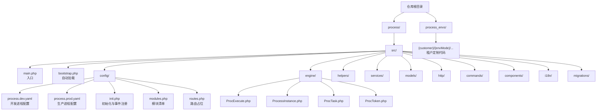
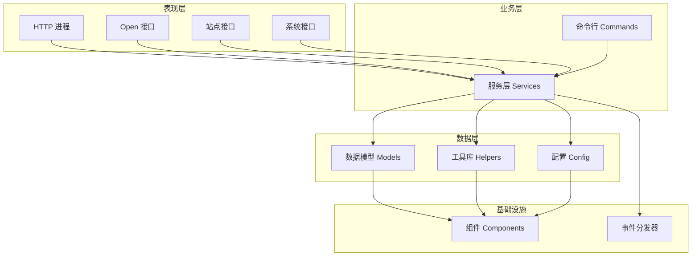
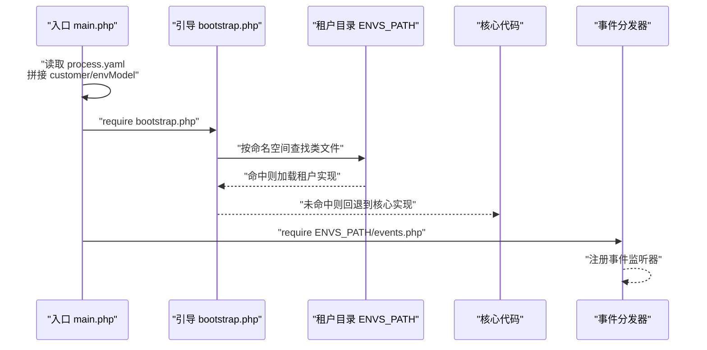
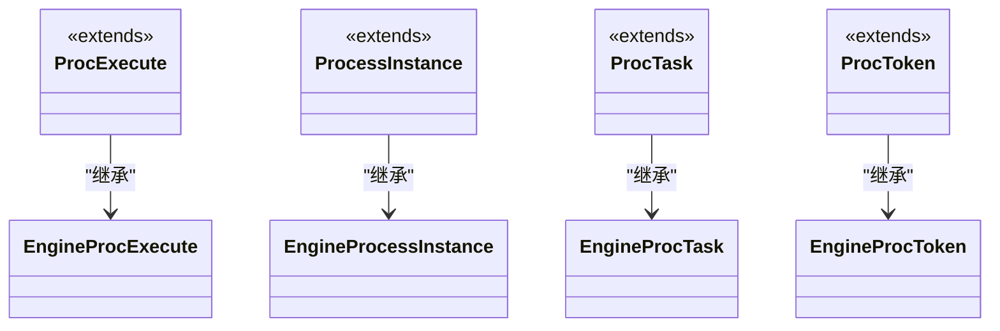
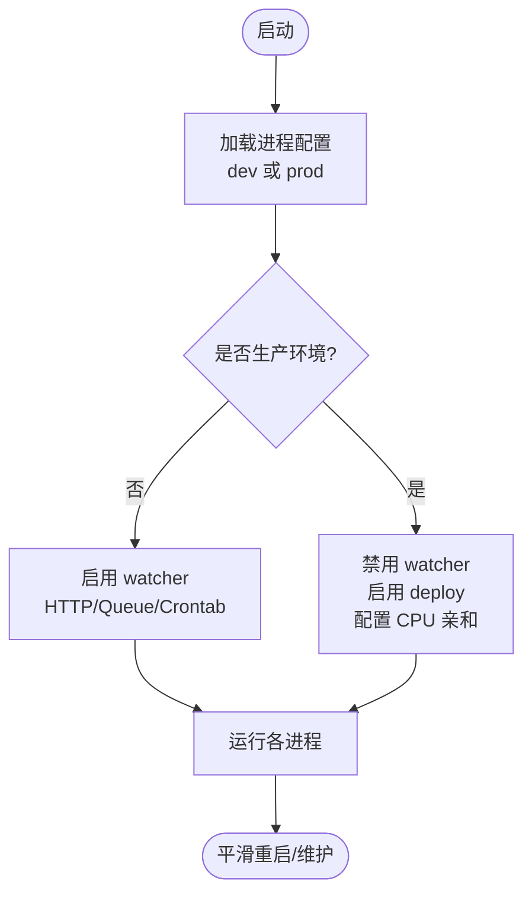
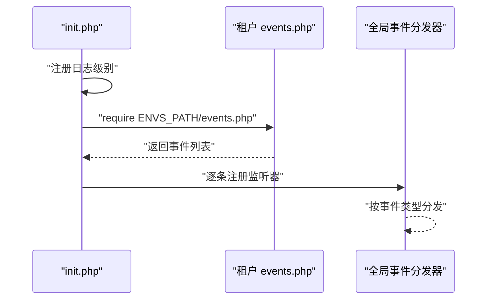
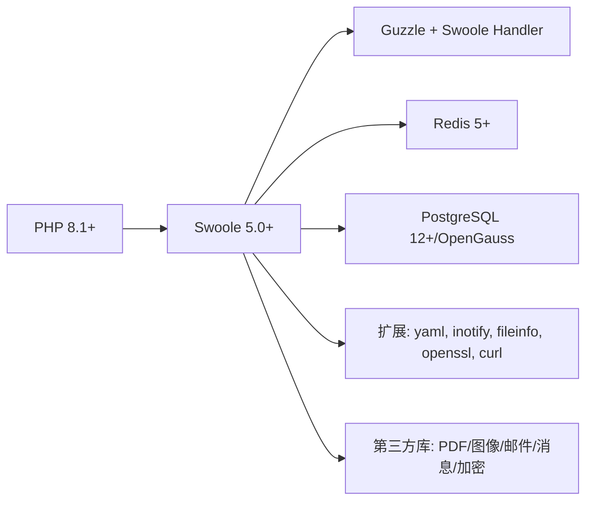

# 项目概述

<cite>
**本文引用的文件**
- [README.md](file://README.md)
- [process/README.MD](file://process/README.MD)
- [process/composer.json](file://process/composer.json)
- [process/src/main.php](file://process/src/main.php)
- [process/src/bootstrap.php](file://process/src/bootstrap.php)
- [process/src/config/init.php](file://process/src/config/init.php)
- [process/src/config/process.dev.yaml](file://process/src/config/process.dev.yaml)
- [process/src/config/process.prod.yaml](file://process/src/config/process.prod.yaml)
- [process/src/config/modules.php](file://process/src/config/modules.php)
- [process/src/config/routes.php](file://process/src/config/routes.php)
- [process/src/engine/ProcExecute.php](file://process/src/engine/ProcExecute.php)
- [process/src/engine/ProcessInstance.php](file://process/src/engine/ProcessInstance.php)
- [process/src/engine/ProcTask.php](file://process/src/engine/ProcTask.php)
- [process/src/engine/ProcToken.php](file://process/src/engine/ProcToken.php)
- [process_envs/](file://process_envs/)
</cite>

## 目录
1. [引言](#引言)
2. [项目结构](#项目结构)
3. [核心组件](#核心组件)
4. [架构总览](#架构总览)
5. [详细组件分析](#详细组件分析)
6. [依赖关系分析](#依赖关系分析)
7. [性能考量](#性能考量)
8. [故障排查指南](#故障排查指南)
9. [结论](#结论)
10. [附录](#附录)

## 引言
本项目是一个基于 PHP 8.1+ 与 Swoole 5.0+ 的企业级流程引擎系统，面向多租户场景，提供高并发、可扩展、可定制的流程编排与执行能力。系统采用分层架构、微服务化进程模型与事件驱动机制相结合的方式，通过 process_envs 目录实现客户级定制化隔离，支持不同客户在统一内核上独立演进业务逻辑。

项目定位与价值：
- 企业级流程引擎：提供流程建模、实例执行、任务流转、状态管理与审计追踪。
- 多租户隔离：以“客户/环境”维度进行代码与配置隔离，确保租户间互不影响。
- 高性能与可观测性：依托 Swoole 协程生态，结合进程化部署与日志/监控体系，保障生产稳定性。
- 可扩展与可维护：模块化组织、事件驱动、命令行工具链与自动化部署，降低变更成本。

## 项目结构
项目采用双根目录组织：
- process：核心代码与配置，包含入口、引导、配置、HTTP/队列/计划任务等进程化模块、引擎与工具库。
- process_envs：客户定制化代码与配置，按“客户/环境/命名空间”的层次组织，实现租户级隔离与扩展。

图表来源
- [process/src/main.php](file://process/src/main.php#L1-L25)
- [process/src/bootstrap.php](file://process/src/bootstrap.php#L1-L40)
- [process/src/config/process.dev.yaml](file://process/src/config/process.dev.yaml#L1-L89)
- [process/src/config/process.prod.yaml](file://process/src/config/process.prod.yaml#L1-L80)
- [process/src/config/init.php](file://process/src/config/init.php#L1-L48)
- [process/src/config/modules.php](file://process/src/config/modules.php#L1-L99)
- [process/src/config/routes.php](file://process/src/config/routes.php#L1-L4)
- [process/src/engine/ProcExecute.php](file://process/src/engine/ProcExecute.php#L1-L11)
- [process/src/engine/ProcessInstance.php](file://process/src/engine/ProcessInstance.php#L1-L11)
- [process/src/engine/ProcTask.php](file://process/src/engine/ProcTask.php#L1-L11)
- [process/src/engine/ProcToken.php](file://process/src/engine/ProcToken.php#L1-L11)

章节来源
- [README.md](file://README.md#L1-L70)
- [process/README.MD](file://process/README.MD#L1-L158)

## 核心组件
- 入口与引导
  - 入口文件负责启用协程、读取进程配置、设置默认 HTTP Handler，并启动框架主流程。
  - 自动加载器支持 vendor 内核、运行时、租户定制代码的动态加载，实现“按需覆盖”的多租户机制。
- 配置与初始化
  - 进程配置（dev/prod）定义主进程、HTTP、队列、计划任务等进程化模块及 CPU 亲和策略。
  - 初始化阶段注册日志级别、全局事件分发器，并从租户路径加载事件订阅配置。
- 引擎内核
  - 对上游引擎类进行轻量封装，保持序列化对象兼容性，作为流程执行、实例、令牌与任务的基础。
- 多租户定制
  - 通过 process_envs 下的“客户/环境”目录，注入命令、HTTP 层、任务、事件、组件等，实现业务逻辑与配置的租户隔离。

章节来源
- [process/src/main.php](file://process/src/main.php#L1-L25)
- [process/src/bootstrap.php](file://process/src/bootstrap.php#L1-L40)
- [process/src/config/init.php](file://process/src/config/init.php#L1-L48)
- [process/src/config/process.dev.yaml](file://process/src/config/process.dev.yaml#L1-L89)
- [process/src/config/process.prod.yaml](file://process/src/config/process.prod.yaml#L1-L80)
- [process/src/engine/ProcExecute.php](file://process/src/engine/ProcExecute.php#L1-L11)
- [process/src/engine/ProcessInstance.php](file://process/src/engine/ProcessInstance.php#L1-L11)
- [process/src/engine/ProcTask.php](file://process/src/engine/ProcTask.php#L1-L11)
- [process/src/engine/ProcToken.php](file://process/src/engine/ProcToken.php#L1-L11)

## 架构总览
系统采用“分层 + 微服务进程 + 事件驱动”的混合架构：
- 分层架构：表现层（HTTP）、业务层（Services）、数据访问层（Models/Helpers）、基础设施（Components/Config）。
- 微服务进程：以“进程”为单位承载不同职责（HTTP、队列、计划任务、部署），便于资源隔离与弹性伸缩。
- 事件驱动：通过全局事件分发器与租户事件配置，解耦业务流程与扩展点，支持插件化与动态扩展。

图表来源
- [process/src/config/process.dev.yaml](file://process/src/config/process.dev.yaml#L18-L89)
- [process/src/config/process.prod.yaml](file://process/src/config/process.prod.yaml#L17-L80)
- [process/src/config/init.php](file://process/src/config/init.php#L32-L46)

## 详细组件分析

### 多租户架构与 process_envs 隔离
- 设计理念
  - 以“客户/环境”为维度划分租户，每个租户拥有独立的命令、HTTP、任务、事件与组件扩展点。
  - 通过自动加载器优先从 ENVS_PATH 加载同名类，实现对核心代码的透明覆盖。
- 实施要点
  - ENVS_PATH 在入口中由 customer 与 envModel 组合生成，确保不同租户与环境的隔离。
  - 事件订阅通过租户 events.php 注册，实现流程生命周期内的插拔式扩展。
- 价值
  - 降低租户间耦合，提升交付效率；支持快速复制与差异化定制。

图表来源
- [process/src/main.php](file://process/src/main.php#L15-L16)
- [process/src/bootstrap.php](file://process/src/bootstrap.php#L26-L28)
- [process/src/config/init.php](file://process/src/config/init.php#L33-L42)

章节来源
- [process/src/main.php](file://process/src/main.php#L15-L16)
- [process/src/bootstrap.php](file://process/src/bootstrap.php#L26-L28)
- [process/src/config/init.php](file://process/src/config/init.php#L33-L42)

### 引擎内核类关系
引擎内核对上游类进行轻量封装，保持序列化对象兼容性，避免因类删除导致历史会话不可恢复。

图表来源
- [process/src/engine/ProcExecute.php](file://process/src/engine/ProcExecute.php#L1-L11)
- [process/src/engine/ProcessInstance.php](file://process/src/engine/ProcessInstance.php#L1-L11)
- [process/src/engine/ProcTask.php](file://process/src/engine/ProcTask.php#L1-L11)
- [process/src/engine/ProcToken.php](file://process/src/engine/ProcToken.php#L1-L11)

章节来源
- [process/src/engine/ProcExecute.php](file://process/src/engine/ProcExecute.php#L1-L11)
- [process/src/engine/ProcessInstance.php](file://process/src/engine/ProcessInstance.php#L1-L11)
- [process/src/engine/ProcTask.php](file://process/src/engine/ProcTask.php#L1-L11)
- [process/src/engine/ProcToken.php](file://process/src/engine/ProcToken.php#L1-L11)

### 进程化部署与运维
- 开发与生产差异
  - 开发环境启用文件监视与热重启能力，适合迭代开发。
  - 生产环境关闭监视，启用部署进程与 CPU 亲和配置，强调稳定与性能。
- 关键进程
  - HTTP 进程：承载 Web 请求。
  - Queue 进程：承载异步任务。
  - Crontab 进程：承载定时任务。
  - Deploy 进程：承载远程拉取与部署能力（生产）。

图表来源
- [process/src/config/process.dev.yaml](file://process/src/config/process.dev.yaml#L24-L89)
- [process/src/config/process.prod.yaml](file://process/src/config/process.prod.yaml#L25-L80)

章节来源
- [process/src/config/process.dev.yaml](file://process/src/config/process.dev.yaml#L1-L89)
- [process/src/config/process.prod.yaml](file://process/src/config/process.prod.yaml#L1-L80)

### 事件驱动与模块化组织
- 事件驱动
  - 初始化阶段从 ENVS_PATH 加载事件配置，注册监听器，实现流程与扩展的解耦。
- 模块化组织
  - modules.php 提供模块清单，用于权限与菜单的统一管理。
  - routes.php 作为路由占位，租户可按需扩展。

图表来源
- [process/src/config/init.php](file://process/src/config/init.php#L32-L46)
- [process/src/config/modules.php](file://process/src/config/modules.php#L1-L99)
- [process/src/config/routes.php](file://process/src/config/routes.php#L1-L4)

章节来源
- [process/src/config/init.php](file://process/src/config/init.php#L1-L48)
- [process/src/config/modules.php](file://process/src/config/modules.php#L1-L99)
- [process/src/config/routes.php](file://process/src/config/routes.php#L1-L4)

## 依赖关系分析
- 技术栈概览
  - PHP 8.1+、Swoole 5.0+、PostgreSQL 12+/OpenGauss、Redis 5+。
  - 第三方库涵盖 HTTP、图像处理、PDF/Word/Excel、MQTT/Kafka、邮件、二维码、加密等。
- 关键依赖
  - Guzzle/Swoole Handler：协程化 HTTP 客户端。
  - Doctrine Cache、Redis：缓存与会话存储。
  - Symfony DomCrawler、FPDF/FPDI：HTML 到 PDF 的渲染与合并。
  - php-mqtt/longlang/phpkafka：消息中间件集成。
- 依赖来源
  - Composer 包与仓库配置、开发/生产依赖分离。

图表来源
- [process/README.MD](file://process/README.MD#L1-L158)
- [process/composer.json](file://process/composer.json#L1-L70)

章节来源
- [process/README.MD](file://process/README.MD#L1-L158)
- [process/composer.json](file://process/composer.json#L1-L70)

## 性能考量
- 协程与事件循环：启用协程 Hook，减少阻塞 IO，提升吞吐。
- 进程化隔离：HTTP/队列/计划任务/部署分别运行在独立进程，避免相互影响。
- CPU 亲和：生产环境可配置 CPU 亲和，降低上下文切换开销。
- 缓存与连接池：结合 Redis 与数据库连接池，降低延迟。
- 平滑重启：通过信号触发主进程平滑重启，保障运维连续性。

## 故障排查指南
- 启动与进程
  - 确认进程配置文件（dev/prod）中的进程数量与 CPU 亲和设置合理。
  - 开发环境启用 watcher 以便自动重启，生产环境关闭。
- 多租户加载
  - 检查 ENVS_PATH 是否正确拼接 customer 与 envModel。
  - 确认租户目录下的类命名空间与文件路径一致，避免自动加载失败。
- 事件注册
  - 若事件未生效，检查 ENVS_PATH/events.php 是否存在且返回合法事件数组。
- 数据库与缓存
  - 核对数据库与 Redis 的连接参数与网络可达性。
- 日志与调试
  - 查看 runtimePath/logPath 下的日志文件，定位异常堆栈。
  - 使用调试端口连接数据库与 Redis 进行验证。

章节来源
- [process/src/config/process.dev.yaml](file://process/src/config/process.dev.yaml#L24-L89)
- [process/src/config/process.prod.yaml](file://process/src/config/process.prod.yaml#L25-L80)
- [process/src/main.php](file://process/src/main.php#L15-L16)
- [process/src/config/init.php](file://process/src/config/init.php#L33-L42)
- [process/README.MD](file://process/README.MD#L77-L96)

## 结论
本项目以“多租户 + 进程化 + 事件驱动”为核心设计思想，结合 Swoole 的高性能特性与完善的进程治理能力，为企业级流程引擎提供了高可用、可扩展、可维护的工程化方案。通过 process_envs 的租户隔离与模块化组织，既能满足大规模客户的差异化需求，又能保持内核的稳定与统一。

## 附录
- 快速开始
  - 参考 process/README.MD 中的环境准备、Docker 启动与示例请求。
- 目录与职责
  - process/src 下的 http、services、models、helpers、config、commands、components 等目录承担相应职责，建议按领域边界进一步细化。
- 租户扩展指引
  - 在 process_envs/{customer}/{envMode} 下新增命令、HTTP 控制器、任务、事件与组件，即可实现租户级定制。

章节来源
- [process/README.MD](file://process/README.MD#L1-L158)
- [README.md](file://README.md#L1-L70)