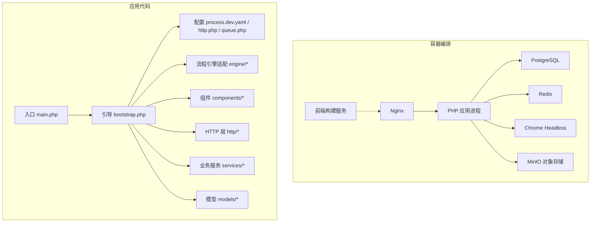
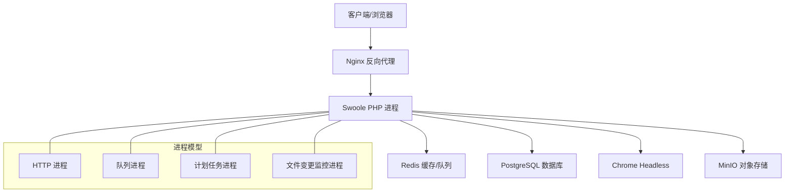
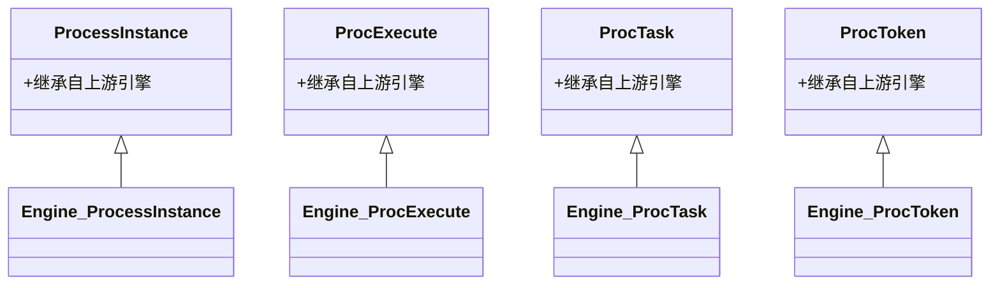
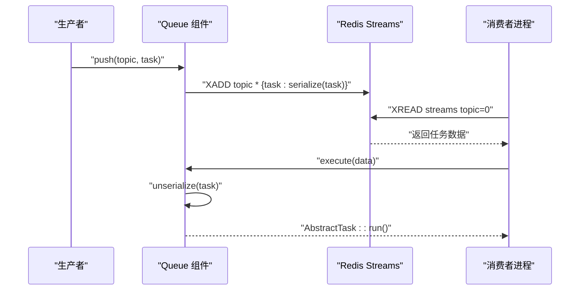
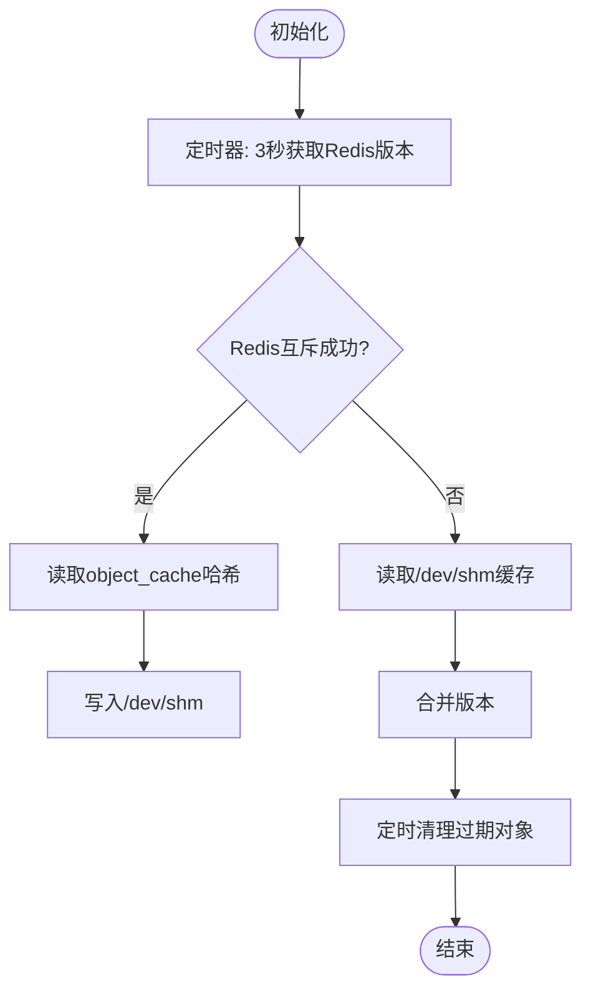
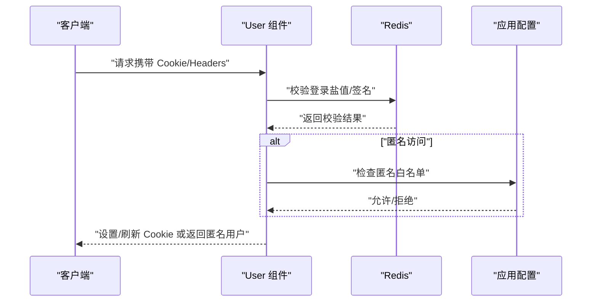
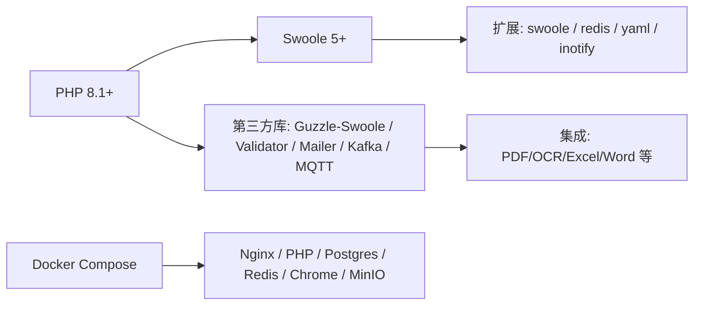

# 项目概述

<cite>
**本文引用的文件**
- [process/README.MD](file://process/README.MD)
- [process/composer.json](file://process/composer.json)
- [process/src/main.php](file://process/src/main.php)
- [process/docker/docker-compose.yml](file://process/docker/docker-compose.yml)
- [process/src/bootstrap.php](file://process/src/bootstrap.php)
- [process/src/engine/ProcessInstance.php](file://process/src/engine/ProcessInstance.php)
- [process/src/engine/ProcExecute.php](file://process/src/engine/ProcExecute.php)
- [process/src/engine/ProcTask.php](file://process/src/engine/ProcTask.php)
- [process/src/engine/ProcToken.php](file://process/src/engine/ProcToken.php)
- [process/src/config/process.dev.yaml](file://process/src/config/process.dev.yaml)
- [process/src/config/http.php](file://process/src/config/http.php)
- [process/src/config/queue.php](file://process/src/config/queue.php)
- [process/src/components/Cache.php](file://process/src/components/Cache.php)
- [process/src/components/Queue.php](file://process/src/components/Queue.php)
- [process/src/components/User.php](file://process/src/components/User.php)
</cite>

## 目录
1. [引言](#引言)
2. [项目结构](#项目结构)
3. [核心组件](#核心组件)
4. [架构总览](#架构总览)
5. [详细组件分析](#详细组件分析)
6. [依赖分析](#依赖分析)
7. [性能考虑](#性能考虑)
8. [故障排查指南](#故障排查指南)
9. [结论](#结论)
10. [附录](#附录)

## 引言
htdNew 是一个基于 Swoole 的高性能 Web 后端框架，围绕“流程引擎 + 多租户 + Docker 化”的企业级应用而设计。项目以 Swoole 协程与事件驱动为核心，结合 PostgreSQL、Redis、Nginx、Chrome Headless 等基础设施，提供高并发、可扩展、可运维的企业级服务能力。其核心目标包括：
- 提供稳定高效的 HTTP/队列/定时任务等多进程模型；
- 通过流程引擎实现复杂业务流程编排与实例化执行；
- 支持多租户隔离与按客户/环境动态加载业务代码；
- 以 Docker Compose 实现本地开发与生产级部署的一致性。

适用场景涵盖高校、政府、医疗、金融等对并发与稳定性要求较高的组织内部系统，如审批流、表单引擎、数据采集与报表、统一认证与单点登录等。

## 项目结构
项目采用“源码 + 环境定制 + Docker 化”的分层组织方式：
- process/docker：容器编排与服务编排（Nginx、PHP、Postgres、Redis、Chrome Headless、MinIO、前端等）
- process/src：PHP 源码，包含入口、引导、配置、HTTP 控制器、流程引擎适配、组件、工具与服务
- process_envs：按客户/环境（custom/envmode）组织的业务定制代码，支持多租户隔离与按需加载
- process/docs/sql：初始化与迁移 SQL

图表来源
- [process/docker/docker-compose.yml](file://process/docker/docker-compose.yml#L1-L150)
- [process/src/main.php](file://process/src/main.php#L1-L25)
- [process/src/bootstrap.php](file://process/src/bootstrap.php#L1-L40)
- [process/src/config/process.dev.yaml](file://process/src/config/process.dev.yaml#L1-L89)
- [process/src/config/http.php](file://process/src/config/http.php#L1-L27)
- [process/src/config/queue.php](file://process/src/config/queue.php#L1-L13)

章节来源
- [process/README.MD](file://process/README.MD#L1-L158)
- [process/docker/docker-compose.yml](file://process/docker/docker-compose.yml#L1-L150)
- [process/src/main.php](file://process/src/main.php#L1-L25)
- [process/src/bootstrap.php](file://process/src/bootstrap.php#L1-L40)

## 核心组件
- 入口与运行时
  - 入口文件负责启用协程钩子、加载配置、设置默认 HTTP Handler，并交由框架主类运行 CLI 参数
  - 引导文件实现按命名空间与目录的自动加载，支持 vendor、runtime、envs 的动态加载
- 配置体系
  - 进程与组件配置：通过 YAML 配置多进程（HTTP、队列、监控、计划任务等），支持热更新业务配置
  - HTTP/队列组件：分别合并通用组件与各自组件配置，统一注入到进程
- 流程引擎适配
  - 在 engine 命名空间下对上游引擎进行轻量封装，确保序列化对象在多进程/多实例间持久化兼容
- 组件层
  - 缓存组件：基于 Redis 维护对象版本与共享内存同步，支持定时清理与跨进程一致性
  - 队列组件：基于 Redis Streams 的任务推送/消费，支持动态消费者数量与任务编码/解码
  - 用户组件：登录态校验、Cookie 签名、匿名访问控制、第三方平台票据校验与登出
- Docker 化
  - 通过 docker-compose 将 Nginx、PHP、Postgres、Redis、Chrome Headless、MinIO、前端构建服务组合，支持开发与生产环境差异配置

章节来源
- [process/src/main.php](file://process/src/main.php#L1-L25)
- [process/src/bootstrap.php](file://process/src/bootstrap.php#L1-L40)
- [process/src/config/process.dev.yaml](file://process/src/config/process.dev.yaml#L1-L89)
- [process/src/config/http.php](file://process/src/config/http.php#L1-L27)
- [process/src/config/queue.php](file://process/src/config/queue.php#L1-L13)
- [process/src/engine/ProcessInstance.php](file://process/src/engine/ProcessInstance.php#L1-L11)
- [process/src/engine/ProcExecute.php](file://process/src/engine/ProcExecute.php#L1-L11)
- [process/src/engine/ProcTask.php](file://process/src/engine/ProcTask.php#L1-L11)
- [process/src/engine/ProcToken.php](file://process/src/engine/ProcToken.php#L1-L11)
- [process/src/components/Cache.php](file://process/src/components/Cache.php#L1-L136)
- [process/src/components/Queue.php](file://process/src/components/Queue.php#L1-L173)
- [process/src/components/User.php](file://process/src/components/User.php#L1-L429)

## 架构总览
htdNew 的整体架构以 Swoole 事件循环为核心，通过多进程模型承载 HTTP 请求、队列任务与计划任务；通过 Redis 与 PostgreSQL 提供缓存与持久化；通过 Docker 将各服务解耦并标准化交付。

图表来源
- [process/docker/docker-compose.yml](file://process/docker/docker-compose.yml#L1-L150)
- [process/src/config/process.dev.yaml](file://process/src/config/process.dev.yaml#L1-L89)

## 详细组件分析

### 组件 A：流程引擎适配
- 设计理念
  - 在 engine 命名空间下对上游引擎类进行轻量继承，保留序列化对象的兼容性，避免因类删除导致历史会话不可恢复
- 关键类关系
  - ProcessInstance、ProcExecute、ProcTask、ProcToken 分别对应流程实例、执行、任务与令牌的适配层
- 数据与生命周期
  - 与 app_session、task_history 等表配合，确保流程状态在多进程/多实例间一致

图表来源
- [process/src/engine/ProcessInstance.php](file://process/src/engine/ProcessInstance.php#L1-L11)
- [process/src/engine/ProcExecute.php](file://process/src/engine/ProcExecute.php#L1-L11)
- [process/src/engine/ProcTask.php](file://process/src/engine/ProcTask.php#L1-L11)
- [process/src/engine/ProcToken.php](file://process/src/engine/ProcToken.php#L1-L11)

章节来源
- [process/src/engine/ProcessInstance.php](file://process/src/engine/ProcessInstance.php#L1-L11)
- [process/src/engine/ProcExecute.php](file://process/src/engine/ProcExecute.php#L1-L11)
- [process/src/engine/ProcTask.php](file://process/src/engine/ProcTask.php#L1-L11)
- [process/src/engine/ProcToken.php](file://process/src/engine/ProcToken.php#L1-L11)

### 组件 B：队列组件（基于 Redis Streams）
- 功能要点
  - 推送任务到指定主题（topic），支持高/中/低优先级主题
  - 消费端反序列化任务并调用抽象任务基类的执行逻辑
  - 支持动态调整消费者数量并通过缓存键持久化配置
- 复杂度与性能
  - 推送/消费为 O(1)，队列长度查询为 O(1)，适合高吞吐场景
  - 通过编码/解码策略兼容不同对象结构，减少序列化失败风险

图表来源
- [process/src/components/Queue.php](file://process/src/components/Queue.php#L1-L173)

章节来源
- [process/src/components/Queue.php](file://process/src/components/Queue.php#L1-L173)

### 组件 C：缓存组件（跨进程对象缓存）
- 设计要点
  - 基于 Redis 维护对象版本哈希，定期从共享内存同步版本，实现跨进程一致性
  - 定时清理过期对象，降低内存占用
- 性能特性
  - 通过互斥锁与共享内存减少 Redis 读压力，提升命中率

图表来源
- [process/src/components/Cache.php](file://process/src/components/Cache.php#L1-L136)

章节来源
- [process/src/components/Cache.php](file://process/src/components/Cache.php#L1-L136)

### 组件 D：用户组件（登录态与匿名访问）
- 功能要点
  - 支持 Cookie 签名校验、临时登录、第三方平台票据校验与登出
  - 区分匿名访问白名单与动态匹配，支持按应用配置匿名策略
- 安全与兼容
  - 针对不同平台设置 Cookie 域名与 SameSite 策略，兼容 HTTPS/HTTP 场景

图表来源
- [process/src/components/User.php](file://process/src/components/User.php#L1-L429)

章节来源
- [process/src/components/User.php](file://process/src/components/User.php#L1-L429)

## 依赖分析
- 运行时与扩展
  - PHP 8.1+、Swoole 5+、Postgres/OpenGauss、Redis 5+
  - 关键扩展：swoole、swoole_postgresql、redis、yaml、inotify（开发）、fileinfo
- 第三方库与集成
  - HTTP 客户端与协程支持：yurunsoft/guzzle-swoole
  - 验证与邮件：particle/validator、symfony/mailer
  - Kafka/MQTT：longlang/phpkafka、php-mqtt/client
  - PDF/OCR/二维码/Excel/Word 等：setasign/fpdf、easyswoole/verifycode、phpoffice/phpspreadsheet 等
- Docker 与部署
  - 通过 docker-compose 统一编排，支持开发与生产环境变量切换

图表来源
- [process/README.MD](file://process/README.MD#L1-L158)
- [process/composer.json](file://process/composer.json#L1-L70)
- [process/docker/docker-compose.yml](file://process/docker/docker-compose.yml#L1-L150)

章节来源
- [process/README.MD](file://process/README.MD#L1-L158)
- [process/composer.json](file://process/composer.json#L1-L70)
- [process/docker/docker-compose.yml](file://process/docker/docker-compose.yml#L1-L150)

## 性能考虑
- 协程与事件驱动
  - 启用协程钩子，使阻塞 I/O 非阻塞化，显著提升并发处理能力
- 多进程模型
  - HTTP/队列/计划任务分离进程，CPU 亲和与进程数量可根据资源弹性配置
- 缓存与队列
  - Redis 作为缓存与队列载体，结合共享内存与互斥锁降低热点竞争
- I/O 优化
  - 通过 Swoole Handler 与协程化网络 I/O，减少上下文切换成本

章节来源
- [process/src/main.php](file://process/src/main.php#L1-L25)
- [process/src/config/process.dev.yaml](file://process/src/config/process.dev.yaml#L1-L89)
- [process/src/components/Cache.php](file://process/src/components/Cache.php#L1-L136)
- [process/src/components/Queue.php](file://process/src/components/Queue.php#L1-L173)

## 故障排查指南
- 启动与环境
  - 确认 PHP/Swoole/Redis/Postgres 版本满足要求，扩展已安装
  - 使用 docker-compose 启动后，确认各容器健康与端口映射
- 平滑重启与维护
  - 生产环境可通过信号平滑重启工作进程；Swarm 环境可强制更新服务
- 调试端口
  - psql 与 Redis 端口可在文档中查看，默认凭据用于本地调试
- 日志与可观测性
  - Grafana 链路可用于查看日志与指标（生产环境）

章节来源
- [process/README.MD](file://process/README.MD#L1-L158)

## 结论
htdNew 以 Swoole 为核心，结合流程引擎、多租户与 Docker 化，形成一套高并发、可扩展、易运维的企业级后端方案。其关键优势在于：
- 基于协程的高性能 I/O 处理与多进程分工
- 流程引擎的强健实例化与序列化兼容
- 多租户按客户/环境动态加载，便于规模化复制
- Docker 统一编排，开发与生产一致

这些特性使其适用于需要高并发、复杂流程编排与多租户隔离的组织内部系统。

## 附录
- 快速上手
  - 安装依赖、准备环境变量与配置文件，启动容器并访问示例接口验证
- 目录结构与职责
  - 按模块划分清晰，便于扩展与维护；环境定制通过 process_envs 实现

章节来源
- [process/README.MD](file://process/README.MD#L1-L158)